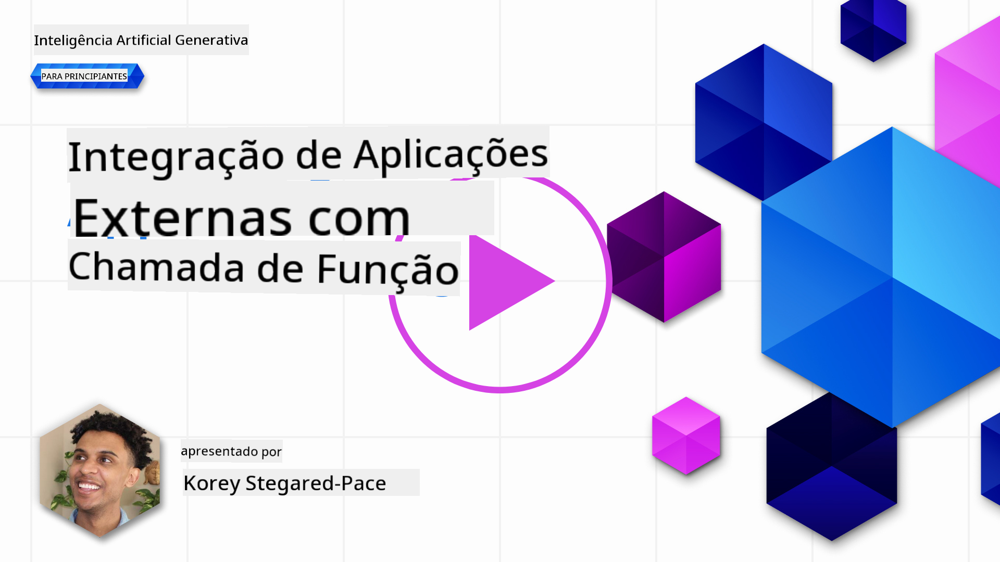
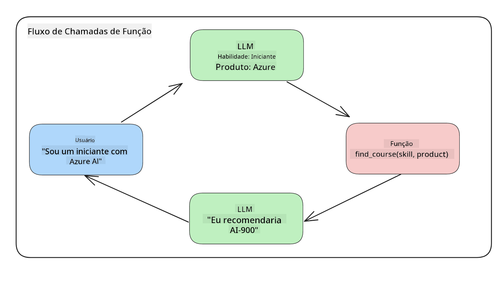
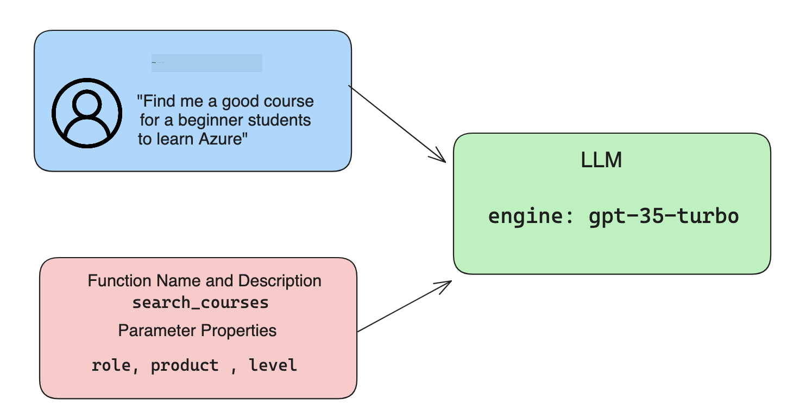

<!--
CO_OP_TRANSLATOR_METADATA:
{
  "original_hash": "77a48a201447be19aa7560706d6f93a0",
  "translation_date": "2025-07-09T14:31:07+00:00",
  "source_file": "11-integrating-with-function-calling/README.md",
  "language_code": "pt"
}
-->
# Integração com chamadas de função

[](https://aka.ms/gen-ai-lesson11-gh?WT.mc_id=academic-105485-koreyst)

Já aprendeste bastante nas lições anteriores. No entanto, podemos melhorar ainda mais. Alguns aspetos que podemos abordar são como obter um formato de resposta mais consistente para facilitar o trabalho com a resposta posteriormente. Além disso, podemos querer adicionar dados de outras fontes para enriquecer ainda mais a nossa aplicação.

Os problemas mencionados acima são o que este capítulo pretende resolver.

## Introdução

Esta lição irá abordar:

- Explicar o que é a chamada de função e os seus casos de uso.
- Criar uma chamada de função usando Azure OpenAI.
- Como integrar uma chamada de função numa aplicação.

## Objetivos de Aprendizagem

No final desta lição, serás capaz de:

- Explicar o propósito de usar chamadas de função.
- Configurar a Chamada de Função usando o Azure OpenAI Service.
- Projetar chamadas de função eficazes para o caso de uso da tua aplicação.

## Cenário: Melhorar o nosso chatbot com funções

Para esta lição, queremos construir uma funcionalidade para a nossa startup de educação que permita aos utilizadores usar um chatbot para encontrar cursos técnicos. Vamos recomendar cursos que se adequem ao seu nível de competência, função atual e tecnologia de interesse.

Para completar este cenário, vamos usar uma combinação de:

- `Azure OpenAI` para criar uma experiência de chat para o utilizador.
- `Microsoft Learn Catalog API` para ajudar os utilizadores a encontrar cursos com base no pedido do utilizador.
- `Function Calling` para pegar na consulta do utilizador e enviá-la para uma função que faça o pedido à API.

Para começar, vejamos por que razão queremos usar chamadas de função em primeiro lugar:

## Por que usar chamadas de função

Antes das chamadas de função, as respostas de um LLM eram não estruturadas e inconsistentes. Os programadores tinham de escrever código complexo de validação para garantir que conseguiam lidar com cada variação de resposta. Os utilizadores não conseguiam obter respostas como "Qual é o tempo atual em Estocolmo?". Isto porque os modelos estavam limitados ao momento em que os dados foram treinados.

A Chamada de Função é uma funcionalidade do Azure OpenAI Service para ultrapassar as seguintes limitações:

- **Formato de resposta consistente**. Se conseguirmos controlar melhor o formato da resposta, podemos integrar essa resposta mais facilmente em sistemas posteriores.
- **Dados externos**. Capacidade de usar dados de outras fontes de uma aplicação num contexto de chat.

## Ilustrar o problema através de um cenário

> Recomendamos que uses o [notebook incluído](../../../11-integrating-with-function-calling/python/aoai-assignment.ipynb) se quiseres executar o cenário abaixo. Também podes simplesmente acompanhar a leitura enquanto tentamos ilustrar um problema onde as funções podem ajudar a resolvê-lo.

Vamos ver um exemplo que ilustra o problema do formato da resposta:

Suponhamos que queremos criar uma base de dados com dados de estudantes para podermos sugerir o curso certo para eles. Abaixo temos duas descrições de estudantes que são muito semelhantes nos dados que contêm.

1. Criar uma ligação ao nosso recurso Azure OpenAI:

   ```python
   import os
   import json
   from openai import AzureOpenAI
   from dotenv import load_dotenv
   load_dotenv()

   client = AzureOpenAI(
   api_key=os.environ['AZURE_OPENAI_API_KEY'],  # this is also the default, it can be omitted
   api_version = "2023-07-01-preview"
   )

   deployment=os.environ['AZURE_OPENAI_DEPLOYMENT']
   ```

   Abaixo está algum código Python para configurar a nossa ligação ao Azure OpenAI onde definimos `api_type`, `api_base`, `api_version` e `api_key`.

1. Criar duas descrições de estudantes usando as variáveis `student_1_description` e `student_2_description`.

   ```python
   student_1_description="Emily Johnson is a sophomore majoring in computer science at Duke University. She has a 3.7 GPA. Emily is an active member of the university's Chess Club and Debate Team. She hopes to pursue a career in software engineering after graduating."

   student_2_description = "Michael Lee is a sophomore majoring in computer science at Stanford University. He has a 3.8 GPA. Michael is known for his programming skills and is an active member of the university's Robotics Club. He hopes to pursue a career in artificial intelligence after finishing his studies."
   ```

   Queremos enviar as descrições dos estudantes acima para um LLM para analisar os dados. Estes dados podem depois ser usados na nossa aplicação e enviados para uma API ou armazenados numa base de dados.

1. Vamos criar dois prompts idênticos nos quais instruímos o LLM sobre a informação que nos interessa:

   ```python
   prompt1 = f'''
   Please extract the following information from the given text and return it as a JSON object:

   name
   major
   school
   grades
   club

   This is the body of text to extract the information from:
   {student_1_description}
   '''

   prompt2 = f'''
   Please extract the following information from the given text and return it as a JSON object:

   name
   major
   school
   grades
   club

   This is the body of text to extract the information from:
   {student_2_description}
   '''
   ```

   Os prompts acima instruem o LLM a extrair informação e a devolver a resposta em formato JSON.

1. Depois de configurar os prompts e a ligação ao Azure OpenAI, vamos agora enviar os prompts para o LLM usando `openai.ChatCompletion`. Armazenamos o prompt na variável `messages` e atribuímos o papel `user`. Isto é para simular uma mensagem de um utilizador a ser escrita para um chatbot.

   ```python
   # response from prompt one
   openai_response1 = client.chat.completions.create(
   model=deployment,
   messages = [{'role': 'user', 'content': prompt1}]
   )
   openai_response1.choices[0].message.content

   # response from prompt two
   openai_response2 = client.chat.completions.create(
   model=deployment,
   messages = [{'role': 'user', 'content': prompt2}]
   )
   openai_response2.choices[0].message.content
   ```

Agora podemos enviar ambos os pedidos ao LLM e examinar a resposta que recebemos encontrando-a assim: `openai_response1['choices'][0]['message']['content']`.

1. Por fim, podemos converter a resposta para formato JSON chamando `json.loads`:

   ```python
   # Loading the response as a JSON object
   json_response1 = json.loads(openai_response1.choices[0].message.content)
   json_response1
   ```

   Resposta 1:

   ```json
   {
     "name": "Emily Johnson",
     "major": "computer science",
     "school": "Duke University",
     "grades": "3.7",
     "club": "Chess Club"
   }
   ```

   Resposta 2:

   ```json
   {
     "name": "Michael Lee",
     "major": "computer science",
     "school": "Stanford University",
     "grades": "3.8 GPA",
     "club": "Robotics Club"
   }
   ```

   Embora os prompts sejam iguais e as descrições sejam semelhantes, vemos que os valores da propriedade `Grades` estão formatados de forma diferente, pois por vezes obtemos o formato `3.7` ou `3.7 GPA`, por exemplo.

   Este resultado acontece porque o LLM recebe dados não estruturados na forma do prompt escrito e devolve também dados não estruturados. Precisamos de um formato estruturado para sabermos o que esperar ao armazenar ou usar estes dados.

Então, como resolvemos o problema do formato? Usando chamadas de função, podemos garantir que recebemos dados estruturados de volta. Ao usar chamadas de função, o LLM na verdade não chama nem executa nenhuma função. Em vez disso, criamos uma estrutura para o LLM seguir nas suas respostas. Depois usamos essas respostas estruturadas para saber que função executar nas nossas aplicações.



Podemos então pegar no que é retornado pela função e enviar isso de volta para o LLM. O LLM responderá então usando linguagem natural para responder à consulta do utilizador.

## Casos de uso para chamadas de função

Existem muitos casos de uso diferentes onde as chamadas de função podem melhorar a tua aplicação, como:

- **Chamar Ferramentas Externas**. Os chatbots são ótimos a fornecer respostas a perguntas dos utilizadores. Usando chamadas de função, os chatbots podem usar mensagens dos utilizadores para completar certas tarefas. Por exemplo, um estudante pode pedir ao chatbot para "Enviar um email ao meu professor a dizer que preciso de mais ajuda com esta matéria". Isto pode fazer uma chamada de função para `send_email(to: string, body: string)`.

- **Criar Consultas para API ou Base de Dados**. Os utilizadores podem encontrar informação usando linguagem natural que é convertida numa consulta formatada ou pedido API. Um exemplo disto pode ser um professor que pede "Quem são os estudantes que completaram o último trabalho" que pode chamar uma função chamada `get_completed(student_name: string, assignment: int, current_status: string)`.

- **Criar Dados Estruturados**. Os utilizadores podem pegar num bloco de texto ou CSV e usar o LLM para extrair informação importante. Por exemplo, um estudante pode converter um artigo da Wikipédia sobre acordos de paz para criar flashcards de IA. Isto pode ser feito usando uma função chamada `get_important_facts(agreement_name: string, date_signed: string, parties_involved: list)`.

## Criar a tua primeira chamada de função

O processo de criar uma chamada de função inclui 3 passos principais:

1. **Chamar** a API de Chat Completions com uma lista das tuas funções e uma mensagem do utilizador.
2. **Ler** a resposta do modelo para executar uma ação, ou seja, executar uma função ou chamada API.
3. **Fazer** outra chamada à API de Chat Completions com a resposta da tua função para usar essa informação para criar uma resposta ao utilizador.



### Passo 1 - criar mensagens

O primeiro passo é criar uma mensagem do utilizador. Esta pode ser atribuída dinamicamente ao obter o valor de uma entrada de texto ou podes atribuir um valor aqui. Se esta for a tua primeira vez a trabalhar com a API de Chat Completions, precisamos de definir o `role` e o `content` da mensagem.

O `role` pode ser `system` (criando regras), `assistant` (o modelo) ou `user` (o utilizador final). Para chamadas de função, vamos atribuir como `user` e um exemplo de pergunta.

```python
messages= [ {"role": "user", "content": "Find me a good course for a beginner student to learn Azure."} ]
```

Ao atribuir diferentes papéis, fica claro para o LLM se é o sistema a dizer algo ou o utilizador, o que ajuda a construir um histórico de conversa que o LLM pode usar.

### Passo 2 - criar funções

De seguida, vamos definir uma função e os parâmetros dessa função. Vamos usar apenas uma função aqui chamada `search_courses`, mas podes criar várias funções.

> **Importante** : As funções são incluídas na mensagem do sistema para o LLM e contam para o número de tokens disponíveis.

Abaixo, criamos as funções como um array de itens. Cada item é uma função e tem as propriedades `name`, `description` e `parameters`:

```python
functions = [
   {
      "name":"search_courses",
      "description":"Retrieves courses from the search index based on the parameters provided",
      "parameters":{
         "type":"object",
         "properties":{
            "role":{
               "type":"string",
               "description":"The role of the learner (i.e. developer, data scientist, student, etc.)"
            },
            "product":{
               "type":"string",
               "description":"The product that the lesson is covering (i.e. Azure, Power BI, etc.)"
            },
            "level":{
               "type":"string",
               "description":"The level of experience the learner has prior to taking the course (i.e. beginner, intermediate, advanced)"
            }
         },
         "required":[
            "role"
         ]
      }
   }
]
```

Vamos descrever cada instância de função com mais detalhe abaixo:

- `name` - O nome da função que queremos que seja chamada.
- `description` - Esta é a descrição de como a função funciona. Aqui é importante ser específico e claro.
- `parameters` - Uma lista de valores e formato que queres que o modelo produza na sua resposta. O array de parâmetros consiste em itens onde os itens têm as seguintes propriedades:
  1.  `type` - O tipo de dados onde as propriedades serão armazenadas.
  1.  `properties` - Lista dos valores específicos que o modelo usará na sua resposta
      1. `name` - A chave é o nome da propriedade que o modelo usará na sua resposta formatada, por exemplo, `product`.
      1. `type` - O tipo de dados desta propriedade, por exemplo, `string`.
      1. `description` - Descrição da propriedade específica.

Existe também uma propriedade opcional `required` - propriedade obrigatória para que a chamada da função seja completada.

### Passo 3 - Fazer a chamada da função

Depois de definir uma função, agora precisamos de a incluir na chamada à API de Chat Completion. Fazemos isto adicionando `functions` ao pedido. Neste caso `functions=functions`.

Existe também a opção de definir `function_call` para `auto`. Isto significa que deixamos o LLM decidir qual função deve ser chamada com base na mensagem do utilizador, em vez de a atribuir nós próprios.

Aqui está algum código abaixo onde chamamos `ChatCompletion.create`, repara como definimos `functions=functions` e `function_call="auto"` dando assim ao LLM a escolha de quando chamar as funções que lhe fornecemos:

```python
response = client.chat.completions.create(model=deployment,
                                        messages=messages,
                                        functions=functions,
                                        function_call="auto")

print(response.choices[0].message)
```

A resposta que recebemos agora é assim:

```json
{
  "role": "assistant",
  "function_call": {
    "name": "search_courses",
    "arguments": "{\n  \"role\": \"student\",\n  \"product\": \"Azure\",\n  \"level\": \"beginner\"\n}"
  }
}
```

Aqui podemos ver como a função `search_courses` foi chamada e com que argumentos, conforme listado na propriedade `arguments` na resposta JSON.

A conclusão é que o LLM conseguiu encontrar os dados para preencher os argumentos da função, pois os estava a extrair do valor fornecido ao parâmetro `messages` na chamada de chat completion. Abaixo está um lembrete do valor de `messages`:

```python
messages= [ {"role": "user", "content": "Find me a good course for a beginner student to learn Azure."} ]
```

Como podes ver, `student`, `Azure` e `beginner` foram extraídos de `messages` e definidos como entrada para a função. Usar funções desta forma é uma ótima maneira de extrair informação de um prompt, mas também de fornecer estrutura ao LLM e ter funcionalidades reutilizáveis.

De seguida, precisamos de ver como podemos usar isto na nossa aplicação.

## Integrar chamadas de função numa aplicação

Depois de testarmos a resposta formatada do LLM, podemos agora integrá-la numa aplicação.

### Gerir o fluxo

Para integrar isto na nossa aplicação, vamos seguir os seguintes passos:

1. Primeiro, vamos fazer a chamada aos serviços OpenAI e armazenar a mensagem numa variável chamada `response_message`.

   ```python
   response_message = response.choices[0].message
   ```

1. Agora vamos definir a função que irá chamar a Microsoft Learn API para obter uma lista de cursos:

   ```python
   import requests

   def search_courses(role, product, level):
     url = "https://learn.microsoft.com/api/catalog/"
     params = {
        "role": role,
        "product": product,
        "level": level
     }
     response = requests.get(url, params=params)
     modules = response.json()["modules"]
     results = []
     for module in modules[:5]:
        title = module["title"]
        url = module["url"]
        results.append({"title": title, "url": url})
     return str(results)
   ```

   Repara como agora criamos uma função Python real que corresponde aos nomes das funções introduzidos na variável `functions`. Também estamos a fazer chamadas reais a APIs externas para obter os dados que precisamos. Neste caso, consultamos a Microsoft Learn API para procurar módulos de formação.

Ok, criámos a variável `functions` e uma função Python correspondente, como dizemos ao LLM como mapear estes dois para que a nossa função Python seja chamada?

1. Para ver se precisamos de chamar uma função Python, precisamos de verificar a resposta do LLM e ver se `function_call` faz parte dela e chamar a função indicada. Aqui está como podes fazer essa verificação abaixo:

   ```python
   # Check if the model wants to call a function
   if response_message.function_call.name:
    print("Recommended Function call:")
    print(response_message.function_call.name)
    print()

    # Call the function.
    function_name = response_message.function_call.name

    available_functions = {
            "search_courses": search_courses,
    }
    function_to_call = available_functions[function_name]

    function_args = json.loads(response_message.function_call.arguments)
    function_response = function_to_call(**function_args)

    print("Output of function call:")
    print(function_response)
    print(type(function_response))


    # Add the assistant response and function response to the messages
    messages.append( # adding assistant response to messages
        {
            "role": response_message.role,
            "function_call": {
                "name": function_name,
                "arguments": response_message.function_call.arguments,
            },
            "content": None
        }
    )
    messages.append( # adding function response to messages
        {
            "role": "function",
            "name": function_name,
            "content":function_response,
        }
    )
   ```

   Estas três linhas garantem que extraímos o nome da função, os argumentos e fazemos a chamada:

   ```python
   function_to_call = available_functions[function_name]

   function_args = json.loads(response_message.function_call.arguments)
   function_response = function_to_call(**function_args)
   ```

   Abaixo está a saída da execução do nosso código:

   **Output**

   ```Recommended Function call:
   {
     "name": "search_courses",
     "arguments": "{\n  \"role\": \"student\",\n  \"product\": \"Azure\",\n  \"level\": \"beginner\"\n}"
   }

   Output of function call:
   [{'title': 'Describe concepts of cryptography', 'url': 'https://learn.microsoft.com/training/modules/describe-concepts-of-cryptography/?
   WT.mc_id=api_CatalogApi'}, {'title': 'Introduction to audio classification with TensorFlow', 'url': 'https://learn.microsoft.com/en-
   us/training/modules/intro-audio-classification-tensorflow/?WT.mc_id=api_CatalogApi'}, {'title': 'Design a Performant Data Model in Azure SQL
   Database with Azure Data Studio', 'url': 'https://learn.microsoft.com/training/modules/design-a-data-model-with-ads/?
   WT.mc_id=api_CatalogApi'}, {'title': 'Getting started with the Microsoft Cloud Adoption Framework for Azure', 'url':
   'https://learn.microsoft.com/training/modules/cloud-adoption-framework-getting-started/?WT.mc_id=api_CatalogApi'}, {'title': 'Set up the
   Rust development environment', 'url': 'https://learn.microsoft.com/training/modules/rust-set-up-environment/?WT.mc_id=api_CatalogApi'}]
   <class 'str'>
   ```

1. Agora vamos enviar a mensagem atualizada, `messages` para o LLM para podermos receber uma resposta em linguagem natural em vez de uma resposta formatada em JSON da API.

   ```python
   print("Messages in next request:")
   print(messages)
   print()

   second_response = client.chat.completions.create(
      messages=messages,
      model=deployment,
      function_call="auto",
      functions=functions,
      temperature=0
         )  # get a new response from GPT where it can see the function response


   print(second_response.choices[0].message)
   ```

   **Output**

   ```python
   {
     "role": "assistant",
     "content": "I found some good courses for beginner students to learn Azure:\n\n1. [Describe concepts of cryptography] (https://learn.microsoft.com/training/modules/describe-concepts-of-cryptography/?WT.mc_id=api_CatalogApi)\n2. [Introduction to audio classification with TensorFlow](https://learn.microsoft.com/training/modules/intro-audio-classification-tensorflow/?WT.mc_id=api_CatalogApi)\n3. [Design a Performant Data Model in Azure SQL Database with Azure Data Studio](https://learn.microsoft.com/training/modules/design-a-data-model-with-ads/?WT.mc_id=api_CatalogApi)\n4. [Getting started with the Microsoft Cloud Adoption Framework for Azure](https://learn.microsoft.com/training/modules/cloud-adoption-framework-getting-started/?WT.mc_id=api_CatalogApi)\n5. [Set up the Rust development environment](https://learn.microsoft.com/training/modules/rust-set-up-environment/?WT.mc_id=api_CatalogApi)\n\nYou can click on the links to access the courses."
   }

   ```

## Exercício

Para continuares a aprender sobre Azure OpenAI Function Calling, podes construir:

- Mais parâmetros da função que possam ajudar os alunos a encontrar mais cursos.
- Criar outra chamada de função que recolha mais informações do aluno, como a sua língua materna.
- Criar tratamento de erros quando a chamada da função e/ou chamada API não retornar cursos adequados.
## Excelente Trabalho! Continua a Jornada

Depois de completares esta lição, explora a nossa [coleção de Aprendizagem de IA Generativa](https://aka.ms/genai-collection?WT.mc_id=academic-105485-koreyst) para continuares a aprimorar os teus conhecimentos em IA Generativa!

Segue para a Lição 12, onde vamos ver como [desenhar UX para aplicações de IA](../12-designing-ux-for-ai-applications/README.md?WT.mc_id=academic-105485-koreyst)!

**Aviso Legal**:  
Este documento foi traduzido utilizando o serviço de tradução automática [Co-op Translator](https://github.com/Azure/co-op-translator). Embora nos esforcemos para garantir a precisão, por favor tenha em conta que traduções automáticas podem conter erros ou imprecisões. O documento original na sua língua nativa deve ser considerado a fonte autorizada. Para informações críticas, recomenda-se a tradução profissional humana. Não nos responsabilizamos por quaisquer mal-entendidos ou interpretações erradas decorrentes da utilização desta tradução.