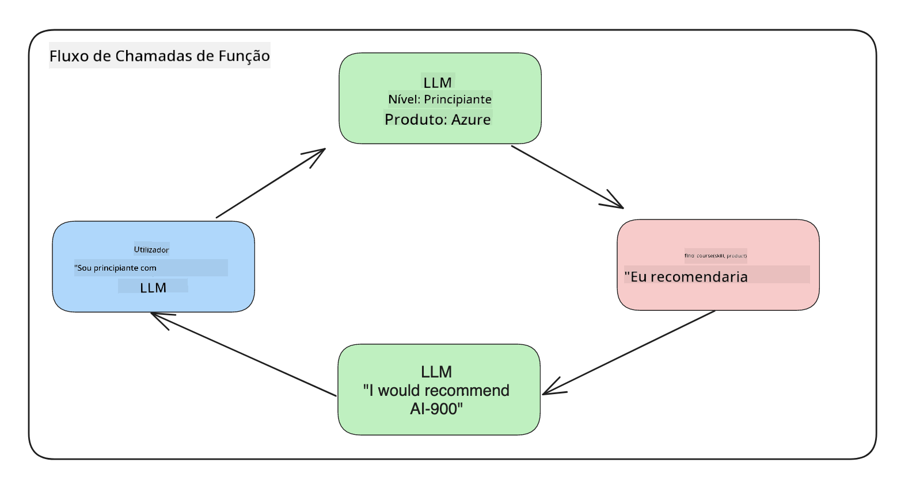

<!--
CO_OP_TRANSLATOR_METADATA:
{
  "original_hash": "f6f84f9ef2d066cd25850cab93580a50",
  "translation_date": "2025-10-18T00:38:20+00:00",
  "source_file": "11-integrating-with-function-calling/README.md",
  "language_code": "pt"
}
-->
# Integração com chamadas de função

[](https://youtu.be/DgUdCLX8qYQ?si=f1ouQU5HQx6F8Gl2)

Você já aprendeu bastante nas lições anteriores. No entanto, ainda podemos melhorar. Algumas questões que podemos abordar são como obter um formato de resposta mais consistente para facilitar o trabalho com a resposta posteriormente. Além disso, talvez queiramos adicionar dados de outras fontes para enriquecer ainda mais nossa aplicação.

Esses problemas mencionados acima são o foco deste capítulo.

## Introdução

Esta lição abordará:

- Explicar o que é chamada de função e seus casos de uso.
- Criar uma chamada de função usando o Azure OpenAI.
- Como integrar uma chamada de função em uma aplicação.

## Objetivos de Aprendizagem

Ao final desta lição, você será capaz de:

- Explicar o propósito de usar chamadas de função.
- Configurar chamadas de função usando o serviço Azure OpenAI.
- Projetar chamadas de função eficazes para o caso de uso da sua aplicação.

## Cenário: Melhorando nosso chatbot com funções

Nesta lição, queremos criar um recurso para nossa startup de educação que permita aos usuários utilizarem um chatbot para encontrar cursos técnicos. Recomendaremos cursos que se adequem ao nível de habilidade, função atual e tecnologia de interesse deles.

Para completar este cenário, usaremos uma combinação de:

- `Azure OpenAI` para criar uma experiência de chat para o usuário.
- `Microsoft Learn Catalog API` para ajudar os usuários a encontrar cursos com base em suas solicitações.
- `Chamada de Função` para interpretar a consulta do usuário e enviá-la a uma função para realizar a solicitação à API.

Para começar, vamos entender por que gostaríamos de usar chamadas de função:

## Por que usar chamadas de função

Antes das chamadas de função, as respostas de um LLM eram não estruturadas e inconsistentes. Os desenvolvedores precisavam escrever códigos de validação complexos para garantir que conseguissem lidar com cada variação de resposta. Os usuários não podiam obter respostas como "Qual é o clima atual em Estocolmo?". Isso porque os modelos eram limitados ao período em que os dados foram treinados.

A chamada de função é um recurso do serviço Azure OpenAI que supera as seguintes limitações:

- **Formato de resposta consistente**. Se conseguirmos controlar melhor o formato da resposta, será mais fácil integrá-la posteriormente a outros sistemas.
- **Dados externos**. Capacidade de usar dados de outras fontes de uma aplicação em um contexto de chat.

## Ilustrando o problema através de um cenário

> Recomendamos que utilize o [notebook incluído](./python/aoai-assignment.ipynb?WT.mc_id=academic-105485-koreyst) se quiser executar o cenário abaixo. Você também pode apenas acompanhar a leitura, pois estamos tentando ilustrar um problema onde as funções podem ajudar a resolvê-lo.

Vamos analisar um exemplo que ilustra o problema do formato de resposta:

Digamos que queremos criar uma base de dados de informações de estudantes para que possamos sugerir o curso certo para eles. Abaixo temos duas descrições de estudantes que são muito semelhantes nos dados que contêm.

1. Criar uma conexão com nosso recurso Azure OpenAI:

   ```python
   import os
   import json
   from openai import AzureOpenAI
   from dotenv import load_dotenv
   load_dotenv()

   client = AzureOpenAI(
   api_key=os.environ['AZURE_OPENAI_API_KEY'],  # this is also the default, it can be omitted
   api_version = "2023-07-01-preview"
   )

   deployment=os.environ['AZURE_OPENAI_DEPLOYMENT']
   ```

   Abaixo está um código Python para configurar nossa conexão com o Azure OpenAI, onde definimos `api_type`, `api_base`, `api_version` e `api_key`.

1. Criar duas descrições de estudantes usando as variáveis `student_1_description` e `student_2_description`.

   ```python
   student_1_description="Emily Johnson is a sophomore majoring in computer science at Duke University. She has a 3.7 GPA. Emily is an active member of the university's Chess Club and Debate Team. She hopes to pursue a career in software engineering after graduating."

   student_2_description = "Michael Lee is a sophomore majoring in computer science at Stanford University. He has a 3.8 GPA. Michael is known for his programming skills and is an active member of the university's Robotics Club. He hopes to pursue a career in artificial intelligence after finishing his studies."
   ```

   Queremos enviar as descrições dos estudantes acima para um LLM para que ele analise os dados. Esses dados podem ser usados posteriormente em nossa aplicação e enviados para uma API ou armazenados em um banco de dados.

1. Vamos criar dois prompts idênticos nos quais instruímos o LLM sobre quais informações estamos interessados:

   ```python
   prompt1 = f'''
   Please extract the following information from the given text and return it as a JSON object:

   name
   major
   school
   grades
   club

   This is the body of text to extract the information from:
   {student_1_description}
   '''

   prompt2 = f'''
   Please extract the following information from the given text and return it as a JSON object:

   name
   major
   school
   grades
   club

   This is the body of text to extract the information from:
   {student_2_description}
   '''
   ```

   Os prompts acima instruem o LLM a extrair informações e retornar a resposta em formato JSON.

1. Após configurar os prompts e a conexão com o Azure OpenAI, agora enviaremos os prompts para o LLM usando `openai.ChatCompletion`. Armazenamos o prompt na variável `messages` e atribuímos o papel como `user`. Isso é para simular uma mensagem de um usuário sendo escrita para um chatbot.

   ```python
   # response from prompt one
   openai_response1 = client.chat.completions.create(
   model=deployment,
   messages = [{'role': 'user', 'content': prompt1}]
   )
   openai_response1.choices[0].message.content

   # response from prompt two
   openai_response2 = client.chat.completions.create(
   model=deployment,
   messages = [{'role': 'user', 'content': prompt2}]
   )
   openai_response2.choices[0].message.content
   ```

Agora podemos enviar ambas as solicitações para o LLM e examinar a resposta que recebemos, encontrando-a assim: `openai_response1['choices'][0]['message']['content']`.

1. Por fim, podemos converter a resposta para o formato JSON chamando `json.loads`:

   ```python
   # Loading the response as a JSON object
   json_response1 = json.loads(openai_response1.choices[0].message.content)
   json_response1
   ```

   Resposta 1:

   ```json
   {
     "name": "Emily Johnson",
     "major": "computer science",
     "school": "Duke University",
     "grades": "3.7",
     "club": "Chess Club"
   }
   ```

   Resposta 2:

   ```json
   {
     "name": "Michael Lee",
     "major": "computer science",
     "school": "Stanford University",
     "grades": "3.8 GPA",
     "club": "Robotics Club"
   }
   ```

   Mesmo que os prompts sejam os mesmos e as descrições sejam semelhantes, vemos valores da propriedade `Grades` formatados de maneira diferente, como `3.7` ou `3.7 GPA`, por exemplo.

   Esse resultado ocorre porque o LLM recebe dados não estruturados na forma do prompt escrito e também retorna dados não estruturados. Precisamos ter um formato estruturado para saber o que esperar ao armazenar ou usar esses dados.

Então, como resolvemos o problema de formatação? Usando chamadas de função, podemos garantir que recebemos dados estruturados de volta. Ao usar chamadas de função, o LLM não chama ou executa nenhuma função de fato. Em vez disso, criamos uma estrutura para o LLM seguir em suas respostas. Em seguida, usamos essas respostas estruturadas para saber qual função executar em nossas aplicações.



Podemos então pegar o que é retornado da função e enviar isso de volta ao LLM. O LLM responderá usando linguagem natural para responder à consulta do usuário.

## Casos de uso para chamadas de função

Existem muitos casos de uso diferentes onde as chamadas de função podem melhorar sua aplicação, como:

- **Chamar ferramentas externas**. Chatbots são ótimos para fornecer respostas às perguntas dos usuários. Usando chamadas de função, os chatbots podem usar mensagens dos usuários para realizar certas tarefas. Por exemplo, um estudante pode pedir ao chatbot: "Envie um e-mail ao meu instrutor dizendo que preciso de mais ajuda com este assunto". Isso pode fazer uma chamada de função para `send_email(to: string, body: string)`.

- **Criar consultas de API ou banco de dados**. Os usuários podem encontrar informações usando linguagem natural que são convertidas em uma consulta formatada ou solicitação de API. Um exemplo disso pode ser um professor que solicita: "Quem são os alunos que concluíram a última tarefa", o que pode chamar uma função chamada `get_completed(student_name: string, assignment: int, current_status: string)`.

- **Criar dados estruturados**. Os usuários podem pegar um bloco de texto ou CSV e usar o LLM para extrair informações importantes dele. Por exemplo, um estudante pode converter um artigo da Wikipedia sobre acordos de paz para criar flashcards de IA. Isso pode ser feito usando uma função chamada `get_important_facts(agreement_name: string, date_signed: string, parties_involved: list)`.

## Criando sua primeira chamada de função

O processo de criação de uma chamada de função inclui 3 etapas principais:

1. **Chamar** a API de Chat Completions com uma lista de suas funções e uma mensagem do usuário.
2. **Ler** a resposta do modelo para realizar uma ação, ou seja, executar uma função ou chamada de API.
3. **Fazer** outra chamada à API de Chat Completions com a resposta da sua função para usar essas informações e criar uma resposta para o usuário.


### Etapa 1 - criando mensagens

A primeira etapa é criar uma mensagem do usuário. Isso pode ser atribuído dinamicamente ao valor de uma entrada de texto ou você pode atribuir um valor aqui. Se esta for sua primeira vez trabalhando com a API de Chat Completions, precisamos definir o `role` e o `content` da mensagem.

O `role` pode ser `system` (criando regras), `assistant` (o modelo) ou `user` (o usuário final). Para chamadas de função, atribuímos como `user` e um exemplo de pergunta.

```python
messages= [ {"role": "user", "content": "Find me a good course for a beginner student to learn Azure."} ]
```

Ao atribuir diferentes papéis, fica claro para o LLM se é o sistema dizendo algo ou o usuário, o que ajuda a construir um histórico de conversas que o LLM pode usar como base.

### Etapa 2 - criando funções

Em seguida, definiremos uma função e os parâmetros dessa função. Usaremos apenas uma função aqui chamada `search_courses`, mas você pode criar várias funções.

> **Importante**: As funções são incluídas na mensagem do sistema para o LLM e serão incluídas na quantidade de tokens disponíveis.

Abaixo, criamos as funções como um array de itens. Cada item é uma função e possui as propriedades `name`, `description` e `parameters`:

```python
functions = [
   {
      "name":"search_courses",
      "description":"Retrieves courses from the search index based on the parameters provided",
      "parameters":{
         "type":"object",
         "properties":{
            "role":{
               "type":"string",
               "description":"The role of the learner (i.e. developer, data scientist, student, etc.)"
            },
            "product":{
               "type":"string",
               "description":"The product that the lesson is covering (i.e. Azure, Power BI, etc.)"
            },
            "level":{
               "type":"string",
               "description":"The level of experience the learner has prior to taking the course (i.e. beginner, intermediate, advanced)"
            }
         },
         "required":[
            "role"
         ]
      }
   }
]
```

Vamos descrever cada instância de função mais detalhadamente abaixo:

- `name` - O nome da função que queremos chamar.
- `description` - Esta é a descrição de como a função funciona. Aqui é importante ser específico e claro.
- `parameters` - Uma lista de valores e formatos que você deseja que o modelo produza em sua resposta. O array de parâmetros consiste em itens onde os itens possuem as seguintes propriedades:
  1.  `type` - O tipo de dado em que as propriedades serão armazenadas.
  1.  `properties` - Lista dos valores específicos que o modelo usará para sua resposta.
      1. `name` - A chave é o nome da propriedade que o modelo usará em sua resposta formatada, por exemplo, `product`.
      1. `type` - O tipo de dado dessa propriedade, por exemplo, `string`.
      1. `description` - Descrição da propriedade específica.

Há também uma propriedade opcional `required` - propriedade necessária para que a chamada de função seja concluída.

### Etapa 3 - Fazendo a chamada de função

Depois de definir uma função, agora precisamos incluí-la na chamada à API de Chat Completion. Fazemos isso adicionando `functions` à solicitação. Neste caso, `functions=functions`.

Há também uma opção para definir `function_call` como `auto`. Isso significa que deixaremos o LLM decidir qual função deve ser chamada com base na mensagem do usuário, em vez de atribuí-la nós mesmos.

Aqui está um código abaixo onde chamamos `ChatCompletion.create`, observe como definimos `functions=functions` e `function_call="auto"`, permitindo que o LLM escolha quando chamar as funções que fornecemos:

```python
response = client.chat.completions.create(model=deployment,
                                        messages=messages,
                                        functions=functions,
                                        function_call="auto")

print(response.choices[0].message)
```

A resposta que retorna agora se parece com isso:

```json
{
  "role": "assistant",
  "function_call": {
    "name": "search_courses",
    "arguments": "{\n  \"role\": \"student\",\n  \"product\": \"Azure\",\n  \"level\": \"beginner\"\n}"
  }
}
```

Aqui podemos ver como a função `search_courses` foi chamada e com quais argumentos, conforme listado na propriedade `arguments` na resposta JSON.

A conclusão é que o LLM foi capaz de encontrar os dados para preencher os argumentos da função, extraindo-os do valor fornecido ao parâmetro `messages` na chamada de conclusão do chat. Abaixo está um lembrete do valor de `messages`:

```python
messages= [ {"role": "user", "content": "Find me a good course for a beginner student to learn Azure."} ]
```

Como você pode ver, `student`, `Azure` e `beginner` foram extraídos de `messages` e definidos como entrada para a função. Usar funções dessa forma é uma ótima maneira de extrair informações de um prompt, mas também de fornecer estrutura ao LLM e ter funcionalidades reutilizáveis.

Agora, precisamos ver como podemos usar isso em nossa aplicação.

## Integrando chamadas de função em uma aplicação

Depois de testar a resposta formatada do LLM, agora podemos integrar isso em uma aplicação.

### Gerenciando o fluxo

Para integrar isso em nossa aplicação, vamos seguir os seguintes passos:

1. Primeiro, vamos fazer a chamada aos serviços OpenAI e armazenar a mensagem em uma variável chamada `response_message`.

   ```python
   response_message = response.choices[0].message
   ```

1. Agora vamos definir a função que chamará a API Microsoft Learn para obter uma lista de cursos:

   ```python
   import requests

   def search_courses(role, product, level):
     url = "https://learn.microsoft.com/api/catalog/"
     params = {
        "role": role,
        "product": product,
        "level": level
     }
     response = requests.get(url, params=params)
     modules = response.json()["modules"]
     results = []
     for module in modules[:5]:
        title = module["title"]
        url = module["url"]
        results.append({"title": title, "url": url})
     return str(results)
   ```

   Observe como agora criamos uma função Python real que corresponde aos nomes de função introduzidos na variável `functions`. Também estamos fazendo chamadas reais à API externa para buscar os dados necessários. Neste caso, utilizamos a API Microsoft Learn para buscar módulos de treinamento.

Ok, então criamos variáveis `functions` e uma função Python correspondente, como informamos ao LLM como mapear essas duas para que nossa função Python seja chamada?

1. Para verificar se precisamos chamar uma função Python, precisamos analisar a resposta do LLM e verificar se `function_call` faz parte dela e chamar a função indicada. Aqui está como você pode fazer a verificação mencionada abaixo:

   ```python
   # Check if the model wants to call a function
   if response_message.function_call.name:
    print("Recommended Function call:")
    print(response_message.function_call.name)
    print()

    # Call the function.
    function_name = response_message.function_call.name

    available_functions = {
            "search_courses": search_courses,
    }
    function_to_call = available_functions[function_name]

    function_args = json.loads(response_message.function_call.arguments)
    function_response = function_to_call(**function_args)

    print("Output of function call:")
    print(function_response)
    print(type(function_response))


    # Add the assistant response and function response to the messages
    messages.append( # adding assistant response to messages
        {
            "role": response_message.role,
            "function_call": {
                "name": function_name,
                "arguments": response_message.function_call.arguments,
            },
            "content": None
        }
    )
    messages.append( # adding function response to messages
        {
            "role": "function",
            "name": function_name,
            "content":function_response,
        }
    )
   ```

   Essas três linhas garantem que extraímos o nome da função, os argumentos e realizamos a chamada:

   ```python
   function_to_call = available_functions[function_name]

   function_args = json.loads(response_message.function_call.arguments)
   function_response = function_to_call(**function_args)
   ```

   Abaixo está a saída ao executar nosso código:

   **Saída**

   ```Recommended Function call:
   {
     "name": "search_courses",
     "arguments": "{\n  \"role\": \"student\",\n  \"product\": \"Azure\",\n  \"level\": \"beginner\"\n}"
   }

   Output of function call:
   [{'title': 'Describe concepts of cryptography', 'url': 'https://learn.microsoft.com/training/modules/describe-concepts-of-cryptography/?
   WT.mc_id=api_CatalogApi'}, {'title': 'Introduction to audio classification with TensorFlow', 'url': 'https://learn.microsoft.com/en-
   us/training/modules/intro-audio-classification-tensorflow/?WT.mc_id=api_CatalogApi'}, {'title': 'Design a Performant Data Model in Azure SQL
   Database with Azure Data Studio', 'url': 'https://learn.microsoft.com/training/modules/design-a-data-model-with-ads/?
   WT.mc_id=api_CatalogApi'}, {'title': 'Getting started with the Microsoft Cloud Adoption Framework for Azure', 'url':
   'https://learn.microsoft.com/training/modules/cloud-adoption-framework-getting-started/?WT.mc_id=api_CatalogApi'}, {'title': 'Set up the
   Rust development environment', 'url': 'https://learn.microsoft.com/training/modules/rust-set-up-environment/?WT.mc_id=api_CatalogApi'}]
   <class 'str'>
   ```

1. Agora enviaremos a mensagem atualizada, `messages`, para o LLM para que possamos receber uma resposta em linguagem natural em vez de uma resposta formatada em JSON da API.

   ```python
   print("Messages in next request:")
   print(messages)
   print()

   second_response = client.chat.completions.create(
      messages=messages,
      model=deployment,
      function_call="auto",
      functions=functions,
      temperature=0
         )  # get a new response from GPT where it can see the function response


   print(second_response.choices[0].message)
   ```

   **Saída**

   ```python
   {
     "role": "assistant",
     "content": "I found some good courses for beginner students to learn Azure:\n\n1. [Describe concepts of cryptography] (https://learn.microsoft.com/training/modules/describe-concepts-of-cryptography/?WT.mc_id=api_CatalogApi)\n2. [Introduction to audio classification with TensorFlow](https://learn.microsoft.com/training/modules/intro-audio-classification-tensorflow/?WT.mc_id=api_CatalogApi)\n3. [Design a Performant Data Model in Azure SQL Database with Azure Data Studio](https://learn.microsoft.com/training/modules/design-a-data-model-with-ads/?WT.mc_id=api_CatalogApi)\n4. [Getting started with the Microsoft Cloud Adoption Framework for Azure](https://learn.microsoft.com/training/modules/cloud-adoption-framework-getting-started/?WT.mc_id=api_CatalogApi)\n5. [Set up the Rust development environment](https://learn.microsoft.com/training/modules/rust-set-up-environment/?WT.mc_id=api_CatalogApi)\n\nYou can click on the links to access the courses."
   }

   ```

## Tarefa

Para continuar seu aprendizado sobre chamadas de função do Azure OpenAI, você pode criar:

- Mais parâmetros para a função que podem ajudar os alunos a encontrar mais cursos.
- Criar outra chamada de função que obtenha mais informações do aluno, como seu idioma nativo.
- Crie um tratamento de erros para quando a chamada de função e/ou chamada de API não retornar cursos adequados

Dica: Consulte a página [documentação de referência da API Learn](https://learn.microsoft.com/training/support/catalog-api-developer-reference?WT.mc_id=academic-105485-koreyst) para ver como e onde esses dados estão disponíveis.

## Excelente Trabalho! Continue a Jornada

Depois de concluir esta lição, confira a nossa [coleção de aprendizagem sobre IA generativa](https://aka.ms/genai-collection?WT.mc_id=academic-105485-koreyst) para continuar aprimorando seus conhecimentos sobre IA generativa!

Vá para a Lição 12, onde vamos explorar como [projetar UX para aplicações de IA](../12-designing-ux-for-ai-applications/README.md?WT.mc_id=academic-105485-koreyst)!

---

**Aviso Legal**:  
Este documento foi traduzido utilizando o serviço de tradução por IA [Co-op Translator](https://github.com/Azure/co-op-translator). Embora nos esforcemos pela precisão, esteja ciente de que traduções automáticas podem conter erros ou imprecisões. O documento original na sua língua nativa deve ser considerado a fonte autoritária. Para informações críticas, recomenda-se uma tradução profissional realizada por humanos. Não nos responsabilizamos por quaisquer mal-entendidos ou interpretações incorretas decorrentes do uso desta tradução.