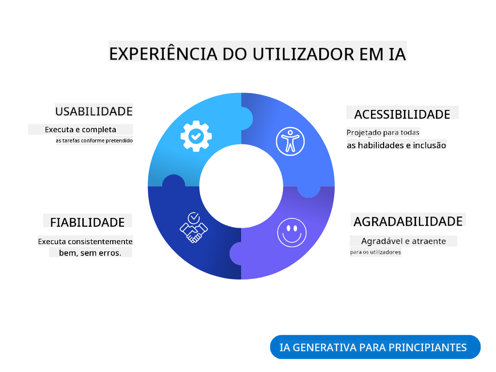
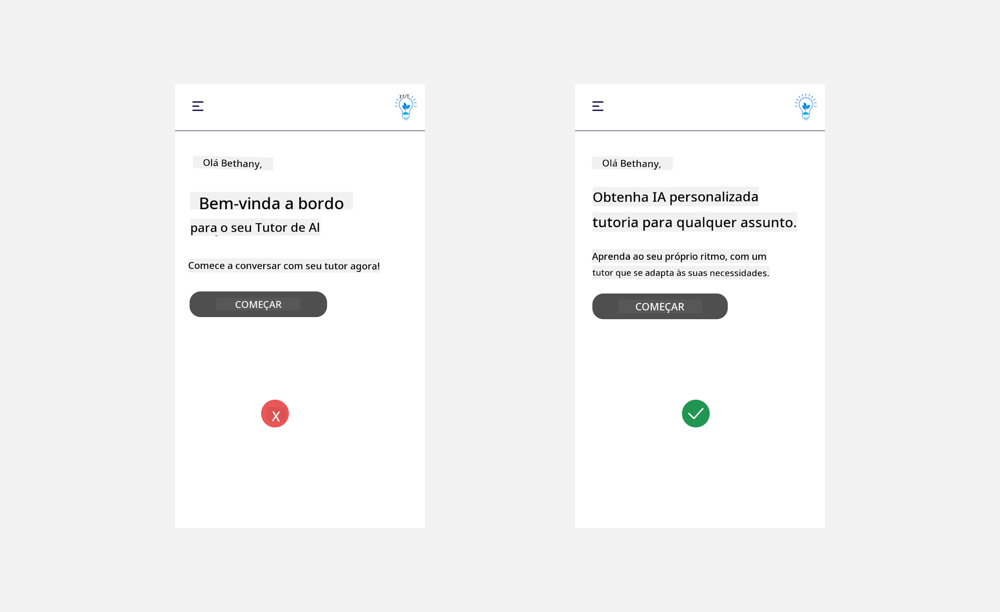
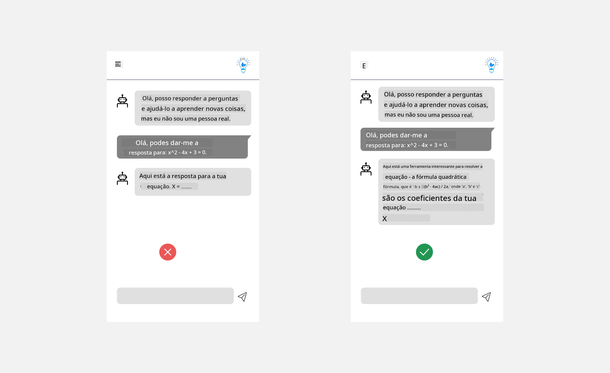
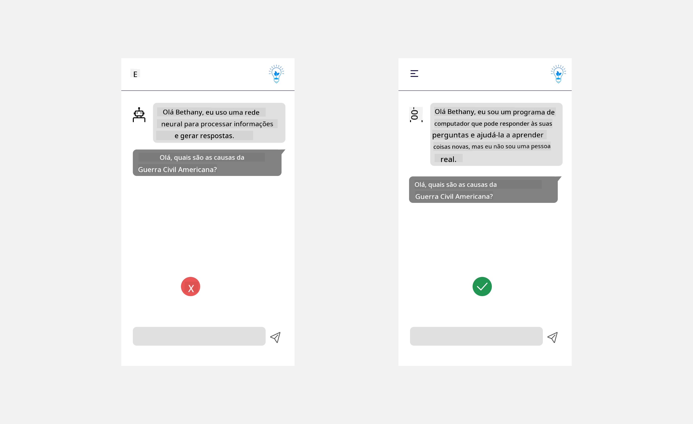
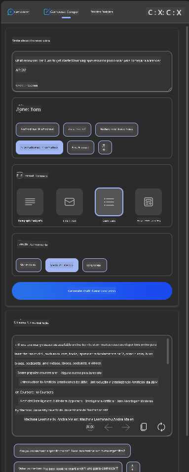
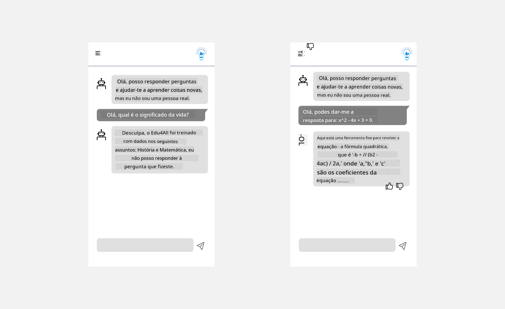

<!--
CO_OP_TRANSLATOR_METADATA:
{
  "original_hash": "ec385b41ee50579025d50cc03bfb3a25",
  "translation_date": "2025-06-25T20:20:04+00:00",
  "source_file": "12-designing-ux-for-ai-applications/README.md",
  "language_code": "pt"
}
-->
# Desenhar UX para Aplicações de IA

> _(Clique na imagem acima para ver o vídeo desta lição)_

A experiência do utilizador é um aspeto muito importante na construção de aplicações. Os utilizadores precisam de poder usar a sua aplicação de forma eficiente para realizar tarefas. Ser eficiente é uma coisa, mas também é necessário desenhar aplicações que possam ser usadas por todos, tornando-as _acessíveis_. Este capítulo irá focar-se nesta área para que, idealmente, acabe por desenhar uma aplicação que as pessoas possam e queiram usar.

## Introdução

A experiência do utilizador é a forma como um utilizador interage e utiliza um produto ou serviço específico, seja um sistema, ferramenta ou design. Ao desenvolver aplicações de IA, os desenvolvedores não se concentram apenas em garantir que a experiência do utilizador é eficaz, mas também ética. Nesta lição, abordamos como construir aplicações de Inteligência Artificial (IA) que respondam às necessidades dos utilizadores.

A lição abordará as seguintes áreas:

- Introdução à Experiência do Utilizador e Compreensão das Necessidades dos Utilizadores
- Desenhar Aplicações de IA para Confiança e Transparência
- Desenhar Aplicações de IA para Colaboração e Feedback

## Objetivos de aprendizagem

Após esta lição, será capaz de:

- Compreender como construir aplicações de IA que satisfaçam as necessidades dos utilizadores.
- Desenhar aplicações de IA que promovam confiança e colaboração.

### Pré-requisito

Reserve algum tempo para ler mais sobre [experiência do utilizador e design thinking.](https://learn.microsoft.com/training/modules/ux-design?WT.mc_id=academic-105485-koreyst)

## Introdução à Experiência do Utilizador e Compreensão das Necessidades dos Utilizadores

Na nossa startup educacional fictícia, temos dois utilizadores principais, professores e alunos. Cada um dos dois utilizadores tem necessidades únicas. Um design centrado no utilizador prioriza o utilizador, garantindo que os produtos são relevantes e benéficos para aqueles a que se destinam.

A aplicação deve ser **útil, fiável, acessível e agradável** para proporcionar uma boa experiência do utilizador.

### Usabilidade

Ser útil significa que a aplicação tem funcionalidades que correspondem ao seu propósito pretendido, como automatizar o processo de avaliação ou gerar cartões de memória para revisão. Uma aplicação que automatiza o processo de avaliação deve ser capaz de atribuir pontuações de forma precisa e eficiente ao trabalho dos alunos com base em critérios pré-definidos. Da mesma forma, uma aplicação que gera cartões de memória para revisão deve ser capaz de criar perguntas relevantes e diversificadas com base nos seus dados.

### Fiabilidade

Ser fiável significa que a aplicação pode realizar a sua tarefa de forma consistente e sem erros. No entanto, a IA, tal como os humanos, não é perfeita e pode ser propensa a erros. As aplicações podem encontrar erros ou situações inesperadas que requerem intervenção ou correção humana. Como lidar com erros? Na última secção desta lição, abordaremos como os sistemas e aplicações de IA são desenhados para colaboração e feedback.

### Acessibilidade

Ser acessível significa estender a experiência do utilizador a utilizadores com várias capacidades, incluindo aqueles com deficiências, garantindo que ninguém é deixado de fora. Ao seguir diretrizes e princípios de acessibilidade, as soluções de IA tornam-se mais inclusivas, utilizáveis e benéficas para todos os utilizadores.

### Agradável

Ser agradável significa que a aplicação é agradável de usar. Uma experiência do utilizador apelativa pode ter um impacto positivo no utilizador, encorajando-o a voltar à aplicação e aumentando a receita do negócio.

Nem todos os desafios podem ser resolvidos com IA. A IA surge para aumentar a sua experiência do utilizador, seja automatizando tarefas manuais ou personalizando experiências de utilizador.

## Desenhar Aplicações de IA para Confiança e Transparência

Construir confiança é crucial ao desenhar aplicações de IA. A confiança garante que um utilizador está confiante de que a aplicação fará o trabalho, entregará resultados consistentemente e os resultados são o que o utilizador precisa. Um risco nesta área é a desconfiança e a confiança excessiva. A desconfiança ocorre quando um utilizador tem pouca ou nenhuma confiança num sistema de IA, levando o utilizador a rejeitar a sua aplicação. A confiança excessiva ocorre quando um utilizador superestima a capacidade de um sistema de IA, levando os utilizadores a confiarem demasiado no sistema de IA. Por exemplo, um sistema de avaliação automatizado, no caso de confiança excessiva, pode levar o professor a não rever alguns dos trabalhos para garantir que o sistema de avaliação funciona bem. Isto pode resultar em notas injustas ou imprecisas para os alunos, ou em oportunidades perdidas de feedback e melhoria.

Duas formas de garantir que a confiança está no centro do design são a explicabilidade e o controlo.

### Explicabilidade

Quando a IA ajuda a informar decisões, como transmitir conhecimento às futuras gerações, é fundamental que professores e pais compreendam como as decisões de IA são tomadas. Isto é explicabilidade - compreender como as aplicações de IA tomam decisões. Desenhar para a explicabilidade inclui adicionar detalhes de exemplos do que uma aplicação de IA pode fazer. Por exemplo, em vez de "Começar com professor de IA", o sistema pode usar: "Resuma as suas notas para uma revisão mais fácil usando IA."

Outro exemplo é como a IA usa dados de utilizadores e pessoais. Por exemplo, um utilizador com a persona de aluno pode ter limitações com base na sua persona. A IA pode não ser capaz de revelar respostas a perguntas, mas pode ajudar a guiar o utilizador a pensar em como pode resolver um problema.

Uma última parte chave da explicabilidade é a simplificação das explicações. Alunos e professores podem não ser especialistas em IA, portanto, as explicações do que a aplicação pode ou não pode fazer devem ser simplificadas e fáceis de entender.

### Controlo

A IA generativa cria uma colaboração entre a IA e o utilizador, onde, por exemplo, um utilizador pode modificar prompts para diferentes resultados. Além disso, uma vez que um resultado é gerado, os utilizadores devem poder modificar os resultados, dando-lhes uma sensação de controlo. Por exemplo, ao usar o Bing, pode ajustar o seu prompt com base no formato, tom e comprimento. Além disso, pode adicionar alterações ao seu resultado e modificar o resultado conforme mostrado abaixo:

Outra funcionalidade no Bing que permite ao utilizador ter controlo sobre a aplicação é a capacidade de optar por participar ou não nos dados que a IA usa. Para uma aplicação escolar, um aluno pode querer usar as suas notas, bem como os recursos dos professores como material de revisão.

> Ao desenhar aplicações de IA, a intencionalidade é fundamental para garantir que os utilizadores não confiem excessivamente, criando expectativas irrealistas das suas capacidades. Uma forma de fazer isso é criando fricção entre os prompts e os resultados. Lembrando o utilizador de que esta é uma IA e não um ser humano

## Desenhar Aplicações de IA para Colaboração e Feedback

Como mencionado anteriormente, a IA generativa cria uma colaboração entre o utilizador e a IA. A maioria dos envolvimentos são com um utilizador a introduzir um prompt e a IA a gerar um resultado. E se o resultado estiver incorreto? Como a aplicação lida com erros, se ocorrerem? A IA culpa o utilizador ou leva tempo para explicar o erro?

As aplicações de IA devem ser construídas para receber e dar feedback. Isto não só ajuda o sistema de IA a melhorar, mas também constrói confiança com os utilizadores. Um ciclo de feedback deve ser incluído no design, um exemplo pode ser um simples polegar para cima ou para baixo no resultado.

Outra forma de lidar com isso é comunicar claramente as capacidades e limitações do sistema. Quando um utilizador comete um erro ao solicitar algo além das capacidades da IA, também deve haver uma forma de lidar com isso, como mostrado abaixo.

Erros de sistema são comuns em aplicações onde o utilizador pode precisar de assistência com informações fora do escopo da IA ou a aplicação pode ter um limite sobre quantas perguntas/assuntos um utilizador pode gerar resumos. Por exemplo, uma aplicação de IA treinada com dados sobre assuntos limitados, por exemplo, História e Matemática, pode não ser capaz de lidar com perguntas sobre Geografia. Para mitigar isso, o sistema de IA pode dar uma resposta como: "Desculpe, o nosso produto foi treinado com dados nos seguintes assuntos....., não posso responder à pergunta que fez."

As aplicações de IA não são perfeitas, portanto, estão sujeitas a cometer erros. Ao desenhar as suas aplicações, deve garantir que cria espaço para feedback dos utilizadores e tratamento de erros de uma forma simples e facilmente explicável.

## Tarefa

Pegue em qualquer aplicação de IA que tenha construído até agora e considere implementar os passos abaixo na sua aplicação:

- **Agradável:** Considere como pode tornar a sua aplicação mais agradável. Está a adicionar explicações em todo o lado? Está a encorajar o utilizador a explorar? Como está a redigir as suas mensagens de erro?

- **Usabilidade:** Construir uma aplicação web. Certifique-se de que a sua aplicação é navegável tanto por rato como por teclado.

- **Confiança e transparência:** Não confie completamente na IA e nos seus resultados, considere como adicionaria um humano ao processo para verificar o resultado. Além disso, considere e implemente outras formas de alcançar confiança e transparência.

- **Controlo:** Dê ao utilizador controlo sobre os dados que fornece à aplicação. Implemente uma forma de o utilizador poder optar por participar ou não na recolha de dados na aplicação de IA.

## Continue a Aprender!

Após completar esta lição, confira a nossa [coleção de Aprendizagem de IA Generativa](https://aka.ms/genai-collection?WT.mc_id=academic-105485-koreyst) para continuar a aprimorar o seu conhecimento em IA Generativa!

Vá para a Lição 13, onde iremos abordar como [proteger aplicações de IA](../13-securing-ai-applications/README.md?WT.mc_id=academic-105485-koreyst)!

**Aviso Legal**:
Este documento foi traduzido utilizando o serviço de tradução por IA [Co-op Translator](https://github.com/Azure/co-op-translator). Embora nos esforcemos pela precisão, esteja ciente de que traduções automáticas podem conter erros ou imprecisões. O documento original na sua língua nativa deve ser considerado a fonte autoritária. Para informações críticas, recomenda-se a tradução profissional humana. Não nos responsabilizamos por quaisquer mal-entendidos ou interpretações erradas decorrentes do uso desta tradução.