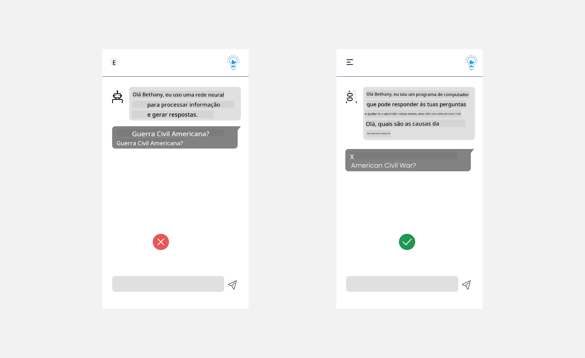

<!--
CO_OP_TRANSLATOR_METADATA:
{
  "original_hash": "747668e4c53d067369f06e9ec2e6313e",
  "translation_date": "2025-08-26T16:21:43+00:00",
  "source_file": "12-designing-ux-for-ai-applications/README.md",
  "language_code": "pt"
}
-->
# Conceber Experiências de Utilizador para Aplicações de IA

> _(Clique na imagem acima para ver o vídeo desta lição)_

A experiência de utilizador é um aspeto fundamental na criação de aplicações. Os utilizadores precisam de conseguir usar a tua aplicação de forma eficiente para realizar tarefas. Ser eficiente é importante, mas também é essencial conceber aplicações para que possam ser usadas por todos, tornando-as _acessíveis_. Este capítulo foca-se nesta área para que possas criar uma aplicação que as pessoas consigam e queiram usar.

## Introdução

A experiência de utilizador refere-se à forma como um utilizador interage e utiliza um produto ou serviço específico, seja um sistema, uma ferramenta ou um design. Ao desenvolver aplicações de IA, os programadores não se preocupam apenas em garantir que a experiência de utilizador é eficaz, mas também ética. Nesta lição, abordamos como criar aplicações de Inteligência Artificial (IA) que respondam às necessidades dos utilizadores.

A lição aborda os seguintes tópicos:

- Introdução à Experiência de Utilizador e Compreensão das Necessidades dos Utilizadores
- Conceber Aplicações de IA para Confiança e Transparência
- Conceber Aplicações de IA para Colaboração e Feedback

## Objetivos de aprendizagem

Depois de concluíres esta lição, vais conseguir:

- Perceber como criar aplicações de IA que respondam às necessidades dos utilizadores.
- Conceber aplicações de IA que promovam a confiança e a colaboração.

### Pré-requisito

Dedica algum tempo a ler mais sobre [experiência de utilizador e design thinking.](https://learn.microsoft.com/training/modules/ux-design?WT.mc_id=academic-105485-koreyst)

## Introdução à Experiência de Utilizador e Compreensão das Necessidades dos Utilizadores

Na nossa startup fictícia de educação, temos dois utilizadores principais: professores e alunos. Cada um tem necessidades específicas. Um design centrado no utilizador dá prioridade ao utilizador, garantindo que os produtos são relevantes e úteis para quem se destinam.

A aplicação deve ser **útil, fiável, acessível e agradável** para proporcionar uma boa experiência de utilizador.

### Usabilidade

Ser útil significa que a aplicação tem funcionalidades que correspondem ao seu propósito, como automatizar o processo de avaliação ou gerar cartões de estudo para revisão. Uma aplicação que automatiza a avaliação deve conseguir atribuir notas de forma precisa e eficiente com base em critérios definidos. Da mesma forma, uma aplicação que gera cartões de estudo deve conseguir criar perguntas relevantes e variadas com base nos seus dados.

### Fiabilidade

Ser fiável significa que a aplicação consegue desempenhar a sua função de forma consistente e sem erros. No entanto, tal como os humanos, a IA não é perfeita e pode cometer erros. As aplicações podem encontrar erros ou situações inesperadas que exigem intervenção ou correção humana. Como lidas com erros? Na última secção desta lição, vamos abordar como os sistemas e aplicações de IA são concebidos para colaboração e feedback.

### Acessibilidade

Ser acessível significa alargar a experiência de utilizador a pessoas com diferentes capacidades, incluindo pessoas com deficiência, garantindo que ninguém fica de fora. Ao seguir as diretrizes e princípios de acessibilidade, as soluções de IA tornam-se mais inclusivas, utilizáveis e benéficas para todos.

### Agrado

Ser agradável significa que a aplicação é prazerosa de usar. Uma experiência de utilizador apelativa pode ter um impacto positivo, incentivando o utilizador a voltar à aplicação e aumentando a receita do negócio.

Nem todos os desafios podem ser resolvidos com IA. A IA serve para melhorar a experiência de utilizador, seja automatizando tarefas manuais ou personalizando experiências.

## Conceber Aplicações de IA para Confiança e Transparência

Construir confiança é essencial ao conceber aplicações de IA. A confiança garante que o utilizador acredita que a aplicação vai cumprir o seu objetivo, entregar resultados de forma consistente e que os resultados são os que o utilizador precisa. Um risco nesta área é a falta de confiança ou o excesso de confiança. A falta de confiança acontece quando o utilizador não confia na IA, levando-o a rejeitar a aplicação. O excesso de confiança ocorre quando o utilizador sobrestima as capacidades da IA, confiando demasiado nela. Por exemplo, um sistema automático de avaliação pode levar o professor, por excesso de confiança, a não rever alguns testes para garantir que o sistema está a funcionar corretamente. Isto pode resultar em notas injustas ou incorretas para os alunos, ou em oportunidades perdidas de feedback e melhoria.

Duas formas de garantir que a confiança está no centro do design são a explicabilidade e o controlo.

### Explicabilidade

Quando a IA ajuda a tomar decisões, como transmitir conhecimento às gerações futuras, é fundamental que professores e pais percebam como as decisões da IA são tomadas. Isto é a explicabilidade – perceber como as aplicações de IA tomam decisões. Conceber para a explicabilidade inclui adicionar detalhes que mostram como a IA chegou ao resultado. O público deve saber que o resultado foi gerado por IA e não por um humano. Por exemplo, em vez de dizer "Começa já a conversar com o teu tutor", diz "Usa o tutor de IA que se adapta às tuas necessidades e te ajuda a aprender ao teu ritmo."

Outro exemplo é como a IA utiliza dados pessoais e do utilizador. Por exemplo, um utilizador com o perfil de aluno pode ter limitações consoante o seu perfil. A IA pode não conseguir revelar respostas, mas pode ajudar a orientar o utilizador a pensar em como resolver um problema.

Outro ponto importante da explicabilidade é simplificar as explicações. Alunos e professores podem não ser especialistas em IA, por isso as explicações sobre o que a aplicação pode ou não pode fazer devem ser simples e fáceis de entender.

### Controlo

A IA generativa cria uma colaboração entre a IA e o utilizador, onde, por exemplo, o utilizador pode modificar os prompts para obter resultados diferentes. Além disso, depois de gerar um resultado, o utilizador deve poder modificar esse resultado, dando-lhe uma sensação de controlo. Por exemplo, ao usar o Bing, podes ajustar o teu prompt consoante o formato, tom e comprimento. Também podes alterar o resultado e modificá-lo, como mostrado abaixo:

Outra funcionalidade do Bing que permite ao utilizador controlar a aplicação é a possibilidade de escolher se quer ou não que a IA utilize os seus dados. Numa aplicação escolar, um aluno pode querer usar os seus apontamentos e os recursos do professor como material de revisão.

> Ao conceber aplicações de IA, é importante garantir que os utilizadores não confiem demasiado, criando expectativas irrealistas sobre as capacidades da IA. Uma forma de fazer isto é criar alguma fricção entre os prompts e os resultados. Lembra o utilizador de que está a interagir com IA e não com outro ser humano.

## Conceber Aplicações de IA para Colaboração e Feedback

Como referido anteriormente, a IA generativa cria uma colaboração entre o utilizador e a IA. Na maioria das interações, o utilizador introduz um prompt e a IA gera um resultado. E se o resultado estiver errado? Como é que a aplicação lida com erros? A IA culpa o utilizador ou explica o erro?

As aplicações de IA devem ser concebidas para receber e dar feedback. Isto não só ajuda a IA a melhorar, como também aumenta a confiança dos utilizadores. Deve existir um ciclo de feedback no design, por exemplo, um simples polegar para cima ou para baixo no resultado.

Outra forma de lidar com isto é comunicar claramente as capacidades e limitações do sistema. Quando um utilizador comete um erro ao pedir algo que está fora das capacidades da IA, deve haver uma forma de lidar com isso, como mostrado abaixo.

Erros de sistema são comuns em aplicações onde o utilizador pode precisar de ajuda com informação fora do âmbito da IA ou a aplicação pode ter um limite de perguntas/temas para os quais pode gerar resumos. Por exemplo, uma aplicação de IA treinada apenas com dados de História e Matemática pode não conseguir responder a perguntas de Geografia. Para resolver isto, o sistema de IA pode responder: "Desculpa, o nosso produto foi treinado com dados nos seguintes temas....., não consigo responder à pergunta que colocaste."

As aplicações de IA não são perfeitas, por isso é natural que cometam erros. Ao conceberes as tuas aplicações, garante que existe espaço para feedback dos utilizadores e para lidar com erros de forma simples e fácil de explicar.

## Exercício

Pega em qualquer aplicação de IA que já tenhas criado e considera implementar os seguintes passos:

- **Agrado:** Pensa em como podes tornar a tua aplicação mais agradável. Estás a adicionar explicações em todo o lado? Estás a incentivar o utilizador a explorar? Como estás a escrever as mensagens de erro?

- **Usabilidade:** Se estás a criar uma aplicação web, certifica-te de que pode ser navegada tanto com rato como com teclado.

- **Confiança e transparência:** Não confies totalmente na IA e nos seus resultados, pensa em como podes incluir um humano no processo para verificar os resultados. Considera e implementa outras formas de garantir confiança e transparência.

- **Controlo:** Dá ao utilizador controlo sobre os dados que fornece à aplicação. Implementa uma forma de o utilizador poder escolher participar ou não na recolha de dados pela aplicação de IA.

## Continua a Aprender!

Depois de terminares esta lição, explora a nossa [coleção de aprendizagem sobre IA generativa](https://aka.ms/genai-collection?WT.mc_id=academic-105485-koreyst) para continuares a aprofundar os teus conhecimentos!

Segue para a Lição 13, onde vamos ver como [proteger aplicações de IA](../13-securing-ai-applications/README.md?WT.mc_id=academic-105485-koreyst)!

---

**Aviso Legal**:
Este documento foi traduzido utilizando o serviço de tradução automática [Co-op Translator](https://github.com/Azure/co-op-translator). Embora nos esforcemos pela precisão, esteja ciente de que traduções automáticas podem conter erros ou imprecisões. O documento original na sua língua nativa deve ser considerado a fonte autorizada. Para informações críticas, recomenda-se a tradução profissional por um humano. Não nos responsabilizamos por quaisquer mal-entendidos ou interpretações incorretas resultantes da utilização desta tradução.