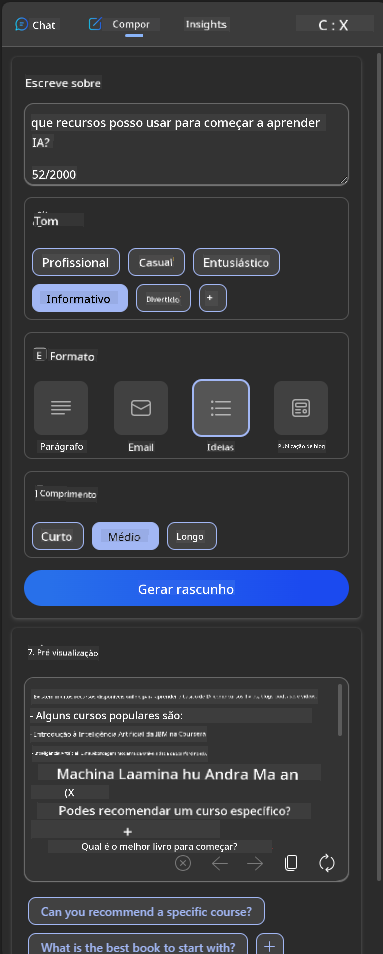

<!--
CO_OP_TRANSLATOR_METADATA:
{
  "original_hash": "ec385b41ee50579025d50cc03bfb3a25",
  "translation_date": "2025-07-09T14:55:34+00:00",
  "source_file": "12-designing-ux-for-ai-applications/README.md",
  "language_code": "pt"
}
-->
# Design de UX para Aplicações de IA

> _(Clique na imagem acima para ver o vídeo desta lição)_

A experiência do utilizador é um aspeto muito importante na criação de aplicações. Os utilizadores precisam de conseguir usar a sua aplicação de forma eficiente para realizar tarefas. Ser eficiente é uma coisa, mas também é necessário desenhar aplicações para que possam ser usadas por todos, tornando-as _acessíveis_. Este capítulo vai focar-se nesta área para que, idealmente, acabe por desenhar uma aplicação que as pessoas possam e queiram usar.

## Introdução

A experiência do utilizador é a forma como um utilizador interage e utiliza um produto ou serviço específico, seja um sistema, ferramenta ou design. Ao desenvolver aplicações de IA, os programadores não se focam apenas em garantir que a experiência do utilizador é eficaz, mas também ética. Nesta lição, abordamos como construir aplicações de Inteligência Artificial (IA) que respondam às necessidades dos utilizadores.

A lição irá cobrir as seguintes áreas:

- Introdução à Experiência do Utilizador e Compreensão das Necessidades dos Utilizadores
- Design de Aplicações de IA para Confiança e Transparência
- Design de Aplicações de IA para Colaboração e Feedback

## Objetivos de aprendizagem

Após esta lição, será capaz de:

- Compreender como construir aplicações de IA que satisfaçam as necessidades dos utilizadores.
- Desenhar aplicações de IA que promovam confiança e colaboração.

### Pré-requisito

Reserve algum tempo para ler mais sobre [experiência do utilizador e design thinking.](https://learn.microsoft.com/training/modules/ux-design?WT.mc_id=academic-105485-koreyst)

## Introdução à Experiência do Utilizador e Compreensão das Necessidades dos Utilizadores

Na nossa startup fictícia de educação, temos dois utilizadores principais: professores e alunos. Cada um destes utilizadores tem necessidades únicas. Um design centrado no utilizador prioriza o utilizador, garantindo que os produtos são relevantes e benéficos para aqueles a quem se destinam.

A aplicação deve ser **útil, fiável, acessível e agradável** para proporcionar uma boa experiência ao utilizador.

### Usabilidade

Ser útil significa que a aplicação tem funcionalidades que correspondem ao seu propósito, como automatizar o processo de avaliação ou gerar flashcards para revisão. Uma aplicação que automatiza a avaliação deve ser capaz de atribuir notas aos trabalhos dos alunos de forma precisa e eficiente, com base em critérios pré-definidos. De forma semelhante, uma aplicação que gera flashcards para revisão deve conseguir criar perguntas relevantes e diversificadas com base nos seus dados.

### Fiabilidade

Ser fiável significa que a aplicação consegue executar a sua tarefa de forma consistente e sem erros. No entanto, a IA, tal como os humanos, não é perfeita e pode cometer erros. As aplicações podem encontrar erros ou situações inesperadas que requerem intervenção ou correção humana. Como lida com erros? Na última secção desta lição, abordaremos como os sistemas e aplicações de IA são desenhados para colaboração e feedback.

### Acessibilidade

Ser acessível significa estender a experiência do utilizador a pessoas com diferentes capacidades, incluindo aquelas com deficiências, garantindo que ninguém fica excluído. Ao seguir as diretrizes e princípios de acessibilidade, as soluções de IA tornam-se mais inclusivas, utilizáveis e benéficas para todos os utilizadores.

### Agrado

Ser agradável significa que a aplicação é prazerosa de usar. Uma experiência de utilizador apelativa pode ter um impacto positivo, incentivando o utilizador a voltar à aplicação e aumentando a receita do negócio.

Nem todos os desafios podem ser resolvidos com IA. A IA serve para complementar a sua experiência de utilizador, seja automatizando tarefas manuais ou personalizando experiências.

## Design de Aplicações de IA para Confiança e Transparência

Construir confiança é fundamental ao desenhar aplicações de IA. A confiança garante que o utilizador está seguro de que a aplicação vai realizar o trabalho, entregar resultados consistentes e que esses resultados são o que o utilizador precisa. Um risco nesta área é a desconfiança e a confiança excessiva. A desconfiança ocorre quando o utilizador tem pouca ou nenhuma confiança num sistema de IA, o que leva à rejeição da aplicação. A confiança excessiva ocorre quando o utilizador sobrestima a capacidade do sistema de IA, confiando demasiado nele. Por exemplo, num sistema automatizado de avaliação, a confiança excessiva pode levar o professor a não rever alguns trabalhos para garantir que o sistema funciona corretamente. Isto pode resultar em notas injustas ou imprecisas para os alunos, ou em oportunidades perdidas de feedback e melhoria.

Duas formas de garantir que a confiança está no centro do design são a explicabilidade e o controlo.

### Explicabilidade

Quando a IA ajuda a informar decisões, como transmitir conhecimento às gerações futuras, é fundamental que professores e pais compreendam como as decisões da IA são tomadas. Isto é a explicabilidade – entender como as aplicações de IA tomam decisões. Desenhar para explicabilidade inclui adicionar exemplos do que uma aplicação de IA pode fazer. Por exemplo, em vez de "Comece com o professor de IA", o sistema pode usar: "Resuma as suas notas para uma revisão mais fácil usando IA."

Outro exemplo é como a IA usa dados pessoais e do utilizador. Por exemplo, um utilizador com a persona de aluno pode ter limitações baseadas na sua persona. A IA pode não revelar respostas às perguntas, mas pode ajudar a guiar o utilizador a pensar em como resolver um problema.

Uma última parte importante da explicabilidade é a simplificação das explicações. Alunos e professores podem não ser especialistas em IA, por isso as explicações sobre o que a aplicação pode ou não fazer devem ser simples e fáceis de entender.

### Controlo

A IA generativa cria uma colaboração entre a IA e o utilizador, onde, por exemplo, o utilizador pode modificar os prompts para obter resultados diferentes. Além disso, uma vez gerado um resultado, os utilizadores devem poder modificar esses resultados, dando-lhes uma sensação de controlo. Por exemplo, ao usar o Bing, pode ajustar o seu prompt com base no formato, tom e comprimento. Além disso, pode adicionar alterações ao resultado e modificá-lo, como mostrado abaixo:

Outra funcionalidade do Bing que permite ao utilizador ter controlo sobre a aplicação é a possibilidade de optar por participar ou não na recolha de dados que a IA utiliza. Numa aplicação escolar, um aluno pode querer usar as suas notas, bem como os recursos dos professores, como material de revisão.

> Ao desenhar aplicações de IA, a intencionalidade é fundamental para garantir que os utilizadores não confiem excessivamente, criando expectativas irreais sobre as suas capacidades. Uma forma de fazer isto é criar alguma resistência entre os prompts e os resultados, lembrando o utilizador que isto é IA e não um ser humano.

## Design de Aplicações de IA para Colaboração e Feedback

Como mencionado anteriormente, a IA generativa cria uma colaboração entre o utilizador e a IA. A maioria das interações consiste num utilizador a inserir um prompt e a IA a gerar um resultado. E se o resultado estiver incorreto? Como é que a aplicação lida com erros se eles ocorrerem? A IA culpa o utilizador ou dedica tempo a explicar o erro?

As aplicações de IA devem ser construídas para receber e dar feedback. Isto não só ajuda o sistema de IA a melhorar, como também constrói confiança com os utilizadores. Um ciclo de feedback deve ser incluído no design, um exemplo pode ser um simples polegar para cima ou para baixo no resultado.

Outra forma de lidar com isto é comunicar claramente as capacidades e limitações do sistema. Quando um utilizador comete um erro ao pedir algo além das capacidades da IA, deve haver também uma forma de lidar com isso, como mostrado abaixo.

Erros no sistema são comuns em aplicações onde o utilizador pode precisar de ajuda com informações fora do âmbito da IA ou a aplicação pode ter um limite no número de perguntas/temas para os quais o utilizador pode gerar resumos. Por exemplo, uma aplicação de IA treinada com dados limitados a certas disciplinas, como História e Matemática, pode não conseguir responder a perguntas sobre Geografia. Para mitigar isto, o sistema de IA pode responder algo como: "Desculpe, o nosso produto foi treinado com dados nas seguintes disciplinas....., não consigo responder à pergunta que fez."

As aplicações de IA não são perfeitas, por isso, inevitavelmente, vão cometer erros. Ao desenhar as suas aplicações, deve garantir que cria espaço para feedback dos utilizadores e para a gestão de erros de forma simples e facilmente explicável.

## Tarefa

Pegue em qualquer aplicação de IA que tenha criado até agora e considere implementar os seguintes passos na sua aplicação:

- **Agrado:** Pense em como pode tornar a sua aplicação mais agradável. Está a adicionar explicações em todo o lado? Está a incentivar o utilizador a explorar? Como está a formular as suas mensagens de erro?

- **Usabilidade:** Está a construir uma aplicação web? Certifique-se de que a sua aplicação é navegável tanto com rato como com teclado.

- **Confiança e transparência:** Não confie completamente na IA e nos seus resultados, pense em como poderia incluir um humano no processo para verificar os resultados. Além disso, considere e implemente outras formas de alcançar confiança e transparência.

- **Controlo:** Dê ao utilizador controlo sobre os dados que fornece à aplicação. Implemente uma forma para o utilizador optar por participar ou não na recolha de dados na aplicação de IA.

## Continue a sua aprendizagem!

Após completar esta lição, consulte a nossa [coleção de Aprendizagem de IA Generativa](https://aka.ms/genai-collection?WT.mc_id=academic-105485-koreyst) para continuar a aprofundar os seus conhecimentos em IA Generativa!

Siga para a Lição 13, onde vamos ver como [proteger aplicações de IA](../13-securing-ai-applications/README.md?WT.mc_id=academic-105485-koreyst)!

**Aviso Legal**:  
Este documento foi traduzido utilizando o serviço de tradução automática [Co-op Translator](https://github.com/Azure/co-op-translator). Embora nos esforcemos pela precisão, por favor tenha em conta que traduções automáticas podem conter erros ou imprecisões. O documento original na sua língua nativa deve ser considerado a fonte autorizada. Para informações críticas, recomenda-se tradução profissional humana. Não nos responsabilizamos por quaisquer mal-entendidos ou interpretações erradas decorrentes da utilização desta tradução.