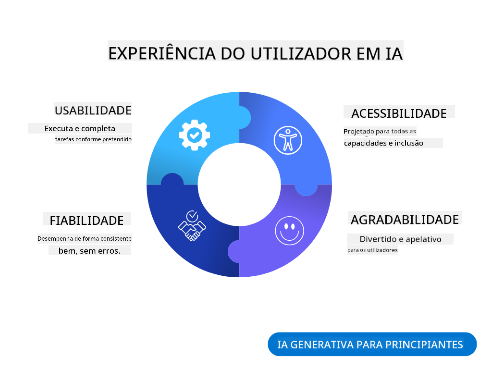

<!--
CO_OP_TRANSLATOR_METADATA:
{
  "original_hash": "78bbeed50fd4dc9fdee931f5daf98cb3",
  "translation_date": "2025-10-18T00:37:43+00:00",
  "source_file": "12-designing-ux-for-ai-applications/README.md",
  "language_code": "pt"
}
-->
# Design de UX para Aplicações de IA

> _(Clique na imagem acima para assistir ao vídeo desta lição)_

A experiência do utilizador é um aspeto muito importante na criação de aplicações. Os utilizadores precisam de conseguir usar a sua aplicação de forma eficiente para realizar tarefas. Ser eficiente é uma coisa, mas também é necessário projetar aplicações para que possam ser usadas por todos, tornando-as _acessíveis_. Este capítulo irá focar-se nesta área para que, idealmente, consiga projetar uma aplicação que as pessoas possam e queiram usar.

## Introdução

A experiência do utilizador refere-se à forma como um utilizador interage e utiliza um produto ou serviço específico, seja um sistema, ferramenta ou design. Ao desenvolver aplicações de IA, os programadores não se concentram apenas em garantir que a experiência do utilizador seja eficaz, mas também ética. Nesta lição, abordamos como construir aplicações de Inteligência Artificial (IA) que atendam às necessidades dos utilizadores.

A lição abordará as seguintes áreas:

- Introdução à Experiência do Utilizador e Compreensão das Necessidades dos Utilizadores
- Projetar Aplicações de IA para Confiança e Transparência
- Projetar Aplicações de IA para Colaboração e Feedback

## Objetivos de aprendizagem

Após concluir esta lição, será capaz de:

- Compreender como construir aplicações de IA que atendam às necessidades dos utilizadores.
- Projetar aplicações de IA que promovam confiança e colaboração.

### Pré-requisito

Reserve algum tempo para ler mais sobre [experiência do utilizador e design thinking.](https://learn.microsoft.com/training/modules/ux-design?WT.mc_id=academic-105485-koreyst)

## Introdução à Experiência do Utilizador e Compreensão das Necessidades dos Utilizadores

Na nossa startup fictícia de educação, temos dois utilizadores principais: professores e alunos. Cada um dos dois utilizadores tem necessidades únicas. Um design centrado no utilizador prioriza o utilizador, garantindo que os produtos sejam relevantes e benéficos para aqueles a quem se destinam.

A aplicação deve ser **útil, confiável, acessível e agradável** para proporcionar uma boa experiência ao utilizador.

### Usabilidade

Ser útil significa que a aplicação tem funcionalidades que correspondem ao seu propósito pretendido, como automatizar o processo de avaliação ou gerar cartões de estudo para revisão. Uma aplicação que automatiza o processo de avaliação deve ser capaz de atribuir pontuações de forma precisa e eficiente ao trabalho dos alunos com base em critérios predefinidos. Da mesma forma, uma aplicação que gera cartões de estudo deve ser capaz de criar perguntas relevantes e diversificadas com base nos seus dados.

### Confiabilidade

Ser confiável significa que a aplicação pode realizar a sua tarefa de forma consistente e sem erros. No entanto, a IA, assim como os humanos, não é perfeita e pode estar sujeita a erros. As aplicações podem encontrar erros ou situações inesperadas que exigem intervenção ou correção humana. Como lidar com erros? Na última seção desta lição, abordaremos como os sistemas e aplicações de IA são projetados para colaboração e feedback.

### Acessibilidade

Ser acessível significa estender a experiência do utilizador a utilizadores com várias capacidades, incluindo aqueles com deficiências, garantindo que ninguém seja excluído. Ao seguir diretrizes e princípios de acessibilidade, as soluções de IA tornam-se mais inclusivas, utilizáveis e benéficas para todos os utilizadores.

### Agradável

Ser agradável significa que a aplicação é prazerosa de usar. Uma experiência do utilizador atraente pode ter um impacto positivo no utilizador, incentivando-o a voltar à aplicação e aumentando a receita do negócio.

Nem todos os desafios podem ser resolvidos com IA. A IA entra em cena para complementar a experiência do utilizador, seja automatizando tarefas manuais ou personalizando experiências.

## Projetar Aplicações de IA para Confiança e Transparência

Construir confiança é fundamental ao projetar aplicações de IA. A confiança garante que o utilizador tenha confiança de que a aplicação realizará o trabalho, entregará resultados consistentemente e que os resultados são o que o utilizador precisa. Um risco nesta área é a desconfiança e a confiança excessiva. A desconfiança ocorre quando um utilizador tem pouca ou nenhuma confiança num sistema de IA, levando-o a rejeitar a sua aplicação. A confiança excessiva ocorre quando um utilizador superestima a capacidade de um sistema de IA, levando os utilizadores a confiarem demasiado no sistema de IA. Por exemplo, um sistema automatizado de avaliação, no caso de confiança excessiva, pode levar o professor a não verificar alguns dos trabalhos para garantir que o sistema de avaliação funciona bem. Isso pode resultar em notas injustas ou imprecisas para os alunos, ou oportunidades perdidas de feedback e melhoria.

Duas formas de garantir que a confiança está no centro do design são a explicabilidade e o controlo.

### Explicabilidade

Quando a IA ajuda a informar decisões, como transmitir conhecimento às gerações futuras, é fundamental que professores e pais compreendam como as decisões da IA são tomadas. Isso é explicabilidade - entender como as aplicações de IA tomam decisões. Projetar para a explicabilidade inclui adicionar detalhes que destacam como a IA chegou ao resultado. O público deve estar ciente de que o resultado é gerado pela IA e não por um humano. Por exemplo, em vez de dizer "Comece a conversar com o seu tutor agora", diga "Use o tutor de IA que se adapta às suas necessidades e ajuda-o a aprender ao seu ritmo."

Outro exemplo é como a IA utiliza dados do utilizador e dados pessoais. Por exemplo, um utilizador com a persona de estudante pode ter limitações com base na sua persona. A IA pode não ser capaz de revelar respostas às perguntas, mas pode ajudar a orientar o utilizador a pensar em como pode resolver um problema.

Uma última parte importante da explicabilidade é a simplificação das explicações. Estudantes e professores podem não ser especialistas em IA, portanto, as explicações sobre o que a aplicação pode ou não fazer devem ser simplificadas e fáceis de entender.

### Controlo

A IA generativa cria uma colaboração entre a IA e o utilizador, onde, por exemplo, um utilizador pode modificar os prompts para obter resultados diferentes. Além disso, uma vez que um resultado é gerado, os utilizadores devem ser capazes de modificar os resultados, dando-lhes uma sensação de controlo. Por exemplo, ao usar o Bing, pode ajustar o seu prompt com base no formato, tom e comprimento. Além disso, pode fazer alterações ao seu resultado e modificá-lo conforme mostrado abaixo:

Outra funcionalidade no Bing que permite ao utilizador ter controlo sobre a aplicação é a capacidade de optar por participar ou não nos dados que a IA utiliza. Para uma aplicação escolar, um aluno pode querer usar as suas notas, bem como os recursos do professor como material de revisão.

> Ao projetar aplicações de IA, a intencionalidade é fundamental para garantir que os utilizadores não confiem excessivamente, criando expectativas irrealistas sobre as suas capacidades. Uma forma de fazer isso é criar fricção entre os prompts e os resultados. Lembrando o utilizador de que esta é uma IA e não um ser humano.

## Projetar Aplicações de IA para Colaboração e Feedback

Como mencionado anteriormente, a IA generativa cria uma colaboração entre o utilizador e a IA. A maioria das interações ocorre com um utilizador inserindo um prompt e a IA gerando um resultado. E se o resultado estiver incorreto? Como a aplicação lida com erros, caso ocorram? A IA culpa o utilizador ou explica o erro?

As aplicações de IA devem ser projetadas para receber e fornecer feedback. Isso não apenas ajuda o sistema de IA a melhorar, mas também constrói confiança com os utilizadores. Um ciclo de feedback deve ser incluído no design, um exemplo pode ser um simples polegar para cima ou para baixo no resultado.

Outra forma de lidar com isso é comunicar claramente as capacidades e limitações do sistema. Quando um utilizador comete um erro ao solicitar algo além das capacidades da IA, também deve haver uma forma de lidar com isso, como mostrado abaixo.

Erros de sistema são comuns em aplicações onde o utilizador pode precisar de assistência com informações fora do alcance da IA ou a aplicação pode ter um limite de quantas perguntas/assuntos um utilizador pode gerar resumos. Por exemplo, uma aplicação de IA treinada com dados sobre assuntos limitados, como História e Matemática, pode não ser capaz de lidar com perguntas sobre Geografia. Para mitigar isso, o sistema de IA pode dar uma resposta como: "Desculpe, o nosso produto foi treinado com dados nos seguintes assuntos....., não consigo responder à pergunta que fez."

As aplicações de IA não são perfeitas, portanto, estão sujeitas a cometer erros. Ao projetar as suas aplicações, deve garantir que cria espaço para feedback dos utilizadores e para lidar com erros de forma simples e facilmente compreensível.

## Tarefa

Pegue em qualquer aplicação de IA que tenha desenvolvido até agora e considere implementar os passos abaixo na sua aplicação:

- **Agradável:** Considere como pode tornar a sua aplicação mais agradável. Está a adicionar explicações em todos os lugares? Está a incentivar o utilizador a explorar? Como está a formular as suas mensagens de erro?

- **Usabilidade:** Ao construir uma aplicação web, certifique-se de que a sua aplicação é navegável tanto por rato como por teclado.

- **Confiança e transparência:** Não confie completamente na IA e nos seus resultados, considere como adicionaria um humano ao processo para verificar os resultados. Além disso, considere e implemente outras formas de alcançar confiança e transparência.

- **Controlo:** Dê ao utilizador controlo sobre os dados que fornece à aplicação. Implemente uma forma de o utilizador optar por participar ou não na recolha de dados pela aplicação de IA.

## Continue a sua aprendizagem!

Depois de concluir esta lição, consulte a nossa [coleção de aprendizagem sobre IA generativa](https://aka.ms/genai-collection?WT.mc_id=academic-105485-koreyst) para continuar a aprofundar os seus conhecimentos sobre IA generativa!

Avance para a Lição 13, onde exploraremos como [proteger aplicações de IA](../13-securing-ai-applications/README.md?WT.mc_id=academic-105485-koreyst)!

---

**Aviso Legal**:  
Este documento foi traduzido utilizando o serviço de tradução por IA [Co-op Translator](https://github.com/Azure/co-op-translator). Embora nos esforcemos pela precisão, esteja ciente de que traduções automáticas podem conter erros ou imprecisões. O documento original na sua língua nativa deve ser considerado a fonte autoritária. Para informações críticas, recomenda-se uma tradução profissional humana. Não nos responsabilizamos por quaisquer mal-entendidos ou interpretações incorretas decorrentes do uso desta tradução.