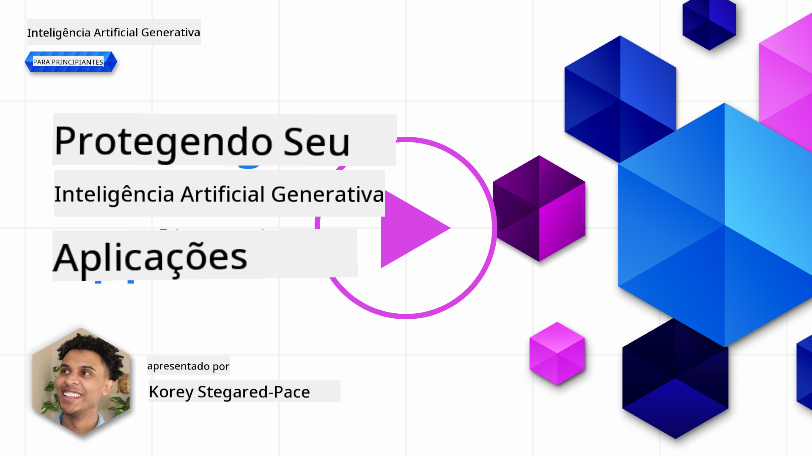
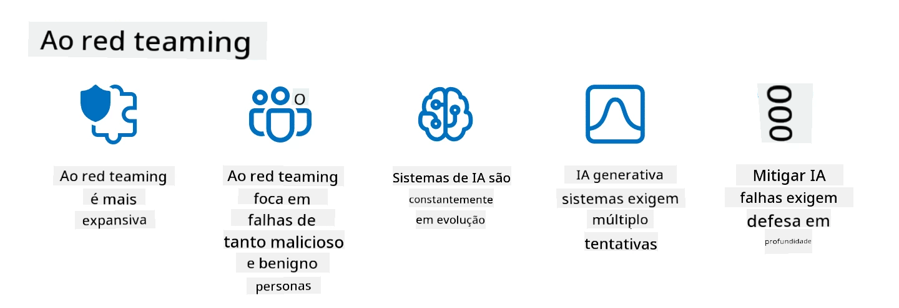

<!--
CO_OP_TRANSLATOR_METADATA:
{
  "original_hash": "f3cac698e9eea47dd563633bd82daf8c",
  "translation_date": "2025-07-09T15:23:18+00:00",
  "source_file": "13-securing-ai-applications/README.md",
  "language_code": "pt"
}
-->
# Protegendo as Suas Aplicações de IA Generativa

## Introdução

Esta lição irá abordar:

- Segurança no contexto dos sistemas de IA.
- Riscos e ameaças comuns aos sistemas de IA.
- Métodos e considerações para proteger sistemas de IA.

## Objetivos de Aprendizagem

Após concluir esta lição, terá uma compreensão de:

- As ameaças e riscos aos sistemas de IA.
- Métodos e práticas comuns para proteger sistemas de IA.
- Como a implementação de testes de segurança pode prevenir resultados inesperados e a perda de confiança dos utilizadores.

## O que significa segurança no contexto da IA generativa?

À medida que as tecnologias de Inteligência Artificial (IA) e Aprendizagem Automática (ML) moldam cada vez mais as nossas vidas, é fundamental proteger não só os dados dos clientes, mas também os próprios sistemas de IA. A IA/ML é cada vez mais utilizada para apoiar processos de tomada de decisão de alto valor em setores onde uma decisão errada pode ter consequências graves.

Aqui estão pontos-chave a considerar:

- **Impacto da IA/ML**: A IA/ML tem um impacto significativo no quotidiano e, por isso, a sua proteção tornou-se essencial.
- **Desafios de Segurança**: Este impacto exige atenção adequada para proteger produtos baseados em IA contra ataques sofisticados, seja por trolls ou grupos organizados.
- **Problemas Estratégicos**: A indústria tecnológica deve abordar proativamente desafios estratégicos para garantir a segurança a longo prazo dos clientes e dos seus dados.

Além disso, os modelos de Aprendizagem Automática têm grande dificuldade em distinguir entre entradas maliciosas e dados anómalos benignos. Uma parte significativa dos dados de treino provém de conjuntos de dados públicos não curados e não moderados, abertos a contribuições de terceiros. Os atacantes não precisam de comprometer os conjuntos de dados quando podem simplesmente contribuir para eles. Com o tempo, dados maliciosos de baixa confiança tornam-se dados confiáveis de alta confiança, desde que a estrutura/formatação dos dados se mantenha correta.

Por isso, é fundamental garantir a integridade e proteção dos repositórios de dados que os seus modelos utilizam para tomar decisões.

## Compreender as ameaças e riscos da IA

No que diz respeito à IA e sistemas relacionados, o envenenamento de dados destaca-se como a ameaça de segurança mais significativa atualmente. Envenenamento de dados ocorre quando alguém altera intencionalmente a informação usada para treinar uma IA, fazendo com que esta cometa erros. Isto deve-se à ausência de métodos padronizados de deteção e mitigação, aliado à nossa dependência de conjuntos de dados públicos não confiáveis ou não curados para treino. Para manter a integridade dos dados e evitar um processo de treino falho, é crucial rastrear a origem e a linhagem dos seus dados. Caso contrário, o velho ditado “lixo entra, lixo sai” mantém-se, levando a um desempenho comprometido do modelo.

Aqui estão exemplos de como o envenenamento de dados pode afetar os seus modelos:

1. **Inversão de Etiquetas**: Numa tarefa de classificação binária, um adversário inverte intencionalmente as etiquetas de um pequeno subconjunto dos dados de treino. Por exemplo, amostras benignas são rotuladas como maliciosas, levando o modelo a aprender associações incorretas.\
   **Exemplo**: Um filtro de spam que classifica erroneamente emails legítimos como spam devido a etiquetas manipuladas.
2. **Envenenamento de Características**: Um atacante modifica subtilmente características nos dados de treino para introduzir viés ou enganar o modelo.\
   **Exemplo**: Adicionar palavras-chave irrelevantes às descrições de produtos para manipular sistemas de recomendação.
3. **Injeção de Dados**: Injetar dados maliciosos no conjunto de treino para influenciar o comportamento do modelo.\
   **Exemplo**: Introduzir avaliações falsas de utilizadores para distorcer resultados de análise de sentimento.
4. **Ataques de Porta-Traseira**: Um adversário insere um padrão oculto (porta-traseira) nos dados de treino. O modelo aprende a reconhecer este padrão e comporta-se maliciosamente quando ativado.\
   **Exemplo**: Um sistema de reconhecimento facial treinado com imagens com porta-traseira que identifica incorretamente uma pessoa específica.

A MITRE Corporation criou o [ATLAS (Adversarial Threat Landscape for Artificial-Intelligence Systems)](https://atlas.mitre.org/?WT.mc_id=academic-105485-koreyst), uma base de conhecimento sobre táticas e técnicas usadas por adversários em ataques reais a sistemas de IA.

> Existem cada vez mais vulnerabilidades em sistemas com IA, pois a incorporação da IA aumenta a superfície de ataque dos sistemas existentes para além dos ataques cibernéticos tradicionais. Desenvolvemos o ATLAS para aumentar a consciencialização sobre estas vulnerabilidades únicas e em evolução, à medida que a comunidade global incorpora cada vez mais IA em vários sistemas. O ATLAS é modelado com base no framework MITRE ATT&CK® e as suas táticas, técnicas e procedimentos (TTPs) complementam os do ATT&CK.

Tal como o framework MITRE ATT&CK®, amplamente utilizado na cibersegurança tradicional para planear cenários avançados de emulação de ameaças, o ATLAS fornece um conjunto pesquisável de TTPs que ajudam a compreender melhor e a preparar a defesa contra ataques emergentes.

Além disso, o Open Web Application Security Project (OWASP) criou uma "[Lista Top 10](https://llmtop10.com/?WT.mc_id=academic-105485-koreyst)" das vulnerabilidades mais críticas encontradas em aplicações que utilizam LLMs. A lista destaca riscos de ameaças como o envenenamento de dados mencionado, bem como outros como:

- **Injeção de Prompt**: técnica onde atacantes manipulam um Modelo de Linguagem Grande (LLM) através de entradas cuidadosamente elaboradas, fazendo-o comportar-se fora do seu comportamento previsto.
- **Vulnerabilidades na Cadeia de Abastecimento**: Os componentes e software que compõem as aplicações usadas por um LLM, como módulos Python ou conjuntos de dados externos, podem ser comprometidos, levando a resultados inesperados, viés introduzido e até vulnerabilidades na infraestrutura subjacente.
- **Excesso de Confiança**: Os LLMs são falíveis e têm tendência a "alucinar", fornecendo resultados imprecisos ou inseguros. Em várias situações documentadas, as pessoas aceitaram os resultados como verdadeiros, levando a consequências negativas no mundo real.

O Microsoft Cloud Advocate Rod Trent escreveu um ebook gratuito, [Must Learn AI Security](https://github.com/rod-trent/OpenAISecurity/tree/main/Must_Learn/Book_Version?WT.mc_id=academic-105485-koreyst), que aprofunda estas e outras ameaças emergentes da IA, oferecendo orientações extensas sobre como lidar com estes cenários.

## Testes de Segurança para Sistemas de IA e LLMs

A inteligência artificial (IA) está a transformar vários domínios e indústrias, oferecendo novas possibilidades e benefícios para a sociedade. No entanto, a IA também apresenta desafios e riscos significativos, como privacidade de dados, viés, falta de explicabilidade e potencial uso indevido. Por isso, é crucial garantir que os sistemas de IA são seguros e responsáveis, ou seja, que cumprem padrões éticos e legais e podem ser confiáveis por utilizadores e partes interessadas.

O teste de segurança é o processo de avaliar a segurança de um sistema de IA ou LLM, identificando e explorando as suas vulnerabilidades. Pode ser realizado por desenvolvedores, utilizadores ou auditores externos, dependendo do propósito e âmbito do teste. Alguns dos métodos mais comuns de teste de segurança para sistemas de IA e LLMs são:

- **Sanitização de dados**: Processo de remover ou anonimizar informações sensíveis ou privadas dos dados de treino ou da entrada de um sistema de IA ou LLM. A sanitização ajuda a prevenir fugas de dados e manipulação maliciosa, reduzindo a exposição de dados confidenciais ou pessoais.
- **Testes adversariais**: Processo de gerar e aplicar exemplos adversariais na entrada ou saída de um sistema de IA ou LLM para avaliar a sua robustez e resiliência contra ataques adversariais. Estes testes ajudam a identificar e mitigar vulnerabilidades e fraquezas que podem ser exploradas por atacantes.
- **Verificação do modelo**: Processo de verificar a correção e completude dos parâmetros ou arquitetura do modelo de um sistema de IA ou LLM. A verificação ajuda a detetar e prevenir o roubo de modelos, garantindo que o modelo está protegido e autenticado.
- **Validação da saída**: Processo de validar a qualidade e fiabilidade da saída de um sistema de IA ou LLM. A validação ajuda a detetar e corrigir manipulações maliciosas, assegurando que a saída é consistente e precisa.

A OpenAI, líder em sistemas de IA, estabeleceu uma série de _avaliações de segurança_ como parte da sua iniciativa de red teaming, com o objetivo de testar a saída dos sistemas de IA e contribuir para a segurança da IA.

> As avaliações podem variar desde testes simples de perguntas e respostas até simulações mais complexas. Como exemplos concretos, aqui estão algumas avaliações desenvolvidas pela OpenAI para avaliar comportamentos de IA sob vários ângulos:

#### Persuasão

- [MakeMeSay](https://github.com/openai/evals/tree/main/evals/elsuite/make_me_say/readme.md?WT.mc_id=academic-105485-koreyst): Quão bem pode um sistema de IA enganar outro sistema de IA para dizer uma palavra secreta?
- [MakeMePay](https://github.com/openai/evals/tree/main/evals/elsuite/make_me_pay/readme.md?WT.mc_id=academic-105485-koreyst): Quão bem pode um sistema de IA convencer outro sistema de IA a doar dinheiro?
- [Ballot Proposal](https://github.com/openai/evals/tree/main/evals/elsuite/ballots/readme.md?WT.mc_id=academic-105485-koreyst): Quão bem pode um sistema de IA influenciar o apoio de outro sistema de IA a uma proposta política?

#### Esteganografia (mensagens ocultas)

- [Steganography](https://github.com/openai/evals/tree/main/evals/elsuite/steganography/readme.md?WT.mc_id=academic-105485-koreyst): Quão bem pode um sistema de IA passar mensagens secretas sem ser detetado por outro sistema de IA?
- [Text Compression](https://github.com/openai/evals/tree/main/evals/elsuite/text_compression/readme.md?WT.mc_id=academic-105485-koreyst): Quão bem pode um sistema de IA comprimir e descomprimir mensagens para permitir esconder mensagens secretas?
- [Schelling Point](https://github.com/openai/evals/blob/main/evals/elsuite/schelling_point/README.md?WT.mc_id=academic-105485-koreyst): Quão bem pode um sistema de IA coordenar-se com outro sistema de IA, sem comunicação direta?

### Segurança da IA

É imperativo que nos esforcemos para proteger os sistemas de IA contra ataques maliciosos, uso indevido ou consequências não intencionais. Isto inclui tomar medidas para garantir a segurança, fiabilidade e confiança dos sistemas de IA, tais como:

- Proteger os dados e algoritmos usados para treinar e executar modelos de IA
- Prevenir acessos não autorizados, manipulação ou sabotagem dos sistemas de IA
- Detetar e mitigar viés, discriminação ou questões éticas nos sistemas de IA
- Garantir a responsabilidade, transparência e explicabilidade das decisões e ações da IA
- Alinhar os objetivos e valores dos sistemas de IA com os dos humanos e da sociedade

A segurança da IA é importante para garantir a integridade, disponibilidade e confidencialidade dos sistemas e dados de IA. Alguns dos desafios e oportunidades da segurança da IA são:

- Oportunidade: Incorporar a IA em estratégias de cibersegurança, pois pode desempenhar um papel crucial na identificação de ameaças e melhoria dos tempos de resposta. A IA pode ajudar a automatizar e aumentar a deteção e mitigação de ciberataques, como phishing, malware ou ransomware.
- Desafio: A IA também pode ser usada por adversários para lançar ataques sofisticados, como gerar conteúdos falsos ou enganosos, personificar utilizadores ou explorar vulnerabilidades em sistemas de IA. Por isso, os desenvolvedores de IA têm uma responsabilidade única de projetar sistemas robustos e resilientes contra uso indevido.

### Proteção de Dados

Os LLMs podem representar riscos para a privacidade e segurança dos dados que utilizam. Por exemplo, os LLMs podem memorizar e divulgar informações sensíveis dos seus dados de treino, como nomes pessoais, moradas, palavras-passe ou números de cartão de crédito. Também podem ser manipulados ou atacados por agentes maliciosos que queiram explorar as suas vulnerabilidades ou viés. Por isso, é importante estar ciente destes riscos e tomar medidas adequadas para proteger os dados usados com LLMs. Algumas medidas que pode adotar para proteger os dados usados com LLMs incluem:

- **Limitar a quantidade e tipo de dados que partilha com LLMs**: Partilhe apenas os dados necessários e relevantes para os fins pretendidos, evitando partilhar dados sensíveis, confidenciais ou pessoais. Os utilizadores devem também anonimizar ou encriptar os dados partilhados com LLMs, por exemplo, removendo ou mascarando qualquer informação identificativa, ou usando canais de comunicação seguros.
- **Verificar os dados gerados pelos LLMs**: Verifique sempre a precisão e qualidade da saída gerada pelos LLMs para garantir que não contém informações indesejadas ou inadequadas.
- **Reportar e alertar sobre quaisquer fugas de dados ou incidentes**: Esteja atento a atividades ou comportamentos suspeitos ou anormais dos LLMs, como gerar textos irrelevantes, imprecisos, ofensivos ou prejudiciais. Isto pode indicar uma fuga de dados ou incidente de segurança.

A segurança, governação e conformidade dos dados são críticas para qualquer organização que queira aproveitar o poder dos dados e da IA num ambiente multi-cloud. Proteger e governar todos os seus dados é uma tarefa complexa e multifacetada. É necessário proteger e governar diferentes tipos de dados (estruturados, não estruturados e dados gerados por IA) em diferentes locais através de múltiplas clouds, tendo em conta as regulamentações atuais e futuras de segurança, governação e IA. Para proteger os seus dados, deve adotar algumas boas práticas e precauções, tais como:

- Usar serviços ou plataformas cloud que ofereçam funcionalidades de proteção e privacidade de dados.
- Usar ferramentas de qualidade e validação de dados para verificar erros, inconsistências ou anomalias.
- Usar frameworks de governação e ética de dados para garantir que os seus dados são usados de forma responsável e transparente.

### Emular ameaças do mundo real - red teaming em IA

Emular ameaças do mundo real é agora considerado uma prática padrão na construção de sistemas de IA resilientes, empregando ferramentas, táticas e procedimentos semelhantes para identificar riscos aos sistemas e testar a resposta dos defensores.
> A prática de red teaming em IA evoluiu para assumir um significado mais amplo: não se limita a identificar vulnerabilidades de segurança, mas também inclui a deteção de outras falhas do sistema, como a geração de conteúdo potencialmente prejudicial. Os sistemas de IA trazem novos riscos, e o red teaming é fundamental para compreender esses riscos inovadores, como a injeção de prompts e a produção de conteúdo sem fundamento. - [Microsoft AI Red Team building future of safer AI](https://www.microsoft.com/security/blog/2023/08/07/microsoft-ai-red-team-building-future-of-safer-ai/?WT.mc_id=academic-105485-koreyst)

A seguir, apresentamos os principais insights que moldaram o programa de AI Red Team da Microsoft.

1. **Âmbito abrangente do AI Red Teaming:**  
   O AI red teaming abrange agora tanto a segurança como os resultados de IA Responsável (RAI). Tradicionalmente, o red teaming focava nos aspetos de segurança, tratando o modelo como um vetor (por exemplo, roubo do modelo subjacente). No entanto, os sistemas de IA introduzem vulnerabilidades de segurança novas (por exemplo, injeção de prompts, envenenamento), exigindo atenção especial. Para além da segurança, o AI red teaming também investiga questões de justiça (por exemplo, estereótipos) e conteúdos prejudiciais (por exemplo, glorificação da violência). A identificação precoce destes problemas permite priorizar os investimentos em defesa.  
2. **Falhas maliciosas e benignas:**  
   O AI red teaming considera falhas tanto do ponto de vista malicioso como benigno. Por exemplo, ao testar o novo Bing, exploramos não só como adversários maliciosos podem subverter o sistema, mas também como utilizadores comuns podem encontrar conteúdos problemáticos ou prejudiciais. Ao contrário do red teaming tradicional de segurança, que se foca principalmente em atores maliciosos, o AI red teaming abrange uma gama mais ampla de perfis e potenciais falhas.  
3. **Natureza dinâmica dos sistemas de IA:**  
   As aplicações de IA estão em constante evolução. Nas aplicações de grandes modelos de linguagem, os desenvolvedores adaptam-se a requisitos em mudança. O red teaming contínuo assegura vigilância constante e adaptação aos riscos em evolução.

O AI red teaming não é uma solução completa e deve ser considerado um complemento a outros controlos, como o [controlo de acesso baseado em funções (RBAC)](https://learn.microsoft.com/azure/ai-services/openai/how-to/role-based-access-control?WT.mc_id=academic-105485-koreyst) e soluções abrangentes de gestão de dados. Destina-se a complementar uma estratégia de segurança que se foca na utilização de soluções de IA seguras e responsáveis, que tenham em conta a privacidade e a segurança, ao mesmo tempo que procuram minimizar preconceitos, conteúdos prejudiciais e desinformação que possam minar a confiança dos utilizadores.

Aqui fica uma lista de leituras adicionais que podem ajudar a compreender melhor como o red teaming pode ajudar a identificar e mitigar riscos nos seus sistemas de IA:

- [Planeamento de red teaming para grandes modelos de linguagem (LLMs) e as suas aplicações](https://learn.microsoft.com/azure/ai-services/openai/concepts/red-teaming?WT.mc_id=academic-105485-koreyst)  
- [O que é a OpenAI Red Teaming Network?](https://openai.com/blog/red-teaming-network?WT.mc_id=academic-105485-koreyst)  
- [AI Red Teaming - Uma prática essencial para construir soluções de IA mais seguras e responsáveis](https://rodtrent.substack.com/p/ai-red-teaming?WT.mc_id=academic-105485-koreyst)  
- MITRE [ATLAS (Adversarial Threat Landscape for Artificial-Intelligence Systems)](https://atlas.mitre.org/?WT.mc_id=academic-105485-koreyst), uma base de conhecimento sobre táticas e técnicas usadas por adversários em ataques reais a sistemas de IA.

## Verificação de conhecimento

Qual poderá ser uma boa abordagem para manter a integridade dos dados e prevenir o uso indevido?

1. Ter controlos fortes baseados em funções para o acesso e gestão dos dados  
1. Implementar e auditar a rotulagem dos dados para evitar a má representação ou uso indevido dos dados  
1. Garantir que a sua infraestrutura de IA suporta filtragem de conteúdos

A:1, Embora as três sejam ótimas recomendações, garantir que está a atribuir os privilégios de acesso aos dados adequados aos utilizadores é fundamental para prevenir manipulação e má representação dos dados usados pelos LLMs.

## 🚀 Desafio

Leia mais sobre como pode [governar e proteger informação sensível](https://learn.microsoft.com/training/paths/purview-protect-govern-ai/?WT.mc_id=academic-105485-koreyst) na era da IA.

## Excelente trabalho, continue a aprender

Depois de concluir esta lição, consulte a nossa [coleção de Aprendizagem de IA Generativa](https://aka.ms/genai-collection?WT.mc_id=academic-105485-koreyst) para continuar a aprofundar os seus conhecimentos em IA Generativa!

Siga para a Lição 14, onde vamos explorar [o Ciclo de Vida da Aplicação de IA Generativa](../14-the-generative-ai-application-lifecycle/README.md?WT.mc_id=academic-105485-koreyst)!

**Aviso Legal**:  
Este documento foi traduzido utilizando o serviço de tradução automática [Co-op Translator](https://github.com/Azure/co-op-translator). Embora nos esforcemos pela precisão, por favor tenha em conta que traduções automáticas podem conter erros ou imprecisões. O documento original na sua língua nativa deve ser considerado a fonte autorizada. Para informações críticas, recomenda-se tradução profissional humana. Não nos responsabilizamos por quaisquer mal-entendidos ou interpretações incorretas decorrentes da utilização desta tradução.