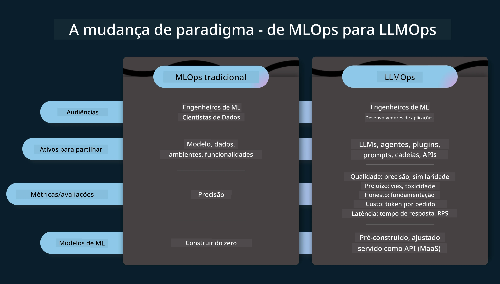
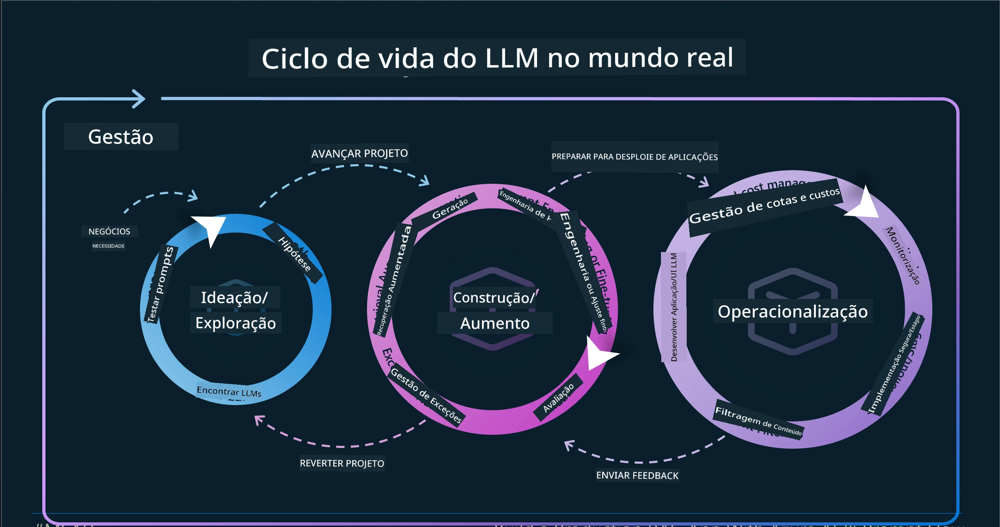
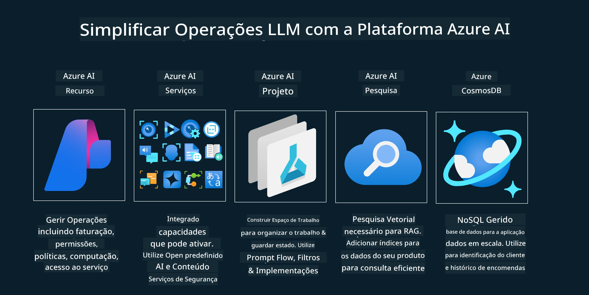

<!--
CO_OP_TRANSLATOR_METADATA:
{
  "original_hash": "df44972d5575ea8cef3c52ee31696d04",
  "translation_date": "2025-12-19T14:30:17+00:00",
  "source_file": "14-the-generative-ai-application-lifecycle/README.md",
  "language_code": "pt"
}
-->

# O Ciclo de Vida da Aplicação de IA Generativa

Uma questão importante para todas as aplicações de IA é a relevância das funcionalidades de IA, uma vez que a IA é um campo em rápida evolução, para garantir que a sua aplicação se mantenha relevante, fiável e robusta, é necessário monitorizá-la, avaliá-la e melhorá-la continuamente. É aqui que entra o ciclo de vida da IA generativa.

O ciclo de vida da IA generativa é uma estrutura que o guia através das etapas de desenvolvimento, implementação e manutenção de uma aplicação de IA generativa. Ajuda-o a definir os seus objetivos, medir o seu desempenho, identificar os seus desafios e implementar as suas soluções. Também o ajuda a alinhar a sua aplicação com os padrões éticos e legais do seu domínio e dos seus intervenientes. Seguindo o ciclo de vida da IA generativa, pode garantir que a sua aplicação está sempre a entregar valor e a satisfazer os seus utilizadores.

## Introdução

Neste capítulo, irá:

- Compreender a Mudança de Paradigma de MLOps para LLMOps
- O Ciclo de Vida do LLM
- Ferramentas do Ciclo de Vida
- Métricas e Avaliação do Ciclo de Vida

## Compreender a Mudança de Paradigma de MLOps para LLMOps

Os LLMs são uma nova ferramenta no arsenal da Inteligência Artificial, são incrivelmente poderosos em tarefas de análise e geração para aplicações, no entanto, este poder tem algumas consequências na forma como simplificamos as tarefas de IA e Aprendizagem Automática Clássica.

Com isto, precisamos de um novo Paradigma para adaptar esta ferramenta de forma dinâmica, com os incentivos corretos. Podemos categorizar as aplicações de IA mais antigas como "Apps ML" e as aplicações de IA mais recentes como "Apps GenAI" ou simplesmente "Apps IA", refletindo a tecnologia e técnicas predominantes usadas na altura. Isto muda a nossa narrativa de várias formas, veja a comparação seguinte.

Note que em LLMOps, estamos mais focados nos Desenvolvedores de Aplicações, usando integrações como ponto chave, utilizando "Modelos-como-Serviço" e pensando nos seguintes pontos para métricas.

- Qualidade: Qualidade da resposta
- Dano: IA responsável
- Honestidade: Fundamentação da resposta (Faz sentido? Está correta?)
- Custo: Orçamento da solução
- Latência: Tempo médio para resposta de token

## O Ciclo de Vida do LLM

Primeiro, para entender o ciclo de vida e as modificações, vejamos o próximo infográfico.

Como pode notar, isto é diferente dos Ciclos de Vida habituais do MLOps. Os LLMs têm muitos novos requisitos, como Prompting, diferentes técnicas para melhorar a qualidade (Fine-Tuning, RAG, Meta-Prompts), diferentes avaliações e responsabilidade com IA responsável, por fim, novas métricas de avaliação (Qualidade, Dano, Honestidade, Custo e Latência).

Por exemplo, veja como idealizamos. Usando engenharia de prompts para experimentar com vários LLMs para explorar possibilidades e testar se a sua Hipótese poderia estar correta.

Note que isto não é linear, mas sim ciclos integrados, iterativos e com um ciclo abrangente.

Como poderíamos explorar esses passos? Vamos detalhar como construir um ciclo de vida.

Isto pode parecer um pouco complicado, vamos focar primeiro nos três grandes passos.

1. Idealizar/Explorar: Exploração, aqui podemos explorar de acordo com as necessidades do nosso negócio. Prototipar, criar um [PromptFlow](https://microsoft.github.io/promptflow/index.html?WT.mc_id=academic-105485-koreyst) e testar se é eficiente para a nossa Hipótese.
1. Construir/Aumentar: Implementação, agora, começamos a avaliar para conjuntos de dados maiores, implementar técnicas como Fine-tuning e RAG, para verificar a robustez da nossa solução. Se não funcionar, reimplementá-la, adicionar novos passos no nosso fluxo ou reestruturar os dados pode ajudar. Após testar o nosso fluxo e escala, se funcionar e verificar as nossas Métricas, está pronto para o próximo passo.
1. Operacionalizar: Integração, agora adicionando Sistemas de Monitorização e Alertas ao nosso sistema, implementação e integração da aplicação na nossa Aplicação.

Depois, temos o ciclo abrangente de Gestão, focando em segurança, conformidade e governação.

Parabéns, agora tem a sua App de IA pronta para usar e operacional. Para uma experiência prática, veja a [Demonstração Contoso Chat.](https://nitya.github.io/contoso-chat/?WT.mc_id=academic-105485-koreys)

Agora, que ferramentas poderíamos usar?

## Ferramentas do Ciclo de Vida

Para ferramentas, a Microsoft fornece a [Plataforma Azure AI](https://azure.microsoft.com/solutions/ai/?WT.mc_id=academic-105485-koreys) e o [PromptFlow](https://microsoft.github.io/promptflow/index.html?WT.mc_id=academic-105485-koreyst) que facilitam e tornam o seu ciclo fácil de implementar e pronto a usar.

A [Plataforma Azure AI](https://azure.microsoft.com/solutions/ai/?WT.mc_id=academic-105485-koreys), permite-lhe usar o [AI Studio](https://ai.azure.com/?WT.mc_id=academic-105485-koreys). O AI Studio é um portal web que permite explorar modelos, exemplos e ferramentas. Gerir os seus recursos, fluxos de desenvolvimento UI e opções SDK/CLI para desenvolvimento Code-First.

O Azure AI permite-lhe usar múltiplos recursos, para gerir as suas operações, serviços, projetos, pesquisa vetorial e necessidades de bases de dados.

Construa, desde Prova de Conceito (POC) até aplicações em larga escala com PromptFlow:

- Desenhe e construa aplicações a partir do VS Code, com ferramentas visuais e funcionais
- Teste e ajuste as suas aplicações para IA de qualidade, com facilidade.
- Use o Azure AI Studio para integrar e iterar com a cloud, enviar e implementar para integração rápida.

## Ótimo! Continue a sua Aprendizagem!

Incrível, agora aprenda mais sobre como estruturamos uma aplicação para usar os conceitos com a [App Contoso Chat](https://nitya.github.io/contoso-chat/?WT.mc_id=academic-105485-koreyst), para ver como a Cloud Advocacy adiciona esses conceitos em demonstrações. Para mais conteúdo, veja a nossa [sessão breakout do Ignite!
](https://www.youtube.com/watch?v=DdOylyrTOWg)

Agora, veja a Lição 15, para entender como [Retrieval Augmented Generation e Bases de Dados Vetoriais](../15-rag-and-vector-databases/README.md?WT.mc_id=academic-105485-koreyst) impactam a IA Generativa e para criar aplicações mais envolventes!

---

<!-- CO-OP TRANSLATOR DISCLAIMER START -->
**Aviso Legal**:
Este documento foi traduzido utilizando o serviço de tradução automática [Co-op Translator](https://github.com/Azure/co-op-translator). Embora nos esforcemos para garantir a precisão, por favor tenha em conta que traduções automáticas podem conter erros ou imprecisões. O documento original na sua língua nativa deve ser considerado a fonte autorizada. Para informações críticas, recomenda-se a tradução profissional humana. Não nos responsabilizamos por quaisquer mal-entendidos ou interpretações erradas decorrentes do uso desta tradução.
<!-- CO-OP TRANSLATOR DISCLAIMER END -->