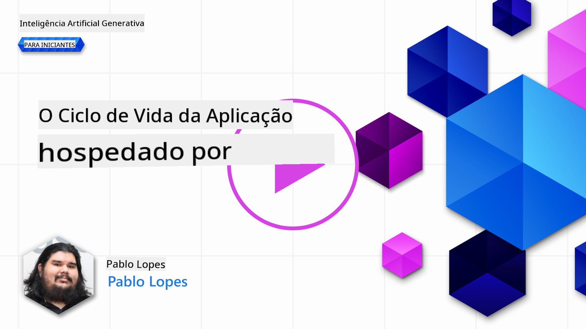
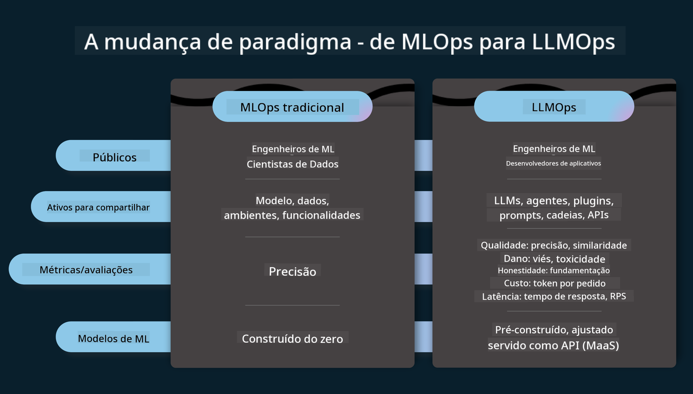
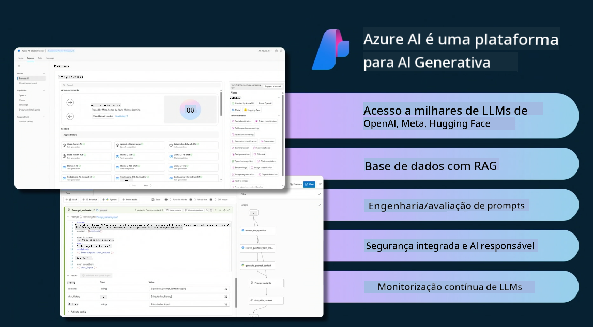
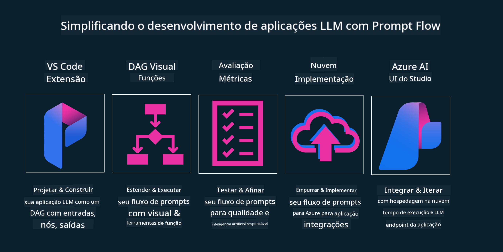

<!--
CO_OP_TRANSLATOR_METADATA:
{
  "original_hash": "27a5347a5022d5ef0a72ab029b03526a",
  "translation_date": "2025-05-19T23:25:40+00:00",
  "source_file": "14-the-generative-ai-application-lifecycle/README.md",
  "language_code": "pt"
}
-->

# O Ciclo de Vida de Aplicações de IA Generativa

Uma pergunta importante para todas as aplicações de IA é a relevância das funcionalidades de IA, já que a IA é um campo em rápida evolução. Para garantir que sua aplicação permaneça relevante, confiável e robusta, é necessário monitorá-la, avaliá-la e melhorá-la continuamente. É aqui que entra o ciclo de vida da IA generativa.

O ciclo de vida da IA generativa é um framework que orienta você pelas etapas de desenvolvimento, implantação e manutenção de uma aplicação de IA generativa. Ele ajuda a definir seus objetivos, medir seu desempenho, identificar seus desafios e implementar suas soluções. Também auxilia a alinhar sua aplicação com os padrões éticos e legais do seu domínio e dos seus stakeholders. Ao seguir o ciclo de vida da IA generativa, você pode garantir que sua aplicação esteja sempre entregando valor e satisfazendo seus usuários.

## Introdução

Neste capítulo, você irá:

- Compreender a Mudança de Paradigma de MLOps para LLMOps
- O Ciclo de Vida de LLM
- Ferramentas do Ciclo de Vida
- Avaliação e Metrificação do Ciclo de Vida

## Compreender a Mudança de Paradigma de MLOps para LLMOps

LLMs são uma nova ferramenta no arsenal da Inteligência Artificial, incrivelmente poderosas em tarefas de análise e geração para aplicações. No entanto, esse poder traz algumas consequências sobre como otimizamos tarefas de IA e Aprendizado de Máquina Clássico.

Com isso, precisamos de um novo paradigma para adaptar essa ferramenta de forma dinâmica, com os incentivos corretos. Podemos categorizar aplicativos de IA mais antigos como "Apps de ML" e aplicativos de IA mais novos como "Apps de GenAI" ou simplesmente "Apps de IA", refletindo a tecnologia e técnicas predominantes na época. Isso muda nossa narrativa de várias formas, veja a comparação a seguir.

Observe que em LLMOps, estamos mais focados nos Desenvolvedores de Aplicativos, usando integrações como um ponto-chave, utilizando "Modelos-como-um-Serviço" e pensando nos seguintes pontos para métricas.

- Qualidade: Qualidade da resposta
- Dano: IA responsável
- Honestidade: Fundamentação da resposta (Faz sentido? Está correto?)
- Custo: Orçamento da solução
- Latência: Tempo médio para resposta de token

## O Ciclo de Vida de LLM

Primeiro, para entender o ciclo de vida e as modificações, vamos observar o próximo infográfico.

Como você pode notar, isso é diferente dos ciclos de vida usuais de MLOps. LLMs têm muitos novos requisitos, como Prompting, diferentes técnicas para melhorar a qualidade (Ajuste Fino, RAG, Meta-Prompts), diferentes avaliações e responsabilidade com IA responsável, e por último, novas métricas de avaliação (Qualidade, Dano, Honestidade, Custo e Latência).

Por exemplo, veja como idealizamos. Usando engenharia de prompt para experimentar com vários LLMs para explorar possibilidades e testar se suas hipóteses poderiam estar corretas.

Note que isso não é linear, mas sim ciclos integrados, iterativos e com um ciclo abrangente.

Como poderíamos explorar essas etapas? Vamos detalhar como poderíamos construir um ciclo de vida.

Isso pode parecer um pouco complicado, vamos focar nos três grandes passos primeiro.

1. Idealizando/Explorando: Exploração, aqui podemos explorar de acordo com nossas necessidades de negócios. Prototipagem, criando um [PromptFlow](https://microsoft.github.io/promptflow/index.html?WT.mc_id=academic-105485-koreyst) e testando se é eficiente o suficiente para nossa Hipótese.
2. Construindo/Aumentando: Implementação, agora, começamos a avaliar para conjuntos de dados maiores, implementando técnicas como Ajuste Fino e RAG, para verificar a robustez de nossa solução. Se não funcionar, reimplementá-la, adicionando novas etapas em nosso fluxo ou reestruturando os dados, pode ajudar. Após testar nosso fluxo e nossa escala, se funcionar e verificar nossas métricas, está pronto para o próximo passo.
3. Operacionalizando: Integração, agora adicionando Sistemas de Monitoramento e Alertas ao nosso sistema, implantação e integração de aplicação à nossa Aplicação.

Então, temos o ciclo abrangente de Gestão, focando em segurança, conformidade e governança.

Parabéns, agora você tem seu App de IA pronto para uso e operacional. Para uma experiência prática, dê uma olhada no [Demo do Chat Contoso.](https://nitya.github.io/contoso-chat/?WT.mc_id=academic-105485-koreys)

Agora, que ferramentas poderíamos usar?

## Ferramentas do Ciclo de Vida

Para Ferramentas, a Microsoft fornece a [Plataforma Azure AI](https://azure.microsoft.com/solutions/ai/?WT.mc_id=academic-105485-koreys) e o [PromptFlow](https://microsoft.github.io/promptflow/index.html?WT.mc_id=academic-105485-koreyst) para facilitar e tornar seu ciclo fácil de implementar e pronto para uso.

A [Plataforma Azure AI](https://azure.microsoft.com/solutions/ai/?WT.mc_id=academic-105485-koreys) permite que você use o [AI Studio](https://ai.azure.com/?WT.mc_id=academic-105485-koreys). O AI Studio é um portal web que permite explorar modelos, amostras e ferramentas. Gerenciar seus recursos, fluxos de desenvolvimento de UI e opções de SDK/CLI para desenvolvimento com foco em código.

O Azure AI permite que você use múltiplos recursos para gerenciar suas operações, serviços, projetos, busca vetorial e necessidades de bancos de dados.

Construa, desde a Prova de Conceito (POC) até aplicações em grande escala com o PromptFlow:

- Projete e construa aplicativos a partir do VS Code, com ferramentas visuais e funcionais
- Teste e ajuste seus aplicativos para uma IA de qualidade, com facilidade.
- Use o Azure AI Studio para integrar e iterar com a nuvem, enviar e implantar para integração rápida.

## Ótimo! Continue seu Aprendizado!

Incrível, agora aprenda mais sobre como estruturamos uma aplicação para usar os conceitos com o [App de Chat Contoso](https://nitya.github.io/contoso-chat/?WT.mc_id=academic-105485-koreyst), para ver como a Advocacia na Nuvem adiciona esses conceitos em demonstrações. Para mais conteúdo, confira nossa [sessão de breakout do Ignite!
](https://www.youtube.com/watch?v=DdOylyrTOWg)

Agora, confira a Lição 15, para entender como [Geração Aumentada por Recuperação e Bancos de Dados Vetoriais](../15-rag-and-vector-databases/README.md?WT.mc_id=academic-105485-koreyst) impactam a IA Generativa e para criar Aplicações mais envolventes!

**Aviso Legal**:  
Este documento foi traduzido usando o serviço de tradução por IA [Co-op Translator](https://github.com/Azure/co-op-translator). Embora nos esforcemos para garantir a precisão, esteja ciente de que traduções automáticas podem conter erros ou imprecisões. O documento original em seu idioma nativo deve ser considerado a fonte autoritária. Para informações críticas, recomenda-se a tradução profissional por humanos. Não nos responsabilizamos por quaisquer mal-entendidos ou interpretações equivocadas decorrentes do uso desta tradução.