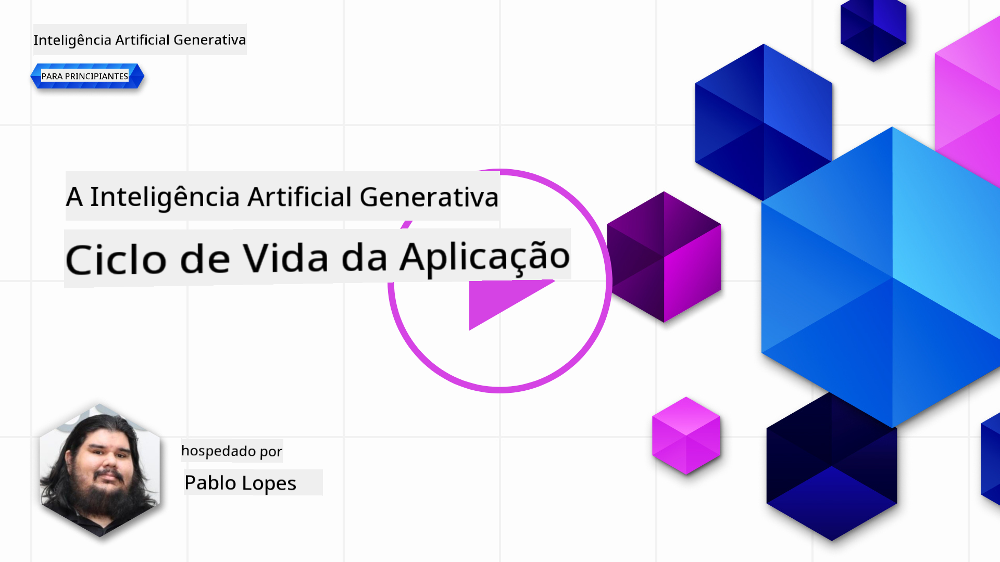
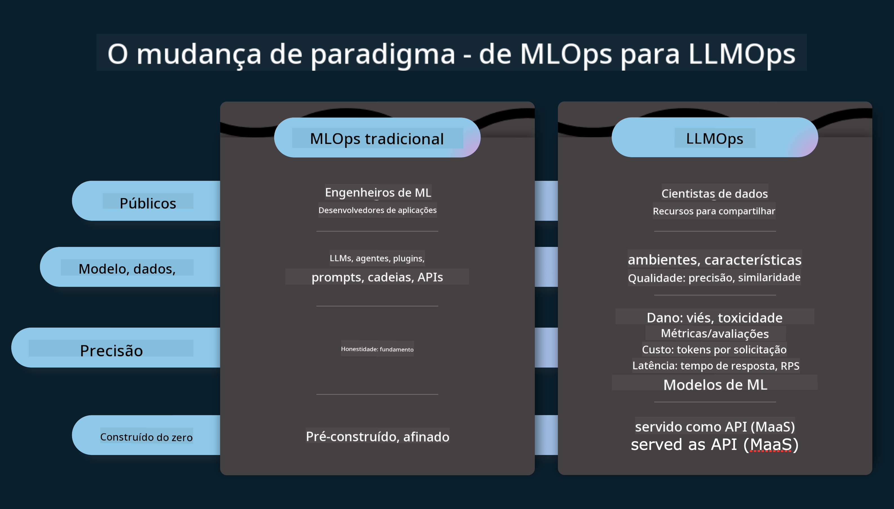
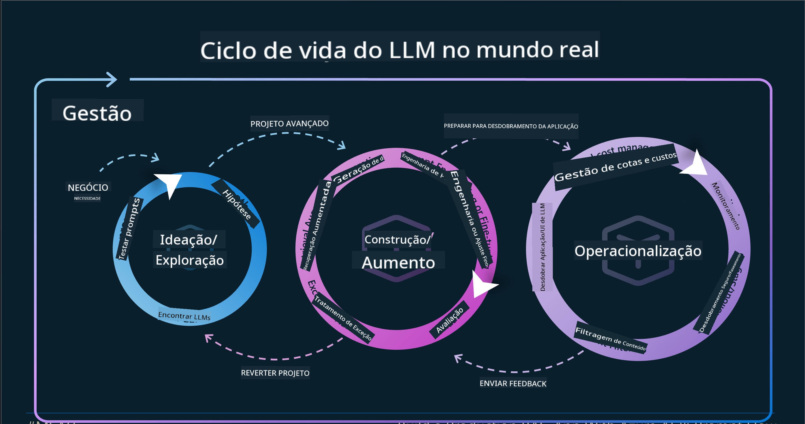
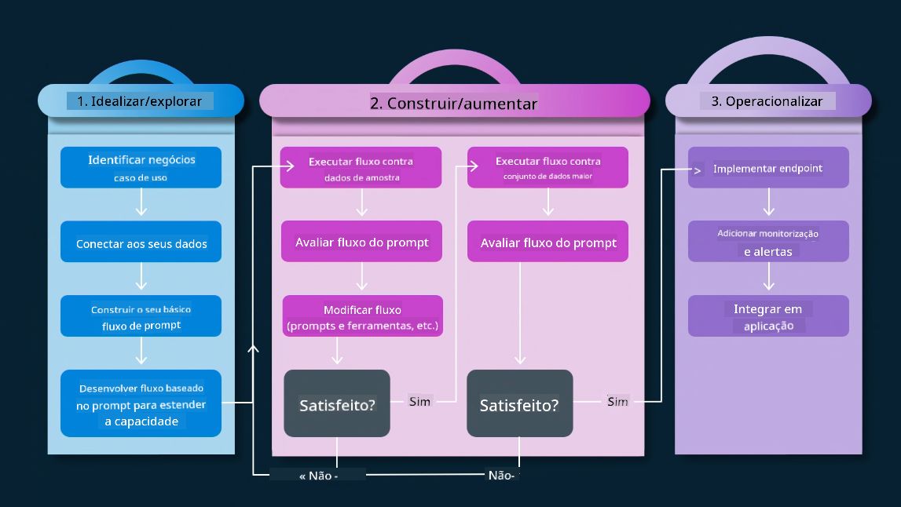
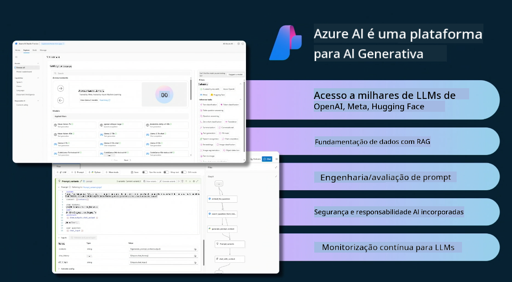
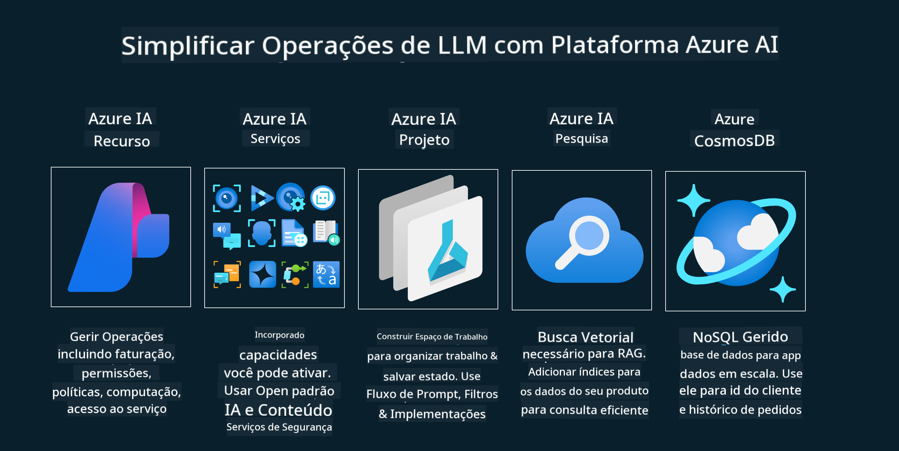
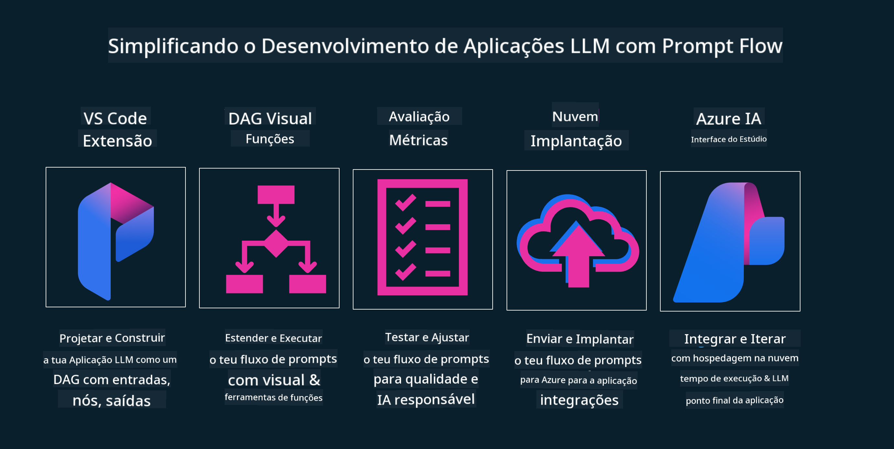

<!--
CO_OP_TRANSLATOR_METADATA:
{
  "original_hash": "27a5347a5022d5ef0a72ab029b03526a",
  "translation_date": "2025-06-25T22:01:28+00:00",
  "source_file": "14-the-generative-ai-application-lifecycle/README.md",
  "language_code": "pt"
}
-->

# O Ciclo de Vida de Aplicações de IA Generativa

Uma questão importante para todas as aplicações de IA é a relevância das funcionalidades de IA, já que a IA é um campo em rápida evolução. Para garantir que a sua aplicação se mantenha relevante, confiável e robusta, é necessário monitorá-la, avaliá-la e melhorá-la continuamente. É aqui que entra o ciclo de vida da IA generativa.

O ciclo de vida da IA generativa é uma estrutura que orienta você nas etapas de desenvolvimento, implantação e manutenção de uma aplicação de IA generativa. Ajuda a definir os seus objetivos, medir o seu desempenho, identificar os seus desafios e implementar as suas soluções. Também ajuda a alinhar a sua aplicação com os padrões éticos e legais do seu domínio e dos seus stakeholders. Ao seguir o ciclo de vida da IA generativa, você pode garantir que a sua aplicação esteja sempre a entregar valor e a satisfazer os seus utilizadores.

## Introdução

Neste capítulo, você irá:

- Compreender a Mudança de Paradigma de MLOps para LLMOps
- O Ciclo de Vida de LLM
- Ferramentas do Ciclo de Vida
- Metrificação e Avaliação do Ciclo de Vida

## Compreender a Mudança de Paradigma de MLOps para LLMOps

Os LLMs são uma nova ferramenta no arsenal da Inteligência Artificial, incrivelmente poderosos em tarefas de análise e geração para aplicações. No entanto, esse poder tem algumas consequências na forma como agilizamos tarefas de IA e Aprendizagem Automática Clássica.

Com isso, precisamos de um novo Paradigma para adaptar esta ferramenta de forma dinâmica, com os incentivos corretos. Podemos categorizar as aplicações de IA mais antigas como "Aplicações de ML" e as novas Aplicações de IA como "Aplicações de GenAI" ou simplesmente "Aplicações de IA", refletindo a tecnologia e as técnicas predominantes da época. Isso altera a nossa narrativa de várias maneiras. Veja a seguinte comparação.

Note que em LLMOps, estamos mais focados nos Desenvolvedores de Aplicações, usando integrações como ponto-chave, utilizando "Modelos-como-um-Serviço" e pensando nos seguintes pontos para métricas.

- Qualidade: Qualidade da resposta
- Dano: IA Responsável
- Honestidade: Fundamentação da resposta (Faz sentido? Está correto?)
- Custo: Orçamento da Solução
- Latência: Tempo médio para resposta de token

## O Ciclo de Vida de LLM

Primeiro, para entender o ciclo de vida e as modificações, vamos observar o próximo infográfico.

Como pode notar, isso é diferente dos Ciclos de Vida usuais de MLOps. Os LLMs têm muitos novos requisitos, como Prompting, diferentes técnicas para melhorar a qualidade (Fine-Tuning, RAG, Meta-Prompts), diferentes avaliações e responsabilidade com IA responsável, e por último, novas métricas de avaliação (Qualidade, Dano, Honestidade, Custo e Latência).

Por exemplo, veja como idealizamos. Usando engenharia de prompt para experimentar com vários LLMs para explorar possibilidades e testar se a sua Hipótese pode estar correta.

Note que isso não é linear, mas sim ciclos integrados, iterativos e com um ciclo abrangente.

Como poderíamos explorar esses passos? Vamos detalhar como poderíamos construir um ciclo de vida.

Isso pode parecer um pouco complicado, vamos nos concentrar nos três grandes passos primeiro.

1. Ideação/Exploração: Exploração, aqui podemos explorar de acordo com as nossas necessidades de negócios. Prototipagem, criando um [PromptFlow](https://microsoft.github.io/promptflow/index.html?WT.mc_id=academic-105485-koreyst) e testando se é eficiente o suficiente para a nossa Hipótese.
2. Construção/Aumento: Implementação, agora, começamos a avaliar para conjuntos de dados maiores, implementando técnicas como Fine-tuning e RAG, para verificar a robustez da nossa solução. Se não for, reimplementá-la, adicionando novos passos no nosso fluxo ou reestruturando os dados, pode ajudar. Depois de testar o nosso fluxo e a nossa escala, se funcionar e verificarmos as nossas Métricas, está pronto para o próximo passo.
3. Operacionalização: Integração, agora adicionando Sistemas de Monitorização e Alertas ao nosso sistema, implantação e integração de aplicações à nossa Aplicação.

Depois, temos o ciclo abrangente de Gestão, focando em segurança, conformidade e governança.

Parabéns, agora você tem a sua Aplicação de IA pronta para operar. Para uma experiência prática, dê uma olhada na [Demonstração do Contoso Chat.](https://nitya.github.io/contoso-chat/?WT.mc_id=academic-105485-koreys)

Agora, que ferramentas poderíamos usar?

## Ferramentas do Ciclo de Vida

Para Ferramentas, a Microsoft fornece a [Plataforma Azure AI](https://azure.microsoft.com/solutions/ai/?WT.mc_id=academic-105485-koreys) e o [PromptFlow](https://microsoft.github.io/promptflow/index.html?WT.mc_id=academic-105485-koreyst) para facilitar e tornar o seu ciclo fácil de implementar e pronto para uso.

A [Plataforma Azure AI](https://azure.microsoft.com/solutions/ai/?WT.mc_id=academic-105485-koreys), permite que você use o [AI Studio](https://ai.azure.com/?WT.mc_id=academic-105485-koreys). O AI Studio é um portal web que permite explorar modelos, amostras e ferramentas. Gerir os seus recursos, fluxos de desenvolvimento de UI e opções de SDK/CLI para desenvolvimento Code-First.

O Azure AI permite que você use múltiplos recursos, para gerir as suas operações, serviços, projetos, pesquisa vetorial e necessidades de bases de dados.

Construa, desde Prova de Conceito (POC) até aplicações em larga escala com o PromptFlow:

- Desenhe e construa aplicações a partir do VS Code, com ferramentas visuais e funcionais
- Teste e ajuste as suas aplicações para uma IA de qualidade, com facilidade.
- Use o Azure AI Studio para integrar e iterar com a nuvem, enviar e implantar para uma integração rápida.

## Ótimo! Continue a Aprender!

Incrível, agora aprenda mais sobre como estruturamos uma aplicação para usar os conceitos com a [Aplicação Contoso Chat](https://nitya.github.io/contoso-chat/?WT.mc_id=academic-105485-koreyst), para verificar como a Cloud Advocacy adiciona esses conceitos em demonstrações. Para mais conteúdo, veja a nossa [sessão de breakout do Ignite!
](https://www.youtube.com/watch?v=DdOylyrTOWg)

Agora, confira a Lição 15, para entender como [Geração Aumentada por Recuperação e Bases de Dados Vetoriais](../15-rag-and-vector-databases/README.md?WT.mc_id=academic-105485-koreyst) impactam a IA Generativa e para criar Aplicações mais envolventes!

**Aviso Legal**:  
Este documento foi traduzido usando o serviço de tradução por IA [Co-op Translator](https://github.com/Azure/co-op-translator). Embora nos esforcemos para garantir a precisão, esteja ciente de que traduções automáticas podem conter erros ou imprecisões. O documento original no seu idioma nativo deve ser considerado a fonte autoritária. Para informações críticas, é recomendada a tradução profissional humana. Não nos responsabilizamos por quaisquer mal-entendidos ou interpretações incorretas decorrentes do uso desta tradução.