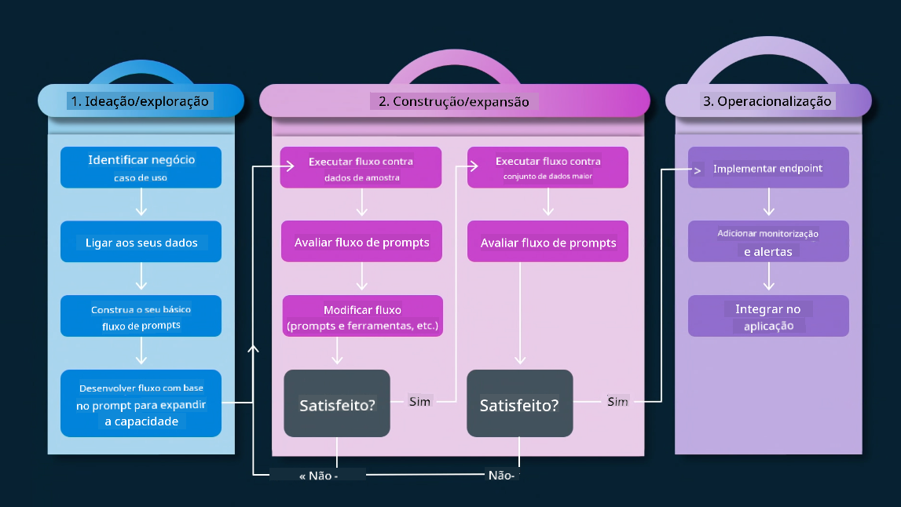

<!--
CO_OP_TRANSLATOR_METADATA:
{
  "original_hash": "27a5347a5022d5ef0a72ab029b03526a",
  "translation_date": "2025-07-09T15:52:00+00:00",
  "source_file": "14-the-generative-ai-application-lifecycle/README.md",
  "language_code": "pt"
}
-->

# O Ciclo de Vida das Aplicações de IA Generativa

Uma questão importante para todas as aplicações de IA é a relevância das funcionalidades de IA, dado que a IA é um campo em rápida evolução. Para garantir que a sua aplicação se mantenha relevante, fiável e robusta, é necessário monitorizá-la, avaliá-la e melhorá-la continuamente. É aqui que entra o ciclo de vida da IA generativa.

O ciclo de vida da IA generativa é um framework que o guia pelas etapas de desenvolvimento, implementação e manutenção de uma aplicação de IA generativa. Ajuda a definir os seus objetivos, medir o desempenho, identificar desafios e implementar soluções. Também ajuda a alinhar a sua aplicação com os padrões éticos e legais do seu domínio e dos seus stakeholders. Seguindo o ciclo de vida da IA generativa, pode garantir que a sua aplicação está sempre a entregar valor e a satisfazer os seus utilizadores.

## Introdução

Neste capítulo, irá:

- Compreender a mudança de paradigma de MLOps para LLMOps
- O ciclo de vida dos LLM
- Ferramentas para o ciclo de vida
- Métricas e avaliação do ciclo de vida

## Compreender a mudança de paradigma de MLOps para LLMOps

Os LLMs são uma nova ferramenta no arsenal da Inteligência Artificial, são incrivelmente poderosos em tarefas de análise e geração para aplicações, no entanto, este poder traz algumas consequências na forma como otimizamos tarefas de IA e Aprendizagem Automática clássica.

Por isso, precisamos de um novo paradigma para adaptar esta ferramenta de forma dinâmica, com os incentivos corretos. Podemos categorizar as aplicações de IA mais antigas como "ML Apps" e as mais recentes como "GenAI Apps" ou simplesmente "AI Apps", refletindo a tecnologia e técnicas predominantes na altura. Isto altera a nossa narrativa de várias formas, veja a comparação seguinte.

Note que em LLMOps, focamo-nos mais nos Desenvolvedores de Aplicações, usando integrações como ponto chave, utilizando "Models-as-a-Service" e pensando nos seguintes pontos para métricas.

- Qualidade: Qualidade da resposta
- Dano: IA responsável
- Honestidade: Fundamentação da resposta (Faz sentido? Está correta?)
- Custo: Orçamento da solução
- Latência: Tempo médio para resposta por token

## O ciclo de vida dos LLM

Primeiro, para entender o ciclo de vida e as modificações, vejamos o seguinte infográfico.

Como pode notar, isto é diferente dos ciclos de vida habituais do MLOps. Os LLMs têm muitos novos requisitos, como Prompting, técnicas diferentes para melhorar a qualidade (Fine-Tuning, RAG, Meta-Prompts), avaliação e responsabilidade com IA responsável, e por fim, novas métricas de avaliação (Qualidade, Dano, Honestidade, Custo e Latência).

Por exemplo, veja como idealizamos. Usando engenharia de prompts para experimentar vários LLMs e explorar possibilidades para testar se a sua hipótese pode estar correta.

Note que isto não é linear, mas sim ciclos integrados, iterativos e com um ciclo abrangente.

Como poderíamos explorar estas etapas? Vamos detalhar como construir um ciclo de vida.

Isto pode parecer um pouco complicado, vamos focar-nos primeiro nos três grandes passos.

1. Idealizar/Explorar: Exploração, aqui podemos explorar conforme as necessidades do nosso negócio. Prototipar, criar um [PromptFlow](https://microsoft.github.io/promptflow/index.html?WT.mc_id=academic-105485-koreyst) e testar se é suficientemente eficiente para a nossa hipótese.
1. Construir/Aumentar: Implementação, agora começamos a avaliar com conjuntos de dados maiores, implementando técnicas como Fine-tuning e RAG para verificar a robustez da nossa solução. Se não funcionar, reimplementar, adicionar novos passos no nosso fluxo ou reestruturar os dados pode ajudar. Depois de testar o nosso fluxo e escala, se funcionar e as métricas estiverem dentro do esperado, está pronto para o próximo passo.
1. Operacionalizar: Integração, agora adicionando sistemas de monitorização e alertas ao nosso sistema, implementação e integração da aplicação.

Depois, temos o ciclo abrangente de Gestão, focado em segurança, conformidade e governação.

Parabéns, agora tem a sua aplicação de IA pronta e operacional. Para uma experiência prática, veja a [Demonstração Contoso Chat.](https://nitya.github.io/contoso-chat/?WT.mc_id=academic-105485-koreys)

Agora, que ferramentas podemos usar?

## Ferramentas para o ciclo de vida

Para ferramentas, a Microsoft disponibiliza a [Azure AI Platform](https://azure.microsoft.com/solutions/ai/?WT.mc_id=academic-105485-koreys) e o [PromptFlow](https://microsoft.github.io/promptflow/index.html?WT.mc_id=academic-105485-koreyst) que facilitam e tornam o seu ciclo fácil de implementar e pronto a usar.

A [Azure AI Platform](https://azure.microsoft.com/solutions/ai/?WT.mc_id=academic-105485-koreys) permite-lhe usar o [AI Studio](https://ai.azure.com/?WT.mc_id=academic-105485-koreys). O AI Studio é um portal web que permite explorar modelos, exemplos e ferramentas. Gerir os seus recursos, fluxos de desenvolvimento UI e opções SDK/CLI para desenvolvimento Code-First.

O Azure AI permite-lhe usar múltiplos recursos para gerir as suas operações, serviços, projetos, pesquisa vetorial e necessidades de bases de dados.

Construa, desde Provas de Conceito (POC) até aplicações em larga escala com PromptFlow:

- Desenhe e construa aplicações a partir do VS Code, com ferramentas visuais e funcionais
- Teste e ajuste as suas aplicações para uma IA de qualidade, com facilidade.
- Use o Azure AI Studio para integrar e iterar com a cloud, fazer push e deploy para integração rápida.

## Excelente! Continue a aprender!

Fantástico, agora aprenda mais sobre como estruturamos uma aplicação para usar os conceitos com a [Contoso Chat App](https://nitya.github.io/contoso-chat/?WT.mc_id=academic-105485-koreyst), para ver como a Cloud Advocacy aplica esses conceitos em demonstrações. Para mais conteúdo, veja a nossa [sessão breakout do Ignite!](https://www.youtube.com/watch?v=DdOylyrTOWg)

Agora, consulte a Lição 15, para entender como [Retrieval Augmented Generation e Bases de Dados Vetoriais](../15-rag-and-vector-databases/README.md?WT.mc_id=academic-105485-koreyst) impactam a IA Generativa e para criar aplicações mais envolventes!

**Aviso Legal**:  
Este documento foi traduzido utilizando o serviço de tradução automática [Co-op Translator](https://github.com/Azure/co-op-translator). Embora nos esforcemos pela precisão, por favor tenha em conta que traduções automáticas podem conter erros ou imprecisões. O documento original na sua língua nativa deve ser considerado a fonte autorizada. Para informações críticas, recomenda-se tradução profissional humana. Não nos responsabilizamos por quaisquer mal-entendidos ou interpretações incorretas decorrentes da utilização desta tradução.