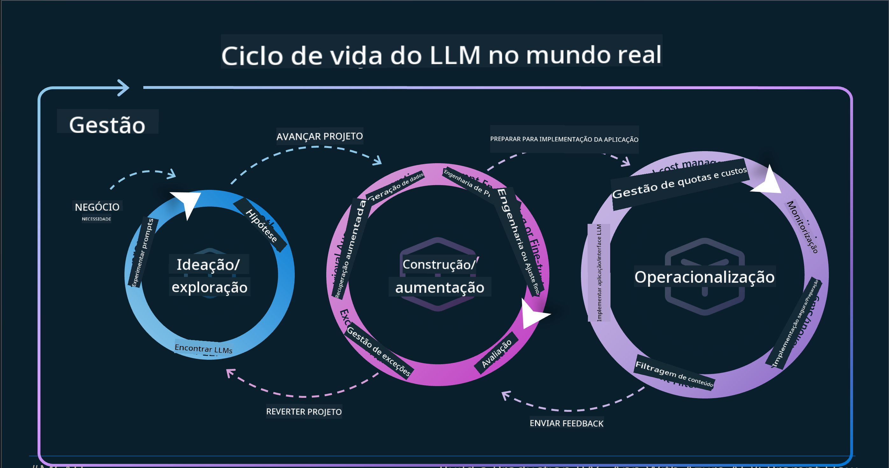
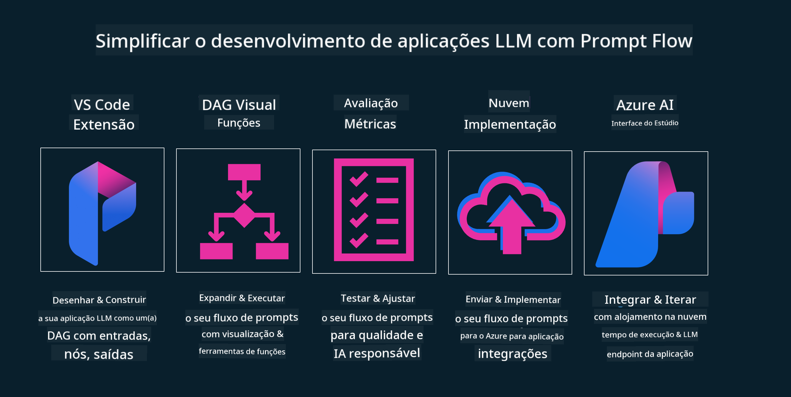

<!--
CO_OP_TRANSLATOR_METADATA:
{
  "original_hash": "b9d32511b27373a1b21b5789d4fda057",
  "translation_date": "2025-10-18T00:41:40+00:00",
  "source_file": "14-the-generative-ai-application-lifecycle/README.md",
  "language_code": "pt"
}
-->

# O Ciclo de Vida de Aplicações de IA Generativa

Uma questão importante para todas as aplicações de IA é a relevância das funcionalidades de IA, já que este é um campo em rápida evolução. Para garantir que a sua aplicação permaneça relevante, confiável e robusta, é necessário monitorá-la, avaliá-la e melhorá-la continuamente. É aqui que entra o ciclo de vida da IA generativa.

O ciclo de vida da IA generativa é uma estrutura que orienta você pelas etapas de desenvolvimento, implementação e manutenção de uma aplicação de IA generativa. Ele ajuda a definir os seus objetivos, medir o desempenho, identificar desafios e implementar soluções. Também auxilia a alinhar a sua aplicação com os padrões éticos e legais do seu domínio e das partes interessadas. Ao seguir o ciclo de vida da IA generativa, você pode garantir que sua aplicação esteja sempre entregando valor e satisfazendo os seus utilizadores.

## Introdução

Neste capítulo, você irá:

- Compreender a mudança de paradigma de MLOps para LLMOps
- O ciclo de vida do LLM
- Ferramentas para o ciclo de vida
- Métricas e avaliação do ciclo de vida

## Compreender a mudança de paradigma de MLOps para LLMOps

Os LLMs são uma nova ferramenta no arsenal da Inteligência Artificial. Eles são incrivelmente poderosos em tarefas de análise e geração para aplicações. No entanto, esse poder traz algumas consequências para a forma como otimizamos tarefas de IA e Aprendizagem de Máquina Clássica.

Com isso, precisamos de um novo paradigma para adaptar essa ferramenta de forma dinâmica, com os incentivos corretos. Podemos categorizar as aplicações de IA mais antigas como "Apps de ML" e as aplicações de IA mais recentes como "Apps de GenAI" ou simplesmente "Apps de IA", refletindo a tecnologia e as técnicas predominantes na época. Isso muda nossa narrativa de várias maneiras. Veja a comparação abaixo.

Note que, no LLMOps, estamos mais focados nos desenvolvedores de aplicações, utilizando integrações como ponto-chave, empregando "Modelos como Serviço" e considerando os seguintes pontos para métricas:

- Qualidade: Qualidade das respostas
- Prejuízo: IA responsável
- Honestidade: Fundamentação das respostas (Faz sentido? Está correto?)
- Custo: Orçamento da solução
- Latência: Tempo médio de resposta por token

## O ciclo de vida do LLM

Primeiro, para entender o ciclo de vida e as modificações, observe o infográfico a seguir.

Como pode notar, isso é diferente dos ciclos de vida usuais do MLOps. Os LLMs têm muitos novos requisitos, como engenharia de prompts, diferentes técnicas para melhorar a qualidade (Fine-Tuning, RAG, Meta-Prompts), diferentes avaliações e responsabilidades com IA responsável e, por fim, novas métricas de avaliação (Qualidade, Prejuízo, Honestidade, Custo e Latência).

Por exemplo, veja como ideamos. Utilizamos a engenharia de prompts para experimentar com vários LLMs e explorar possibilidades para testar se as hipóteses podem estar corretas.

Note que isso não é linear, mas sim ciclos integrados, iterativos e com um ciclo abrangente.

Como podemos explorar essas etapas? Vamos detalhar como construir um ciclo de vida.

Isso pode parecer um pouco complicado, então vamos nos concentrar primeiro nos três grandes passos.

1. Ideação/Exploração: Exploração. Aqui podemos explorar de acordo com as necessidades do nosso negócio. Prototipar, criar um [PromptFlow](https://microsoft.github.io/promptflow/index.html?WT.mc_id=academic-105485-koreyst) e testar se é eficiente o suficiente para nossa hipótese.
1. Construção/Aprimoramento: Implementação. Agora começamos a avaliar conjuntos de dados maiores e implementar técnicas como Fine-Tuning e RAG para verificar a robustez da nossa solução. Se não funcionar, reimplementá-la, adicionar novos passos ao nosso fluxo ou reestruturar os dados pode ajudar. Após testar nosso fluxo e escala, se funcionar e atender às nossas métricas, estará pronto para o próximo passo.
1. Operacionalização: Integração. Agora adicionamos sistemas de monitoramento e alertas ao nosso sistema, fazemos a implementação e integração com a aplicação.

Depois, temos o ciclo abrangente de Gestão, focando em segurança, conformidade e governança.

Parabéns! Agora você tem sua aplicação de IA pronta para uso e operacional. Para uma experiência prática, confira a [Demonstração do Contoso Chat.](https://nitya.github.io/contoso-chat/?WT.mc_id=academic-105485-koreys)

Agora, quais ferramentas podemos usar?

## Ferramentas para o ciclo de vida

Para ferramentas, a Microsoft oferece a [Plataforma Azure AI](https://azure.microsoft.com/solutions/ai/?WT.mc_id=academic-105485-koreys) e o [PromptFlow](https://microsoft.github.io/promptflow/index.html?WT.mc_id=academic-105485-koreyst) para facilitar e tornar o seu ciclo fácil de implementar e pronto para uso.

A [Plataforma Azure AI](https://azure.microsoft.com/solutions/ai/?WT.mc_id=academic-105485-koreys) permite que você utilize o [AI Studio](https://ai.azure.com/?WT.mc_id=academic-105485-koreys). O AI Studio é um portal web que permite explorar modelos, exemplos e ferramentas, gerenciar seus recursos, fluxos de desenvolvimento de interface e opções de SDK/CLI para desenvolvimento orientado por código.

O Azure AI permite que você utilize múltiplos recursos para gerenciar suas operações, serviços, projetos, busca vetorial e necessidades de bancos de dados.

Construa, desde a Prova de Conceito (POC) até aplicações em larga escala com o PromptFlow:

- Projete e construa aplicações no VS Code, com ferramentas visuais e funcionais
- Teste e ajuste suas aplicações para uma IA de qualidade, com facilidade
- Use o Azure AI Studio para integrar e iterar com a nuvem, publicar e implementar para uma integração rápida

## Ótimo! Continue a aprender!

Incrível! Agora aprenda mais sobre como estruturamos uma aplicação para usar os conceitos com o [Contoso Chat App](https://nitya.github.io/contoso-chat/?WT.mc_id=academic-105485-koreyst), para ver como o Cloud Advocacy aplica esses conceitos em demonstrações. Para mais conteúdo, confira nossa [sessão especial do Ignite!
](https://www.youtube.com/watch?v=DdOylyrTOWg)

Agora, confira a Lição 15 para entender como [Geração Aumentada por Recuperação e Bancos de Dados Vetoriais](../15-rag-and-vector-databases/README.md?WT.mc_id=academic-105485-koreyst) impactam a IA Generativa e ajudam a criar aplicações mais envolventes!

---

**Aviso Legal**:  
Este documento foi traduzido utilizando o serviço de tradução por IA [Co-op Translator](https://github.com/Azure/co-op-translator). Embora nos esforcemos pela precisão, esteja ciente de que traduções automáticas podem conter erros ou imprecisões. O documento original na sua língua nativa deve ser considerado a fonte autoritária. Para informações críticas, recomenda-se uma tradução profissional realizada por humanos. Não nos responsabilizamos por quaisquer mal-entendidos ou interpretações incorretas decorrentes do uso desta tradução.