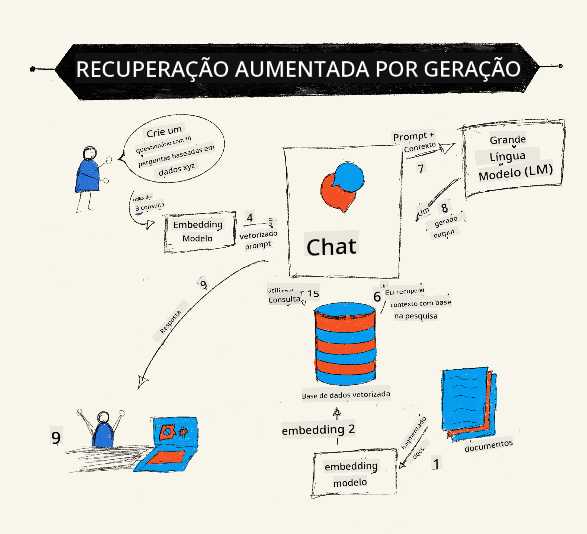
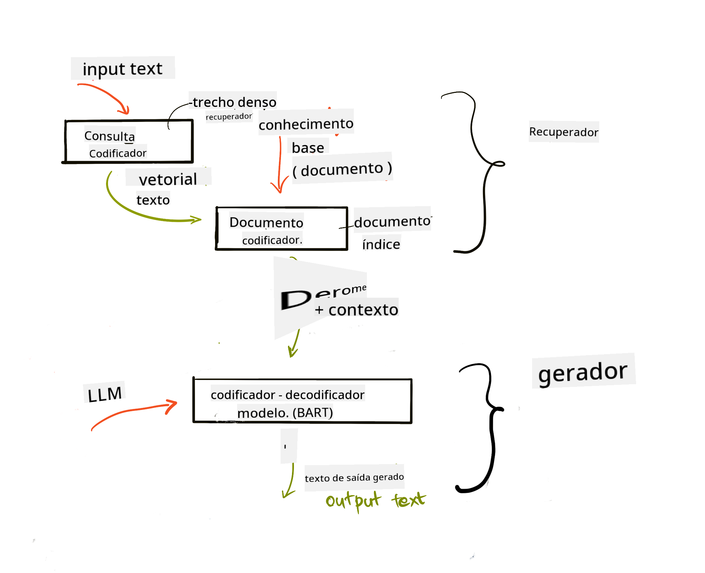
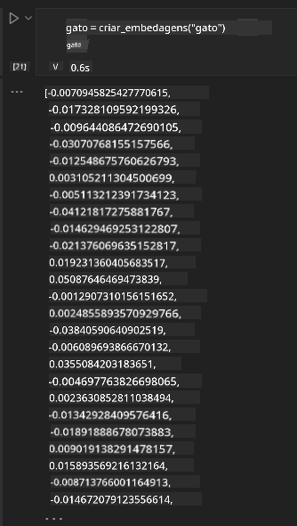

<!--
CO_OP_TRANSLATOR_METADATA:
{
  "original_hash": "e2861bbca91c0567ef32bc77fe054f9e",
  "translation_date": "2025-07-09T16:10:34+00:00",
  "source_file": "15-rag-and-vector-databases/README.md",
  "language_code": "pt"
}
-->
# Retrieval Augmented Generation (RAG) e Bases de Dados Vetoriais

[](https://aka.ms/gen-ai-lesson15-gh?WT.mc_id=academic-105485-koreyst)

Na lição sobre aplicações de pesquisa, aprendemos brevemente como integrar os seus próprios dados em Large Language Models (LLMs). Nesta lição, vamos aprofundar os conceitos de fundamentar os seus dados na aplicação LLM, a mecânica do processo e os métodos para armazenar dados, incluindo tanto embeddings como texto.

> **Vídeo em breve**

## Introdução

Nesta lição vamos abordar o seguinte:

- Uma introdução ao RAG, o que é e por que é usado em IA (inteligência artificial).

- Compreender o que são bases de dados vetoriais e criar uma para a nossa aplicação.

- Um exemplo prático de como integrar RAG numa aplicação.

## Objetivos de Aprendizagem

Após completar esta lição, será capaz de:

- Explicar a importância do RAG na recuperação e processamento de dados.

- Configurar uma aplicação RAG e fundamentar os seus dados num LLM.

- Integrar eficazmente RAG e Bases de Dados Vetoriais em aplicações LLM.

## O nosso cenário: melhorar os nossos LLMs com os nossos próprios dados

Para esta lição, queremos adicionar as nossas próprias notas à startup educativa, permitindo que o chatbot obtenha mais informações sobre diferentes matérias. Usando as notas que temos, os alunos poderão estudar melhor e compreender os diferentes tópicos, facilitando a revisão para os seus exames. Para criar o nosso cenário, vamos usar:

- `Azure OpenAI:` o LLM que vamos usar para criar o nosso chatbot

- `Lição AI para iniciantes sobre Redes Neuronais:` estes serão os dados em que vamos fundamentar o nosso LLM

- `Azure AI Search` e `Azure Cosmos DB:` base de dados vetorial para armazenar os nossos dados e criar um índice de pesquisa

Os utilizadores poderão criar quizzes de prática a partir das suas notas, cartões de revisão e resumos concisos. Para começar, vejamos o que é o RAG e como funciona:

## Retrieval Augmented Generation (RAG)

Um chatbot alimentado por um LLM processa os prompts dos utilizadores para gerar respostas. É projetado para ser interativo e envolver os utilizadores numa ampla variedade de tópicos. No entanto, as suas respostas estão limitadas ao contexto fornecido e aos dados de treino fundamentais. Por exemplo, o conhecimento do GPT-4 tem um corte em setembro de 2021, o que significa que não tem conhecimento de eventos ocorridos após esse período. Além disso, os dados usados para treinar LLMs excluem informações confidenciais, como notas pessoais ou manuais de produtos de uma empresa.

### Como funcionam os RAGs (Retrieval Augmented Generation)



Suponha que quer implementar um chatbot que cria quizzes a partir das suas notas, vai precisar de uma ligação à base de conhecimento. É aqui que o RAG entra em ação. Os RAGs funcionam da seguinte forma:

- **Base de conhecimento:** Antes da recuperação, estes documentos precisam de ser ingeridos e pré-processados, normalmente dividindo documentos grandes em pedaços menores, transformando-os em embeddings de texto e armazenando-os numa base de dados.

- **Consulta do utilizador:** o utilizador faz uma pergunta

- **Recuperação:** Quando o utilizador faz uma pergunta, o modelo de embedding recupera informação relevante da nossa base de conhecimento para fornecer mais contexto que será incorporado no prompt.

- **Geração aumentada:** o LLM melhora a sua resposta com base nos dados recuperados. Isto permite que a resposta gerada não seja apenas baseada nos dados pré-treinados, mas também em informação relevante do contexto adicional. Os dados recuperados são usados para aumentar as respostas do LLM. O LLM devolve então uma resposta à pergunta do utilizador.



A arquitetura dos RAGs é implementada usando transformers que consistem em duas partes: um encoder e um decoder. Por exemplo, quando um utilizador faz uma pergunta, o texto de entrada é 'codificado' em vetores que capturam o significado das palavras e os vetores são 'decodificados' no nosso índice de documentos, gerando novo texto com base na consulta do utilizador. O LLM usa um modelo encoder-decoder para gerar a saída.

Existem duas abordagens para implementar RAG segundo o artigo proposto: [Retrieval-Augmented Generation for Knowledge intensive NLP Tasks](https://arxiv.org/pdf/2005.11401.pdf?WT.mc_id=academic-105485-koreyst):

- **_RAG-Sequence_** usa documentos recuperados para prever a melhor resposta possível a uma consulta do utilizador

- **RAG-Token** usa documentos para gerar o próximo token, depois recupera-os para responder à consulta do utilizador

### Por que usar RAGs?

- **Riqueza de informação:** garante que as respostas em texto estão atualizadas e são atuais. Assim, melhora o desempenho em tarefas específicas de domínio ao aceder à base de conhecimento interna.

- Reduz a fabricação de respostas ao utilizar **dados verificáveis** na base de conhecimento para fornecer contexto às perguntas dos utilizadores.

- É **económico**, pois é mais barato do que ajustar finamente um LLM.

## Criar uma base de conhecimento

A nossa aplicação baseia-se nos nossos dados pessoais, ou seja, a lição sobre Redes Neuronais do currículo AI For Beginners.

### Bases de Dados Vetoriais

Uma base de dados vetorial, ao contrário das bases de dados tradicionais, é uma base especializada para armazenar, gerir e pesquisar vetores embutidos. Armazena representações numéricas dos documentos. Dividir os dados em embeddings numéricos facilita a compreensão e processamento dos dados pelo nosso sistema de IA.

Armazenamos os nossos embeddings em bases de dados vetoriais porque os LLMs têm um limite no número de tokens que aceitam como entrada. Como não é possível passar todos os embeddings para um LLM, precisamos de os dividir em pedaços e, quando um utilizador faz uma pergunta, os embeddings mais semelhantes à pergunta são devolvidos juntamente com o prompt. A divisão em pedaços também reduz os custos relacionados com o número de tokens passados para o LLM.

Algumas bases de dados vetoriais populares incluem Azure Cosmos DB, Clarifyai, Pinecone, Chromadb, ScaNN, Qdrant e DeepLake. Pode criar um modelo Azure Cosmos DB usando o Azure CLI com o seguinte comando:

```bash
az login
az group create -n <resource-group-name> -l <location>
az cosmosdb create -n <cosmos-db-name> -r <resource-group-name>
az cosmosdb list-keys -n <cosmos-db-name> -g <resource-group-name>
```

### De texto para embeddings

Antes de armazenar os nossos dados, precisamos de os converter em embeddings vetoriais antes de os guardar na base de dados. Se estiver a trabalhar com documentos grandes ou textos longos, pode dividi-los em pedaços com base nas consultas que espera. A divisão pode ser feita ao nível da frase ou do parágrafo. Como a divisão depende do significado das palavras à volta, pode adicionar algum contexto extra a um pedaço, por exemplo, adicionando o título do documento ou incluindo algum texto antes ou depois do pedaço. Pode dividir os dados da seguinte forma:

```python
def split_text(text, max_length, min_length):
    words = text.split()
    chunks = []
    current_chunk = []

    for word in words:
        current_chunk.append(word)
        if len(' '.join(current_chunk)) < max_length and len(' '.join(current_chunk)) > min_length:
            chunks.append(' '.join(current_chunk))
            current_chunk = []

    # If the last chunk didn't reach the minimum length, add it anyway
    if current_chunk:
        chunks.append(' '.join(current_chunk))

    return chunks
```

Depois de divididos, podemos embutir o nosso texto usando diferentes modelos de embedding. Alguns modelos que pode usar incluem: word2vec, ada-002 da OpenAI, Azure Computer Vision e muitos mais. A escolha do modelo depende das línguas que está a usar, do tipo de conteúdo codificado (texto/imagens/áudio), do tamanho da entrada que pode codificar e do comprimento da saída do embedding.

Um exemplo de texto embutido usando o modelo `text-embedding-ada-002` da OpenAI é:


## Recuperação e Pesquisa Vetorial

Quando um utilizador faz uma pergunta, o retriever transforma-a num vetor usando o encoder de consulta, depois pesquisa no nosso índice de documentos por vetores relevantes relacionados com a entrada. Depois, converte tanto o vetor de entrada como os vetores dos documentos em texto e passa-os pelo LLM.

### Recuperação

A recuperação acontece quando o sistema tenta encontrar rapidamente os documentos no índice que satisfazem os critérios de pesquisa. O objetivo do retriever é obter documentos que serão usados para fornecer contexto e fundamentar o LLM nos seus dados.

Existem várias formas de realizar a pesquisa na nossa base de dados, tais como:

- **Pesquisa por palavra-chave** - usada para pesquisas de texto

- **Pesquisa semântica** - usa o significado semântico das palavras

- **Pesquisa vetorial** - converte documentos de texto para representações vetoriais usando modelos de embedding. A recuperação é feita consultando os documentos cujas representações vetoriais estão mais próximas da pergunta do utilizador.

- **Híbrida** - uma combinação de pesquisa por palavra-chave e vetorial.

Um desafio na recuperação surge quando não existe uma resposta semelhante à consulta na base de dados; o sistema devolve então a melhor informação que conseguir, no entanto, pode usar táticas como definir a distância máxima para relevância ou usar pesquisa híbrida que combina palavras-chave e pesquisa vetorial. Nesta lição, usaremos pesquisa híbrida, uma combinação de pesquisa vetorial e por palavra-chave. Vamos armazenar os nossos dados num dataframe com colunas contendo os pedaços e os embeddings.

### Similaridade Vetorial

O retriever vai procurar na base de conhecimento embeddings que estejam próximos, o vizinho mais próximo, pois são textos semelhantes. No cenário em que um utilizador faz uma pergunta, esta é primeiro embutida e depois comparada com embeddings semelhantes. A medida comum usada para encontrar a semelhança entre vetores é a similaridade do cosseno, que se baseia no ângulo entre dois vetores.

Podemos medir a semelhança usando outras alternativas, como a distância Euclidiana, que é a linha reta entre os pontos finais dos vetores, e o produto escalar, que mede a soma dos produtos dos elementos correspondentes de dois vetores.

### Índice de pesquisa

Ao fazer a recuperação, precisamos de construir um índice de pesquisa para a nossa base de conhecimento antes de realizar a pesquisa. Um índice armazena os nossos embeddings e pode recuperar rapidamente os pedaços mais semelhantes, mesmo numa base de dados grande. Podemos criar o nosso índice localmente usando:

```python
from sklearn.neighbors import NearestNeighbors

embeddings = flattened_df['embeddings'].to_list()

# Create the search index
nbrs = NearestNeighbors(n_neighbors=5, algorithm='ball_tree').fit(embeddings)

# To query the index, you can use the kneighbors method
distances, indices = nbrs.kneighbors(embeddings)
```

### Reordenação

Depois de consultar a base de dados, pode ser necessário ordenar os resultados do mais relevante para o menos relevante. Um LLM de reordenação utiliza Machine Learning para melhorar a relevância dos resultados de pesquisa, ordenando-os do mais relevante para o menos relevante. Usando o Azure AI Search, a reordenação é feita automaticamente para si usando um reordenador semântico. Um exemplo de como a reordenação funciona usando vizinhos mais próximos:

```python
# Find the most similar documents
distances, indices = nbrs.kneighbors([query_vector])

index = []
# Print the most similar documents
for i in range(3):
    index = indices[0][i]
    for index in indices[0]:
        print(flattened_df['chunks'].iloc[index])
        print(flattened_df['path'].iloc[index])
        print(flattened_df['distances'].iloc[index])
    else:
        print(f"Index {index} not found in DataFrame")
```

## Juntando tudo

O último passo é adicionar o nosso LLM para conseguir obter respostas fundamentadas nos nossos dados. Podemos implementá-lo da seguinte forma:

```python
user_input = "what is a perceptron?"

def chatbot(user_input):
    # Convert the question to a query vector
    query_vector = create_embeddings(user_input)

    # Find the most similar documents
    distances, indices = nbrs.kneighbors([query_vector])

    # add documents to query  to provide context
    history = []
    for index in indices[0]:
        history.append(flattened_df['chunks'].iloc[index])

    # combine the history and the user input
    history.append(user_input)

    # create a message object
    messages=[
        {"role": "system", "content": "You are an AI assistant that helps with AI questions."},
        {"role": "user", "content": history[-1]}
    ]

    # use chat completion to generate a response
    response = openai.chat.completions.create(
        model="gpt-4",
        temperature=0.7,
        max_tokens=800,
        messages=messages
    )

    return response.choices[0].message

chatbot(user_input)
```

## Avaliar a nossa aplicação

### Métricas de Avaliação

- Qualidade das respostas fornecidas, garantindo que soam naturais, fluentes e humanas

- Fundamentação dos dados: avaliar se a resposta veio dos documentos fornecidos

- Relevância: avaliar se a resposta corresponde e está relacionada com a pergunta feita

- Fluência - se a resposta faz sentido gramaticalmente

## Casos de uso para RAG (Retrieval Augmented Generation) e bases de dados vetoriais

Existem muitos casos de uso onde chamadas de função podem melhorar a sua aplicação, como:

- Perguntas e Respostas: fundamentar os dados da sua empresa num chat que pode ser usado pelos colaboradores para fazer perguntas.

- Sistemas de Recomendação: onde pode criar um sistema que combina os valores mais semelhantes, por exemplo, filmes, restaurantes e muitos mais.

- Serviços de chatbot: pode armazenar o histórico de conversas e personalizar a conversa com base nos dados do utilizador.

- Pesquisa de imagens baseada em embeddings vetoriais, útil para reconhecimento de imagens e deteção de anomalias.

## Resumo

Cobrimos as áreas fundamentais do RAG, desde adicionar os nossos dados à aplicação, a consulta do utilizador e a saída. Para simplificar a criação de RAG, pode usar frameworks como Semanti Kernel, Langchain ou Autogen.

## Tarefa

Para continuar a sua aprendizagem sobre Retrieval Augmented Generation (RAG), pode construir:

- Desenvolver um front-end para a aplicação usando o framework da sua escolha

- Utilizar um framework, seja LangChain ou Semantic Kernel, e recriar a sua aplicação.

Parabéns por completar a lição 👏.

## A aprendizagem não termina aqui, continue a jornada

Após completar esta lição, consulte a nossa [coleção de Aprendizagem de IA Generativa](https://aka.ms/genai-collection?WT.mc_id=academic-105485-koreyst) para continuar a aprimorar os seus conhecimentos em IA Generativa!

**Aviso Legal**:  
Este documento foi traduzido utilizando o serviço de tradução automática [Co-op Translator](https://github.com/Azure/co-op-translator). Embora nos esforcemos para garantir a precisão, por favor tenha em conta que traduções automáticas podem conter erros ou imprecisões. O documento original na sua língua nativa deve ser considerado a fonte autorizada. Para informações críticas, recomenda-se tradução profissional humana. Não nos responsabilizamos por quaisquer mal-entendidos ou interpretações incorretas decorrentes da utilização desta tradução.