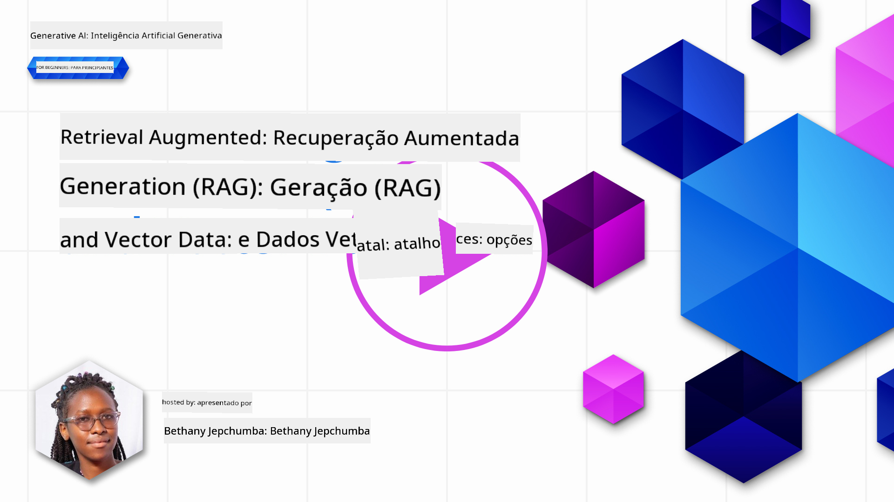
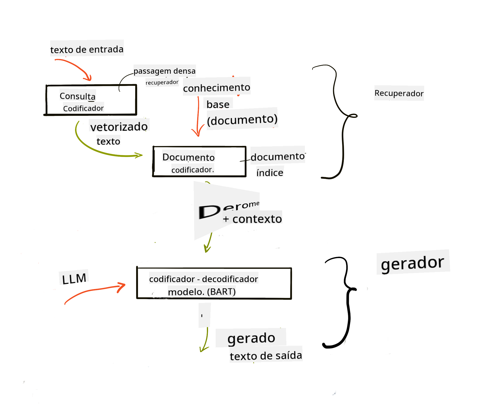
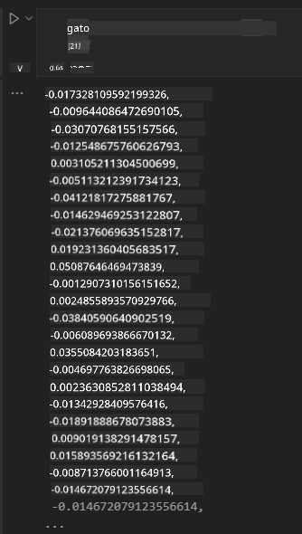

<!--
CO_OP_TRANSLATOR_METADATA:
{
  "original_hash": "e2861bbca91c0567ef32bc77fe054f9e",
  "translation_date": "2025-05-20T01:14:03+00:00",
  "source_file": "15-rag-and-vector-databases/README.md",
  "language_code": "pt"
}
-->
# Geração Aumentada por Recuperação (RAG) e Bancos de Dados Vetoriais

[](https://aka.ms/gen-ai-lesson15-gh?WT.mc_id=academic-105485-koreyst)

Na lição sobre aplicações de busca, aprendemos brevemente como integrar seus próprios dados em Modelos de Linguagem Grandes (LLMs). Nesta lição, vamos nos aprofundar nos conceitos de fundamentar seus dados em sua aplicação LLM, na mecânica do processo e nos métodos de armazenamento de dados, incluindo tanto embeddings quanto texto.

> **Vídeo em Breve**

## Introdução

Nesta lição, abordaremos o seguinte:

- Uma introdução ao RAG, o que é e por que é usado em IA (inteligência artificial).

- Compreender o que são bancos de dados vetoriais e criar um para nossa aplicação.

- Um exemplo prático de como integrar o RAG em uma aplicação.

## Objetivos de Aprendizagem

Após concluir esta lição, você será capaz de:

- Explicar a importância do RAG na recuperação e processamento de dados.

- Configurar a aplicação RAG e fundamentar seus dados em um LLM.

- Integração eficaz de RAG e Bancos de Dados Vetoriais em Aplicações LLM.

## Nosso Cenário: melhorando nossos LLMs com nossos próprios dados

Para esta lição, queremos adicionar nossas próprias notas à startup educacional, permitindo que o chatbot obtenha mais informações sobre diferentes assuntos. Usando as notas que temos, os alunos poderão estudar melhor e entender os diferentes tópicos, facilitando a revisão para os exames. Para criar nosso cenário, usaremos:

- `Azure OpenAI:` o LLM que usaremos para criar nosso chatbot

- `AI for beginners' lesson on Neural Networks`: estes serão os dados em que fundamentaremos nosso LLM

- `Azure AI Search` e `Azure Cosmos DB:` banco de dados vetorial para armazenar nossos dados e criar um índice de busca

Os usuários poderão criar questionários de prática a partir de suas notas, cartões de revisão e resumir para visões gerais concisas. Para começar, vejamos o que é RAG e como funciona:

## Geração Aumentada por Recuperação (RAG)

Um chatbot alimentado por LLM processa os prompts dos usuários para gerar respostas. Ele é projetado para ser interativo e engajar-se com os usuários em uma ampla gama de tópicos. No entanto, suas respostas são limitadas ao contexto fornecido e aos dados de treinamento fundamentais. Por exemplo, o corte de conhecimento do GPT-4 é setembro de 2021, o que significa que ele não tem conhecimento de eventos que ocorreram após esse período. Além disso, os dados usados para treinar LLMs excluem informações confidenciais, como notas pessoais ou o manual de produtos de uma empresa.

### Como funcionam os RAGs (Geração Aumentada por Recuperação)


Suponha que você queira implantar um chatbot que crie questionários a partir de suas notas, você precisará de uma conexão com a base de conhecimento. É aí que o RAG entra em cena. Os RAGs operam da seguinte forma:

- **Base de conhecimento:** Antes da recuperação, esses documentos precisam ser ingeridos e pré-processados, normalmente dividindo grandes documentos em pedaços menores, transformando-os em embeddings de texto e armazenando-os em um banco de dados.

- **Consulta do usuário:** o usuário faz uma pergunta

- **Recuperação:** Quando um usuário faz uma pergunta, o modelo de embeddings recupera informações relevantes de nossa base de conhecimento para fornecer mais contexto que será incorporado ao prompt.

- **Geração Aumentada:** o LLM aprimora sua resposta com base nos dados recuperados. Permite que a resposta gerada seja não apenas baseada em dados pré-treinados, mas também em informações relevantes do contexto adicionado. Os dados recuperados são usados para aumentar as respostas do LLM. O LLM então retorna uma resposta à pergunta do usuário.



A arquitetura para RAGs é implementada usando transformadores que consistem em duas partes: um codificador e um decodificador. Por exemplo, quando um usuário faz uma pergunta, o texto de entrada é 'codificado' em vetores que capturam o significado das palavras e os vetores são 'decodificados' em nosso índice de documentos e geram novo texto com base na consulta do usuário. O LLM usa um modelo de codificador-decodificador para gerar a saída.

Duas abordagens ao implementar RAG de acordo com o artigo proposto: [Geração Aumentada por Recuperação para Tarefas Intensivas em Conhecimento de NLP (processamento de linguagem natural)](https://arxiv.org/pdf/2005.11401.pdf?WT.mc_id=academic-105485-koreyst) são:

- **_RAG-Sequence_** usando documentos recuperados para prever a melhor resposta possível para uma consulta do usuário

- **RAG-Token** usando documentos para gerar o próximo token e depois recuperá-los para responder à consulta do usuário

### Por que você usaria RAGs?

- **Riqueza de informações:** garante que as respostas de texto estejam atualizadas e atuais. Portanto, melhora o desempenho em tarefas específicas de domínio acessando a base de conhecimento interna.

- Reduz a fabricação utilizando **dados verificáveis** na base de conhecimento para fornecer contexto às consultas dos usuários.

- É **custo-efetivo** pois são mais econômicos em comparação com o ajuste fino de um LLM

## Criando uma base de conhecimento

Nossa aplicação é baseada em nossos dados pessoais, ou seja, a lição sobre Redes Neurais no currículo de IA para Iniciantes.

### Bancos de Dados Vetoriais

Um banco de dados vetorial, ao contrário dos bancos de dados tradicionais, é um banco de dados especializado projetado para armazenar, gerenciar e buscar vetores incorporados. Ele armazena representações numéricas de documentos. Dividir dados em embeddings numéricos facilita para nosso sistema de IA entender e processar os dados.

Armazenamos nossos embeddings em bancos de dados vetoriais, pois os LLMs têm um limite no número de tokens que aceitam como entrada. Como você não pode passar todos os embeddings para um LLM, precisaremos dividi-los em pedaços e, quando um usuário faz uma pergunta, os embeddings mais parecidos com a pergunta serão retornados junto com o prompt. Dividir em pedaços também reduz os custos com o número de tokens passados por um LLM.

Alguns bancos de dados vetoriais populares incluem Azure Cosmos DB, Clarifyai, Pinecone, Chromadb, ScaNN, Qdrant e DeepLake. Você pode criar um modelo de Azure Cosmos DB usando o Azure CLI com o seguinte comando:

```bash
az login
az group create -n <resource-group-name> -l <location>
az cosmosdb create -n <cosmos-db-name> -r <resource-group-name>
az cosmosdb list-keys -n <cosmos-db-name> -g <resource-group-name>
```

### De texto para embeddings

Antes de armazenarmos nossos dados, precisaremos convertê-los em embeddings vetoriais antes de serem armazenados no banco de dados. Se você estiver trabalhando com documentos grandes ou textos longos, pode dividi-los com base nas consultas que espera. Dividir em pedaços pode ser feito a nível de sentença ou a nível de parágrafo. Como dividir em pedaços deriva significados das palavras ao redor, você pode adicionar algum outro contexto a um pedaço, por exemplo, adicionando o título do documento ou incluindo algum texto antes ou depois do pedaço. Você pode dividir os dados da seguinte forma:

```python
def split_text(text, max_length, min_length):
    words = text.split()
    chunks = []
    current_chunk = []

    for word in words:
        current_chunk.append(word)
        if len(' '.join(current_chunk)) < max_length and len(' '.join(current_chunk)) > min_length:
            chunks.append(' '.join(current_chunk))
            current_chunk = []

    # If the last chunk didn't reach the minimum length, add it anyway
    if current_chunk:
        chunks.append(' '.join(current_chunk))

    return chunks
```

Uma vez divididos, podemos então incorporar nosso texto usando diferentes modelos de embeddings. Alguns modelos que você pode usar incluem: word2vec, ada-002 da OpenAI, Azure Computer Vision e muitos mais. Selecionar um modelo para usar dependerá dos idiomas que você está usando, do tipo de conteúdo codificado (texto/imagens/áudio), do tamanho da entrada que pode codificar e do comprimento da saída de embedding.

Um exemplo de texto incorporado usando o modelo `text-embedding-ada-002` da OpenAI é:


## Recuperação e Busca Vetorial

Quando um usuário faz uma pergunta, o recuperador a transforma em um vetor usando o codificador de consulta, ele então busca em nosso índice de busca de documentos por vetores relevantes no documento que estão relacionados à entrada. Uma vez feito, ele converte tanto o vetor de entrada quanto os vetores de documentos em texto e passa pelo LLM.

### Recuperação

A recuperação acontece quando o sistema tenta encontrar rapidamente os documentos do índice que satisfazem os critérios de busca. O objetivo do recuperador é obter documentos que serão usados para fornecer contexto e fundamentar o LLM em seus dados.

Existem várias maneiras de realizar buscas dentro de nosso banco de dados, como:

- **Busca por palavra-chave** - usada para buscas de texto

- **Busca semântica** - usa o significado semântico das palavras

- **Busca vetorial** - converte documentos de texto para representações vetoriais usando modelos de embeddings. A recuperação será feita consultando os documentos cujas representações vetoriais estão mais próximas da pergunta do usuário.

- **Híbrido** - uma combinação de busca por palavra-chave e busca vetorial.

Um desafio com a recuperação surge quando não há uma resposta semelhante à consulta no banco de dados, o sistema então retornará a melhor informação que puder obter, no entanto, você pode usar táticas como definir a distância máxima para relevância ou usar busca híbrida que combina palavras-chave e busca vetorial. Nesta lição, usaremos busca híbrida, uma combinação de busca vetorial e por palavra-chave. Armazenaremos nossos dados em um dataframe com colunas contendo os pedaços, bem como embeddings.

### Similaridade Vetorial

O recuperador buscará na base de conhecimento por embeddings que estão próximos, o vizinho mais próximo, pois são textos semelhantes. No cenário em que um usuário faz uma consulta, ela é primeiro incorporada e depois comparada com embeddings semelhantes. A medida comum usada para encontrar a semelhança entre diferentes vetores é a similaridade cosseno, que se baseia no ângulo entre dois vetores.

Podemos medir a similaridade usando outras alternativas, como distância Euclidiana, que é a linha reta entre os pontos finais dos vetores, e produto escalar, que mede a soma dos produtos dos elementos correspondentes de dois vetores.

### Índice de busca

Ao realizar a recuperação, precisaremos construir um índice de busca para nossa base de conhecimento antes de realizar a busca. Um índice armazenará nossos embeddings e poderá recuperar rapidamente os pedaços mais semelhantes, mesmo em um banco de dados grande. Podemos criar nosso índice localmente usando:

```python
from sklearn.neighbors import NearestNeighbors

embeddings = flattened_df['embeddings'].to_list()

# Create the search index
nbrs = NearestNeighbors(n_neighbors=5, algorithm='ball_tree').fit(embeddings)

# To query the index, you can use the kneighbors method
distances, indices = nbrs.kneighbors(embeddings)
```

### Reclassificação

Depois de consultar o banco de dados, você pode precisar classificar os resultados dos mais relevantes. Um LLM de reclassificação utiliza aprendizado de máquina para melhorar a relevância dos resultados de busca, ordenando-os dos mais relevantes. Usando o Azure AI Search, a reclassificação é feita automaticamente para você usando um reclassificador semântico. Um exemplo de como a reclassificação funciona usando vizinhos mais próximos:

```python
# Find the most similar documents
distances, indices = nbrs.kneighbors([query_vector])

index = []
# Print the most similar documents
for i in range(3):
    index = indices[0][i]
    for index in indices[0]:
        print(flattened_df['chunks'].iloc[index])
        print(flattened_df['path'].iloc[index])
        print(flattened_df['distances'].iloc[index])
    else:
        print(f"Index {index} not found in DataFrame")
```

## Juntando tudo

O último passo é adicionar nosso LLM à mistura para obter respostas fundamentadas em nossos dados. Podemos implementá-lo da seguinte forma:

```python
user_input = "what is a perceptron?"

def chatbot(user_input):
    # Convert the question to a query vector
    query_vector = create_embeddings(user_input)

    # Find the most similar documents
    distances, indices = nbrs.kneighbors([query_vector])

    # add documents to query  to provide context
    history = []
    for index in indices[0]:
        history.append(flattened_df['chunks'].iloc[index])

    # combine the history and the user input
    history.append(user_input)

    # create a message object
    messages=[
        {"role": "system", "content": "You are an AI assistant that helps with AI questions."},
        {"role": "user", "content": history[-1]}
    ]

    # use chat completion to generate a response
    response = openai.chat.completions.create(
        model="gpt-4",
        temperature=0.7,
        max_tokens=800,
        messages=messages
    )

    return response.choices[0].message

chatbot(user_input)
```

## Avaliando nossa aplicação

### Métricas de Avaliação

- Qualidade das respostas fornecidas, garantindo que soem naturais, fluentes e humanas

- Fundamentação dos dados: avaliando se a resposta veio dos documentos fornecidos

- Relevância: avaliando se a resposta corresponde e está relacionada à pergunta feita

- Fluência - se a resposta faz sentido gramaticalmente

## Casos de Uso para usar RAG (Geração Aumentada por Recuperação) e bancos de dados vetoriais

Existem muitos casos de uso diferentes onde chamadas de função podem melhorar seu aplicativo, como:

- Perguntas e Respostas: fundamentando seus dados da empresa em um chat que pode ser usado por funcionários para fazer perguntas.

- Sistemas de Recomendação: onde você pode criar um sistema que combina os valores mais semelhantes, por exemplo, filmes, restaurantes e muitos mais.

- Serviços de Chatbot: você pode armazenar o histórico de chat e personalizar a conversa com base nos dados do usuário.

- Busca de imagens baseada em embeddings vetoriais, útil ao fazer reconhecimento de imagens e detecção de anomalias.

## Resumo

Cobrimos as áreas fundamentais do RAG desde a adição de nossos dados à aplicação, a consulta do usuário e a saída. Para simplificar a criação de RAG, você pode usar frameworks como Semanti Kernel, Langchain ou Autogen.

## Tarefa

Para continuar seu aprendizado sobre Geração Aumentada por Recuperação (RAG), você pode construir:

- Construir uma interface para a aplicação usando o framework de sua escolha

- Utilizar um framework, seja LangChain ou Semantic Kernel, e recriar sua aplicação.

Parabéns por completar a lição 👏.

## O aprendizado não para aqui, continue a Jornada

Após concluir esta lição, confira nossa [coleção de aprendizado de IA Generativa](https://aka.ms/genai-collection?WT.mc_id=academic-105485-koreyst) para continuar aprimorando seu conhecimento em IA Generativa!

**Aviso Legal**:  
Este documento foi traduzido usando o serviço de tradução por IA [Co-op Translator](https://github.com/Azure/co-op-translator). Embora nos esforcemos para garantir a precisão, esteja ciente de que traduções automáticas podem conter erros ou imprecisões. O documento original em seu idioma nativo deve ser considerado a fonte autoritativa. Para informações críticas, recomenda-se uma tradução profissional humana. Não nos responsabilizamos por quaisquer mal-entendidos ou interpretações errôneas decorrentes do uso desta tradução.