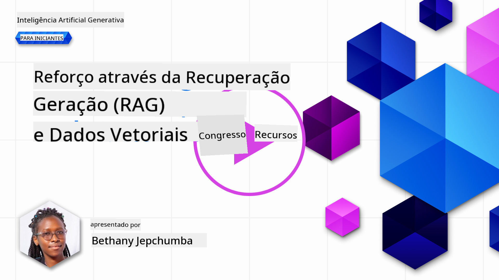
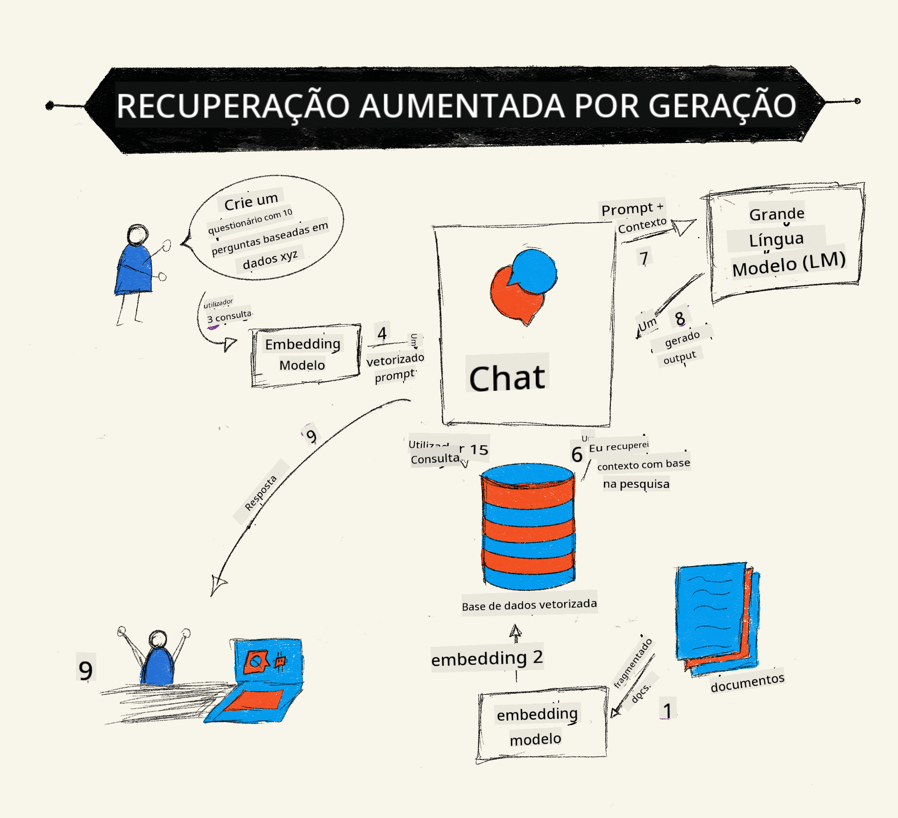
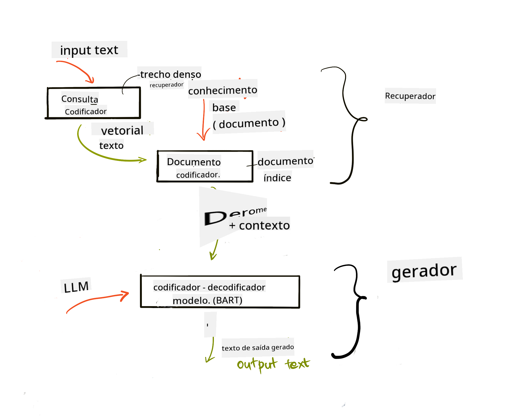
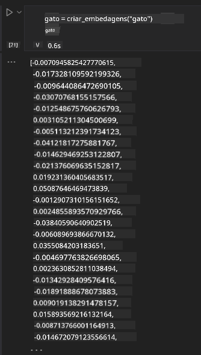

<!--
CO_OP_TRANSLATOR_METADATA:
{
  "original_hash": "e2861bbca91c0567ef32bc77fe054f9e",
  "translation_date": "2025-06-25T22:28:40+00:00",
  "source_file": "15-rag-and-vector-databases/README.md",
  "language_code": "pt"
}
-->
# Geração Aumentada por Recuperação (RAG) e Bases de Dados Vetoriais

[](https://aka.ms/gen-ai-lesson15-gh?WT.mc_id=academic-105485-koreyst)

Na lição sobre aplicações de pesquisa, aprendemos brevemente como integrar os seus próprios dados em Modelos de Linguagem de Grande Escala (LLMs). Nesta lição, vamos aprofundar-nos nos conceitos de fundamentar os seus dados na aplicação LLM, os mecanismos do processo e os métodos de armazenamento de dados, incluindo tanto embeddings como texto.

> **Vídeo em Breve**

## Introdução

Nesta lição, vamos abordar o seguinte:

- Uma introdução ao RAG, o que é e por que é utilizado na IA (inteligência artificial).

- Compreender o que são bases de dados vetoriais e criar uma para nossa aplicação.

- Um exemplo prático de como integrar o RAG numa aplicação.

## Objetivos de Aprendizagem

Após completar esta lição, você será capaz de:

- Explicar a importância do RAG na recuperação e processamento de dados.

- Configurar a aplicação RAG e fundamentar os seus dados a um LLM

- Integração eficaz de RAG e Bases de Dados Vetoriais em Aplicações LLM.

## Nosso Cenário: melhorando nossos LLMs com nossos próprios dados

Para esta lição, queremos adicionar nossas próprias notas à startup de educação, o que permite que o chatbot obtenha mais informações sobre os diferentes assuntos. Utilizando as notas que temos, os alunos poderão estudar melhor e compreender os diferentes tópicos, tornando mais fácil a revisão para os seus exames. Para criar nosso cenário, usaremos:

- `Azure OpenAI:` o LLM que usaremos para criar nosso chatbot

- `AI for beginners' lesson on Neural Networks`: estes serão os dados em que fundamentaremos nosso LLM

- `Azure AI Search` e `Azure Cosmos DB:` base de dados vetorial para armazenar nossos dados e criar um índice de pesquisa

Os utilizadores poderão criar quizzes de prática a partir das suas notas, cartões de revisão e resumi-los em visões gerais concisas. Para começar, vejamos o que é o RAG e como funciona:

## Geração Aumentada por Recuperação (RAG)

Um chatbot alimentado por LLM processa os prompts dos utilizadores para gerar respostas. Ele é projetado para ser interativo e envolver os utilizadores em uma ampla gama de tópicos. No entanto, suas respostas são limitadas ao contexto fornecido e aos dados de treinamento fundamentais. Por exemplo, o limite de conhecimento do GPT-4 é setembro de 2021, o que significa que ele não tem conhecimento de eventos que ocorreram após este período. Além disso, os dados utilizados para treinar LLMs excluem informações confidenciais, como notas pessoais ou o manual de produtos de uma empresa.

### Como funcionam os RAGs (Geração Aumentada por Recuperação)



Suponha que você queira implementar um chatbot que crie quizzes a partir de suas notas, você precisará de uma conexão com a base de conhecimento. É aí que o RAG vem ao resgate. Os RAGs operam da seguinte forma:

- **Base de conhecimento:** Antes da recuperação, esses documentos precisam ser ingeridos e pré-processados, geralmente dividindo grandes documentos em pedaços menores, transformando-os em embeddings de texto e armazenando-os em uma base de dados.

- **Consulta do Utilizador:** o utilizador faz uma pergunta

- **Recuperação:** Quando um utilizador faz uma pergunta, o modelo de embeddings recupera informações relevantes da nossa base de conhecimento para fornecer mais contexto que será incorporado ao prompt.

- **Geração Aumentada:** o LLM melhora sua resposta com base nos dados recuperados. Isso permite que a resposta gerada seja não apenas baseada em dados pré-treinados, mas também em informações relevantes do contexto adicionado. Os dados recuperados são usados para aumentar as respostas do LLM. O LLM então retorna uma resposta à pergunta do utilizador.



A arquitetura para RAGs é implementada usando transformadores consistindo em duas partes: um codificador e um decodificador. Por exemplo, quando um utilizador faz uma pergunta, o texto de entrada é 'codificado' em vetores capturando o significado das palavras e os vetores são 'decodificados' em nosso índice de documentos e gera novo texto com base na consulta do utilizador. O LLM utiliza tanto um modelo codificador-decodificador para gerar a saída.

Duas abordagens ao implementar RAG de acordo com o artigo proposto: [Geração Aumentada por Recuperação para Tarefas de NLP (processamento de linguagem natural) intensivas em conhecimento](https://arxiv.org/pdf/2005.11401.pdf?WT.mc_id=academic-105485-koreyst) são:

- **_RAG-Sequence_** usando documentos recuperados para prever a melhor resposta possível a uma consulta do utilizador

- **RAG-Token** usando documentos para gerar o próximo token, então recuperá-los para responder à consulta do utilizador

### Por que usar RAGs? 

- **Riqueza de informação:** garante que as respostas de texto estejam atualizadas e atuais. Portanto, melhora o desempenho em tarefas específicas de domínio ao acessar a base de conhecimento interna.

- Reduz a fabricação ao utilizar **dados verificáveis** na base de conhecimento para fornecer contexto às consultas dos utilizadores.

- É **econômico** pois são mais econômicos em comparação com o ajuste fino de um LLM

## Criando uma base de conhecimento

Nossa aplicação é baseada em nossos dados pessoais, ou seja, a lição sobre Redes Neurais no currículo AI For Beginners.

### Bases de Dados Vetoriais

Uma base de dados vetorial, ao contrário de bases de dados tradicionais, é uma base de dados especializada projetada para armazenar, gerir e pesquisar vetores incorporados. Ela armazena representações numéricas de documentos. Dividir dados em embeddings numéricos facilita a compreensão e processamento dos dados pelo nosso sistema de IA.

Armazenamos nossos embeddings em bases de dados vetoriais, pois os LLMs têm um limite do número de tokens que aceitam como entrada. Como não é possível passar todos os embeddings para um LLM, precisamos dividi-los em pedaços e, quando um utilizador faz uma pergunta, os embeddings mais semelhantes à pergunta serão retornados juntamente com o prompt. A divisão em pedaços também reduz os custos com o número de tokens passados por um LLM.

Algumas bases de dados vetoriais populares incluem Azure Cosmos DB, Clarifyai, Pinecone, Chromadb, ScaNN, Qdrant e DeepLake. Você pode criar um modelo Azure Cosmos DB usando Azure CLI com o seguinte comando:

```bash
az login
az group create -n <resource-group-name> -l <location>
az cosmosdb create -n <cosmos-db-name> -r <resource-group-name>
az cosmosdb list-keys -n <cosmos-db-name> -g <resource-group-name>
```

### De texto para embeddings

Antes de armazenarmos nossos dados, precisamos convertê-los em embeddings vetoriais antes de serem armazenados na base de dados. Se você estiver trabalhando com documentos grandes ou textos longos, pode dividi-los com base nas consultas que espera. A divisão em pedaços pode ser feita ao nível de sentença ou ao nível de parágrafo. Como a divisão em pedaços deriva significados das palavras ao redor, você pode adicionar algum outro contexto a um pedaço, por exemplo, adicionando o título do documento ou incluindo algum texto antes ou depois do pedaço. Você pode dividir os dados da seguinte forma:

```python
def split_text(text, max_length, min_length):
    words = text.split()
    chunks = []
    current_chunk = []

    for word in words:
        current_chunk.append(word)
        if len(' '.join(current_chunk)) < max_length and len(' '.join(current_chunk)) > min_length:
            chunks.append(' '.join(current_chunk))
            current_chunk = []

    # If the last chunk didn't reach the minimum length, add it anyway
    if current_chunk:
        chunks.append(' '.join(current_chunk))

    return chunks
```

Uma vez divididos, podemos então incorporar nosso texto usando diferentes modelos de embeddings. Alguns modelos que você pode usar incluem: word2vec, ada-002 da OpenAI, Azure Computer Vision e muitos mais. Selecionar um modelo para usar dependerá das línguas que você está usando, do tipo de conteúdo codificado (texto/imagens/áudio), do tamanho da entrada que ele pode codificar e do comprimento da saída de embedding.

Um exemplo de texto incorporado usando o modelo `text-embedding-ada-002` da OpenAI é:


## Recuperação e Pesquisa Vetorial

Quando um utilizador faz uma pergunta, o recuperador transforma-a em um vetor usando o codificador de consulta, ele então pesquisa em nosso índice de pesquisa de documentos por vetores relevantes no documento que estão relacionados à entrada. Uma vez feito, ele converte tanto o vetor de entrada quanto os vetores de documentos em texto e passa pelo LLM.

### Recuperação

A recuperação acontece quando o sistema tenta encontrar rapidamente os documentos do índice que satisfazem os critérios de pesquisa. O objetivo do recuperador é obter documentos que serão usados para fornecer contexto e fundamentar o LLM nos seus dados.

Existem várias maneiras de realizar pesquisas dentro da nossa base de dados, como:

- **Pesquisa por palavra-chave** - usada para pesquisas de texto

- **Pesquisa semântica** - usa o significado semântico das palavras

- **Pesquisa vetorial** - converte documentos de texto para representações vetoriais usando modelos de embeddings. A recuperação será feita consultando os documentos cujas representações vetoriais estão mais próximas da pergunta do utilizador.

- **Híbrido** - uma combinação de pesquisa por palavra-chave e pesquisa vetorial.

Um desafio com a recuperação surge quando não há resposta semelhante à consulta na base de dados, o sistema então retornará a melhor informação que puder obter, no entanto, você pode usar táticas como configurar a distância máxima para relevância ou usar pesquisa híbrida que combina palavras-chave e pesquisa vetorial. Nesta lição, usaremos pesquisa híbrida, uma combinação de pesquisa vetorial e por palavra-chave. Armazenaremos nossos dados em um dataframe com colunas contendo os pedaços, bem como embeddings.

### Similaridade Vetorial

O recuperador pesquisará na base de dados de conhecimento por embeddings que estão próximos uns dos outros, o vizinho mais próximo, pois são textos semelhantes. No cenário em que um utilizador faz uma consulta, ela é primeiro incorporada e depois combinada com embeddings semelhantes. A medida comum usada para encontrar quão semelhantes diferentes vetores são é a similaridade cosseno, que se baseia no ângulo entre dois vetores.

Podemos medir a similaridade usando outras alternativas, como a distância Euclidiana, que é a linha reta entre os pontos finais dos vetores, e o produto escalar, que mede a soma dos produtos dos elementos correspondentes de dois vetores.

### Índice de Pesquisa

Ao realizar a recuperação, precisaremos construir um índice de pesquisa para nossa base de conhecimento antes de realizar a pesquisa. Um índice armazenará nossos embeddings e poderá recuperar rapidamente os pedaços mais semelhantes, mesmo em uma base de dados grande. Podemos criar nosso índice localmente usando:

```python
from sklearn.neighbors import NearestNeighbors

embeddings = flattened_df['embeddings'].to_list()

# Create the search index
nbrs = NearestNeighbors(n_neighbors=5, algorithm='ball_tree').fit(embeddings)

# To query the index, you can use the kneighbors method
distances, indices = nbrs.kneighbors(embeddings)
```

### Re-ranking

Uma vez que você tenha consultado a base de dados, pode ser necessário classificar os resultados do mais relevante. Um LLM de reranking utiliza Machine Learning para melhorar a relevância dos resultados de pesquisa, ordenando-os do mais relevante. Usando Azure AI Search, o reranking é feito automaticamente para você usando um reranker semântico. Um exemplo de como o reranking funciona usando vizinhos mais próximos:

```python
# Find the most similar documents
distances, indices = nbrs.kneighbors([query_vector])

index = []
# Print the most similar documents
for i in range(3):
    index = indices[0][i]
    for index in indices[0]:
        print(flattened_df['chunks'].iloc[index])
        print(flattened_df['path'].iloc[index])
        print(flattened_df['distances'].iloc[index])
    else:
        print(f"Index {index} not found in DataFrame")
```

## Juntando tudo

O último passo é adicionar nosso LLM à mistura para poder obter respostas fundamentadas nos nossos dados. Podemos implementá-lo da seguinte forma:

```python
user_input = "what is a perceptron?"

def chatbot(user_input):
    # Convert the question to a query vector
    query_vector = create_embeddings(user_input)

    # Find the most similar documents
    distances, indices = nbrs.kneighbors([query_vector])

    # add documents to query  to provide context
    history = []
    for index in indices[0]:
        history.append(flattened_df['chunks'].iloc[index])

    # combine the history and the user input
    history.append(user_input)

    # create a message object
    messages=[
        {"role": "system", "content": "You are an AI assistant that helps with AI questions."},
        {"role": "user", "content": history[-1]}
    ]

    # use chat completion to generate a response
    response = openai.chat.completions.create(
        model="gpt-4",
        temperature=0.7,
        max_tokens=800,
        messages=messages
    )

    return response.choices[0].message

chatbot(user_input)
```

## Avaliando nossa aplicação

### Métricas de Avaliação

- Qualidade das respostas fornecidas garantindo que soem naturais, fluentes e humanas

- Fundamentação dos dados: avaliar se a resposta veio dos documentos fornecidos

- Relevância: avaliar se a resposta corresponde e está relacionada à pergunta feita

- Fluência - se a resposta faz sentido gramaticalmente

## Casos de Uso para usar RAG (Geração Aumentada por Recuperação) e bases de dados vetoriais

Existem muitos casos de uso diferentes onde chamadas de função podem melhorar sua aplicação, como:

- Perguntas e Respostas: fundamentar os dados da sua empresa a um chat que pode ser usado por funcionários para fazer perguntas.

- Sistemas de Recomendação: onde você pode criar um sistema que corresponda aos valores mais semelhantes, por exemplo, filmes, restaurantes e muitos mais.

- Serviços de chatbot: você pode armazenar o histórico de chat e personalizar a conversa com base nos dados do utilizador.

- Pesquisa de imagem baseada em embeddings vetoriais, útil ao fazer reconhecimento de imagem e detecção de anomalias.

## Resumo

Cobrimos as áreas fundamentais do RAG desde adicionar nossos dados à aplicação, a consulta do utilizador e a saída. Para simplificar a criação de RAG, você pode usar frameworks como Semanti Kernel, Langchain ou Autogen.

## Tarefa

Para continuar seu aprendizado sobre Geração Aumentada por Recuperação (RAG), você pode construir:

- Criar uma interface para a aplicação usando o framework de sua escolha

- Utilizar um framework, seja LangChain ou Semantic Kernel, e recriar sua aplicação.

Parabéns por completar a lição 👏.

## O aprendizado não para por aqui, continue a Jornada

Após completar esta lição, confira nossa [coleção de Aprendizado de IA Generativa](https://aka.ms/genai-collection?WT.mc_id=academic-105485-koreyst) para continuar a aprimorar seu conhecimento em IA Generativa!

**Aviso Legal**:  
Este documento foi traduzido utilizando o serviço de tradução por IA [Co-op Translator](https://github.com/Azure/co-op-translator). Embora nos esforcemos para garantir a precisão, esteja ciente de que traduções automáticas podem conter erros ou imprecisões. O documento original no seu idioma nativo deve ser considerado a fonte autoritária. Para informações críticas, recomenda-se uma tradução humana profissional. Não nos responsabilizamos por quaisquer mal-entendidos ou interpretações erradas decorrentes do uso desta tradução.