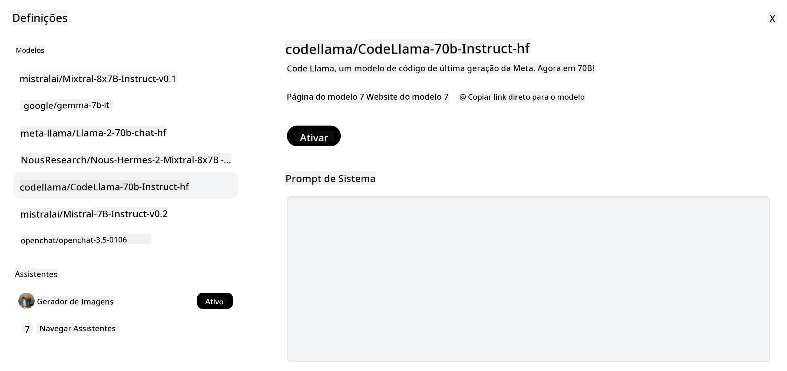
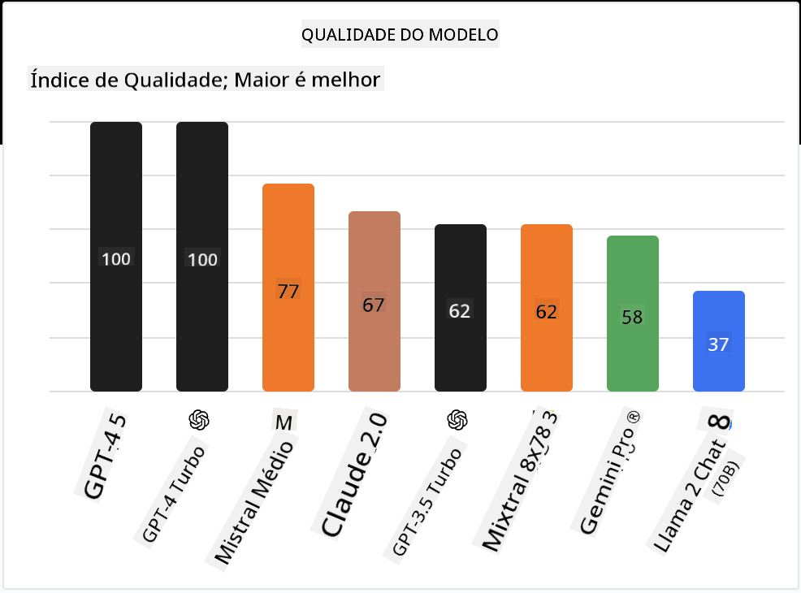

<!--
CO_OP_TRANSLATOR_METADATA:
{
  "original_hash": "0bba96e53ab841d99db731892a51fab8",
  "translation_date": "2025-05-20T06:53:31+00:00",
  "source_file": "16-open-source-models/README.md",
  "language_code": "pt"
}
-->

## Introdução

O mundo dos LLMs de código aberto é empolgante e está em constante evolução. Esta lição visa fornecer uma visão aprofundada dos modelos de código aberto. Se você está procurando informações sobre como os modelos proprietários se comparam aos modelos de código aberto, vá para a lição ["Explorando e Comparando Diferentes LLMs"](../02-exploring-and-comparing-different-llms/README.md?WT.mc_id=academic-105485-koreyst). Esta lição também abordará o tema de ajuste fino, mas uma explicação mais detalhada pode ser encontrada na lição ["Ajuste Fino de LLMs"](../18-fine-tuning/README.md?WT.mc_id=academic-105485-koreyst).

## Objetivos de Aprendizagem

- Compreender os Modelos de Código Aberto
- Entender os benefícios de trabalhar com Modelos de Código Aberto
- Explorar os modelos abertos disponíveis no Hugging Face e no Azure AI Studio

## O que são Modelos de Código Aberto?

O software de código aberto desempenhou um papel crucial no crescimento da tecnologia em diversos campos. A Open Source Initiative (OSI) definiu [10 critérios para software](https://web.archive.org/web/20241126001143/https://opensource.org/osd?WT.mc_id=academic-105485-koreyst) ser classificado como código aberto. O código fonte deve ser compartilhado abertamente sob uma licença aprovada pela OSI.

Embora o desenvolvimento de LLMs tenha elementos semelhantes ao desenvolvimento de software, o processo não é exatamente o mesmo. Isso gerou muita discussão na comunidade sobre a definição de código aberto no contexto dos LLMs. Para que um modelo esteja alinhado com a definição tradicional de código aberto, as seguintes informações devem estar publicamente disponíveis:

- Conjuntos de dados usados para treinar o modelo.
- Pesos completos do modelo como parte do treinamento.
- O código de avaliação.
- O código de ajuste fino.
- Pesos completos do modelo e métricas de treinamento.

Atualmente, existem apenas alguns modelos que correspondem a esses critérios. O [modelo OLMo criado pelo Allen Institute for Artificial Intelligence (AllenAI)](https://huggingface.co/allenai/OLMo-7B?WT.mc_id=academic-105485-koreyst) é um que se enquadra nessa categoria.

Para esta lição, vamos nos referir aos modelos como "modelos abertos" daqui em diante, pois eles podem não corresponder aos critérios acima no momento da escrita.

## Benefícios dos Modelos Abertos

**Altamente Personalizável** - Como os modelos abertos são lançados com informações detalhadas de treinamento, pesquisadores e desenvolvedores podem modificar os internos do modelo. Isso permite a criação de modelos altamente especializados que são ajustados para uma tarefa ou área de estudo específica. Alguns exemplos disso são geração de código, operações matemáticas e biologia.

**Custo** - O custo por token para usar e implantar esses modelos é menor do que o dos modelos proprietários. Ao construir aplicativos de IA Generativa, é importante considerar o desempenho versus preço ao trabalhar com esses modelos em seu caso de uso.

Fonte: Análise Artificial

**Flexibilidade** - Trabalhar com modelos abertos permite que você seja flexível em termos de usar diferentes modelos ou combiná-los. Um exemplo disso é o [HuggingChat Assistants](https://huggingface.co/chat?WT.mc_id=academic-105485-koreyst), onde um usuário pode selecionar o modelo sendo usado diretamente na interface do usuário:

## Explorando Diferentes Modelos Abertos

### Llama 2

[LLama2](https://huggingface.co/meta-llama?WT.mc_id=academic-105485-koreyst), desenvolvido pela Meta, é um modelo aberto otimizado para aplicativos baseados em chat. Isso se deve ao seu método de ajuste fino, que incluiu uma grande quantidade de diálogo e feedback humano. Com esse método, o modelo produz mais resultados alinhados às expectativas humanas, proporcionando uma melhor experiência ao usuário.

Alguns exemplos de versões ajustadas do Llama incluem [Japanese Llama](https://huggingface.co/elyza/ELYZA-japanese-Llama-2-7b?WT.mc_id=academic-105485-koreyst), que se especializa em japonês, e [Llama Pro](https://huggingface.co/TencentARC/LLaMA-Pro-8B?WT.mc_id=academic-105485-koreyst), que é uma versão aprimorada do modelo base.

### Mistral

[Mistral](https://huggingface.co/mistralai?WT.mc_id=academic-105485-koreyst) é um modelo aberto com forte foco em alto desempenho e eficiência. Ele usa a abordagem Mixture-of-Experts, que combina um grupo de modelos especializados em um sistema onde, dependendo da entrada, certos modelos são selecionados para serem usados. Isso torna a computação mais eficaz, pois os modelos abordam apenas as entradas nas quais são especializados.

Alguns exemplos de versões ajustadas do Mistral incluem [BioMistral](https://huggingface.co/BioMistral/BioMistral-7B?text=Mon+nom+est+Thomas+et+mon+principal?WT.mc_id=academic-105485-koreyst), que é focado no domínio médico, e [OpenMath Mistral](https://huggingface.co/nvidia/OpenMath-Mistral-7B-v0.1-hf?WT.mc_id=academic-105485-koreyst), que realiza computação matemática.

### Falcon

[Falcon](https://huggingface.co/tiiuae?WT.mc_id=academic-105485-koreyst) é um LLM criado pelo Instituto de Inovação Tecnológica (**TII**). O Falcon-40B foi treinado em 40 bilhões de parâmetros, o que mostrou ter um desempenho melhor que o GPT-3 com menos orçamento de computação. Isso se deve ao uso do algoritmo FlashAttention e atenção multiquery, que permite reduzir os requisitos de memória no momento da inferência. Com esse tempo de inferência reduzido, o Falcon-40B é adequado para aplicativos de chat.

Alguns exemplos de versões ajustadas do Falcon são o [OpenAssistant](https://huggingface.co/OpenAssistant/falcon-40b-sft-top1-560?WT.mc_id=academic-105485-koreyst), um assistente construído em modelos abertos, e [GPT4ALL](https://huggingface.co/nomic-ai/gpt4all-falcon?WT.mc_id=academic-105485-koreyst), que oferece desempenho superior ao modelo base.

## Como Escolher

Não há uma resposta única para escolher um modelo aberto. Um bom ponto de partida é usar o recurso de filtro por tarefa do Azure AI Studio. Isso ajudará você a entender quais tipos de tarefas o modelo foi treinado para realizar. O Hugging Face também mantém um LLM Leaderboard que mostra os modelos com melhor desempenho com base em certas métricas.

Ao procurar comparar LLMs entre os diferentes tipos, [Artificial Analysis](https://artificialanalysis.ai/?WT.mc_id=academic-105485-koreyst) é outro ótimo recurso:

Fonte: Análise Artificial

Se estiver trabalhando em um caso de uso específico, procurar versões ajustadas que sejam focadas na mesma área pode ser eficaz. Experimentar múltiplos modelos abertos para ver como eles se comportam de acordo com suas expectativas e as de seus usuários é outra boa prática.

## Próximos Passos

A melhor parte dos modelos abertos é que você pode começar a trabalhar com eles rapidamente. Confira o [Catálogo de Modelos do Azure AI Studio](https://ai.azure.com?WT.mc_id=academic-105485-koreyst), que apresenta uma coleção específica do Hugging Face com os modelos discutidos aqui.

## O aprendizado não para aqui, continue a Jornada

Após completar esta lição, confira nossa [coleção de aprendizado de IA Generativa](https://aka.ms/genai-collection?WT.mc_id=academic-105485-koreyst) para continuar aprimorando seu conhecimento em IA Generativa!

**Aviso Legal**:  
Este documento foi traduzido usando o serviço de tradução por IA [Co-op Translator](https://github.com/Azure/co-op-translator). Embora nos esforcemos para garantir a precisão, esteja ciente de que traduções automatizadas podem conter erros ou imprecisões. O documento original em seu idioma nativo deve ser considerado a fonte autorizada. Para informações críticas, recomenda-se a tradução profissional humana. Não nos responsabilizamos por quaisquer mal-entendidos ou interpretações incorretas decorrentes do uso desta tradução.