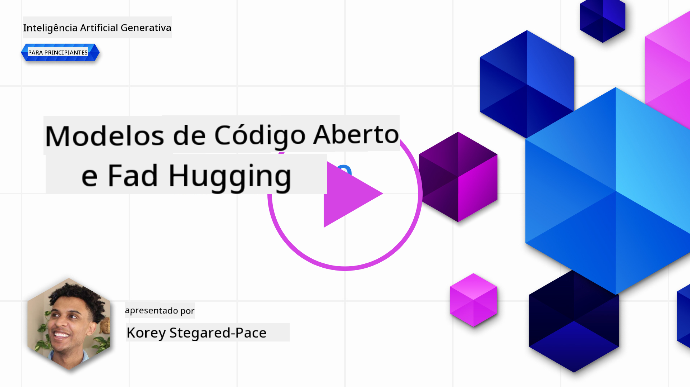
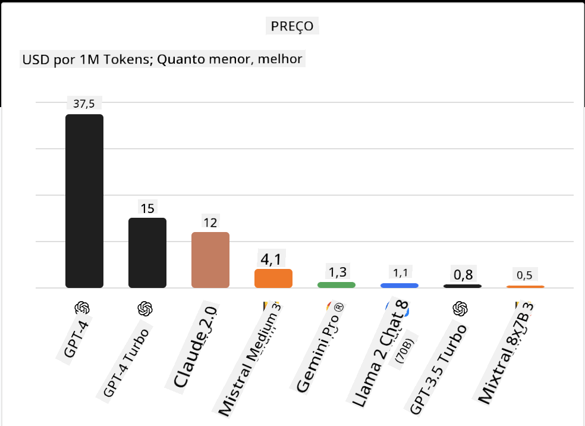
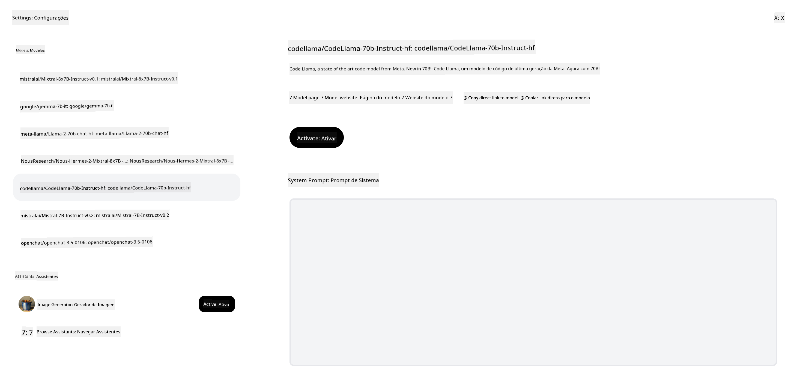

<!--
CO_OP_TRANSLATOR_METADATA:
{
  "original_hash": "0bba96e53ab841d99db731892a51fab8",
  "translation_date": "2025-07-09T17:08:26+00:00",
  "source_file": "16-open-source-models/README.md",
  "language_code": "pt"
}
-->

## Introdução

O mundo dos LLMs open source é entusiasmante e está em constante evolução. Esta lição tem como objetivo fornecer uma visão aprofundada sobre modelos open source. Se procura informações sobre como os modelos proprietários se comparam aos modelos open source, consulte a [lição "Explorando e Comparando Diferentes LLMs"](../02-exploring-and-comparing-different-llms/README.md?WT.mc_id=academic-105485-koreyst). Esta lição também abordará o tema do fine-tuning, mas uma explicação mais detalhada pode ser encontrada na [lição "Fine-Tuning LLMs"](../18-fine-tuning/README.md?WT.mc_id=academic-105485-koreyst).

## Objetivos de aprendizagem

- Compreender os modelos open source  
- Entender os benefícios de trabalhar com modelos open source  
- Explorar os modelos open disponíveis no Hugging Face e no Azure AI Studio  

## O que são Modelos Open Source?

O software open source tem desempenhado um papel crucial no crescimento da tecnologia em várias áreas. A Open Source Initiative (OSI) definiu [10 critérios para software](https://web.archive.org/web/20241126001143/https://opensource.org/osd?WT.mc_id=academic-105485-koreyst) ser classificado como open source. O código-fonte deve ser partilhado abertamente sob uma licença aprovada pela OSI.

Embora o desenvolvimento de LLMs tenha elementos semelhantes ao desenvolvimento de software, o processo não é exatamente o mesmo. Isto tem gerado muita discussão na comunidade sobre a definição de open source no contexto dos LLMs. Para que um modelo esteja alinhado com a definição tradicional de open source, as seguintes informações devem estar publicamente disponíveis:

- Conjuntos de dados usados para treinar o modelo.  
- Pesos completos do modelo como parte do treino.  
- O código de avaliação.  
- O código de fine-tuning.  
- Pesos completos do modelo e métricas de treino.  

Atualmente, existem apenas alguns modelos que cumprem estes critérios. O [modelo OLMo criado pelo Allen Institute for Artificial Intelligence (AllenAI)](https://huggingface.co/allenai/OLMo-7B?WT.mc_id=academic-105485-koreyst) é um exemplo que se enquadra nesta categoria.

Para esta lição, iremos referir-nos aos modelos como "modelos open" daqui em diante, pois podem não corresponder aos critérios acima no momento da escrita.

## Benefícios dos Modelos Open

**Altamente Personalizáveis** – Como os modelos open são lançados com informações detalhadas de treino, investigadores e desenvolvedores podem modificar o interior do modelo. Isto permite a criação de modelos altamente especializados, ajustados para uma tarefa ou área de estudo específica. Alguns exemplos são geração de código, operações matemáticas e biologia.

**Custo** – O custo por token para usar e implementar estes modelos é inferior ao dos modelos proprietários. Ao construir aplicações de IA Generativa, deve-se analisar a relação desempenho vs preço ao trabalhar com estes modelos no seu caso de uso.

  
Fonte: Artificial Analysis

**Flexibilidade** – Trabalhar com modelos open permite flexibilidade em termos de usar diferentes modelos ou combiná-los. Um exemplo disto são os [HuggingChat Assistants](https://huggingface.co/chat?WT.mc_id=academic-105485-koreyst), onde o utilizador pode selecionar o modelo a usar diretamente na interface:

## Explorando Diferentes Modelos Open

### Llama 2

[LLama2](https://huggingface.co/meta-llama?WT.mc_id=academic-105485-koreyst), desenvolvido pela Meta, é um modelo open otimizado para aplicações baseadas em chat. Isto deve-se ao seu método de fine-tuning, que incluiu uma grande quantidade de diálogo e feedback humano. Com este método, o modelo produz resultados mais alinhados com as expectativas humanas, proporcionando uma melhor experiência ao utilizador.

Alguns exemplos de versões fine-tuned do Llama incluem o [Japanese Llama](https://huggingface.co/elyza/ELYZA-japanese-Llama-2-7b?WT.mc_id=academic-105485-koreyst), especializado em japonês, e o [Llama Pro](https://huggingface.co/TencentARC/LLaMA-Pro-8B?WT.mc_id=academic-105485-koreyst), que é uma versão melhorada do modelo base.

### Mistral

[Mistral](https://huggingface.co/mistralai?WT.mc_id=academic-105485-koreyst) é um modelo open com forte foco em alto desempenho e eficiência. Utiliza a abordagem Mixture-of-Experts, que combina um grupo de modelos especialistas num único sistema, onde, dependendo da entrada, certos modelos são selecionados para serem usados. Isto torna a computação mais eficaz, pois os modelos só tratam das entradas em que são especializados.

Alguns exemplos de versões fine-tuned do Mistral incluem o [BioMistral](https://huggingface.co/BioMistral/BioMistral-7B?text=Mon+nom+est+Thomas+et+mon+principal?WT.mc_id=academic-105485-koreyst), focado na área médica, e o [OpenMath Mistral](https://huggingface.co/nvidia/OpenMath-Mistral-7B-v0.1-hf?WT.mc_id=academic-105485-koreyst), que realiza cálculos matemáticos.

### Falcon

[Falcon](https://huggingface.co/tiiuae?WT.mc_id=academic-105485-koreyst) é um LLM criado pelo Technology Innovation Institute (**TII**). O Falcon-40B foi treinado com 40 mil milhões de parâmetros e demonstrou desempenho superior ao GPT-3 com um orçamento computacional menor. Isto deve-se ao uso do algoritmo FlashAttention e da multiquery attention, que permitem reduzir os requisitos de memória durante a inferência. Com este tempo de inferência reduzido, o Falcon-40B é adequado para aplicações de chat.

Alguns exemplos de versões fine-tuned do Falcon são o [OpenAssistant](https://huggingface.co/OpenAssistant/falcon-40b-sft-top1-560?WT.mc_id=academic-105485-koreyst), um assistente construído com modelos open, e o [GPT4ALL](https://huggingface.co/nomic-ai/gpt4all-falcon?WT.mc_id=academic-105485-koreyst), que oferece desempenho superior ao modelo base.

## Como Escolher

Não existe uma resposta única para escolher um modelo open. Um bom ponto de partida é usar a funcionalidade de filtro por tarefa do Azure AI Studio. Isto ajuda a perceber para que tipos de tarefas o modelo foi treinado. O Hugging Face também mantém um LLM Leaderboard que mostra os modelos com melhor desempenho com base em certas métricas.

Ao comparar LLMs entre diferentes tipos, o [Artificial Analysis](https://artificialanalysis.ai/?WT.mc_id=academic-105485-koreyst) é outro recurso excelente:

  
Fonte: Artificial Analysis

Se estiver a trabalhar num caso de uso específico, procurar versões fine-tuned focadas na mesma área pode ser eficaz. Experimentar vários modelos open para ver como se comportam de acordo com as suas expectativas e as dos seus utilizadores é também uma boa prática.

## Próximos Passos

A melhor parte dos modelos open é que pode começar a trabalhar com eles rapidamente. Explore o [Catálogo de Modelos do Azure AI Studio](https://ai.azure.com?WT.mc_id=academic-105485-koreyst), que apresenta uma coleção específica do Hugging Face com os modelos que discutimos aqui.

## A aprendizagem não termina aqui, continue a sua jornada

Depois de completar esta lição, consulte a nossa [coleção de Aprendizagem de IA Generativa](https://aka.ms/genai-collection?WT.mc_id=academic-105485-koreyst) para continuar a aprofundar os seus conhecimentos em IA Generativa!

**Aviso Legal**:  
Este documento foi traduzido utilizando o serviço de tradução automática [Co-op Translator](https://github.com/Azure/co-op-translator). Embora nos esforcemos pela precisão, por favor tenha em conta que traduções automáticas podem conter erros ou imprecisões. O documento original na sua língua nativa deve ser considerado a fonte autorizada. Para informações críticas, recomenda-se tradução profissional humana. Não nos responsabilizamos por quaisquer mal-entendidos ou interpretações erradas decorrentes da utilização desta tradução.