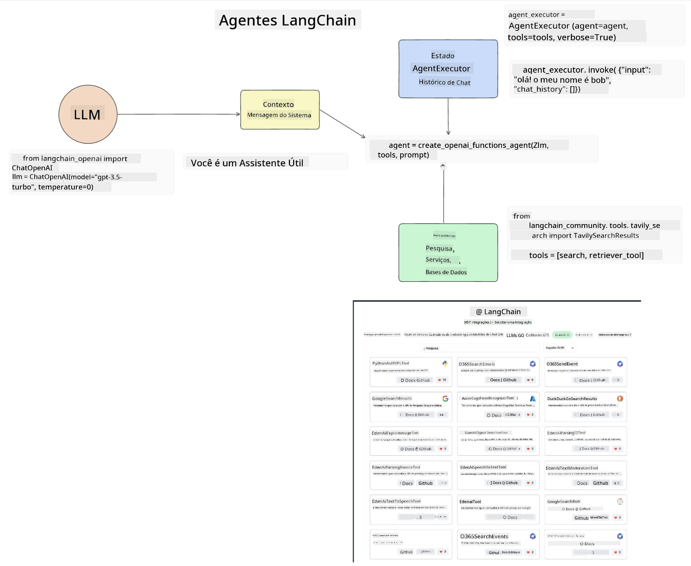
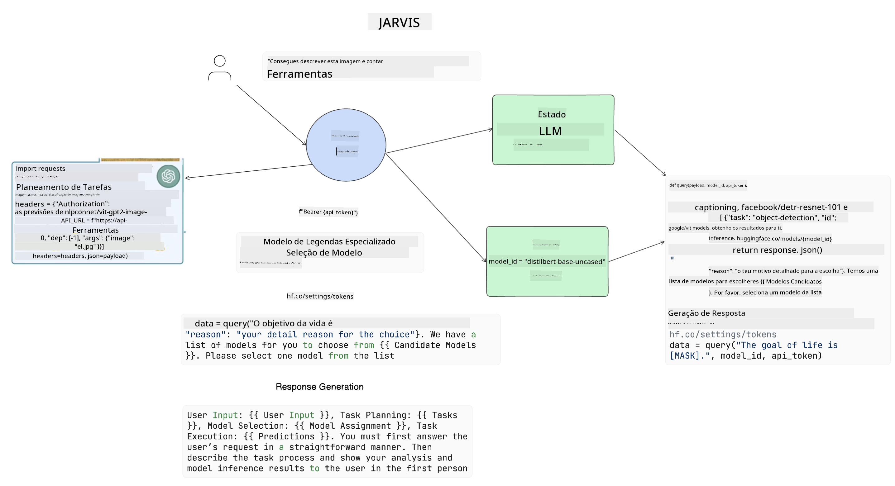

<!--
CO_OP_TRANSLATOR_METADATA:
{
  "original_hash": "8e8d1f6a63da606af7176a87ff8e92b6",
  "translation_date": "2025-10-18T00:43:59+00:00",
  "source_file": "17-ai-agents/README.md",
  "language_code": "pt"
}
-->
[](https://youtu.be/yAXVW-lUINc?si=bOtW9nL6jc3XJgOM)

## Introdução

Os Agentes de IA representam um desenvolvimento empolgante na IA Generativa, permitindo que os Modelos de Linguagem de Grande Escala (LLMs) evoluam de assistentes para agentes capazes de tomar ações. As frameworks de Agentes de IA permitem que os desenvolvedores criem aplicações que dão aos LLMs acesso a ferramentas e gestão de estado. Essas frameworks também aumentam a visibilidade, permitindo que usuários e desenvolvedores monitorem as ações planejadas pelos LLMs, melhorando assim a gestão da experiência.

A lição abordará as seguintes áreas:

- Compreender o que é um Agente de IA - O que exatamente é um Agente de IA?
- Explorar quatro diferentes frameworks de Agentes de IA - O que os torna únicos?
- Aplicar esses Agentes de IA a diferentes casos de uso - Quando devemos usar Agentes de IA?

## Objetivos de aprendizagem

Após concluir esta lição, será capaz de:

- Explicar o que são os Agentes de IA e como podem ser utilizados.
- Compreender as diferenças entre algumas das frameworks populares de Agentes de IA e como elas se diferenciam.
- Entender como os Agentes de IA funcionam para construir aplicações com eles.

## O que são Agentes de IA?

Os Agentes de IA são um campo muito empolgante no mundo da IA Generativa. Com essa empolgação, às vezes surge uma confusão de termos e suas aplicações. Para simplificar e incluir a maioria das ferramentas que se referem a Agentes de IA, usaremos esta definição:

Os Agentes de IA permitem que os Modelos de Linguagem de Grande Escala (LLMs) realizem tarefas ao dar-lhes acesso a um **estado** e **ferramentas**.


Vamos definir esses termos:

**Modelos de Linguagem de Grande Escala** - Estes são os modelos mencionados ao longo deste curso, como GPT-3.5, GPT-4, Llama-2, etc.

**Estado** - Refere-se ao contexto em que o LLM está trabalhando. O LLM utiliza o contexto de suas ações anteriores e o contexto atual, orientando sua tomada de decisão para ações subsequentes. As frameworks de Agentes de IA permitem que os desenvolvedores mantenham esse contexto de forma mais fácil.

**Ferramentas** - Para completar a tarefa solicitada pelo usuário e planejada pelo LLM, o LLM precisa de acesso a ferramentas. Alguns exemplos de ferramentas podem ser um banco de dados, uma API, uma aplicação externa ou até mesmo outro LLM!

Essas definições devem fornecer uma boa base para avançarmos enquanto exploramos como elas são implementadas. Vamos explorar algumas diferentes frameworks de Agentes de IA:

## LangChain Agents

[LangChain Agents](https://python.langchain.com/docs/how_to/#agents?WT.mc_id=academic-105485-koreyst) é uma implementação das definições que fornecemos acima.

Para gerenciar o **estado**, utiliza uma função integrada chamada `AgentExecutor`. Esta aceita o `agent` definido e as `tools` disponíveis para ele.

O `AgentExecutor` também armazena o histórico de conversas para fornecer o contexto do chat.



O LangChain oferece um [catálogo de ferramentas](https://integrations.langchain.com/tools?WT.mc_id=academic-105485-koreyst) que podem ser importadas para sua aplicação, permitindo que o LLM tenha acesso a elas. Essas ferramentas são criadas pela comunidade e pela equipe do LangChain.

Você pode então definir essas ferramentas e passá-las para o `AgentExecutor`.

A visibilidade é outro aspecto importante ao falar sobre Agentes de IA. É essencial para os desenvolvedores de aplicações entenderem qual ferramenta o LLM está utilizando e por quê. Para isso, a equipe do LangChain desenvolveu o LangSmith.

## AutoGen

A próxima framework de Agentes de IA que discutiremos é [AutoGen](https://microsoft.github.io/autogen/?WT.mc_id=academic-105485-koreyst). O foco principal do AutoGen são as conversas. Os agentes são tanto **conversáveis** quanto **personalizáveis**.

**Conversáveis -** LLMs podem iniciar e continuar uma conversa com outro LLM para completar uma tarefa. Isso é feito criando `AssistantAgents` e dando-lhes uma mensagem de sistema específica.

```python

autogen.AssistantAgent( name="Coder", llm_config=llm_config, ) pm = autogen.AssistantAgent( name="Product_manager", system_message="Creative in software product ideas.", llm_config=llm_config, )

```

**Personalizáveis** - Os agentes podem ser definidos não apenas como LLMs, mas também como um usuário ou uma ferramenta. Como desenvolvedor, pode definir um `UserProxyAgent`, que é responsável por interagir com o usuário para obter feedback na conclusão de uma tarefa. Esse feedback pode continuar a execução da tarefa ou interrompê-la.

```python
user_proxy = UserProxyAgent(name="user_proxy")
```

### Estado e Ferramentas

Para alterar e gerenciar o estado, um agente assistente gera código Python para completar a tarefa.

Aqui está um exemplo do processo:


#### LLM Definido com uma Mensagem de Sistema

```python
system_message="For weather related tasks, only use the functions you have been provided with. Reply TERMINATE when the task is done."
```

Essa mensagem de sistema direciona este LLM específico para as funções relevantes para sua tarefa. Lembre-se, com o AutoGen pode-se ter múltiplos AssistantAgents definidos com diferentes mensagens de sistema.

#### Chat Iniciado pelo Usuário

```python
user_proxy.initiate_chat( chatbot, message="I am planning a trip to NYC next week, can you help me pick out what to wear? ", )

```

Esta mensagem do user_proxy (Humano) é o que iniciará o processo do Agente para explorar as possíveis funções que ele deve executar.

#### Função Executada

```bash
chatbot (to user_proxy):

***** Suggested tool Call: get_weather ***** Arguments: {"location":"New York City, NY","time_periond:"7","temperature_unit":"Celsius"} ******************************************************** --------------------------------------------------------------------------------

>>>>>>>> EXECUTING FUNCTION get_weather... user_proxy (to chatbot): ***** Response from calling function "get_weather" ***** 112.22727272727272 EUR ****************************************************************

```

Uma vez que o chat inicial é processado, o Agente enviará a sugestão de ferramenta a ser chamada. Neste caso, é uma função chamada `get_weather`. Dependendo da sua configuração, esta função pode ser automaticamente executada e lida pelo Agente ou pode ser executada com base na entrada do usuário.

Pode encontrar uma lista de [exemplos de código do AutoGen](https://microsoft.github.io/autogen/docs/Examples/?WT.mc_id=academic-105485-koreyst) para explorar mais sobre como começar a construir.

## Taskweaver

A próxima framework de agentes que exploraremos é [Taskweaver](https://microsoft.github.io/TaskWeaver/?WT.mc_id=academic-105485-koreyst). É conhecida como um agente "orientado a código" porque, em vez de trabalhar estritamente com `strings`, pode trabalhar com DataFrames em Python. Isso torna-se extremamente útil para tarefas de análise e geração de dados. Isso pode incluir coisas como criar gráficos e tabelas ou gerar números aleatórios.

### Estado e Ferramentas

Para gerenciar o estado da conversa, o TaskWeaver utiliza o conceito de um `Planner`. O `Planner` é um LLM que recebe a solicitação dos usuários e mapeia as tarefas que precisam ser concluídas para atender a essa solicitação.

Para completar as tarefas, o `Planner` tem acesso a uma coleção de ferramentas chamadas `Plugins`. Estes podem ser classes Python ou um interpretador de código geral. Esses plugins são armazenados como embeddings para que o LLM possa buscar melhor o plugin correto.


Aqui está um exemplo de um plugin para lidar com detecção de anomalias:

```python
class AnomalyDetectionPlugin(Plugin): def __call__(self, df: pd.DataFrame, time_col_name: str, value_col_name: str):
```

O código é verificado antes de ser executado. Outra funcionalidade para gerenciar o contexto no Taskweaver é a `experience`. A experiência permite que o contexto de uma conversa seja armazenado a longo prazo em um arquivo YAML. Isso pode ser configurado para que o LLM melhore ao longo do tempo em determinadas tarefas, dado que é exposto a conversas anteriores.

## JARVIS

A última framework de agentes que exploraremos é [JARVIS](https://github.com/microsoft/JARVIS?tab=readme-ov-file?WT.mc_id=academic-105485-koreyst). O que torna o JARVIS único é que ele utiliza um LLM para gerenciar o `estado` da conversa e as `ferramentas` são outros modelos de IA. Cada um dos modelos de IA são modelos especializados que realizam determinadas tarefas, como detecção de objetos, transcrição ou legendagem de imagens.



O LLM, sendo um modelo de propósito geral, recebe a solicitação do usuário e identifica a tarefa específica e quaisquer argumentos/dados necessários para completar a tarefa.

```python
[{"task": "object-detection", "id": 0, "dep": [-1], "args": {"image": "e1.jpg" }}]
```

O LLM então formata a solicitação de uma maneira que o modelo de IA especializado possa interpretar, como JSON. Uma vez que o modelo de IA retorna sua previsão com base na tarefa, o LLM recebe a resposta.

Se múltiplos modelos forem necessários para completar a tarefa, ele também interpretará a resposta desses modelos antes de reuni-los para gerar a resposta ao usuário.

O exemplo abaixo mostra como isso funcionaria quando um usuário solicita uma descrição e contagem dos objetos em uma imagem:

## Tarefa

Para continuar a sua aprendizagem sobre Agentes de IA, pode construir com AutoGen:

- Uma aplicação que simula uma reunião de negócios com diferentes departamentos de uma startup de educação.
- Criar mensagens de sistema que orientem os LLMs a entender diferentes personas e prioridades, permitindo que o usuário apresente uma nova ideia de produto.
- O LLM deve então gerar perguntas de acompanhamento de cada departamento para refinar e melhorar a ideia do produto.

## A aprendizagem não termina aqui, continue a jornada

Após concluir esta lição, confira a nossa [coleção de aprendizagem sobre IA Generativa](https://aka.ms/genai-collection?WT.mc_id=academic-105485-koreyst) para continuar a aprimorar o seu conhecimento sobre IA Generativa!

---

**Aviso**:  
Este documento foi traduzido utilizando o serviço de tradução por IA [Co-op Translator](https://github.com/Azure/co-op-translator). Embora nos esforcemos pela precisão, esteja ciente de que traduções automáticas podem conter erros ou imprecisões. O documento original na sua língua nativa deve ser considerado a fonte autoritária. Para informações críticas, recomenda-se uma tradução profissional realizada por humanos. Não nos responsabilizamos por quaisquer mal-entendidos ou interpretações incorretas decorrentes do uso desta tradução.