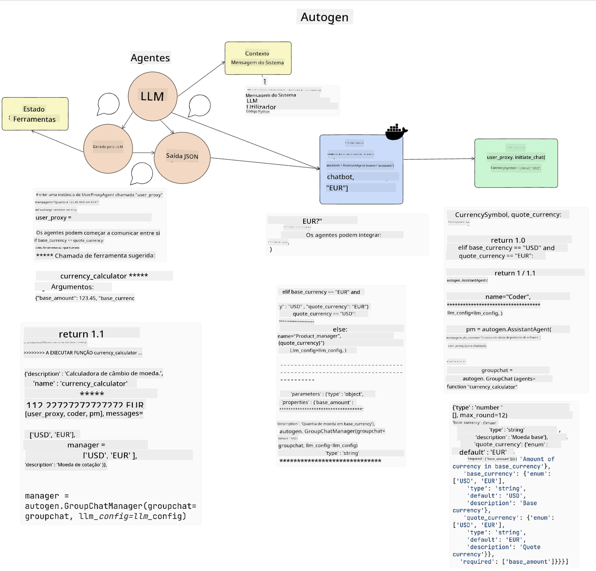

<!--
CO_OP_TRANSLATOR_METADATA:
{
  "original_hash": "11f03c81f190d9cbafd0f977dcbede6c",
  "translation_date": "2025-07-09T17:23:45+00:00",
  "source_file": "17-ai-agents/README.md",
  "language_code": "pt"
}
-->
[](https://aka.ms/gen-ai-lesson17-gh?WT.mc_id=academic-105485-koreyst)

## Introdução

Os AI Agents representam um desenvolvimento entusiasmante na IA Generativa, permitindo que os Large Language Models (LLMs) evoluam de assistentes para agentes capazes de tomar ações. Os frameworks de AI Agent permitem aos programadores criar aplicações que dão aos LLMs acesso a ferramentas e gestão de estado. Estes frameworks também melhoram a visibilidade, permitindo que utilizadores e programadores monitorizem as ações planeadas pelos LLMs, melhorando assim a gestão da experiência.

A lição irá abordar as seguintes áreas:

- Compreender o que é um AI Agent - O que é exatamente um AI Agent?
- Explorar quatro diferentes frameworks de AI Agent - O que os torna únicos?
- Aplicar estes AI Agents a diferentes casos de uso - Quando devemos usar AI Agents?

## Objetivos de aprendizagem

Após esta lição, serás capaz de:

- Explicar o que são AI Agents e como podem ser usados.
- Compreender as diferenças entre alguns dos frameworks populares de AI Agent e como se distinguem.
- Entender como funcionam os AI Agents para construir aplicações com eles.

## O que são AI Agents?

Os AI Agents são uma área muito entusiasmante no mundo da IA Generativa. Com este entusiasmo surge por vezes alguma confusão em relação aos termos e à sua aplicação. Para manter as coisas simples e incluir a maioria das ferramentas que se referem a AI Agents, vamos usar esta definição:

AI Agents permitem que os Large Language Models (LLMs) realizem tarefas dando-lhes acesso a um **estado** e a **ferramentas**.


Vamos definir estes termos:

**Large Language Models** - São os modelos referidos ao longo deste curso, como GPT-3.5, GPT-4, Llama-2, etc.

**Estado** - Refere-se ao contexto em que o LLM está a trabalhar. O LLM usa o contexto das suas ações passadas e o contexto atual para orientar a sua tomada de decisão para ações subsequentes. Os frameworks de AI Agent facilitam aos programadores a manutenção deste contexto.

**Ferramentas** - Para completar a tarefa que o utilizador solicitou e que o LLM planeou, o LLM precisa de acesso a ferramentas. Alguns exemplos de ferramentas podem ser uma base de dados, uma API, uma aplicação externa ou até outro LLM!

Estas definições deverão dar-te uma boa base para avançar enquanto exploramos como são implementados. Vamos conhecer alguns frameworks diferentes de AI Agent:

## LangChain Agents

[LangChain Agents](https://python.langchain.com/docs/how_to/#agents?WT.mc_id=academic-105485-koreyst) é uma implementação das definições que fornecemos acima.

Para gerir o **estado**, utiliza uma função incorporada chamada `AgentExecutor`. Esta aceita o `agent` definido e as `tools` disponíveis.

O `AgentExecutor` também armazena o histórico da conversa para fornecer o contexto do chat.


A LangChain oferece um [catálogo de ferramentas](https://integrations.langchain.com/tools?WT.mc_id=academic-105485-koreyst) que podem ser importadas para a tua aplicação e às quais o LLM pode aceder. Estas são criadas pela comunidade e pela equipa LangChain.

Podes então definir estas ferramentas e passá-las ao `AgentExecutor`.

A visibilidade é outro aspeto importante quando falamos de AI Agents. É fundamental que os programadores compreendam qual a ferramenta que o LLM está a usar e porquê. Para isso, a equipa da LangChain desenvolveu o LangSmith.

## AutoGen

O próximo framework de AI Agent que vamos discutir é o [AutoGen](https://microsoft.github.io/autogen/?WT.mc_id=academic-105485-koreyst). O foco principal do AutoGen são as conversas. Os agentes são tanto **conversáveis** como **personalizáveis**.

**Conversável -** Os LLMs podem iniciar e continuar uma conversa com outro LLM para completar uma tarefa. Isto é feito criando `AssistantAgents` e atribuindo-lhes uma mensagem de sistema específica.

```python

autogen.AssistantAgent( name="Coder", llm_config=llm_config, ) pm = autogen.AssistantAgent( name="Product_manager", system_message="Creative in software product ideas.", llm_config=llm_config, )

```

**Personalizável** - Os agentes podem ser definidos não só como LLMs, mas também como um utilizador ou uma ferramenta. Como programador, podes definir um `UserProxyAgent` que é responsável por interagir com o utilizador para obter feedback na execução de uma tarefa. Este feedback pode continuar a execução da tarefa ou pará-la.

```python
user_proxy = UserProxyAgent(name="user_proxy")
```

### Estado e Ferramentas

Para alterar e gerir o estado, um agente assistente gera código Python para completar a tarefa.

Aqui está um exemplo do processo:



#### LLM definido com uma mensagem de sistema

```python
system_message="For weather related tasks, only use the functions you have been provided with. Reply TERMINATE when the task is done."
```

Esta mensagem de sistema orienta este LLM específico sobre quais as funções relevantes para a sua tarefa. Lembra-te, com o AutoGen podes ter vários AssistantAgents definidos com mensagens de sistema diferentes.

#### A conversa é iniciada pelo utilizador

```python
user_proxy.initiate_chat( chatbot, message="I am planning a trip to NYC next week, can you help me pick out what to wear? ", )

```

Esta mensagem do user_proxy (Humano) é o que inicia o processo do agente para explorar as possíveis funções que deve executar.

#### Função é executada

```bash
chatbot (to user_proxy):

***** Suggested tool Call: get_weather ***** Arguments: {"location":"New York City, NY","time_periond:"7","temperature_unit":"Celsius"} ******************************************************** --------------------------------------------------------------------------------

>>>>>>>> EXECUTING FUNCTION get_weather... user_proxy (to chatbot): ***** Response from calling function "get_weather" ***** 112.22727272727272 EUR ****************************************************************

```

Depois de processar a conversa inicial, o agente irá sugerir a ferramenta a chamar. Neste caso, é uma função chamada `get_weather`. Dependendo da tua configuração, esta função pode ser executada automaticamente e lida pelo agente ou pode ser executada com base na entrada do utilizador.

Podes encontrar uma lista de [exemplos de código AutoGen](https://microsoft.github.io/autogen/docs/Examples/?WT.mc_id=academic-105485-koreyst) para explorar melhor como começar a construir.

## Taskweaver

O próximo framework de agente que vamos explorar é o [Taskweaver](https://microsoft.github.io/TaskWeaver/?WT.mc_id=academic-105485-koreyst). É conhecido como um agente "code-first" porque, em vez de trabalhar estritamente com `strings`, pode trabalhar com DataFrames em Python. Isto torna-se extremamente útil para tarefas de análise e geração de dados. Pode ser, por exemplo, criar gráficos e tabelas ou gerar números aleatórios.

### Estado e Ferramentas

Para gerir o estado da conversa, o TaskWeaver usa o conceito de `Planner`. O `Planner` é um LLM que recebe o pedido dos utilizadores e mapeia as tarefas que precisam ser concluídas para satisfazer esse pedido.

Para completar as tarefas, o `Planner` tem acesso a uma coleção de ferramentas chamadas `Plugins`. Podem ser classes Python ou um interpretador de código geral. Estes plugins são armazenados como embeddings para que o LLM possa procurar melhor o plugin correto.


Aqui está um exemplo de um plugin para detetar anomalias:

```python
class AnomalyDetectionPlugin(Plugin): def __call__(self, df: pd.DataFrame, time_col_name: str, value_col_name: str):
```

O código é verificado antes de ser executado. Outra funcionalidade para gerir o contexto no Taskweaver é a `experience`. A experiência permite que o contexto de uma conversa seja guardado a longo prazo num ficheiro YAML. Isto pode ser configurado para que o LLM melhore ao longo do tempo em certas tarefas, desde que seja exposto a conversas anteriores.

## JARVIS

O último framework de agente que vamos explorar é o [JARVIS](https://github.com/microsoft/JARVIS?tab=readme-ov-file?WT.mc_id=academic-105485-koreyst). O que torna o JARVIS único é que usa um LLM para gerir o `estado` da conversa e as `ferramentas` são outros modelos de IA. Cada um destes modelos de IA é especializado em realizar certas tarefas, como deteção de objetos, transcrição ou legendagem de imagens.


O LLM, sendo um modelo de uso geral, recebe o pedido do utilizador e identifica a tarefa específica e quaisquer argumentos/dados necessários para completar a tarefa.

```python
[{"task": "object-detection", "id": 0, "dep": [-1], "args": {"image": "e1.jpg" }}]
```

O LLM formata então o pedido de uma forma que o modelo de IA especializado possa interpretar, como JSON. Depois de o modelo de IA devolver a sua previsão com base na tarefa, o LLM recebe a resposta.

Se forem necessários vários modelos para completar a tarefa, o LLM também interpreta as respostas desses modelos antes de as juntar para gerar a resposta ao utilizador.

O exemplo abaixo mostra como isto funcionaria quando um utilizador pede uma descrição e contagem dos objetos numa imagem:

## Exercício

Para continuares a aprender sobre AI Agents, podes construir com AutoGen:

- Uma aplicação que simule uma reunião de negócios com diferentes departamentos de uma startup de educação.
- Criar mensagens de sistema que orientem os LLMs na compreensão de diferentes personas e prioridades, permitindo ao utilizador apresentar uma nova ideia de produto.
- O LLM deve então gerar perguntas de seguimento de cada departamento para refinar e melhorar a apresentação e a ideia do produto.

## A aprendizagem não termina aqui, continua a tua jornada

Depois de completares esta lição, explora a nossa [coleção de Aprendizagem em IA Generativa](https://aka.ms/genai-collection?WT.mc_id=academic-105485-koreyst) para continuares a aprofundar os teus conhecimentos em IA Generativa!

**Aviso Legal**:  
Este documento foi traduzido utilizando o serviço de tradução automática [Co-op Translator](https://github.com/Azure/co-op-translator). Embora nos esforcemos para garantir a precisão, por favor tenha em conta que traduções automáticas podem conter erros ou imprecisões. O documento original na sua língua nativa deve ser considerado a fonte autorizada. Para informações críticas, recomenda-se a tradução profissional humana. Não nos responsabilizamos por quaisquer mal-entendidos ou interpretações erradas decorrentes da utilização desta tradução.