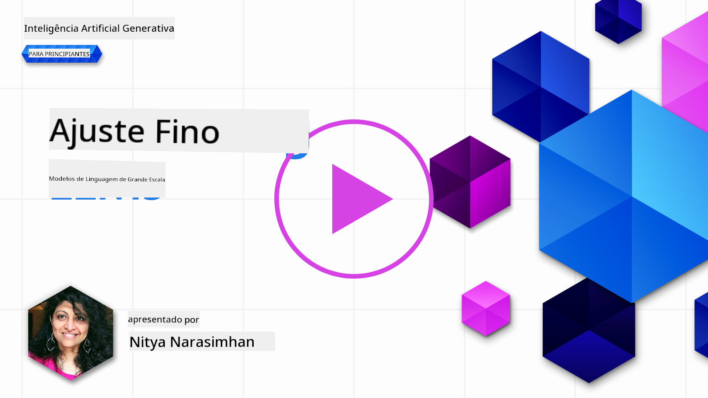
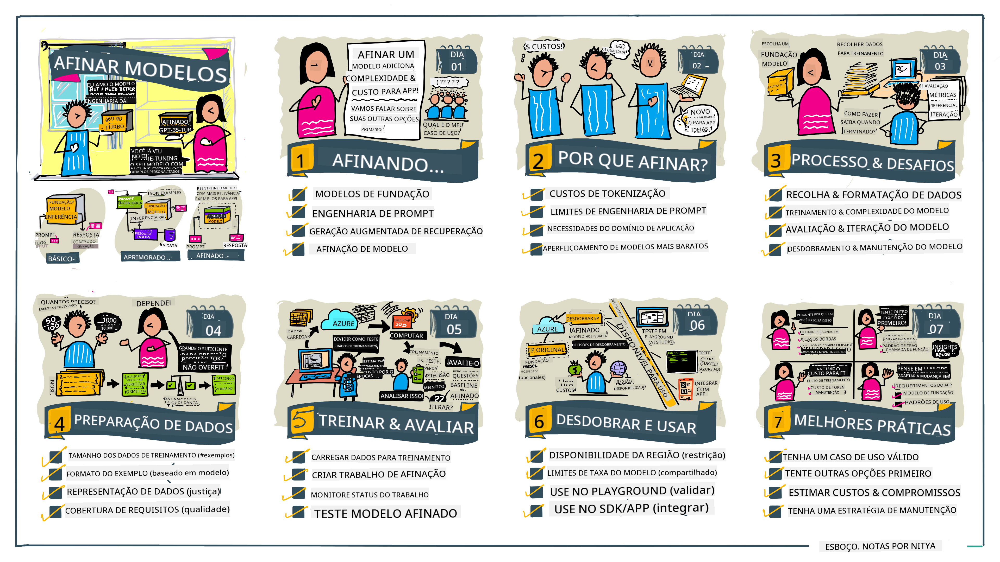

<!--
CO_OP_TRANSLATOR_METADATA:
{
  "original_hash": "68664f7e754a892ae1d8d5e2b7bd2081",
  "translation_date": "2025-07-09T17:41:14+00:00",
  "source_file": "18-fine-tuning/README.md",
  "language_code": "pt"
}
-->

# Ajuste Fino do Seu LLM

Utilizar grandes modelos de linguagem para construir aplicações de IA generativa traz novos desafios. Uma questão fundamental é garantir a qualidade das respostas (precisão e relevância) no conteúdo gerado pelo modelo para um dado pedido do utilizador. Nas lições anteriores, discutimos técnicas como engenharia de prompts e geração aumentada por recuperação, que tentam resolver o problema _modificando o input do prompt_ para o modelo existente.

Na lição de hoje, vamos abordar uma terceira técnica, o **ajuste fino**, que tenta resolver o desafio _re-treinando o próprio modelo_ com dados adicionais. Vamos explorar os detalhes.

## Objetivos de Aprendizagem

Esta lição introduz o conceito de ajuste fino para modelos de linguagem pré-treinados, explora os benefícios e desafios desta abordagem, e fornece orientações sobre quando e como usar o ajuste fino para melhorar o desempenho dos seus modelos de IA generativa.

No final desta lição, deverá ser capaz de responder às seguintes perguntas:

- O que é ajuste fino para modelos de linguagem?
- Quando e por que é útil o ajuste fino?
- Como posso ajustar finamente um modelo pré-treinado?
- Quais são as limitações do ajuste fino?

Pronto? Vamos começar.

## Guia Ilustrado

Quer ter uma visão geral do que vamos abordar antes de começarmos? Veja este guia ilustrado que descreve a jornada de aprendizagem desta lição – desde aprender os conceitos principais e a motivação para o ajuste fino, até compreender o processo e as melhores práticas para executar a tarefa de ajuste fino. Este é um tema fascinante para explorar, por isso não se esqueça de consultar a página de [Recursos](./RESOURCES.md?WT.mc_id=academic-105485-koreyst) para links adicionais que apoiem a sua aprendizagem autónoma!

## O que é ajuste fino para modelos de linguagem?

Por definição, grandes modelos de linguagem são _pré-treinados_ com grandes quantidades de texto provenientes de fontes diversas, incluindo a internet. Como aprendemos nas lições anteriores, precisamos de técnicas como _engenharia de prompts_ e _geração aumentada por recuperação_ para melhorar a qualidade das respostas do modelo às perguntas do utilizador ("prompts").

Uma técnica popular de engenharia de prompts envolve dar ao modelo mais orientação sobre o que se espera na resposta, seja fornecendo _instruções_ (orientação explícita) ou _dando-lhe alguns exemplos_ (orientação implícita). Isto é conhecido como _few-shot learning_, mas tem duas limitações:

- Os limites de tokens do modelo podem restringir o número de exemplos que pode fornecer, limitando a eficácia.
- Os custos de tokens do modelo podem tornar caro adicionar exemplos a cada prompt, limitando a flexibilidade.

O ajuste fino é uma prática comum em sistemas de machine learning onde pegamos num modelo pré-treinado e o re-treinamos com novos dados para melhorar o seu desempenho numa tarefa específica. No contexto dos modelos de linguagem, podemos ajustar finamente o modelo pré-treinado _com um conjunto selecionado de exemplos para uma dada tarefa ou domínio de aplicação_ para criar um **modelo personalizado** que pode ser mais preciso e relevante para essa tarefa ou domínio específico. Um benefício adicional do ajuste fino é que pode também reduzir o número de exemplos necessários para o few-shot learning – diminuindo o uso de tokens e os custos associados.

## Quando e por que devemos ajustar finamente os modelos?

Neste _contexto_, quando falamos de ajuste fino, referimo-nos ao ajuste fino **supervisionado**, onde o re-treinamento é feito **adicionando novos dados** que não faziam parte do conjunto de dados original de treino. Isto é diferente de uma abordagem de ajuste fino não supervisionado, onde o modelo é re-treinado nos dados originais, mas com hiperparâmetros diferentes.

O mais importante a lembrar é que o ajuste fino é uma técnica avançada que requer um certo nível de especialização para obter os resultados desejados. Se feito incorretamente, pode não trazer as melhorias esperadas e até degradar o desempenho do modelo para o seu domínio alvo.

Por isso, antes de aprender "como" ajustar finamente modelos de linguagem, precisa de saber "porquê" deve seguir este caminho, e "quando" iniciar o processo de ajuste fino. Comece por se fazer estas perguntas:

- **Caso de Uso**: Qual é o seu _caso de uso_ para o ajuste fino? Que aspeto do modelo pré-treinado atual quer melhorar?
- **Alternativas**: Já experimentou _outras técnicas_ para alcançar os resultados desejados? Use-as para criar uma linha base para comparação.
  - Engenharia de prompts: Experimente técnicas como few-shot prompting com exemplos de respostas relevantes. Avalie a qualidade das respostas.
  - Geração Aumentada por Recuperação: Experimente aumentar os prompts com resultados de consultas obtidas ao pesquisar os seus dados. Avalie a qualidade das respostas.
- **Custos**: Já identificou os custos do ajuste fino?
  - Ajustabilidade – o modelo pré-treinado está disponível para ajuste fino?
  - Esforço – para preparar os dados de treino, avaliar e refinar o modelo.
  - Computação – para executar os trabalhos de ajuste fino e para implementar o modelo ajustado.
  - Dados – acesso a exemplos de qualidade suficiente para impacto do ajuste fino.
- **Benefícios**: Já confirmou os benefícios do ajuste fino?
  - Qualidade – o modelo ajustado superou a linha base?
  - Custo – reduz o uso de tokens ao simplificar os prompts?
  - Extensibilidade – pode reutilizar o modelo base para novos domínios?

Ao responder a estas perguntas, deverá conseguir decidir se o ajuste fino é a abordagem certa para o seu caso de uso. Idealmente, a abordagem só é válida se os benefícios superarem os custos. Uma vez decidido avançar, é hora de pensar _como_ pode ajustar finamente o modelo pré-treinado.

Quer obter mais insights sobre o processo de decisão? Veja [To fine-tune or not to fine-tune](https://www.youtube.com/watch?v=0Jo-z-MFxJs)

## Como podemos ajustar finamente um modelo pré-treinado?

Para ajustar finamente um modelo pré-treinado, precisa de ter:

- um modelo pré-treinado para ajustar
- um conjunto de dados para usar no ajuste fino
- um ambiente de treino para executar o trabalho de ajuste fino
- um ambiente de alojamento para implementar o modelo ajustado

## Ajuste Fino em Ação

Os recursos seguintes fornecem tutoriais passo a passo para o guiar através de um exemplo real usando um modelo selecionado com um conjunto de dados curado. Para seguir estes tutoriais, precisa de uma conta no fornecedor específico, bem como acesso ao modelo e conjuntos de dados relevantes.

| Fornecedor   | Tutorial                                                                                                                                                                       | Descrição                                                                                                                                                                                                                                                                                                                                                                                                                        |
| ------------ | ------------------------------------------------------------------------------------------------------------------------------------------------------------------------------ | ---------------------------------------------------------------------------------------------------------------------------------------------------------------------------------------------------------------------------------------------------------------------------------------------------------------------------------------------------------------------------------------------------------------------------------- |
| OpenAI       | [How to fine-tune chat models](https://github.com/openai/openai-cookbook/blob/main/examples/How_to_finetune_chat_models.ipynb?WT.mc_id=academic-105485-koreyst)                | Aprenda a ajustar finamente um `gpt-35-turbo` para um domínio específico ("assistente de receitas") preparando os dados de treino, executando o trabalho de ajuste fino e usando o modelo ajustado para inferência.                                                                                                                                                                                                                  |
| Azure OpenAI | [GPT 3.5 Turbo fine-tuning tutorial](https://learn.microsoft.com/azure/ai-services/openai/tutorials/fine-tune?tabs=python-new%2Ccommand-line?WT.mc_id=academic-105485-koreyst) | Aprenda a ajustar finamente um modelo `gpt-35-turbo-0613` **na Azure** seguindo os passos para criar e carregar os dados de treino, executar o trabalho de ajuste fino, implementar e usar o novo modelo.                                                                                                                                                                                                                           |
| Hugging Face | [Fine-tuning LLMs with Hugging Face](https://www.philschmid.de/fine-tune-llms-in-2024-with-trl?WT.mc_id=academic-105485-koreyst)                                               | Este artigo explica como ajustar finamente um _LLM aberto_ (ex: `CodeLlama 7B`) usando a biblioteca [transformers](https://huggingface.co/docs/transformers/index?WT.mc_id=academic-105485-koreyst) e o [Transformer Reinforcement Learning (TRL)](https://huggingface.co/docs/trl/index?WT.mc_id=academic-105485-koreyst) com conjuntos de dados abertos no Hugging Face.                                                                 |
|              |                                                                                                                                                                                |                                                                                                                                                                                                                                                                                                                                                                                                                                    |
| 🤗 AutoTrain | [Fine-tuning LLMs with AutoTrain](https://github.com/huggingface/autotrain-advanced/?WT.mc_id=academic-105485-koreyst)                                                         | AutoTrain (ou AutoTrain Advanced) é uma biblioteca Python desenvolvida pela Hugging Face que permite ajuste fino para várias tarefas, incluindo ajuste fino de LLMs. O AutoTrain é uma solução sem código e o ajuste fino pode ser feito na sua própria cloud, no Hugging Face Spaces ou localmente. Suporta interface web, CLI e treino via ficheiros de configuração yaml.                                                                 |
|              |                                                                                                                                                                                |                                                                                                                                                                                                                                                                                                                                                                                                                                    |

## Exercício

Escolha um dos tutoriais acima e siga-o passo a passo. _Podemos replicar uma versão destes tutoriais em Jupyter Notebooks neste repositório apenas para referência. Por favor, utilize as fontes originais diretamente para obter as versões mais recentes_.

## Excelente Trabalho! Continue a Aprender.

Depois de completar esta lição, consulte a nossa [coleção de Aprendizagem de IA Generativa](https://aka.ms/genai-collection?WT.mc_id=academic-105485-koreyst) para continuar a aprofundar os seus conhecimentos em IA Generativa!

Parabéns!! Concluiu a última lição da série v2 deste curso! Não pare de aprender e construir. \*\*Consulte a página de [RECURSOS](RESOURCES.md?WT.mc_id=academic-105485-koreyst) para uma lista de sugestões adicionais só para este tema.

A nossa série v1 de lições também foi atualizada com mais exercícios e conceitos. Por isso, reserve um momento para refrescar os seus conhecimentos – e por favor [partilhe as suas dúvidas e feedback](https://github.com/microsoft/generative-ai-for-beginners/issues?WT.mc_id=academic-105485-koreyst) para nos ajudar a melhorar estas lições para a comunidade.

**Aviso Legal**:  
Este documento foi traduzido utilizando o serviço de tradução automática [Co-op Translator](https://github.com/Azure/co-op-translator). Embora nos esforcemos por garantir a precisão, por favor tenha em conta que traduções automáticas podem conter erros ou imprecisões. O documento original na sua língua nativa deve ser considerado a fonte autorizada. Para informações críticas, recomenda-se a tradução profissional humana. Não nos responsabilizamos por quaisquer mal-entendidos ou interpretações incorretas decorrentes da utilização desta tradução.