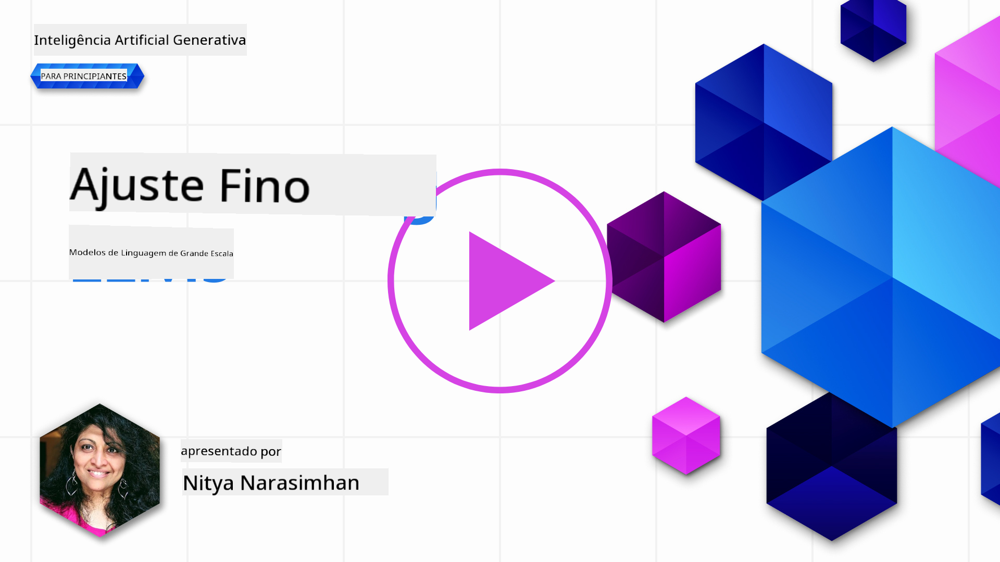
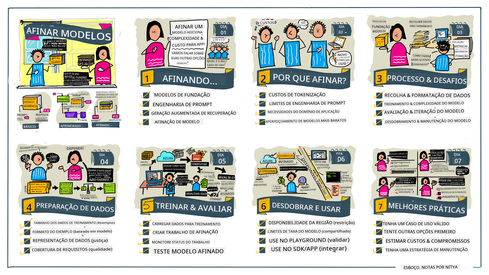

<!--
CO_OP_TRANSLATOR_METADATA:
{
  "original_hash": "68664f7e754a892ae1d8d5e2b7bd2081",
  "translation_date": "2025-06-26T00:39:31+00:00",
  "source_file": "18-fine-tuning/README.md",
  "language_code": "pt"
}
-->

# Ajuste Fino do Seu LLM

Utilizar modelos de linguagem de grande escala para construir aplicações de IA generativa traz novos desafios. Um problema crucial é garantir a qualidade das respostas (precisão e relevância) no conteúdo gerado pelo modelo para uma solicitação específica do usuário. Em lições anteriores, discutimos técnicas como engenharia de prompt e geração aumentada por recuperação que tentam resolver o problema _modificando a entrada do prompt_ para o modelo existente.

Na lição de hoje, discutimos uma terceira técnica, **ajuste fino**, que tenta abordar o desafio _reentreinando o próprio modelo_ com dados adicionais. Vamos nos aprofundar nos detalhes.

## Objetivos de Aprendizagem

Esta lição introduz o conceito de ajuste fino para modelos de linguagem pré-treinados, explora os benefícios e desafios desta abordagem, e fornece orientações sobre quando e como usar o ajuste fino para melhorar o desempenho dos seus modelos de IA generativa.

Ao final desta lição, você deverá ser capaz de responder às seguintes perguntas:

- O que é ajuste fino para modelos de linguagem?
- Quando e por que o ajuste fino é útil?
- Como posso ajustar um modelo pré-treinado?
- Quais são as limitações do ajuste fino?

Pronto? Vamos começar.

## Guia Ilustrado

Quer ter uma visão geral do que vamos abordar antes de mergulharmos? Confira este guia ilustrado que descreve a jornada de aprendizagem para esta lição - desde aprender os conceitos principais e a motivação para o ajuste fino, até entender o processo e as melhores práticas para executar a tarefa de ajuste fino. Este é um tópico fascinante para exploração, então não se esqueça de conferir a página de [Recursos](./RESOURCES.md?WT.mc_id=academic-105485-koreyst) para links adicionais que apoiarão sua jornada de aprendizagem autodirigida!

## O que é ajuste fino para modelos de linguagem?

Por definição, os modelos de linguagem de grande escala são _pré-treinados_ em grandes quantidades de texto obtidas de fontes diversas, incluindo a internet. Como aprendemos em lições anteriores, precisamos de técnicas como _engenharia de prompt_ e _geração aumentada por recuperação_ para melhorar a qualidade das respostas do modelo às perguntas do usuário ("prompts").

Uma técnica popular de engenharia de prompt envolve dar ao modelo mais orientação sobre o que é esperado na resposta, seja fornecendo _instruções_ (orientação explícita) ou _dando alguns exemplos_ (orientação implícita). Isso é conhecido como _aprendizado com poucos exemplos_, mas tem duas limitações:

- Limites de tokens do modelo podem restringir o número de exemplos que você pode dar, e limitar a eficácia.
- Custos de tokens do modelo podem tornar caro adicionar exemplos a cada prompt, e limitar a flexibilidade.

O ajuste fino é uma prática comum em sistemas de aprendizado de máquina, onde pegamos um modelo pré-treinado e o reentreinamos com novos dados para melhorar seu desempenho em uma tarefa específica. No contexto de modelos de linguagem, podemos ajustar o modelo pré-treinado _com um conjunto selecionado de exemplos para uma tarefa ou domínio de aplicação específico_ para criar um **modelo personalizado** que pode ser mais preciso e relevante para essa tarefa ou domínio específico. Um benefício adicional do ajuste fino é que ele também pode reduzir o número de exemplos necessários para o aprendizado com poucos exemplos - reduzindo o uso de tokens e os custos relacionados.

## Quando e por que devemos ajustar modelos?

Neste contexto, quando falamos sobre ajuste fino, estamos nos referindo ao ajuste fino **supervisionado**, onde o reentreinamento é feito **adicionando novos dados** que não faziam parte do conjunto de dados de treinamento original. Isso é diferente de uma abordagem de ajuste fino não supervisionado, onde o modelo é reentreinado nos dados originais, mas com diferentes hiperparâmetros.

A coisa mais importante a lembrar é que o ajuste fino é uma técnica avançada que requer um certo nível de expertise para obter os resultados desejados. Se feito incorretamente, pode não fornecer as melhorias esperadas, e pode até degradar o desempenho do modelo para o seu domínio-alvo.

Portanto, antes de aprender "como" ajustar modelos de linguagem, você precisa saber "por que" deve seguir esse caminho, e "quando" iniciar o processo de ajuste fino. Comece fazendo a si mesmo estas perguntas:

- **Caso de Uso**: Qual é o seu _caso de uso_ para o ajuste fino? Que aspecto do modelo pré-treinado atual você quer melhorar?
- **Alternativas**: Você tentou _outras técnicas_ para alcançar os resultados desejados? Use-as para criar uma linha de base para comparação.
  - Engenharia de prompt: Tente técnicas como prompting com poucos exemplos com exemplos de respostas relevantes ao prompt. Avalie a qualidade das respostas.
  - Geração Aumentada por Recuperação: Tente aumentar os prompts com resultados de consultas recuperados pesquisando seus dados. Avalie a qualidade das respostas.
- **Custos**: Você identificou os custos para o ajuste fino?
  - Ajustabilidade - o modelo pré-treinado está disponível para ajuste fino?
  - Esforço - para preparar dados de treinamento, avaliar e refinar o modelo.
  - Computação - para executar tarefas de ajuste fino, e implantar o modelo ajustado
  - Dados - acesso a exemplos de qualidade suficiente para impacto do ajuste fino
- **Benefícios**: Você confirmou os benefícios para o ajuste fino?
  - Qualidade - o modelo ajustado superou a linha de base?
  - Custo - reduz o uso de tokens simplificando prompts?
  - Extensibilidade - você pode reutilizar o modelo base para novos domínios?

Ao responder a essas perguntas, você deverá ser capaz de decidir se o ajuste fino é a abordagem certa para o seu caso de uso. Idealmente, a abordagem é válida apenas se os benefícios superarem os custos. Uma vez que você decida prosseguir, é hora de pensar em _como_ você pode ajustar o modelo pré-treinado.

Quer obter mais insights sobre o processo de tomada de decisão? Assista [Ajustar ou não ajustar](https://www.youtube.com/watch?v=0Jo-z-MFxJs)

## Como podemos ajustar um modelo pré-treinado?

Para ajustar um modelo pré-treinado, você precisa ter:

- um modelo pré-treinado para ajustar
- um conjunto de dados para usar no ajuste fino
- um ambiente de treinamento para executar a tarefa de ajuste fino
- um ambiente de hospedagem para implantar o modelo ajustado

## Ajuste Fino em Ação

Os seguintes recursos fornecem tutoriais passo a passo para guiá-lo através de um exemplo real usando um modelo selecionado com um conjunto de dados curado. Para trabalhar com esses tutoriais, você precisa de uma conta no provedor específico, juntamente com acesso ao modelo e conjuntos de dados relevantes.

| Provedor     | Tutorial                                                                                                                                                                       | Descrição                                                                                                                                                                                                                                                                                                                                                                                                                        |
| ------------ | ------------------------------------------------------------------------------------------------------------------------------------------------------------------------------ | ---------------------------------------------------------------------------------------------------------------------------------------------------------------------------------------------------------------------------------------------------------------------------------------------------------------------------------------------------------------------------------------------------------------------------------- |
| OpenAI       | [Como ajustar modelos de chat](https://github.com/openai/openai-cookbook/blob/main/examples/How_to_finetune_chat_models.ipynb?WT.mc_id=academic-105485-koreyst)                | Aprenda a ajustar um `gpt-35-turbo` para um domínio específico ("assistente de receitas") preparando dados de treinamento, executando a tarefa de ajuste fino, e usando o modelo ajustado para inferência.                                                                                                                                                                                                                                              |
| Azure OpenAI | [Tutorial de ajuste fino do GPT 3.5 Turbo](https://learn.microsoft.com/azure/ai-services/openai/tutorials/fine-tune?tabs=python-new%2Ccommand-line?WT.mc_id=academic-105485-koreyst) | Aprenda a ajustar um modelo `gpt-35-turbo-0613` **no Azure** tomando medidas para criar e carregar dados de treinamento, executar a tarefa de ajuste fino. Implemente e use o novo modelo.                                                                                                                                                                                                                                                                 |
| Hugging Face | [Ajuste fino de LLMs com Hugging Face](https://www.philschmid.de/fine-tune-llms-in-2024-with-trl?WT.mc_id=academic-105485-koreyst)                                               | Este post no blog guia você no ajuste fino de um _LLM aberto_ (ex: `CodeLlama 7B`) usando a biblioteca [transformers](https://huggingface.co/docs/transformers/index?WT.mc_id=academic-105485-koreyst) e [Transformer Reinforcement Learning (TRL)](https://huggingface.co/docs/trl/index?WT.mc_id=academic-105485-koreyst]) com [conjuntos de dados](https://huggingface.co/docs/datasets/index?WT.mc_id=academic-105485-koreyst) abertos no Hugging Face. |
|              |                                                                                                                                                                                |                                                                                                                                                                                                                                                                                                                                                                                                                                    |
| 🤗 AutoTrain | [Ajuste fino de LLMs com AutoTrain](https://github.com/huggingface/autotrain-advanced/?WT.mc_id=academic-105485-koreyst)                                                         | AutoTrain (ou AutoTrain Advanced) é uma biblioteca python desenvolvida pelo Hugging Face que permite ajuste fino para muitas tarefas diferentes, incluindo ajuste fino de LLMs. AutoTrain é uma solução sem código e o ajuste fino pode ser feito na sua própria nuvem, nos Hugging Face Spaces ou localmente. Suporta tanto uma interface gráfica baseada na web, CLI e treinamento via arquivos de configuração yaml.                                                                               |
|              |                                                                                                                                                                                |                                                                                                                                                                                                                                                                                                                                                                                                                                    |

## Tarefa

Selecione um dos tutoriais acima e percorra-os. _Podemos replicar uma versão desses tutoriais em Jupyter Notebooks neste repositório apenas para referência. Por favor, use as fontes originais diretamente para obter as versões mais recentes_.

## Ótimo Trabalho! Continue Seu Aprendizado.

Após concluir esta lição, confira nossa [coleção de Aprendizado de IA Generativa](https://aka.ms/genai-collection?WT.mc_id=academic-105485-koreyst) para continuar aprimorando seu conhecimento em IA Generativa!

Parabéns!! Você completou a lição final da série v2 deste curso! Não pare de aprender e construir. **Confira a página de [RECURSOS](RESOURCES.md?WT.mc_id=academic-105485-koreyst) para uma lista de sugestões adicionais apenas para este tópico.

Nossa série v1 de lições também foi atualizada com mais tarefas e conceitos. Então, tire um minuto para refrescar seu conhecimento - e por favor, [compartilhe suas perguntas e feedback](https://github.com/microsoft/generative-ai-for-beginners/issues?WT.mc_id=academic-105485-koreyst) para nos ajudar a melhorar essas lições para a comunidade.

**Aviso Legal**:  
Este documento foi traduzido utilizando o serviço de tradução por IA [Co-op Translator](https://github.com/Azure/co-op-translator). Embora nos esforcemos para garantir a precisão, esteja ciente de que traduções automáticas podem conter erros ou imprecisões. O documento original no seu idioma nativo deve ser considerado a fonte autorizada. Para informações críticas, recomenda-se a tradução profissional humana. Não nos responsabilizamos por quaisquer mal-entendidos ou interpretações incorretas decorrentes do uso desta tradução.