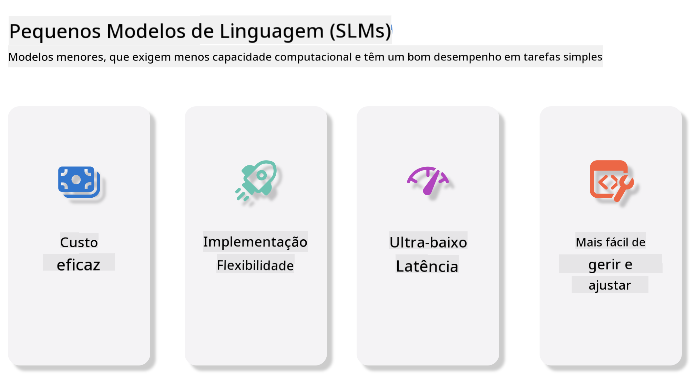

<!--
CO_OP_TRANSLATOR_METADATA:
{
  "original_hash": "124ad36cfe96f74038811b6e2bb93e9d",
  "translation_date": "2025-05-20T09:40:09+00:00",
  "source_file": "19-slm/README.md",
  "language_code": "pt"
}
-->
# Introdução a Modelos de Linguagem Pequenos para IA Generativa para Iniciantes

A IA generativa é um campo fascinante da inteligência artificial que se concentra em criar sistemas capazes de gerar novos conteúdos. Este conteúdo pode variar de texto e imagens a música e até mesmo ambientes virtuais inteiros. Uma das aplicações mais empolgantes da IA generativa é no domínio dos modelos de linguagem.

## O que são Modelos de Linguagem Pequenos?

Um Modelo de Linguagem Pequeno (SLM) representa uma variante reduzida de um modelo de linguagem grande (LLM), aproveitando muitos dos princípios e técnicas arquitetônicas dos LLMs, enquanto exibe uma pegada computacional significativamente reduzida. Os SLMs são um subconjunto de modelos de linguagem projetados para gerar texto semelhante ao humano. Ao contrário de seus grandes homólogos, como o GPT-4, os SLMs são mais compactos e eficientes, tornando-os ideais para aplicações onde os recursos computacionais são limitados. Apesar de seu tamanho menor, eles ainda podem realizar uma variedade de tarefas. Tipicamente, os SLMs são construídos por compressão ou destilação de LLMs, visando reter uma parte substancial da funcionalidade original e capacidades linguísticas do modelo. Essa redução no tamanho do modelo diminui a complexidade geral, tornando os SLMs mais eficientes em termos de uso de memória e requisitos computacionais. Apesar dessas otimizações, os SLMs ainda podem executar uma ampla gama de tarefas de processamento de linguagem natural (NLP):

- Geração de Texto: Criar frases ou parágrafos coerentes e contextualmente relevantes.
- Completação de Texto: Prever e completar frases com base em um prompt dado.
- Tradução: Converter texto de uma língua para outra.
- Resumo: Condensar textos longos em resumos mais curtos e digestíveis.

Embora com algumas concessões em desempenho ou profundidade de entendimento em comparação com seus grandes homólogos.

## Como funcionam os Modelos de Linguagem Pequenos?

Os SLMs são treinados em grandes quantidades de dados de texto. Durante o treinamento, eles aprendem os padrões e estruturas da linguagem, permitindo-lhes gerar texto que é gramaticalmente correto e contextualmente apropriado. O processo de treinamento envolve:

- Coleta de Dados: Reunir grandes conjuntos de dados de texto de várias fontes.
- Pré-processamento: Limpar e organizar os dados para torná-los adequados para o treinamento.
- Treinamento: Usar algoritmos de aprendizado de máquina para ensinar o modelo a entender e gerar texto.
- Ajuste Fino: Ajustar o modelo para melhorar seu desempenho em tarefas específicas.

O desenvolvimento de SLMs alinha-se com a crescente necessidade de modelos que possam ser implantados em ambientes com recursos limitados, como dispositivos móveis ou plataformas de computação de borda, onde os LLMs de escala completa podem ser impraticáveis devido às suas demandas pesadas de recursos. Ao focar na eficiência, os SLMs equilibram desempenho com acessibilidade, permitindo uma aplicação mais ampla em vários domínios.



## Objetivos de Aprendizagem

Nesta lição, esperamos introduzir o conhecimento de SLM e combiná-lo com o Microsoft Phi-3 para aprender diferentes cenários em conteúdo de texto, visão e MoE. Ao final desta lição, você deve ser capaz de responder às seguintes perguntas:

- O que é SLM
- Qual é a diferença entre SLM e LLM
- O que é a Família Microsoft Phi-3/3.5
- Como inferir a Família Microsoft Phi-3/3.5

Pronto? Vamos começar.

## As Distinções entre Modelos de Linguagem Grandes (LLMs) e Modelos de Linguagem Pequenos (SLMs)

Tanto os LLMs quanto os SLMs são construídos sobre princípios fundamentais de aprendizado de máquina probabilístico, seguindo abordagens semelhantes em seu design arquitetônico, metodologias de treinamento, processos de geração de dados e técnicas de avaliação de modelos. No entanto, vários fatores-chave diferenciam esses dois tipos de modelos.

## Aplicações de Modelos de Linguagem Pequenos

Os SLMs têm uma ampla gama de aplicações, incluindo:

- Chatbots: Fornecer suporte ao cliente e interagir com usuários de maneira conversacional.
- Criação de Conteúdo: Ajudar escritores gerando ideias ou até mesmo redigindo artigos inteiros.
- Educação: Ajudar estudantes com tarefas de redação ou aprendendo novas línguas.
- Acessibilidade: Criar ferramentas para indivíduos com deficiências, como sistemas de texto para fala.

**Tamanho**

Uma distinção principal entre LLMs e SLMs reside na escala dos modelos. Os LLMs, como o ChatGPT (GPT-4), podem compreender aproximadamente 1,76 trilhões de parâmetros, enquanto os SLMs de código aberto, como o Mistral 7B, são projetados com significativamente menos parâmetros—aproximadamente 7 bilhões. Essa disparidade é principalmente devido a diferenças na arquitetura do modelo e processos de treinamento. Por exemplo, o ChatGPT emprega um mecanismo de auto-atenção dentro de uma estrutura encoder-decoder, enquanto o Mistral 7B usa atenção de janela deslizante, o que permite um treinamento mais eficiente dentro de um modelo apenas de decodificação. Essa variação arquitetônica tem implicações profundas para a complexidade e desempenho desses modelos.

**Compreensão**

Os SLMs são tipicamente otimizados para desempenho dentro de domínios específicos, tornando-os altamente especializados, mas potencialmente limitados em sua capacidade de fornecer compreensão contextual ampla em vários campos de conhecimento. Em contraste, os LLMs visam simular inteligência semelhante à humana em um nível mais abrangente. Treinados em conjuntos de dados vastos e diversificados, os LLMs são projetados para ter um bom desempenho em uma variedade de domínios, oferecendo maior versatilidade e adaptabilidade. Consequentemente, os LLMs são mais adequados para uma gama mais ampla de tarefas downstream, como processamento de linguagem natural e programação.

**Computação**

O treinamento e implantação de LLMs são processos intensivos em recursos, frequentemente exigindo infraestrutura computacional significativa, incluindo clusters de GPU em larga escala. Por exemplo, treinar um modelo como o ChatGPT do zero pode necessitar de milhares de GPUs ao longo de períodos prolongados. Em contraste, os SLMs, com suas contagens de parâmetros menores, são mais acessíveis em termos de recursos computacionais. Modelos como o Mistral 7B podem ser treinados e executados em máquinas locais equipadas com capacidades moderadas de GPU, embora o treinamento ainda exija várias horas em múltiplas GPUs.

**Viés**

O viés é um problema conhecido nos LLMs, principalmente devido à natureza dos dados de treinamento. Esses modelos frequentemente dependem de dados brutos e disponíveis abertamente da internet, que podem subrepresentar ou representar erroneamente certos grupos, introduzir rotulagem errônea ou refletir vieses linguísticos influenciados por dialetos, variações geográficas e regras gramaticais. Além disso, a complexidade das arquiteturas de LLMs pode inadvertidamente exacerbar o viés, que pode passar despercebido sem um ajuste fino cuidadoso. Por outro lado, os SLMs, sendo treinados em conjuntos de dados mais restritos e específicos de domínio, são inerentemente menos suscetíveis a tais vieses, embora não sejam imunes a eles.

**Inferência**

O tamanho reduzido dos SLMs lhes confere uma vantagem significativa em termos de velocidade de inferência, permitindo que gerem saídas de forma eficiente em hardware local sem a necessidade de processamento paralelo extenso. Em contraste, os LLMs, devido ao seu tamanho e complexidade, frequentemente exigem recursos computacionais paralelos substanciais para alcançar tempos de inferência aceitáveis. A presença de múltiplos usuários simultâneos ainda mais desacelera os tempos de resposta dos LLMs, especialmente quando implantados em escala.

Em resumo, enquanto ambos os LLMs e SLMs compartilham uma base fundamental em aprendizado de máquina, eles diferem significativamente em termos de tamanho do modelo, requisitos de recursos, compreensão contextual, suscetibilidade ao viés e velocidade de inferência. Essas distinções refletem sua adequação respectiva para diferentes casos de uso, com os LLMs sendo mais versáteis, mas pesados em recursos, e os SLMs oferecendo mais eficiência específica de domínio com demandas computacionais reduzidas.

***Nota: Neste capítulo, vamos introduzir o SLM usando o Microsoft Phi-3 / 3.5 como exemplo.***

## Introdução à Família Phi-3 / Phi-3.5

A Família Phi-3 / 3.5 tem como alvo principalmente cenários de aplicação de texto, visão e Agente (MoE):

### Phi-3 / 3.5 Instruct

Principalmente para geração de texto, conclusão de chat e extração de informações de conteúdo, etc.

**Phi-3-mini**

O modelo de linguagem de 3.8B está disponível no Microsoft Azure AI Studio, Hugging Face e Ollama. Os modelos Phi-3 superam significativamente os modelos de linguagem de tamanhos iguais e maiores em benchmarks chave (veja os números de benchmark abaixo, números maiores são melhores). Phi-3-mini supera modelos duas vezes seu tamanho, enquanto Phi-3-small e Phi-3-medium superam modelos maiores, incluindo GPT-3.5

**Phi-3-small & medium**

Com apenas 7B parâmetros, Phi-3-small supera o GPT-3.5T em uma variedade de benchmarks de linguagem, raciocínio, codificação e matemática. O Phi-3-medium com 14B parâmetros continua essa tendência e supera o Gemini 1.0 Pro.

**Phi-3.5-mini**

Podemos pensar nele como uma atualização do Phi-3-mini. Enquanto os parâmetros permanecem inalterados, ele melhora a capacidade de suportar múltiplas línguas (Suporta 20+ línguas: Árabe, Chinês, Tcheco, Dinamarquês, Holandês, Inglês, Finlandês, Francês, Alemão, Hebraico, Húngaro, Italiano, Japonês, Coreano, Norueguês, Polonês, Português, Russo, Espanhol, Sueco, Tailandês, Turco, Ucraniano) e adiciona suporte mais forte para contexto longo. Phi-3.5-mini com 3.8B parâmetros supera modelos de linguagem do mesmo tamanho e está no mesmo nível de modelos duas vezes seu tamanho.

### Phi-3 / 3.5 Vision

Podemos pensar no modelo Instruct do Phi-3/3.5 como a capacidade de entender do Phi, e a Visão é o que dá olhos ao Phi para entender o mundo.

**Phi-3-Vision**

Phi-3-vision, com apenas 4.2B parâmetros, continua essa tendência e supera modelos maiores como Claude-3 Haiku e Gemini 1.0 Pro V em tarefas gerais de raciocínio visual, OCR, e compreensão de tabelas e diagramas.

**Phi-3.5-Vision**

Phi-3.5-Vision também é uma atualização do Phi-3-Vision, adicionando suporte para múltiplas imagens. Você pode pensar nisso como uma melhoria na visão, não apenas pode ver imagens, mas também vídeos. Phi-3.5-vision supera modelos maiores como Claude-3.5 Sonnet e Gemini 1.5 Flash em tarefas de compreensão de OCR, tabelas e gráficos e está no mesmo nível em tarefas de raciocínio de conhecimento visual geral. Suporta entrada de múltiplos quadros, ou seja, realiza raciocínio em múltiplas imagens de entrada.

### Phi-3.5-MoE

***Mixture of Experts (MoE)*** permite que modelos sejam pré-treinados com muito menos computação, o que significa que você pode aumentar dramaticamente o tamanho do modelo ou do conjunto de dados com o mesmo orçamento de computação de um modelo denso. Em particular, um modelo MoE deve alcançar a mesma qualidade que seu homólogo denso muito mais rapidamente durante o pré-treinamento. Phi-3.5-MoE compreende 16x3.8B módulos especialistas. Phi-3.5-MoE com apenas 6.6B parâmetros ativos alcança um nível similar de raciocínio, compreensão de linguagem e matemática que modelos muito maiores.

Podemos usar o modelo da Família Phi-3/3.5 com base em diferentes cenários. Ao contrário dos LLM, você pode implantar o Phi-3/3.5-mini ou Phi-3/3.5-Vision em dispositivos de borda.

## Como usar os modelos da Família Phi-3/3.5

Esperamos usar o Phi-3/3.5 em diferentes cenários. Em seguida, usaremos o Phi-3/3.5 com base em diferentes cenários.


### Diferença de Inferência

API da Nuvem

**Modelos GitHub**

GitHub
Models é a maneira mais direta. Você pode acessar rapidamente o modelo Phi-3/3.5-Instruct através do GitHub Models. Combinado com o Azure AI Inference SDK / OpenAI SDK, você pode acessar a API através de código para completar a chamada do Phi-3/3.5-Instruct. Você também pode testar diferentes efeitos através do Playground. - Demo: Comparação dos efeitos de Phi-3-mini e Phi-3.5-mini em cenários chineses   **Azure AI Studio** Ou, se quisermos usar os modelos de visão e MoE, você pode usar o Azure AI Studio para completar a chamada. Se você estiver interessado, pode ler o Phi-3 Cookbook para aprender como chamar Phi-3/3.5 Instruct, Vision, MoE através do Azure AI Studio [Clique neste link](https://github.com/microsoft/Phi-3CookBook/blob/main/md/02.QuickStart/AzureAIStudio_QuickStart.md?WT.mc_id=academic-105485-koreyst) **NVIDIA NIM** Além das soluções de catálogo de modelos baseadas em nuvem fornecidas pela Azure e GitHub, você também pode usar [Nivida NIM](https://developer.nvidia.com/nim?WT.mc_id=academic-105485-koreyst) para completar chamadas relacionadas. Você pode visitar o NIVIDA NIM para completar as chamadas de API da Família Phi-3/3.5. NVIDIA NIM (NVIDIA Inference Microservices) é um conjunto de microserviços de inferência acelerada projetados para ajudar os desenvolvedores a implantar modelos de IA de forma eficiente em vários ambientes, incluindo nuvens, data centers e estações de trabalho. Aqui estão algumas características principais do NVIDIA NIM: - **Facilidade de Implantação:** NIM permite a implantação de modelos de IA com um único comando, tornando-o simples de integrar em fluxos de trabalho existentes. - **Desempenho Otimizado:** Ele aproveita os motores de inferência pré-otimizados da NVIDIA, como TensorRT e TensorRT-LLM, para garantir baixa latência e alta taxa de transferência. - **Escalabilidade:** NIM suporta escalonamento automático no Kubernetes, permitindo que lide com cargas de trabalho variáveis de forma eficaz. - **Segurança e Controle:** As organizações podem manter controle sobre seus dados e aplicativos hospedando os microserviços NIM em sua própria infraestrutura gerenciada. - **APIs Padrão:** NIM fornece APIs padrão do setor, facilitando a construção e integração de aplicativos de IA como chatbots, assistentes de IA e mais. NIM faz parte do NVIDIA AI Enterprise, que visa simplificar a implantação e operacionalização de modelos de IA, garantindo que eles funcionem de forma eficiente em GPUs NVIDIA. - Demo: Usando Nividia NIM para chamar Phi-3.5-Vision-API [[Clique neste link](../../../19-slm/python/Phi-3-Vision-Nividia-NIM.ipynb)] ### Inferência Phi-3/3.5 em ambiente local Inferência em relação ao Phi-3, ou qualquer modelo de linguagem como GPT-3, refere-se ao processo de gerar respostas ou previsões com base na entrada que recebe. Quando você fornece um prompt ou pergunta ao Phi-3, ele usa sua rede neural treinada para inferir a resposta mais provável e relevante, analisando padrões e relações nos dados em que foi treinado. **Hugging Face Transformer** Hugging Face Transformers é uma biblioteca poderosa projetada para processamento de linguagem natural (NLP) e outras tarefas de aprendizado de máquina. Aqui estão alguns pontos chave sobre ela: 1. **Modelos Pré-treinados**: Ela fornece milhares de modelos pré-treinados que podem ser usados para várias tarefas, como classificação de texto, reconhecimento de entidades nomeadas, resposta a perguntas, sumarização, tradução e geração de texto. 2. **Interoperabilidade de Framework**: A biblioteca suporta vários frameworks de aprendizado profundo, incluindo PyTorch, TensorFlow e JAX. Isso permite que você treine um modelo em um framework e o use em outro. 3. **Capacidades Multimodais**: Além de NLP, Hugging Face Transformers também suporta tarefas em visão computacional (por exemplo, classificação de imagens, detecção de objetos) e processamento de áudio (por exemplo, reconhecimento de fala, classificação de áudio). 4. **Facilidade de Uso**: A biblioteca oferece APIs e ferramentas para baixar e ajustar modelos facilmente, tornando-a acessível para iniciantes e especialistas. 5. **Comunidade e Recursos**: Hugging Face tem uma comunidade vibrante e documentação extensa, tutoriais e guias para ajudar os usuários a começarem e aproveitarem ao máximo a biblioteca. [documentação oficial](https://huggingface.co/docs/transformers/index?WT.mc_id=academic-105485-koreyst) ou seu [repositório GitHub](https://github.com/huggingface/transformers?WT.mc_id=academic-105485-koreyst). Este é o método mais comumente usado, mas também requer aceleração de GPU. Afinal, cenas como Vision e MoE exigem muitos cálculos, que serão muito limitados na CPU se não forem quantizados. - Demo: Usando Transformer para chamar Phi-3.5-Instuct [Clique neste link](../../../19-slm/python/phi35-instruct-demo.ipynb) - Demo: Usando Transformer para chamar Phi-3.5-Vision [Clique neste link](../../../19-slm/python/phi35-vision-demo.ipynb) - Demo: Usando Transformer para chamar Phi-3.5-MoE [Clique neste link](../../../19-slm/python/phi35_moe_demo.ipynb) **Ollama** [Ollama](https://ollama.com/?WT.mc_id=academic-105485-koreyst) é uma plataforma projetada para facilitar a execução de grandes modelos de linguagem (LLMs) localmente em sua máquina. Ela suporta vários modelos como Llama 3.1, Phi 3, Mistral e Gemma 2, entre outros. A plataforma simplifica o processo ao agrupar pesos de modelo, configuração e dados em um único pacote, tornando-o mais acessível para os usuários personalizarem e criarem seus próprios modelos. Ollama está disponível para macOS, Linux e Windows. É uma ótima ferramenta se você está procurando experimentar ou implantar LLMs sem depender de serviços em nuvem. Ollama é a maneira mais direta, você só precisa executar a seguinte declaração. ```bash

ollama run phi3.5

``` **ONNX Runtime para GenAI** [ONNX Runtime](https://github.com/microsoft/onnxruntime-genai?WT.mc_id=academic-105485-koreyst) é um acelerador de aprendizado de máquina para inferência e treinamento multiplataforma. ONNX Runtime para Generative AI (GENAI) é uma ferramenta poderosa que ajuda você a executar modelos de IA generativa de forma eficiente em várias plataformas. ## O que é ONNX Runtime? ONNX Runtime é um projeto de código aberto que permite inferência de alto desempenho de modelos de aprendizado de máquina. Ele suporta modelos no formato Open Neural Network Exchange (ONNX), que é um padrão para representar modelos de aprendizado de máquina. A inferência do ONNX Runtime pode permitir experiências mais rápidas para os clientes e custos mais baixos, suportando modelos de frameworks de aprendizado profundo como PyTorch e TensorFlow/Keras, bem como bibliotecas de aprendizado de máquina clássicas como scikit-learn, LightGBM, XGBoost, etc. O ONNX Runtime é compatível com diferentes hardwares, drivers e sistemas operacionais, e fornece desempenho otimizado ao aproveitar aceleradores de hardware onde aplicável, junto com otimizações de gráfico e transformações. ## O que é IA Generativa? IA Generativa refere-se a sistemas de IA que podem gerar novo conteúdo, como texto, imagens ou música, com base nos dados em que foram treinados. Exemplos incluem modelos de linguagem como GPT-3 e modelos de geração de imagens como Stable Diffusion. A biblioteca ONNX Runtime para GenAI fornece o loop de IA generativa para modelos ONNX, incluindo inferência com ONNX Runtime, processamento de logits, busca e amostragem, e gerenciamento de cache KV. ## ONNX Runtime para GENAI ONNX Runtime para GENAI estende as capacidades do ONNX Runtime para suportar modelos de IA generativa. Aqui estão algumas características principais: - **Suporte Amplo de Plataforma:** Funciona em várias plataformas, incluindo Windows, Linux, macOS, Android e iOS. - **Suporte a Modelos:** Suporta muitos modelos populares de IA generativa, como LLaMA, GPT-Neo, BLOOM, e mais. - **Otimização de Desempenho:** Inclui otimizações para diferentes aceleradores de hardware, como GPUs NVIDIA, GPUs AMD, e mais2. - **Facilidade de Uso:** Fornece APIs para fácil integração em aplicativos, permitindo que você gere texto, imagens e outros conteúdos com código mínimo. - Os usuários podem chamar um método generate() de alto nível, ou executar cada iteração do modelo em um loop, gerando um token por vez, e opcionalmente atualizando parâmetros de geração dentro do loop. - O runtime ONNX também tem suporte para busca gananciosa/beam e amostragem TopP, TopK para gerar sequências de tokens e processamento de logits embutido como penalidades de repetição. Você também pode adicionar facilmente pontuação personalizada. ## Começando Para começar com o ONNX Runtime para GENAI, você pode seguir estas etapas: ### Instalar ONNX Runtime: ```Python
pip install onnxruntime
``` ### Instalar as Extensões de IA Generativa: ```Python
pip install onnxruntime-genai
``` ### Executar um Modelo: Aqui está um exemplo simples em Python: ```Python
import onnxruntime_genai as og

model = og.Model('path_to_your_model.onnx')

tokenizer = og.Tokenizer(model)

input_text = "Hello, how are you?"

input_tokens = tokenizer.encode(input_text)

output_tokens = model.generate(input_tokens)

output_text = tokenizer.decode(output_tokens)

print(output_text) 
``` ### Demo: Usando ONNX Runtime GenAI para chamar Phi-3.5-Vision ```python

import onnxruntime_genai as og

model_path = './Your Phi-3.5-vision-instruct ONNX Path'

img_path = './Your Image Path'

model = og.Model(model_path)

processor = model.create_multimodal_processor()

tokenizer_stream = processor.create_stream()

text = "Your Prompt"

prompt = "<|user|>\n"

prompt += "<|image_1|>\n"

prompt += f"{text}<|end|>\n"

prompt += "<|assistant|>\n"

image = og.Images.open(img_path)

inputs = processor(prompt, images=image)

params = og.GeneratorParams(model)

params.set_inputs(inputs)

params.set_search_options(max_length=3072)

generator = og.Generator(model, params)

while not generator.is_done():

    generator.compute_logits()
    
    generator.generate_next_token()

    new_token = generator.get_next_tokens()[0]
    
    code += tokenizer_stream.decode(new_token)
    
    print(tokenizer_stream.decode(new_token), end='', flush=True)

``` **Outros** Além dos métodos de referência ONNX Runtime e Ollama, podemos também completar a referência de modelos quantitativos com base nos métodos de referência de modelo fornecidos por diferentes fabricantes. Como o framework Apple MLX com Apple Metal, Qualcomm QNN com NPU, Intel OpenVINO com CPU/GPU, etc. Você também pode obter mais conteúdo do [Phi-3 Cookbook](https://github.com/microsoft/phi-3cookbook?WT.mc_id=academic-105485-koreyst) ## Mais Aprendemos os fundamentos da Família Phi-3/3.5, mas para aprender mais sobre SLM precisamos de mais conhecimento. Você pode encontrar as respostas no Phi-3 Cookbook. Se você quiser aprender mais, por favor visite o [Phi-3 Cookbook](https://github.com/microsoft/phi-3cookbook?WT.mc_id=academic-105485-koreyst).

**Aviso Legal**:  
Este documento foi traduzido usando o serviço de tradução por IA [Co-op Translator](https://github.com/Azure/co-op-translator). Embora nos esforcemos para garantir a precisão, esteja ciente de que traduções automáticas podem conter erros ou imprecisões. O documento original em seu idioma nativo deve ser considerado a fonte autorizada. Para informações críticas, é recomendada a tradução profissional humana. Não nos responsabilizamos por quaisquer mal-entendidos ou interpretações errôneas decorrentes do uso desta tradução.