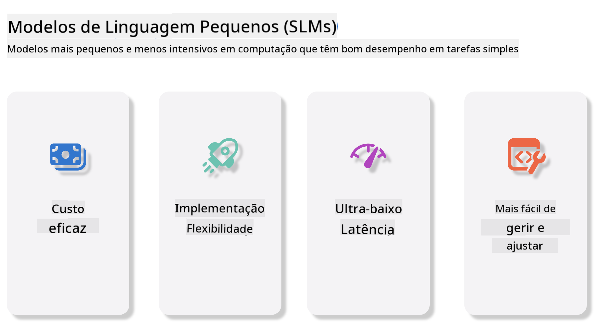
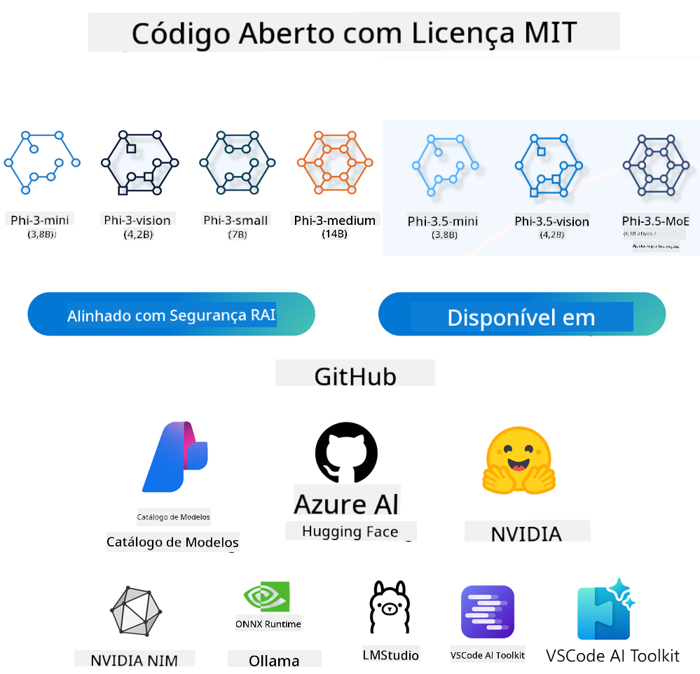
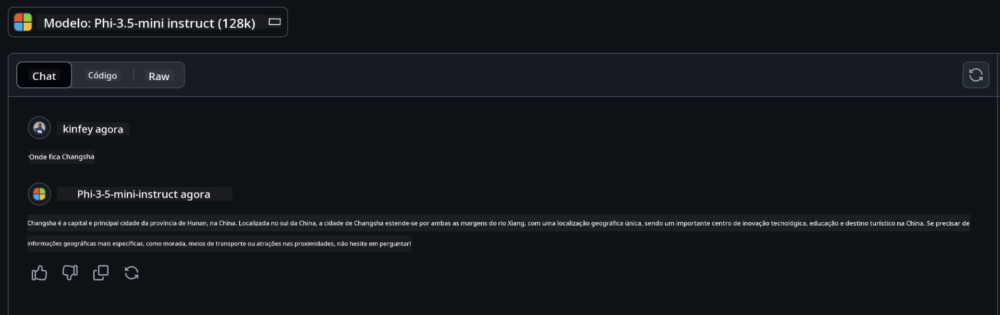

<!--
CO_OP_TRANSLATOR_METADATA:
{
  "original_hash": "124ad36cfe96f74038811b6e2bb93e9d",
  "translation_date": "2025-07-09T18:30:02+00:00",
  "source_file": "19-slm/README.md",
  "language_code": "pt"
}
-->
# Introdução aos Pequenos Modelos de Linguagem para IA Generativa para Iniciantes  
A IA generativa é um campo fascinante da inteligência artificial que se concentra na criação de sistemas capazes de gerar novo conteúdo. Este conteúdo pode variar desde texto e imagens até música e até ambientes virtuais completos. Uma das aplicações mais empolgantes da IA generativa está no domínio dos modelos de linguagem.

## O que são Pequenos Modelos de Linguagem?  

Um Pequeno Modelo de Linguagem (SLM) representa uma variante reduzida de um grande modelo de linguagem (LLM), aproveitando muitos dos princípios arquitetónicos e técnicas dos LLMs, mas com uma pegada computacional significativamente menor.

Os SLMs são um subconjunto de modelos de linguagem projetados para gerar texto semelhante ao humano. Ao contrário dos seus equivalentes maiores, como o GPT-4, os SLMs são mais compactos e eficientes, tornando-os ideais para aplicações onde os recursos computacionais são limitados. Apesar do seu tamanho reduzido, ainda conseguem realizar uma variedade de tarefas. Normalmente, os SLMs são construídos através da compressão ou destilação de LLMs, com o objetivo de manter uma parte substancial da funcionalidade e capacidades linguísticas do modelo original. Esta redução no tamanho do modelo diminui a complexidade geral, tornando os SLMs mais eficientes tanto em termos de uso de memória como de requisitos computacionais. Apesar destas otimizações, os SLMs conseguem realizar uma ampla gama de tarefas de processamento de linguagem natural (NLP):

- Geração de Texto: Criar frases ou parágrafos coerentes e contextualmente relevantes.  
- Completação de Texto: Prever e completar frases com base num prompt dado.  
- Tradução: Converter texto de uma língua para outra.  
- Resumo: Condensar textos longos em resumos mais curtos e fáceis de digerir.  

Embora com algumas concessões em desempenho ou profundidade de compreensão em comparação com os seus equivalentes maiores.

## Como Funcionam os Pequenos Modelos de Linguagem?  
Os SLMs são treinados com grandes quantidades de dados textuais. Durante o treino, aprendem os padrões e estruturas da linguagem, permitindo-lhes gerar texto que é gramaticalmente correto e contextualmente apropriado. O processo de treino envolve:

- Recolha de Dados: Obtenção de grandes conjuntos de dados textuais de várias fontes.  
- Pré-processamento: Limpeza e organização dos dados para os tornar adequados ao treino.  
- Treino: Utilização de algoritmos de aprendizagem automática para ensinar o modelo a compreender e gerar texto.  
- Ajuste Fino: Ajustar o modelo para melhorar o seu desempenho em tarefas específicas.  

O desenvolvimento dos SLMs está alinhado com a crescente necessidade de modelos que possam ser implementados em ambientes com recursos limitados, como dispositivos móveis ou plataformas de edge computing, onde os LLMs completos podem ser impraticáveis devido às suas elevadas exigências de recursos. Ao focar na eficiência, os SLMs equilibram desempenho com acessibilidade, permitindo uma aplicação mais ampla em diversos domínios.



## Objetivos de Aprendizagem  

Nesta lição, esperamos introduzir o conhecimento sobre SLM e combiná-lo com o Microsoft Phi-3 para explorar diferentes cenários em conteúdo textual, visão e MoE.

No final desta lição, deverá ser capaz de responder às seguintes perguntas:

- O que é um SLM  
- Qual a diferença entre SLM e LLM  
- O que é a Família Microsoft Phi-3/3.5  
- Como fazer inferência com a Família Microsoft Phi-3/3.5  

Pronto? Vamos começar.

## As Diferenças entre Grandes Modelos de Linguagem (LLMs) e Pequenos Modelos de Linguagem (SLMs)  

Tanto os LLMs como os SLMs são construídos com base em princípios fundamentais de aprendizagem automática probabilística, seguindo abordagens semelhantes no design arquitetónico, metodologias de treino, processos de geração de dados e técnicas de avaliação de modelos. No entanto, vários fatores-chave distinguem estes dois tipos de modelos.

## Aplicações dos Pequenos Modelos de Linguagem  

Os SLMs têm uma vasta gama de aplicações, incluindo:

- Chatbots: Fornecer suporte ao cliente e interagir com utilizadores de forma conversacional.  
- Criação de Conteúdo: Ajudar escritores a gerar ideias ou até a redigir artigos completos.  
- Educação: Auxiliar estudantes em trabalhos escritos ou na aprendizagem de novas línguas.  
- Acessibilidade: Criar ferramentas para pessoas com deficiências, como sistemas de texto para fala.  

**Tamanho**  

Uma distinção principal entre LLMs e SLMs reside na escala dos modelos. LLMs, como o ChatGPT (GPT-4), podem conter cerca de 1,76 triliões de parâmetros, enquanto SLMs open-source como o Mistral 7B são projetados com significativamente menos parâmetros — aproximadamente 7 mil milhões. Esta disparidade deve-se principalmente às diferenças na arquitetura do modelo e nos processos de treino. Por exemplo, o ChatGPT utiliza um mecanismo de self-attention dentro de uma estrutura encoder-decoder, enquanto o Mistral 7B usa sliding window attention, que permite um treino mais eficiente num modelo apenas decoder. Esta variação arquitetónica tem implicações profundas na complexidade e desempenho destes modelos.

**Compreensão**  

Os SLMs são tipicamente otimizados para desempenho em domínios específicos, tornando-os altamente especializados, mas potencialmente limitados na capacidade de fornecer uma compreensão contextual ampla em múltiplos campos do conhecimento. Em contraste, os LLMs visam simular uma inteligência semelhante à humana a um nível mais abrangente. Treinados com conjuntos de dados vastos e diversificados, os LLMs são projetados para ter bom desempenho em várias áreas, oferecendo maior versatilidade e adaptabilidade. Consequentemente, os LLMs são mais adequados para uma gama mais ampla de tarefas downstream, como processamento de linguagem natural e programação.

**Computação**  

O treino e a implementação dos LLMs são processos que consomem muitos recursos, frequentemente exigindo infraestruturas computacionais significativas, incluindo clusters de GPUs em grande escala. Por exemplo, treinar um modelo como o ChatGPT do zero pode necessitar de milhares de GPUs durante longos períodos. Em contraste, os SLMs, com o seu menor número de parâmetros, são mais acessíveis em termos de recursos computacionais. Modelos como o Mistral 7B podem ser treinados e executados em máquinas locais equipadas com GPUs moderadas, embora o treino ainda exija várias horas em múltiplas GPUs.

**Viés**  

O viés é um problema conhecido nos LLMs, principalmente devido à natureza dos dados de treino. Estes modelos frequentemente dependem de dados brutos e abertos da internet, que podem sub-representar ou representar incorretamente certos grupos, introduzir rotulagem errada ou refletir vieses linguísticos influenciados por dialetos, variações geográficas e regras gramaticais. Além disso, a complexidade das arquiteturas dos LLMs pode inadvertidamente exacerbar o viés, que pode passar despercebido sem um ajuste fino cuidadoso. Por outro lado, os SLMs, treinados em conjuntos de dados mais restritos e específicos de domínio, são inerentemente menos suscetíveis a esses vieses, embora não estejam imunes.

**Inferência**  

O tamanho reduzido dos SLMs oferece-lhes uma vantagem significativa em termos de velocidade de inferência, permitindo gerar resultados de forma eficiente em hardware local sem necessidade de processamento paralelo extensivo. Em contraste, os LLMs, devido ao seu tamanho e complexidade, frequentemente requerem recursos computacionais paralelos substanciais para alcançar tempos de inferência aceitáveis. A presença de múltiplos utilizadores simultâneos ainda pode atrasar os tempos de resposta dos LLMs, especialmente quando implementados em larga escala.

Em resumo, embora ambos os LLMs e SLMs partilhem uma base fundamental em aprendizagem automática, diferem significativamente em termos de tamanho do modelo, requisitos de recursos, compreensão contextual, suscetibilidade a viés e velocidade de inferência. Estas distinções refletem a sua adequação a diferentes casos de uso, com os LLMs a serem mais versáteis mas exigentes em recursos, e os SLMs a oferecerem maior eficiência específica de domínio com menores exigências computacionais.

***Note：Neste capítulo, iremos apresentar os SLMs usando o Microsoft Phi-3 / 3.5 como exemplo.***

## Apresentação da Família Phi-3 / Phi-3.5  

A Família Phi-3 / 3.5 destina-se principalmente a cenários de aplicação em texto, visão e Agente (MoE):

### Phi-3 / 3.5 Instruct  

Principalmente para geração de texto, completamento de chat e extração de informação de conteúdo, entre outros.

**Phi-3-mini**  

O modelo de linguagem de 3.8B está disponível no Microsoft Azure AI Studio, Hugging Face e Ollama. Os modelos Phi-3 superam significativamente modelos de linguagem de tamanho igual ou maior em benchmarks chave (ver números de benchmark abaixo, números mais altos são melhores). O Phi-3-mini supera modelos com o dobro do seu tamanho, enquanto o Phi-3-small e Phi-3-medium superam modelos maiores, incluindo o GPT-3.5.

**Phi-3-small & medium**  

Com apenas 7B parâmetros, o Phi-3-small supera o GPT-3.5T em vários benchmarks de linguagem, raciocínio, programação e matemática.

O Phi-3-medium, com 14B parâmetros, continua esta tendência e supera o Gemini 1.0 Pro.

**Phi-3.5-mini**  

Podemos considerá-lo uma atualização do Phi-3-mini. Embora os parâmetros permaneçam inalterados, melhora a capacidade de suportar múltiplas línguas (Suporta mais de 20 línguas: Árabe, Chinês, Checo, Dinamarquês, Holandês, Inglês, Finlandês, Francês, Alemão, Hebraico, Húngaro, Italiano, Japonês, Coreano, Norueguês, Polaco, Português, Russo, Espanhol, Sueco, Tailandês, Turco, Ucraniano) e adiciona suporte mais forte para contextos longos.

O Phi-3.5-mini, com 3.8B parâmetros, supera modelos de linguagem do mesmo tamanho e está ao nível de modelos com o dobro do seu tamanho.

### Phi-3 / 3.5 Vision  

Podemos pensar no modelo Instruct do Phi-3/3.5 como a capacidade do Phi para compreender, e a Vision é o que dá ao Phi olhos para entender o mundo.

**Phi-3-Vision**  

O Phi-3-vision, com apenas 4.2B parâmetros, continua esta tendência e supera modelos maiores como Claude-3 Haiku e Gemini 1.0 Pro V em tarefas gerais de raciocínio visual, OCR e compreensão de tabelas e diagramas.

**Phi-3.5-Vision**  

O Phi-3.5-Vision é também uma atualização do Phi-3-Vision, adicionando suporte para múltiplas imagens. Pode ser visto como uma melhoria na visão, onde não só se conseguem ver imagens, mas também vídeos.

O Phi-3.5-vision supera modelos maiores como Claude-3.5 Sonnet e Gemini 1.5 Flash em tarefas de OCR, compreensão de tabelas e gráficos, e está ao nível em tarefas gerais de raciocínio visual. Suporta entrada multi-frame, ou seja, realiza raciocínio sobre múltiplas imagens de entrada.

### Phi-3.5-MoE  

***Mixture of Experts (MoE)*** permite que os modelos sejam pré-treinados com muito menos computação, o que significa que pode aumentar dramaticamente o tamanho do modelo ou do conjunto de dados com o mesmo orçamento computacional que um modelo denso. Em particular, um modelo MoE deve alcançar a mesma qualidade que o seu equivalente denso muito mais rapidamente durante o pré-treino.

O Phi-3.5-MoE compreende 16 módulos especialistas de 3.8B cada. O Phi-3.5-MoE, com apenas 6.6B parâmetros ativos, alcança um nível semelhante de raciocínio, compreensão de linguagem e matemática que modelos muito maiores.

Podemos usar o modelo da Família Phi-3/3.5 baseado em diferentes cenários. Ao contrário dos LLMs, pode implementar o Phi-3/3.5-mini ou Phi-3/3.5-Vision em dispositivos edge.

## Como usar os modelos da Família Phi-3/3.5  

Queremos usar o Phi-3/3.5 em diferentes cenários. A seguir, vamos usar o Phi-3/3.5 baseado em diferentes cenários.



### Diferença na inferência com API na Cloud  

**Modelos GitHub**  

Os Modelos GitHub são a forma mais direta. Pode aceder rapidamente ao modelo Phi-3/3.5-Instruct através dos Modelos GitHub. Combinado com o Azure AI Inference SDK / OpenAI SDK, pode aceder à API através de código para completar a chamada Phi-3/3.5-Instruct. Também pode testar diferentes efeitos através do Playground.

- Demo: Comparação dos efeitos do Phi-3-mini e Phi-3.5-mini em cenários em chinês




**Azure AI Studio**  

Ou, se quiser usar os modelos de visão e MoE, pode usar o Azure AI Studio para completar a chamada. Se estiver interessado, pode ler o Phi-3 Cookbook para aprender como chamar Phi-3/3.5 Instruct, Vision, MoE através do Azure AI Studio [Clique neste link](https://github.com/microsoft/Phi-3CookBook/blob/main/md/02.QuickStart/AzureAIStudio_QuickStart.md?WT.mc_id=academic-105485-koreyst)

**NVIDIA NIM**  

Além das soluções baseadas na cloud do Catálogo de Modelos fornecidas pela Azure e GitHub, pode também usar o [NVIDIA NIM](https://developer.nvidia.com/nim?WT.mc_id=academic-105485-koreyst) para completar chamadas relacionadas. Pode visitar o NVIDIA NIM para realizar as chamadas API da Família Phi-3/3.5. O NVIDIA NIM (NVIDIA Inference Microservices) é um conjunto de microserviços de inferência acelerada projetados para ajudar os desenvolvedores a implementar modelos de IA de forma eficiente em vários ambientes, incluindo clouds, centros de dados e estações de trabalho.

Aqui estão algumas características principais do NVIDIA NIM:

- **Facilidade de Implementação:** O NIM permite a implementação de modelos de IA com um único comando, tornando a integração em fluxos de trabalho existentes simples.  
- **Desempenho Otimizado:** Aproveita os motores de inferência pré-otimizados da NVIDIA, como TensorRT e TensorRT-LLM, para garantir baixa latência e alto rendimento.  
- **Escalabilidade:** O NIM suporta autoscaling em Kubernetes, permitindo lidar eficazmente com cargas de trabalho variáveis.
- **Segurança e Controlo:** As organizações podem manter o controlo sobre os seus dados e aplicações ao alojar os microserviços NIM na sua própria infraestrutura gerida.
- **APIs Standard:** O NIM fornece APIs padrão da indústria, facilitando a construção e integração de aplicações de IA como chatbots, assistentes de IA e muito mais.

O NIM faz parte do NVIDIA AI Enterprise, que tem como objetivo simplificar a implementação e operacionalização de modelos de IA, garantindo que funcionem de forma eficiente em GPUs NVIDIA.

- Demo: Utilizar o Nividia NIM para chamar Phi-3.5-Vision-API [[Clique neste link](python/Phi-3-Vision-Nividia-NIM.ipynb)]


### Inferência Phi-3/3.5 em ambiente local
Inferência em relação ao Phi-3, ou qualquer modelo de linguagem como o GPT-3, refere-se ao processo de gerar respostas ou previsões com base na entrada que recebe. Quando fornece um prompt ou pergunta ao Phi-3, este utiliza a sua rede neural treinada para inferir a resposta mais provável e relevante, analisando padrões e relações nos dados em que foi treinado.

**Hugging Face Transformer**  
Hugging Face Transformers é uma biblioteca poderosa concebida para processamento de linguagem natural (NLP) e outras tarefas de machine learning. Aqui estão alguns pontos-chave sobre ela:

1. **Modelos Pré-treinados:** Disponibiliza milhares de modelos pré-treinados que podem ser usados para várias tarefas, como classificação de texto, reconhecimento de entidades nomeadas, resposta a perguntas, sumarização, tradução e geração de texto.

2. **Interoperabilidade entre Frameworks:** A biblioteca suporta múltiplos frameworks de deep learning, incluindo PyTorch, TensorFlow e JAX. Isto permite treinar um modelo num framework e usá-lo noutro.

3. **Capacidades Multimodais:** Para além do NLP, o Hugging Face Transformers suporta tarefas em visão computacional (ex.: classificação de imagens, deteção de objetos) e processamento de áudio (ex.: reconhecimento de voz, classificação de áudio).

4. **Facilidade de Uso:** A biblioteca oferece APIs e ferramentas para descarregar e ajustar modelos facilmente, tornando-a acessível tanto para iniciantes como para especialistas.

5. **Comunidade e Recursos:** O Hugging Face tem uma comunidade ativa e documentação extensa, tutoriais e guias para ajudar os utilizadores a começar e tirar o máximo proveito da biblioteca.  
[documentação oficial](https://huggingface.co/docs/transformers/index?WT.mc_id=academic-105485-koreyst) ou o seu [repositório GitHub](https://github.com/huggingface/transformers?WT.mc_id=academic-105485-koreyst).

Este é o método mais utilizado, mas também requer aceleração por GPU. Afinal, cenários como Vision e MoE exigem muitos cálculos, que ficam muito limitados na CPU se não forem quantizados.


- Demo: Utilizar Transformer para chamar Phi-3.5-Instruct [Clique neste link](python/phi35-instruct-demo.ipynb)

- Demo: Utilizar Transformer para chamar Phi-3.5-Vision [Clique neste link](python/phi35-vision-demo.ipynb)

- Demo: Utilizar Transformer para chamar Phi-3.5-MoE [Clique neste link](python/phi35_moe_demo.ipynb)

**Ollama**  
[Ollama](https://ollama.com/?WT.mc_id=academic-105485-koreyst) é uma plataforma concebida para facilitar a execução de grandes modelos de linguagem (LLMs) localmente no seu computador. Suporta vários modelos como Llama 3.1, Phi 3, Mistral e Gemma 2, entre outros. A plataforma simplifica o processo ao agrupar pesos do modelo, configuração e dados num único pacote, tornando mais acessível para os utilizadores personalizar e criar os seus próprios modelos. O Ollama está disponível para macOS, Linux e Windows. É uma ótima ferramenta se pretende experimentar ou implementar LLMs sem depender de serviços na cloud. Ollama é a forma mais direta, só precisa de executar a seguinte instrução.


```bash

ollama run phi3.5

```


**ONNX Runtime para GenAI**

[ONNX Runtime](https://github.com/microsoft/onnxruntime-genai?WT.mc_id=academic-105485-koreyst) é um acelerador de machine learning para inferência e treino multiplataforma. O ONNX Runtime para Generative AI (GENAI) é uma ferramenta poderosa que ajuda a executar modelos de IA generativa de forma eficiente em várias plataformas.

## O que é o ONNX Runtime?  
O ONNX Runtime é um projeto open-source que permite inferência de alta performance de modelos de machine learning. Suporta modelos no formato Open Neural Network Exchange (ONNX), que é um padrão para representar modelos de machine learning. A inferência com ONNX Runtime pode proporcionar experiências mais rápidas para os clientes e reduzir custos, suportando modelos de frameworks de deep learning como PyTorch e TensorFlow/Keras, bem como bibliotecas clássicas de machine learning como scikit-learn, LightGBM, XGBoost, entre outras. O ONNX Runtime é compatível com diferentes hardwares, drivers e sistemas operativos, e oferece desempenho otimizado ao tirar partido de aceleradores de hardware quando aplicável, juntamente com otimizações e transformações de grafos.

## O que é IA Generativa?  
IA Generativa refere-se a sistemas de IA que conseguem gerar novo conteúdo, como texto, imagens ou música, com base nos dados em que foram treinados. Exemplos incluem modelos de linguagem como GPT-3 e modelos de geração de imagens como Stable Diffusion. A biblioteca ONNX Runtime para GenAI fornece o ciclo de IA generativa para modelos ONNX, incluindo inferência com ONNX Runtime, processamento de logits, pesquisa e amostragem, e gestão de cache KV.

## ONNX Runtime para GENAI  
O ONNX Runtime para GENAI estende as capacidades do ONNX Runtime para suportar modelos de IA generativa. Aqui estão algumas características principais:

- **Suporte Amplo a Plataformas:** Funciona em várias plataformas, incluindo Windows, Linux, macOS, Android e iOS.
- **Suporte a Modelos:** Suporta muitos modelos populares de IA generativa, como LLaMA, GPT-Neo, BLOOM, entre outros.
- **Otimização de Performance:** Inclui otimizações para diferentes aceleradores de hardware como GPUs NVIDIA, GPUs AMD, e mais.
- **Facilidade de Uso:** Fornece APIs para fácil integração em aplicações, permitindo gerar texto, imagens e outros conteúdos com código mínimo.
- Os utilizadores podem chamar um método de alto nível generate(), ou executar cada iteração do modelo num ciclo, gerando um token de cada vez, e opcionalmente atualizando parâmetros de geração dentro do ciclo.
- O ONNX Runtime também suporta pesquisa gulosa/beam search e amostragem TopP, TopK para gerar sequências de tokens e processamento de logits incorporado como penalizações de repetição. Pode também adicionar facilmente pontuações personalizadas.

## Como Começar  
Para começar com o ONNX Runtime para GENAI, pode seguir estes passos:

### Instalar ONNX Runtime:  
```Python
pip install onnxruntime
```  
### Instalar as Extensões de IA Generativa:  
```Python
pip install onnxruntime-genai
```

### Executar um Modelo: Aqui está um exemplo simples em Python:  
```Python
import onnxruntime_genai as og

model = og.Model('path_to_your_model.onnx')

tokenizer = og.Tokenizer(model)

input_text = "Hello, how are you?"

input_tokens = tokenizer.encode(input_text)

output_tokens = model.generate(input_tokens)

output_text = tokenizer.decode(output_tokens)

print(output_text) 
```  
### Demo: Utilizar ONNX Runtime GenAI para chamar Phi-3.5-Vision


```python

import onnxruntime_genai as og

model_path = './Your Phi-3.5-vision-instruct ONNX Path'

img_path = './Your Image Path'

model = og.Model(model_path)

processor = model.create_multimodal_processor()

tokenizer_stream = processor.create_stream()

text = "Your Prompt"

prompt = "<|user|>\n"

prompt += "<|image_1|>\n"

prompt += f"{text}<|end|>\n"

prompt += "<|assistant|>\n"

image = og.Images.open(img_path)

inputs = processor(prompt, images=image)

params = og.GeneratorParams(model)

params.set_inputs(inputs)

params.set_search_options(max_length=3072)

generator = og.Generator(model, params)

while not generator.is_done():

    generator.compute_logits()
    
    generator.generate_next_token()

    new_token = generator.get_next_tokens()[0]
    
    code += tokenizer_stream.decode(new_token)
    
    print(tokenizer_stream.decode(new_token), end='', flush=True)

```


**Outros**

Para além dos métodos de referência ONNX Runtime e Ollama, também podemos completar a referência de modelos quantitativos com base nos métodos de referência fornecidos por diferentes fabricantes. Como o framework Apple MLX com Apple Metal, Qualcomm QNN com NPU, Intel OpenVINO com CPU/GPU, etc. Pode também obter mais conteúdo no [Phi-3 Cookbook](https://github.com/microsoft/phi-3cookbook?WT.mc_id=academic-105485-koreyst)


## Mais

Aprendemos o básico da família Phi-3/3.5, mas para aprender mais sobre SLM precisamos de mais conhecimento. Pode encontrar as respostas no Phi-3 Cookbook. Se quiser saber mais, por favor visite o [Phi-3 Cookbook](https://github.com/microsoft/phi-3cookbook?WT.mc_id=academic-105485-koreyst).

**Aviso Legal**:  
Este documento foi traduzido utilizando o serviço de tradução automática [Co-op Translator](https://github.com/Azure/co-op-translator). Embora nos esforcemos pela precisão, por favor tenha em conta que traduções automáticas podem conter erros ou imprecisões. O documento original na sua língua nativa deve ser considerado a fonte autorizada. Para informações críticas, recomenda-se tradução profissional humana. Não nos responsabilizamos por quaisquer mal-entendidos ou interpretações erradas decorrentes da utilização desta tradução.