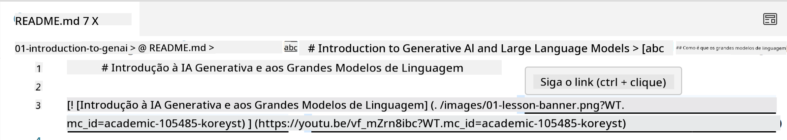
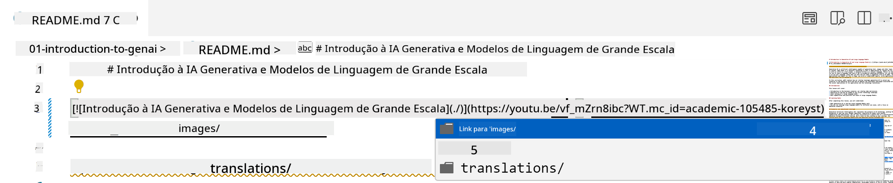
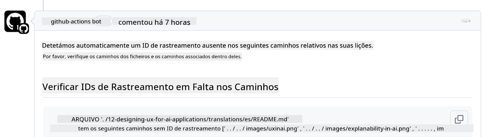
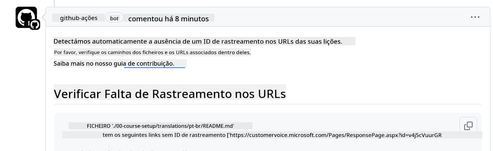
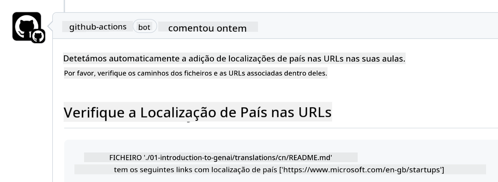

<!--
CO_OP_TRANSLATOR_METADATA:
{
  "original_hash": "57c41f2af71001a2cff9d8eb797cb843",
  "translation_date": "2025-06-25T07:08:00+00:00",
  "source_file": "CONTRIBUTING.md",
  "language_code": "pt"
}
-->
# Contribuir

Este projeto acolhe contribuições e sugestões. A maioria das contribuições requer que concorde com um Acordo de Licença de Contribuidor (CLA) declarando que tem o direito de, e realmente concede-nos os direitos de usar a sua contribuição. Para mais detalhes, visite <https://cla.microsoft.com>.

> Importante: ao traduzir texto neste repositório, por favor, assegure-se de que não usa tradução automática. Vamos verificar as traduções através da comunidade, portanto, só ofereça-se para traduções em idiomas nos quais é proficiente.

Quando submeter um pedido de pull, um CLA-bot determinará automaticamente se precisa fornecer um CLA e decorará o PR apropriadamente (por exemplo, etiqueta, comentário). Simplesmente siga as instruções fornecidas pelo bot. Só precisará de fazer isto uma vez em todos os repositórios que usam o nosso CLA.

## Código de Conduta

Este projeto adotou o [Código de Conduta de Código Aberto da Microsoft](https://opensource.microsoft.com/codeofconduct/?WT.mc_id=academic-105485-koreyst). Para mais informações, leia as [Perguntas Frequentes sobre o Código de Conduta](https://opensource.microsoft.com/codeofconduct/faq/?WT.mc_id=academic-105485-koreyst) ou contacte [opencode@microsoft.com](mailto:opencode@microsoft.com) com quaisquer perguntas ou comentários adicionais.

## Questão ou Problema?

Por favor, não abra problemas no GitHub para questões gerais de suporte, pois a lista do GitHub deve ser usada para pedidos de funcionalidades e relatórios de erros. Desta forma, podemos mais facilmente rastrear problemas reais ou erros do código e manter a discussão geral separada do código real.

## Erros de digitação, Questões, Bugs e contribuições

Sempre que submeter quaisquer alterações ao repositório de IA Generativa para Iniciantes, por favor, siga estas recomendações.

* Sempre faça um fork do repositório para a sua própria conta antes de fazer as suas modificações
* Não combine múltiplas alterações num único pedido de pull. Por exemplo, submeta qualquer correção de bugs e atualizações de documentação usando PRs separados
* Se o seu pedido de pull mostrar conflitos de mesclagem, certifique-se de atualizar o seu main local para ser um espelho do que está no repositório principal antes de fazer as suas modificações
* Se estiver a submeter uma tradução, por favor, crie um PR para todos os ficheiros traduzidos, pois não aceitamos traduções parciais para o conteúdo
* Se estiver a submeter uma correção de erro de digitação ou documentação, pode combinar modificações num único PR onde for adequado

## Orientação Geral para escrita

- Certifique-se de que todos os seus URLs estão entre colchetes seguidos por um parêntese sem espaços extra ao redor ou dentro deles ``.
- Certifique-se de que qualquer link relativo (ou seja, links para outros ficheiros e pastas no repositório) começa com um `./` referindo-se a um ficheiro ou pasta localizado no diretório de trabalho atual ou um `../` referindo-se a um ficheiro ou pasta localizado num diretório de trabalho pai.
- Certifique-se de que qualquer link relativo (ou seja, links para outros ficheiros e pastas no repositório) tem um ID de rastreamento (ou seja, `?` ou `&` então `wt.mc_id=` ou `WT.mc_id=`) no final.
- Certifique-se de que qualquer URL dos seguintes domínios _github.com, microsoft.com, visualstudio.com, aka.ms, e azure.com_ tem um ID de rastreamento (ou seja, `?` ou `&` então `wt.mc_id=` ou `WT.mc_id=`) no final.
- Certifique-se de que os seus links não têm local específico do país neles (ou seja, `/en-us/` ou `/en/`).
- Certifique-se de que todas as imagens estão armazenadas na pasta `./images`.
- Certifique-se de que as imagens têm nomes descritivos usando caracteres em inglês, números e traços no nome da sua imagem.

## Fluxos de Trabalho do GitHub

Quando submeter um pedido de pull, quatro fluxos de trabalho diferentes serão acionados para validar as regras anteriores. Simplesmente siga as instruções listadas aqui para passar as verificações de fluxo de trabalho.

- [Verificar Caminhos Relativos Quebrados](../..)
- [Verificar Caminhos Com Rastreamento](../..)
- [Verificar URLs Com Rastreamento](../..)
- [Verificar URLs Sem Local](../..)

### Verificar Caminhos Relativos Quebrados

Este fluxo de trabalho garante que qualquer caminho relativo nos seus ficheiros está a funcionar. Este repositório é implantado nas páginas do GitHub, então precisa ser muito cuidadoso ao digitar os links que unem tudo para não direcionar ninguém para o lugar errado.

Para garantir que os seus links estão a funcionar corretamente, basta usar o VS Code para verificar isso.

Por exemplo, quando passar o cursor sobre qualquer link nos seus ficheiros, será solicitado a seguir o link pressionando **ctrl + clique**

Se clicar num link e ele não estiver a funcionar localmente, então certamente irá acionar o fluxo de trabalho e não funcionará no GitHub.

Para resolver este problema, tente digitar o link com a ajuda do VS Code.

Quando digitar `./` ou `../` o VS Code irá solicitar que escolha entre as opções disponíveis de acordo com o que digitou.

Siga o caminho clicando no ficheiro ou pasta desejado e terá certeza de que o seu caminho não está quebrado.

Assim que adicionar o caminho relativo correto, guarde e envie as suas alterações, o fluxo de trabalho será acionado novamente para verificar as suas alterações. Se passar na verificação, então está pronto para prosseguir.

### Verificar Caminhos Com Rastreamento

Este fluxo de trabalho garante que qualquer caminho relativo tenha rastreamento nele. Este repositório é implantado nas páginas do GitHub, então precisamos rastrear o movimento entre os diferentes ficheiros e pastas.

Para garantir que os seus caminhos relativos tenham rastreamento, basta verificar o seguinte texto `?wt.mc_id=` no final do caminho. Se estiver anexado aos seus caminhos relativos, então passará nesta verificação.

Caso contrário, pode receber o seguinte erro.

Para resolver este problema, tente abrir o caminho do ficheiro que o fluxo de trabalho destacou e adicione o ID de rastreamento ao final dos caminhos relativos.

Assim que adicionar o ID de rastreamento, guarde e envie as suas alterações, o fluxo de trabalho será acionado novamente para verificar as suas alterações. Se passar na verificação, então está pronto para prosseguir.

### Verificar URLs Com Rastreamento

Este fluxo de trabalho garante que qualquer URL da web tenha rastreamento nele. Este repositório está disponível para todos, então precisa garantir que o acesso seja rastreado para saber de onde vem o tráfego.

Para garantir que os seus URLs tenham rastreamento, basta verificar o seguinte texto `?wt.mc_id=` no final do URL. Se estiver anexado aos seus URLs, então passará nesta verificação.

Caso contrário, pode receber o seguinte erro.

Para resolver este problema, tente abrir o caminho do ficheiro que o fluxo de trabalho destacou e adicione o ID de rastreamento ao final dos URLs.

Assim que adicionar o ID de rastreamento, guarde e envie as suas alterações, o fluxo de trabalho será acionado novamente para verificar as suas alterações. Se passar na verificação, então está pronto para prosseguir.

### Verificar URLs Sem Local

Este fluxo de trabalho garante que qualquer URL da web não tenha local específico do país nele. Este repositório está disponível para todos ao redor do mundo, então precisa garantir que não inclua o local do seu país nos URLs.

Para garantir que os seus URLs não tenham local do país neles, basta verificar o seguinte texto `/en-us/` ou `/en/` ou qualquer outro local de idioma em qualquer parte do URL. Se não estiver presente nos seus URLs, então passará nesta verificação.

Caso contrário, pode receber o seguinte erro.

Para resolver este problema, tente abrir o caminho do ficheiro que o fluxo de trabalho destacou e remova o local do país dos URLs.

Assim que remover o local do país, guarde e envie as suas alterações, o fluxo de trabalho será acionado novamente para verificar as suas alterações. Se passar na verificação, então está pronto para prosseguir.

Parabéns! Entraremos em contacto consigo o mais rápido possível com feedback sobre a sua contribuição.

**Aviso Legal**:  
Este documento foi traduzido utilizando o serviço de tradução por IA [Co-op Translator](https://github.com/Azure/co-op-translator). Embora nos esforcemos pela precisão, esteja ciente de que traduções automáticas podem conter erros ou imprecisões. O documento original na sua língua nativa deve ser considerado a fonte autoritária. Para informações críticas, recomenda-se a tradução profissional por humanos. Não nos responsabilizamos por quaisquer mal-entendidos ou interpretações incorretas resultantes do uso desta tradução.