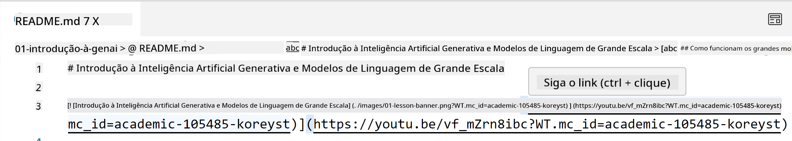
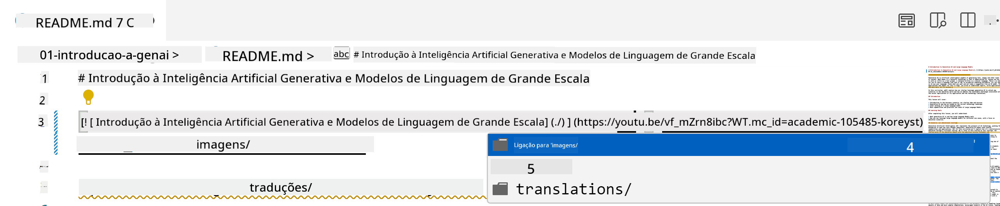
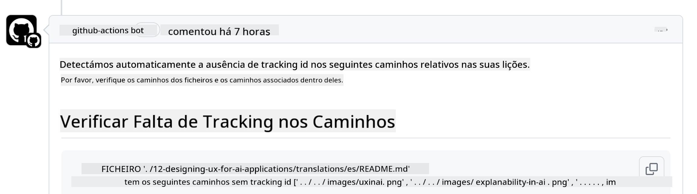
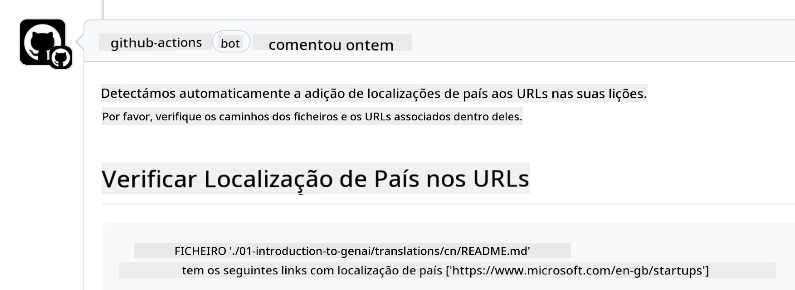

<!--
CO_OP_TRANSLATOR_METADATA:
{
  "original_hash": "57c41f2af71001a2cff9d8eb797cb843",
  "translation_date": "2025-07-09T05:53:44+00:00",
  "source_file": "CONTRIBUTING.md",
  "language_code": "pt"
}
-->
# Contribuir

Este projeto aceita contribuições e sugestões. A maioria das contribuições exige que concorde com um Acordo de Licença de Contribuidor (CLA) declarando que tem o direito, e efetivamente concede, os direitos para usarmos a sua contribuição. Para mais detalhes, visite <https://cla.microsoft.com>.

> Importante: ao traduzir texto neste repositório, por favor, assegure-se de não usar tradução automática. Iremos verificar as traduções através da comunidade, por isso só se voluntarie para traduções em línguas que domine.

Quando submeter um pull request, um bot CLA irá automaticamente determinar se precisa de fornecer um CLA e irá decorar o PR adequadamente (por exemplo, etiqueta, comentário). Basta seguir as instruções fornecidas pelo bot. Só precisará de fazer isto uma vez em todos os repositórios que usam o nosso CLA.

## Código de Conduta

Este projeto adotou o [Microsoft Open Source Code of Conduct](https://opensource.microsoft.com/codeofconduct/?WT.mc_id=academic-105485-koreyst).  
Para mais informações, leia as [Perguntas Frequentes sobre o Código de Conduta](https://opensource.microsoft.com/codeofconduct/faq/?WT.mc_id=academic-105485-koreyst) ou contacte [opencode@microsoft.com](mailto:opencode@microsoft.com) para quaisquer questões ou comentários adicionais.

## Pergunta ou Problema?

Por favor, não abra issues no GitHub para questões gerais de suporte, pois a lista do GitHub deve ser usada para pedidos de funcionalidades e relatórios de bugs. Desta forma, podemos acompanhar mais facilmente problemas ou erros reais no código e manter a discussão geral separada do código propriamente dito.

## Erros, Problemas, Bugs e contribuições

Sempre que submeter alterações ao repositório Generative AI for Beginners, por favor siga estas recomendações.

* Faça sempre um fork do repositório para a sua própria conta antes de fazer as suas modificações  
* Não combine várias alterações num único pull request. Por exemplo, submeta correções de bugs e atualizações de documentação em PRs separados  
* Se o seu pull request apresentar conflitos de merge, certifique-se de atualizar o seu main local para ser um espelho do que está no repositório principal antes de fazer as suas modificações  
* Se estiver a submeter uma tradução, por favor crie um único PR para todos os ficheiros traduzidos, pois não aceitamos traduções parciais do conteúdo  
* Se estiver a submeter uma correção de erro tipográfico ou documentação, pode combinar modificações num único PR quando apropriado

## Orientações Gerais para escrita

- Certifique-se de que todos os seus URLs estão entre colchetes seguidos de parênteses, sem espaços extra à volta ou dentro deles ``.  
- Certifique-se de que qualquer link relativo (ou seja, links para outros ficheiros e pastas no repositório) começa com `./` referindo-se a um ficheiro ou pasta na diretoria atual, ou `../` referindo-se a um ficheiro ou pasta numa diretoria superior.  
- Certifique-se de que qualquer link relativo (ou seja, links para outros ficheiros e pastas no repositório) tem um ID de tracking (ou seja, `?` ou `&` seguido de `wt.mc_id=` ou `WT.mc_id=`) no final.  
- Certifique-se de que qualquer URL dos seguintes domínios _github.com, microsoft.com, visualstudio.com, aka.ms, e azure.com_ tem um ID de tracking (ou seja, `?` ou `&` seguido de `wt.mc_id=` ou `WT.mc_id=`) no final.  
- Certifique-se de que os seus links não contêm localizações específicas de país (ou seja, `/en-us/` ou `/en/`).  
- Certifique-se de que todas as imagens estão guardadas na pasta `./images`.  
- Certifique-se de que as imagens têm nomes descritivos usando caracteres em inglês, números e hífens no nome da imagem.

## Workflows do GitHub

Quando submeter um pull request, quatro workflows diferentes serão acionados para validar as regras anteriores.  
Basta seguir as instruções listadas aqui para passar as verificações dos workflows.

- [Verificar Caminhos Relativos Quebrados](../..)  
- [Verificar Se os Caminhos Têm Tracking](../..)  
- [Verificar Se as URLs Têm Tracking](../..)  
- [Verificar Se as URLs Não Têm Localização](../..)

### Verificar Caminhos Relativos Quebrados

Este workflow garante que qualquer caminho relativo nos seus ficheiros está a funcionar.  
Este repositório é publicado no GitHub pages, por isso precisa de ter muito cuidado ao escrever os links que ligam tudo para não direcionar ninguém para o local errado.

Para garantir que os seus links funcionam corretamente, use o VS Code para verificar isso.

Por exemplo, quando passar o cursor sobre qualquer link nos seus ficheiros, será sugerido que siga o link pressionando **ctrl + clique**

Se clicar num link e ele não funcionar localmente, certamente irá disparar o workflow e não funcionará no GitHub.

Para corrigir este problema, tente escrever o link com a ajuda do VS Code.

Quando escrever `./` ou `../`, o VS Code irá sugerir opções disponíveis de acordo com o que escreveu.

Siga o caminho clicando no ficheiro ou pasta desejada e terá a certeza de que o seu caminho não está quebrado.

Depois de adicionar o caminho relativo correto, guarde e envie as suas alterações; o workflow será acionado novamente para verificar as suas alterações.  
Se passar a verificação, está pronto para continuar.

### Verificar Se os Caminhos Têm Tracking

Este workflow garante que qualquer caminho relativo tem tracking.  
Este repositório é publicado no GitHub pages, por isso precisamos de rastrear o movimento entre os diferentes ficheiros e pastas.

Para garantir que os seus caminhos relativos têm tracking, verifique se o texto `?wt.mc_id=` está no final do caminho.  
Se estiver adicionado aos seus caminhos relativos, passará esta verificação.

Caso contrário, poderá receber o seguinte erro.

Para corrigir este problema, abra o caminho do ficheiro que o workflow indicou e adicione o ID de tracking no final dos caminhos relativos.

Depois de adicionar o ID de tracking, guarde e envie as suas alterações; o workflow será acionado novamente para verificar as suas alterações.  
Se passar a verificação, está pronto para continuar.

### Verificar Se as URLs Têm Tracking

Este workflow garante que qualquer URL web tem tracking.  
Este repositório está disponível para todos, por isso precisa de garantir o tracking para saber de onde vem o tráfego.

Para garantir que as suas URLs têm tracking, verifique se o texto `?wt.mc_id=` está no final da URL.  
Se estiver adicionado às suas URLs, passará esta verificação.

Caso contrário, poderá receber o seguinte erro.

Para corrigir este problema, abra o caminho do ficheiro que o workflow indicou e adicione o ID de tracking no final das URLs.

Depois de adicionar o ID de tracking, guarde e envie as suas alterações; o workflow será acionado novamente para verificar as suas alterações.  
Se passar a verificação, está pronto para continuar.

### Verificar Se as URLs Não Têm Localização

Este workflow garante que qualquer URL web não tem localização específica de país.  
Este repositório está disponível para todos no mundo, por isso precisa de garantir que não inclui a localização do seu país nas URLs.

Para garantir que as suas URLs não têm localização de país, verifique se o texto `/en-us/` ou `/en/` ou qualquer outra localização de idioma não está presente em qualquer parte da URL.  
Se não estiver presente nas suas URLs, passará esta verificação.

Caso contrário, poderá receber o seguinte erro.

Para corrigir este problema, abra o caminho do ficheiro que o workflow indicou e remova a localização do país das URLs.

Depois de remover a localização do país, guarde e envie as suas alterações; o workflow será acionado novamente para verificar as suas alterações.  
Se passar a verificação, está pronto para continuar.

Parabéns! Entraremos em contacto consigo o mais breve possível com feedback sobre a sua contribuição.

**Aviso Legal**:  
Este documento foi traduzido utilizando o serviço de tradução automática [Co-op Translator](https://github.com/Azure/co-op-translator). Embora nos esforcemos para garantir a precisão, por favor tenha em conta que traduções automáticas podem conter erros ou imprecisões. O documento original na sua língua nativa deve ser considerado a fonte autorizada. Para informações críticas, recomenda-se a tradução profissional humana. Não nos responsabilizamos por quaisquer mal-entendidos ou interpretações incorretas decorrentes da utilização desta tradução.