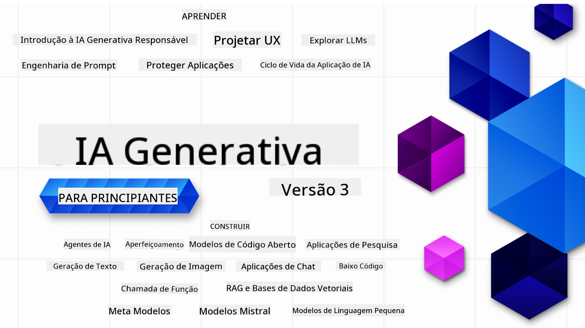

<!--
CO_OP_TRANSLATOR_METADATA:
{
  "original_hash": "c2ee25895ebbfa1a52868bb6eab686fc",
  "translation_date": "2025-05-19T11:40:22+00:00",
  "source_file": "README.md",
  "language_code": "pt"
}
-->

### 21 Lições ensinando tudo que você precisa saber para começar a criar aplicações de IA Generativa

### 🌐 Suporte Multilíngue

#### Suportado via GitHub Action (Automatizado e Sempre Atualizado)
[Francês](../fr/README.md) | [Espanhol](../es/README.md) | [Alemão](../de/README.md) | [Russo](../ru/README.md) | [Árabe](../ar/README.md) | [Persa (Farsi)](../fa/README.md) | [Urdu](../ur/README.md) | [Chinês (Simplificado)](../zh/README.md) | [Chinês (Tradicional, Macau)](../mo/README.md) | [Chinês (Tradicional, Hong Kong)](../hk/README.md) | [Chinês (Tradicional, Taiwan)](../tw/README.md) | [Japonês](../ja/README.md) | [Coreano](../ko/README.md) | [Hindi](../hi/README.md) | [Bengali](../bn/README.md) | [Marathi](../mr/README.md) | [Nepali](../ne/README.md) | [Punjabi (Gurmukhi)](../pa/README.md) | [Português (Portugal)](./README.md) | [Português (Brasil)](../br/README.md) | [Italiano](../it/README.md) | [Polonês](../pl/README.md) | [Turco](../tr/README.md) | [Grego](../el/README.md) | [Tailandês](../th/README.md) | [Sueco](../sv/README.md) | [Dinamarquês](../da/README.md) | [Norueguês](../no/README.md) | [Finlandês](../fi/README.md) | [Holandês](../nl/README.md) | [Hebraico](../he/README.md) | [Vietnamita](../vi/README.md) | [Indonésio](../id/README.md) | [Malaio](../ms/README.md) | [Tagalog (Filipino)](../tl/README.md) | [Swahili](../sw/README.md) | [Húngaro](../hu/README.md) | [Tcheco](../cs/README.md) | [Eslovaco](../sk/README.md) | [Romeno](../ro/README.md) | [Búlgaro](../bg/README.md) | [Sérvio (Cirílico)](../sr/README.md) | [Croata](../hr/README.md) | [Esloveno](../sl/README.md)
# Inteligência Artificial Generativa para Iniciantes (Versão 3) - Um Curso

Aprenda os fundamentos de construção de aplicações de IA Generativa com nosso curso abrangente de 21 lições, oferecido pelos Defensores da Nuvem da Microsoft.

## 🌱 Começando

Este curso tem 21 lições. Cada lição cobre seu próprio tópico, então comece onde preferir!

As lições são rotuladas como lições de "Aprender", que explicam um conceito de IA Generativa, ou lições de "Construir", que explicam um conceito e exemplos de código em **Python** e **TypeScript**, quando possível.

Para desenvolvedores .NET, confira [Inteligência Artificial Generativa para Iniciantes (Edição .NET)](https://github.com/microsoft/Generative-AI-for-beginners-dotnet?WT.mc_id=academic-105485-koreyst)!

Cada lição também inclui uma seção "Continue Aprendendo" com ferramentas adicionais de aprendizado.

## O que você precisa
### Para executar o código deste curso, você pode usar:
 - [Azure OpenAI Service](https://aka.ms/genai-beginners/azure-open-ai?WT.mc_id=academic-105485-koreyst) - **Lições:** "aoai-assignment"
 - [GitHub Marketplace Model Catalog](https://aka.ms/genai-beginners/gh-models?WT.mc_id=academic-105485-koreyst) - **Lições:** "githubmodels"
 - [OpenAI API](https://aka.ms/genai-beginners/open-ai?WT.mc_id=academic-105485-koreyst) - **Lições:** "oai-assignment"

- Conhecimento básico de Python ou TypeScript é útil - \*Para iniciantes absolutos, confira estes cursos de [Python](https://aka.ms/genai-beginners/python?WT.mc_id=academic-105485-koreyst) e [TypeScript](https://aka.ms/genai-beginners/typescript?WT.mc_id=academic-105485-koreyst)
- Uma conta no GitHub para [fazer um fork de todo este repositório](https://aka.ms/genai-beginners/github?WT.mc_id=academic-105485-koreyst) para sua própria conta no GitHub

Criamos uma lição de **[Configuração do Curso](./00-course-setup/README.md?WT.mc_id=academic-105485-koreyst)** para ajudá-lo a configurar seu ambiente de desenvolvimento.

Não se esqueça de [dar uma estrela (🌟) a este repositório](https://docs.github.com/en/get-started/exploring-projects-on-github/saving-repositories-with-stars?WT.mc_id=academic-105485-koreyst) para encontrá-lo mais facilmente depois.

## 🧠 Pronto para Implantar?

Se você está procurando por exemplos de código mais avançados, confira nossa [coleção de Exemplos de Código de IA Generativa](https://aka.ms/genai-beg-code?WT.mc_id=academic-105485-koreyst) em **Python** e **TypeScript**.

## 🗣️ Conheça Outros Aprendizes, Obtenha Suporte

Junte-se ao nosso [servidor oficial no Discord do Azure AI Foundry](https://aka.ms/genai-discord?WT.mc_id=academic-105485-koreyst) para conhecer e se conectar com outros aprendizes que estão fazendo este curso e obter suporte.

Faça perguntas ou compartilhe feedback sobre o produto em nosso [Fórum de Desenvolvedores do Azure AI Foundry](https://aka.ms/azureaifoundry/forum) no Github.

## 🚀 Construindo uma Startup?

Inscreva-se no [Microsoft for Startups Founders Hub](https://aka.ms/genai-foundershub?WT.mc_id=academic-105485-koreyst) para receber **créditos gratuitos do OpenAI** e até **$150k em créditos Azure para acessar modelos OpenAI através dos Serviços Azure OpenAI**.

## 🙏 Quer ajudar?

Você tem sugestões ou encontrou erros de ortografia ou código? [Abra uma issue](https://github.com/microsoft/generative-ai-for-beginners/issues?WT.mc_id=academic-105485-koreyst) ou [Crie um pull request](https://github.com/microsoft/generative-ai-for-beginners/pulls?WT.mc_id=academic-105485-koreyst)

## 📂 Cada lição inclui:

- Uma breve introdução em vídeo ao tópico
- Uma lição escrita localizada no README
- Exemplos de código em Python e TypeScript suportando Azure OpenAI e OpenAI API
- Links para recursos extras para continuar seu aprendizado

## 🗃️ Lições

| #   | **Link da Lição**                                                                                                                              | **Descrição**                                                                                 | **Vídeo**                                                                   | **Aprendizado Extra**                                                             |
| --- | -------------------------------------------------------------------------------------------------------------------------------------------- | ----------------------------------------------------------------------------------------------- | --------------------------------------------------------------------------- | ------------------------------------------------------------------------------ |
| 00  | [Configuração do Curso](./00-course-setup/README.md?WT.mc_id=academic-105485-koreyst)                                                                 | **Aprender:** Como Configurar Seu Ambiente de Desenvolvimento                                            | Vídeo Em Breve                                                                 | [Saiba Mais](https://aka.ms/genai-collection?WT.mc_id=academic-105485-koreyst) |
| 01  | [Introdução à IA Generativa e LLMs](./01-introduction-to-genai/README.md?WT.mc_id=academic-105485-koreyst)                              | **Aprender:** Entendendo o que é IA Generativa e como funcionam os Modelos de Linguagem de Grande Escala (LLMs).       | [Vídeo](https://aka.ms/gen-ai-lesson-1-gh?WT.mc_id=academic-105485-koreyst) | [Saiba Mais](https://aka.ms/genai-collection?WT.mc_id=academic-105485-koreyst) |
| 02  | [Explorando e comparando diferentes LLMs](./02-exploring-and-comparing-different-llms/README.md?WT.mc_id=academic-105485-koreyst)             | **Aprender:** Como selecionar o modelo certo para seu caso de uso                                      | [Vídeo](https://aka.ms/gen-ai-lesson2-gh?WT.mc_id=academic-105485-koreyst)  | [Saiba Mais](https://aka.ms/genai-collection?WT.mc_id=academic-105485-koreyst) |
| 03  | [Usando IA Generativa Responsavelmente](./03-using-generative-ai-responsibly/README.md?WT.mc_id=academic-105485-koreyst)                           | **Aprender:** Como construir aplicações de IA Generativa de forma responsável                                  | [Vídeo](https://aka.ms/gen-ai-lesson3-gh?WT.mc_id=academic-105485-koreyst)  | [Saiba Mais](https://aka.ms/genai-collection?WT.mc_id=academic-105485-koreyst) |
| 04  | [Entendendo os Fundamentos da Engenharia de Prompt](./04-prompt-engineering-fundamentals/README.md?WT.mc_id=academic-105485-koreyst)             | **Aprender:** Práticas recomendadas de Engenharia de Prompt na prática                                           | [Vídeo](https://aka.ms/gen-ai-lesson4-gh?WT.mc_id=academic-105485-koreyst)  | [Saiba Mais](https://aka.ms/genai-collection?WT.mc_id=academic-105485-koreyst) |
| 05  | [Criando Prompts Avançados](./05-advanced-prompts/README.md?WT.mc_id=academic-105485-koreyst)                                                | **Aprenda:** Como aplicar técnicas de engenharia de prompts que melhoram o resultado dos seus prompts. | [Vídeo](https://aka.ms/gen-ai-lesson5-gh?WT.mc_id=academic-105485-koreyst)  | [Saiba Mais](https://aka.ms/genai-collection?WT.mc_id=academic-105485-koreyst) |
| 06  | [Construindo Aplicações de Geração de Texto](./06-text-generation-apps/README.md?WT.mc_id=academic-105485-koreyst)                                | **Construa:** Um aplicativo de geração de texto usando Azure OpenAI / OpenAI API                                | [Vídeo](https://aka.ms/gen-ai-lesson6-gh?WT.mc_id=academic-105485-koreyst)  | [Saiba Mais](https://aka.ms/genai-collection?WT.mc_id=academic-105485-koreyst) |
| 07  | [Construindo Aplicações de Chat](./07-building-chat-applications/README.md?WT.mc_id=academic-105485-koreyst)                                     | **Construa:** Técnicas para construir e integrar eficientemente aplicações de chat.               | [Vídeo](https://aka.ms/gen-ai-lessons7-gh?WT.mc_id=academic-105485-koreyst) | [Saiba Mais](https://aka.ms/genai-collection?WT.mc_id=academic-105485-koreyst) |
| 08  | [Construindo Aplicativos de Busca com Bancos de Dados Vetoriais](./08-building-search-applications/README.md?WT.mc_id=academic-105485-koreyst)                        | **Construa:** Um aplicativo de busca que usa Embeddings para pesquisar dados.                        | [Vídeo](https://aka.ms/gen-ai-lesson8-gh?WT.mc_id=academic-105485-koreyst)  | [Saiba Mais](https://aka.ms/genai-collection?WT.mc_id=academic-105485-koreyst) |
| 09  | [Construindo Aplicações de Geração de Imagem](./09-building-image-applications/README.md?WT.mc_id=academic-105485-koreyst)                        | **Construa:** Um aplicativo de geração de imagem                                                       | [Vídeo](https://aka.ms/gen-ai-lesson9-gh?WT.mc_id=academic-105485-koreyst)  | [Saiba Mais](https://aka.ms/genai-collection?WT.mc_id=academic-105485-koreyst) |
| 10  | [Construindo Aplicações de IA com Baixo Código](./10-building-low-code-ai-applications/README.md?WT.mc_id=academic-105485-koreyst)                       | **Construa:** Um aplicativo de IA Generativa usando ferramentas de Baixo Código                                     | [Vídeo](https://aka.ms/gen-ai-lesson10-gh?WT.mc_id=academic-105485-koreyst) | [Saiba Mais](https://aka.ms/genai-collection?WT.mc_id=academic-105485-koreyst) |
| 11  | [Integrando Aplicações Externas com Chamadas de Função](./11-integrating-with-function-calling/README.md?WT.mc_id=academic-105485-koreyst) | **Construa:** O que é chamada de função e seus casos de uso para aplicações                          | [Vídeo](https://aka.ms/gen-ai-lesson11-gh?WT.mc_id=academic-105485-koreyst) | [Saiba Mais](https://aka.ms/genai-collection?WT.mc_id=academic-105485-koreyst) |
| 12  | [Desenhando UX para Aplicações de IA](./12-designing-ux-for-ai-applications/README.md?WT.mc_id=academic-105485-koreyst)                         | **Aprenda:** Como aplicar princípios de design UX ao desenvolver Aplicações de IA Generativa         | [Vídeo](https://aka.ms/gen-ai-lesson12-gh?WT.mc_id=academic-105485-koreyst) | [Saiba Mais](https://aka.ms/genai-collection?WT.mc_id=academic-105485-koreyst) |
| 13  | [Protegendo Suas Aplicações de IA Generativa](./13-securing-ai-applications/README.md?WT.mc_id=academic-105485-koreyst)                         | **Aprenda:** As ameaças e riscos para sistemas de IA e métodos para proteger esses sistemas.             | [Vídeo](https://aka.ms/gen-ai-lesson13-gh?WT.mc_id=academic-105485-koreyst) | [Saiba Mais](https://aka.ms/genai-collection?WT.mc_id=academic-105485-koreyst) |
| 14  | [O Ciclo de Vida das Aplicações de IA Generativa](./14-the-generative-ai-application-lifecycle/README.md?WT.mc_id=academic-105485-koreyst)           | **Aprenda:** As ferramentas e métricas para gerenciar o Ciclo de Vida de LLM e LLMOps                         | [Vídeo](https://aka.ms/gen-ai-lesson14-gh?WT.mc_id=academic-105485-koreyst) | [Saiba Mais](https://aka.ms/genai-collection?WT.mc_id=academic-105485-koreyst) |
| 15  | [Geração Aumentada por Recuperação (RAG) e Bancos de Dados Vetoriais](./15-rag-and-vector-databases/README.md?WT.mc_id=academic-105485-koreyst)        | **Construir:** Um aplicativo usando um Framework RAG para recuperar embeddings de um Banco de Dados Vetorial  | [Vídeo](https://aka.ms/gen-ai-lesson15-gh?WT.mc_id=academic-105485-koreyst) | [Saiba Mais](https://aka.ms/genai-collection?WT.mc_id=academic-105485-koreyst) |
| 16  | [Modelos Open Source e Hugging Face](./16-open-source-models/README.md?WT.mc_id=academic-105485-koreyst)                                    | **Construir:** Um aplicativo usando modelos open source disponíveis no Hugging Face                    | [Vídeo](https://aka.ms/gen-ai-lesson16-gh?WT.mc_id=academic-105485-koreyst) | [Saiba Mais](https://aka.ms/genai-collection?WT.mc_id=academic-105485-koreyst) |
| 17  | [Agentes de IA](./17-ai-agents/README.md?WT.mc_id=academic-105485-koreyst)                                                                       | **Construir:** Um aplicativo usando um Framework de Agente de IA                                           | [Vídeo](https://aka.ms/gen-ai-lesson17-gh?WT.mc_id=academic-105485-koreyst) | [Saiba Mais](https://aka.ms/genai-collection?WT.mc_id=academic-105485-koreyst) |
| 18  | [Ajuste Fino de LLMs](./18-fine-tuning/README.md?WT.mc_id=academic-105485-koreyst)                                                              | **Aprender:** O quê, por quê e como do ajuste fino de LLMs                                            | [Vídeo](https://aka.ms/gen-ai-lesson18-gh?WT.mc_id=academic-105485-koreyst) | [Saiba Mais](https://aka.ms/genai-collection?WT.mc_id=academic-105485-koreyst) |
| 19  | [Construindo com SLMs](./19-slm/README.md?WT.mc_id=academic-105485-koreyst)                                                              | **Aprender:** Os benefícios de construir com Modelos de Linguagem Pequenos                                            | Vídeo em Breve | [Saiba Mais](https://aka.ms/genai-collection?WT.mc_id=academic-105485-koreyst) |
| 20  | [Construindo com Modelos Mistral](./20-mistral/README.md?WT.mc_id=academic-105485-koreyst)                                                              | **Aprender:** As características e diferenças dos Modelos da Família Mistral                                           | Vídeo em Breve | [Saiba Mais](https://aka.ms/genai-collection?WT.mc_id=academic-105485-koreyst) |
| 21  | [Construindo com Modelos Meta](./21-meta/README.md?WT.mc_id=academic-105485-koreyst)                                                              | **Aprender:** As características e diferenças dos Modelos da Família Meta                                           | Vídeo em Breve | [Saiba Mais](https://aka.ms/genai-collection?WT.mc_id=academic-105485-koreyst) |

### 🌟 Agradecimentos especiais

Agradecimentos especiais a [**John Aziz**](https://www.linkedin.com/in/john0isaac/) por criar todas as Ações e fluxos de trabalho do GitHub

[**Bernhard Merkle**](https://www.linkedin.com/in/bernhard-merkle-738b73/) por fazer contribuições chave em cada lição para melhorar a experiência do aluno e do código.

## 🎒 Outros Cursos

Nossa equipe produz outros cursos! Confira:

- [**NOVO** Agentes de IA para Iniciantes](https://github.com/microsoft/ai-agents-for-beginners?WT.mc_id=academic-105485-koreyst)
- [**NOVO** IA Generativa para Iniciantes usando .NET](https://github.com/microsoft/Generative-AI-for-beginners-dotnet?WT.mc_id=academic-105485-koreyst)
- [**NOVO** IA Generativa para Iniciantes usando JavaScript](https://aka.ms/genai-js-course?WT.mc_id=academic-105485-koreyst)
- [ML para Iniciantes](https://aka.ms/ml-beginners?WT.mc_id=academic-105485-koreyst)
- [Ciência de Dados para Iniciantes](https://aka.ms/datascience-beginners?WT.mc_id=academic-105485-koreyst)
- [IA para Iniciantes](https://aka.ms/ai-beginners?WT.mc_id=academic-105485-koreyst)
- [Cibersegurança para Iniciantes](https://github.com/microsoft/Security-101??WT.mc_id=academic-96948-sayoung)
- [Desenvolvimento Web para Iniciantes](https://aka.ms/webdev-beginners?WT.mc_id=academic-105485-koreyst)
- [IoT para Iniciantes](https://aka.ms/iot-beginners?WT.mc_id=academic-105485-koreyst)
- [Desenvolvimento XR para Iniciantes](https://github.com/microsoft/xr-development-for-beginners?WT.mc_id=academic-105485-koreyst)
- [Dominando o GitHub Copilot para Programação em Par AI](https://aka.ms/GitHubCopilotAI?WT.mc_id=academic-105485-koreyst)
- [Dominando o GitHub Copilot para Desenvolvedores C#/.NET](https://github.com/microsoft/mastering-github-copilot-for-dotnet-csharp-developers?WT.mc_id=academic-105485-koreyst)
- [Escolha Sua Própria Aventura Copilot](https://github.com/microsoft/CopilotAdventures?WT.mc_id=academic-105485-koreyst)

**Aviso Legal**:  
Este documento foi traduzido usando o serviço de tradução por IA [Co-op Translator](https://github.com/Azure/co-op-translator). Embora nos esforcemos para garantir a precisão, esteja ciente de que traduções automatizadas podem conter erros ou imprecisões. O documento original em seu idioma nativo deve ser considerado a fonte autorizada. Para informações críticas, recomenda-se uma tradução profissional feita por humanos. Não nos responsabilizamos por quaisquer mal-entendidos ou interpretações errôneas decorrentes do uso desta tradução.