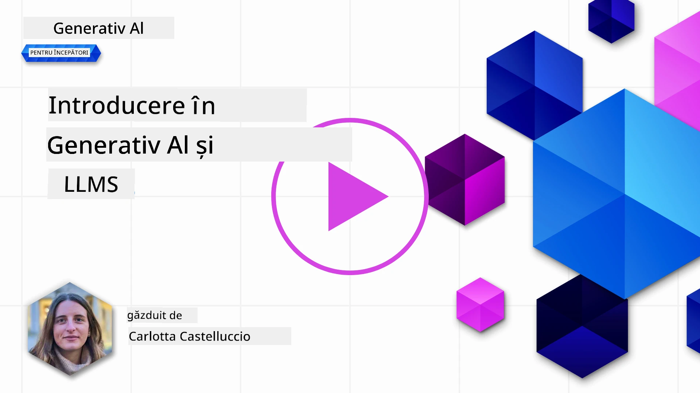
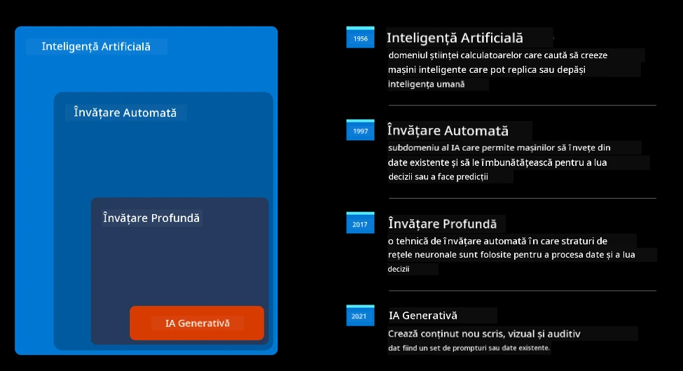
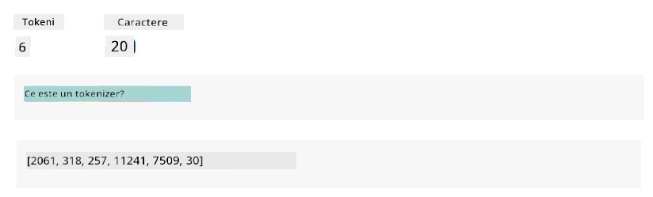
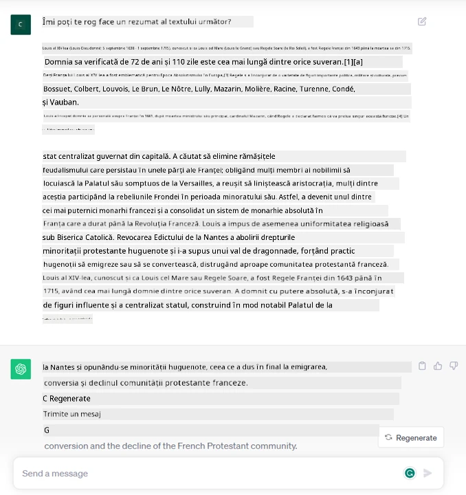
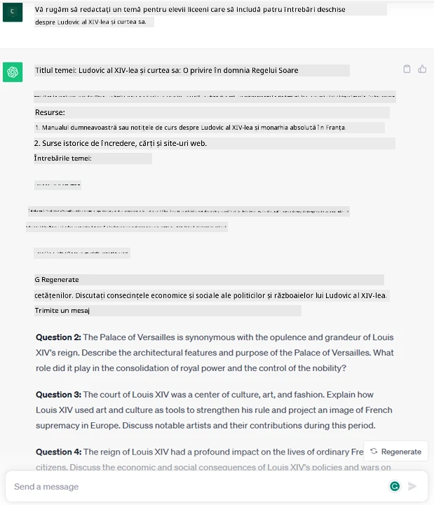
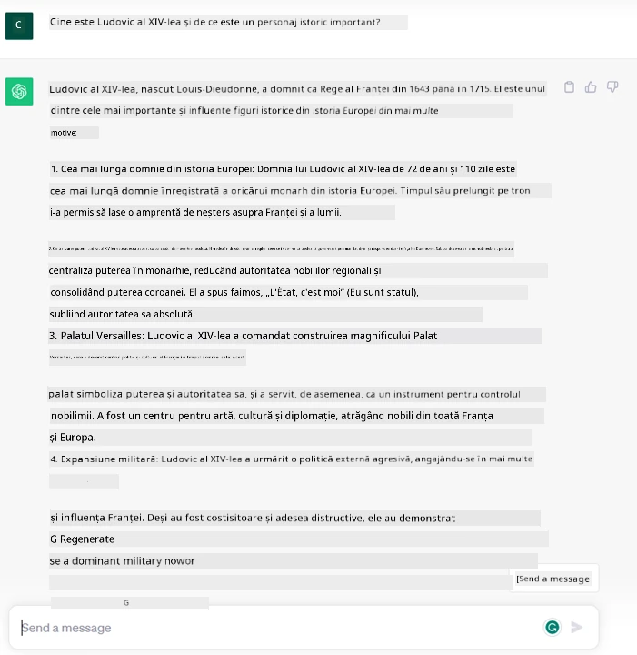
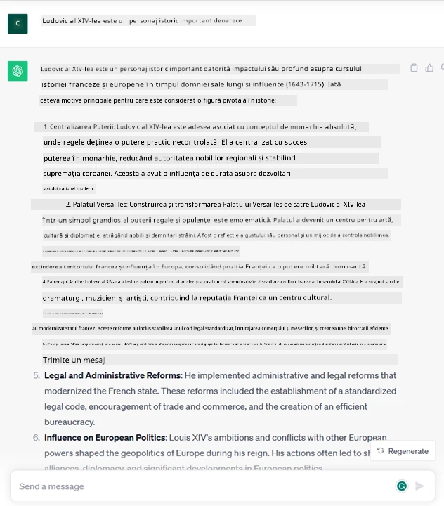
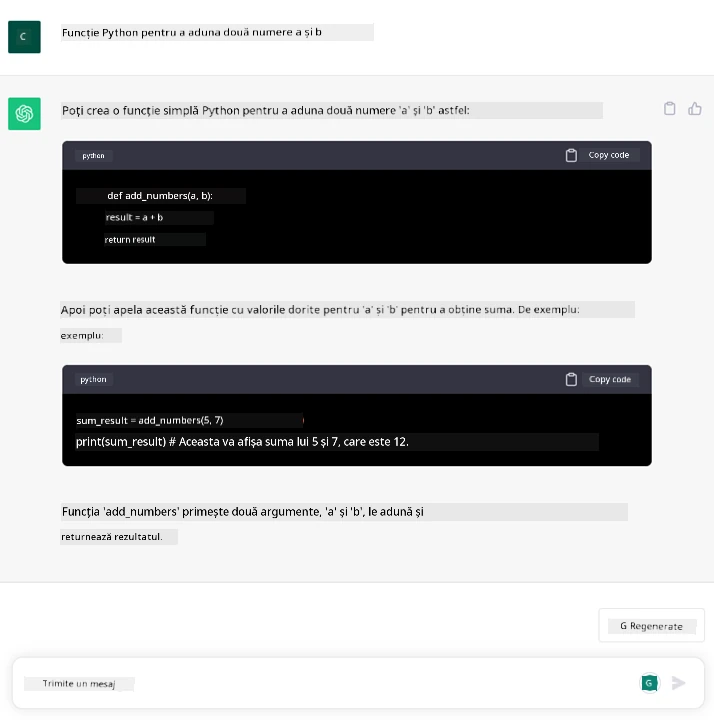

# Introducere în AI Generativ și Modele Mari de Limbaj

_(Faceți click pe imaginea de mai sus pentru a viziona videoclipul lecției)_

AI generativ este inteligență artificială capabilă să genereze text, imagini și alte tipuri de conținut. Ceea ce o face o tehnologie fantastică este că democratizează AI, oricine o poate folosi cu un simplu prompt text, o propoziție scrisă într-o limbă naturală. Nu este nevoie să înveți un limbaj precum Java sau SQL pentru a realiza ceva de valoare, tot ce trebuie să faci este să folosești limba ta, să spui ceea ce dorești și iese o sugestie de la un model de AI. Aplicațiile și impactul acestuia sunt enorme, scrii sau înțelegi rapoarte, scrii aplicații și multe altele, toate în câteva secunde.

În acest curriculum, vom explora cum startup-ul nostru folosește AI generativ pentru a debloca noi scenarii în lumea educației și cum abordăm inevitabilele provocări asociate implicațiilor sociale ale aplicării sale și limitărilor tehnologice.

## Introducere

Această lecție va acoperi:

- Introducerea în scenariul de afaceri: ideea și misiunea startup-ului nostru.
- AI generativ și cum am ajuns la peisajul tehnologic actual.
- Modul de funcționare internă al unui model mare de limbaj.
- Principalele capabilități și cazuri practice de utilizare ale Modelor Mari de Limbaj.

## Obiective de învățare

După ce vei parcurge această lecție, vei înțelege:

- Ce este AI generativ și cum funcționează Modelele Mari de Limbaj.
- Cum poți valorifica modelele mari de limbaj pentru diferite cazuri de utilizare, cu accent pe scenarii educaționale.

## Scenariu: startup-ul nostru educațional

Inteligența Artificială Generativă reprezintă apogeul tehnologiei AI, împingând limitele a ceea ce odată părea imposibil. Modelele AI generative au câteva capabilități și aplicații, dar pentru acest curriculum vom explora cum revoluționează educația printr-un startup fictiv. Ne vom referi la acest startup ca _startup-ul nostru_. Startup-ul nostru activează în domeniul educației cu o misiune ambițioasă:

> _îmbunătățirea accesibilității în învățare, la scară globală, asigurând acces echitabil la educație și oferind experiențe de învățare personalizate fiecărui elev, conform nevoilor sale_.

Echipa startup-ului nostru este conștientă că nu va putea atinge acest obiectiv fără a folosi unul dintre cele mai puternice instrumente ale vremurilor moderne – Modelele Mari de Limbaj (LLMs).

AI generativ este așteptat să revoluționeze modul în care învățăm și predăm astăzi, cu studenți având la dispoziție profesori virtuali 24 de ore pe zi care oferă cantități vaste de informații și exemple, iar profesorii pot valorifica instrumente inovatoare pentru a-și evalua studenții și a oferi feedback.

Pentru început, să definim câteva concepte și terminologii de bază pe care le vom folosi pe parcursul curriculumului.

## Cum am ajuns la AI generativ?

În ciuda hype-ului extraordinar creat recent de anunțul modelelor AI generative, această tehnologie este în dezvoltare de zeci de ani, cu primele eforturi de cercetare datând din anii ’60. Suntem acum într-un punct în care AI are capacități cognitive umane, precum conversația, așa cum demonstrează, de exemplu, [OpenAI ChatGPT](https://openai.com/chatgpt) sau [Microsoft Copilot](https://copilot.microsoft.com/?WT.mc_id=academic-105485-koreyst), care utilizează de asemenea un model GPT pentru experiența sa de căutare conversațională web.

Privind înapoi, primele prototipuri de AI au constat în chatbot-uri tipărite, bazate pe o bază de cunoștințe extrasă de la un grup de experți și reprezentate într-un calculator. Răspunsurile din baza de cunoștințe erau declanșate de cuvinte-cheie apărute în textul de intrare.
Totuși, curând a devenit clar că o astfel de abordare, folosind chatbot-uri tipărite, nu avea o scalabilitate bună.

### O abordare statistică a AI: Învățarea Automată

Un punct de cotitură a sosit în anii ’90, odată cu aplicarea unei abordări statistice în analiza textului. Aceasta a condus la dezvoltarea unor noi algoritmi – cunoscuți sub numele de învățare automată – capabili să învețe tipare din date fără a fi programați explicit. Această abordare permite mașinilor să simuleze înțelegerea limbajului uman: un model statistic este antrenat pe perechi de text și etichete, permițând modelului să clasifice un text necunoscut cu o etichetă prestabilită, reprezentând intenția mesajului.

### Rețele neuronale și asistenți virtuali moderni

În ultimii ani, evoluția tehnologică a hardware-ului, capabil să proceseze cantități mai mari de date și calcule mai complexe, a încurajat cercetarea în AI, conducând la dezvoltarea algoritmilor avansați de învățare automată cunoscuți sub numele de rețele neuronale sau algoritmi de învățare profundă.

Rețelele neuronale (în special Rețelele Neuronale Recurente – RNN) au îmbunătățit semnificativ procesarea limbajului natural, permițând reprezentarea semnificației unui text într-un mod mai relevant, valorizând contextul unui cuvânt într-o propoziție.

Aceasta este tehnologia care a alimentat asistenții virtuali născuți în primul deceniu al noului secol, foarte pricepuți în a interpreta limbajul uman, a identifica o nevoie și a face o acțiune pentru a o satisface – precum răspunsuri cu un script predefinit sau consumarea unui serviciu terț.

### Prezent, AI generativ

Așa am ajuns la AI generativ astăzi, care poate fi văzut ca un subset al învățării profunde.

După decenii de cercetare în domeniul AI, o nouă arhitectură de model – numită _Transformer_ – a depășit limitele RNN-urilor, fiind capabilă să preia secvențe mult mai lungi de text ca intrare. Transformer-ele se bazează pe mecanismul de atenție, permițând modelului să acorde greutăți diferite intrărilor primite, „acordând mai multă atenție” acolo unde este concentrată cea mai relevantă informație, indiferent de ordinea lor în secvența de text.

Majoritatea modelelor recente de AI generativ – cunoscute și ca Modele Mari de Limbaj (LLM), deoarece lucrează cu intrări și ieșiri textuale – se bazează pe această arhitectură. Ceea ce este interesant la aceste modele – antrenate pe o cantitate uriașă de date neetichetate din surse diverse precum cărți, articole și site-uri web – este că ele pot fi adaptate unei game largi de sarcini și pot genera text gramatical corect cu o semblanță de creativitate. Deci, nu doar că au îmbunătățit incredibil capacitatea unei mașini de a „înțelege” un text de intrare, dar au făcut posibilă generarea unui răspuns original în limbaj uman.

## Cum funcționează modelele mari de limbaj?

În capitolul următor vom explora diferite tipuri de modele AI generative, dar pentru început să vedem cum funcționează modelele mari de limbaj, cu accent pe modelele OpenAI GPT (Generative Pre-trained Transformer).

- **Tokenizer, text în numere**: Modelele Mari de Limbaj primesc un text ca intrare și generează un text ca ieșire. Totuși, fiind modele statistice, acestea funcționează mult mai bine cu numere decât cu secvențe de text. De aceea fiecare intrare către model este procesată de un tokenizer, înainte de a fi folosită de modelul central. Un token este o bucată de text – alcătuită dintr-un număr variabil de caractere, deci sarcina principală a tokenizer-ului este să spargă intrarea într-un array de tokeni. Apoi, fiecărui token îi este asociat un index de token, care este codarea întreagă a bucății originale de text.

- **Prezicerea tokenilor de ieșire**: Având n tokeni ca intrare (cu un max n variind de la un model la altul), modelul este capabil să prezică un token ca ieșire. Acest token este apoi încorporat în intrarea următoarei iterații, într-un model de fereastră extinsă, permițând o experiență mai bună utilizatorului de a primi una (sau mai multe) propoziție ca răspuns. Acesta este motivul pentru care, dacă te-ai jucat vreodată cu ChatGPT, ai observat că uneori pare că se oprește în mijlocul unei propoziții.

- **Procesul de selecție, distribuția probabilității**: Tokenul de ieșire este ales de model conform probabilității sale de a apărea după secvența curentă de text. Acest lucru se datorează faptului că modelul prezice o distribuție de probabilitate peste toți „tokenii următori” posibili, calculați pe baza antrenamentului său. Totuși, nu întotdeauna este alegerea tokenul cu cea mai mare probabilitate din distribuția rezultată. Se adaugă un grad de aleatoriu la această alegere, astfel încât modelul acționează într-un mod nedeterminist - nu obținem exact același răspuns pentru aceeași intrare. Acest grad de aleatoriu este adăugat pentru a simula procesul de gândire creativă și poate fi ajustat folosind un parametru al modelului numit temperature.

## Cum poate startup-ul nostru valorifica Modelele Mari de Limbaj?

Acum că avem o înțelegere mai bună a funcționării interne a unui model mare de limbaj, să vedem câteva exemple practice ale celor mai comune sarcini pe care le pot realiza foarte bine, cu un ochi la scenariul nostru de afaceri.
Am spus că principala capacitate a unui Model Mare de Limbaj este _generarea unui text de la zero, pornind de la un input textual, scris în limbaj natural_.

Dar ce fel de input și output textual?
Intrarea unui model mare de limbaj este cunoscută ca prompt, iar ieșirea ca completion, termen care se referă la mecanismul modelului de generare a următorului token pentru a completa inputul curent. Vom aprofunda ce este un prompt și cum să-l proiectăm pentru a obține maximul de la modelul nostru. Dar, pentru moment, să spunem că un prompt poate include:

- O **instrucțiune** care specifică tipul de output pe care îl așteptăm de la model. Această instrucțiune uneori poate include niște exemple sau date adiționale.

  1. Rezumatul unui articol, carte, recenzii de produse și altele, împreună cu extragerea de insight-uri din date ne-structurate.
    
    
  
  2. Idei creative și proiectarea unui articol, eseu, temă sau altele.
      
     

- O **întrebare**, pusă sub forma unei conversații cu un agent.
  
  

- O bucată de **text de completat**, ceea ce implicit este o cerere de asistență la scris.
  
  

- O bucată de **cod** împreună cu cererea de explicare și documentare a sa, sau un comentariu prin care se cere generarea unui cod care să îndeplinească o anumită sarcină.
  
  

Exemplele de mai sus sunt destul de simple și nu au intenția de a fi o demonstrație exhaustivă a capabilităților Modelor Mari de Limbaj. Ele sunt menite să arate potențialul folosirii AI generative, în mod particular, dar nu limitat la contexte educaționale.

De asemenea, output-ul unui model AI generativ nu este perfect și uneori creativitatea modelului poate lucra împotriva sa, rezultând un output care este o combinație de cuvinte pe care utilizatorul uman o poate interpreta ca o mistificare a realității sau poate fi ofensiv. AI generativ nu este inteligent – cel puțin în definiția mai cuprinzătoare a inteligenței, incluzând raționamentul critic și creativ sau inteligența emoțională; nu este determinist și nu este demn de încredere, deoarece fabricații, precum referințe eronate, conținut și afirmații, pot fi combinate cu informații corecte și prezentate într-un mod convingător și sigur pe sine. În lecțiile următoare, vom aborda toate aceste limitări și vom vedea ce putem face pentru a le atenua.

## Temă

Tema ta este să citești mai multe despre [AI generativ](https://en.wikipedia.org/wiki/Generative_artificial_intelligence?WT.mc_id=academic-105485-koreyst) și să încerci să identifici un domeniu în care ai adăuga AI generativ astăzi care încă nu îl are. Cum ar fi diferit impactul față de metoda „veche”, poți face ceva ce nu puteai înainte, sau ești mai rapid? Scrie un rezumat de 300 de cuvinte despre cum ar arăta visul tău de startup AI și include titluri precum „Problema”, „Cum aș folosi AI”, „Impact” și opțional un plan de afaceri.

Dacă ai făcut această temă, ai putea fi chiar pregătit să aplici la incubatorul Microsoft, [Microsoft for Startups Founders Hub](https://www.microsoft.com/startups?WT.mc_id=academic-105485-koreyst) oferim credite atât pentru Azure, OpenAI, mentorat și multe altele, verifică-l!

## Verificare cunoștințe

Ce este adevărat despre modelele mari de limbaj?

1. Primești același răspuns exact de fiecare dată.
1. Face lucrurile perfect, foarte bun la adunarea numerelor, produce cod funcțional etc.
1. Răspunsul poate varia chiar dacă folosești același prompt. Este foarte bun și la a-ți oferi un prim draft al ceva, fie text sau cod. Dar trebuie să îmbunătățești rezultatele.

A: 3, un LLM este nedeterminist, răspunsul variază, totuși poți controla variația sa prin setarea temperature. De asemenea, nu ar trebui să te aștepți să facă lucrurile perfect, este aici să facă muncă grea pentru tine, ceea ce înseamnă adesea că obții o primă încercare bună la ceva ce trebuie să îmbunătățești treptat.

## Bravo! Continuă Călătoria

După ce ai terminat această lecție, verifică colecția noastră [Generative AI Learning](https://aka.ms/genai-collection?WT.mc_id=academic-105485-koreyst) pentru a continua să-ți crești cunoștințele despre AI Generativ!

Accesează lecția 2 unde vom analiza cum să [explorăm și să comparăm diferite tipuri de LLM](../02-exploring-and-comparing-different-llms/README.md?WT.mc_id=academic-105485-koreyst)!

---

<!-- CO-OP TRANSLATOR DISCLAIMER START -->
**Declinare a responsabilității**:
Acest document a fost tradus folosind serviciul de traducere AI [Co-op Translator](https://github.com/Azure/co-op-translator). În timp ce ne străduim pentru acuratețe, vă rugăm să rețineți că traducerile automate pot conține erori sau inexactități. Documentul original în limba sa nativă trebuie considerat sursa autorizată. Pentru informații critice, se recomandă traducerea profesională realizată de un om. Nu ne asumăm responsabilitatea pentru eventualele neînțelegeri sau interpretări greșite care decurg din utilizarea acestei traduceri.
<!-- CO-OP TRANSLATOR DISCLAIMER END -->