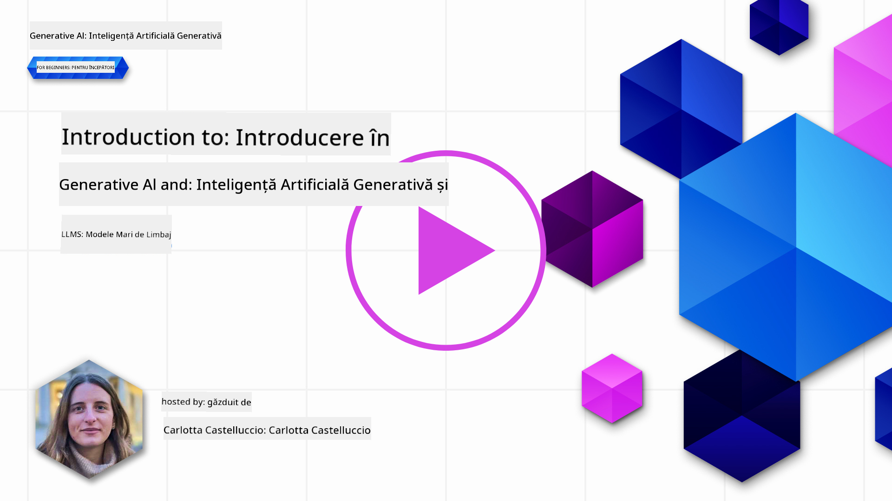
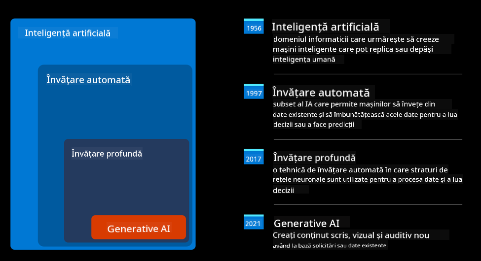
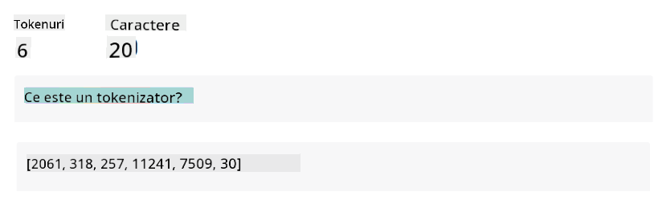
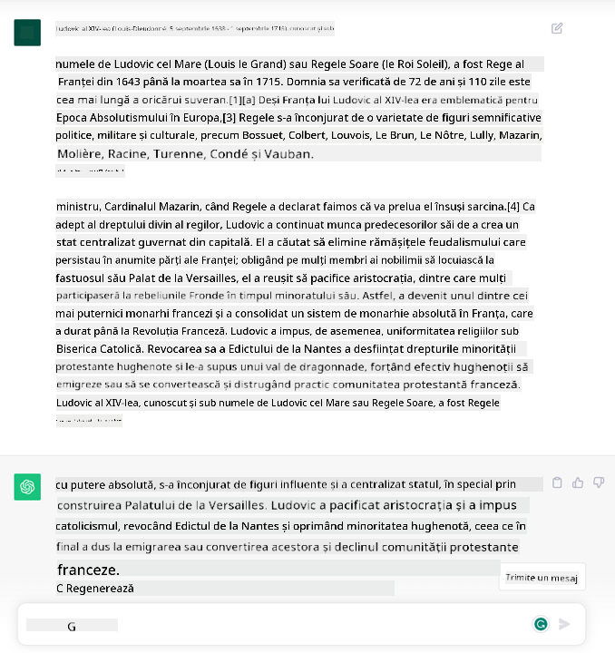
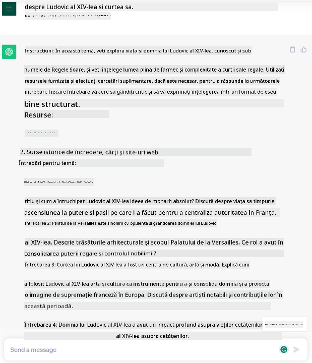
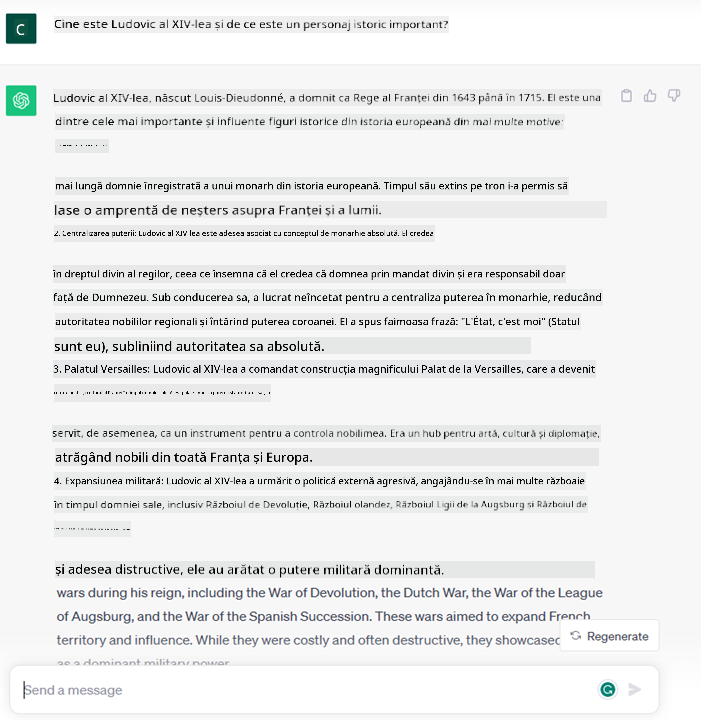
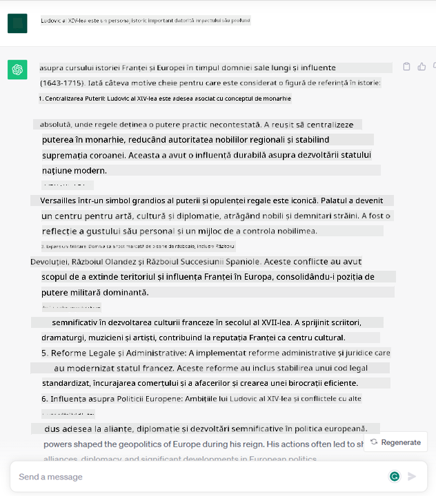
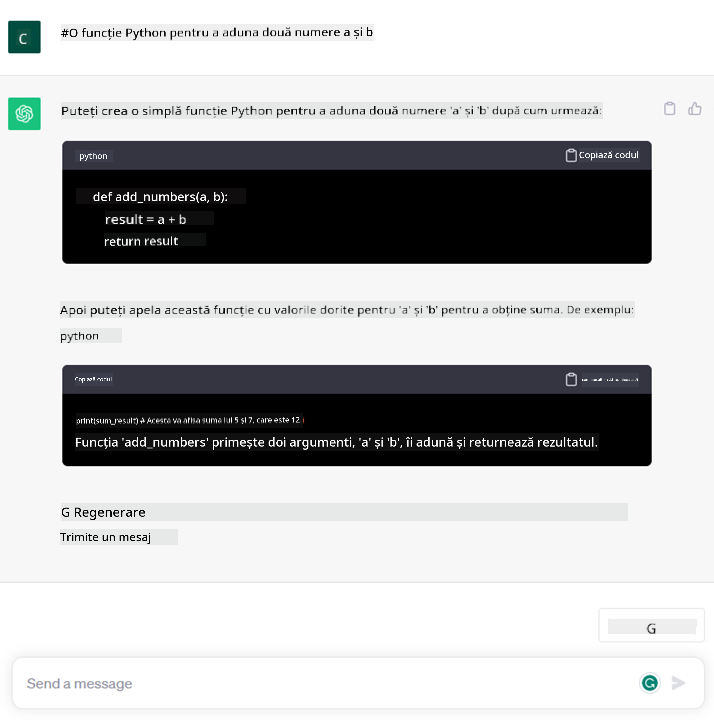

<!--
CO_OP_TRANSLATOR_METADATA:
{
  "original_hash": "f53ba0fa49164f9323043f1c6b11f2b1",
  "translation_date": "2025-06-25T10:06:20+00:00",
  "source_file": "01-introduction-to-genai/README.md",
  "language_code": "ro"
}
-->
# Introducere în AI Generativ și Modele de Limbaj Extinse

_(Click pe imaginea de mai sus pentru a viziona videoclipul acestei lecții)_

AI generativ este inteligența artificială capabilă să genereze text, imagini și alte tipuri de conținut. Ceea ce o face o tehnologie fantastică este că democratizează AI, oricine o poate folosi doar cu un prompt de text, o propoziție scrisă în limbaj natural. Nu este nevoie să înveți o limbă ca Java sau SQL pentru a realiza ceva valoros, tot ce trebuie să faci este să folosești limba ta, să spui ce vrei și vine o sugestie de la un model AI. Aplicațiile și impactul pentru aceasta sunt uriașe, scrii sau înțelegi rapoarte, scrii aplicații și multe altele, totul în câteva secunde.

În acest curriculum, vom explora cum startup-ul nostru utilizează AI generativ pentru a deschide noi scenarii în lumea educației și cum abordăm provocările inevitabile asociate cu implicațiile sociale ale aplicării sale și limitările tehnologice.

## Introducere

Această lecție va acoperi:

- Introducerea în scenariul de afaceri: ideea și misiunea startup-ului nostru.
- AI generativ și cum am ajuns la peisajul tehnologic actual.
- Funcționarea internă a unui model de limbaj extins.
- Principalele capacități și cazuri de utilizare practică ale Modelelor de Limbaj Extinse.

## Obiective de Învățare

După finalizarea acestei lecții, vei înțelege:

- Ce este AI generativ și cum funcționează Modelele de Limbaj Extinse.
- Cum poți valorifica modelele de limbaj extinse pentru diferite cazuri de utilizare, cu accent pe scenarii educaționale.

## Scenariu: startup-ul nostru educațional

Inteligența Artificială Generativă (AI) reprezintă vârful tehnologiei AI, împingând limitele a ceea ce odată era considerat imposibil. Modelele AI generative au mai multe capacități și aplicații, dar pentru acest curriculum vom explora cum revoluționează educația printr-un startup fictiv. Vom referi la acest startup ca _startup-ul nostru_. Startup-ul nostru lucrează în domeniul educației cu declarația de misiune ambițioasă de

> _îmbunătățirea accesibilității în învățare, la nivel global, asigurând acces echitabil la educație și oferind experiențe de învățare personalizate fiecărui elev, conform nevoilor lor_.

Echipa startup-ului nostru este conștientă că nu vom putea atinge acest obiectiv fără a valorifica unul dintre cele mai puternice instrumente ale timpurilor moderne – Modelele de Limbaj Extinse (LLMs).

Se așteaptă ca AI generativ să revoluționeze modul în care învățăm și predăm astăzi, cu studenți având la dispoziție profesori virtuali 24 de ore pe zi care oferă cantități mari de informații și exemple, și profesori capabili să utilizeze instrumente inovatoare pentru a evalua studenții și a oferi feedback.

Pentru început, să definim câteva concepte și terminologii de bază pe care le vom folosi pe parcursul curriculumului.

## Cum am obținut AI Generativ?

În ciuda _hype_-ului extraordinar creat recent de anunțul modelelor AI generative, această tehnologie este în dezvoltare de decenii, cu primele eforturi de cercetare datând din anii '60. Suntem acum la un punct în care AI are capacități cognitive umane, cum ar fi conversația, așa cum este demonstrat, de exemplu, de [OpenAI ChatGPT](https://openai.com/chatgpt) sau [Bing Chat](https://www.microsoft.com/edge/features/bing-chat?WT.mc_id=academic-105485-koreyst), care utilizează și un model GPT pentru conversațiile de căutare pe web Bing.

Să ne întoarcem puțin, primele prototipuri de AI au constat în chatbots scrise, bazându-se pe o bază de cunoștințe extrasă de la un grup de experți și reprezentată într-un computer. Răspunsurile din baza de cunoștințe erau declanșate de cuvinte cheie care apăreau în textul de intrare.
Cu toate acestea, a devenit curând evident că o astfel de abordare, folosind chatbots scrise, nu se scala bine.

### O abordare statistică a AI: Învățarea Automată

Un punct de cotitură a sosit în timpul anilor '90, cu aplicarea unei abordări statistice la analiza textului. Acest lucru a dus la dezvoltarea de noi algoritmi – cunoscuți sub numele de învățare automată – capabili să învețe modele din date fără a fi explicit programați. Această abordare permite mașinilor să simuleze înțelegerea limbajului uman: un model statistic este antrenat pe perechi de text-etichete, permițând modelului să clasifice textul de intrare necunoscut cu o etichetă predefinită care reprezintă intenția mesajului.

### Rețele neuronale și asistenții virtuali moderni

În ultimii ani, evoluția tehnologică a hardware-ului, capabil să gestioneze cantități mai mari de date și calcule mai complexe, a încurajat cercetarea în AI, ducând la dezvoltarea de algoritmi avansați de învățare automată cunoscuți sub numele de rețele neuronale sau algoritmi de învățare profundă.

Rețelele neuronale (și în special Rețelele Neuronale Recursivă – RNNs) au îmbunătățit semnificativ procesarea limbajului natural, permițând reprezentarea sensului textului într-un mod mai semnificativ, valorificând contextul unui cuvânt într-o propoziție.

Aceasta este tehnologia care a alimentat asistenții virtuali născuți în primul deceniu al noului secol, foarte competenți în interpretarea limbajului uman, identificând o nevoie și executând o acțiune pentru a o satisface – cum ar fi răspunsul cu un script predefinit sau consumul unui serviciu terț.

### Ziua de azi, AI Generativ

Așa am ajuns la AI Generativ astăzi, care poate fi văzut ca un subset al învățării profunde.

După decenii de cercetare în domeniul AI, o nouă arhitectură de model – numită _Transformer_ – a depășit limitele RNNs, fiind capabilă să primească secvențe mult mai lungi de text ca intrare. Transformerele se bazează pe mecanismul de atenție, permițând modelului să acorde greutăți diferite intrărilor pe care le primește, 'acordând mai multă atenție' unde informația cea mai relevantă este concentrată, indiferent de ordinea lor în secvența de text.

Majoritatea modelelor recente de AI generativ – cunoscute și sub numele de Modele de Limbaj Extinse (LLMs), deoarece lucrează cu intrări și ieșiri textuale – sunt într-adevăr bazate pe această arhitectură. Ceea ce este interesant despre aceste modele – antrenate pe o cantitate enormă de date nelabelate din surse diverse precum cărți, articole și site-uri web – este că pot fi adaptate la o varietate largă de sarcini și generează text gramatical corect cu o aparență de creativitate. Așadar, nu doar că au îmbunătățit incredibil capacitatea unei mașini de a 'înțelege' un text de intrare, dar au permis capacitatea de a genera un răspuns original în limbaj uman.

## Cum funcționează modelele de limbaj extinse?

În capitolul următor vom explora diferite tipuri de modele AI generative, dar pentru acum să vedem cum funcționează modelele de limbaj extinse, cu accent pe modelele OpenAI GPT (Generative Pre-trained Transformer).

- **Tokenizer, text la numere**: Modelele de Limbaj Extinse primesc un text ca intrare și generează un text ca ieșire. Totuși, fiind modele statistice, lucrează mult mai bine cu numere decât cu secvențe de text. De aceea, fiecare intrare în model este procesată de un tokenizer, înainte de a fi utilizată de modelul de bază. Un token este un fragment de text – constând dintr-un număr variabil de caractere, așa că sarcina principală a tokenizerului este să împartă intrarea într-un șir de tokeni. Apoi, fiecare token este mapat cu un index de token, care este codificarea întregă a fragmentului original de text.

- **Predicția tokenilor de ieșire**: Având n tokeni ca intrare (cu max n variind de la un model la altul), modelul este capabil să prezică un token ca ieșire. Acest token este apoi încorporat în intrarea iterației următoare, într-un model de fereastră extinsă, permițând o experiență mai bună utilizatorului de a primi una (sau mai multe) propoziții ca răspuns. Acest lucru explică de ce, dacă ai jucat vreodată cu ChatGPT, ai observat că uneori pare să se oprească la mijlocul unei propoziții.

- **Procesul de selecție, distribuția probabilităților**: Tokenul de ieșire este ales de model conform probabilității sale de a apărea după secvența de text curentă. Acest lucru se datorează faptului că modelul prezice o distribuție de probabilitate asupra tuturor 'următorilor tokeni' posibili, calculată pe baza antrenamentului său. Totuși, nu întotdeauna tokenul cu cea mai mare probabilitate este ales din distribuția rezultată. Un grad de aleatorie este adăugat acestei alegeri, în așa fel încât modelul să acționeze într-un mod non-determinist - nu primim exact aceeași ieșire pentru aceeași intrare. Acest grad de aleatorie este adăugat pentru a simula procesul de gândire creativă și poate fi ajustat folosind un parametru de model numit temperatură.

## Cum poate startup-ul nostru să valorifice Modelele de Limbaj Extinse?

Acum că avem o mai bună înțelegere a funcționării interne a unui model de limbaj extins, să vedem câteva exemple practice ale celor mai comune sarcini pe care le pot realiza destul de bine, cu un ochi către scenariul nostru de afaceri.
Am spus că principala capacitate a unui Model de Limbaj Extins este _generarea unui text de la zero, pornind de la o intrare textuală, scrisă în limbaj natural_.

Dar ce fel de intrare și ieșire textuală?
Intrarea unui model de limbaj extins este cunoscută ca un prompt, în timp ce ieșirea este cunoscută ca o completare, termen care se referă la mecanismul modelului de a genera următorul token pentru a completa intrarea curentă. Vom aprofunda ceea ce este un prompt și cum să-l proiectăm într-un mod care să obținem maximum de la modelul nostru. Dar pentru acum, să spunem doar că un prompt poate include:

- O **instrucțiune** specificând tipul de ieșire pe care o așteptăm de la model. Această instrucțiune poate include uneori exemple sau date suplimentare.

  1. Rezumarea unui articol, carte, recenzii de produse și altele, împreună cu extragerea de informații din date nestructurate.
    
    
  
  2. Idei creative și designul unui articol, eseu, temă sau mai mult.
      
     

- O **întrebare**, adresată sub forma unei conversații cu un agent.
  
  

- Un fragment de **text de completat**, care implicit este o cerere de asistență la scriere.
  
  

- Un fragment de **cod** împreună cu cererea de a-l explica și documenta, sau un comentariu care solicită generarea unei bucăți de cod care îndeplinește o sarcină specifică.
  
  

Exemplele de mai sus sunt destul de simple și nu sunt menite să fie o demonstrație exhaustivă a capacităților Modelelor de Limbaj Extinse. Ele sunt menite să arate potențialul utilizării AI generative, în special dar nu limitat la contextul educațional.

De asemenea, ieșirea unui model AI generativ nu este perfectă și uneori creativitatea modelului poate lucra împotriva sa, rezultând într-o ieșire care este o combinație de cuvinte pe care utilizatorul uman le poate interpreta ca o mistificare a realității, sau poate fi ofensivă. AI generativ nu este inteligent - cel puțin în definiția mai cuprinzătoare a inteligenței, incluzând raționamentul critic și creativ sau inteligența emoțională; nu este determinist și nu este de încredere, deoarece fabricările, cum ar fi referințele eronate, conținutul și afirmațiile, pot fi combinate cu informații corecte și prezentate într-o manieră persuasivă și încrezătoare. În lecțiile următoare, vom aborda toate aceste limitări și vom vedea ce putem face pentru a le atenua.

## Temă

Temă ta este să citești mai mult despre [AI generativ](https://en.wikipedia.org/wiki/Generative_artificial_intelligence?WT.mc_id=academic-105485-koreyst) și să încerci să identifici un domeniu în care ai adăuga AI generativ astăzi care nu îl are. Cum ar fi impactul diferit de a face lucrurile "în modul vechi", poți face ceva ce nu puteai înainte, sau ești mai rapid? Scrie un rezumat de 300 de cuvinte despre cum ar arăta startup-ul tău de vis cu AI și include titluri precum "Problemă", "Cum aș folosi AI", "Impact" și opțional un plan de afaceri.

Dacă ai făcut această sarcină, s-ar putea să fii chiar pregătit să aplici la incubatorul Microsoft, [Microsoft pentru Startups Founders Hub](https://www.microsoft.com/startups?WT.mc_id=academic-105485-koreyst) oferim credite pentru Azure, OpenAI, mentorat și multe altele, verifică-l!

## Verificare cunoștințe

Ce este adevărat despre modelele de limbaj extinse?

1. Primești exact același răspuns de fiecare dată.
1. Face lucrurile perfect, excelent la adunarea numerelor, producerea de cod funcțional etc.
1. Răspunsul poate varia, în ciuda utilizării aceluiași prompt. Este, de asemenea, excelent la oferirea unui prim draft al ceva, fie text sau cod. Dar trebuie să îmbunătățești rezultatele.

A: 3, un LLM este non-determinist, răspunsul variază, totuși, poți controla variația sa printr-o setare de temperatură. De asemenea, nu ar trebui să te aștepți să facă lucrurile perfect, este aici pentru a face munca grea pentru tine, ceea ce înseamnă adesea că obții o primă încercare bună la ceva pe care trebuie să o îmbunătățești treptat.

## Felicitări! Continuă călătoria

După ce ai completat această lecție, verifică colecția noastră de [Învățare AI Generativă](https://aka.ms/genai-collection?WT.mc_id=academic-105485-koreyst) pentru a continua să îți dezvolți cunoștințele despre AI Generativ!

Mergi la Lecția 2 unde vom explora cum să [explorăm și să comparăm diferite tipuri de LLM](../02-exploring-and-comparing-different-llms/README.md?WT.mc_id=academic-105485-koreyst)!

**Declinarea responsabilității**:  
Acest document a fost tradus folosind serviciul de traducere AI [Co-op Translator](https://github.com/Azure/co-op-translator). Deși ne străduim să asigurăm acuratețea, vă rugăm să fiți conștienți de faptul că traducerile automate pot conține erori sau inexactități. Documentul original în limba sa maternă ar trebui considerat sursa autoritară. Pentru informații critice, se recomandă traducerea umană profesională. Nu suntem responsabili pentru neînțelegeri sau interpretări greșite care pot apărea din utilizarea acestei traduceri.