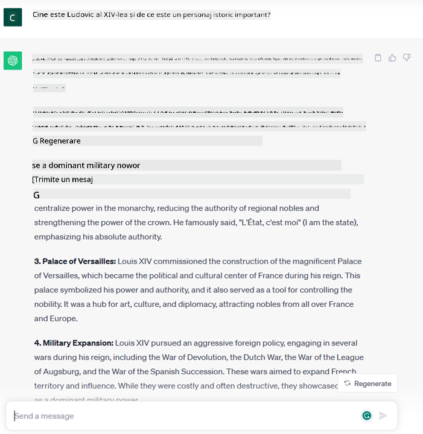
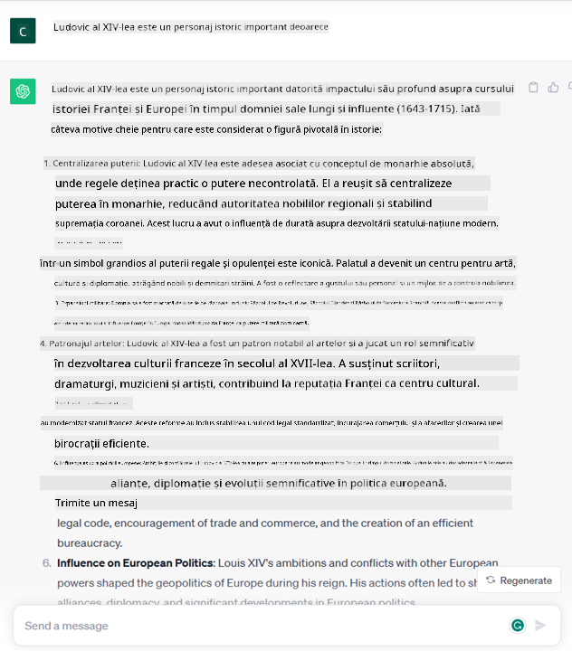
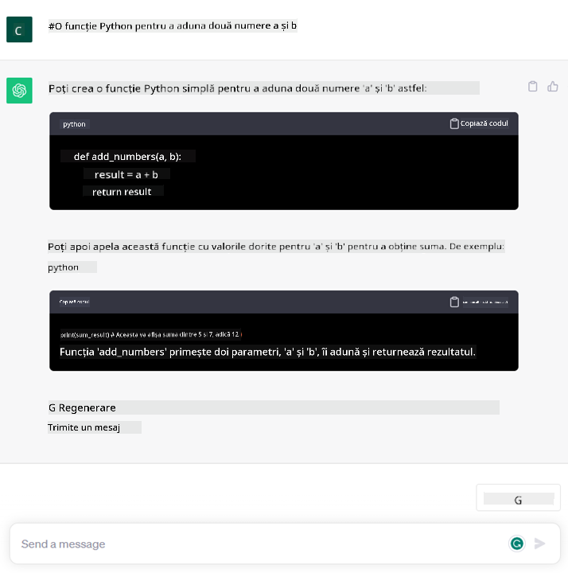

<!--
CO_OP_TRANSLATOR_METADATA:
{
  "original_hash": "f53ba0fa49164f9323043f1c6b11f2b1",
  "translation_date": "2025-07-09T08:01:56+00:00",
  "source_file": "01-introduction-to-genai/README.md",
  "language_code": "ro"
}
-->
# Introducere în AI Generativ și Modelele Mari de Limbaj

_(Click pe imaginea de mai sus pentru a viziona videoclipul acestei lecții)_

AI generativ este inteligența artificială capabilă să genereze text, imagini și alte tipuri de conținut. Ceea ce o face o tehnologie extraordinară este faptul că democratizează AI-ul, oricine o poate folosi cu un simplu prompt text, o propoziție scrisă într-o limbă naturală. Nu este nevoie să înveți un limbaj precum Java sau SQL pentru a realiza ceva valoros, tot ce trebuie să faci este să folosești limba ta, să spui ce vrei și primești o sugestie de la un model AI. Aplicațiile și impactul sunt enorme: scrii sau înțelegi rapoarte, redactezi aplicații și multe altele, toate în câteva secunde.

În acest curriculum, vom explora cum startup-ul nostru folosește AI generativ pentru a deschide noi scenarii în domeniul educației și cum abordăm provocările inevitabile legate de implicațiile sociale ale aplicării sale și limitările tehnologice.

## Introducere

Această lecție va acoperi:

- Introducerea scenariului de afaceri: ideea și misiunea startup-ului nostru.
- AI generativ și cum am ajuns la peisajul tehnologic actual.
- Modul de funcționare internă a unui model mare de limbaj.
- Capacitățile principale și cazurile practice de utilizare ale modelelor mari de limbaj.

## Obiective de învățare

După finalizarea acestei lecții, vei înțelege:

- Ce este AI generativ și cum funcționează Modelele Mari de Limbaj.
- Cum poți folosi modelele mari de limbaj pentru diferite cazuri de utilizare, cu accent pe scenarii educaționale.

## Scenariul: startup-ul nostru educațional

Inteligența Artificială Generativă (AI) reprezintă vârful tehnologiei AI, împingând limitele a ceea ce odată părea imposibil. Modelele AI generative au numeroase capacități și aplicații, dar în acest curriculum vom explora cum revoluționează educația printr-un startup fictiv. Vom numi acest startup _startup-ul nostru_. Startup-ul nostru activează în domeniul educației, având o misiune ambițioasă:

> _îmbunătățirea accesibilității în învățare, la nivel global, asigurând acces echitabil la educație și oferind experiențe de învățare personalizate fiecărui elev, în funcție de nevoile sale_.

Echipa startup-ului nostru este conștientă că nu va putea atinge acest obiectiv fără să folosească unul dintre cele mai puternice instrumente ale vremurilor moderne – Modelele Mari de Limbaj (LLM-uri).

AI generativ este așteptat să revoluționeze modul în care învățăm și predăm astăzi, cu studenți care au la dispoziție profesori virtuali 24 de ore din 24, care oferă cantități vaste de informații și exemple, iar profesorii pot folosi instrumente inovatoare pentru a-și evalua elevii și a oferi feedback.

Pentru început, să definim câteva concepte și termeni de bază pe care îi vom folosi pe tot parcursul curriculumului.

## Cum am ajuns la AI Generativ?

În ciuda entuziasmului extraordinar creat recent de anunțul modelelor AI generative, această tehnologie se dezvoltă de decenii, primele eforturi de cercetare datând din anii ’60. Acum am ajuns într-un punct în care AI are capacități cognitive umane, cum ar fi conversația, așa cum demonstrează, de exemplu, [OpenAI ChatGPT](https://openai.com/chatgpt) sau [Bing Chat](https://www.microsoft.com/edge/features/bing-chat?WT.mc_id=academic-105485-koreyst), care folosește un model GPT pentru conversațiile de căutare web Bing.

Privind puțin înapoi, primele prototipuri de AI erau chatbot-uri scrise manual, bazate pe o bază de cunoștințe extrasă de la un grup de experți și reprezentată într-un calculator. Răspunsurile din baza de cunoștințe erau declanșate de cuvinte-cheie apărute în textul introdus. Totuși, a devenit rapid clar că o astfel de abordare, folosind chatbot-uri scrise manual, nu se scala bine.

### O abordare statistică a AI: Machine Learning

Un punct de cotitură a venit în anii ’90, odată cu aplicarea unei abordări statistice în analiza textului. Aceasta a condus la dezvoltarea unor noi algoritmi – cunoscuți ca machine learning – capabili să învețe tipare din date fără a fi programați explicit. Această abordare permite mașinilor să simuleze înțelegerea limbajului uman: un model statistic este antrenat pe perechi text-etichete, permițând modelului să clasifice un text necunoscut cu o etichetă predefinită care reprezintă intenția mesajului.

### Rețele neuronale și asistenți virtuali moderni

În ultimii ani, evoluția tehnologică a hardware-ului, capabil să gestioneze cantități mai mari de date și calcule mai complexe, a încurajat cercetarea în AI, conducând la dezvoltarea unor algoritmi avansați de machine learning cunoscuți ca rețele neuronale sau algoritmi de deep learning.

Rețelele neuronale (în special Recurrent Neural Networks – RNN-uri) au îmbunătățit semnificativ procesarea limbajului natural, permițând reprezentarea sensului textului într-un mod mai relevant, valorificând contextul unui cuvânt într-o propoziție.

Aceasta este tehnologia care a stat la baza asistenților virtuali apărută în primul deceniu al noului secol, foarte pricepuți în interpretarea limbajului uman, identificarea unei nevoi și efectuarea unei acțiuni pentru a o satisface – cum ar fi răspunsul cu un script predefinit sau consumarea unui serviciu terț.

### Prezent, AI Generativ

Așa am ajuns la AI Generativ de astăzi, care poate fi văzut ca o subcategorie a deep learning-ului.

După decenii de cercetare în domeniul AI, o nouă arhitectură de model – numită _Transformer_ – a depășit limitele RNN-urilor, fiind capabilă să primească secvențe mult mai lungi de text ca input. Transformer-ele se bazează pe mecanismul de atenție, care permite modelului să acorde greutăți diferite intrărilor primite, „acordând mai multă atenție” acolo unde se concentrează cele mai relevante informații, indiferent de ordinea lor în secvența de text.

Majoritatea modelelor recente de AI generativ – cunoscute și ca Modele Mari de Limbaj (LLM-uri), deoarece lucrează cu inputuri și outputuri textuale – se bazează pe această arhitectură. Ce este interesant la aceste modele – antrenate pe o cantitate uriașă de date neetichetate din surse diverse precum cărți, articole și site-uri web – este că pot fi adaptate pentru o gamă largă de sarcini și pot genera text gramatical corect, cu o aparență de creativitate. Astfel, nu doar că au îmbunătățit incredibil capacitatea unei mașini de a „înțelege” un text de intrare, dar au permis și generarea unui răspuns original în limbaj uman.

## Cum funcționează modelele mari de limbaj?

În capitolul următor vom explora diferite tipuri de modele AI generative, dar pentru moment să vedem cum funcționează modelele mari de limbaj, cu un accent pe modelele OpenAI GPT (Generative Pre-trained Transformer).

- **Tokenizer, text în numere**: Modelele Mari de Limbaj primesc un text ca input și generează un text ca output. Totuși, fiind modele statistice, funcționează mult mai bine cu numere decât cu secvențe de text. De aceea, fiecare input către model este procesat de un tokenizer, înainte de a fi folosit de modelul principal. Un token este o bucată de text – formată dintr-un număr variabil de caractere, astfel că sarcina principală a tokenizer-ului este să împartă inputul într-un șir de tokeni. Apoi, fiecărui token i se asociază un index de token, care este codificarea numerică a bucății originale de text.

- **Prezicerea tokenilor de output**: Având n tokeni ca input (cu un maxim n care variază de la un model la altul), modelul poate prezice un token ca output. Acest token este apoi încorporat în inputul următoarei iterații, într-un model de fereastră extinsă, permițând o experiență mai bună pentru utilizator, care primește o propoziție (sau mai multe) ca răspuns. Acesta este motivul pentru care, dacă ai folosit vreodată ChatGPT, ai observat că uneori pare că se oprește în mijlocul unei propoziții.

- **Procesul de selecție, distribuția probabilității**: Tokenul de output este ales de model în funcție de probabilitatea apariției sale după secvența curentă de text. Acest lucru se datorează faptului că modelul prezice o distribuție de probabilitate pentru toți „tokenii următori” posibili, calculați pe baza antrenamentului său. Totuși, nu întotdeauna tokenul cu cea mai mare probabilitate este ales din distribuția rezultată. Se adaugă un grad de aleatoriu acestei alegeri, astfel încât modelul să acționeze într-un mod nedeterminist – nu obținem același output exact pentru același input. Acest grad de aleatoriu este adăugat pentru a simula procesul de gândire creativă și poate fi ajustat folosind un parametru al modelului numit temperature.

## Cum poate startup-ul nostru să folosească Modelele Mari de Limbaj?

Acum că avem o înțelegere mai bună a modului de funcționare internă a unui model mare de limbaj, să vedem câteva exemple practice ale celor mai comune sarcini pe care le pot îndeplini foarte bine, cu un ochi pe scenariul nostru de afaceri. Am spus că principala capacitate a unui Model Mare de Limbaj este _generarea unui text de la zero, pornind de la un input textual, scris în limbaj natural_.

Dar ce fel de input și output textual?
Inputul unui model mare de limbaj este cunoscut ca prompt, iar outputul este cunoscut ca completion, termen care se referă la mecanismul modelului de a genera următorul token pentru a completa inputul curent. Vom aprofunda ce este un prompt și cum să-l proiectăm pentru a obține cât mai mult de la modelul nostru. Dar pentru moment, să spunem că un prompt poate include:

- O **instrucțiune** care specifică tipul de output pe care îl așteptăm de la model. Această instrucțiune poate include uneori exemple sau date suplimentare.

  1. Rezumatul unui articol, carte, recenzii de produse și altele, împreună cu extragerea de insight-uri din date nestructurate.
    
    
  
  2. Idei creative și redactarea unui articol, eseu, temă sau altele.
      
     

- O **întrebare**, pusă sub forma unei conversații cu un agent.
  
  

- O bucată de **text de completat**, care implicit este o cerere de asistență la scris.
  
  

- O bucată de **cod** împreună cu cererea de a-l explica și documenta, sau un comentariu care cere generarea unui fragment de cod care să îndeplinească o anumită sarcină.
  
  

Exemplele de mai sus sunt destul de simple și nu au intenția de a demonstra exhaustiv capacitățile modelelor mari de limbaj. Ele sunt menite să arate potențialul utilizării AI generativ, în special, dar nu exclusiv, în contexte educaționale.

De asemenea, outputul unui model AI generativ nu este perfect și uneori creativitatea modelului poate lucra împotriva lui, rezultând un output care este o combinație de cuvinte pe care utilizatorul uman o poate interpreta ca o mistificare a realității sau poate fi ofensator. AI generativ nu este inteligent – cel puțin nu în definiția mai cuprinzătoare a inteligenței, care include raționamentul critic și creativ sau inteligența emoțională; nu este determinist și nu este de încredere, deoarece fabricări, cum ar fi referințe eronate, conținut și afirmații, pot fi combinate cu informații corecte și prezentate într-un mod convingător și sigur. În lecțiile următoare vom aborda toate aceste limitări și vom vedea ce putem face pentru a le atenua.

## Tema

Tema ta este să studiezi mai mult despre [AI generativ](https://en.wikipedia.org/wiki/Generative_artificial_intelligence?WT.mc_id=academic-105485-koreyst) și să încerci să identifici un domeniu în care ai adăuga AI generativ astăzi, dar care nu îl are încă. Cum ar fi impactul diferit față de modul „clasic” de a face lucrurile, poți face ceva ce înainte nu puteai sau ești mai rapid? Scrie un rezumat de 300 de cuvinte despre cum ar arăta startup-ul tău AI de vis și include titluri precum „Problema”, „Cum aș folosi AI”, „Impact” și opțional un plan de afaceri.

Dacă faci această temă, s-ar putea să fii chiar pregătit să aplici la incubatorul Microsoft, [Microsoft for Startups Founders Hub](https://www.microsoft.com/startups?WT.mc_id=academic-105485-koreyst) – oferim credite pentru Azure, OpenAI, mentorat și multe altele, verifică-l!

## Verificare cunoștințe

Ce este adevărat despre modelele mari de limbaj?

1. Primești același răspuns exact de fiecare dată.
1. Fac lucrurile perfect, sunt grozave la adunarea numerelor, produc cod funcțional etc.
1. Răspunsul poate varia chiar dacă folosești același prompt. Sunt, de asemenea, foarte bune la a-ți oferi un prim draft al ceva, fie text sau cod. Dar trebuie să îmbunătățești rezultatele.

Răspuns: 3, un LLM este nedeterminist, răspunsul variază, însă poți controla această variație prin setarea temperature. De asemenea, nu trebuie să te aștepți să facă lucrurile perfect, este aici să facă munca grea pentru tine, ceea ce înseamnă adesea că primești o primă încercare bună la ceva ce trebuie să îmbunătățești treptat.

## Bravo! Continuă călătoria

După ce ai terminat această lecție, consultă colecția noastră [Generative AI Learning](https://aka.ms/genai-collection?WT.mc_id=academic-105485-koreyst) pentru a-ți continua dezvoltarea cunoștințelor despre AI generativ!
Accesează Lecția 2 unde vom vedea cum să [explorăm și să comparăm diferite tipuri de LLM](../02-exploring-and-comparing-different-llms/README.md?WT.mc_id=academic-105485-koreyst)!

**Declinare de responsabilitate**:  
Acest document a fost tradus folosind serviciul de traducere AI [Co-op Translator](https://github.com/Azure/co-op-translator). Deși ne străduim pentru acuratețe, vă rugăm să rețineți că traducerile automate pot conține erori sau inexactități. Documentul original în limba sa nativă trebuie considerat sursa autorizată. Pentru informații critice, se recomandă traducerea profesională realizată de un specialist uman. Nu ne asumăm răspunderea pentru eventualele neînțelegeri sau interpretări greșite rezultate din utilizarea acestei traduceri.