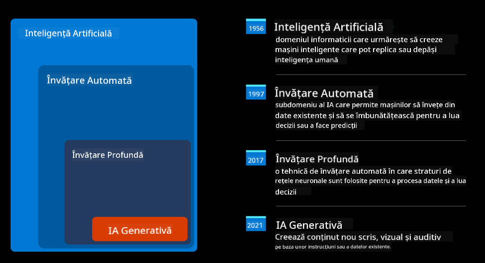
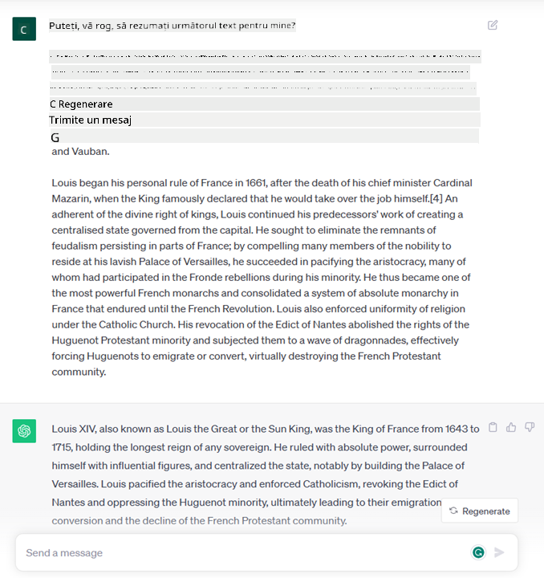
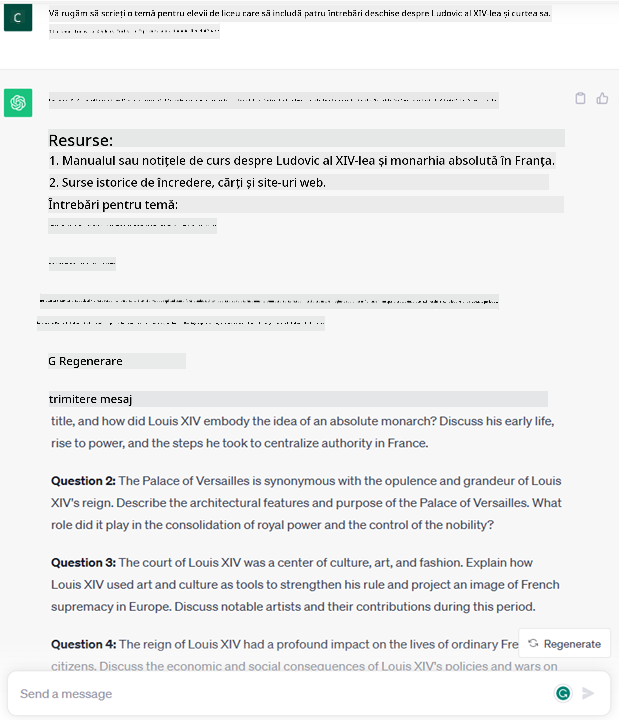

<!--
CO_OP_TRANSLATOR_METADATA:
{
  "original_hash": "bfb7901bdbece1ba3e9f35c400ca33e8",
  "translation_date": "2025-10-17T22:10:34+00:00",
  "source_file": "01-introduction-to-genai/README.md",
  "language_code": "ro"
}
-->
# Introducere în AI Generativ și Modele de Limbaj Extinse

_(Faceți clic pe imaginea de mai sus pentru a viziona videoclipul acestei lecții)_

AI Generativ este inteligența artificială capabilă să genereze text, imagini și alte tipuri de conținut. Ceea ce o face o tehnologie fantastică este faptul că democratizează AI-ul, oricine o poate folosi doar cu un prompt text, o propoziție scrisă într-un limbaj natural. Nu este nevoie să învățați un limbaj precum Java sau SQL pentru a realiza ceva valoros, tot ce trebuie să faceți este să folosiți limbajul vostru, să exprimați ce doriți, iar modelul AI vă oferă o sugestie. Aplicațiile și impactul acestei tehnologii sunt uriașe: puteți scrie sau înțelege rapoarte, crea aplicații și multe altele, totul în câteva secunde.

În acest curriculum, vom explora cum startup-ul nostru folosește AI generativ pentru a deschide noi scenarii în lumea educației și cum abordăm provocările inevitabile asociate cu implicațiile sociale ale aplicării sale și limitările tehnologice.

## Introducere

Această lecție va acoperi:

- Introducerea scenariului de afaceri: ideea și misiunea startup-ului nostru.
- AI generativ și cum am ajuns la peisajul tehnologic actual.
- Funcționarea internă a unui model de limbaj extins.
- Principalele capacități și utilizări practice ale modelelor de limbaj extins.

## Obiective de învățare

După finalizarea acestei lecții, veți înțelege:

- Ce este AI generativ și cum funcționează modelele de limbaj extins.
- Cum puteți utiliza modelele de limbaj extins pentru diferite scenarii, cu accent pe domeniul educației.

## Scenariu: startup-ul nostru educațional

Inteligența Artificială Generativă (AI) reprezintă apogeul tehnologiei AI, depășind limitele a ceea ce odată era considerat imposibil. Modelele AI generative au mai multe capacități și aplicații, dar pentru acest curriculum vom explora cum revoluționează educația prin intermediul unui startup fictiv. Vom face referire la acest startup ca _startup-ul nostru_. Startup-ul nostru activează în domeniul educației, având o misiune ambițioasă:

> _îmbunătățirea accesibilității la învățare, la nivel global, asigurarea accesului echitabil la educație și oferirea de experiențe de învățare personalizate fiecărui elev, în funcție de nevoile sale_.

Echipa startup-ului nostru este conștientă că nu vom putea atinge acest obiectiv fără a folosi unul dintre cele mai puternice instrumente ale vremurilor moderne – Modelele de Limbaj Extins (LLMs).

Se așteaptă ca AI generativ să revoluționeze modul în care învățăm și predăm astăzi, oferind studenților profesori virtuali disponibili 24 de ore pe zi, care furnizează cantități vaste de informații și exemple, iar profesorii pot utiliza instrumente inovatoare pentru a evalua elevii și a oferi feedback.

Pentru început, să definim câteva concepte și termeni de bază pe care îi vom folosi pe parcursul curriculum-ului.

## Cum am ajuns la AI Generativ?

În ciuda _entuziasmului_ extraordinar creat recent de anunțul modelelor AI generative, această tehnologie este rezultatul a zeci de ani de cercetare, primele eforturi datând din anii '60. Acum suntem într-un punct în care AI-ul are capacități cognitive umane, cum ar fi conversația, așa cum se poate observa, de exemplu, la [OpenAI ChatGPT](https://openai.com/chatgpt) sau [Bing Chat](https://www.microsoft.com/edge/features/bing-chat?WT.mc_id=academic-105485-koreyst), care folosește, de asemenea, un model GPT pentru conversațiile de căutare pe web.

Dacă ne întoarcem puțin în timp, primele prototipuri de AI au constat în chatbot-uri scrise, bazate pe o bază de cunoștințe extrasă de la un grup de experți și reprezentată într-un computer. Răspunsurile din baza de cunoștințe erau declanșate de cuvinte-cheie care apăreau în textul de intrare. Totuși, s-a dovedit rapid că o astfel de abordare, utilizând chatbot-uri scrise, nu era scalabilă.

### O abordare statistică a AI: Învățarea Automată

Un moment de cotitură a avut loc în anii '90, odată cu aplicarea unei abordări statistice în analiza textului. Acest lucru a dus la dezvoltarea unor noi algoritmi – cunoscuți sub numele de învățare automată – capabili să învețe modele din date fără a fi programați explicit. Această abordare permite mașinilor să simuleze înțelegerea limbajului uman: un model statistic este antrenat pe perechi text-etichete, permițând modelului să clasifice textul de intrare necunoscut cu o etichetă predefinită care reprezintă intenția mesajului.

### Rețele neuronale și asistenții virtuali moderni

În ultimii ani, evoluția tehnologică a hardware-ului, capabil să gestioneze cantități mai mari de date și calcule mai complexe, a încurajat cercetarea în domeniul AI, ducând la dezvoltarea algoritmilor avansați de învățare automată, cunoscuți sub numele de rețele neuronale sau algoritmi de învățare profundă.

Rețelele neuronale (și, în special, Rețelele Neuronale Recursivă – RNN) au îmbunătățit semnificativ procesarea limbajului natural, permițând reprezentarea semnificației textului într-un mod mai semnificativ, valorificând contextul unui cuvânt într-o propoziție.

Aceasta este tehnologia care a alimentat asistenții virtuali născuți în primul deceniu al noului secol, foarte pricepuți în interpretarea limbajului uman, identificarea unei nevoi și realizarea unei acțiuni pentru a o satisface – cum ar fi răspunsul cu un script predefinit sau utilizarea unui serviciu terț.

### Prezentul, AI Generativ

Așa am ajuns la AI Generativ astăzi, care poate fi considerat un subset al învățării profunde.

După decenii de cercetare în domeniul AI, o nouă arhitectură de model – numită _Transformer_ – a depășit limitele RNN-urilor, fiind capabilă să primească secvențe mult mai lungi de text ca intrare. Transformerele se bazează pe mecanismul de atenție, permițând modelului să acorde greutăți diferite intrărilor pe care le primește, ‘acordând mai multă atenție’ acolo unde informațiile cele mai relevante sunt concentrate, indiferent de ordinea lor în secvența de text.

Majoritatea modelelor AI generative recente – cunoscute și sub numele de Modele de Limbaj Extins (LLMs), deoarece lucrează cu intrări și ieșiri textuale – sunt într-adevăr bazate pe această arhitectură. Ceea ce este interesant la aceste modele – antrenate pe o cantitate uriașă de date neetichetate din surse diverse, cum ar fi cărți, articole și site-uri web – este că pot fi adaptate la o varietate largă de sarcini și pot genera text gramatical corect cu o aparență de creativitate. Astfel, nu doar că au îmbunătățit incredibil capacitatea unei mașini de a ‘înțelege’ un text de intrare, dar au permis și capacitatea de a genera un răspuns original în limbaj uman.

## Cum funcționează modelele de limbaj extins?

În capitolul următor vom explora diferite tipuri de modele AI generative, dar pentru moment să vedem cum funcționează modelele de limbaj extins, concentrându-ne pe modelele OpenAI GPT (Generative Pre-trained Transformer).

- **Tokenizer, text în numere**: Modelele de Limbaj Extins primesc un text ca intrare și generează un text ca ieșire. Totuși, fiind modele statistice, funcționează mult mai bine cu numere decât cu secvențe de text. De aceea, fiecare intrare în model este procesată de un tokenizer înainte de a fi utilizată de modelul principal. Un token este o bucată de text – constând dintr-un număr variabil de caractere, astfel încât sarcina principală a tokenizer-ului este să împartă intrarea într-un array de tokeni. Apoi, fiecare token este mapat cu un index de token, care este codificarea întregului text original.

- **Predicția tokenilor de ieșire**: Având n tokeni ca intrare (cu max n variind de la un model la altul), modelul este capabil să prezică un token ca ieșire. Acest token este apoi încorporat în intrarea următoarei iterații, într-un model de fereastră extinsă, permițând o experiență mai bună utilizatorului de a primi una (sau mai multe) propoziții ca răspuns. Acest lucru explică de ce, dacă ați interacționat vreodată cu ChatGPT, ați observat că uneori pare să se oprească la mijlocul unei propoziții.

- **Procesul de selecție, distribuția probabilității**: Tokenul de ieșire este ales de model în funcție de probabilitatea sa de a apărea după secvența de text curentă. Acest lucru se datorează faptului că modelul prezice o distribuție a probabilității pentru toți ‘tokenii următori’ posibili, calculată pe baza antrenamentului său. Totuși, nu întotdeauna este ales tokenul cu cea mai mare probabilitate din distribuția rezultată. Un grad de aleatoriu este adăugat acestei alegeri, astfel încât modelul să acționeze într-un mod nedeterminist - nu primim exact același rezultat pentru aceeași intrare. Acest grad de aleatoriu este adăugat pentru a simula procesul de gândire creativă și poate fi ajustat folosind un parametru al modelului numit temperatură.

## Cum poate startup-ul nostru să utilizeze Modelele de Limbaj Extins?

Acum că avem o înțelegere mai bună a modului de funcționare a unui model de limbaj extins, să vedem câteva exemple practice ale celor mai comune sarcini pe care le pot îndeplini foarte bine, cu un ochi pe scenariul nostru de afaceri. Am spus că principala capacitate a unui Model de Limbaj Extins este _generarea unui text de la zero, pornind de la o intrare textuală, scrisă în limbaj natural_.

Dar ce fel de intrare și ieșire textuală?
Intrarea unui model de limbaj extins este cunoscută sub numele de prompt, în timp ce ieșirea este cunoscută sub numele de completare, termen care se referă la mecanismul modelului de generare a următorului token pentru a completa intrarea curentă. Vom aprofunda ce este un prompt și cum să-l proiectăm astfel încât să obținem maximum de la modelul nostru. Dar pentru moment, să spunem doar că un prompt poate include:

- O **instrucțiune** care specifică tipul de ieșire pe care o așteptăm de la model. Această instrucțiune poate include uneori exemple sau date suplimentare.

  1. Rezumarea unui articol, a unei cărți, a recenziilor unui produs și altele, împreună cu extragerea de informații din date nestructurate.
    
    
  
  2. Idei creative și redactarea unui articol, eseu, temă sau altele.
      
     

- O **întrebare**, adresată sub forma unei conversații cu un agent.
  
  

- O bucată de **text de completat**, care implicit reprezintă o cerere de asistență la scriere.
  
  

- O bucată de **cod** împreună cu cererea de a-l explica și documenta, sau un comentariu care solicită generarea unui fragment de cod care să îndeplinească o sarcină specifică.
  
  

Exemplele de mai sus sunt destul de simple și nu sunt menite să fie o demonstrație exhaustivă a capacităților modelelor de limbaj extins. Ele sunt destinate să arate potențialul utilizării AI generative, în special, dar nu exclusiv, în contexte educaționale.

De asemenea, ieșirea unui model AI generativ nu este perfectă și uneori creativitatea modelului poate lucra împotriva sa, rezultând într-o ieșire care este o combinație de cuvinte pe care utilizatorul uman le poate interpreta ca o denaturare a realității sau poate fi ofensatoare. AI generativ nu este inteligent - cel puțin nu în definiția mai cuprinzătoare a inteligenței, care include raționamentul critic și creativ sau inteligența emoțională; nu este determinist și nu este de încredere, deoarece fabricările, cum ar fi referințele eronate, conținutul și afirmațiile, pot fi combinate cu informații corecte și prezentate într-un mod convingător și încrezător. În lecțiile următoare, vom aborda toate aceste limitări și vom vedea ce putem face pentru a le atenua.

## Temă

Tema voastră este să citiți mai multe despre [AI generativ](https://en.wikipedia.org/wiki/Generative_artificial_intelligence?WT.mc_id=academic-105485-koreyst) și să încercați să identificați un domeniu în care ați adăuga AI generativ astăzi, care nu îl are. Cum ar fi diferit impactul față de modul "vechi", ați putea face ceva ce nu puteați înainte sau ați fi mai rapizi? Scrieți un rezumat de 300 de cuvinte despre cum ar arăta startup-ul vostru de vis bazat pe AI și includeți titluri precum "Problema", "Cum aș folosi AI", "Impactul" și opțional un plan de afaceri.

Dacă ați realizat această sarcină, ați putea fi chiar pregătiți să aplicați la incubatorul Microsoft, [Microsoft for Startups Founders Hub](https://www.microsoft.com/startups?WT.mc_id=academic-105485-koreyst), unde oferim credite pentru Azure, OpenAI, mentorat și multe altele, verificați-l!

## Verificarea cunoștințelor

Ce este adevărat despre modelele de limbaj extins?

1. Primiți exact același răspuns de fiecare dată.
1. Face lucrurile perfect, este excelent la adunarea numerelor, producerea de cod funcțional etc.
1. Răspunsul poate varia, în ciuda utilizării aceluiași prompt. Este, de asemenea, excelent la oferirea unui prim draft al unui lucru, fie text, fie cod. Dar trebuie să îmbunătățiți rezultatele.

R: 3, un LLM este nedeterminist, răspunsul variază, totuși, puteți controla această variație printr-o setare de temperatură. De asemenea, nu ar trebui să vă așteptați să facă lucrurile perfect, este aici pentru a face munca grea pentru voi, ceea ce înseamnă adesea că obțineți o primă încercare bună la ceva pe care trebuie să o îmbunătățiți treptat.

## Felicitări! Continuați călătoria

După ce ați finalizat această lecție, consultați [colecția de învățare AI generativ](https://aka.ms/genai-collection?WT.mc_id=academic-105485-koreyst) pentru a continua să vă dezvoltați cunoștințele despre AI generativ!
Mergi la Lecția 2, unde vom analiza cum să [explorăm și să comparăm diferite tipuri de LLM](../02-exploring-and-comparing-different-llms/README.md?WT.mc_id=academic-105485-koreyst)!

---

**Declinare de responsabilitate**:  
Acest document a fost tradus folosind serviciul de traducere AI [Co-op Translator](https://github.com/Azure/co-op-translator). Deși ne străduim să asigurăm acuratețea, vă rugăm să fiți conștienți că traducerile automate pot conține erori sau inexactități. Documentul original în limba sa natală ar trebui considerat sursa autoritară. Pentru informații critice, se recomandă traducerea profesională realizată de oameni. Nu ne asumăm responsabilitatea pentru eventualele neînțelegeri sau interpretări greșite care pot apărea din utilizarea acestei traduceri.