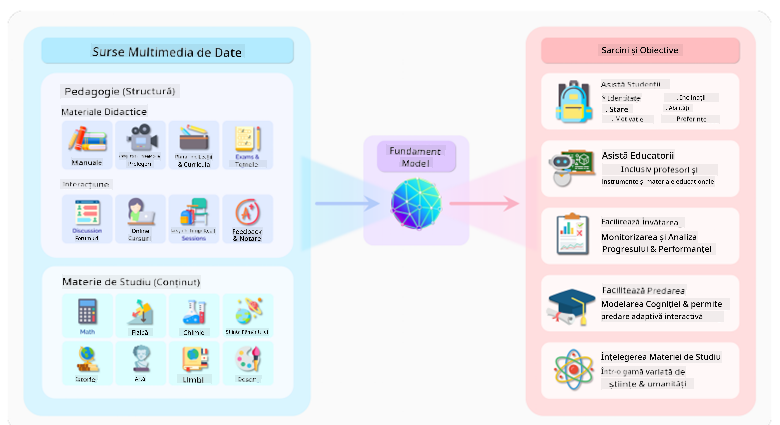
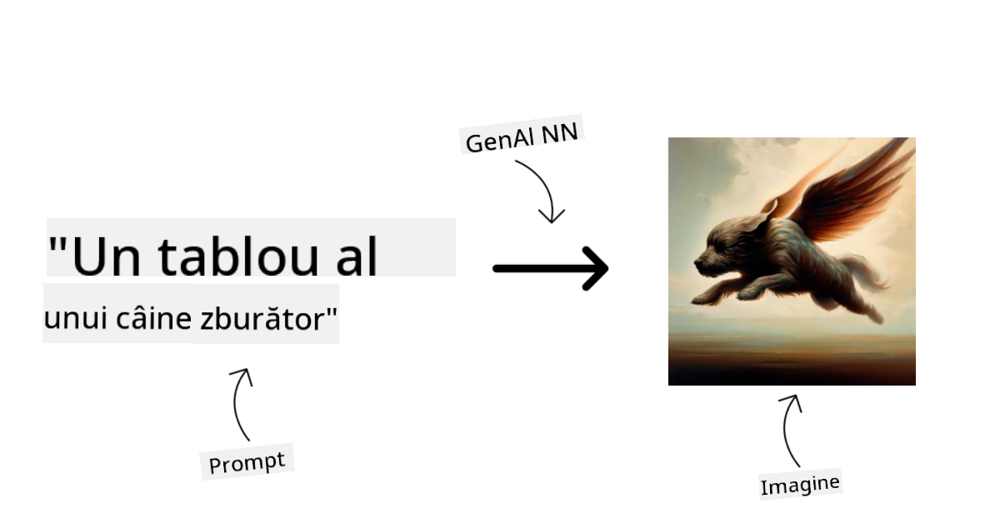
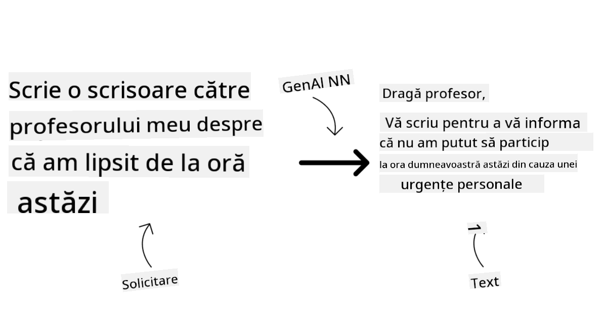
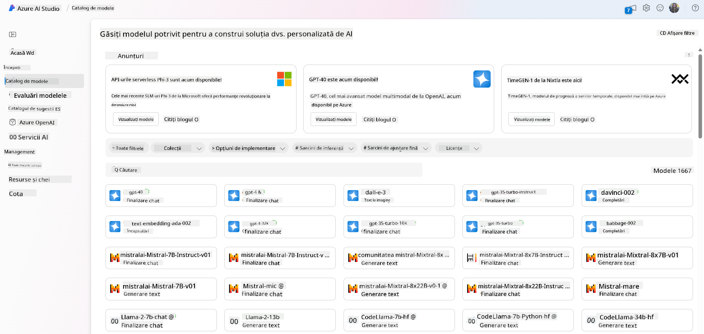
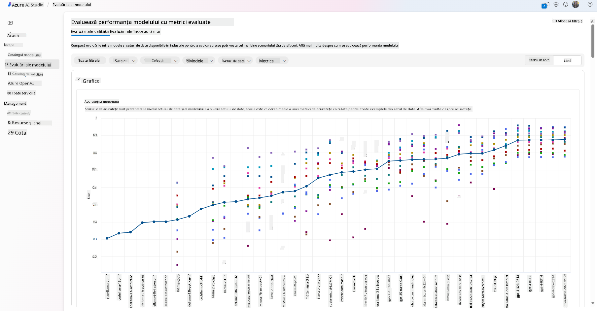
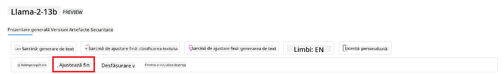
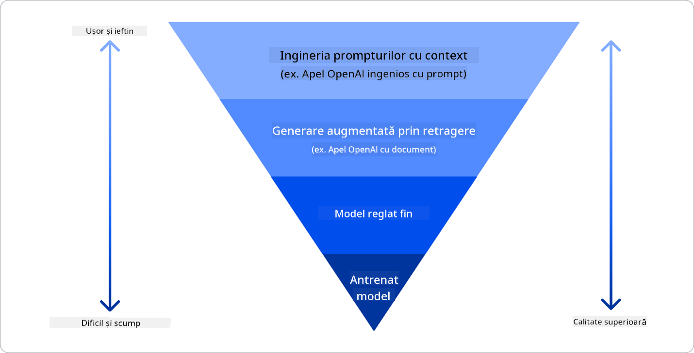

<!--
CO_OP_TRANSLATOR_METADATA:
{
  "original_hash": "e2f686f2eb794941761252ac5e8e090b",
  "translation_date": "2025-05-19T14:22:39+00:00",
  "source_file": "02-exploring-and-comparing-different-llms/README.md",
  "language_code": "ro"
}
-->
# Explorarea și compararea diferitelor LLM-uri

> _Click pe imaginea de mai sus pentru a viziona videoclipul lecției_

Cu lecția anterioară, am văzut cum Inteligența Artificială Generativă schimbă peisajul tehnologic, cum funcționează Modelele de Limbaj de Mari Dimensiuni (LLM-uri) și cum o afacere - precum startup-ul nostru - le poate aplica la cazurile lor de utilizare și poate crește! În acest capitol, ne propunem să comparăm și să contrastăm diferite tipuri de modele de limbaj de mari dimensiuni (LLM-uri) pentru a înțelege avantajele și dezavantajele acestora.

Următorul pas în călătoria startup-ului nostru este explorarea peisajului actual al LLM-urilor și înțelegerea care sunt potrivite pentru cazul nostru de utilizare.

## Introducere

Această lecție va acoperi:

- Diferite tipuri de LLM-uri în peisajul actual.
- Testarea, iterarea și compararea diferitelor modele pentru cazul tău de utilizare în Azure.
- Cum să implementezi un LLM.

## Obiective de Învățare

După finalizarea acestei lecții, vei putea:

- Selecta modelul potrivit pentru cazul tău de utilizare.
- Înțelege cum să testezi, să iterezi și să îmbunătățești performanța modelului tău.
- Știi cum afacerile implementează modele.

## Înțelegerea diferitelor tipuri de LLM-uri

LLM-urile pot avea multiple categorisiri bazate pe arhitectura lor, datele de antrenament și cazul de utilizare. Înțelegerea acestor diferențe va ajuta startup-ul nostru să selecteze modelul potrivit pentru scenariul nostru și să înțeleagă cum să testeze, să itereze și să îmbunătățească performanța.

Există multe tipuri diferite de modele LLM, alegerea modelului depinde de ceea ce îți propui să folosești, datele tale, cât ești dispus să plătești și altele.

În funcție de dacă îți propui să folosești modelele pentru generarea de text, audio, video, imagini și așa mai departe, ai putea opta pentru un alt tip de model.

- **Recunoașterea audio și a vorbirii**. Pentru acest scop, modelele de tip Whisper sunt o alegere excelentă, deoarece sunt de uz general și vizează recunoașterea vorbirii. Este antrenat pe audio diversificat și poate efectua recunoașterea vorbirii multilingve. Află mai multe despre [modelele de tip Whisper aici](https://platform.openai.com/docs/models/whisper?WT.mc_id=academic-105485-koreyst).

- **Generarea de imagini**. Pentru generarea de imagini, DALL-E și Midjourney sunt două alegeri foarte cunoscute. DALL-E este oferit de Azure OpenAI. [Citește mai multe despre DALL-E aici](https://platform.openai.com/docs/models/dall-e?WT.mc_id=academic-105485-koreyst) și, de asemenea, în capitolul 9 al acestui curriculum.

- **Generarea de text**. Majoritatea modelelor sunt antrenate pentru generarea de text și ai o mare varietate de alegeri de la GPT-3.5 la GPT-4. Ele vin la costuri diferite, cu GPT-4 fiind cel mai scump. Merită să explorezi [Azure OpenAI playground](https://oai.azure.com/portal/playground?WT.mc_id=academic-105485-koreyst) pentru a evalua care modele se potrivesc cel mai bine nevoilor tale în termeni de capacitate și cost.

- **Multi-modalitate**. Dacă dorești să gestionezi mai multe tipuri de date în intrare și ieșire, ai putea dori să explorezi modele precum [gpt-4 turbo cu viziune sau gpt-4o](https://learn.microsoft.com/azure/ai-services/openai/concepts/models#gpt-4-and-gpt-4-turbo-models?WT.mc_id=academic-105485-koreyst) - cele mai recente versiuni ale modelelor OpenAI - care sunt capabile să combine procesarea limbajului natural cu înțelegerea vizuală, permițând interacțiuni prin interfețe multi-modale.

Selectarea unui model înseamnă că obții unele capacități de bază, care s-ar putea să nu fie suficiente însă. Adesea ai date specifice companiei pe care trebuie cumva să le comunici LLM-ului. Există câteva opțiuni diferite despre cum să abordezi asta, mai multe despre asta în secțiunile următoare.

### Modele de Bază versus LLM-uri

Termenul de Model de Bază a fost [inventat de cercetătorii de la Stanford](https://arxiv.org/abs/2108.07258?WT.mc_id=academic-105485-koreyst) și definit ca un model AI care urmează anumite criterii, cum ar fi:

- **Sunt antrenate folosind învățarea nesupravegheată sau auto-supervizată**, ceea ce înseamnă că sunt antrenate pe date multi-modale fără etichete și nu necesită adnotări sau etichetări umane ale datelor pentru procesul lor de antrenament.
- **Sunt modele foarte mari**, bazate pe rețele neuronale foarte profunde antrenate pe miliarde de parametri.
- **Sunt în mod normal destinate să servească drept „bază” pentru alte modele**, ceea ce înseamnă că pot fi utilizate ca punct de plecare pentru alte modele care să fie construite pe ele, ceea ce se poate face prin ajustare fină.

Sursa imaginii: [Essential Guide to Foundation Models and Large Language Models | by Babar M Bhatti | Medium
](https://thebabar.medium.com/essential-guide-to-foundation-models-and-large-language-models-27dab58f7404)

Pentru a clarifica și mai mult această distincție, să luăm ChatGPT ca exemplu. Pentru a construi prima versiune a ChatGPT, un model numit GPT-3.5 a servit drept model de bază. Acest lucru înseamnă că OpenAI a folosit niște date specifice de chat pentru a crea o versiune ajustată a GPT-3.5 care era specializată în performanțe bune în scenarii conversaționale, cum ar fi chatbots.

Sursa imaginii: [2108.07258.pdf (arxiv.org)](https://arxiv.org/pdf/2108.07258.pdf?WT.mc_id=academic-105485-koreyst)

### Modele Open Source versus Proprietare

O altă modalitate de a categorisi LLM-urile este dacă sunt open source sau proprietare.

Modelele open-source sunt modele care sunt disponibile publicului și pot fi utilizate de oricine. Ele sunt adesea puse la dispoziție de compania care le-a creat sau de comunitatea de cercetare. Aceste modele pot fi inspectate, modificate și personalizate pentru diversele cazuri de utilizare în LLM-uri. Cu toate acestea, ele nu sunt întotdeauna optimizate pentru utilizarea în producție și pot să nu fie la fel de performante ca modelele proprietare. În plus, finanțarea pentru modelele open-source poate fi limitată și ele pot să nu fie menținute pe termen lung sau să nu fie actualizate cu cele mai recente cercetări. Exemple de modele open-source populare includ [Alpaca](https://crfm.stanford.edu/2023/03/13/alpaca.html?WT.mc_id=academic-105485-koreyst), [Bloom](https://huggingface.co/bigscience/bloom) și [LLaMA](https://llama.meta.com).

Modelele proprietare sunt modele care sunt deținute de o companie și nu sunt disponibile publicului. Aceste modele sunt adesea optimizate pentru utilizarea în producție. Cu toate acestea, ele nu sunt permise să fie inspectate, modificate sau personalizate pentru diferite cazuri de utilizare. În plus, ele nu sunt întotdeauna disponibile gratuit și pot necesita un abonament sau o plată pentru a fi utilizate. De asemenea, utilizatorii nu au control asupra datelor care sunt folosite pentru antrenarea modelului, ceea ce înseamnă că ar trebui să încredințeze proprietarului modelului asigurarea angajamentului față de confidențialitatea datelor și utilizarea responsabilă a AI. Exemple de modele proprietare populare includ [modelele OpenAI](https://platform.openai.com/docs/models/overview?WT.mc_id=academic-105485-koreyst), [Google Bard](https://sapling.ai/llm/bard?WT.mc_id=academic-105485-koreyst) sau [Claude 2](https://www.anthropic.com/index/claude-2?WT.mc_id=academic-105485-koreyst).

### Încapsulare versus Generarea de Imagini versus Generarea de Text și Cod

LLM-urile pot fi, de asemenea, categorisite în funcție de output-ul pe care îl generează.

Încapsulările sunt un set de modele care pot transforma textul într-o formă numerică, numită încapsulare, care este o reprezentare numerică a textului de intrare. Încapsulările facilitează înțelegerea relațiilor dintre cuvinte sau propoziții de către mașini și pot fi consumate ca intrări de către alte modele, cum ar fi modelele de clasificare sau modelele de clustering care au performanțe mai bune pe date numerice. Modelele de încapsulare sunt adesea utilizate pentru învățarea transferului, unde un model este construit pentru o sarcină surogat pentru care există o abundență de date, și apoi greutățile modelului (încapsulările) sunt reutilizate pentru alte sarcini ulterioare. Un exemplu din această categorie este [încapsulările OpenAI](https://platform.openai.com/docs/models/embeddings?WT.mc_id=academic-105485-koreyst).

Modelele de generare de imagini sunt modele care generează imagini. Aceste modele sunt adesea utilizate pentru editarea imaginii, sinteza imaginii și traducerea imaginii. Modelele de generare de imagini sunt adesea antrenate pe seturi mari de date de imagini, cum ar fi [LAION-5B](https://laion.ai/blog/laion-5b/?WT.mc_id=academic-105485-koreyst), și pot fi utilizate pentru a genera imagini noi sau pentru a edita imagini existente cu tehnici de înlocuire a părților lipsă, super-rezoluție și colorizare. Exemple includ [DALL-E-3](https://openai.com/dall-e-3?WT.mc_id=academic-105485-koreyst) și [modelele Stable Diffusion](https://github.com/Stability-AI/StableDiffusion?WT.mc_id=academic-105485-koreyst).

Modelele de generare de text și cod sunt modele care generează text sau cod. Aceste modele sunt adesea utilizate pentru sumarizarea textului, traducere și răspuns la întrebări. Modelele de generare de text sunt adesea antrenate pe seturi mari de date de text, cum ar fi [BookCorpus](https://www.cv-foundation.org/openaccess/content_iccv_2015/html/Zhu_Aligning_Books_and_ICCV_2015_paper.html?WT.mc_id=academic-105485-koreyst), și pot fi utilizate pentru a genera text nou sau pentru a răspunde la întrebări. Modelele de generare de cod, precum [CodeParrot](https://huggingface.co/codeparrot?WT.mc_id=academic-105485-koreyst), sunt adesea antrenate pe seturi mari de date de cod, cum ar fi GitHub, și pot fi utilizate pentru a genera cod nou sau pentru a repara erori în codul existent.

### Encoder-Decoder versus doar Decoder

Pentru a discuta despre diferitele tipuri de arhitecturi ale LLM-urilor, să folosim o analogie.

Imaginează-ți că managerul tău ți-a dat o sarcină de a scrie un quiz pentru studenți. Ai doi colegi; unul se ocupă de crearea conținutului și celălalt de revizuirea acestuia.

Creatorul de conținut este ca un model doar Decoder, el poate privi subiectul și vedea ce ai scris deja și apoi poate scrie un curs pe baza acestuia. Ei sunt foarte buni la scrierea de conținut captivant și informativ, dar nu sunt foarte buni la înțelegerea subiectului și a obiectivelor de învățare. Unele exemple de modele Decoder sunt modelele din familia GPT, cum ar fi GPT-3.

Revizorul este ca un model doar Encoder, el privește cursul scris și răspunsurile, observând relația dintre ele și înțelegând contextul, dar nu este bun la generarea de conținut. Un exemplu de model doar Encoder ar fi BERT.

Imaginează-ți că putem avea pe cineva care ar putea crea și revizui quiz-ul, acesta este un model Encoder-Decoder. Unele exemple ar fi BART și T5.

### Serviciu versus Model

Acum, să discutăm despre diferența dintre un serviciu și un model. Un serviciu este un produs oferit de un Furnizor de Servicii Cloud și este adesea o combinație de modele, date și alte componente. Un model este componenta de bază a unui serviciu și este adesea un model de bază, cum ar fi un LLM.

Serviciile sunt adesea optimizate pentru utilizarea în producție și sunt adesea mai ușor de utilizat decât modelele, printr-o interfață grafică. Cu toate acestea, serviciile nu sunt întotdeauna disponibile gratuit și pot necesita un abonament sau o plată pentru a fi utilizate, în schimbul utilizării echipamentului și resurselor proprietarului serviciului, optimizând cheltuielile și scalând ușor. Un exemplu de serviciu este [Azure OpenAI Service](https://learn.microsoft.com/azure/ai-services/openai/overview?WT.mc_id=academic-105485-koreyst), care oferă un plan de tarifare pay-as-you-go, ceea ce înseamnă că utilizatorii sunt taxați proporțional cu cât utilizează serviciul. De asemenea, Azure OpenAI Service oferă securitate de nivel enterprise și un cadru AI responsabil pe lângă capacitățile modelelor.

Modelele sunt doar Rețeaua Neuronală, cu parametrii, greutățile și altele. Permițând companiilor să ruleze local, totuși, ar trebui să cumpere echipamente, să construiască o structură pentru scalare și să cumpere o licență sau să folosească un model open-source. Un model precum LLaMA este disponibil pentru a fi utilizat, necesitând putere de calcul pentru a rula modelul.

## Cum să testezi și să iterezi cu diferite modele pentru a înțelege performanța pe Azure

Odată ce echipa noastră a explorat peisajul actual al LLM-urilor și a identificat câțiva candidați buni pentru scenariile lor, următorul pas este testarea acestora pe datele lor și pe sarcina lor de lucru. Acesta este un proces iterativ, realizat prin experimente și măsurători.
Majoritatea modelelor menționate în paragrafele anterioare (modele OpenAI, modele open-source precum Llama2 și transformatori Hugging Face) sunt disponibile în [Catalogul de Modele](https://learn.microsoft.com/azure/ai-studio/how-to/model-catalog-overview?WT.mc_id=academic-105485-koreyst) în [Azure AI Studio](https://ai.azure.com/?WT.mc_id=academic-105485-koreyst).

[Azure AI Studio](https://learn.microsoft.com/azure/ai-studio/what-is-ai-studio?WT.mc_id=academic-105485-koreyst) este o Platformă Cloud proiectată pentru dezvoltatori pentru a construi aplicații de inteligență artificială generativă și pentru a gestiona întregul ciclu de dezvoltare - de la experimentare la evaluare - combinând toate serviciile AI Azure într-un singur hub cu o interfață grafică ușor de utilizat. Catalogul de Modele în Azure AI Studio permite utilizatorului să:

- Găsească Modelul de Bază de interes în catalog - fie proprietar sau open-source, filtrând după sarcină, licență sau nume. Pentru a îmbunătăți căutarea, modelele sunt organizate în colecții, cum ar fi colecția Azure OpenAI, colecția Hugging Face și altele.

- Revizuiască cardul modelului, inclusiv o descriere detaliată a utilizării intenționate și a datelor de antrenament
- Compară benchmark-urile între modele și seturi de date disponibile în industrie pentru a evalua care dintre ele se potrivește scenariului de afaceri, prin panoul [Model Benchmarks](https://learn.microsoft.com/azure/ai-studio/how-to/model-benchmarks?WT.mc_id=academic-105485-koreyst).

- Ajustează modelul pe date de antrenament personalizate pentru a îmbunătăți performanța modelului într-o sarcină specifică, folosind capacitățile de experimentare și urmărire ale Azure AI Studio.

- Desfășoară modelul original pre-antrenat sau versiunea ajustată la o inferență în timp real la distanță - computație gestionată - sau la un punct de finalizare API fără server - [pay-as-you-go](https://learn.microsoft.com/azure/ai-studio/how-to/model-catalog-overview#model-deployment-managed-compute-and-serverless-api-pay-as-you-go?WT.mc_id=academic-105485-koreyst) - pentru a permite aplicațiilor să îl consume.

> [!NOTE]
> Nu toate modelele din catalog sunt disponibile în prezent pentru ajustare și/sau desfășurare pay-as-you-go. Verifică cardul modelului pentru detalii despre capacitățile și limitările modelului.

## Îmbunătățirea rezultatelor LLM

Am explorat cu echipa noastră de startup diferite tipuri de LLM-uri și o Platformă Cloud (Azure Machine Learning) care ne permite să comparăm diferite modele, să le evaluăm pe date de testare, să îmbunătățim performanța și să le desfășurăm pe puncte de inferență.

Dar când ar trebui să considere ajustarea unui model în loc să folosească unul pre-antrenat? Există alte abordări pentru a îmbunătăți performanța modelului în sarcini specifice?

Există mai multe abordări pe care o afacere le poate folosi pentru a obține rezultatele dorite de la un LLM. Poți selecta diferite tipuri de modele cu diferite grade de antrenament atunci când desfășori un LLM în producție, cu diferite niveluri de complexitate, cost și calitate. Iată câteva abordări diferite:

- **Ingineria prompturilor cu context**. Ideea este de a oferi suficient context atunci când faci un prompt pentru a te asigura că obții răspunsurile de care ai nevoie.

- **Generarea Augmentată prin Regăsire, RAG**. Datele tale ar putea exista într-o bază de date sau punct de finalizare web, de exemplu, pentru a te asigura că aceste date, sau un subset al lor, sunt incluse la momentul promptului, poți prelua datele relevante și le poți face parte din promptul utilizatorului.

- **Model ajustat**. Aici, ai antrenat modelul mai departe pe datele tale, ceea ce a dus la un model mai exact și mai receptiv la nevoile tale, dar ar putea fi costisitor.

Sursa imaginii: [Four Ways that Enterprises Deploy LLMs | Fiddler AI Blog](https://www.fiddler.ai/blog/four-ways-that-enterprises-deploy-llms?WT.mc_id=academic-105485-koreyst)

### Ingineria Prompturilor cu Context

LLM-urile pre-antrenate funcționează foarte bine pe sarcini generalizate de limbaj natural, chiar și atunci când sunt apelate cu un prompt scurt, cum ar fi o propoziție de completat sau o întrebare – așa-numita învățare „zero-shot”.

Cu toate acestea, cu cât utilizatorul poate încadra mai mult interogarea lor, cu o cerere detaliată și exemple – Contextul – cu atât mai precis și mai apropiat de așteptările utilizatorului va fi răspunsul. În acest caz, vorbim despre învățare „one-shot” dacă promptul include doar un exemplu și „few-shot learning” dacă include mai multe exemple.
Ingineria prompturilor cu context este cea mai eficientă abordare pentru a începe.

### Generarea Augmentată prin Regăsire (RAG)

LLM-urile au limitarea că pot folosi doar datele care au fost utilizate în timpul antrenamentului lor pentru a genera un răspuns. Aceasta înseamnă că nu știu nimic despre faptele care s-au întâmplat după procesul lor de antrenament și nu pot accesa informații nepublice (cum ar fi datele companiei).
Aceasta poate fi depășită prin RAG, o tehnică care îmbogățește promptul cu date externe sub formă de fragmente de documente, ținând cont de limitele lungimii promptului. Aceasta este susținută de instrumente de baze de date vectoriale (cum ar fi [Azure Vector Search](https://learn.microsoft.com/azure/search/vector-search-overview?WT.mc_id=academic-105485-koreyst)) care preiau fragmentele utile din surse de date variate predefinite și le adaugă la Contextul promptului.

Această tehnică este foarte utilă atunci când o afacere nu are suficiente date, suficient timp sau resurse pentru a ajusta un LLM, dar totuși dorește să îmbunătățească performanța pe o sarcină specifică și să reducă riscurile de fabricații, adică mistificarea realității sau conținut dăunător.

### Model ajustat

Ajustarea este un proces care folosește învățarea transferului pentru a „adapta” modelul la o sarcină ulterioară sau pentru a rezolva o problemă specifică. Diferit de învățarea few-shot și RAG, rezultă într-un model nou generat, cu greutăți și biasuri actualizate. Necesită un set de exemple de antrenament constând dintr-o singură intrare (promptul) și ieșirea asociată (completarea).
Aceasta ar fi abordarea preferată dacă:

- **Folosirea modelelor ajustate**. O afacere ar dori să folosească modele ajustate mai puțin capabile (cum ar fi modelele de embedding) mai degrabă decât modele de înaltă performanță, rezultând într-o soluție mai rentabilă și rapidă.

- **Considerarea latenței**. Latența este importantă pentru un caz de utilizare specific, deci nu este posibil să se folosească prompturi foarte lungi sau numărul de exemple care ar trebui învățate de model nu se potrivește cu limita de lungime a promptului.

- **Menținerea actualizată**. O afacere are multe date de înaltă calitate și etichete de adevăr și resursele necesare pentru a menține aceste date actualizate în timp.

### Model antrenat

Antrenarea unui LLM de la zero este fără îndoială cea mai dificilă și cea mai complexă abordare de adoptat, necesitând cantități masive de date, resurse calificate și putere computațională adecvată. Această opțiune ar trebui considerată doar într-un scenariu în care o afacere are un caz de utilizare specific domeniului și o cantitate mare de date centrate pe domeniu.

## Verificarea cunoștințelor

Ce ar putea fi o abordare bună pentru a îmbunătăți rezultatele de completare ale LLM?

1. Ingineria prompturilor cu context
1. RAG
1. Model ajustat

A:3, dacă ai timp și resurse și date de înaltă calitate, ajustarea este opțiunea mai bună pentru a rămâne actualizat. Totuși, dacă te uiți la îmbunătățirea lucrurilor și îți lipsește timpul, merită să consideri RAG mai întâi.

## 🚀 Provocare

Citește mai multe despre cum poți [folosi RAG](https://learn.microsoft.com/azure/search/retrieval-augmented-generation-overview?WT.mc_id=academic-105485-koreyst) pentru afacerea ta.

## Lucru Grozav, Continuă Învățarea

După ce ai completat această lecție, verifică colecția noastră de [Generative AI Learning](https://aka.ms/genai-collection?WT.mc_id=academic-105485-koreyst) pentru a continua să îți îmbunătățești cunoștințele despre AI Generativă!

Mergi la Lecția 3 unde vom analiza cum să [construiești cu AI Generativă în mod Responsabil](../03-using-generative-ai-responsibly/README.md?WT.mc_id=academic-105485-koreyst)!

**Declinarea responsabilității**:  
Acest document a fost tradus folosind serviciul de traducere AI [Co-op Translator](https://github.com/Azure/co-op-translator). Deși ne străduim să asigurăm acuratețea, vă rugăm să fiți conștienți că traducerile automate pot conține erori sau inexactități. Documentul original în limba sa natală ar trebui considerat sursa autoritară. Pentru informații critice, se recomandă traducerea umană profesională. Nu ne asumăm răspunderea pentru neînțelegerile sau interpretările greșite care pot apărea din utilizarea acestei traduceri.