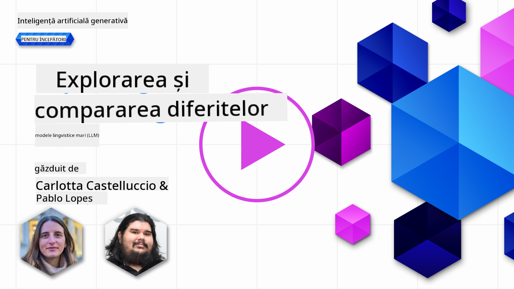
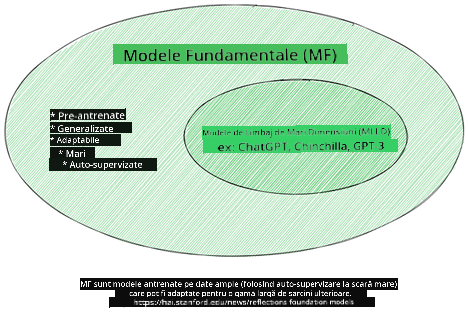
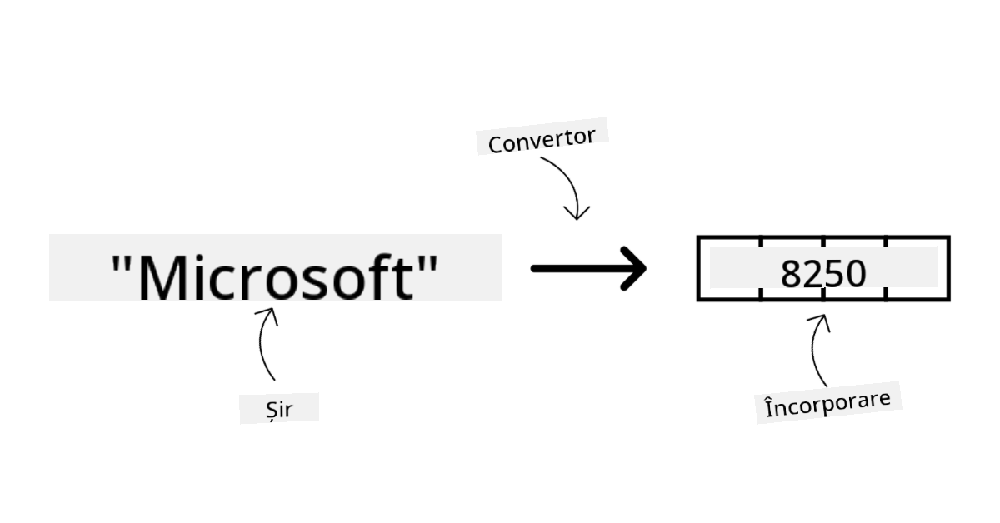
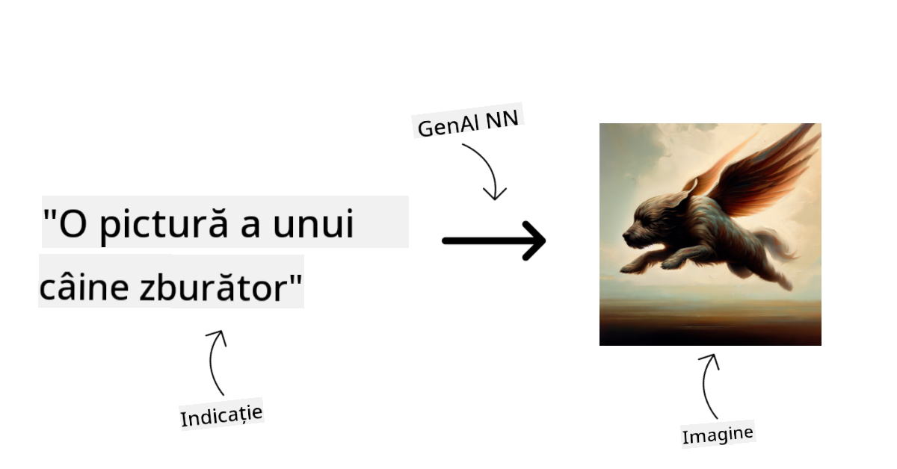
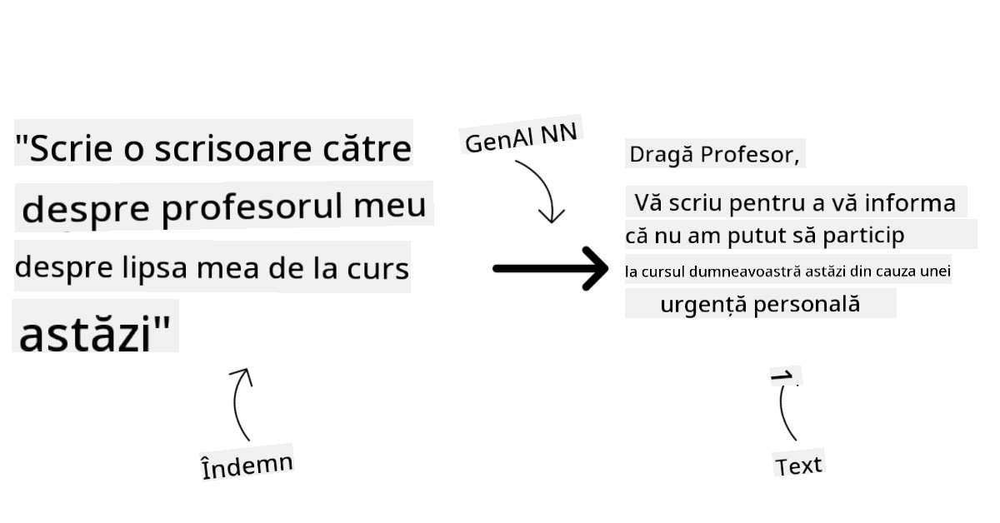
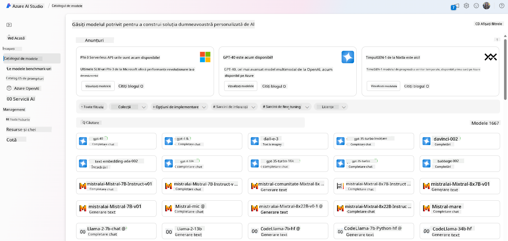
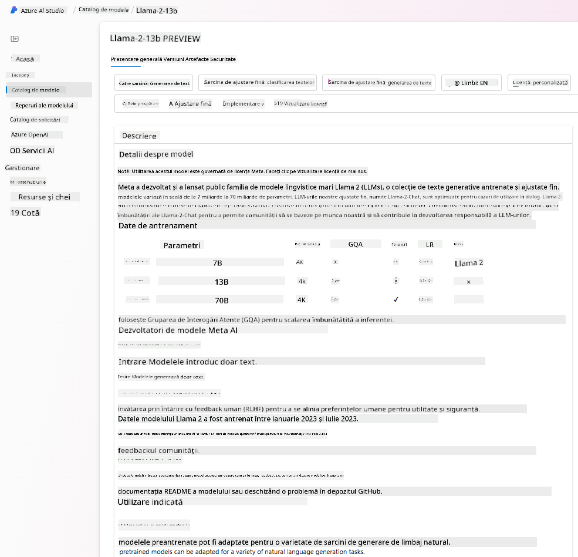
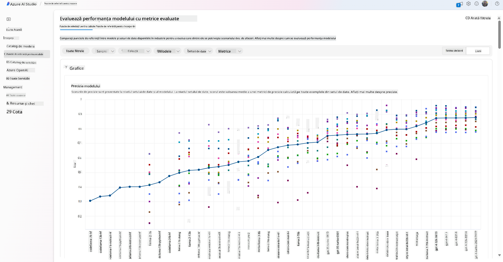
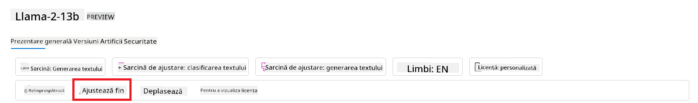
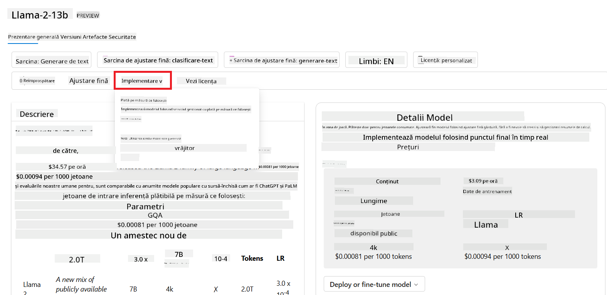

<!--
CO_OP_TRANSLATOR_METADATA:
{
  "original_hash": "e2f686f2eb794941761252ac5e8e090b",
  "translation_date": "2025-07-09T08:39:36+00:00",
  "source_file": "02-exploring-and-comparing-different-llms/README.md",
  "language_code": "ro"
}
-->
# Explorarea și compararea diferitelor LLM-uri

> _Click pe imaginea de mai sus pentru a viziona videoclipul acestei lecții_

În lecția anterioară, am văzut cum Generative AI schimbă peisajul tehnologic, cum funcționează Large Language Models (LLM-uri) și cum o afacere – precum startup-ul nostru – le poate aplica în cazurile lor de utilizare pentru a crește! În acest capitol, ne propunem să comparăm și să evidențiem diferențele dintre diferite tipuri de modele mari de limbaj (LLM-uri) pentru a înțelege avantajele și dezavantajele fiecăruia.

Următorul pas în călătoria startup-ului nostru este explorarea peisajului actual al LLM-urilor și înțelegerea care dintre ele sunt potrivite pentru cazul nostru de utilizare.

## Introducere

Această lecție va acoperi:

- Diferitele tipuri de LLM-uri din peisajul actual.
- Testarea, iterarea și compararea diferitelor modele pentru cazul tău de utilizare în Azure.
- Cum să implementezi un LLM.

## Obiective de învățare

După finalizarea acestei lecții, vei putea:

- Să selectezi modelul potrivit pentru cazul tău de utilizare.
- Să înțelegi cum să testezi, să iterezi și să îmbunătățești performanța modelului tău.
- Să știi cum implementează afacerile modelele.

## Înțelegerea diferitelor tipuri de LLM-uri

LLM-urile pot fi clasificate în mai multe moduri, în funcție de arhitectura lor, datele de antrenament și cazul de utilizare. Înțelegerea acestor diferențe ne va ajuta startup-ul să aleagă modelul potrivit pentru scenariu și să înțeleagă cum să testeze, să itereze și să îmbunătățească performanța.

Există multe tipuri diferite de modele LLM, iar alegerea ta depinde de scopul pentru care vrei să le folosești, de datele pe care le ai, de buget și alți factori.

În funcție de faptul dacă vrei să folosești modelele pentru text, audio, video, generare de imagini și așa mai departe, s-ar putea să optezi pentru un tip diferit de model.

- **Recunoaștere audio și vocală**. Pentru acest scop, modelele de tip Whisper sunt o alegere excelentă, deoarece sunt modele generale, orientate spre recunoașterea vorbirii. Sunt antrenate pe audio divers și pot realiza recunoaștere vocală multilingvă. Află mai multe despre [modelele de tip Whisper aici](https://platform.openai.com/docs/models/whisper?WT.mc_id=academic-105485-koreyst).

- **Generare de imagini**. Pentru generarea de imagini, DALL-E și Midjourney sunt două opțiuni foarte cunoscute. DALL-E este oferit prin Azure OpenAI. [Citește mai multe despre DALL-E aici](https://platform.openai.com/docs/models/dall-e?WT.mc_id=academic-105485-koreyst) și, de asemenea, în Capitolul 9 al acestui curriculum.

- **Generare de text**. Majoritatea modelelor sunt antrenate pentru generare de text și ai o varietate largă de opțiuni, de la GPT-3.5 la GPT-4. Acestea vin la costuri diferite, GPT-4 fiind cel mai scump. Merită să arunci o privire în [Azure OpenAI playground](https://oai.azure.com/portal/playground?WT.mc_id=academic-105485-koreyst) pentru a evalua care modele se potrivesc cel mai bine nevoilor tale în termeni de capacitate și cost.

- **Multi-modalitate**. Dacă dorești să gestionezi mai multe tipuri de date la intrare și ieșire, s-ar putea să te intereseze modele precum [gpt-4 turbo cu viziune sau gpt-4o](https://learn.microsoft.com/azure/ai-services/openai/concepts/models#gpt-4-and-gpt-4-turbo-models?WT.mc_id=academic-105485-koreyst) – cele mai recente lansări ale modelelor OpenAI – care pot combina procesarea limbajului natural cu înțelegerea vizuală, permițând interacțiuni prin interfețe multi-modale.

Alegerea unui model înseamnă că obții niște capabilități de bază, care însă s-ar putea să nu fie suficiente. Deseori, ai date specifice companiei pe care trebuie să le transmiți cumva LLM-ului. Există câteva opțiuni diferite pentru a aborda acest aspect, despre care vom vorbi în secțiunile următoare.

### Modele Foundation versus LLM-uri

Termenul Foundation Model a fost [creat de cercetătorii de la Stanford](https://arxiv.org/abs/2108.07258?WT.mc_id=academic-105485-koreyst) și definit ca un model AI care respectă anumite criterii, cum ar fi:

- **Sunt antrenate folosind învățare nesupravegheată sau auto-supravegheată**, ceea ce înseamnă că sunt antrenate pe date multi-modale neetichetate și nu necesită adnotare umană pentru procesul de antrenament.
- **Sunt modele foarte mari**, bazate pe rețele neuronale foarte adânci, antrenate pe miliarde de parametri.
- **Sunt de obicei destinate să servească drept „bază” pentru alte modele**, adică pot fi folosite ca punct de plecare pentru construirea altor modele, prin fine-tuning.

Sursa imaginii: [Essential Guide to Foundation Models and Large Language Models | by Babar M Bhatti | Medium](https://thebabar.medium.com/essential-guide-to-foundation-models-and-large-language-models-27dab58f7404)

Pentru a clarifica mai bine această distincție, să luăm ChatGPT ca exemplu. Pentru a construi prima versiune a ChatGPT, un model numit GPT-3.5 a servit drept foundation model. Aceasta înseamnă că OpenAI a folosit date specifice pentru chat pentru a crea o versiune ajustată a GPT-3.5, specializată să performeze bine în scenarii conversaționale, cum ar fi chatbot-urile.

Sursa imaginii: [2108.07258.pdf (arxiv.org)](https://arxiv.org/pdf/2108.07258.pdf?WT.mc_id=academic-105485-koreyst)

### Modele Open Source versus Proprietare

O altă modalitate de a clasifica LLM-urile este dacă sunt open source sau proprietare.

Modelele open source sunt modele puse la dispoziția publicului și pot fi folosite de oricine. Ele sunt adesea oferite de compania care le-a creat sau de comunitatea de cercetare. Aceste modele pot fi inspectate, modificate și personalizate pentru diverse cazuri de utilizare. Totuși, ele nu sunt întotdeauna optimizate pentru utilizare în producție și pot să nu aibă performanțe la fel de bune ca modelele proprietare. În plus, finanțarea pentru modelele open source poate fi limitată, iar acestea pot să nu fie întreținute pe termen lung sau actualizate cu cele mai recente cercetări. Exemple populare de modele open source includ [Alpaca](https://crfm.stanford.edu/2023/03/13/alpaca.html?WT.mc_id=academic-105485-koreyst), [Bloom](https://huggingface.co/bigscience/bloom) și [LLaMA](https://llama.meta.com).

Modelele proprietare sunt modele deținute de o companie și nu sunt puse la dispoziția publicului. Aceste modele sunt adesea optimizate pentru utilizare în producție. Totuși, ele nu pot fi inspectate, modificate sau personalizate pentru diferite cazuri de utilizare. De asemenea, nu sunt întotdeauna disponibile gratuit și pot necesita abonament sau plată pentru utilizare. Utilizatorii nu au control asupra datelor folosite pentru antrenarea modelului, ceea ce înseamnă că trebuie să aibă încredere în proprietarul modelului pentru a asigura respectarea confidențialității datelor și utilizarea responsabilă a AI. Exemple populare de modele proprietare includ [modelele OpenAI](https://platform.openai.com/docs/models/overview?WT.mc_id=academic-105485-koreyst), [Google Bard](https://sapling.ai/llm/bard?WT.mc_id=academic-105485-koreyst) sau [Claude 2](https://www.anthropic.com/index/claude-2?WT.mc_id=academic-105485-koreyst).

### Embedding versus generare de imagini versus generare de text și cod

LLM-urile pot fi, de asemenea, clasificate în funcție de tipul de output pe care îl generează.

Embeddings sunt un set de modele care pot converti textul într-o formă numerică, numită embedding, care reprezintă numeric textul de intrare. Embeddings facilitează înțelegerea relațiilor dintre cuvinte sau propoziții de către mașini și pot fi folosite ca input pentru alte modele, cum ar fi cele de clasificare sau de clustering, care au performanțe mai bune pe date numerice. Modelele de embedding sunt adesea folosite pentru transfer learning, unde un model este construit pentru o sarcină surrogate pentru care există o mulțime de date, iar apoi greutățile modelului (embeddings) sunt reutilizate pentru alte sarcini ulterioare. Un exemplu din această categorie este [OpenAI embeddings](https://platform.openai.com/docs/models/embeddings?WT.mc_id=academic-105485-koreyst).

Modelele de generare de imagini sunt modele care creează imagini. Acestea sunt folosite adesea pentru editare de imagini, sinteză de imagini și traducere de imagini. Modelele de generare de imagini sunt antrenate pe seturi mari de imagini, cum ar fi [LAION-5B](https://laion.ai/blog/laion-5b/?WT.mc_id=academic-105485-koreyst), și pot fi folosite pentru a genera imagini noi sau pentru a edita imagini existente folosind tehnici precum inpainting, super-rezoluție și colorizare. Exemple includ [DALL-E-3](https://openai.com/dall-e-3?WT.mc_id=academic-105485-koreyst) și [modelele Stable Diffusion](https://github.com/Stability-AI/StableDiffusion?WT.mc_id=academic-105485-koreyst).

Modelele de generare de text și cod sunt modele care generează text sau cod. Acestea sunt folosite adesea pentru sumarizarea textului, traducere și răspuns la întrebări. Modelele de generare de text sunt antrenate pe seturi mari de texte, cum ar fi [BookCorpus](https://www.cv-foundation.org/openaccess/content_iccv_2015/html/Zhu_Aligning_Books_and_ICCV_2015_paper.html?WT.mc_id=academic-105485-koreyst), și pot fi folosite pentru a genera text nou sau pentru a răspunde la întrebări. Modelele de generare de cod, precum [CodeParrot](https://huggingface.co/codeparrot?WT.mc_id=academic-105485-koreyst), sunt antrenate pe seturi mari de cod, cum ar fi GitHub, și pot genera cod nou sau pot corecta erori în codul existent.

### Encoder-Decoder versus Decoder-only

Pentru a vorbi despre diferitele tipuri de arhitecturi ale LLM-urilor, să folosim o analogie.

Imaginează-ți că managerul tău ți-a dat sarcina de a scrie un quiz pentru studenți. Ai doi colegi; unul se ocupă de crearea conținutului, iar celălalt de revizuirea acestuia.

Creatorul de conținut este ca un model Decoder-only, el poate vedea subiectul și ce ai scris deja, apoi poate scrie un curs bazat pe asta. Sunt foarte buni la a scrie conținut captivant și informativ, dar nu sunt foarte buni la înțelegerea subiectului și a obiectivelor de învățare. Exemple de modele Decoder sunt modelele din familia GPT, cum ar fi GPT-3.

Revizorul este ca un model Encoder-only, el analizează cursul scris și răspunsurile, observând relația dintre ele și înțelegând contextul, dar nu este bun la generarea de conținut. Un exemplu de model Encoder-only este BERT.

Imaginează-ți că am putea avea pe cineva care să creeze și să revizuiască quiz-ul, acesta este un model Encoder-Decoder. Exemple ar fi BART și T5.

### Serviciu versus Model

Acum, să vorbim despre diferența dintre un serviciu și un model. Un serviciu este un produs oferit de un furnizor de servicii cloud și este adesea o combinație de modele, date și alte componente. Un model este componenta de bază a unui serviciu și este adesea un foundation model, cum ar fi un LLM.

Serviciile sunt adesea optimizate pentru utilizare în producție și sunt mai ușor de folosit decât modelele, printr-o interfață grafică. Totuși, serviciile nu sunt întotdeauna gratuite și pot necesita abonament sau plată, în schimbul utilizării echipamentelor și resurselor proprietarului serviciului, optimizând costurile și scalarea facilă. Un exemplu de serviciu este [Azure OpenAI Service](https://learn.microsoft.com/azure/ai-services/openai/overview?WT.mc_id=academic-105485-koreyst), care oferă un plan tarifar pay-as-you-go, adică utilizatorii plătesc proporțional cu cât folosesc serviciul. De asemenea, Azure OpenAI Service oferă securitate la nivel enterprise și un cadru de AI responsabil peste capabilitățile modelelor.

Modelele sunt doar rețeaua neuronală, cu parametrii, greutățile și altele. Permițând companiilor să ruleze local, însă ar trebui să cumpere echipamente, să construiască o infrastructură pentru scalare și să cumpere o licență sau să folosească un model open source. Un model precum LLaMA este disponibil pentru utilizare, necesitând putere de calcul pentru a rula modelul.

## Cum să testezi și să iterezi cu diferite modele pentru a înțelege performanța în Azure

Odată ce echipa noastră a explorat peisajul actual al LLM-urilor și a identificat câțiva candidați buni pentru scenariile lor, următorul pas este să îi testeze pe datele și pe volumul lor de lucru. Acesta este un proces iterativ, realizat prin experimente și măsurători.
Majoritatea modelelor menționate în paragrafele anterioare (modelele OpenAI, modelele open source precum Llama2 și transformatoarele Hugging Face) sunt disponibile în [Model Catalog](https://learn.microsoft.com/azure/ai-studio/how-to/model-catalog-overview?WT.mc_id=academic-105485-koreyst) din [Azure AI Studio](https://ai.azure.com/?WT.mc_id=academic-105485-koreyst).

[Azure AI Studio](https://learn.microsoft.com/azure/ai-studio/what-is-ai-studio?WT.mc_id=academic-105485-koreyst) este o platformă cloud creată pentru dezvoltatori, care le permite să construiască aplicații AI generative și să gestioneze întregul ciclu de viață al dezvoltării – de la experimentare până la evaluare – combinând toate serviciile Azure AI într-un singur hub cu o interfață grafică prietenoasă. Catalogul de modele din Azure AI Studio oferă utilizatorului posibilitatea de a:

- Găsi modelul de bază dorit în catalog – fie proprietar, fie open source, filtrând după sarcină, licență sau nume. Pentru a facilita căutarea, modelele sunt organizate în colecții, cum ar fi colecția Azure OpenAI, colecția Hugging Face și altele.

- Consulta cardul modelului, care include o descriere detaliată a utilizării intenționate și a datelor de antrenament, exemple de cod și rezultate ale evaluărilor din biblioteca internă de evaluări.

- Compara benchmark-uri între modele și seturi de date disponibile în industrie pentru a evalua care se potrivește cel mai bine scenariului de afaceri, prin panoul [Model Benchmarks](https://learn.microsoft.com/azure/ai-studio/how-to/model-benchmarks?WT.mc_id=academic-105485-koreyst).

- Ajusta fin modelul pe date de antrenament personalizate pentru a îmbunătăți performanța modelului într-un anumit tip de sarcină, folosind capabilitățile de experimentare și urmărire ale Azure AI Studio.

- Implementa modelul pre-antrenat original sau versiunea ajustată fin către un endpoint de inferență în timp real – fie pe un compute gestionat, fie pe un endpoint API serverless – [pay-as-you-go](https://learn.microsoft.com/azure/ai-studio/how-to/model-catalog-overview#model-deployment-managed-compute-and-serverless-api-pay-as-you-go?WT.mc_id=academic-105485-koreyst) – pentru a permite aplicațiilor să îl consume.

> [!NOTE]
> Nu toate modelele din catalog sunt disponibile în prezent pentru ajustare fină și/sau implementare pay-as-you-go. Verificați cardul modelului pentru detalii despre capabilitățile și limitările acestuia.

## Îmbunătățirea rezultatelor LLM

Am explorat împreună cu echipa noastră de startup diferite tipuri de LLM-uri și o platformă cloud (Azure Machine Learning) care ne-a permis să comparăm diverse modele, să le evaluăm pe date de test, să îmbunătățim performanța și să le implementăm pe endpoint-uri de inferență.

Dar când ar trebui să ia în considerare ajustarea fină a unui model în loc să folosească unul pre-antrenat? Există alte metode pentru a îmbunătăți performanța modelului pe sarcini specifice?

Există mai multe abordări pe care o afacere le poate folosi pentru a obține rezultatele dorite de la un LLM. Poți selecta diferite tipuri de modele cu grade diferite de antrenament atunci când implementezi un LLM în producție, cu niveluri variate de complexitate, cost și calitate. Iată câteva abordări diferite:

- **Prompt engineering cu context**. Ideea este să oferi suficient context atunci când formulezi promptul, pentru a te asigura că primești răspunsurile dorite.

- **Retrieval Augmented Generation, RAG**. Datele tale pot exista, de exemplu, într-o bază de date sau un endpoint web; pentru a te asigura că aceste date, sau un subset al lor, sunt incluse în momentul promptului, poți prelua datele relevante și să le faci parte din promptul utilizatorului.

- **Model ajustat fin**. Aici, ai antrenat modelul suplimentar pe propriile date, ceea ce face ca modelul să fie mai precis și mai receptiv la nevoile tale, dar poate fi costisitor.

Sursa imaginii: [Four Ways that Enterprises Deploy LLMs | Fiddler AI Blog](https://www.fiddler.ai/blog/four-ways-that-enterprises-deploy-llms?WT.mc_id=academic-105485-koreyst)

### Prompt Engineering cu Context

LLM-urile pre-antrenate funcționează foarte bine pe sarcini generale de limbaj natural, chiar și atunci când sunt apelate cu un prompt scurt, cum ar fi o propoziție de completat sau o întrebare – așa-numita învățare „zero-shot”.

Totuși, cu cât utilizatorul poate formula mai bine întrebarea, cu o cerere detaliată și exemple – Contextul – cu atât răspunsul va fi mai precis și mai apropiat de așteptările utilizatorului. În acest caz, vorbim despre învățare „one-shot” dacă promptul include un singur exemplu și „few-shot learning” dacă include mai multe exemple. Prompt engineering cu context este cea mai rentabilă metodă pentru a începe.

### Retrieval Augmented Generation (RAG)

LLM-urile au limitarea că pot folosi doar datele pe care au fost antrenate pentru a genera un răspuns. Asta înseamnă că nu știu nimic despre evenimentele care au avut loc după procesul lor de antrenament și nu pot accesa informații nepublice (cum ar fi datele companiei).
Aceasta poate fi depășită prin RAG, o tehnică care completează promptul cu date externe sub formă de fragmente de documente, ținând cont de limitele lungimii promptului. Aceasta este susținută de instrumente de baze de date vectoriale (precum [Azure Vector Search](https://learn.microsoft.com/azure/search/vector-search-overview?WT.mc_id=academic-105485-koreyst)) care recuperează fragmente utile din surse de date predefinite și le adaugă în Contextul promptului.

Această tehnică este foarte utilă atunci când o afacere nu dispune de suficiente date, timp sau resurse pentru a ajusta fin un LLM, dar dorește totuși să îmbunătățească performanța pe o sarcină specifică și să reducă riscurile de fabricare a informațiilor, adică mistificarea realității sau conținut dăunător.

### Model ajustat fin

Ajustarea fină este un proces care folosește transferul de învățare pentru a „adapta” modelul la o sarcină specifică sau pentru a rezolva o problemă anume. Spre deosebire de few-shot learning și RAG, rezultă într-un model nou, cu greutăți și bias-uri actualizate. Necesită un set de exemple de antrenament format dintr-un input (promptul) și output-ul asociat (completarea).
Aceasta ar fi abordarea preferată dacă:

- **Folosești modele ajustate fin**. O afacere dorește să folosească modele ajustate fin, mai puțin capabile (cum ar fi modelele de embedding), în locul modelelor de înaltă performanță, obținând astfel o soluție mai eficientă din punct de vedere al costurilor și mai rapidă.

- **Ține cont de latență**. Latența este importantă pentru un caz de utilizare specific, deci nu este posibil să folosești prompturi foarte lungi sau numărul de exemple din care modelul trebuie să învețe nu se potrivește cu limita de lungime a promptului.

- **Menținerea la zi**. O afacere dispune de multe date de înaltă calitate și etichete de adevăr fundamental și resursele necesare pentru a menține aceste date actualizate în timp.

### Model antrenat

Antrenarea unui LLM de la zero este, fără îndoială, cea mai dificilă și complexă abordare, necesitând cantități masive de date, resurse calificate și putere computațională adecvată. Această opțiune ar trebui luată în considerare doar în scenarii în care o afacere are un caz de utilizare specific domeniului și o cantitate mare de date centrate pe domeniu.

## Verificare cunoștințe

Care ar putea fi o abordare bună pentru a îmbunătăți rezultatele completărilor LLM?

1. Prompt engineering cu context  
2. RAG  
3. Model ajustat fin

Răspuns: 3, dacă ai timp, resurse și date de înaltă calitate, ajustarea fină este opțiunea mai bună pentru a rămâne la zi. Totuși, dacă vrei să faci îmbunătățiri și nu dispui de timp, merită să iei în considerare mai întâi RAG.

## 🚀 Provocare

Citește mai multe despre cum poți [folosi RAG](https://learn.microsoft.com/azure/search/retrieval-augmented-generation-overview?WT.mc_id=academic-105485-koreyst) pentru afacerea ta.

## Excelent, Continuă să înveți

După ce ai terminat această lecție, consultă colecția noastră [Generative AI Learning](https://aka.ms/genai-collection?WT.mc_id=academic-105485-koreyst) pentru a-ți continua dezvoltarea cunoștințelor despre AI generativ!

Mergi la Lecția 3, unde vom vedea cum să [construim cu Generative AI Responsabil](../03-using-generative-ai-responsibly/README.md?WT.mc_id=academic-105485-koreyst)!

**Declinare de responsabilitate**:  
Acest document a fost tradus folosind serviciul de traducere AI [Co-op Translator](https://github.com/Azure/co-op-translator). Deși ne străduim pentru acuratețe, vă rugăm să rețineți că traducerile automate pot conține erori sau inexactități. Documentul original în limba sa nativă trebuie considerat sursa autorizată. Pentru informații critice, se recomandă traducerea profesională realizată de un specialist uman. Nu ne asumăm răspunderea pentru eventualele neînțelegeri sau interpretări greșite rezultate din utilizarea acestei traduceri.