<!--
CO_OP_TRANSLATOR_METADATA:
{
  "original_hash": "e2f686f2eb794941761252ac5e8e090b",
  "translation_date": "2025-06-25T11:00:41+00:00",
  "source_file": "02-exploring-and-comparing-different-llms/README.md",
  "language_code": "ro"
}
-->
# Explorarea și compararea diferitelor LLM-uri

[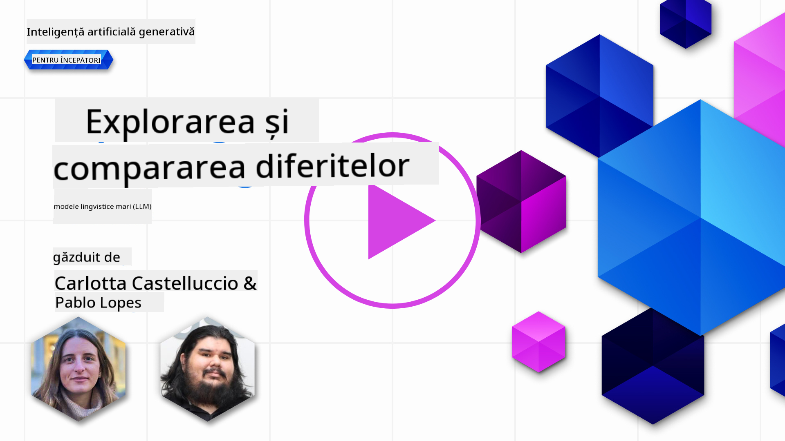](https://aka.ms/gen-ai-lesson2-gh?WT.mc_id=academic-105485-koreyst)

> _Click pe imaginea de mai sus pentru a viziona videoclipul acestei lecții_

În lecția anterioară, am văzut cum Inteligența Artificială Generativă schimbă peisajul tehnologic, cum funcționează Modelele Lingvistice de Mare Anvergură (LLM-uri) și cum o afacere - precum startup-ul nostru - le poate aplica în cazurile lor de utilizare și poate crește! În acest capitol, ne propunem să comparăm și să contrastăm diferite tipuri de modele lingvistice de mare anvergură (LLM-uri) pentru a înțelege avantajele și dezavantajele acestora.

Următorul pas în călătoria startup-ului nostru este explorarea peisajului actual al LLM-urilor și înțelegerea celor potrivite pentru cazul nostru de utilizare.

## Introducere

Această lecție va acoperi:

- Diferite tipuri de LLM-uri în peisajul actual.
- Testarea, iterarea și compararea diferitelor modele pentru cazul tău de utilizare în Azure.
- Cum să implementezi un LLM.

## Obiective de învățare

După finalizarea acestei lecții, vei putea:

- Să selectezi modelul potrivit pentru cazul tău de utilizare.
- Să înțelegi cum să testezi, să iterezi și să îmbunătățești performanța modelului tău.
- Să știi cum afacerile implementează modele.

## Înțelegerea diferitelor tipuri de LLM-uri

LLM-urile pot avea multiple categorii bazate pe arhitectura lor, datele de antrenament și cazul de utilizare. Înțelegerea acestor diferențe va ajuta startup-ul nostru să selecteze modelul potrivit pentru scenariul dat și să înțeleagă cum să testeze, să itereze și să îmbunătățească performanța.

Există multe tipuri diferite de modele LLM, alegerea modelului depinde de ceea ce dorești să le folosești, de datele tale, cât ești dispus să plătești și altele.

În funcție de dacă dorești să folosești modelele pentru text, audio, video, generare de imagini și așa mai departe, s-ar putea să optezi pentru un tip diferit de model.

- **Recunoașterea audio și a vorbirii**. Pentru acest scop, modelele de tip Whisper sunt o alegere excelentă deoarece sunt de uz general și vizează recunoașterea vorbirii. Este antrenat pe diverse audio și poate efectua recunoaștere multilingvă a vorbirii. Află mai multe despre [modelele de tip Whisper aici](https://platform.openai.com/docs/models/whisper?WT.mc_id=academic-105485-koreyst).

- **Generarea de imagini**. Pentru generarea de imagini, DALL-E și Midjourney sunt două alegeri foarte cunoscute. DALL-E este oferit de Azure OpenAI. [Citește mai multe despre DALL-E aici](https://platform.openai.com/docs/models/dall-e?WT.mc_id=academic-105485-koreyst) și de asemenea în Capitolul 9 al acestui curriculum.

- **Generarea de text**. Majoritatea modelelor sunt antrenate pe generarea de text și ai o varietate largă de alegeri de la GPT-3.5 la GPT-4. Vin la costuri diferite, GPT-4 fiind cel mai scump. Merită să te uiți în [Azure OpenAI playground](https://oai.azure.com/portal/playground?WT.mc_id=academic-105485-koreyst) pentru a evalua care modele se potrivesc cel mai bine nevoilor tale în termeni de capacitate și cost.

- **Multi-modalitate**. Dacă dorești să gestionezi mai multe tipuri de date în intrare și ieșire, s-ar putea să dorești să te uiți la modele precum [gpt-4 turbo cu viziune sau gpt-4o](https://learn.microsoft.com/azure/ai-services/openai/concepts/models#gpt-4-and-gpt-4-turbo-models?WT.mc_id=academic-105485-koreyst) - cele mai recente versiuni ale modelelor OpenAI - care sunt capabile să combine procesarea limbajului natural cu înțelegerea vizuală, permițând interacțiuni prin interfețe multi-modale.

Selectarea unui model înseamnă că obții unele capacități de bază, care s-ar putea să nu fie suficiente însă. Deseori ai date specifice companiei pe care trebuie să le comunici cumva LLM-ului. Există câteva alegeri diferite despre cum să abordezi asta, mai multe despre asta în secțiunile următoare.

### Modele Fundamentale versus LLM-uri

Termenul Model Fundamental a fost [inventat de cercetătorii de la Stanford](https://arxiv.org/abs/2108.07258?WT.mc_id=academic-105485-koreyst) și definit ca un model AI care urmează anumite criterii, cum ar fi:

- **Sunt antrenate folosind învățarea nesupravegheată sau învățarea auto-supravegheată**, adică sunt antrenate pe date multi-modale neetichetate și nu necesită adnotări sau etichetări umane ale datelor pentru procesul lor de antrenament.
- **Sunt modele foarte mari**, bazate pe rețele neuronale foarte adânci antrenate pe miliarde de parametri.
- **Sunt de obicei destinate să servească drept ‘fundament’ pentru alte modele**, adică pot fi folosite ca punct de plecare pentru alte modele care să fie construite pe deasupra, ceea ce se poate face prin ajustare fină.

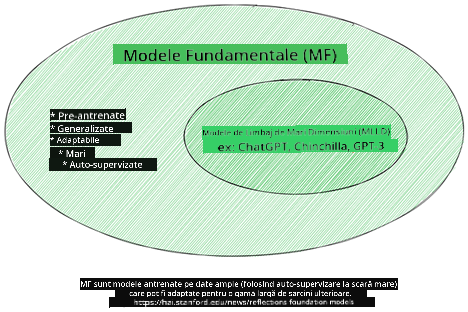

Sursa imaginii: [Ghid esențial pentru Modele Fundamentale și Modele Lingvistice de Mare Anvergură | de Babar M Bhatti | Medium](https://thebabar.medium.com/essential-guide-to-foundation-models-and-large-language-models-27dab58f7404)

Pentru a clarifica mai bine această distincție, să luăm ChatGPT ca exemplu. Pentru a construi prima versiune a ChatGPT, un model numit GPT-3.5 a servit drept model fundamental. Aceasta înseamnă că OpenAI a folosit unele date specifice pentru chat pentru a crea o versiune ajustată a GPT-3.5 care era specializată în a performa bine în scenarii de conversație, cum ar fi chatbot-uri.

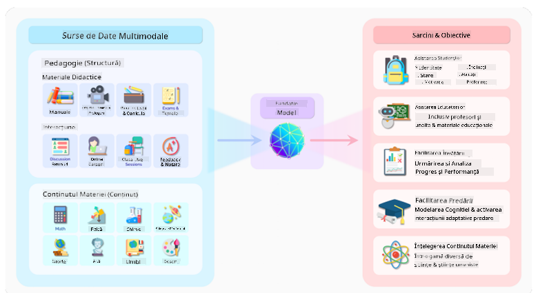

Sursa imaginii: [2108.07258.pdf (arxiv.org)](https://arxiv.org/pdf/2108.07258.pdf?WT.mc_id=academic-105485-koreyst)

### Modele Open Source versus Modele Proprietare

O altă modalitate de a categoriza LLM-urile este dacă sunt open source sau proprietare.

Modelele open-source sunt modele care sunt puse la dispoziția publicului și pot fi utilizate de oricine. Acestea sunt adesea puse la dispoziție de compania care le-a creat sau de comunitatea de cercetare. Aceste modele sunt permise să fie inspectate, modificate și personalizate pentru diversele cazuri de utilizare în LLM-uri. Cu toate acestea, nu sunt întotdeauna optimizate pentru utilizarea în producție și s-ar putea să nu fie la fel de performante ca modelele proprietare. În plus, finanțarea pentru modelele open-source poate fi limitată și s-ar putea să nu fie întreținute pe termen lung sau să nu fie actualizate cu cele mai recente cercetări. Exemple de modele open-source populare includ [Alpaca](https://crfm.stanford.edu/2023/03/13/alpaca.html?WT.mc_id=academic-105485-koreyst), [Bloom](https://huggingface.co/bigscience/bloom) și [LLaMA](https://llama.meta.com).

Modelele proprietare sunt modele care sunt deținute de o companie și nu sunt puse la dispoziția publicului. Aceste modele sunt adesea optimizate pentru utilizarea în producție. Cu toate acestea, nu sunt permise să fie inspectate, modificate sau personalizate pentru diferite cazuri de utilizare. În plus, nu sunt întotdeauna disponibile gratuit și pot necesita un abonament sau o plată pentru a fi utilizate. De asemenea, utilizatorii nu au control asupra datelor folosite pentru antrenarea modelului, ceea ce înseamnă că ar trebui să aibă încredere în deținătorul modelului pentru a asigura angajamentul față de confidențialitatea datelor și utilizarea responsabilă a AI. Exemple de modele proprietare populare includ [Modelele OpenAI](https://platform.openai.com/docs/models/overview?WT.mc_id=academic-105485-koreyst), [Google Bard](https://sapling.ai/llm/bard?WT.mc_id=academic-105485-koreyst) sau [Claude 2](https://www.anthropic.com/index/claude-2?WT.mc_id=academic-105485-koreyst).

### Încorporare versus Generare de imagini versus Generare de text și cod

LLM-urile pot fi de asemenea categorisite după tipul de ieșire pe care o generează.

Încorporările sunt un set de modele care pot converti textul într-o formă numerică, numită încorporare, care este o reprezentare numerică a textului de intrare. Încorporările facilitează înțelegerea relațiilor dintre cuvinte sau propoziții de către mașini și pot fi consumate ca intrări de către alte modele, cum ar fi modelele de clasificare sau modelele de grupare care au o performanță mai bună pe date numerice. Modelele de încorporare sunt adesea folosite pentru învățarea transferului, unde un model este construit pentru o sarcină surrogate pentru care există o abundență de date, iar apoi greutățile modelului (încorporările) sunt reutilizate pentru alte sarcini ulterioare. Un exemplu din această categorie este [Încorporările OpenAI](https://platform.openai.com/docs/models/embeddings?WT.mc_id=academic-105485-koreyst).

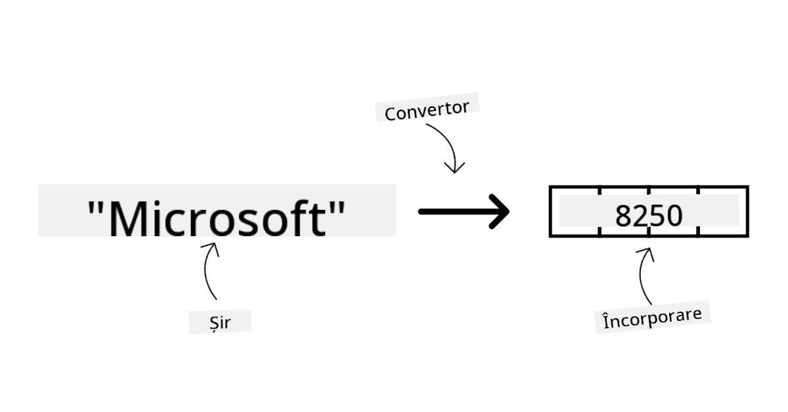

Modelele de generare de imagini sunt modele care generează imagini. Aceste modele sunt adesea folosite pentru editarea imaginilor, sinteza imaginilor și traducerea imaginilor. Modelele de generare de imagini sunt adesea antrenate pe seturi mari de date de imagini, cum ar fi [LAION-5B](https://laion.ai/blog/laion-5b/?WT.mc_id=academic-105485-koreyst), și pot fi folosite pentru a genera imagini noi sau pentru a edita imagini existente cu tehnici de pictură, super-rezoluție și colorare. Exemple includ [DALL-E-3](https://openai.com/dall-e-3?WT.mc_id=academic-105485-koreyst) și [Modele de difuzie stabilă](https://github.com/Stability-AI/StableDiffusion?WT.mc_id=academic-105485-koreyst).

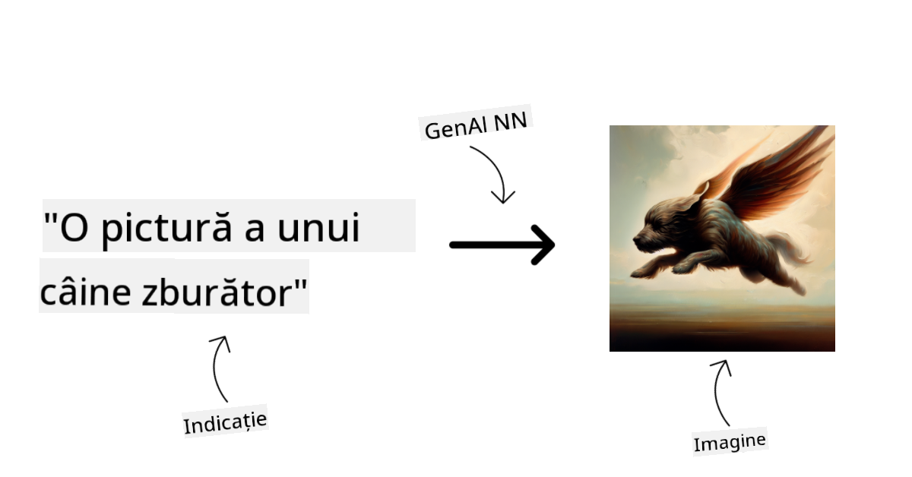

Modelele de generare de text și cod sunt modele care generează text sau cod. Aceste modele sunt adesea folosite pentru sumarizarea textului, traducere și răspuns la întrebări. Modelele de generare de text sunt adesea antrenate pe seturi mari de date de text, cum ar fi [BookCorpus](https://www.cv-foundation.org/openaccess/content_iccv_2015/html/Zhu_Aligning_Books_and_ICCV_2015_paper.html?WT.mc_id=academic-105485-koreyst), și pot fi folosite pentru a genera text nou sau pentru a răspunde la întrebări. Modelele de generare de cod, cum ar fi [CodeParrot](https://huggingface.co/codeparrot?WT.mc_id=academic-105485-koreyst), sunt adesea antrenate pe seturi mari de date de cod, cum ar fi GitHub, și pot fi folosite pentru a genera cod nou sau pentru a corecta erori în codul existent.

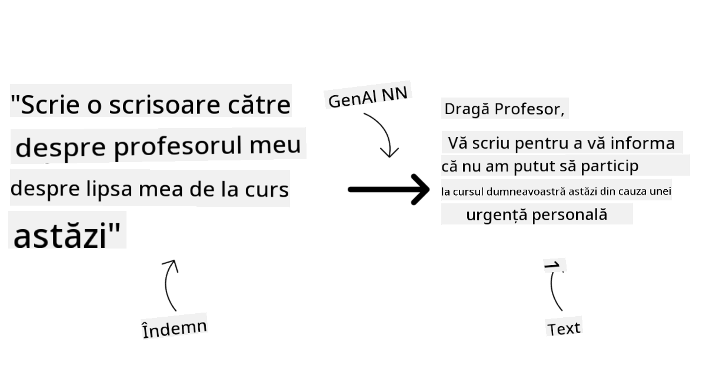

### Encoder-Decoder versus doar Decoder

Pentru a discuta despre diferitele tipuri de arhitecturi ale LLM-urilor, să folosim o analogie.

Imaginează-ți că managerul tău ți-a dat o sarcină de a scrie un quiz pentru studenți. Ai doi colegi; unul se ocupă de crearea conținutului și celălalt de revizuirea acestuia.

Creatorul de conținut este ca un model doar Decoder, el poate privi subiectul și vedea ce ai scris deja și apoi poate scrie un curs pe baza acestuia. Ei sunt foarte buni la scrierea de conținut captivant și informativ, dar nu sunt foarte buni la înțelegerea subiectului și a obiectivelor de învățare. Unele exemple de modele Decoder sunt modelele din familia GPT, cum ar fi GPT-3.

Revisorul este ca un model doar Encoder, el privește cursul scris și răspunsurile, observând relația dintre ele și înțelegând contextul, dar nu este bun la generarea de conținut. Un exemplu de model doar Encoder ar fi BERT.

Imaginează-ți că putem avea pe cineva care ar putea crea și revizui quiz-ul, acesta este un model Encoder-Decoder. Unele exemple ar fi BART și T5.

### Serviciu versus Model

Acum, să vorbim despre diferența dintre un serviciu și un model. Un serviciu este un produs oferit de un Furnizor de Servicii Cloud și este adesea o combinație de modele, date și alte componente. Un model este componenta de bază a unui serviciu și este adesea un model fundamental, cum ar fi un LLM.

Serviciile sunt adesea optimizate pentru utilizarea în producție și sunt adesea mai ușor de utilizat decât modelele, printr-o interfață grafică. Cu toate acestea, serviciile nu sunt întotdeauna disponibile gratuit și pot necesita un abonament sau o plată pentru a fi utilizate, în schimbul folosirii echipamentului și resurselor deținătorului serviciului, optimizând cheltuielile și scalând ușor. Un exemplu de serviciu este [Azure OpenAI Service](https://learn.microsoft.com/azure/ai-services/openai/overview?WT.mc_id=academic-105485-koreyst), care oferă un plan de tarifare pay-as-you-go, ceea ce înseamnă că utilizatorii sunt taxați proporțional cu cât folosesc serviciul. De asemenea, Azure OpenAI Service oferă securitate de grad enterprise și un cadru AI responsabil pe deasupra capacităților modelelor.

Modelele sunt doar Rețeaua Neuronală, cu parametrii, greutățile și altele. Permițând companiilor să ruleze local, însă, ar trebui să cumpere echipament, să construiască o structură pentru scalare și să cumpere o licență sau să folosească un model open-source. Un model precum LLaMA este disponibil pentru a fi folosit, necesitând putere computațională pentru a rula modelul.

## Cum să testezi și să iterezi cu diferite modele pentru a înțelege performanța pe Azure

Odată ce echipa noastră a explorat peisajul actual al LLM-urilor și a identificat câțiva candidați buni pentru scenariile lor, următorul pas este testarea acestora pe datele lor și pe sarcina lor de lucru. Acesta este un proces iterativ, realizat prin experimente și măsurători.
Majoritatea modelelor pe care le-am menționat în paragrafele anterioare (modelele OpenAI, modelele open-source precum Llama2 și transformatoarele Hugging Face) sunt disponibile în [Catalogul de modele](https://learn.microsoft.com/azure/ai-studio/how-to/model-catalog-overview?WT.mc_id=academic-105485-koreyst) în [Azure AI Studio](https://ai.azure.com/?WT.mc_id=academic-105485-koreyst).

[Azure AI Studio](https://learn.microsoft.com/azure/ai-studio/what-is-ai-studio?WT.mc_id=academic-105485-koreyst) este o Platformă Cloud proiectată pentru dezvoltatori pentru a construi aplicații AI generative și pentru a gestiona întregul ciclu de dezvoltare - de la experimentare la evaluare - prin combinarea tuturor serviciilor AI Azure într-un singur hub cu o interfață grafică ușor de utilizat. Catalogul de modele din Azure AI Studio permite utilizatorului să:

- Găsească Modelul Fundamental de interes în catalog - fie proprietar, fie open-source, filtrând după sarcină, licență sau nume. Pentru a îmbunătăți căutarea, modelele sunt organizate în colecții, precum colecția Azure OpenAI, colecția Hugging Face și altele.

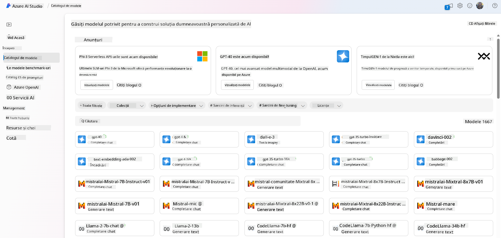

- Revizuiește cardul modelului, inclusiv o descriere detaliată a utiliz
- Compară benchmark-urile între modele și seturi de date disponibile în industrie pentru a evalua care se potrivește scenariului de afaceri, prin panoul [Model Benchmarks](https://learn.microsoft.com/azure/ai-studio/how-to/model-benchmarks?WT.mc_id=academic-105485-koreyst).

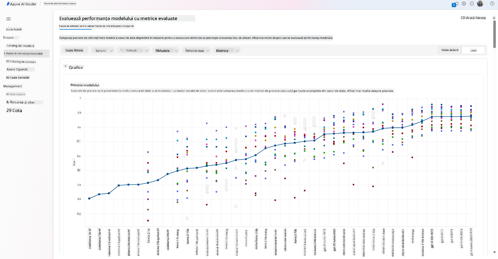

- Ajustează modelul pe date de antrenament personalizate pentru a îmbunătăți performanța modelului într-o sarcină specifică, folosind capacitățile de experimentare și urmărire ale Azure AI Studio.

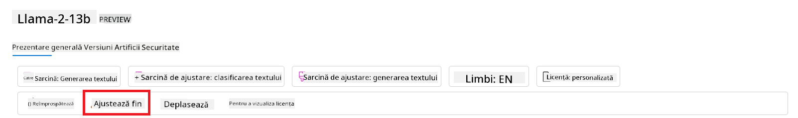

- Desfășoară modelul original pre-antrenat sau versiunea ajustată pentru inferență în timp real la distanță - calcul gestionat - sau punct de acces API fără server - [pay-as-you-go](https://learn.microsoft.com/azure/ai-studio/how-to/model-catalog-overview#model-deployment-managed-compute-and-serverless-api-pay-as-you-go?WT.mc_id=academic-105485-koreyst) - pentru a permite aplicațiilor să îl consume.

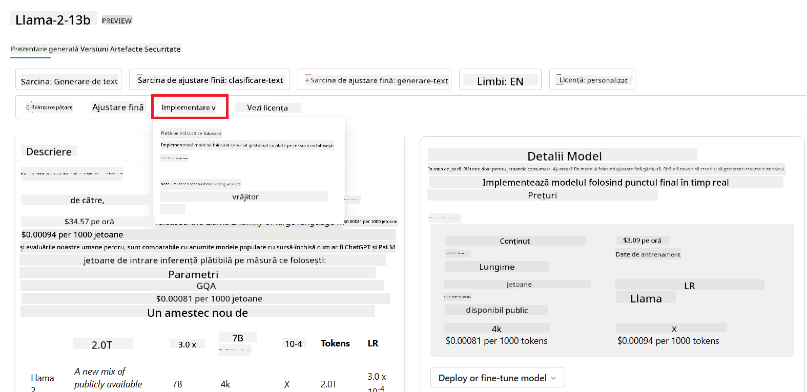

> [!NOTE]
> Nu toate modelele din catalog sunt disponibile în prezent pentru ajustare și/sau desfășurare pay-as-you-go. Verifică cardul modelului pentru detalii despre capacitățile și limitările modelului.

## Îmbunătățirea rezultatelor LLM

Am explorat cu echipa noastră de startup diferite tipuri de LLM-uri și o Platformă Cloud (Azure Machine Learning) care ne permite să comparăm diferite modele, să le evaluăm pe date de test, să îmbunătățim performanța și să le desfășurăm pe puncte de inferență.

Dar când ar trebui să considere ajustarea unui model în loc de utilizarea unuia pre-antrenat? Există alte abordări pentru a îmbunătăți performanța modelului pe sarcini specifice?

Există mai multe abordări pe care o afacere le poate folosi pentru a obține rezultatele dorite de la un LLM. Poți selecta diferite tipuri de modele cu diferite grade de antrenament atunci când desfășori un LLM în producție, cu diferite niveluri de complexitate, cost și calitate. Iată câteva abordări diferite:

- **Ingineria prompt-ului cu context**. Ideea este să oferi suficient context atunci când lansezi prompt-ul pentru a te asigura că primești răspunsurile de care ai nevoie.

- **Generarea augmentată prin recuperare, RAG**. Datele tale ar putea exista într-o bază de date sau punct de acces web, de exemplu, pentru a te asigura că aceste date, sau un subset al lor, sunt incluse în momentul lansării prompt-ului, poți prelua datele relevante și le poți face parte din prompt-ul utilizatorului.

- **Model ajustat**. Aici, ai antrenat modelul mai departe pe datele tale, ceea ce a dus la un model mai exact și mai receptiv la nevoile tale, dar ar putea fi costisitor.

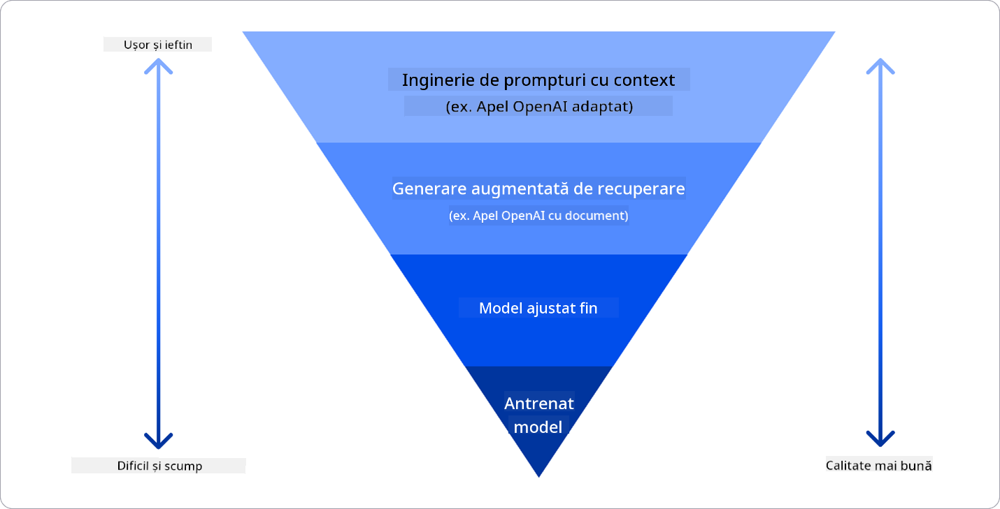

Sursa imaginii: [Four Ways that Enterprises Deploy LLMs | Fiddler AI Blog](https://www.fiddler.ai/blog/four-ways-that-enterprises-deploy-llms?WT.mc_id=academic-105485-koreyst)

### Ingineria Prompt-ului cu Context

LLM-urile pre-antrenate funcționează foarte bine pe sarcini generalizate de limbaj natural, chiar și atunci când sunt apelate cu un prompt scurt, precum o propoziție de completat sau o întrebare – așa-numita învățare „zero-shot”.

Cu toate acestea, cu cât utilizatorul poate încadra mai bine interogarea sa, cu o cerere detaliată și exemple – Contextul – cu atât răspunsul va fi mai precis și mai apropiat de așteptările utilizatorului. În acest caz, vorbim despre învățare „one-shot” dacă prompt-ul include doar un exemplu și „few shot learning” dacă include mai multe exemple.
Ingineria prompt-ului cu context este cea mai rentabilă abordare pentru a începe.

### Generarea Augmentată prin Recuperare (RAG)

LLM-urile au limitarea că pot folosi doar datele care au fost utilizate în timpul antrenamentului lor pentru a genera un răspuns. Aceasta înseamnă că nu știu nimic despre faptele care s-au întâmplat după procesul lor de antrenament și nu pot accesa informații non-publice (cum ar fi datele companiei).
Aceasta poate fi depășită prin RAG, o tehnică care mărește prompt-ul cu date externe sub formă de bucăți de documente, luând în considerare limitele de lungime ale prompt-ului. Aceasta este susținută de instrumente de bază de date Vector (cum ar fi [Azure Vector Search](https://learn.microsoft.com/azure/search/vector-search-overview?WT.mc_id=academic-105485-koreyst)) care recuperează bucățile utile din surse de date predefinite variate și le adaugă la Contextul prompt-ului.

Această tehnică este foarte utilă atunci când o afacere nu are suficiente date, suficient timp sau resurse pentru a ajusta un LLM, dar totuși dorește să îmbunătățească performanța pe o sarcină specifică și să reducă riscurile de fabricare, adică mistificarea realității sau conținutul dăunător.

### Model ajustat

Ajustarea este un proces care folosește învățarea transferului pentru a ‘adapta’ modelul la o sarcină ulterioară sau pentru a rezolva o problemă specifică. Diferit de învățarea few-shot și RAG, rezultă într-un nou model generat, cu greutăți și biais-uri actualizate. Necesită un set de exemple de antrenament constând dintr-o singură intrare (prompt-ul) și ieșirea asociată (completarea).
Aceasta ar fi abordarea preferată dacă:

- **Utilizarea modelelor ajustate**. O afacere ar dori să folosească modele ajustate mai puțin capabile (cum ar fi modelele de încorporare) în loc de modele de înaltă performanță, rezultând într-o soluție mai rentabilă și rapidă.

- **Considerarea latenței**. Latența este importantă pentru un caz de utilizare specific, astfel încât nu este posibil să se utilizeze prompt-uri foarte lungi sau numărul de exemple care ar trebui învățate de model nu se potrivește cu limita de lungime a prompt-ului.

- **Menținerea la zi**. O afacere are o mulțime de date de înaltă calitate și etichete de adevăr și resursele necesare pentru a menține aceste date la zi în timp.

### Model antrenat

Antrenarea unui LLM de la zero este fără îndoială cea mai dificilă și cea mai complexă abordare de adoptat, necesitând cantități masive de date, resurse calificate și putere computațională adecvată. Această opțiune ar trebui luată în considerare doar într-un scenariu în care o afacere are un caz de utilizare specific domeniului și o cantitate mare de date centrate pe domeniu.

## Verificarea cunoștințelor

Ce ar putea fi o abordare bună pentru a îmbunătăți rezultatele completării LLM?

1. Ingineria prompt-ului cu context
1. RAG
1. Model ajustat

A:3, dacă ai timp și resurse și date de înaltă calitate, ajustarea este opțiunea mai bună pentru a rămâne la zi. Cu toate acestea, dacă te uiți la îmbunătățirea lucrurilor și îți lipsește timpul, merită să iei în considerare RAG mai întâi.

## 🚀 Provocare

Citește mai multe despre cum poți [utiliza RAG](https://learn.microsoft.com/azure/search/retrieval-augmented-generation-overview?WT.mc_id=academic-105485-koreyst) pentru afacerea ta.

## Lucru excelent, continuă învățarea

După ce ai finalizat această lecție, verifică colecția noastră de [Învățare AI Generativă](https://aka.ms/genai-collection?WT.mc_id=academic-105485-koreyst) pentru a continua să îți îmbunătățești cunoștințele despre AI Generativă!

Mergi la Lecția 3 unde vom analiza cum să [construiești cu AI Generativă Responsabil](../03-using-generative-ai-responsibly/README.md?WT.mc_id=academic-105485-koreyst)!

**Declinarea responsabilității**:  
Acest document a fost tradus folosind serviciul de traducere AI [Co-op Translator](https://github.com/Azure/co-op-translator). Deși ne străduim să asigurăm acuratețea, vă rugăm să fiți conștienți că traducerile automate pot conține erori sau inexactități. Documentul original în limba sa natală ar trebui considerat sursa autoritară. Pentru informații critice, se recomandă traducerea umană profesională. Nu suntem responsabili pentru eventualele neînțelegeri sau interpretări greșite care pot apărea din utilizarea acestei traduceri.