# Explorarea și compararea diferitelor LLM-uri

> _Faceți clic pe imaginea de mai sus pentru a viziona video lecției_

În lecția anterioară, am văzut cum Inteligența Artificială Generativă schimbă peisajul tehnologic, cum funcționează Modelele Mari de Limbaj (LLM-uri) și cum o afacere — precum startup-ul nostru — le poate aplica în cazurile lor de utilizare și poate crește! În acest capitol, vom compara și vom evidenția diferențele dintre diferite tipuri de modele mari de limbaj (LLM-uri) pentru a înțelege avantajele și dezavantajele lor.

Pasul următor în călătoria startup-ului nostru este explorarea peisajului actual al LLM-urilor și înțelegerea care sunt potrivite pentru cazul nostru de utilizare.

## Introducere

Această lecție va acoperi:

- Diferite tipuri de LLM-uri în peisajul actual.
- Testarea, iterarea și compararea diferitelor modele pentru cazul tău de utilizare în Azure.
- Cum să implementezi un LLM.

## Obiective de învățare

După ce vei finaliza această lecție, vei putea:

- Să selectezi modelul potrivit pentru cazul tău de utilizare.
- Să înțelegi cum să testezi, să iterezi și să îmbunătățești performanța modelului tău.
- Să știi cum afacerile implementează modelele.

## Înțelegerea diferitelor tipuri de LLM-uri

LLM-urile pot avea multiple categorii bazate pe arhitectura lor, datele de antrenament și cazul lor de utilizare. Înțelegerea acestor diferențe ne va ajuta startup-ul să selecteze modelul potrivit pentru scenariu și să înțeleagă cum să testeze, să itereze și să îmbunătățească performanța.

Există multe tipuri diferite de modele LLM, alegerea ta depinde de scopul pentru care vrei să le folosești, de datele tale, de cât ești dispus să plătești și altele.

În funcție de dacă vrei să folosești modelele pentru text, audio, video, generare de imagini și așa mai departe, poate vei opta pentru un alt tip de model.

- **Reconducerea audio și recunoașterea vocală**. Modelele de tip Whisper sunt încă utile ca modele generale pentru recunoaștere vocală, dar opțiunile de producție includ acum și modele de tip speech-to-text mai noi precum `gpt-4o-transcribe`, `gpt-4o-mini-transcribe` și variante de diarizare. Evaluează acoperirea limbilor, diarizarea, suportul în timp real, latența și costurile pentru scenariul tău. Află mai multe în documentația [OpenAI speech-to-text](https://platform.openai.com/docs/guides/speech-to-text?WT.mc_id=academic-105485-koreyst).

- **Generare de imagini**. DALL-E și Midjourney sunt opțiuni cunoscute pentru generare de imagini, dar actualele API-uri OpenAI se concentrează pe modelele de imagini GPT precum `gpt-image-2`, în timp ce Stable Diffusion, Imagen, Flux și alte familii de modele sunt, de asemenea, opțiuni comune. Compară adeziunea la prompt, suportul pentru editare, controlul stilului, cerințele de securitate și licențierea. Află mai multe în [Ghidul pentru generarea de imagini OpenAI](https://platform.openai.com/docs/guides/images?WT.mc_id=academic-105485-koreyst) și în Capitolul 9 al acestui curriculum.

- **Generare de text**. Modelele de text includ acum modele inovatoare, modele de raționament, modele mai mici cu latență redusă și modele cu greutate deschisă. Exemple actuale includ modelele OpenAI GPT-5.x, modelele Anthropic Claude 4.x, modelele Google Gemini 3.x, modelele Meta Llama 4 și modelele Mistral. Nu alege doar după data lansării sau preț; compară calitatea sarcinii, latența, fereastra de context, utilizarea uneltelor, comportamentul de siguranță, disponibilitatea regională și costul total. Catalogul de modele [Microsoft Foundry](https://ai.azure.com/catalog?WT.mc_id=academic-105485-koreyst) este un loc bun să compari modelele disponibile în Azure.

- **Multi-modalitate**. Multe modele actuale pot procesa mai mult decât text. Unele acceptă intrări de imagini, audio sau video; unele pot apela unelte; iar modelele specializate pot genera imagini, audio sau video. De exemplu, modelele curente OpenAI suportă input text și imagine, modelele Gemini pot suporta text, cod, imagine, audio și video în funcție de variantă, iar Llama 4 Scout și Maverick sunt modele open-weight nativ multimodale. Verifică întotdeauna fiecare fișă de model pentru modalitățile suportate de intrare și ieșire înainte de a construi un flux de lucru în jurul lui.

Alegerea unui model înseamnă că primești anumite capacități de bază, care însă s-ar putea să nu fie suficiente. Adesea ai date specifice companiei despre care trebuie cumva să informezi LLM-ul. Există câteva opțiuni diferite pentru a aborda asta, despre care vom discuta în secțiunile următoare.

### Modele fundamentale versus LLM-uri

Termenul Model Fundamental a fost [inventat de cercetători de la Stanford](https://arxiv.org/abs/2108.07258?WT.mc_id=academic-105485-koreyst) și definit ca un model AI care respectă anumite criterii, precum:

- **Sunt antrenate folosind învățare nesupravegheată sau auto-supravegheată**, ceea ce înseamnă că sunt antrenate pe date multimodale fără etichetă, fără a necesita adnotări sau etichetări umane pentru procesul lor de antrenament.
- **Sunt modele foarte mari**, bazate pe rețele neuronale foarte adânci antrenate pe miliarde de parametri.
- **De obicei sunt destinate să servească ca „fundament” pentru alte modele**, adică pot fi folosite ca punct de plecare pentru alte modele care pot fi apoi rafinate prin finetuning.

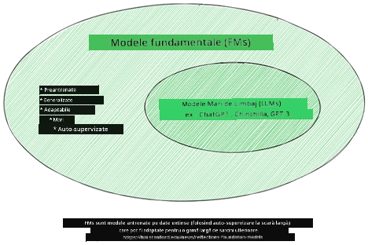

Sursa imaginii: [Essential Guide to Foundation Models and Large Language Models | de Babar M Bhatti | Medium
](https://thebabar.medium.com/essential-guide-to-foundation-models-and-large-language-models-27dab58f7404)

Pentru a clarifica mai mult această distincție, să luăm ChatGPT ca exemplu istoric. Versiunile timpurii ale ChatGPT au folosit GPT-3.5 ca model fundamental. OpenAI a folosit apoi date și tehnici de aliniere specifice chat-ului pentru a crea o versiune adaptată care performa mai bine în scenarii conversaționale, precum chatboții. Serviciile AI moderne deseori alternează între mai multe variante de modele, așa că numele serviciului și numele modelului de bază nu sunt întotdeauna aceleași.

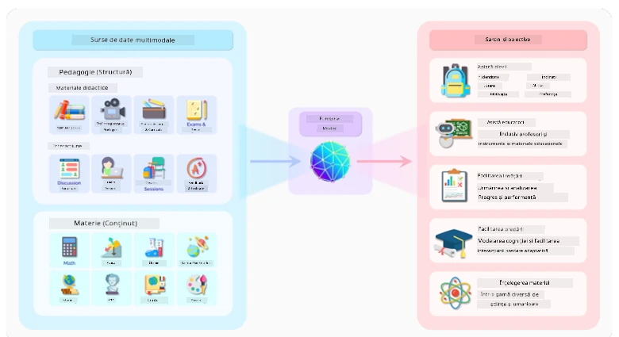

Sursa imaginii: [2108.07258.pdf (arxiv.org)](https://arxiv.org/pdf/2108.07258.pdf?WT.mc_id=academic-105485-koreyst)

### Modele open-weight/open-source versus modele proprietare

O altă modalitate de a categorisi LLM-urile este dacă sunt open-weight, open-source sau proprietare.

Modelele open-source și open-weight fac artefactele modelului disponibile pentru inspecție, descărcare sau personalizare, dar licențele lor diferă. Unele sunt complet open source, în timp ce altele sunt modele open-weight cu restricții de utilizare. Pot fi utile când o afacere are nevoie de mai mult control asupra implementării, localizării datelor, costurilor sau personalizării. Totuși, echipele trebuie să verifice termenii licenței, costurile de servire, mentenanța, actualizările de securitate și calitatea evaluării înainte de a le folosi în producție. Exemple includ [Meta Llama 4](https://ai.meta.com/blog/llama-4-multimodal-intelligence/?WT.mc_id=academic-105485-koreyst), unele [modele Mistral](https://docs.mistral.ai/models/overview?WT.mc_id=academic-105485-koreyst) și multe modele găzduite pe [Hugging Face](https://huggingface.co/models?WT.mc_id=academic-105485-koreyst).

Modelele proprietare sunt deținute și găzduite de un furnizor. Aceste modele sunt adesea optimizate pentru utilizarea gestionată în producție și pot oferi suport puternic, sisteme de siguranță, integrare de unelte și scalabilitate. Totuși, clienții de obicei nu pot inspecta sau modifica greutățile modelului și trebuie să analizeze termenii furnizorului privind confidențialitatea, retenția, conformitatea și utilizarea acceptabilă. Exemple includ [modelele OpenAI](https://platform.openai.com/docs/models?WT.mc_id=academic-105485-koreyst), [Google Gemini](https://deepmind.google/models/gemini/pro/?WT.mc_id=academic-105485-koreyst) și [Anthropic Claude](https://platform.claude.com/docs/en/about-claude/models/overview?WT.mc_id=academic-105485-koreyst).

### Embedding versus generare de imagini versus generare de text și cod

LLM-urile pot fi de asemenea categorisite după tipul de output pe care îl generează.

Embedding-urile sunt un set de modele care pot converti textul într-o formă numerică, numită embedding, o reprezentare numerică a textului de intrare. Embedding-urile facilitează înțelegerea relațiilor dintre cuvinte sau fraze de către mașini și pot fi folosite ca intrări pentru alte modele, cum ar fi modelele de clasificare sau modelele de clustering care au performanțe mai bune pe date numerice. Modelele embedding sunt adesea folosite pentru transfer learning, unde un model este creat pentru o sarcină surrogate pentru care există o abundență de date, iar apoi greutățile modelului (embedding-urile) sunt reutilizate pentru alte sarcini ulterioare. Un exemplu din această categorie este [embedding-urile OpenAI](https://platform.openai.com/docs/models/embeddings?WT.mc_id=academic-105485-koreyst).

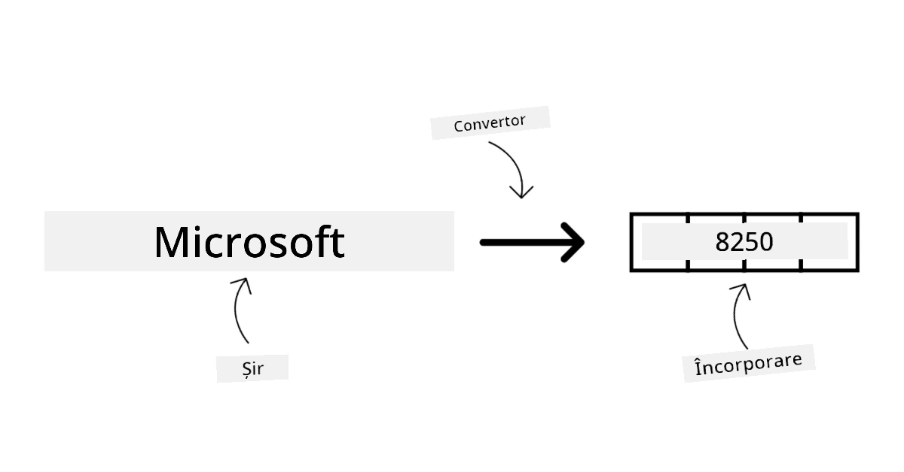

Modelele de generare de imagini sunt modele care generează imagini. Aceste modele sunt adesea folosite pentru editare de imagini, sinteză de imagini și traducere de imagini. Modelele de generare de imagini sunt antrenate adesea pe seturi mari de date imagistice, precum [LAION-5B](https://laion.ai/blog/laion-5b/?WT.mc_id=academic-105485-koreyst), și pot fi folosite pentru a crea imagini noi sau pentru a edita imagini existente prin inpainting, super-rezoluție și tehnici de colorizare. Exemple includ [modelele GPT Image](https://platform.openai.com/docs/guides/images?WT.mc_id=academic-105485-koreyst), [modelele Stable Diffusion](https://github.com/Stability-AI/StableDiffusion?WT.mc_id=academic-105485-koreyst) și modelele Imagen.

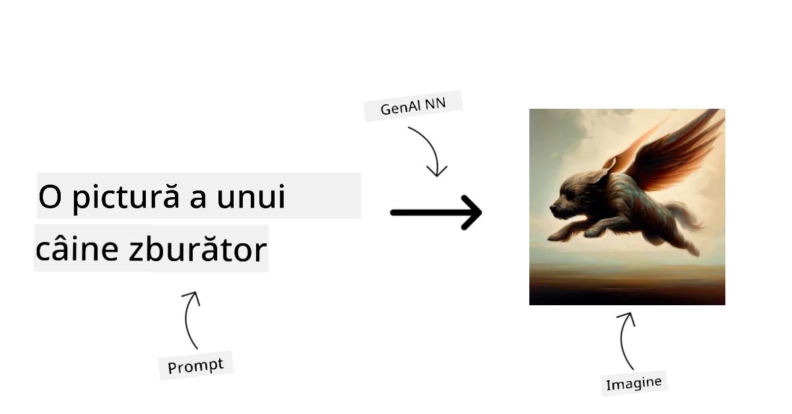

Modelele de generare de text și cod sunt modele care generează text sau cod. Aceste modele sunt adesea folosite pentru sumarizare de text, traducere și răspuns la întrebări. Modelele de generare de text sunt adesea antrenate pe seturi mari de date textuale, cum ar fi [BookCorpus](https://www.cv-foundation.org/openaccess/content_iccv_2015/html/Zhu_Aligning_Books_and_ICCV_2015_paper.html?WT.mc_id=academic-105485-koreyst), și pot fi folosite pentru a genera text nou sau pentru a răspunde la întrebări. Modelele de generare cod, cum este [CodeParrot](https://huggingface.co/codeparrot?WT.mc_id=academic-105485-koreyst), sunt adesea antrenate pe seturi mari de date de cod, precum GitHub, și pot fi folosite pentru a genera cod nou sau pentru a repara erori în codul existent.

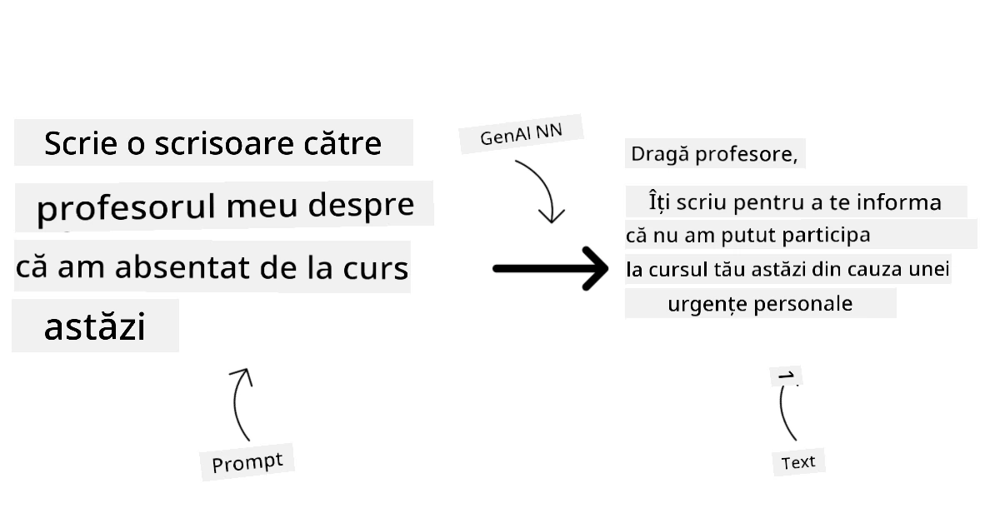

### Encoder-Decoder versus doar Decoder

Pentru a discuta diferitele tipuri de arhitecturi LLM, să folosim o analogie.

Imaginează-ți că managerul tău ți-a dat sarcina de a scrie un quiz pentru studenți. Ai doi colegi; unul se ocupă de crearea conținutului și celălalt de revizuirea acestuia.

Creatorul de conținut este ca un model doar Decoder: poate privi subiectul, vede ce ai scris deja și continuă să genereze conținut pe baza acelui context. Ei sunt foarte buni la a scrie conținut captivant și informativ, dar nu sunt întotdeauna cea mai bună alegere când sarcina este doar să clasifici, să recuperezi sau să codifici informații. Exemple de familii de modele doar Decoder includ modelele GPT și Llama.

Revizorul este ca un model doar Encoder: se uită la cursul scris și răspunsuri, observând relația dintre ele și înțelegând contextul, dar nu este bun la generarea de conținut. Un exemplu de model doar Encoder ar fi BERT.

Imaginează-ți că am putea avea pe cineva care să creeze și să revizuiască quiz-ul, acesta este un model Encoder-Decoder. Câteva exemple ar fi BART și T5.

### Serviciu versus Model

Acum, să vorbim despre diferența dintre un serviciu și un model. Un serviciu este un produs oferit de un furnizor Cloud, și este deseori o combinație de modele, date și alte componente. Un model este componenta de bază a unui serviciu și este de multe ori un model fundamental, cum ar fi un LLM.

Serviciile sunt adesea optimizate pentru utilizarea în producție și sunt adesea mai ușor de folosit decât modelele, printr-o interfață grafică. Totuși, serviciile nu sunt întotdeauna gratuite și pot necesita abonament sau plată pentru utilizare, în schimbul folosirii echipamentelor și resurselor proprietarului serviciului, optimizând cheltuielile și scalabilitatea. Un exemplu de serviciu este [Azure OpenAI Service](https://learn.microsoft.com/azure/ai-services/openai/overview?WT.mc_id=academic-105485-koreyst), care oferă un plan de tarifare pay-as-you-go, adică utilizatorii sunt taxați proporțional cu cât folosesc serviciul. Azure OpenAI Service oferă și securitate de nivel enterprise și un cadru responsabil AI deasupra capabilităților modelelor.

Modelele sunt artefacte ale rețelei neuronale: parametri, greutăți, arhitectură, tokenizer și configurații suport. Rularea unui model local sau într-un mediu privat necesită hardware adecvat, infrastructură de servire, monitorizare și fie o licență compatibilă open-source/open-weight, fie o licență comercială. Modelele open-weight, cum ar fi Llama 4 sau modelele Mistral, pot fi găzduite de sine stătător, însă necesită putere de calcul și expertiză operațională.

## Cum să testezi și să iterezi cu diferite modele pentru a înțelege performanța în Azure

Odată ce echipa noastră a explorat peisajul actual al LLM-urilor și a identificat câțiva candidați buni pentru scenariile lor, pasul următor este testarea acestora pe datele și volumul lor de lucru. Acesta este un proces iterativ, realizat prin experimente și măsurători.
Majoritatea modelelor menționate în paragrafele anterioare (modelele OpenAI, modelele open-weight precum Llama 4 și Mistral, și modelele Hugging Face) sunt disponibile în [Microsoft Foundry Models](https://learn.microsoft.com/azure/foundry/concepts/foundry-models-overview?WT.mc_id=academic-105485-koreyst).

[Microsoft Foundry](https://learn.microsoft.com/azure/foundry/what-is-foundry?WT.mc_id=academic-105485-koreyst), anterior Azure AI Studio/Azure AI Foundry, este o platformă unificată Azure pentru construirea aplicațiilor și agenților AI. Ajută dezvoltatorii să gestioneze ciclul de viață de la experimentare și evaluare până la implementare, monitorizare și guvernanță. Catalogul de modele din Microsoft Foundry permite utilizatorului să:

- Găsească modelul de bază de interes în catalog, incluzând modele vândute de Azure și modele de la parteneri și furnizori din comunitate. Utilizatorii pot filtra după sarcină, furnizor, licență, opțiune de implementare sau nume.

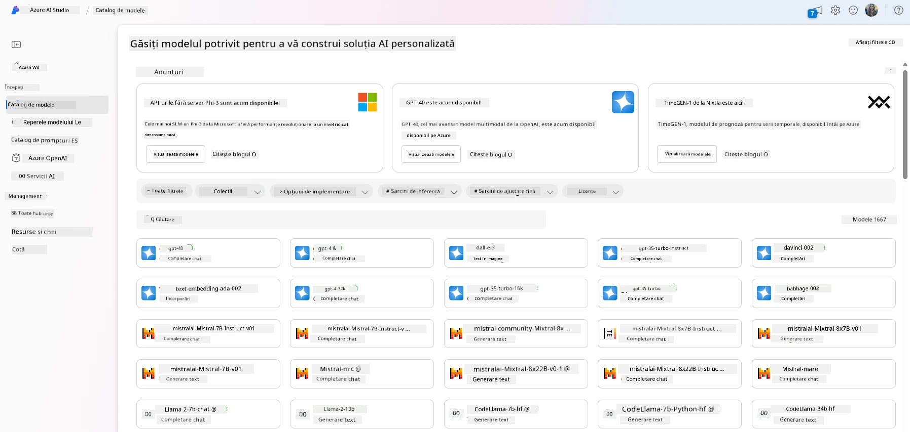

- Revizuiască cardul modelului, incluzând o descriere detaliată a utilizării intenționate și a datelor de antrenament, exemple de cod și rezultate de evaluare din biblioteca internă de evaluări.

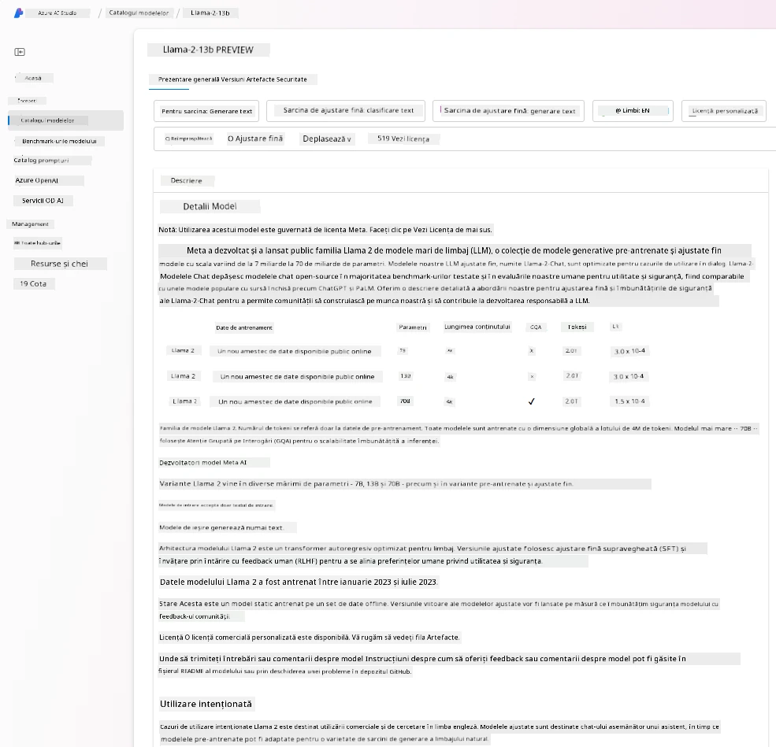

- Compară reperele (benchmarks) între modele și seturi de date disponibile în industrie pentru a evalua care se potrivește scenariului de afaceri, prin panoul [Model Benchmarks](https://learn.microsoft.com/azure/ai-studio/how-to/model-benchmarks?WT.mc_id=academic-105485-koreyst).

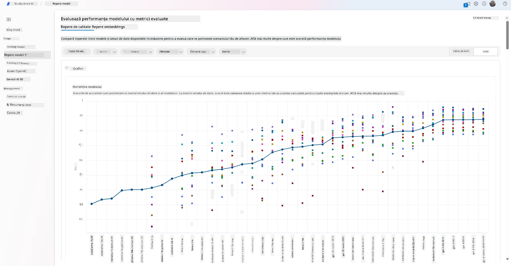

- Efectuează fine-tuning pe modelele suportate folosind date de antrenament personalizate pentru a îmbunătăți performanța modelului într-un volum specific de lucru, profitând de capabilitățile de experimentare și urmărire ale Microsoft Foundry.

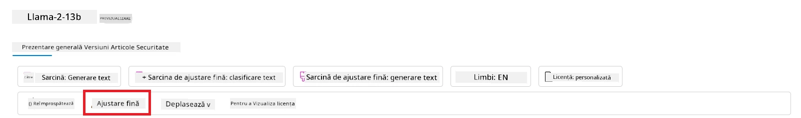

- Implementarea modelului pre-antrenat original sau a versiunii fine-tunate către un endpoint de inferență în timp real în cloud, folosind opțiuni de calcul gestionat sau serverless, pentru a permite aplicațiilor să îl folosească.

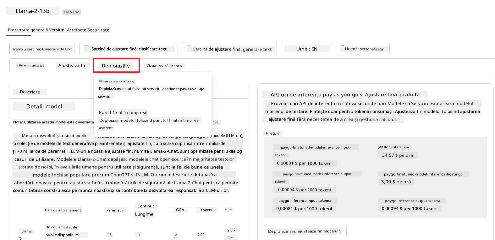

> [!NOTE]
> Nu toate modelele din catalog sunt disponibile în prezent pentru fine-tuning și/sau implementare pay-as-you-go. Verificați cardul modelului pentru detalii despre capabilități și limitările modelului.

## Îmbunătățirea rezultatelor LLM

Am explorat împreună cu echipa noastră de startup diferite tipuri de LLM-uri și o platformă cloud (Microsoft Foundry) care ne permite să comparăm modele diferite, să le evaluăm pe date de test, să îmbunătățim performanța și să le implementăm pe endpointuri de inferență.

Dar când ar trebui să ia în considerare fine-tuning-ul unui model în loc să folosească unul pre-antrenat? Există alte abordări pentru a îmbunătăți performanța modelului pe volumuri specifice de lucru?

Există mai multe abordări pe care o afacere le poate folosi pentru a obține rezultatele dorite de la un LLM. Poți selecta diferite tipuri de modele cu diferite grade de antrenament când implementezi un LLM în producție, cu nivele diferite de complexitate, cost și calitate. Iată câteva abordări diferite:

- **Inginerie de prompt cu context**. Ideea este să oferiți suficient context când dați un prompt pentru a asigura că primiți răspunsurile dorite.

- **Generare augmentată prin recuperare, RAG**. Datele dumneavoastră ar putea exista într-o bază de date sau endpoint web, de exemplu, pentru a asigura că aceste date, sau un subset din ele, sunt incluse în momentul promptului, puteți extrage datele relevante și le puteți face parte a promptului utilizatorului.

- **Model fine-tuned**. Aici, ați antrenat modelul în continuare pe propriile date, ceea ce a dus la un model mai exact și mai receptiv nevoilor, dar acest proces ar putea fi costisitor.

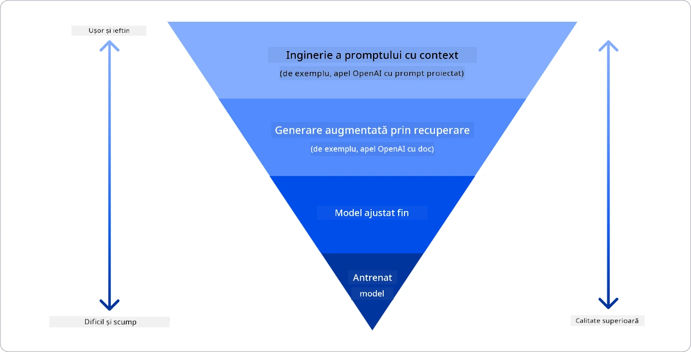

Sursa imaginii: [Four Ways that Enterprises Deploy LLMs | Fiddler AI Blog](https://www.fiddler.ai/blog/four-ways-that-enterprises-deploy-llms?WT.mc_id=academic-105485-koreyst)

### Inginerie de prompt cu context

LLM-urile pre-antrenate funcționează foarte bine pe sarcini generalizate de limbaj natural, chiar și atunci când sunt apelate cu un prompt scurt, cum ar fi o propoziție de completat sau o întrebare – așa-numita învățare „zero-shot”.

Cu toate acestea, cu cât utilizatorul poate încadra mai bine cererea sa, cu o solicitare detaliată și exemple – Contextul – cu atât răspunsul va fi mai precis și mai apropiat de așteptările utilizatorului. În acest caz, vorbim despre învățare „one-shot” dacă promptul include doar un exemplu și „few-shot learning” dacă include mai multe exemple.
Ingineria de prompt cu context este abordarea cea mai rentabilă pentru a începe.

### Generare augmentată prin recuperare (RAG)

LLM-urile au limita că pot folosi doar datele care au fost folosite în timpul antrenamentului lor pentru a genera un răspuns. Aceasta înseamnă că nu știu nimic despre faptele care s-au întâmplat după procesul lor de antrenament și nu pot accesa informații non-publice (cum ar fi datele companiei).
Aceasta poate fi depășită prin RAG, o tehnică care suplimentează promptul cu date externe sub formă de fragmente de documente, ținând cont de limitele lungimii promptului. Aceasta este susținută de instrumente de baze de date vectoriale (cum ar fi [Azure Vector Search](https://learn.microsoft.com/azure/search/vector-search-overview?WT.mc_id=academic-105485-koreyst)) care recuperează fragmentele utile din surse variate predefinite de date și le adaugă în Contextul promptului.

Această tehnică este foarte utilă când o afacere nu are suficiente date, timp sau resurse pentru fine-tuning, dar dorește totuși să îmbunătățească performanța pe un volum specific de lucru și să reducă riscurile unui răspuns halucinat, depășit sau nesusținut.

### Model fine-tuned

Fine-tuning-ul este un proces care valorifică învățarea prin transfer pentru a „adapta” modelul la o sarcină ulterioară sau pentru a rezolva o problemă specifică. Spre deosebire de învățarea few-shot și RAG, rezultă într-un model nou creat, cu greutăți și biasuri actualizate. Necesită un set de exemple de antrenament constând dintr-un singur input (promptul) și ieșirea asociată acestuia (completarea).
Aceasta ar fi abordarea preferată dacă:

- **Utilizarea unor modele mai mici, specifice sarcinii**. O afacere ar dori să fine-tuneze un model mai mic pentru o sarcină îngustă decât să apeleze repetat un model frontieră mai mare, rezultând o soluție mai rentabilă și mai rapidă.

- **Tine cont de latență**. Latența este importantă pentru un caz de utilizare specific, așa că nu este posibil să folosești prompturi foarte lungi sau numărul de exemple pe care modelul trebuie să le învețe nu se încadrează în limita lungimii promptului.

- **Adaptarea comportamentului stabil**. O afacere are multe exemple de înaltă calitate și dorește ca modelul să urmeze consistent un tipar de sarcină, formatul ieșirii, tonul sau stilul specific domeniului. Dacă problema principală sunt fapte proaspete sau cunoștințe private care se schimbă frecvent, folosește RAG în loc să te bazezi doar pe fine-tuning.

### Model antrenat

Antrenarea unui LLM de la zero este fără îndoială cea mai dificilă și cea mai complexă abordare de adoptat, necesitând cantități masive de date, resurse calificate și putere computațională adecvată. Această opțiune ar trebui luată în considerare doar într-un scenariu în care o afacere are un caz de utilizare specific domeniului și o cantitate mare de date centrate pe domeniu.

## Verificarea cunoștințelor

Care ar putea fi o abordare bună pentru a îmbunătăți rezultatele completării unui LLM?

1. Inginerie de prompt cu context
1. RAG
1. Model fine-tuned

R: Toate trei pot ajuta. Începeți cu inginerie de prompt și context pentru îmbunătățiri rapide, și folosiți RAG când modelul are nevoie de fapte actuale sau date private de afaceri. Alegeți fine-tuning-ul când aveți suficiente exemple de înaltă calitate și nevoie ca modelul să urmeze consistent o sarcină, format, ton sau tipar specific domeniului.

## 🚀 Provocare

Citiți mai multe despre cum puteți [folosi RAG](https://learn.microsoft.com/azure/search/retrieval-augmented-generation-overview?WT.mc_id=academic-105485-koreyst) pentru afacerea dumneavoastră.

## Excelentă muncă, continuați-vă învățarea

După ce ați finalizat această lecție, consultați colecția noastră [Generative AI Learning](https://aka.ms/genai-collection?WT.mc_id=academic-105485-koreyst) pentru a vă continua dezvoltarea cunoștințelor în AI Generativ!

Mergeți la Lecția 3 unde vom analiza cum să [construiți responsabil cu AI Generativ](../03-using-generative-ai-responsibly/README.md?WT.mc_id=academic-105485-koreyst)!

---

<!-- CO-OP TRANSLATOR DISCLAIMER START -->
**Declinare a responsabilității**:
Acest document a fost tradus folosind serviciul de traducere AI [Co-op Translator](https://github.com/Azure/co-op-translator). În timp ce ne străduim pentru acuratețe, vă rugăm să rețineți că traducerile automate pot conține erori sau inexactități. Documentul original în limba sa nativă trebuie considerat sursa autorizată. Pentru informații critice, se recomandă traducerea profesională realizată de un om. Nu ne asumăm responsabilitatea pentru eventualele neînțelegeri sau interpretări greșite care decurg din utilizarea acestei traduceri.
<!-- CO-OP TRANSLATOR DISCLAIMER END -->