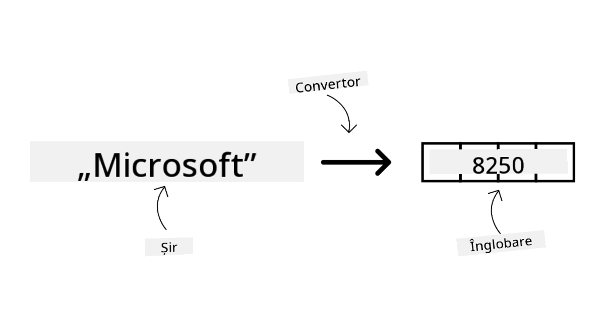
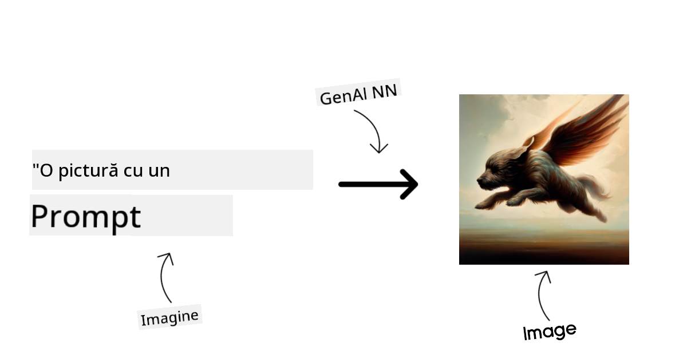
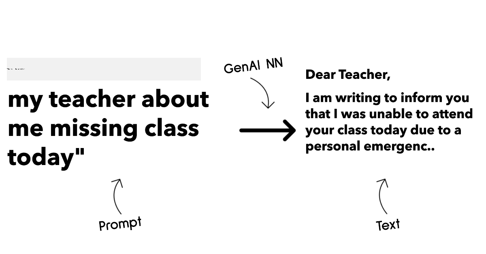
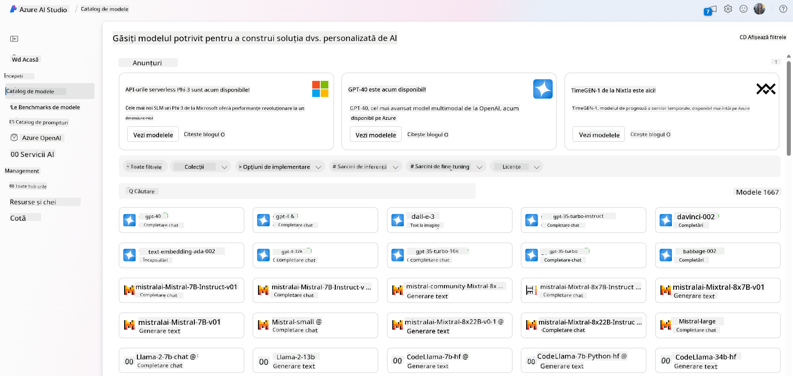
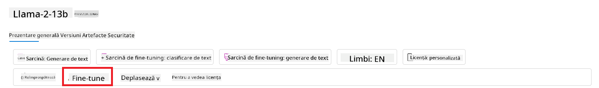
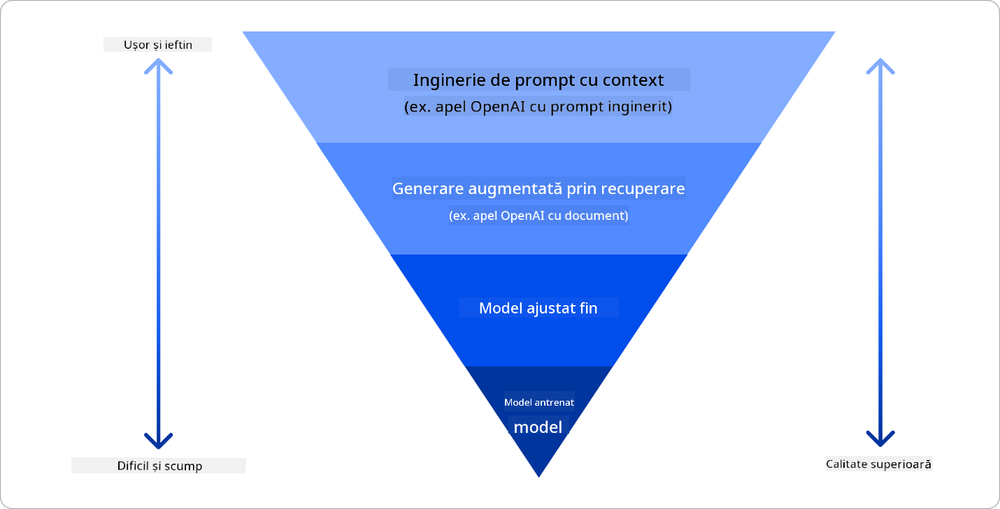

<!--
CO_OP_TRANSLATOR_METADATA:
{
  "original_hash": "6b7629b8ee4d7d874a27213e903d86a7",
  "translation_date": "2025-10-17T22:07:27+00:00",
  "source_file": "02-exploring-and-comparing-different-llms/README.md",
  "language_code": "ro"
}
-->
# Explorarea și compararea diferitelor LLM-uri

> _Faceți clic pe imaginea de mai sus pentru a viziona videoclipul acestei lecții_

În lecția anterioară, am văzut cum Inteligența Artificială Generativă schimbă peisajul tehnologic, cum funcționează Modelele de Limbaj Extins (LLM-uri) și cum o afacere - precum startup-ul nostru - le poate aplica în cazurile sale de utilizare și poate crește! În acest capitol, ne propunem să comparăm și să contrastăm diferite tipuri de modele de limbaj extins (LLM-uri) pentru a înțelege avantajele și dezavantajele acestora.

Următorul pas în călătoria startup-ului nostru este explorarea peisajului actual al LLM-urilor și înțelegerea celor mai potrivite pentru cazul nostru de utilizare.

## Introducere

Această lecție va acoperi:

- Diferite tipuri de LLM-uri din peisajul actual.
- Testarea, iterarea și compararea diferitelor modele pentru cazul dvs. de utilizare în Azure.
- Cum să implementați un LLM.

## Obiective de învățare

După finalizarea acestei lecții, veți putea:

- Să selectați modelul potrivit pentru cazul dvs. de utilizare.
- Să înțelegeți cum să testați, să iterați și să îmbunătățiți performanța modelului dvs.
- Să știți cum implementează companiile modelele.

## Înțelegerea diferitelor tipuri de LLM-uri

LLM-urile pot avea multiple categorii bazate pe arhitectura lor, datele de antrenament și cazul de utilizare. Înțelegerea acestor diferențe va ajuta startup-ul nostru să selecteze modelul potrivit pentru scenariu și să înțeleagă cum să testeze, să itereze și să îmbunătățească performanța.

Există multe tipuri diferite de modele LLM, iar alegerea modelului depinde de scopul utilizării, de datele disponibile, de bugetul alocat și de alți factori.

În funcție de scopul utilizării modelelor pentru generarea de text, audio, video, imagini și așa mai departe, s-ar putea să optați pentru un alt tip de model.

- **Recunoașterea audio și a vorbirii**. Pentru acest scop, modelele de tip Whisper sunt o alegere excelentă, fiind modele generaliste destinate recunoașterii vocale. Acestea sunt antrenate pe diverse tipuri de audio și pot efectua recunoaștere vocală multilingvă. Aflați mai multe despre [modelele de tip Whisper aici](https://platform.openai.com/docs/models/whisper?WT.mc_id=academic-105485-koreyst).

- **Generarea de imagini**. Pentru generarea de imagini, DALL-E și Midjourney sunt două alegeri bine cunoscute. DALL-E este oferit de Azure OpenAI. [Citiți mai multe despre DALL-E aici](https://platform.openai.com/docs/models/dall-e?WT.mc_id=academic-105485-koreyst) și, de asemenea, în Capitolul 9 al acestui curriculum.

- **Generarea de text**. Majoritatea modelelor sunt antrenate pentru generarea de text și aveți o varietate mare de opțiuni, de la GPT-3.5 la GPT-4. Acestea au costuri diferite, GPT-4 fiind cel mai scump. Merită să explorați [Azure OpenAI playground](https://oai.azure.com/portal/playground?WT.mc_id=academic-105485-koreyst) pentru a evalua care modele se potrivesc cel mai bine nevoilor dvs. în termeni de capacitate și cost.

- **Multi-modalitate**. Dacă doriți să gestionați mai multe tipuri de date în intrare și ieșire, s-ar putea să doriți să analizați modele precum [gpt-4 turbo cu viziune sau gpt-4o](https://learn.microsoft.com/azure/ai-services/openai/concepts/models#gpt-4-and-gpt-4-turbo-models?WT.mc_id=academic-105485-koreyst) - cele mai recente versiuni ale modelelor OpenAI - care sunt capabile să combine procesarea limbajului natural cu înțelegerea vizuală, permițând interacțiuni prin interfețe multi-modale.

Selectarea unui model înseamnă obținerea unor capabilități de bază, care s-ar putea să nu fie suficiente. Adesea, aveți date specifice companiei pe care trebuie să le comunicați cumva LLM-ului. Există câteva opțiuni diferite pentru a aborda acest aspect, mai multe despre acest subiect în secțiunile următoare.

### Modele Fundamentale versus LLM-uri

Termenul Model Fundamental a fost [inventat de cercetătorii de la Stanford](https://arxiv.org/abs/2108.07258?WT.mc_id=academic-105485-koreyst) și definit ca un model AI care respectă anumite criterii, cum ar fi:

- **Sunt antrenate folosind învățarea nesupravegheată sau învățarea auto-supervizată**, ceea ce înseamnă că sunt antrenate pe date multimodale neetichetate și nu necesită adnotări sau etichetări umane ale datelor pentru procesul lor de antrenament.
- **Sunt modele foarte mari**, bazate pe rețele neuronale foarte profunde, antrenate pe miliarde de parametri.
- **Sunt de obicei destinate să servească drept „fundament” pentru alte modele**, ceea ce înseamnă că pot fi utilizate ca punct de plecare pentru construirea altor modele, lucru care se poate realiza prin ajustare fină.

Sursa imaginii: [Essential Guide to Foundation Models and Large Language Models | by Babar M Bhatti | Medium
](https://thebabar.medium.com/essential-guide-to-foundation-models-and-large-language-models-27dab58f7404)

Pentru a clarifica și mai mult această distincție, să luăm ChatGPT ca exemplu. Pentru a construi prima versiune a ChatGPT, un model numit GPT-3.5 a servit drept model fundamental. Aceasta înseamnă că OpenAI a utilizat unele date specifice pentru chat pentru a crea o versiune ajustată a GPT-3.5, specializată în performanțe bune în scenarii conversaționale, cum ar fi chatbot-urile.

Sursa imaginii: [2108.07258.pdf (arxiv.org)](https://arxiv.org/pdf/2108.07258.pdf?WT.mc_id=academic-105485-koreyst)

### Modele Open Source versus Proprietare

O altă modalitate de a categoriza LLM-urile este dacă sunt open source sau proprietare.

Modelele open source sunt modele care sunt puse la dispoziția publicului și pot fi utilizate de oricine. Acestea sunt adesea oferite de compania care le-a creat sau de comunitatea de cercetare. Aceste modele pot fi inspectate, modificate și personalizate pentru diverse cazuri de utilizare ale LLM-urilor. Cu toate acestea, ele nu sunt întotdeauna optimizate pentru utilizarea în producție și s-ar putea să nu fie la fel de performante ca modelele proprietare. În plus, finanțarea pentru modelele open source poate fi limitată, iar acestea s-ar putea să nu fie întreținute pe termen lung sau să nu fie actualizate cu cele mai recente cercetări. Exemple de modele open source populare includ [Alpaca](https://crfm.stanford.edu/2023/03/13/alpaca.html?WT.mc_id=academic-105485-koreyst), [Bloom](https://huggingface.co/bigscience/bloom) și [LLaMA](https://llama.meta.com).

Modelele proprietare sunt modele deținute de o companie și nu sunt puse la dispoziția publicului. Aceste modele sunt adesea optimizate pentru utilizarea în producție. Cu toate acestea, ele nu pot fi inspectate, modificate sau personalizate pentru diferite cazuri de utilizare. În plus, ele nu sunt întotdeauna disponibile gratuit și pot necesita un abonament sau o plată pentru utilizare. De asemenea, utilizatorii nu au control asupra datelor utilizate pentru antrenarea modelului, ceea ce înseamnă că trebuie să aibă încredere în deținătorul modelului pentru a asigura respectarea confidențialității datelor și utilizarea responsabilă a AI. Exemple de modele proprietare populare includ [Modelele OpenAI](https://platform.openai.com/docs/models/overview?WT.mc_id=academic-105485-koreyst), [Google Bard](https://sapling.ai/llm/bard?WT.mc_id=academic-105485-koreyst) sau [Claude 2](https://www.anthropic.com/index/claude-2?WT.mc_id=academic-105485-koreyst).

### Încorporare versus Generare de imagini versus Generare de text și cod

LLM-urile pot fi, de asemenea, categorisite în funcție de tipul de ieșire pe care îl generează.

Modelele de încorporare sunt modele care pot converti textul într-o formă numerică, numită încorporare, care reprezintă o reprezentare numerică a textului de intrare. Încorporările facilitează înțelegerea relațiilor dintre cuvinte sau propoziții de către mașini și pot fi utilizate ca intrări pentru alte modele, cum ar fi modelele de clasificare sau de grupare care au performanțe mai bune pe date numerice. Modelele de încorporare sunt adesea utilizate pentru învățarea transferului, unde un model este construit pentru o sarcină surogat pentru care există o abundență de date, iar apoi greutățile modelului (încorporările) sunt reutilizate pentru alte sarcini ulterioare. Un exemplu din această categorie este [OpenAI embeddings](https://platform.openai.com/docs/models/embeddings?WT.mc_id=academic-105485-koreyst).

Modelele de generare de imagini sunt modele care generează imagini. Aceste modele sunt adesea utilizate pentru editarea imaginilor, sinteza imaginilor și traducerea imaginilor. Modelele de generare de imagini sunt adesea antrenate pe seturi mari de date de imagini, cum ar fi [LAION-5B](https://laion.ai/blog/laion-5b/?WT.mc_id=academic-105485-koreyst), și pot fi utilizate pentru a genera imagini noi sau pentru a edita imagini existente cu tehnici de inpainting, super-rezoluție și colorizare. Exemple includ [DALL-E-3](https://openai.com/dall-e-3?WT.mc_id=academic-105485-koreyst) și [Modelele Stable Diffusion](https://github.com/Stability-AI/StableDiffusion?WT.mc_id=academic-105485-koreyst).

Modelele de generare de text și cod sunt modele care generează text sau cod. Aceste modele sunt adesea utilizate pentru sumarizarea textului, traducere și răspuns la întrebări. Modelele de generare de text sunt adesea antrenate pe seturi mari de date de text, cum ar fi [BookCorpus](https://www.cv-foundation.org/openaccess/content_iccv_2015/html/Zhu_Aligning_Books_and_ICCV_2015_paper.html?WT.mc_id=academic-105485-koreyst), și pot fi utilizate pentru a genera text nou sau pentru a răspunde la întrebări. Modelele de generare de cod, precum [CodeParrot](https://huggingface.co/codeparrot?WT.mc_id=academic-105485-koreyst), sunt adesea antrenate pe seturi mari de date de cod, cum ar fi GitHub, și pot fi utilizate pentru a genera cod nou sau pentru a remedia erori în codul existent.

### Encoder-Decoder versus doar Decoder

Pentru a discuta despre diferitele tipuri de arhitecturi ale LLM-urilor, să folosim o analogie.

Imaginați-vă că managerul dvs. v-a dat sarcina de a scrie un test pentru studenți. Aveți doi colegi; unul se ocupă de crearea conținutului, iar celălalt de revizuirea acestuia.

Creatorul de conținut este ca un model doar Decoder, poate privi subiectul și ceea ce ați scris deja și apoi poate scrie un curs pe baza acestuia. Este foarte bun la scrierea de conținut captivant și informativ, dar nu este foarte bun la înțelegerea subiectului și a obiectivelor de învățare. Unele exemple de modele Decoder sunt modelele din familia GPT, cum ar fi GPT-3.

Recenzorul este ca un model doar Encoder, analizează cursul scris și răspunsurile, observând relația dintre ele și înțelegând contextul, dar nu este bun la generarea de conținut. Un exemplu de model doar Encoder ar fi BERT.

Imaginați-vă că am putea avea pe cineva care să poată crea și revizui testul, acesta este un model Encoder-Decoder. Unele exemple ar fi BART și T5.

### Serviciu versus Model

Acum, să discutăm despre diferența dintre un serviciu și un model. Un serviciu este un produs oferit de un furnizor de servicii cloud și este adesea o combinație de modele, date și alte componente. Un model este componenta de bază a unui serviciu și este adesea un model fundamental, cum ar fi un LLM.

Serviciile sunt adesea optimizate pentru utilizarea în producție și sunt adesea mai ușor de utilizat decât modelele, printr-o interfață grafică. Cu toate acestea, serviciile nu sunt întotdeauna disponibile gratuit și pot necesita un abonament sau o plată pentru utilizare, în schimbul utilizării echipamentelor și resurselor deținătorului serviciului, optimizând cheltuielile și scalând ușor. Un exemplu de serviciu este [Azure OpenAI Service](https://learn.microsoft.com/azure/ai-services/openai/overview?WT.mc_id=academic-105485-koreyst), care oferă un plan de tarifare pay-as-you-go, ceea ce înseamnă că utilizatorii sunt taxați proporțional cu cât utilizează serviciul. De asemenea, Azure OpenAI Service oferă securitate la nivel de întreprindere și un cadru de AI responsabil pe lângă capabilitățile modelelor.

Modelele sunt doar Rețelele Neuronale, cu parametrii, greutățile și altele. Permițând companiilor să le ruleze local, totuși, ar fi nevoie să achiziționeze echipamente, să construiască o structură pentru scalare și să cumpere o licență sau să utilizeze un model open source. Un model precum LLaMA este disponibil pentru utilizare, necesitând putere computațională pentru a rula modelul.

## Cum să testați și să iterați cu diferite modele pentru a înțelege performanța pe Azure

Odată ce echipa noastră a explorat peisajul actual al LLM-urilor și a identificat câțiva candidați buni pentru scenariile lor, următorul pas este testarea acestora pe datele și sarcinile lor de lucru. Acesta este un proces iterativ, realizat prin experimente și măsurători.
Majoritatea modelelor menționate în paragrafele anterioare (modelele OpenAI, modele open source precum Llama2 și transformatoarele Hugging Face) sunt disponibile în [Catalogul de modele](https://learn.microsoft.com/azure/ai-studio/how-to/model-catalog-overview?WT.mc_id=academic-105485-koreyst) din [Azure AI Studio](https://ai.azure.com/?WT.mc_id=academic-105485-koreyst).

[Azure AI Studio](https://learn.microsoft.com/azure/ai-studio/what-is-ai-studio?WT.mc_id=academic-105485-koreyst) este o platformă Cloud concepută pentru dezvoltatori, care permite construirea aplicațiilor de AI generativă și gestionarea întregului ciclu de dezvoltare - de la experimentare la evaluare - prin combinarea tuturor serviciilor Azure AI într-un singur hub cu o interfață grafică ușor de utilizat. Catalogul de modele din Azure AI Studio permite utilizatorului să:

- Găsească modelul de bază dorit în catalog - fie proprietar, fie open source, filtrând după sarcină, licență sau nume. Pentru a îmbunătăți căutarea, modelele sunt organizate în colecții, precum colecția Azure OpenAI, colecția Hugging Face și altele.

- Revizuiască fișa modelului, inclusiv o descriere detaliată a utilizării intenționate și a datelor de antrenament, exemple de cod și rezultate ale evaluării din biblioteca internă de evaluări.

- Compare benchmark-uri între modele și seturi de date disponibile în industrie pentru a evalua care se potrivește cel mai bine scenariului de afaceri, prin panoul [Model Benchmarks](https://learn.microsoft.com/azure/ai-studio/how-to/model-benchmarks?WT.mc_id=academic-105485-koreyst).

- Ajusteze modelul pe baza datelor de antrenament personalizate pentru a îmbunătăți performanța modelului într-o sarcină specifică, utilizând capacitățile de experimentare și urmărire ale Azure AI Studio.

- Desfășoare modelul pre-antrenat original sau versiunea ajustată pentru inferență în timp real - calcul gestionat - sau endpoint API fără server - [plată pe măsură ce utilizezi](https://learn.microsoft.com/azure/ai-studio/how-to/model-catalog-overview#model-deployment-managed-compute-and-serverless-api-pay-as-you-go?WT.mc_id=academic-105485-koreyst) - pentru a permite aplicațiilor să îl consume.

> [!NOTE]
> Nu toate modelele din catalog sunt disponibile în prezent pentru ajustare și/sau desfășurare cu plată pe măsură ce utilizezi. Verificați fișa modelului pentru detalii despre capacitățile și limitările modelului.

## Îmbunătățirea rezultatelor LLM

Am explorat cu echipa noastră de startup diferite tipuri de LLM-uri și o platformă Cloud (Azure Machine Learning) care ne permite să comparăm diferite modele, să le evaluăm pe baza datelor de testare, să îmbunătățim performanța și să le desfășurăm pe endpoint-uri de inferență.

Dar când ar trebui să ia în considerare ajustarea unui model în loc să utilizeze unul pre-antrenat? Există alte abordări pentru a îmbunătăți performanța modelului pe sarcini specifice?

Există mai multe abordări pe care o afacere le poate utiliza pentru a obține rezultatele dorite de la un LLM. Puteți selecta diferite tipuri de modele cu diferite grade de antrenament atunci când desfășurați un LLM în producție, cu niveluri diferite de complexitate, cost și calitate. Iată câteva abordări diferite:

- **Ingineria prompturilor cu context**. Ideea este să oferiți suficient context atunci când formulați promptul pentru a vă asigura că obțineți răspunsurile de care aveți nevoie.

- **Generare augmentată prin recuperare, RAG**. Datele dvs. pot exista, de exemplu, într-o bază de date sau pe un endpoint web. Pentru a vă asigura că aceste date sau un subset al lor sunt incluse în momentul formulării promptului, puteți prelua datele relevante și să le includeți în promptul utilizatorului.

- **Model ajustat**. Aici, modelul este antrenat suplimentar pe datele proprii, ceea ce duce la un model mai exact și mai receptiv la nevoile dvs., dar poate fi costisitor.

Sursa imaginii: [Four Ways that Enterprises Deploy LLMs | Fiddler AI Blog](https://www.fiddler.ai/blog/four-ways-that-enterprises-deploy-llms?WT.mc_id=academic-105485-koreyst)

### Ingineria prompturilor cu context

LLM-urile pre-antrenate funcționează foarte bine pe sarcini generale de procesare a limbajului natural, chiar și atunci când sunt apelate cu un prompt scurt, cum ar fi o propoziție de completat sau o întrebare – așa-numita învățare „zero-shot”.

Cu toate acestea, cu cât utilizatorul își poate încadra mai bine întrebarea, cu o cerere detaliată și exemple – Contextul – cu atât răspunsul va fi mai precis și mai apropiat de așteptările utilizatorului. În acest caz, vorbim despre învățare „one-shot” dacă promptul include doar un exemplu și „few-shot learning” dacă include mai multe exemple. Ingineria prompturilor cu context este cea mai rentabilă abordare pentru a începe.

### Generare augmentată prin recuperare (RAG)

LLM-urile au limitarea că pot utiliza doar datele care au fost folosite în timpul antrenamentului lor pentru a genera un răspuns. Aceasta înseamnă că nu știu nimic despre faptele care au avut loc după procesul lor de antrenament și nu pot accesa informații nepublice (cum ar fi datele companiei). 
Acest lucru poate fi depășit prin RAG, o tehnică care completează promptul cu date externe sub formă de fragmente de documente, luând în considerare limitele de lungime ale promptului. Aceasta este susținută de instrumente de baze de date vectoriale (cum ar fi [Azure Vector Search](https://learn.microsoft.com/azure/search/vector-search-overview?WT.mc_id=academic-105485-koreyst)) care recuperează fragmentele utile din surse de date predefinite și le adaugă la Contextul promptului.

Această tehnică este foarte utilă atunci când o afacere nu are suficiente date, suficient timp sau resurse pentru a ajusta un LLM, dar dorește totuși să îmbunătățească performanța pe o sarcină specifică și să reducă riscurile de fabricare, adică mistificarea realității sau conținutul dăunător.

### Model ajustat

Ajustarea este un proces care utilizează învățarea transferului pentru a „adapta” modelul la o sarcină ulterioară sau pentru a rezolva o problemă specifică. Spre deosebire de învățarea few-shot și RAG, rezultă într-un model nou generat, cu greutăți și biasuri actualizate. Acesta necesită un set de exemple de antrenament constând dintr-o singură intrare (promptul) și ieșirea asociată (completarea).
Aceasta ar fi abordarea preferată dacă:

- **Utilizarea modelelor ajustate**. O afacere ar dori să utilizeze modele ajustate mai puțin capabile (cum ar fi modelele de încorporare) în locul modelelor de înaltă performanță, rezultând o soluție mai rentabilă și rapidă.

- **Luarea în considerare a latenței**. Latența este importantă pentru un caz de utilizare specific, astfel încât nu este posibil să se utilizeze prompturi foarte lungi sau numărul de exemple care ar trebui învățate de model nu se încadrează în limita de lungime a promptului.

- **Menținerea actualizării**. O afacere are o mulțime de date de înaltă calitate și etichete de adevăr și resursele necesare pentru a menține aceste date actualizate în timp.

### Model antrenat

Antrenarea unui LLM de la zero este, fără îndoială, cea mai dificilă și cea mai complexă abordare de adoptat, necesitând cantități masive de date, resurse calificate și putere computațională adecvată. Această opțiune ar trebui luată în considerare doar într-un scenariu în care o afacere are un caz de utilizare specific domeniului și o cantitate mare de date centrate pe domeniu.

## Verificarea cunoștințelor

Care ar putea fi o abordare bună pentru a îmbunătăți rezultatele de completare ale LLM?

1. Ingineria prompturilor cu context  
1. RAG  
1. Model ajustat  

R: 3, dacă aveți timp, resurse și date de înaltă calitate, ajustarea este opțiunea mai bună pentru a rămâne actualizat. Totuși, dacă doriți să îmbunătățiți lucrurile și nu aveți timp, merită să luați în considerare mai întâi RAG.

## 🚀 Provocare

Citiți mai multe despre cum puteți [utiliza RAG](https://learn.microsoft.com/azure/search/retrieval-augmented-generation-overview?WT.mc_id=academic-105485-koreyst) pentru afacerea dvs.

## Felicitări, Continuați să învățați

După ce ați finalizat această lecție, consultați [colecția noastră de învățare AI generativă](https://aka.ms/genai-collection?WT.mc_id=academic-105485-koreyst) pentru a continua să vă dezvoltați cunoștințele despre AI generativă!

Accesați Lecția 3, unde vom analiza cum să [construim cu AI generativă în mod responsabil](../03-using-generative-ai-responsibly/README.md?WT.mc_id=academic-105485-koreyst)!

---

**Declinare de responsabilitate**:  
Acest document a fost tradus folosind serviciul de traducere AI [Co-op Translator](https://github.com/Azure/co-op-translator). Deși ne străduim să asigurăm acuratețea, vă rugăm să fiți conștienți că traducerile automate pot conține erori sau inexactități. Documentul original în limba sa natală ar trebui considerat sursa autoritară. Pentru informații critice, se recomandă traducerea profesională realizată de oameni. Nu ne asumăm responsabilitatea pentru neînțelegerile sau interpretările greșite care pot apărea din utilizarea acestei traduceri.