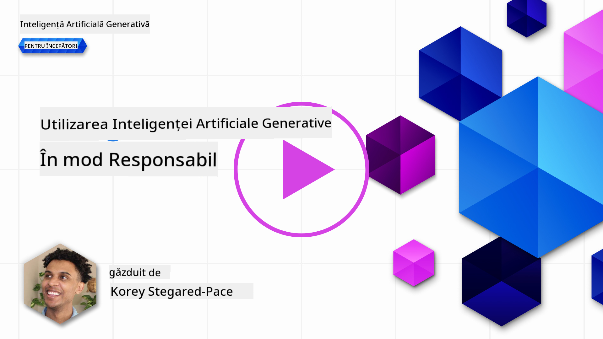
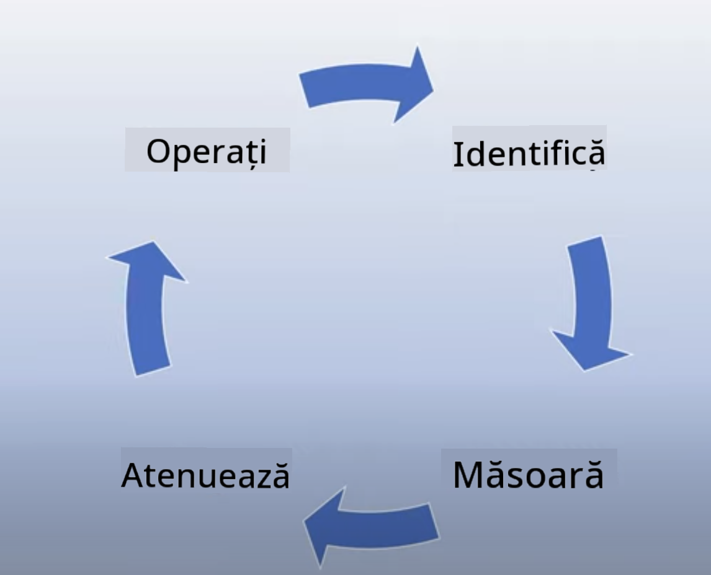
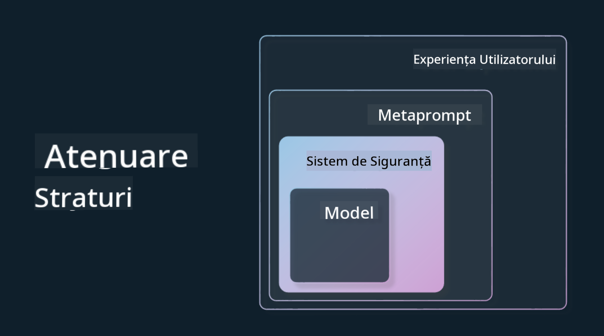

<!--
CO_OP_TRANSLATOR_METADATA:
{
  "original_hash": "7f8f4c11f8c1cb6e1794442dead414ea",
  "translation_date": "2025-07-09T09:03:04+00:00",
  "source_file": "03-using-generative-ai-responsibly/README.md",
  "language_code": "ro"
}
-->
# Folosirea responsabilă a AI generativ

> _Click pe imaginea de mai sus pentru a viziona videoclipul acestei lecții_

Este ușor să fii fascinat de AI și în special de AI generativ, dar trebuie să iei în considerare cum să îl folosești responsabil. Trebuie să te gândești la aspecte precum asigurarea faptului că rezultatul este corect, nepericulos și altele. Acest capitol își propune să îți ofere contextul menționat, ce trebuie să iei în calcul și cum să iei măsuri active pentru a-ți îmbunătăți utilizarea AI.

## Introducere

Această lecție va acoperi:

- De ce ar trebui să prioritizezi Responsible AI atunci când construiești aplicații Generative AI.
- Principiile de bază ale Responsible AI și cum se raportează acestea la Generative AI.
- Cum să pui în practică aceste principii Responsible AI prin strategie și unelte.

## Obiective de învățare

După ce vei finaliza această lecție vei ști:

- Importanța Responsible AI când construiești aplicații Generative AI.
- Când să gândești și să aplici principiile de bază Responsible AI în dezvoltarea aplicațiilor Generative AI.
- Ce unelte și strategii ai la dispoziție pentru a pune în practică conceptul de Responsible AI.

## Principiile Responsible AI

Entuziasmul pentru Generative AI nu a fost niciodată mai mare. Acest entuziasm a atras mulți dezvoltatori noi, atenție și finanțare în acest domeniu. Deși acest lucru este foarte pozitiv pentru oricine dorește să construiască produse și companii folosind Generative AI, este la fel de important să procedăm responsabil.

Pe parcursul acestui curs, ne concentrăm pe construirea startup-ului nostru și a produsului nostru educațional AI. Vom folosi principiile Responsible AI: Echitate, Incluziune, Fiabilitate/Siguranță, Securitate & Confidențialitate, Transparență și Responsabilitate. Cu aceste principii, vom explora cum se raportează ele la utilizarea Generative AI în produsele noastre.

## De ce ar trebui să prioritizezi Responsible AI

Atunci când construiești un produs, abordarea centrată pe om, având în vedere interesul utilizatorului, conduce la cele mai bune rezultate.

Unicitatea Generative AI constă în puterea sa de a crea răspunsuri utile, informații, ghidare și conținut pentru utilizatori. Acest lucru se poate face fără multe etape manuale, ceea ce poate duce la rezultate foarte impresionante. Fără o planificare și strategii adecvate, din păcate, poate duce și la rezultate dăunătoare pentru utilizatorii tăi, produsul tău și societate în ansamblu.

Să analizăm câteva (dar nu toate) dintre aceste rezultate potențial dăunătoare:

### Halucinații

Halucinațiile sunt un termen folosit pentru a descrie situațiile în care un LLM produce conținut care este fie complet lipsit de sens, fie ceva ce știm că este factual greșit pe baza altor surse de informații.

Să luăm exemplul în care construim o funcție pentru startup-ul nostru care permite studenților să pună întrebări istorice unui model. Un student întreabă: `Cine a fost singurul supraviețuitor al Titanicului?`

Modelul produce un răspuns precum cel de mai jos:

> _(Sursa: [Flying bisons](https://flyingbisons.com?WT.mc_id=academic-105485-koreyst))_

Acesta este un răspuns foarte sigur și detaliat. Din păcate, este incorect. Chiar și cu o cercetare minimă, s-ar descoperi că au existat mai mulți supraviețuitori ai dezastrului de pe Titanic. Pentru un student care abia începe să cerceteze acest subiect, acest răspuns poate fi suficient de convingător pentru a nu fi pus sub semnul întrebării și tratat ca un fapt. Consecințele pot duce la faptul că sistemul AI devine nesigur și afectează negativ reputația startup-ului nostru.

Cu fiecare iterație a oricărui LLM, am observat îmbunătățiri în performanță în ceea ce privește minimizarea halucinațiilor. Chiar și cu această îmbunătățire, noi, ca dezvoltatori de aplicații și utilizatori, trebuie să rămânem conștienți de aceste limitări.

### Conținut dăunător

Am discutat în secțiunea anterioară despre situațiile în care un LLM produce răspunsuri incorecte sau lipsite de sens. Un alt risc de care trebuie să fim conștienți este atunci când un model răspunde cu conținut dăunător.

Conținutul dăunător poate fi definit ca:

- Oferirea de instrucțiuni sau încurajarea auto-vătămării sau a vătămării anumitor grupuri.
- Conținut plin de ură sau degradant.
- Ghidarea planificării oricărui tip de atac sau acte violente.
- Oferirea de instrucțiuni despre cum să găsești conținut ilegal sau să comiți acte ilegale.
- Afișarea de conținut sexual explicit.

Pentru startup-ul nostru, vrem să ne asigurăm că avem uneltele și strategiile potrivite pentru a preveni ca acest tip de conținut să fie văzut de studenți.

### Lipsa echității

Echitatea este definită ca „asigurarea că un sistem AI este liber de prejudecăți și discriminare și că tratează pe toată lumea corect și egal.” În lumea Generative AI, vrem să ne asigurăm că viziunile excluzive asupra lumii ale grupurilor marginalizate nu sunt întărite prin rezultatele modelului.

Acest tip de rezultate nu doar că distrug experiențele pozitive ale produsului pentru utilizatorii noștri, dar cauzează și daune suplimentare societății. Ca dezvoltatori de aplicații, ar trebui să avem mereu în vedere o bază largă și diversă de utilizatori atunci când construim soluții cu Generative AI.

## Cum să folosești Generative AI responsabil

Acum că am identificat importanța Responsible Generative AI, să vedem 4 pași pe care îi putem urma pentru a construi soluțiile AI responsabil:

### Măsoară potențialele daune

În testarea software, testăm acțiunile așteptate ale unui utilizator într-o aplicație. În mod similar, testarea unui set divers de prompturi pe care utilizatorii sunt cel mai probabil să le folosească este o metodă bună de a măsura potențialele daune.

Deoarece startup-ul nostru construiește un produs educațional, ar fi bine să pregătim o listă de prompturi legate de educație. Acestea ar putea acoperi un anumit subiect, fapte istorice și prompturi despre viața studențească.

### Atenuează potențialele daune

Este momentul să găsim modalități prin care să prevenim sau să limităm potențialele daune cauzate de model și răspunsurile sale. Putem privi acest lucru pe 4 niveluri diferite:

- **Modelul**. Alegerea modelului potrivit pentru cazul de utilizare potrivit. Modelele mai mari și mai complexe, precum GPT-4, pot prezenta un risc mai mare de conținut dăunător atunci când sunt aplicate în cazuri de utilizare mai mici și mai specifice. Folosirea datelor tale de antrenament pentru fine-tuning reduce, de asemenea, riscul de conținut dăunător.

- **Sistemul de siguranță**. Un sistem de siguranță este un set de unelte și configurații pe platforma care deservește modelul și care ajută la atenuarea daunelor. Un exemplu este sistemul de filtrare a conținutului din serviciul Azure OpenAI. Sistemele ar trebui să detecteze și atacurile de tip jailbreak și activitățile nedorite, cum ar fi cererile venite de la boți.

- **Metaprompt**. Metaprompturile și grounding-ul sunt modalități prin care putem direcționa sau limita modelul pe baza anumitor comportamente și informații. Acest lucru poate însemna folosirea inputurilor de sistem pentru a defini anumite limite ale modelului. În plus, oferirea de rezultate mai relevante pentru domeniul sau aria sistemului.

Poate include și folosirea tehnicilor precum Retrieval Augmented Generation (RAG) pentru ca modelul să extragă informații doar dintr-o selecție de surse de încredere. Există o lecție mai târziu în acest curs despre [construirea aplicațiilor de căutare](../08-building-search-applications/README.md?WT.mc_id=academic-105485-koreyst)

- **Experiența utilizatorului**. Ultimul nivel este acela în care utilizatorul interacționează direct cu modelul prin interfața aplicației noastre. Astfel, putem proiecta UI/UX pentru a limita tipurile de inputuri pe care utilizatorul le poate trimite modelului, precum și textele sau imaginile afișate utilizatorului. Când lansăm aplicația AI, trebuie să fim transparenți în privința a ceea ce aplicația noastră Generative AI poate și nu poate face.

Avem o lecție dedicată în întregime [Proiectării UX pentru aplicații AI](../12-designing-ux-for-ai-applications/README.md?WT.mc_id=academic-105485-koreyst)

- **Evaluarea modelului**. Lucrul cu LLM-urile poate fi provocator deoarece nu avem întotdeauna control asupra datelor pe care modelul a fost antrenat. Cu toate acestea, ar trebui să evaluăm întotdeauna performanța și rezultatele modelului. Este important să măsurăm acuratețea modelului, similaritatea, fundamentarea și relevanța outputului. Acest lucru ajută la oferirea de transparență și încredere părților interesate și utilizatorilor.

### Operarea unei soluții Responsible Generative AI

Construirea unei practici operaționale în jurul aplicațiilor tale AI este etapa finală. Aceasta include colaborarea cu alte departamente din startup-ul nostru, cum ar fi Legal și Securitate, pentru a ne asigura că respectăm toate politicile de reglementare. Înainte de lansare, vrem să construim planuri legate de livrare, gestionarea incidentelor și revenirea la o versiune anterioară pentru a preveni orice daună în creștere pentru utilizatorii noștri.

## Unelte

Deși munca de a dezvolta soluții Responsible AI poate părea multă, este o muncă care merită efortul. Pe măsură ce domeniul Generative AI crește, vor apărea tot mai multe unelte care să ajute dezvoltatorii să integreze responsabilitatea eficient în fluxurile lor de lucru. De exemplu, [Azure AI Content Safety](https://learn.microsoft.com/azure/ai-services/content-safety/overview?WT.mc_id=academic-105485-koreyst) poate ajuta la detectarea conținutului și imaginilor dăunătoare printr-o cerere API.

## Verificare cunoștințe

Care sunt câteva lucruri de care trebuie să ții cont pentru a asigura o utilizare responsabilă a AI?

1. Ca răspunsul să fie corect.
1. Utilizarea dăunătoare, ca AI să nu fie folosit în scopuri criminale.
1. Asigurarea că AI este liber de prejudecăți și discriminare.

Răspuns: 2 și 3 sunt corecte. Responsible AI te ajută să iei în calcul cum să atenuezi efectele dăunătoare, prejudecățile și altele.

## 🚀 Provocare

Citește despre [Azure AI Content Safety](https://learn.microsoft.com/azure/ai-services/content-safety/overview?WT.mc_id=academic-105485-koreyst) și vezi ce poți adopta pentru utilizarea ta.

## Felicitări, continuă să înveți

După ce ai terminat această lecție, consultă colecția noastră de învățare [Generative AI Learning collection](https://aka.ms/genai-collection?WT.mc_id=academic-105485-koreyst) pentru a-ți continua dezvoltarea cunoștințelor despre Generative AI!

Mergi la Lecția 4 unde vom explora [Fundamentele ingineriei prompturilor](../04-prompt-engineering-fundamentals/README.md?WT.mc_id=academic-105485-koreyst)!

**Declinare de responsabilitate**:  
Acest document a fost tradus folosind serviciul de traducere AI [Co-op Translator](https://github.com/Azure/co-op-translator). Deși ne străduim pentru acuratețe, vă rugăm să rețineți că traducerile automate pot conține erori sau inexactități. Documentul original în limba sa nativă trebuie considerat sursa autorizată. Pentru informații critice, se recomandă traducerea profesională realizată de un specialist uman. Nu ne asumăm răspunderea pentru eventualele neînțelegeri sau interpretări greșite rezultate din utilizarea acestei traduceri.