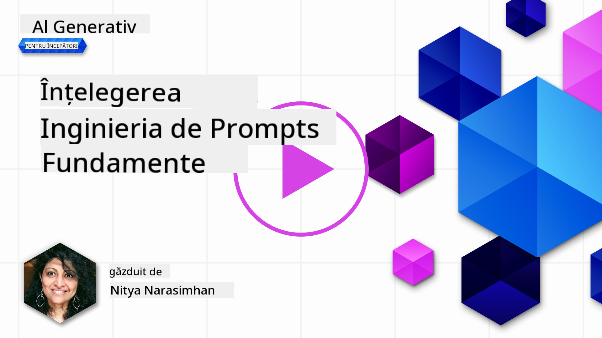
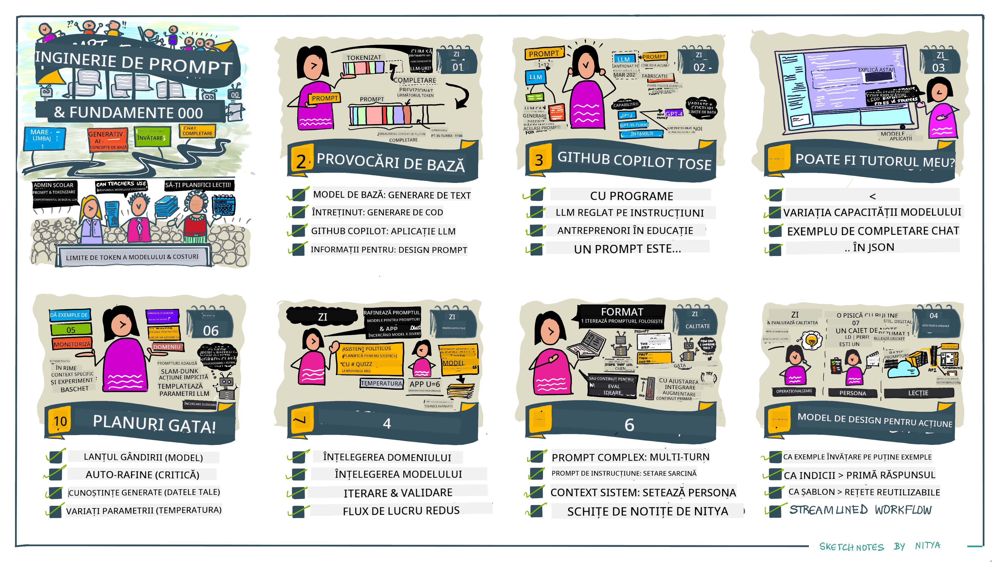
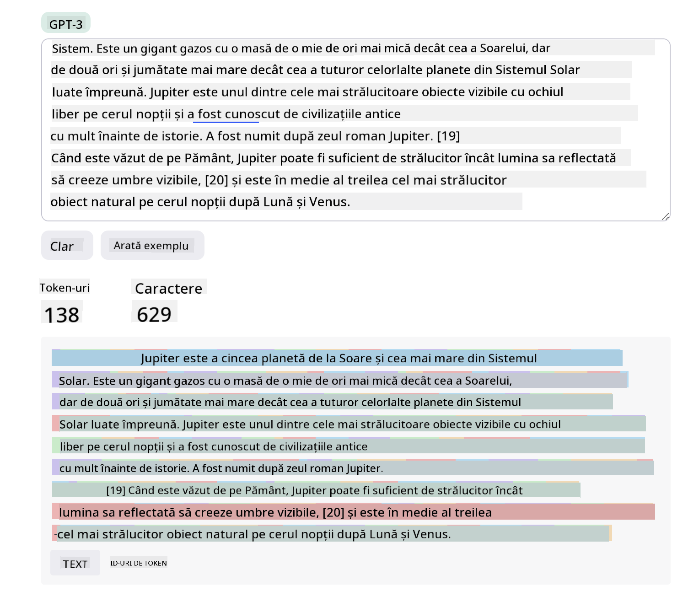
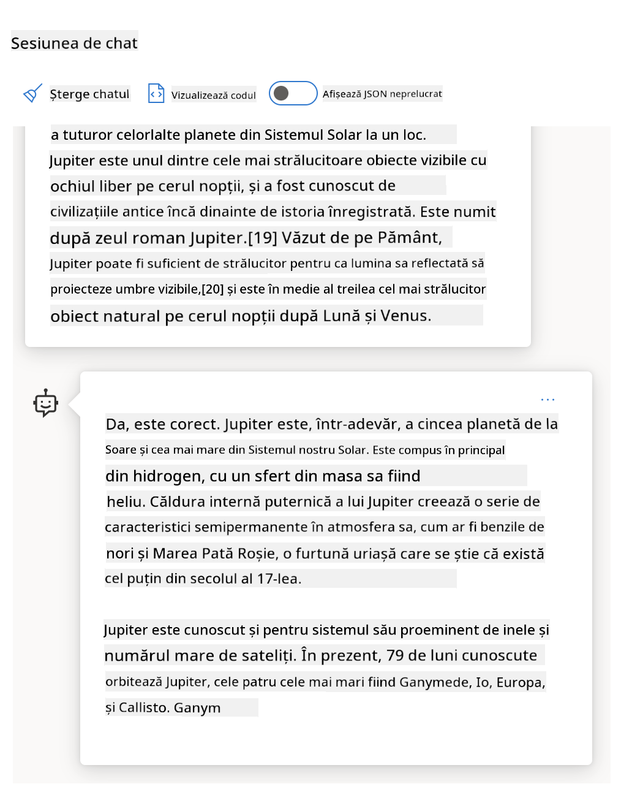
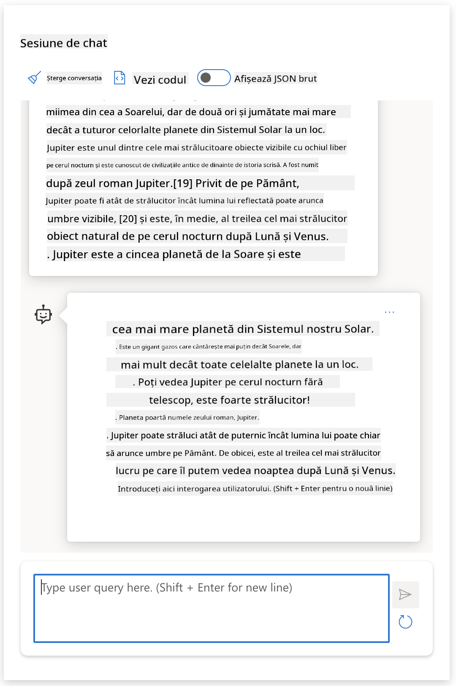
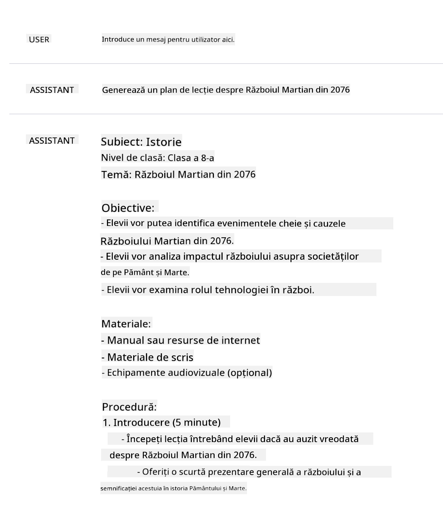
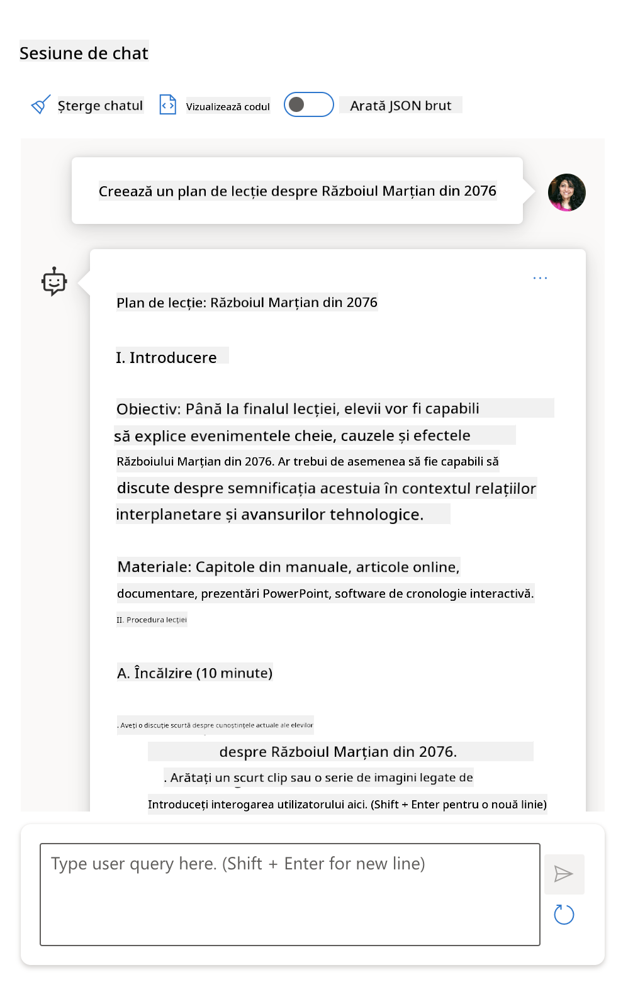
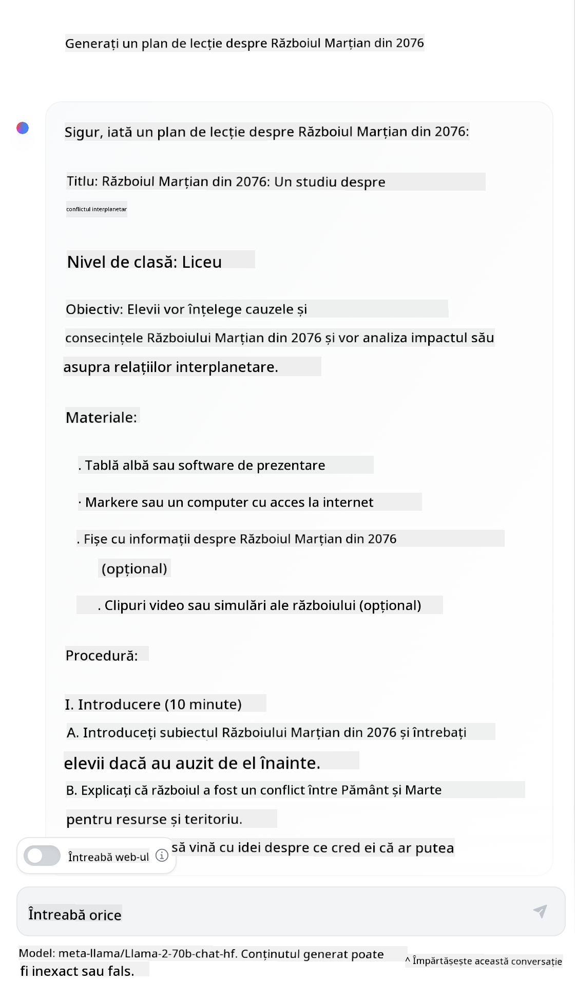

<!--
CO_OP_TRANSLATOR_METADATA:
{
  "original_hash": "dcbaaae026cb50fee071e690685b5843",
  "translation_date": "2025-08-26T19:15:48+00:00",
  "source_file": "04-prompt-engineering-fundamentals/README.md",
  "language_code": "ro"
}
-->
# Fundamentele Ingineriei Prompturilor

[](https://aka.ms/gen-ai-lesson4-gh?WT.mc_id=academic-105485-koreyst)

## Introducere
Acest modul acoperă concepte esențiale și tehnici pentru crearea de prompturi eficiente pentru modelele generative de AI. Modul în care scrii promptul pentru un LLM contează. Un prompt bine gândit poate duce la un răspuns de calitate mai bună. Dar ce înseamnă exact termeni precum _prompt_ și _ingineria prompturilor_? Și cum pot îmbunătăți _inputul_ promptului pe care îl trimit către LLM? Acestea sunt întrebările la care vom încerca să răspundem în acest capitol și în următorul.

_AI-ul generativ_ este capabil să creeze conținut nou (de exemplu, text, imagini, audio, cod etc.) ca răspuns la cererile utilizatorilor. Acest lucru este posibil datorită _Marilor Modele de Limbaj_ precum seria GPT ("Generative Pre-trained Transformer") de la OpenAI, care sunt antrenate să folosească limbaj natural și cod.

Utilizatorii pot interacționa acum cu aceste modele folosind paradigme familiare, precum chat-ul, fără a avea nevoie de cunoștințe tehnice sau instruire specială. Modelele sunt _bazate pe prompturi_ – utilizatorii trimit un input text (prompt) și primesc un răspuns AI (completare). Apoi pot „discuta cu AI-ul” în mod iterativ, în conversații cu mai multe schimburi, rafinând promptul până când răspunsul corespunde așteptărilor.

„Prompturile” devin astfel principala _interfață de programare_ pentru aplicațiile AI generative, spunând modelelor ce să facă și influențând calitatea răspunsurilor generate. „Ingineria prompturilor” este un domeniu în plină dezvoltare care se concentrează pe _proiectarea și optimizarea_ prompturilor pentru a obține răspunsuri consistente și de calitate la scară largă.

## Obiective de învățare

În această lecție, vom învăța ce este Ingineria Prompturilor, de ce este importantă și cum putem construi prompturi mai eficiente pentru un anumit model și scop al aplicației. Vom înțelege conceptele de bază și cele mai bune practici pentru ingineria prompturilor – și vom descoperi un mediu interactiv „sandbox” în Jupyter Notebooks unde putem vedea aceste concepte aplicate pe exemple reale.

La finalul acestei lecții vei putea:

1. Explica ce este ingineria prompturilor și de ce contează.
2. Descrie componentele unui prompt și modul în care sunt folosite.
3. Învăța cele mai bune practici și tehnici pentru ingineria prompturilor.
4. Aplica tehnicile învățate pe exemple reale, folosind un endpoint OpenAI.

## Termeni cheie

Ingineria Prompturilor: Practica de a proiecta și rafina inputurile pentru a ghida modelele AI să producă rezultate dorite.
Tokenizare: Procesul de a converti textul în unități mai mici, numite tokeni, pe care un model le poate înțelege și procesa.
LLM-uri ajustate pe instrucțiuni: Mari Modele de Limbaj (LLM) care au fost ajustate suplimentar cu instrucțiuni specifice pentru a îmbunătăți acuratețea și relevanța răspunsurilor.

## Sandbox de învățare

Ingineria prompturilor este momentan mai mult o artă decât o știință. Cel mai bun mod de a-ți dezvolta intuiția este să _exersezi cât mai mult_ și să adopți o abordare de tip încercare-eroare, combinând expertiza în domeniul aplicației cu tehnici recomandate și optimizări specifice modelului.

Jupyter Notebook-ul care însoțește această lecție oferă un mediu _sandbox_ unde poți încerca ce ai învățat – pe parcurs sau ca parte a provocării de cod de la final. Pentru a rula exercițiile, vei avea nevoie de:

1. **O cheie API Azure OpenAI** – endpoint-ul serviciului pentru un LLM implementat.
2. **Un runtime Python** – în care să poți executa Notebook-ul.
3. **Variabile de mediu locale** – _parcurge acum pașii din [SETUP](./../00-course-setup/02-setup-local.md?WT.mc_id=academic-105485-koreyst) pentru a te pregăti_.

Notebook-ul vine cu exerciții _de început_ – dar ești încurajat să adaugi propriile secțiuni de _Markdown_ (descriere) și _Cod_ (cereri de prompt) pentru a încerca mai multe exemple sau idei – și pentru a-ți construi intuiția privind designul prompturilor.

## Ghid ilustrat

Vrei să ai o imagine de ansamblu a ceea ce acoperă această lecție înainte să începi? Aruncă o privire pe acest ghid ilustrat, care îți oferă o idee despre principalele subiecte abordate și concluziile cheie la care să te gândești pentru fiecare. Harta lecției te poartă de la înțelegerea conceptelor de bază și a provocărilor, la abordarea lor cu tehnici relevante de inginerie a prompturilor și cele mai bune practici. Observă că secțiunea „Tehnici avansate” din acest ghid se referă la conținutul acoperit în _următorul_ capitol al acestui curs.



## Startup-ul nostru

Acum, hai să discutăm despre cum _acest subiect_ se leagă de misiunea startup-ului nostru de a [aduce inovația AI în educație](https://educationblog.microsoft.com/2023/06/collaborating-to-bring-ai-innovation-to-education?WT.mc_id=academic-105485-koreyst). Vrem să construim aplicații AI pentru _învățare personalizată_ – așa că să ne gândim cum ar putea „proiecta” prompturi diferiți utilizatori ai aplicației noastre:

- **Administratorii** ar putea cere AI-ului să _analizeze datele din curriculum pentru a identifica lacunele de acoperire_. AI-ul poate rezuma rezultatele sau le poate vizualiza cu ajutorul codului.
- **Profesorii** ar putea cere AI-ului să _genereze un plan de lecție pentru un anumit public și subiect_. AI-ul poate construi planul personalizat într-un format specificat.
- **Elevii** ar putea cere AI-ului să _le ofere meditații la o materie dificilă_. AI-ul poate ghida elevii cu lecții, indicii și exemple adaptate nivelului lor.

Acesta este doar începutul. Descoperă [Prompts For Education](https://github.com/microsoft/prompts-for-edu/tree/main?WT.mc_id=academic-105485-koreyst) – o bibliotecă open-source de prompturi, curatoriată de experți în educație – pentru a vedea cât de multe posibilități există! _Încearcă să rulezi unele dintre aceste prompturi în sandbox sau în OpenAI Playground ca să vezi ce se întâmplă!_

<!--
ȘABLON LECȚIE:
Această unitate ar trebui să acopere conceptul de bază #1.
Consolidează conceptul cu exemple și referințe.

CONCEPTUL #1:
Ingineria Prompturilor.
Definește-l și explică de ce este necesar.
-->

## Ce este Ingineria Prompturilor?

Am început această lecție definind **Ingineria Prompturilor** ca procesul de _proiectare și optimizare_ a inputurilor text (prompturi) pentru a obține răspunsuri consistente și de calitate (completări) pentru un anumit scop al aplicației și model. Putem privi acest proces în două etape:

- _proiectarea_ promptului inițial pentru un anumit model și scop
- _rafinarea_ promptului în mod iterativ pentru a îmbunătăți calitatea răspunsului

Este un proces de încercare-eroare care necesită intuiția și efortul utilizatorului pentru a obține rezultate optime. Dar de ce este important? Pentru a răspunde la această întrebare, trebuie să înțelegem trei concepte:

- _Tokenizarea_ = cum „vede” modelul promptul
- _LLM-uri de bază_ = cum „procesează” modelul de bază un prompt
- _LLM-uri ajustate pe instrucțiuni_ = cum poate modelul să „vadă” sarcini

### Tokenizarea

Un LLM vede prompturile ca o _secvență de tokeni_, iar modele diferite (sau versiuni ale aceluiași model) pot tokeniza același prompt în moduri diferite. Deoarece LLM-urile sunt antrenate pe tokeni (nu pe text brut), modul în care prompturile sunt tokenizate are un impact direct asupra calității răspunsului generat.

Pentru a-ți face o idee despre cum funcționează tokenizarea, încearcă instrumente precum [OpenAI Tokenizer](https://platform.openai.com/tokenizer?WT.mc_id=academic-105485-koreyst) prezentat mai jos. Copiază promptul tău și vezi cum este convertit în tokeni, acordând atenție modului în care sunt tratate spațiile și semnele de punctuație. Observă că acest exemplu folosește un LLM mai vechi (GPT-3) – deci dacă încerci cu un model mai nou, rezultatul poate fi diferit.



### Concept: Modele de bază

Odată ce un prompt este tokenizat, funcția principală a ["LLM-ului de bază"](https://blog.gopenai.com/an-introduction-to-base-and-instruction-tuned-large-language-models-8de102c785a6?WT.mc_id=academic-105485-koreyst) (sau model de bază) este să prezică următorul token din acea secvență. Deoarece LLM-urile sunt antrenate pe seturi de date text uriașe, ele au o bună înțelegere a relațiilor statistice dintre tokeni și pot face această predicție cu un anumit grad de încredere. Totuși, ele nu înțeleg _sensul_ cuvintelor din prompt sau token; văd doar un tipar pe care îl pot „completa” cu următoarea predicție. Pot continua să prezică secvența până când sunt oprite de utilizator sau de o condiție predefinită.

Vrei să vezi cum funcționează completarea bazată pe prompt? Introdu promptul de mai sus în [_Chat Playground_ din Azure OpenAI Studio](https://oai.azure.com/playground?WT.mc_id=academic-105485-koreyst) cu setările implicite. Sistemul este configurat să trateze prompturile ca cereri de informații – deci ar trebui să vezi o completare care se potrivește acestui context.

Dar dacă utilizatorul vrea să vadă ceva specific, care să respecte anumite criterii sau un obiectiv de sarcină? Aici intervin LLM-urile _ajustate pe instrucțiuni_.



### Concept: LLM-uri ajustate pe instrucțiuni

Un [LLM ajustat pe instrucțiuni](https://blog.gopenai.com/an-introduction-to-base-and-instruction-tuned-large-language-models-8de102c785a6?WT.mc_id=academic-105485-koreyst) pornește de la modelul de bază și îl ajustează suplimentar cu exemple sau perechi input/output (de exemplu, „mesaje” cu mai multe schimburi) care pot conține instrucțiuni clare – iar răspunsul AI-ului încearcă să urmeze acea instrucțiune.

Acest lucru folosește tehnici precum Învățarea prin Recompensă cu Feedback Uman (RLHF), care pot antrena modelul să _urmeze instrucțiuni_ și _să învețe din feedback_, astfel încât să producă răspunsuri mai potrivite pentru aplicații practice și mai relevante pentru obiectivele utilizatorului.

Hai să încercăm – reia promptul de mai sus, dar acum schimbă _mesajul de sistem_ pentru a oferi următoarea instrucțiune ca context:

> _Rezumă conținutul pe care îl primești pentru un elev de clasa a doua. Păstrează rezultatul la un paragraf cu 3-5 puncte._

Vezi cum rezultatul este acum adaptat pentru a reflecta scopul și formatul dorit? Un profesor poate folosi direct acest răspuns în prezentarea pentru acea clasă.



## De ce avem nevoie de Ingineria Prompturilor?

Acum că știm cum sunt procesate prompturile de către LLM-uri, să discutăm _de ce_ avem nevoie de ingineria prompturilor. Răspunsul stă în faptul că LLM-urile actuale prezintă o serie de provocări care fac ca _obținerea unor completări fiabile și consistente_ să fie dificilă fără efort în construcția și optimizarea promptului. De exemplu:

1. **Răspunsurile modelului sunt stocastice.** _Același prompt_ va produce probabil răspunsuri diferite cu modele sau versiuni de model diferite. Și poate genera rezultate diferite chiar și cu _același model_ la momente diferite. _Tehnicile de inginerie a prompturilor ne pot ajuta să minimizăm aceste variații oferind limite mai clare._

1. **Modelele pot fabrica răspunsuri.** Modelele sunt pre-antrenate pe seturi de date _mari, dar finite_, ceea ce înseamnă că nu cunosc concepte din afara acestui domeniu de antrenament. Drept urmare, pot genera completări inexacte, imaginare sau chiar contradictorii cu faptele cunoscute. _Tehnicile de inginerie a prompturilor îi ajută pe utilizatori să identifice și să reducă astfel de fabricații, de exemplu, cerând AI-ului citări sau raționamente._

1. **Capabilitățile modelelor vor varia.** Modelele mai noi sau generațiile noi de modele vor avea capabilități mai bogate, dar pot aduce și particularități sau compromisuri legate de cost și complexitate. _Ingineria prompturilor ne poate ajuta să dezvoltăm bune practici și fluxuri de lucru care să abstractizeze diferențele și să se adapteze cerințelor specifice fiecărui model într-un mod scalabil și eficient._

Hai să vedem acest lucru în acțiune în OpenAI sau Azure OpenAI Playground:

- Folosește același prompt cu implementări LLM diferite (de exemplu, OpenAI, Azure OpenAI, Hugging Face) – ai observat variațiile?
- Folosește același prompt de mai multe ori cu _același_ LLM (de exemplu, în Azure OpenAI playground) – cum au diferit aceste variații?

### Exemplu de fabricații

În acest curs, folosim termenul **„fabricație”** pentru a descrie fenomenul în care LLM-urile generează uneori informații factual incorecte din cauza limitărilor de antrenament sau a altor constrângeri. Poate ai auzit și termenul de _„halucinații”_ în articole sau lucrări de cercetare. Totuși, recomandăm să folosești _„fabricație”_ pentru a nu antropomorfiza comportamentul, atribuind o trăsătură umană unui rezultat generat de o mașină. Acest lucru susține și [ghidurile de AI responsabil](https://www.microsoft.com/ai/responsible-ai?WT.mc_id=academic-105485-koreyst) din perspectiva terminologiei, eliminând termeni care pot fi considerați ofensatori sau neincluzivi în anumite contexte.

Vrei să vezi cum funcționează fabricațiile? Gândește-te la un prompt care instruiește AI-ul să genereze conținut pentru un subiect inexistent (astfel încât să nu fie găsit în setul de date de antrenament). De exemplu – eu am încercat acest prompt:
> **Prompt:** generează un plan de lecție despre Războiul Marțian din 2076.

# Plan de lecție: Războiul Marțian din 2076

## Obiective de învățare

- Să înțeleagă cauzele și consecințele Războiului Marțian din 2076
- Să analizeze impactul conflictului asupra coloniilor marțiene și a Pământului
- Să discute rolul tehnologiei și al diplomației în rezolvarea conflictului

## Introducere

Războiul Marțian din 2076 a fost un moment definitoriu în istoria omenirii, marcând prima confruntare majoră între coloniile de pe Marte și guvernele de pe Pământ. În această lecție, vom explora motivele care au dus la izbucnirea războiului, desfășurarea acestuia și efectele pe termen lung.

## Context istoric

- Colonizarea Marte a început la mijlocul secolului XXI
- Tensiunile au crescut din cauza resurselor limitate și a dorinței de independență a marțienilor
- Disputele politice și economice au escaladat în conflict deschis în 2076

## Cauzele războiului

- Controlul asupra resurselor marțiene (apă, minerale rare)
- Nemulțumirea față de guvernarea de la distanță de pe Pământ
- Dorința de autonomie politică și economică

## Desfășurarea conflictului

- Primele ciocniri au avut loc între forțele de securitate marțiene și trupele trimise de pe Pământ
- Utilizarea tehnologiei avansate: drone autonome, sisteme de apărare energetică, comunicații cuantice
- Implicarea alianțelor internaționale și a corporațiilor private

## Consecințe

- Pierderi umane și distrugeri semnificative în coloniile marțiene
- Negocieri de pace care au dus la recunoașterea autonomiei parțiale a Marte
- Accelerarea dezvoltării tehnologice și a sistemelor de guvernare interplanetare

## Activități

1. **Dezbatere:** A fost justificat războiul din perspectiva marțienilor? Dar a pământenilor?
2. **Studiu de caz:** Analizați rolul tehnologiei în desfășurarea conflictului.
3. **Scriere creativă:** Imaginați o zi din viața unui colonist marțian în timpul războiului.

## Evaluare

- Participarea la dezbatere și activități
- Un eseu scurt despre impactul Războiului Marțian asupra relațiilor interplanetare

## Resurse suplimentare

- Documentare despre colonizarea Marte
- Articole despre evoluția tehnologiei militare în secolul XXI
- Interviuri cu supraviețuitori și istorici ai conflictului

## Concluzie

Războiul Marțian din 2076 a schimbat pentru totdeauna modul în care omenirea privește explorarea spațiului și relațiile dintre planete. Înțelegerea acestui conflict ne ajută să reflectăm asupra provocărilor și oportunităților viitorului interplanetar.
O căutare pe web mi-a arătat că există relatări fictive (de exemplu, seriale TV sau cărți) despre războaie marțiene – dar niciuna în 2076. De asemenea, bunul simț ne spune că 2076 este _în viitor_ și, prin urmare, nu poate fi asociat cu un eveniment real.

Ce se întâmplă dacă rulăm acest prompt cu diferiți furnizori de LLM?

> **Răspuns 1**: OpenAI Playground (GPT-35)



> **Răspuns 2**: Azure OpenAI Playground (GPT-35)



> **Răspuns 3**: : Hugging Face Chat Playground (LLama-2)



Așa cum era de așteptat, fiecare model (sau versiune de model) produce răspunsuri ușor diferite datorită comportamentului aleatoriu și diferențelor de capabilitate ale modelelor. De exemplu, un model se adresează unui public de clasa a VIII-a, în timp ce altul presupune un elev de liceu. Dar toate cele trei modele au generat răspunsuri care ar putea convinge un utilizator neinformat că evenimentul a fost real.

Tehnici de prompt engineering precum _metaprompting_ și _configurarea temperaturii_ pot reduce într-o anumită măsură fabricarea de informații de către model. Noile _arhitecturi_ de prompt engineering integrează, de asemenea, instrumente și tehnici noi direct în fluxul de prompturi, pentru a atenua sau reduce unele dintre aceste efecte.

## Studiu de caz: GitHub Copilot

Să încheiem această secțiune cu o privire asupra modului în care prompt engineering este folosit în soluții reale, analizând un studiu de caz: [GitHub Copilot](https://github.com/features/copilot?WT.mc_id=academic-105485-koreyst).

GitHub Copilot este „colegul tău programator AI” – transformă prompturile text în completări de cod și este integrat în mediul tău de dezvoltare (de exemplu, Visual Studio Code) pentru o experiență fluidă. Așa cum este documentat în seria de bloguri de mai jos, prima versiune a fost bazată pe modelul OpenAI Codex – iar inginerii și-au dat rapid seama de nevoia de a ajusta modelul și de a dezvolta tehnici mai bune de prompt engineering pentru a îmbunătăți calitatea codului. În iulie, [au lansat un model AI îmbunătățit care depășește Codex](https://github.blog/2023-07-28-smarter-more-efficient-coding-github-copilot-goes-beyond-codex-with-improved-ai-model/?WT.mc_id=academic-105485-koreyst) pentru sugestii și mai rapide.

Citește postările în ordine, pentru a urmări parcursul lor de învățare.

- **Mai 2023** | [GitHub Copilot devine mai bun la înțelegerea codului tău](https://github.blog/2023-05-17-how-github-copilot-is-getting-better-at-understanding-your-code/?WT.mc_id=academic-105485-koreyst)
- **Mai 2023** | [În interiorul GitHub: Lucrând cu LLM-urile din spatele GitHub Copilot](https://github.blog/2023-05-17-inside-github-working-with-the-llms-behind-github-copilot/?WT.mc_id=academic-105485-koreyst).
- **Iun 2023** | [Cum să scrii prompturi mai bune pentru GitHub Copilot](https://github.blog/2023-06-20-how-to-write-better-prompts-for-github-copilot/?WT.mc_id=academic-105485-koreyst).
- **Iul 2023** | [.. GitHub Copilot depășește Codex cu un model AI îmbunătățit](https://github.blog/2023-07-28-smarter-more-efficient-coding-github-copilot-goes-beyond-codex-with-improved-ai-model/?WT.mc_id=academic-105485-koreyst)
- **Iul 2023** | [Ghidul unui dezvoltator pentru Prompt Engineering și LLM-uri](https://github.blog/2023-07-17-prompt-engineering-guide-generative-ai-llms/?WT.mc_id=academic-105485-koreyst)
- **Sep 2023** | [Cum să construiești o aplicație enterprise LLM: Lecții din GitHub Copilot](https://github.blog/2023-09-06-how-to-build-an-enterprise-llm-application-lessons-from-github-copilot/?WT.mc_id=academic-105485-koreyst)

Poți răsfoi și [blogul lor de inginerie](https://github.blog/category/engineering/?WT.mc_id=academic-105485-koreyst) pentru mai multe postări ca [aceasta](https://github.blog/2023-09-27-how-i-used-github-copilot-chat-to-build-a-reactjs-gallery-prototype/?WT.mc_id=academic-105485-koreyst) care arată cum aceste modele și tehnici sunt _aplicate_ pentru a dezvolta aplicații reale.

---

## Construcția prompturilor

Am văzut de ce prompt engineering este important – acum să înțelegem cum sunt _construite_ prompturile, ca să putem evalua diferite tehnici pentru un design mai eficient al prompturilor.

### Prompt de bază

Să începem cu promptul de bază: o intrare text trimisă modelului fără alt context. Iată un exemplu – când trimitem primele cuvinte din imnul național al SUA către [Completion API](https://platform.openai.com/docs/api-reference/completions?WT.mc_id=academic-105485-koreyst) de la OpenAI, acesta _completează_ instantaneu răspunsul cu următoarele versuri, ilustrând comportamentul de predicție de bază.

| Prompt (Input)     | Completion (Output)                                                                                                                        |
| :----------------- | :----------------------------------------------------------------------------------------------------------------------------------------- |
| Oh say can you see | Se pare că începi versurile la „The Star-Spangled Banner”, imnul național al Statelor Unite. Versurile complete sunt ...                  |

### Prompt complex

Acum să adăugăm context și instrucțiuni la acel prompt de bază. [Chat Completion API](https://learn.microsoft.com/azure/ai-services/openai/how-to/chatgpt?WT.mc_id=academic-105485-koreyst) ne permite să construim un prompt complex ca o colecție de _mesaje_ cu:

- Perechi input/output care reflectă inputul _utilizatorului_ și răspunsul _asistentului_.
- Un mesaj de sistem care setează contextul pentru comportamentul sau personalitatea asistentului.

Cererea arată acum ca mai jos, unde _tokenizarea_ surprinde eficient informațiile relevante din context și conversație. Acum, schimbarea contextului de sistem poate avea un impact la fel de mare asupra calității completărilor ca și inputurile utilizatorului.

```python
response = openai.chat.completions.create(
    model="gpt-3.5-turbo",
    messages=[
        {"role": "system", "content": "You are a helpful assistant."},
        {"role": "user", "content": "Who won the world series in 2020?"},
        {"role": "assistant", "content": "The Los Angeles Dodgers won the World Series in 2020."},
        {"role": "user", "content": "Where was it played?"}
    ]
)
```

### Prompt de instrucțiuni

În exemplele de mai sus, promptul utilizatorului era o simplă întrebare text care poate fi interpretată ca o cerere de informații. Cu prompturile de _instrucțiuni_, putem folosi acel text pentru a specifica o sarcină mai detaliat, oferind AI-ului o direcție mai clară. Iată un exemplu:

| Prompt (Input)                                                                                                                                                                                                                         | Completion (Output)                                                                                                        | Instruction Type    |
| :------------------------------------------------------------------------------------------------------------------------------------------------------------------------------------------------------------------------------------- | :------------------------------------------------------------------------------------------------------------------------- | :------------------ |
| Scrie o descriere a Războiului Civil                                                                                                                                                                                                  | _a returnat un paragraf simplu_                                                                                            | Simplu              |
| Scrie o descriere a Războiului Civil. Oferă date și evenimente cheie și descrie semnificația lor                                                                                               | _a returnat un paragraf urmat de o listă cu datele evenimentelor cheie și descrieri_                                      | Complex             |
| Scrie o descriere a Războiului Civil în 1 paragraf. Oferă 3 puncte cu date cheie și semnificația lor. Oferă încă 3 puncte cu figuri istorice importante și contribuțiile lor. Returnează rezultatul ca fișier JSON | _returnează detalii mai ample într-o casetă de text, formatate ca JSON pe care îl poți copia într-un fișier și valida_     | Complex. Formatat.  |

## Conținut principal

În exemplele de mai sus, promptul era încă destul de deschis, permițând LLM-ului să decidă ce parte din setul său de date pre-antrenat este relevantă. Cu modelul de design _conținut principal_, textul de intrare este împărțit în două părți:

- o instrucțiune (acțiune)
- conținut relevant (care influențează acțiunea)

Iată un exemplu unde instrucțiunea este „rezumă acest text în 2 propoziții”.

| Prompt (Input)                                                                                                                                                                                                                                                                                                                                                                                                                                                                                                                                                                                                                                                                                      | Completion (Output)                                                                                                                                                                                                                                                                             |
| :-------------------------------------------------------------------------------------------------------------------------------------------------------------------------------------------------------------------------------------------------------------------------------------------------------------------------------------------------------------------------------------------------------------------------------------------------------------------------------------------------------------------------------------------------------------------------------------------------------------------------------------------------------------------------------------------------- | :---------------------------------------------------------------------------------------------------------------------------------------------------------------------------------------------------------------------------------------------------------------------------------------------- |
| Jupiter este a cincea planetă de la Soare și cea mai mare din Sistemul Solar. Este un gigant gazos cu o masă de o mie de ori mai mică decât a Soarelui, dar de două ori și jumătate mai mare decât a tuturor celorlalte planete la un loc. Jupiter este unul dintre cele mai strălucitoare obiecte vizibile cu ochiul liber pe cerul nopții și este cunoscut de civilizațiile antice încă dinainte de istoria scrisă. Poartă numele zeului roman Jupiter.[19] Văzut de pe Pământ, Jupiter poate fi suficient de strălucitor încât lumina sa reflectată să creeze umbre vizibile,[20] și este în medie al treilea cel mai strălucitor obiect natural pe cerul nopții după Lună și Venus. <br/> **Rezumați acest text în 2 propoziții scurte** | Jupiter, a cincea planetă de la Soare, este cea mai mare din Sistemul Solar și este cunoscută ca unul dintre cele mai strălucitoare obiecte de pe cerul nopții. Numită după zeul roman Jupiter, este un gigant gazos cu o masă de două ori și jumătate mai mare decât a tuturor celorlalte planete la un loc. |

Segmentul de conținut principal poate fi folosit în diverse moduri pentru a genera instrucțiuni mai eficiente:

- **Exemple** – în loc să spui modelului ce să facă printr-o instrucțiune explicită, oferă-i exemple de rezultat dorit și lasă-l să deducă tiparul.
- **Cues (indicii)** – urmează instrucțiunea cu un „indiciu” care pregătește completarea, ghidând modelul spre răspunsuri mai relevante.
- **Șabloane** – acestea sunt „rețete” repetabile pentru prompturi cu variabile (placeholder-e) ce pot fi personalizate cu date pentru cazuri de utilizare specifice.

Să le vedem în acțiune.

### Folosirea exemplelor

Aceasta este o abordare în care folosești conținutul principal pentru a „hrăni modelul” cu exemple de rezultat dorit pentru o anumită instrucțiune și îl lași să deducă tiparul pentru ieșirea dorită. În funcție de numărul de exemple oferite, putem avea zero-shot prompting, one-shot prompting, few-shot prompting etc.

Promptul conține acum trei componente:

- O descriere a sarcinii
- Câteva exemple de rezultat dorit
- Începutul unui nou exemplu (care devine o instrucțiune implicită)

| Tip de învățare | Prompt (Input)                                                                                                                                        | Completion (Output)         |
| :-------------- | :---------------------------------------------------------------------------------------------------------------------------------------------------- | :-------------------------- |
| Zero-shot       | "The Sun is Shining". Tradu în spaniolă                                                                                                               | "El Sol está brillando".    |
| One-shot        | "The Sun is Shining" => ""El Sol está brillando". <br> "It's a Cold and Windy Day" =>                                                                 | "Es un día frío y ventoso". |
| Few-shot        | The player ran the bases => Baseball <br/> The player hit an ace => Tennis <br/> The player hit a six => Cricket <br/> The player made a slam-dunk => | Basketball                  |
|                 |                                                                                                                                                       |                             |

Observă cum a trebuit să oferim instrucțiunea explicită („Tradu în spaniolă”) la zero-shot prompting, dar aceasta este dedusă în exemplul one-shot. Exemplul few-shot arată cum, adăugând mai multe exemple, modelele pot face inferențe mai precise fără instrucțiuni suplimentare.

### Indicii (Prompt Cues)

O altă tehnică de folosire a conținutului principal este să oferi _indicii_ în loc de exemple. În acest caz, îi dai modelului un impuls în direcția corectă _începând_ cu un fragment care reflectă formatul de răspuns dorit. Modelul apoi „preia indiciul” și continuă în același stil.

| Număr de indicii | Prompt (Input)                                                                                                                                                                                                                                                                                                                                                                                                                                               | Completion (Output)                                                                                                                                                                                                                                                                                       |
| :--------------- | :----------------------------------------------------------------------------------------------------------------------------------------------------------------------------------------------------------------------------------------------------------------------------------------------------------------------------------------------------------------------------------------------------------------------------------------------------------- | :-------------------------------------------------------------------------------------------------------------------------------------------------------------------------------------------------------------------------------------------------------------------------------------------------------- |
| 0                | Jupiter este a cincea planetă de la Soare și cea mai mare din Sistemul Solar. Este un gigant gazos cu o masă de o mie de ori mai mică decât a Soarelui, dar de două ori și jumătate mai mare decât a tuturor celorlalte planete la un loc. Jupiter este unul dintre cele mai strălucitoare obiecte vizibile cu ochiul liber pe cerul nopții și este cunoscut de civilizațiile antice încă dinainte de istoria scrisă.

**Rezumați acest lucru**                                       | Jupiter este cea mai mare planetă din Sistemul nostru Solar și a cincea de la Soare. Este un gigant gazos cu o masă de 1/1000 din cea a Soarelui, dar este mai grea decât toate celelalte planete la un loc. Civilizațiile antice au cunoscut Jupiter de mult timp, iar planeta este ușor vizibilă pe cerul nopții. |
| 1              | Jupiter este a cincea planetă de la Soare și cea mai mare din Sistemul Solar. Este un gigant gazos cu o masă de o mie de ori mai mică decât a Soarelui, dar de două ori și jumătate mai mare decât toate celelalte planete la un loc. Jupiter este unul dintre cele mai strălucitoare obiecte vizibile cu ochiul liber pe cerul nopții și este cunoscut de civilizațiile antice încă dinaintea istoriei scrise. <br/>**Rezumați acest lucru** <br/> Ce am aflat este că Jupiter | este a cincea planetă de la Soare și cea mai mare din Sistemul Solar. Este un gigant gazos cu o masă de o mie de ori mai mică decât a Soarelui, dar de două ori și jumătate mai mare decât toate celelalte planete la un loc. Este ușor vizibilă cu ochiul liber și este cunoscută din cele mai vechi timpuri.                        |
| 2              | Jupiter este a cincea planetă de la Soare și cea mai mare din Sistemul Solar. Este un gigant gazos cu o masă de o mie de ori mai mică decât a Soarelui, dar de două ori și jumătate mai mare decât toate celelalte planete la un loc. Jupiter este unul dintre cele mai strălucitoare obiecte vizibile cu ochiul liber pe cerul nopții și este cunoscut de civilizațiile antice încă dinaintea istoriei scrise. <br/>**Rezumați acest lucru** <br/> Top 3 fapte aflate:         | 1. Jupiter este a cincea planetă de la Soare și cea mai mare din Sistemul Solar. <br/> 2. Este un gigant gazos cu o masă de o mie de ori mai mică decât a Soarelui...<br/> 3. Jupiter este vizibilă cu ochiul liber încă din cele mai vechi timpuri ...                                                                       |
|                |                                                                                                                                                                                                                                                                                                                                                                                                                                                              |                                                                                                                                                                                                                                                                                                           |

### Șabloane de prompt

Un șablon de prompt este o _rețetă predefinită pentru un prompt_ care poate fi salvată și reutilizată după nevoie, pentru a oferi experiențe de utilizator mai consecvente la scară. În forma sa cea mai simplă, este pur și simplu o colecție de exemple de prompturi ca [acesta de la OpenAI](https://platform.openai.com/examples?WT.mc_id=academic-105485-koreyst) care oferă atât componentele interactive ale promptului (mesaje de la utilizator și sistem), cât și formatul de cerere API - pentru a susține reutilizarea.

Într-o formă mai complexă, ca [acest exemplu de la LangChain](https://python.langchain.com/docs/concepts/prompt_templates/?WT.mc_id=academic-105485-koreyst), conține _placeholder-e_ care pot fi înlocuite cu date din diverse surse (input de la utilizator, context de sistem, surse externe de date etc.) pentru a genera un prompt dinamic. Astfel, putem crea o bibliotecă de prompturi reutilizabile care pot fi folosite pentru a oferi experiențe de utilizator consecvente **programatic** la scară.

În final, adevărata valoare a șabloanelor constă în abilitatea de a crea și publica _biblioteci de prompturi_ pentru domenii de aplicație verticale - unde șablonul de prompt este acum _optimizat_ pentru a reflecta contextul sau exemplele specifice aplicației, făcând răspunsurile mai relevante și mai precise pentru publicul țintă. [Prompts For Edu](https://github.com/microsoft/prompts-for-edu?WT.mc_id=academic-105485-koreyst) este un exemplu excelent de astfel de abordare, adunând o bibliotecă de prompturi pentru domeniul educației cu accent pe obiective cheie precum planificarea lecțiilor, proiectarea curriculumului, tutoriat pentru elevi etc.

## Conținut de suport

Dacă ne gândim la construcția unui prompt ca având o instrucțiune (sarcină) și un țintă (conținut principal), atunci _conținutul secundar_ este ca un context suplimentar pe care îl oferim pentru a **influența într-un anumit fel rezultatul**. Poate fi vorba de parametri de ajustare, instrucțiuni de formatare, taxonomii de subiecte etc. care pot ajuta modelul să _adapteze_ răspunsul la obiectivele sau așteptările utilizatorului.

De exemplu: Având un catalog de cursuri cu metadate extinse (nume, descriere, nivel, tag-uri, instructor etc.) pentru toate cursurile disponibile în curriculum:

- putem defini o instrucțiune de tipul "rezumă catalogul de cursuri pentru toamna 2023"
- putem folosi conținutul principal pentru a oferi câteva exemple de rezultat dorit
- putem folosi conținutul secundar pentru a identifica cele mai importante 5 "tag-uri" de interes.

Acum, modelul poate oferi un rezumat în formatul arătat de exemplele date - dar dacă un rezultat are mai multe tag-uri, poate prioritiza cele 5 identificate în conținutul secundar.

---

<!--
ȘABLON DE LECȚIE:
Această unitate ar trebui să acopere conceptul de bază #1.
Consolidează conceptul cu exemple și referințe.

CONCEPTUL #3:
Tehnici de inginerie a prompturilor.
Care sunt câteva tehnici de bază pentru ingineria prompturilor?
Ilustrează cu câteva exerciții.
-->

## Cele mai bune practici pentru prompturi

Acum că știm cum pot fi _construite_ prompturile, putem începe să ne gândim la cum să le _proiectăm_ pentru a reflecta cele mai bune practici. Putem privi acest lucru în două părți - să avem _mentalitatea_ potrivită și să aplicăm _tehnicile_ potrivite.

### Mentalitatea pentru ingineria prompturilor

Ingineria prompturilor este un proces de încercare și eroare, așa că ține cont de trei factori generali:

1. **Cunoașterea domeniului contează.** Acuratețea și relevanța răspunsului depind de _domeniul_ în care operează aplicația sau utilizatorul. Folosește-ți intuiția și expertiza de domeniu pentru a **personaliza tehnicile**. De exemplu, definește _personalități specifice domeniului_ în prompturile de sistem sau folosește _șabloane specifice domeniului_ în prompturile pentru utilizator. Oferă conținut secundar care reflectă contexte specifice domeniului sau folosește _indicii și exemple specifice domeniului_ pentru a ghida modelul către tipare familiare de utilizare.

2. **Cunoașterea modelului contează.** Știm că modelele sunt stocastice prin natura lor. Dar implementările de model pot varia și în funcție de setul de date de antrenament folosit (cunoștințe pre-antrenate), capabilitățile oferite (de exemplu, prin API sau SDK) și tipul de conținut pentru care sunt optimizate (de exemplu, cod, imagini sau text). Înțelege punctele forte și limitările modelului pe care îl folosești și folosește această cunoaștere pentru a _prioritiza sarcinile_ sau a construi _șabloane personalizate_ optimizate pentru capabilitățile modelului.

3. **Iterația și validarea contează.** Modelele evoluează rapid, la fel și tehnicile de inginerie a prompturilor. Ca expert de domeniu, poți avea alte contexte sau criterii pentru _aplicația ta_ care nu se aplică întregii comunități. Folosește instrumente și tehnici de inginerie a prompturilor pentru a "porni" construcția promptului, apoi iterează și validează rezultatele folosindu-ți intuiția și expertiza. Înregistrează-ți observațiile și creează o **bază de cunoștințe** (de exemplu, biblioteci de prompturi) care pot fi folosite ca punct de plecare de alții, pentru iterații mai rapide în viitor.

## Cele mai bune practici

Să vedem acum câteva practici recomandate de [OpenAI](https://help.openai.com/en/articles/6654000-best-practices-for-prompt-engineering-with-openai-api?WT.mc_id=academic-105485-koreyst) și [Azure OpenAI](https://learn.microsoft.com/azure/ai-services/openai/concepts/prompt-engineering#best-practices?WT.mc_id=academic-105485-koreyst).

| Ce                              | De ce                                                                                                                                                                                                                                               |
| :------------------------------ | :--------------------------------------------------------------------------------------------------------------------------------------------------------------------------------------------------------------------------------------------------- |
| Evaluează cele mai noi modele.  | Noile generații de modele au probabil funcții și calitate îmbunătățite - dar pot avea și costuri mai mari. Evaluează-le pentru impact, apoi decide dacă merită să faci migrarea.                                                                     |
| Separă instrucțiunile și contextul   | Verifică dacă modelul/furnizorul tău definește _delimitatori_ pentru a distinge mai clar instrucțiunile, conținutul principal și cel secundar. Acest lucru poate ajuta modelele să atribuie mai corect greutăți tokenilor.                        |
| Fii specific și clar            | Oferă mai multe detalii despre contextul dorit, rezultat, lungime, format, stil etc. Acest lucru va îmbunătăți atât calitatea, cât și consistența răspunsurilor. Salvează rețetele în șabloane reutilizabile.                                      |
| Fii descriptiv, folosește exemple      | Modelele pot răspunde mai bine la o abordare de tip "arată și explică". Începe cu o abordare `zero-shot` în care dai doar instrucțiunea (fără exemple), apoi încearcă `few-shot` ca rafinare, oferind câteva exemple de rezultat dorit. Folosește analogii. |
| Folosește indicii pentru a porni completările | Ghidează modelul către un rezultat dorit oferindu-i câteva cuvinte sau fraze de început pe care să le folosească ca punct de pornire pentru răspuns.                                                                                              |
| Repetă instrucțiunile                       | Uneori poate fi nevoie să repeți instrucțiunile pentru model. Dă instrucțiuni înainte și după conținutul principal, folosește o instrucțiune și o indicație etc. Iterează și validează să vezi ce funcționează.                                   |
| Ordinea contează                     | Ordinea în care prezinți informația modelului poate influența rezultatul, chiar și în exemplele de învățare, datorită efectului de recență. Încearcă opțiuni diferite să vezi ce funcționează cel mai bine.                                         |
| Oferă modelului o "ieșire"           | Dă modelului un răspuns de _rezervă_ pe care să-l poată oferi dacă nu poate finaliza sarcina din orice motiv. Acest lucru poate reduce șansele ca modelul să genereze răspunsuri false sau inventate.                                             |
|                                   |                                                                                                                                                                                                                                                   |

Ca la orice bună practică, ține minte că _rezultatele pot varia_ în funcție de model, sarcină și domeniu. Folosește-le ca punct de pornire și iterează pentru a descoperi ce funcționează cel mai bine pentru tine. Reevaluează constant procesul de inginerie a prompturilor pe măsură ce apar modele și instrumente noi, cu accent pe scalabilitatea procesului și calitatea răspunsurilor.

<!--
ȘABLON DE LECȚIE:
Această unitate ar trebui să ofere o provocare de cod dacă este cazul

PROVOCARE:
Link către un Jupyter Notebook cu doar comentariile de cod în instrucțiuni (secțiunile de cod sunt goale).

SOLUȚIE:
Link către o copie a acelui Notebook cu prompturile completate și rulate, arătând un exemplu de rezultat.
-->

## Temă

Felicitări! Ai ajuns la finalul lecției! E timpul să pui în practică unele dintre conceptele și tehnicile discutate, cu exemple reale!

Pentru această temă, vom folosi un Jupyter Notebook cu exerciții pe care le poți rezolva interactiv. Poți extinde Notebook-ul cu propriile celule Markdown și Cod pentru a explora idei și tehnici pe cont propriu.

### Pentru a începe, clonează/fork-uiește repo-ul, apoi

- (Recomandat) Deschide GitHub Codespaces
- (Alternativ) Clonează repo-ul pe dispozitivul tău local și folosește-l cu Docker Desktop
- (Alternativ) Deschide Notebook-ul cu mediul tău preferat de rulare.

### Apoi, configurează variabilele de mediu

- Copiază fișierul `.env.copy` din rădăcina repo-ului în `.env` și completează valorile pentru `AZURE_OPENAI_API_KEY`, `AZURE_OPENAI_ENDPOINT` și `AZURE_OPENAI_DEPLOYMENT`. Revino la [secțiunea Learning Sandbox](../../../04-prompt-engineering-fundamentals/04-prompt-engineering-fundamentals) pentru detalii.

### Apoi, deschide Jupyter Notebook-ul

- Selectează kernelul de rulare. Dacă folosești opțiunile 1 sau 2, selectează kernelul Python 3.10.x implicit oferit de containerul de dezvoltare.

Ești gata să rezolvi exercițiile. Ține minte că nu există _răspunsuri corecte sau greșite_ aici - doar explorezi opțiuni prin încercare și eroare și îți formezi intuiția pentru ce funcționează pentru un anumit model și domeniu de aplicație.

_Din acest motiv, nu există segmente de Soluții de Cod în această lecție. În schimb, Notebook-ul va avea celule Markdown intitulate "Soluția mea:" care arată un exemplu de rezultat pentru referință._

 <!--
ȘABLON DE LECȚIE:
Încheie secțiunea cu un rezumat și resurse pentru învățare individuală.
-->

## Verificare cunoștințe

Care dintre următoarele este un prompt bun, respectând câteva bune practici?

1. Arată-mi o imagine cu o mașină roșie
2. Arată-mi o imagine cu o mașină roșie marca Volvo și model XC90 parcată lângă o stâncă la apus
3. Arată-mi o imagine cu o mașină roșie marca Volvo și model XC90

R: 2, este cel mai bun prompt deoarece oferă detalii despre "ce" și intră în specific (nu orice mașină, ci o marcă și un model anume) și descrie și contextul general. 3 este următorul cel mai bun, deoarece conține și el multe detalii.

## 🚀 Provocare

Vezi dacă poți folosi tehnica "indiciu" cu promptul: Completează propoziția "Arată-mi o imagine cu o mașină roșie marca Volvo și ". Cu ce răspunde modelul și cum ai îmbunătăți promptul?

## Felicitări! Continuă să înveți

Vrei să afli mai multe despre diferite concepte de Inginerie a Prompturilor? Mergi la [pagina de învățare continuă](https://aka.ms/genai-collection?WT.mc_id=academic-105485-koreyst) pentru a descoperi alte resurse utile pe acest subiect.

Treci la Lecția 5 unde vom explora [tehnici avansate de prompting](../05-advanced-prompts/README.md?WT.mc_id=academic-105485-koreyst)!

---

**Declarație de responsabilitate**:
Acest document a fost tradus folosind serviciul de traducere AI [Co-op Translator](https://github.com/Azure/co-op-translator). Deși ne străduim să asigurăm acuratețea, vă rugăm să rețineți că traducerile automate pot conține erori sau inexactități. Documentul original, în limba sa nativă, trebuie considerat sursa autoritară. Pentru informații critice, se recomandă traducerea profesională realizată de oameni. Nu ne asumăm răspunderea pentru eventualele neînțelegeri sau interpretări greșite care pot apărea din utilizarea acestei traduceri.