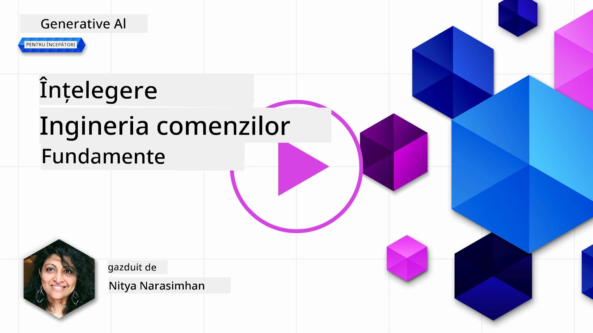
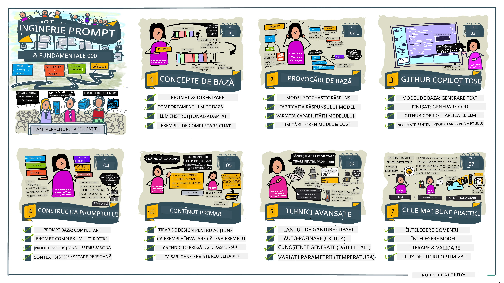
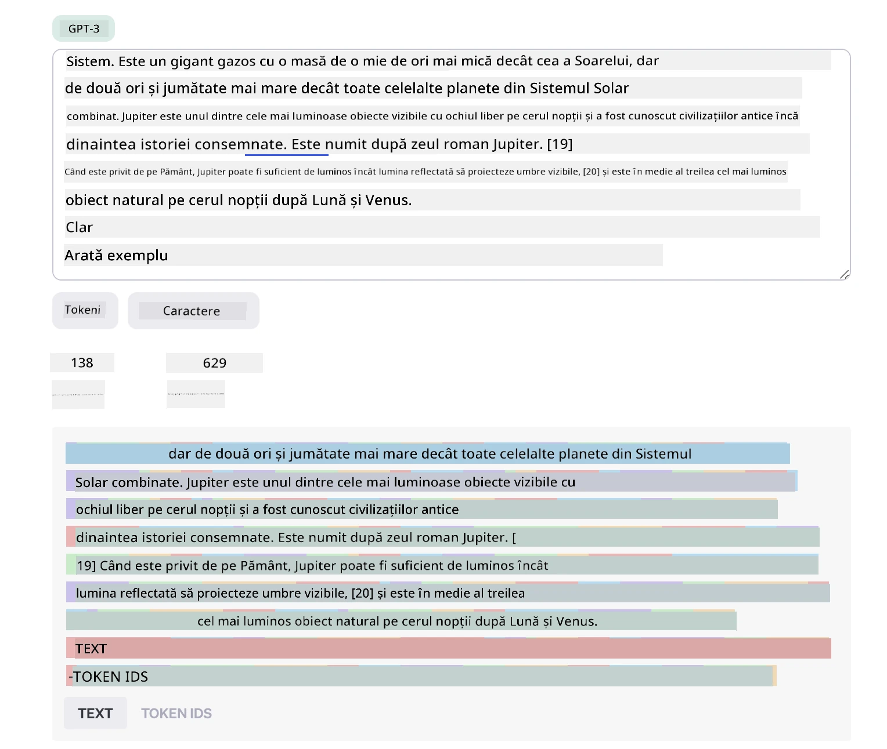
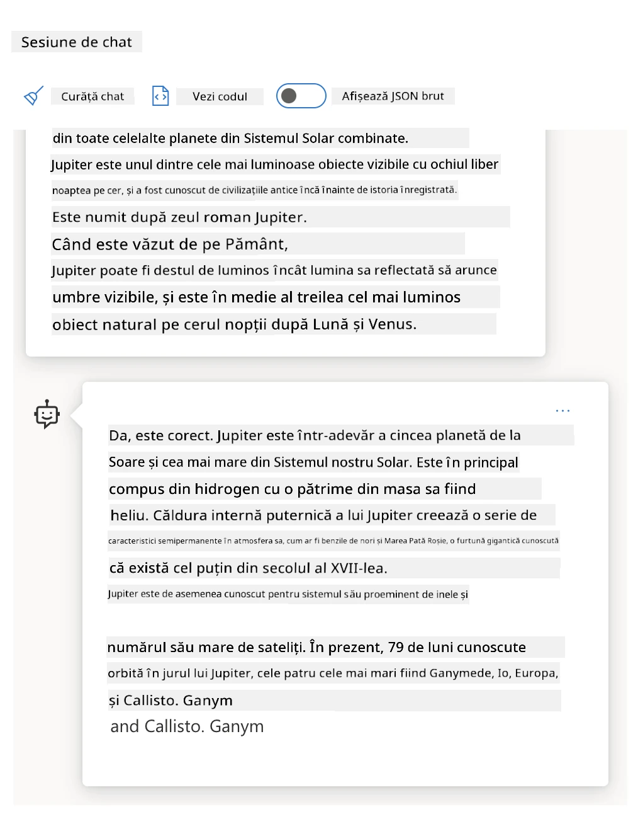
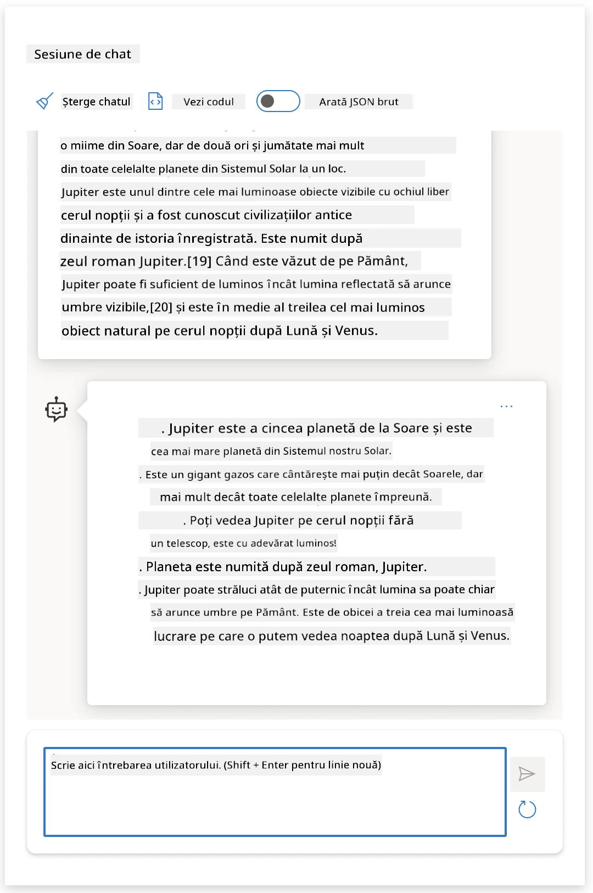
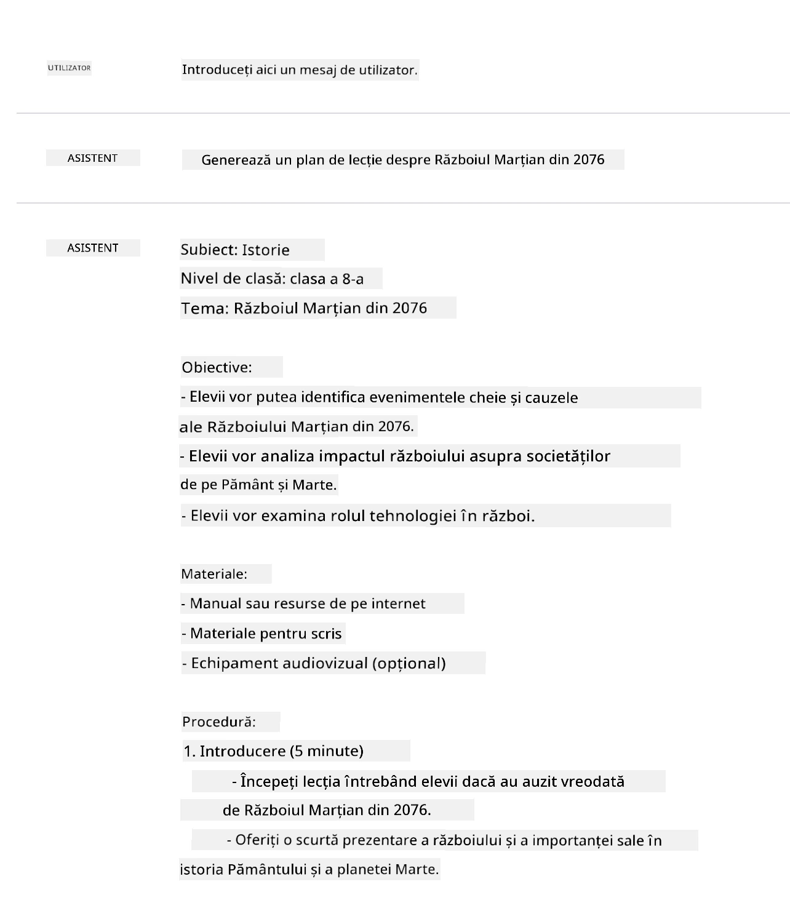
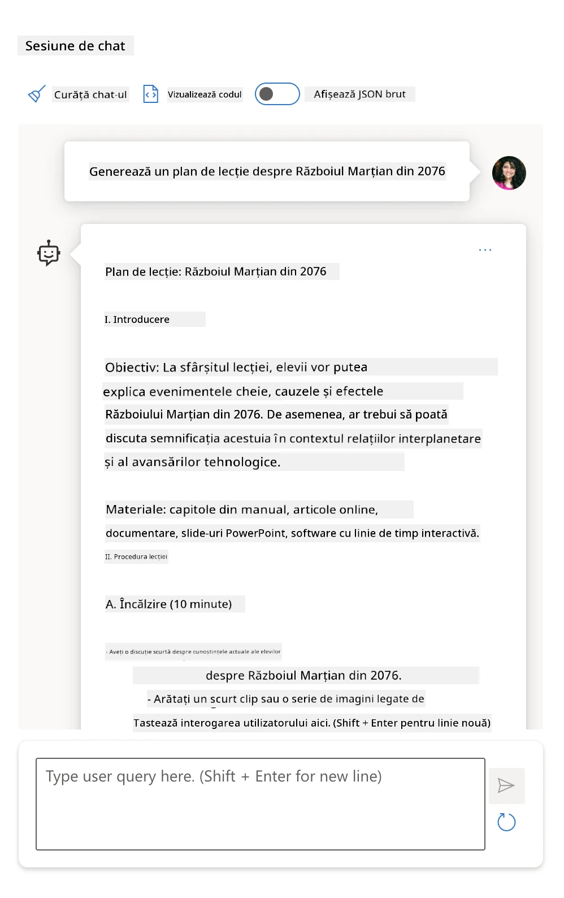
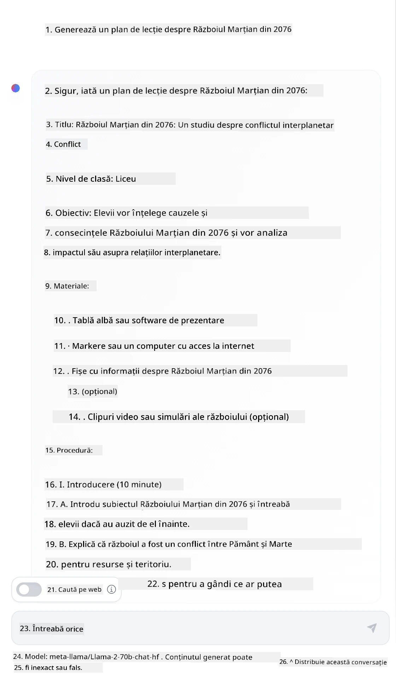

# Fundamentele Ingineriei Prompturilor

[](https://youtu.be/GElCu2kUlRs?si=qrXsBvXnCW12epb8)

## Introducere
Acest modul acoperă conceptele și tehnicile esențiale pentru crearea de prompturi eficiente în modelele AI generative. Modul în care scrii promptul către un LLM contează de asemenea. Un prompt atent realizat poate obține o calitate mai bună a răspunsului. Dar ce înseamnă exact termenii _prompt_ și _ingineria prompturilor_? Și cum îmbunătățesc promptul _input_ pe care îl trimit către LLM? Acestea sunt întrebările la care vom încerca să răspundem în cadrul acestui capitol și următorul.

_AI Generativ_ este capabil să creeze conținut nou (de exemplu, text, imagini, audio, cod etc.) ca răspuns la cererile utilizatorilor. Realizează acest lucru folosind _Modele Mari de Limbaj_ precum seria GPT a OpenAI ("Generative Pre-trained Transformer"), antrenate pentru a folosi limbaj natural și cod.

Utilizatorii pot acum interacționa cu aceste modele folosind paradigme cunoscute, precum chat, fără a avea nevoie de expertiză tehnică sau instruire. Modelele sunt _bazate pe prompturi_ - utilizatorii trimit un input text (prompt) și primesc înapoi răspunsul AI (completare). Ei pot apoi să "converseze cu AI-ul" iterativ, în conversații cu mai multe tururi, rafinând promptul până când răspunsul corespunde așteptărilor lor.

„Prompturile” devin acum principalul _interfață de programare_ pentru aplicațiile AI generative, indicând modelelor ce să facă și influențând calitatea răspunsurilor returnate. „Ingineria prompturilor” este un domeniu în rapidă dezvoltare care se concentrează pe _proiectarea și optimizarea_ prompturilor pentru a oferi răspunsuri consistente și de calitate la scară largă.

## Obiective de învățare

În această lecție învățăm ce este Ingineria Prompturilor, de ce contează și cum să creăm prompturi mai eficiente pentru un model și un obiectiv aplicațional dat. Vom înțelege conceptele de bază și cele mai bune practici pentru ingineria prompturilor - și vom învăța despre un mediu interactiv „sandbox” în Jupyter Notebooks unde putem vedea aceste concepte aplicate în exemple reale.

La finalul acestei lecții vom putea:

1. Explica ce este ingineria prompturilor și de ce contează.
2. Descrie componentele unui prompt și cum sunt folosite.
3. Învața cele mai bune practici și tehnici pentru ingineria prompturilor.
4. Aplica tehnicile învățate pe exemple reale, utilizând un endpoint OpenAI.

## Termeni cheie

Ingineria Prompturilor: Practica de proiectare și rafinare a inputurilor pentru a ghida modelele AI să producă rezultate dorite.  
Tokenizare: Procesul de transformare a textului în unități mai mici, numite tokeni, pe care un model le poate înțelege și procesa.  
LLM-uri Antrenate pe Instrucțiuni: Modele Mari de Limbaj (LLM) care au fost ajustate cu instrucțiuni specifice pentru a îmbunătăți acuratețea și relevanța răspunsurilor lor.

## Mediu de Învățare Sandbox

Ingineria prompturilor este în prezent mai mult o artă decât o știință. Cel mai bun mod de a ne îmbunătăți intuiția este să _exersăm mai mult_ și să adoptăm o abordare de tip încercare și eroare care combină expertiza domeniului de aplicare cu tehnicile recomandate și optimizările specifice modelului.

Jupyter Notebook-ul care însoțește această lecție oferă un mediu _sandbox_ unde poți încerca ceea ce înveți - pe parcurs sau ca parte a provocării cu cod la final. Pentru a executa exercițiile, vei avea nevoie de:

1. **O cheie API Azure OpenAI** - endpoint-ul serviciului pentru un LLM implementat.  
2. **Un Runtime Python** - în care poate fi executat Notebook-ul.  
3. **Variabile de mediu locale** - _completează acum pașii din [SETUP](./../00-course-setup/02-setup-local.md?WT.mc_id=academic-105485-koreyst) pentru a fi gata_.

Notebook-ul vine cu exerciții de _start_ - dar ești încurajat să adaugi propriile secțiuni de _Markdown_ (descriere) și _Cod_ (cereri prompt) pentru a încerca mai multe exemple sau idei - și să-ți construiești intuiția pentru proiectarea prompturilor.

## Ghid ilustrat

Vrei să înțelegi imaginea de ansamblu a ceea ce acoperă această lecție înainte să începi? Consultă acest ghid ilustrat, care îți oferă o idee despre principalele subiecte acoperite și punctele cheie de reflectat pentru fiecare. Planul lecției te conduce de la înțelegerea conceptelor de bază și a provocărilor către abordarea lor cu tehnici relevante de inginerie a prompturilor și cele mai bune practici. Reține că secțiunea „Tehnici Avansate” din acest ghid face referire la conținutul acoperit în capitolul _următor_ al acestui curriculum.



## Startup-ul nostru

Acum, să vorbim despre cum _acest subiect_ se raportează la misiunea startup-ului nostru de a [aduce inovația AI în educație](https://educationblog.microsoft.com/2023/06/collaborating-to-bring-ai-innovation-to-education?WT.mc_id=academic-105485-koreyst). Dorim să construim aplicații AI pentru _învățare personalizată_ - așa că să ne gândim cum diferiți utilizatori ai aplicației noastre ar putea „proiecta” prompturi:

- **Administratorii** ar putea cere AI-ului să _analizeze datele curriculumului pentru a identifica lacune în acoperire_. AI-ul poate rezuma rezultatele sau le poate vizualiza cu cod.  
- **Educatorii** ar putea cere AI-ului să _genereze un plan de lecție pentru un public țintă și un subiect_. AI-ul poate construi planul personalizat într-un format specificat.  
- **Elevii** ar putea cere AI-ului să _le fie tutor într-un subiect dificil_. AI-ul poate ghida acum elevii cu lecții, sugestii și exemple adaptate nivelului lor.

Acesta este doar vârful aisbergului. Consultă [Prompts For Education](https://github.com/microsoft/prompts-for-edu/tree/main?WT.mc_id=academic-105485-koreyst) - o bibliotecă open-source de prompturi curatoriată de experți în educație - pentru a obține o perspectivă mai largă asupra posibilităților! _Încearcă să rulezi unele dintre aceste prompturi în sandbox sau folosind OpenAI Playground pentru a vedea ce se întâmplă!_

<!--
LESSON TEMPLATE:
This unit should cover core concept #1.
Reinforce the concept with examples and references.

CONCEPT #1:
Prompt Engineering.
Define it and explain why it is needed.
-->

## Ce este Ingineria Prompturilor?

Am început această lecție definind **Ingineria Prompturilor** ca procesul de _proiectare și optimizare_ a inputurilor text (prompturi) pentru a livra răspunsuri consistente și de calitate (completări) pentru un anumit obiectiv aplicațional și model. Putem considera acest proces în 2 pași:

- _proiectarea_ promptului inițial pentru un anumit model și obiectiv  
- _rafinarea_ promptului iterativ pentru a îmbunătăți calitatea răspunsului

Este în mod necesar un proces de încercare și eroare care necesită intuiția și efortul utilizatorului pentru a obține rezultate optime. Deci de ce este important? Pentru a răspunde la această întrebare, trebuie mai întâi să înțelegem trei concepte:

- _Tokenizarea_ = cum „vede” modelul promptul  
- _LLM-urile de bază_ = cum „procesează” modelul de bază un prompt  
- _LLM-urile antrenate pe instrucțiuni_ = cum poate modelul acum să „vadă sarcini”

### Tokenizarea

Un LLM vede prompturile ca o _secvență de tokeni_ unde diferite modele (sau versiuni ale unui model) pot tokeniza același prompt în moduri diferite. Deoarece LLM-urile sunt antrenate pe tokeni (și nu pe text brut), modul în care prompturile sunt tokenizate are un impact direct asupra calității răspunsului generat.

Pentru a-ți face o idee despre cum funcționează tokenizarea, încearcă unelte precum [OpenAI Tokenizer](https://platform.openai.com/tokenizer?WT.mc_id=academic-105485-koreyst) afișate mai jos. Copiază promptul tău - și vezi cum se transformă în tokeni, acordând atenție modului în care sunt tratate caracterele spațiu și semnele de punctuație. Reține că acest exemplu arată un LLM mai vechi (GPT-3) - deci încercarea cu un model mai nou poate produce un rezultat diferit.



### Concept: Modele Fundamentale

După ce un prompt este tokenizat, funcția principală a ["LLM-ului de bază"](https://blog.gopenai.com/an-introduction-to-base-and-instruction-tuned-large-language-models-8de102c785a6?WT.mc_id=academic-105485-koreyst) (sau modelului fundamental) este să prezică tokenul din acea secvență. Deoarece LLM-urile sunt antrenate pe date masive de text, ele au o bună înțelegere a relațiilor statistice dintre tokeni și pot face această predicție cu un anumit grad de încredere. Reține că ele nu înțeleg _sensul_ cuvintelor din prompt sau token; ele văd doar un tipar pe care îl pot „completa” cu următoarea predicție. Pot continua să prezică secvența până când se termină prin intervenția utilizatorului sau o condiție prestabilită.

Vrei să vezi cum funcționează completarea bazată pe prompt? Introdu promptul de mai sus în Azure OpenAI Studio [_Chat Playground_](https://oai.azure.com/playground?WT.mc_id=academic-105485-koreyst) cu setările implicite. Sistemul este configurat să trateze prompturile ca cereri de informații - așa că ar trebui să vezi o completare care satisface acest context.

Dar ce se întâmplă dacă utilizatorul vrea să vadă ceva specific care să corespundă unui anumit criteriu sau obiectiv de sarcină? Aici intră în joc LLM-urile _antrenate pe instrucțiuni_.



### Concept: LLM-uri Antrenate pe Instrucțiuni

Un [LLM Antrenat pe Instrucțiuni](https://blog.gopenai.com/an-introduction-to-base-and-instruction-tuned-large-language-models-8de102c785a6?WT.mc_id=academic-105485-koreyst) pornește de la modelul fundamental și îl ajustează cu exemple sau perechi input/output (de exemplu, „mesaje” cu mai multe tururi) care pot conține instrucțiuni clare - iar răspunsul AI încearcă să urmeze acea instrucțiune.

Acest lucru folosește tehnici precum Învățarea prin Recompensă cu Feedback Uman (RLHF) ce pot antrena modelul să _urmeze instrucțiuni_ și să _învețe din feedback_, astfel încât să producă răspunsuri mai potrivite pentru aplicații practice și mai relevante pentru obiectivele utilizatorului.

Hai să încercăm - revino la promptul de mai sus, dar acum schimbă _mesajul sistem_ pentru a oferi următoarea instrucțiune ca context:

> _Rezuma conținutul pe care îl primești pentru un elev de clasa a doua. Păstrează rezultatul într-un paragraf și 3-5 puncte principale în format listă._

Vezi cum rezultatul este acum ajustat să reflecte scopul și formatul dorit? Un educator poate folosi direct acest răspuns în slide-urile pentru acea clasă.



## De ce avem nevoie de Ingineria Prompturilor?

Acum că știm cum sunt procesate prompturile de către LLM-uri, să vorbim despre _de ce_ avem nevoie de ingineria prompturilor. Răspunsul constă în faptul că LLM-urile actuale prezintă o serie de provocări care fac ca _completările fiabile și consistente_ să fie mai greu de obținut fără a depune efort în construcția și optimizarea promptului. De exemplu:

1. **Răspunsurile modelului sunt stocastice.** _Același prompt_ va produce probabil răspunsuri diferite cu modele sau versiuni diferite ale modelului. Și chiar și cu _același model_ pot apărea rezultate diferite la momente diferite. _Tehnicile de inginerie a prompturilor ne pot ajuta să minimizăm aceste variații oferind ghidaje mai bune_.

1. **Modelele pot fabrica răspunsuri.** Modelele sunt antrenate pe seturi de date _mari, dar finite_, ceea ce înseamnă că le lipsește cunoașterea despre concepte din afara acelui domeniu de antrenament. Ca urmare, pot produce completări inexacte, imaginare sau chiar contradictorii cu fapte cunoscute. _Tehnicile de inginerie a prompturilor ajută utilizatorii să identifice și să atenueze astfel de fabricări, de exemplu, cerând AI-ului citări sau explicații_.

1. **Capabilitățile modelelor vor varia.** Modelele noi sau generațiile noi vor avea capabilități mai bogate, dar vor aduce de asemenea particularități unice și compromisuri în cost și complexitate. _Ingineria prompturilor ne poate ajuta să dezvoltăm cele mai bune practici și fluxuri de lucru care abstractizează diferențele și se adaptează la cerințele specifice modelului într-un mod scalabil și fluid_.

Hai să vedem asta în acțiune în OpenAI sau Azure OpenAI Playground:

- Folosește același prompt cu implementări diferite de LLM (de exemplu, OpenAI, Azure OpenAI, Hugging Face) - ai observat variațiile?  
- Folosește același prompt repetat cu _același_ deployment LLM (de exemplu, Azure OpenAI playground) - cum au diferit aceste variații?

### Exemplu de Fabricări

În acest curs, folosim termenul **„fabricare”** pentru a face referire la fenomenul prin care LLM-urile generează uneori informații factual inexacte din cauza limitărilor antrenamentului lor sau a altor constrângeri. Probabil ai mai auzit acest fenomen numit _„halucinații”_ în articole populare sau lucrări de cercetare. Totuși, recomandăm puternic folosirea termenului _„fabricare”_ pentru a evita antropomorfizarea comportamentului prin atribuirea unui trăsătură umană unui rezultat generat de mașină. Aceasta întărește și [ghidurile pentru AI responsabil](https://www.microsoft.com/ai/responsible-ai?WT.mc_id=academic-105485-koreyst) din perspectiva terminologiei, eliminând termeni care ar putea fi considerați ofensatori sau neincluzivi în anumite contexte.

Vrei să înțelegi cum funcționează fabricările? Gândește-te la un prompt care instructează AI să genereze conținut despre un subiect inexistent (pentru a te asigura că nu se găsește în datasetul de antrenament). De exemplu - am încercat acest prompt:

> **Prompt:** generează un plan de lecție pentru Războiul Marțian din 2076.
O căutare web mi-a arătat că există relatări fictive (de exemplu, seriale de televiziune sau cărți) despre războaie marțiene - dar niciuna în 2076. Bunul simț ne spune de asemenea că 2076 este _în viitor_ și, prin urmare, nu poate fi asociat cu un eveniment real.

Deci ce se întâmplă când rulăm acest prompt cu diferiți furnizori LLM?

> **Răspuns 1**: OpenAI Playground (GPT-35)



> **Răspuns 2**: Azure OpenAI Playground (GPT-35)



> **Răspuns 3**: : Hugging Face Chat Playground (LLama-2)



Așa cum era de așteptat, fiecare model (sau versiune a modelului) produce răspunsuri ușor diferite datorită comportamentului aleator și variațiilor în capacitatea modelului. De exemplu, un model se adresează unui public de clasa a 8-a, în timp ce celălalt presupune un elev de liceu. Dar toate cele trei modele au generat răspunsuri care ar putea convinge un utilizator neinformat că evenimentul a fost real.

Tehnicile de inginerie a promptului precum _metaprompting_ și _configurarea temperaturii_ pot reduce fabricările modelului într-o anumită măsură. Noile _arhitecturi_ de inginerie a promptului încorporează de asemenea noi unelte și tehnici fluid în fluxul promptului pentru a atenua sau reduce unele dintre aceste efecte.

## Studiu de Caz: GitHub Copilot

Să încheiem această secțiune având o idee despre cum se folosește ingineria promptului în soluții reale, analizând un Studiu de Caz: [GitHub Copilot](https://github.com/features/copilot?WT.mc_id=academic-105485-koreyst).

GitHub Copilot este „Programatorul tău AI în pereche” – convertește prompturile text în completări de cod și este integrat în mediul tău de dezvoltare (de exemplu, Visual Studio Code) pentru o experiență utilizator fluidă. Așa cum este documentat în seria de bloguri de mai jos, prima versiune a fost bazată pe modelul OpenAI Codex – inginerii realizând rapid necesitatea de a adapta fin modelul și de a dezvolta tehnici mai bune de inginerie a promptului pentru a îmbunătăți calitatea codului. În iulie, ei au [lansat un model AI îmbunătățit care depășește Codex](https://github.blog/2023-07-28-smarter-more-efficient-coding-github-copilot-goes-beyond-codex-with-improved-ai-model/?WT.mc_id=academic-105485-koreyst) pentru sugestii și mai rapide.

Citește postările în ordine pentru a urmări călătoria lor de învățare.

- **Mai 2023** | [GitHub Copilot devine mai bun în a înțelege codul tău](https://github.blog/2023-05-17-how-github-copilot-is-getting-better-at-understanding-your-code/?WT.mc_id=academic-105485-koreyst)
- **Mai 2023** | [În interiorul GitHub: lucrul cu LLM-urile din spatele GitHub Copilot](https://github.blog/2023-05-17-inside-github-working-with-the-llms-behind-github-copilot/?WT.mc_id=academic-105485-koreyst)
- **Iun 2023** | [Cum să scrii prompturi mai bune pentru GitHub Copilot](https://github.blog/2023-06-20-how-to-write-better-prompts-for-github-copilot/?WT.mc_id=academic-105485-koreyst)
- **Iul 2023** | [GitHub Copilot depășește Codex cu un model AI îmbunătățit](https://github.blog/2023-07-28-smarter-more-efficient-coding-github-copilot-goes-beyond-codex-with-improved-ai-model/?WT.mc_id=academic-105485-koreyst)
- **Iul 2023** | [Ghidul unui dezvoltator pentru ingineria promptului și LLM-uri](https://github.blog/2023-07-17-prompt-engineering-guide-generative-ai-llms/?WT.mc_id=academic-105485-koreyst)
- **Sep 2023** | [Cum să construiești o aplicație enterprise LLM: Lecții de la GitHub Copilot](https://github.blog/2023-09-06-how-to-build-an-enterprise-llm-application-lessons-from-github-copilot/?WT.mc_id=academic-105485-koreyst)

Poți de asemenea să răsfoiești [blogul lor de inginerie](https://github.blog/category/engineering/?WT.mc_id=academic-105485-koreyst) pentru mai multe articole, cum ar fi [acesta](https://github.blog/2023-09-27-how-i-used-github-copilot-chat-to-build-a-reactjs-gallery-prototype/?WT.mc_id=academic-105485-koreyst) care arată cum sunt _aplicate_ aceste modele și tehnici pentru a conduce aplicații din lumea reală.

---

<!--
LESSON TEMPLATE:
This unit should cover core concept #2.
Reinforce the concept with examples and references.

CONCEPT #2:
Prompt Design.
Illustrated with examples.
-->

## Construcția promptului

Am văzut de ce ingineria promptului este importantă – acum să înțelegem cum sunt _construite_ prompturile ca să putem evalua diferite tehnici pentru un design mai eficient al promptului.

### Prompt de bază

Să începem cu promptul de bază: un text introdus trimis modelului fără alt context. Iată un exemplu – când trimitem primele câteva cuvinte ale imnului național al SUA către OpenAI [Completion API](https://platform.openai.com/docs/api-reference/completions?WT.mc_id=academic-105485-koreyst), el completează instantaneu răspunsul cu următoarele câteva versuri, ilustrând comportamentul de predicție de bază.

| Prompt (Input)     | Completare (Output)                                                                                                                        |
| :----------------- | :----------------------------------------------------------------------------------------------------------------------------------------- |
| Oh say can you see | Pare că începi versurile la „The Star-Spangled Banner,” imnul național al Statelor Unite. Versurile complete sunt ... |

### Prompt complex

Acum să adăugăm context și instrucțiuni la promptul de bază. [Chat Completion API](https://learn.microsoft.com/azure/ai-services/openai/how-to/chatgpt?WT.mc_id=academic-105485-koreyst) ne permite să construim un prompt complex ca o colecție de _mesaje_ cu:

- Perechi input/output reflectând inputul _utilizatorului_ și răspunsul _asistentului_.
- Mesaj al sistemului care setează contextul pentru comportamentul sau personalitatea asistentului.

Cererea este acum în forma de mai jos, unde _tokenizarea_ capturează eficient informațiile relevante din context și conversație. Acum, schimbarea contextului sistemului poate fi la fel de impactantă asupra calității completărilor ca și inputurile utilizatorului oferite.

```python
response = openai.chat.completions.create(
    model="gpt-3.5-turbo",
    messages=[
        {"role": "system", "content": "You are a helpful assistant."},
        {"role": "user", "content": "Who won the world series in 2020?"},
        {"role": "assistant", "content": "The Los Angeles Dodgers won the World Series in 2020."},
        {"role": "user", "content": "Where was it played?"}
    ]
)
```

### Prompt de instrucțiuni

În exemplele de mai sus, promptul utilizatorului a fost o simplă interogare text ce poate fi interpretată ca o cerere de informații. Cu prompturi de _instrucțiuni_, putem folosi acel text pentru a specifica o sarcină în mai multe detalii, oferind o ghidare mai bună AI-ului. Iată un exemplu:

| Prompt (Input)                                                                                                                                                                                                                         | Completare (Output)                                                                                                        | Tip instrucțiune    |
| :------------------------------------------------------------------------------------------------------------------------------------------------------------------------------------------------------------------------------------- | :------------------------------------------------------------------------------------------------------------------------- | :------------------ |
| Scrie o descriere a Războiului Civil                                                                                                                                                                                                   | _a returnat un paragraf simplu_                                                                                          | Simplu              |
| Scrie o descriere a Războiului Civil. Furnizează date și evenimente cheie și descrie semnificația lor                                                                                                                                  | _a returnat un paragraf urmat de o listă cu datele evenimentelor cheie și descrieri_                                       | Complex             |
| Scrie o descriere a Războiului Civil în 1 paragraf. Oferă 3 puncte bullet cu date cheie și semnificația lor. Oferă încă 3 puncte bullet cu figuri istorice importante și contribuțiile lor. Returnează outputul ca fișier JSON              | _returnează detalii extinse într-o casetă de text, formatat ca JSON ce poate fi copiat și validat după nevoie_              | Complex. Formatat.   |

## Conținut primar

În exemplele de mai sus, promptul a rămas destul de deschis, permițând LLM-ului să decidă ce parte din setul său preantrenat este relevantă. Cu designul _conținut primar_, textul de input este împărțit în două părți:

- o instrucțiune (acțiune)
- conținut relevant (care influențează acțiunea)

Iată un exemplu unde instrucțiunea este „rezumă asta în 2 propoziții”.

| Prompt (Input)                                                                                                                                                                                                                                                                                                                                                                                                                                                                                                                                                                                                                                                                                      | Completare (Output)                                                                                                                                                                                                                                                                             |
| :-------------------------------------------------------------------------------------------------------------------------------------------------------------------------------------------------------------------------------------------------------------------------------------------------------------------------------------------------------------------------------------------------------------------------------------------------------------------------------------------------------------------------------------------------------------------------------------------------------------------------------------------------------------------------------------------------- | :---------------------------------------------------------------------------------------------------------------------------------------------------------------------------------------------------------------------------------------------------------------------------------------------- |
| Jupiter este a cincea planetă de la Soare și cea mai mare din Sistemul Solar. Este un gigant gazos cu o masă de o mie de ori mai mică decât cea a Soarelui, dar de două ori și jumătate mai mare decât a tuturor celorlalte planete din Sistemul Solar împreună. Jupiter este unul dintre cele mai strălucitoare obiecte vizibile cu ochiul liber pe cerul nopții și a fost cunoscut de civilizațiile antice încă dinainte de istoria înregistrată. Poartă numele zeului roman Jupiter.[19] Privit de pe Pământ, Jupiter poate fi suficient de strălucitor pentru ca lumina reflectată să arunce umbre vizibile,[20] și este în medie al treilea obiect natural ca strălucire pe cerul nopții după Lună și Venus. <br/> **Rezumați în 2 propoziții scurte** | Jupiter, a cincea planetă de la Soare, este cea mai mare din Sistemul Solar și este cunoscută pentru faptul că este unul dintre cele mai strălucitoare obiecte pe cerul nopții. Purtând numele zeului roman Jupiter, este un gigant gazos a cărui masă este de două ori și jumătate mai mare decât cea a tuturor celorlalte planete din Sistemul Solar împreună. |

Segmentul de conținut primar poate fi folosit în mai multe moduri pentru a conduce instrucțiuni mai eficiente:

- **Exemple** - în loc să spui modelului ce să facă printr-o instrucțiune explicită, oferă-i exemple a ceea ce trebuie să facă și lasă-l să deducă tiparul.
- **Indicii** - urmează instrucțiunea cu un „indiciu” care pregătește completarea, ghidând modelul spre răspunsuri mai relevante.
- **Șabloane** - acestea sunt „rețete” repetitive pentru prompturi cu locuri libere (variabile) care pot fi personalizate cu date pentru cazuri de utilizare specifice.

Să explorăm acestea în acțiune.

### Folosirea Exemplelor

Aceasta este o abordare în care folosești conținutul primar pentru a „hrăni modelul” cu câteva exemple ale outputului dorit pentru o instrucțiune dată și îl lași să deducă modelul pentru outputul dorit. În funcție de numărul de exemple oferite, putem avea zero-shot prompting, one-shot prompting, few-shot prompting etc.

Promptul constă acum în trei componente:

- O descriere a sarcinii
- Câteva exemple ale outputului dorit
- Începutul unui nou exemplu (care devine o descriere implicită a sarcinii)

| Tip de învățare | Prompt (Input)                                                                                                                                        | Completare (Output)         |
| :-------------- | :-------------------------------------------------------------------------------------------------------------------------------------------------- | :-------------------------- |
| Zero-shot       | "Soarele strălucește". Tradu în spaniolă                                                                                                           | "El Sol está brillando".    |
| One-shot        | "Soarele strălucește" => "El Sol está brillando". <br> „Este o zi friguroasă și vântoasă” =>                                                        | "Es un día frío y ventoso". |
| Few-shot        | Jucătorul a alergat bazele => Baseball <br/> Jucătorul a dat un as => Tenis <br/> Jucătorul a dat șase => Cricket <br/> Jucătorul a făcut un slam-dunk => | Baschet                    |
|                 |                                                                                                                                                     |                             |

Observă cum în zero-shot prompting a trebuit să oferim instrucțiunea explicită („Tradu în spaniolă”), dar în exemplul one-shot promptarea este dedusă. Exemplul few-shot arată cum prin adăugarea de mai multe exemple modelele pot face inferențe mai precise fără instrucțiuni adăugate.

### Indiciile în Prompt

O altă tehnică pentru folosirea conținutului primar este să oferi _indici_ în loc de exemple. În acest caz, oferim modelului un impuls în direcția corectă prin _introducerea lui_ cu o mostră care reflectă formatul răspunsului dorit. Modelul „prinde indiciul” și continuă în aceeași linie.

| Număr de indicii | Prompt (Input)                                                                                                                                                                                                                                                                                                                                                                                                                                               | Completare (Output)                                                                                                                                                                                                                                                                                       |
| :--------------- | :----------------------------------------------------------------------------------------------------------------------------------------------------------------------------------------------------------------------------------------------------------------------------------------------------------------------------------------------------------------------------------------------------------------------------------------------------------- | :-------------------------------------------------------------------------------------------------------------------------------------------------------------------------------------------------------------------------------------------------------------------------------------------------------- |
| 0                | Jupiter este a cincea planetă de la Soare și cea mai mare din Sistemul Solar. Este un gigant gazos cu o masă de o mie de ori mai mică decât cea a Soarelui, dar de două ori și jumătate mai mare decât a tuturor celorlalte planete din Sistemul Solar împreună. Jupiter este unul dintre cele mai strălucitoare obiecte vizibile cu ochiul liber pe cerul nopții și a fost cunoscut de civilizațiile antice încă dinainte de istoria înregistrată. <br/>**Rezumați acest text**                                       | Jupiter este cea mai mare planetă din Sistemul Solar și a cincea de la Soare. Este un gigant gazos cu o masă de 1/1000 din cea a Soarelui, dar este mai greu decât toate celelalte planete la un loc. Civilizațiile antice îl cunosc de mult și este ușor vizibil pe cerul nopții. |
| 1              | Jupiter este a cincea planetă de la Soare și cea mai mare din Sistemul Solar. Este un gigant gazos cu o masă de o mie de ori mai mică decât cea a Soarelui, dar de două ori și jumătate mai mare decât toate celelalte planete din Sistemul Solar împreună. Jupiter este unul dintre cele mai strălucitoare obiecte vizibile cu ochiul liber pe cerul nopții și a fost cunoscut civilizațiilor antice încă dinainte de istoria consemnată. <br/>**Rezumați aceasta** <br/> Ceea ce am învățat este că Jupiter | este a cincea planetă de la Soare și cea mai mare din Sistemul Solar. Este un gigant gazos cu o masă de o mie de ori mai mică decât cea a Soarelui, dar de două ori și jumătate mai mare decât toate celelalte planete combinate. Este ușor vizibil cu ochiul liber și a fost cunoscut încă din vremuri străvechi.                        |
| 2              | Jupiter este a cincea planetă de la Soare și cea mai mare din Sistemul Solar. Este un gigant gazos cu o masă de o mie de ori mai mică decât cea a Soarelui, dar de două ori și jumătate mai mare decât toate celelalte planete din Sistemul Solar împreună. Jupiter este unul dintre cele mai strălucitoare obiecte vizibile cu ochiul liber pe cerul nopții și a fost cunoscut civilizațiilor antice încă dinainte de istoria consemnată. <br/>**Rezumați aceasta** <br/> Top 3 lucruri pe care le-am învățat:         | 1. Jupiter este a cincea planetă de la Soare și cea mai mare din Sistemul Solar. <br/> 2. Este un gigant gazos cu o masă de o mie de ori mai mică decât cea a Soarelui...<br/> 3. Jupiter a fost vizibil cu ochiul liber încă din vremuri străvechi ...                                                                       |
|                |                                                                                                                                                                                                                                                                                                                                                                                                                                                              |                                                                                                                                                                                                                                                                                                           |

### Șabloane de prompturi

Un șablon de prompt este o _rețetă predefinită pentru un prompt_ care poate fi stocată și reutilizată după nevoie, pentru a oferi experiențe mai consistente utilizatorilor la scară largă. În cea mai simplă formă, este pur și simplu o colecție de exemple de prompturi precum [acesta de la OpenAI](https://platform.openai.com/examples?WT.mc_id=academic-105485-koreyst) care oferă atât componente interactive de prompt (mesaje pentru utilizator și sistem) cât și formatul cererii prin API - pentru a sprijini reutilizarea.

În forma sa mai complexă, cum este [exemplul de la LangChain](https://python.langchain.com/docs/concepts/prompt_templates/?WT.mc_id=academic-105485-koreyst), conține _locuri pentru date_ care pot fi înlocuite cu date din diferite surse (introducerea utilizatorului, contextul sistemului, surse externe etc.) pentru a genera un prompt dinamic. Aceasta ne permite să creăm o bibliotecă de prompturi reutilizabile care pot fi folosite pentru a oferi experiențe consistente **programatic** la scară.

În sfârșit, valoarea reală a șabloanelor constă în abilitatea de a crea și publica _biblioteci de prompturi_ pentru domenii verticale de aplicație - unde șablonul de prompt este acum _optimizat_ să reflecte contextul specific al aplicației sau exemplele care fac răspunsurile mai relevante și exacte pentru audiența țintă. Repozitoriul [Prompts For Edu](https://github.com/microsoft/prompts-for-edu?WT.mc_id=academic-105485-koreyst) este un exemplu excelent, colecționând o bibliotecă de prompturi pentru domeniul educației cu accent pe obiective cheie precum planificarea lecțiilor, proiectarea curriculei, tutoratul studenților etc.

## Conținut de sprijin

Dacă ne gândim la construcția unui prompt ca având o instrucțiune (sarcină) și un țintă (conținutul principal), atunci _conținutul secundar_ este precum un context suplimentar pe care îl oferim pentru a **influența răspunsul într-un fel**. Ar putea fi parametri de configurare, instrucțiuni de formatare, taxonomii de subiecte etc. care pot ajuta modelul să _ajusteze_ răspunsul pentru a corespunde obiectivelor sau așteptărilor utilizatorului.

De exemplu: Având un catalog de cursuri cu metadate extinse (nume, descriere, nivel, taguri metadate, instructor etc.) pentru toate cursurile disponibile în curriculă:

- putem defini o instrucțiune pentru „rezumă catalogul de cursuri pentru toamna 2023”
- putem folosi conținutul principal pentru a oferi câteva exemple de rezultat dorit
- putem folosi conținutul secundar pentru a identifica primele 5 "taguri" de interes.

Acum, modelul poate oferi un rezumat în formatul arătat de acele exemple - dar dacă un rezultat conține mai multe taguri, poate prioritiza cele 5 taguri identificate în conținutul secundar.

---

<!--
ȘABLON PROFESIONAL:
Această unitate ar trebui să acopere conceptul de bază #1.
Consolidați conceptul cu exemple și referințe.

CONCEPTUL #3:
Tehnici de inginerie a prompturilor.
Care sunt unele tehnici de bază pentru ingineria prompturilor?
Ilustrați cu exerciții.
-->

## Cele mai bune practici pentru prompturi

Acum că știm cum pot fi _construite_ prompturile, putem începe să ne gândim la cum să le _proiectăm_ pentru a reflecta cele mai bune practici. Putem analiza asta în două părți - având atitudinea (mindset) potrivită și aplicând tehnicile potrivite.

### Atitudinea în ingineria prompturilor

Ingineria prompturilor este un proces de încercare și eroare, așa că ține minte trei factori generali de ghidare:

1. **Înțelegerea domeniului este importantă.** Precizia și relevanța răspunsului depind de _domeniul_ în care aplicația sau utilizatorul operează. Aplică-ți intuiția și expertiza domeniului pentru a **personaliza tehnicile** mai departe. De exemplu, definește _personalități specifice domeniului_ în prompturile sistemului sau folosește _șabloane specifice domeniului_ în prompturile utilizatorului. Oferă conținut secundar care reflectă contexte specifice domeniului sau folosește _indici și exemple specifice domeniului_ pentru a ghida modelul către tipare familiare de utilizare.

2. **Înțelegerea modelului este importantă.** Știm că modelele sunt pe natură lor stocastice. Dar implementările modelului pot varia în funcție de setul de date de antrenament folosit (cunoștințe pre-antrenate), funcționalitățile pe care le oferă (ex: prin API sau SDK) și tipul conținutului pentru care sunt optimizate (ex: cod, imagini, text). Înțelege punctele forte și limitările modelului pe care îl folosești și folosește acestă cunoaștere pentru a _prioritiza sarcini_ sau pentru a construi _șabloane personalizate_ optimizate pentru capabilitățile modelului.

3. **Iterația și validarea contează.** Modelele evoluează rapid, la fel ca și tehnicile de inginerie a prompturilor. Ca expert în domeniu, s-ar putea să ai alte contexte sau criterii pentru _aplicația ta specifică_, care pot să nu se aplice comunității mai largi. Folosește instrumente și tehnici de inginerie a prompturilor pentru a „accelera” construcția unui prompt, apoi iteră și validează rezultatele folosindu-ți propria intuiție și expertiză. Înregistrează-ți observațiile și creează o **bază de cunoștințe** (ex: biblioteci de prompturi) care pot fi folosite ca bază nouă de către alții, pentru iterații mai rapide pe viitor.

## Cele mai bune practici

Acum, să vedem cele mai comune bune practici recomandate de practicienii de la [OpenAI](https://help.openai.com/en/articles/6654000-best-practices-for-prompt-engineering-with-openai-api?WT.mc_id=academic-105485-koreyst) și [Azure OpenAI](https://learn.microsoft.com/azure/ai-services/openai/concepts/prompt-engineering#best-practices?WT.mc_id=academic-105485-koreyst).

| Ce                               | De ce                                                                                                                                                                                                                                              |
| :-------------------------------- | :------------------------------------------------------------------------------------------------------------------------------------------------------------------------------------------------------------------------------------------------- |
| Evaluează cele mai recente modele | Noile generații de modele au probabil caracteristici și calitate îmbunătățite - dar pot implica și costuri mai mari. Evaluează impactul, apoi decide migrarea.                                                                                     |
| Separă instrucțiunile și contextul | Verifică dacă modelul sau furnizorul folosește _delimitatori_ pentru a distinge mai clar instrucțiunile, conținutul principal și cel secundar. Acest lucru poate ajuta modelele să aloce mai corect greutăți tokenurilor.                               |
| Fii specific și clar              | Oferă mai multe detalii despre contextul dorit, rezultatul, lungimea, formatul, stilul etc. Acest lucru îmbunătățește atât calitatea, cât și consistența răspunsurilor. Înregistrează rețetele în șabloane reutilizabile.                             |
| Fii descriptiv, folosește exemple | Modelele pot răspunde mai bine unei metode „arată și spune”. Începe cu o abordare `zero-shot`, unde dai instrucțiunea (fără exemple), apoi încearcă `few-shot` pentru rafinare, oferind câteva exemple de rezultat dorit. Folosește analogii.           |
| Folosește indici pentru a porni completările | Încurajează modelul spre un rezultat dorit dându-i câteva cuvinte sau expresii care să servească drept punct de plecare pentru răspuns.                                                                                                         |
| Reamplică (Double Down)            | Uneori poate fi nevoie să repeți instrucțiunile modelului. Furnizează instrucțiuni înainte și după conținutul principal, folosește o instrucțiune și un indiciu, etc. Iterează și validează pentru a vedea ce funcționează.                          |
| Ordinea contează                  | Ordinea în care prezinți informația modelului poate influența rezultatul, chiar și în exemplele de învățare, datorită biasului de recență. Încearcă opțiuni diferite ca să vezi ce funcționează mai bine.                                            |
| Oferă modelului o „portiță de ieșire” | Oferă modelului o opțiune de răspuns alternativ în caz că nu poate completa sarcina. Acest lucru reduce șansele ca modelul să genereze răspunsuri false sau fabricate.                                                                           |
|                                  |                                                                                                                                                                                                                                                   |

Ca orice bună practică, amintește-ți că _experiența ta poate varia_ în funcție de model, sarcină și domeniu. Folosește aceste recomandări ca punct de plecare și iterează pentru a găsi ce funcționează cel mai bine pentru tine. Reevaluează constant procesul de inginerie a prompturilor pe măsură ce apar noi modele și instrumente, cu accent pe scalabilitatea procesului și calitatea răspunsului.

<!--
ȘABLON PROFESIONAL:
Această unitate ar trebui să ofere o provocare de cod dacă este cazul

PROVOCARE:
Link către un Jupyter Notebook care conține doar comentarii de instrucțiuni (secțiunile de cod sunt goale).

SOLUȚIE:
Link către o copie a acelui Notebook cu prompturile completate și rularea exemplului de referință.
-->

## Tema

Felicitări! Ai ajuns la finalul lecției! Este timpul să pui în practică unele dintre conceptele și tehnicile studiate prin exemple reale!

Pentru tema noastră vom folosi un Jupyter Notebook cu exerciții pe care le poți completa interactiv. Poți extinde Notebook-ul cu propriile tale celule Markdown și cod pentru a explora idei și tehnici pe cont propriu.

### Pentru a începe, fă fork la repo, apoi

- (Recomandat) Lansează GitHub Codespaces
- (Alternativ) Clonează repo-ul pe dispozitivul tău local și folosește-l cu Docker Desktop
- (Alternativ) Deschide Notebook-ul în mediul de rulare preferat de Notebook.

### Apoi, configurează variabilele de mediu

- Copiază fișierul `.env.copy` aflat în rădăcina repo-ului într-un fișier `.env` și completează valorile pentru `AZURE_OPENAI_API_KEY`, `AZURE_OPENAI_ENDPOINT` și `AZURE_OPENAI_DEPLOYMENT`. Revino la secțiunea [Learning Sandbox](../../../04-prompt-engineering-fundamentals) pentru instrucțiuni.

### Apoi, deschide Jupyter Notebook

- Selectează kernel-ul de rulare. Dacă folosești opțiunile 1 sau 2, selectează pur și simplu kernel-ul Python 3.10.x oferit de containerul dev implicit.

Ești gata să rulezi exercițiile. Reține că aici nu există răspunsuri _bune sau greșite_ - ci doar explorarea opțiunilor prin încercări și construirea intuiției pentru ce funcționează într-un anumit model și domeniu de aplicație.

_Din acest motiv, nu există segmente cu Rezolvarea Codului în această lecție. În schimb, Notebook-ul va avea celule Markdown intitulate „Soluția mea:” care arată un exemplu de răspuns pentru referință._

 <!--
ȘABLON PROFESIONAL:
Încheie secțiunea cu un rezumat și resurse pentru învățare autodirijată.
-->

## Verificare de cunoștințe

Care dintre următoarele este un prompt bun care respectă unele bune practici rezonabile?

1. Arată-mi o imagine cu o mașină roșie
2. Arată-mi o imagine cu o mașină roșie de marca Volvo și model XC90 parcată lângă o stâncă la apus
3. Arată-mi o imagine cu o mașină roșie de marca Volvo și model XC90

A: 2, este cel mai bun prompt deoarece oferă detalii despre „ce” și intră în detalii (nu orice mașină, ci una specifică ca marcă și model) și de asemenea descrie cadrul înconjurător. 3 este următorul cel mai bun pentru că conține și el multă descriere.

## 🚀 Provocare

Încearcă să folosești tehnica „indiciului” cu promptul: Completează propoziția „Arată-mi o imagine cu o mașină roșie de marca Volvo și ". Cu ce răspunde și cum ai îmbunătăți promptul?

## Bravo! Continuă să înveți

Vrei să afli mai multe despre conceptele diferite din ingineria prompturilor? Accesează [pagina de învățare continuă](https://aka.ms/genai-collection?WT.mc_id=academic-105485-koreyst) pentru a găsi alte resurse excelente pe acest subiect.

Mergi la Lecția 5 unde vom explora [tehnici avansate de prompting](../05-advanced-prompts/README.md?WT.mc_id=academic-105485-koreyst)!

---

<!-- CO-OP TRANSLATOR DISCLAIMER START -->
**Declinarea responsabilității**:  
Acest document a fost tradus utilizând serviciul de traducere AI [Co-op Translator](https://github.com/Azure/co-op-translator). Deși ne străduim pentru acuratețe, vă rugăm să fiți conștienți că traducerile automate pot conține erori sau inexactități. Documentul original în limba sa nativă trebuie considerat sursa autorizată. Pentru informații critice, se recomandă traducerea profesională realizată de un specialist uman. Nu ne asumăm responsabilitatea pentru eventualele neînțelegeri sau interpretări greșite rezultate din utilizarea acestei traduceri.
<!-- CO-OP TRANSLATOR DISCLAIMER END -->