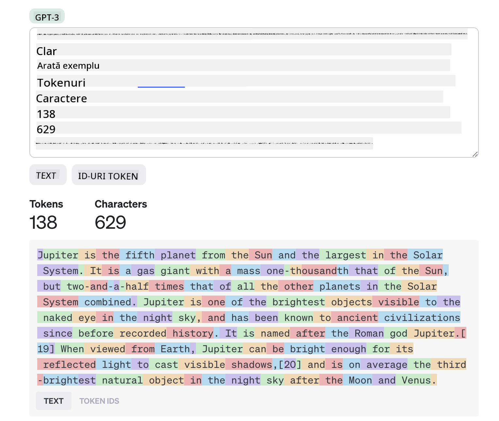
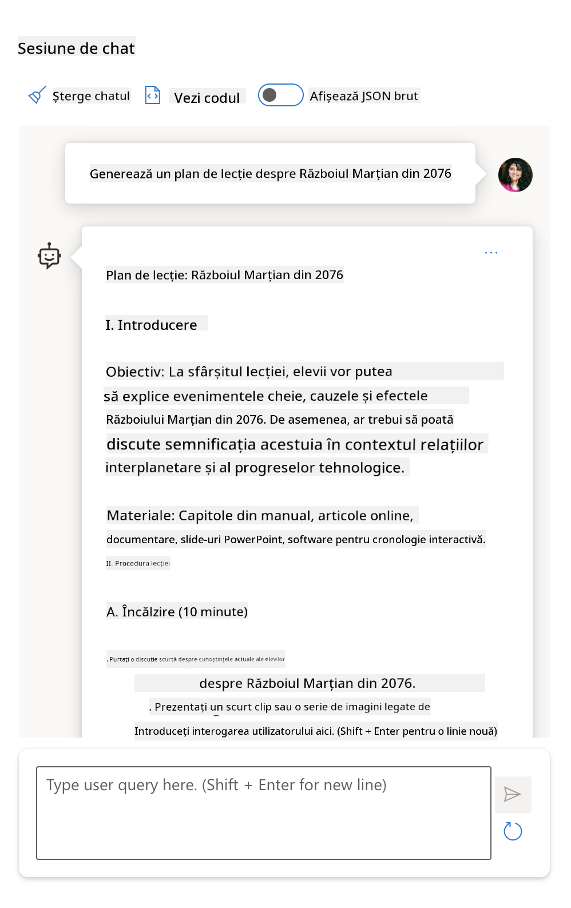

<!--
CO_OP_TRANSLATOR_METADATA:
{
  "original_hash": "a45c318dc6ebc2604f35b8b829f93af2",
  "translation_date": "2025-07-09T11:02:01+00:00",
  "source_file": "04-prompt-engineering-fundamentals/README.md",
  "language_code": "ro"
}
-->
# Fundamentele Ingineriei Prompturilor

[](https://aka.ms/gen-ai-lesson4-gh?WT.mc_id=academic-105485-koreyst)

## Introducere  
Acest modul acoperă conceptele și tehnicile esențiale pentru crearea de prompturi eficiente în modelele generative AI. Modul în care formulezi promptul pentru un LLM contează de asemenea. Un prompt bine conceput poate obține un răspuns de calitate superioară. Dar ce înseamnă exact termeni precum _prompt_ și _ingineria prompturilor_? Și cum pot îmbunătăți promptul _input_ pe care îl trimit către LLM? Acestea sunt întrebările la care vom încerca să răspundem în acest capitol și în următorul.

_Generative AI_ este capabil să creeze conținut nou (de exemplu, text, imagini, audio, cod etc.) ca răspuns la cererile utilizatorilor. Realizează acest lucru folosind _Modele Mari de Limbaj_ precum seria GPT („Generative Pre-trained Transformer”) de la OpenAI, antrenate pentru a folosi limbaj natural și cod.

Utilizatorii pot interacționa acum cu aceste modele folosind paradigme familiare, precum chat-ul, fără a avea nevoie de expertiză tehnică sau instruire. Modelele sunt _bazate pe prompturi_ – utilizatorii trimit un text (prompt) și primesc răspunsul AI (completare). Apoi pot „conversa cu AI-ul” iterativ, în conversații cu mai multe runde, rafinând promptul până când răspunsul corespunde așteptărilor lor.

„Prompturile” devin acum principalul _interfață de programare_ pentru aplicațiile AI generative, indicând modelelor ce să facă și influențând calitatea răspunsurilor returnate. „Ingineria prompturilor” este un domeniu în rapidă dezvoltare care se concentrează pe _proiectarea și optimizarea_ prompturilor pentru a oferi răspunsuri consistente și de calitate la scară largă.

## Obiective de învățare

În această lecție, vom învăța ce este Ingineria Prompturilor, de ce este importantă și cum putem crea prompturi mai eficiente pentru un anumit model și obiectiv de aplicație. Vom înțelege conceptele de bază și cele mai bune practici pentru ingineria prompturilor – și vom explora un mediu interactiv de tip Jupyter Notebooks „sandbox” unde putem vedea aceste concepte aplicate pe exemple reale.

La finalul acestei lecții vom putea:

1. Explica ce este ingineria prompturilor și de ce contează.
2. Descrie componentele unui prompt și modul în care sunt folosite.
3. Învăța cele mai bune practici și tehnici pentru ingineria prompturilor.
4. Aplica tehnicile învățate pe exemple reale, folosind un endpoint OpenAI.

## Termeni cheie

Ingineria Prompturilor: Practica de a proiecta și rafina inputurile pentru a ghida modelele AI să producă rezultate dorite.  
Tokenizare: Procesul de transformare a textului în unități mai mici, numite tokeni, pe care un model le poate înțelege și procesa.  
LLM-uri ajustate prin instrucțiuni: Modele Mari de Limbaj (LLM) care au fost ajustate fin cu instrucțiuni specifice pentru a îmbunătăți acuratețea și relevanța răspunsurilor.

## Mediu de învățare sandbox

Ingineria prompturilor este în prezent mai mult o artă decât o știință. Cel mai bun mod de a ne îmbunătăți intuiția este să _exersăm mai mult_ și să adoptăm o abordare de tip încercare și eroare care combină expertiza în domeniul aplicației cu tehnici recomandate și optimizări specifice modelului.

Jupyter Notebook-ul care însoțește această lecție oferă un mediu _sandbox_ unde poți încerca ceea ce înveți – pe parcurs sau ca parte a provocării de cod de la final. Pentru a executa exercițiile, vei avea nevoie de:

1. **O cheie API Azure OpenAI** – endpoint-ul serviciului pentru un LLM implementat.  
2. **Un runtime Python** – în care să rulezi Notebook-ul.  
3. **Variabile de mediu locale** – _finalizează pașii din [SETUP](./../00-course-setup/SETUP.md?WT.mc_id=academic-105485-koreyst) acum pentru a fi pregătit_.

Notebook-ul vine cu exerciții _de început_ – dar ești încurajat să adaugi propriile secțiuni de _Markdown_ (descriere) și _Cod_ (cereri de prompt) pentru a încerca mai multe exemple sau idei – și să-ți construiești intuiția pentru proiectarea prompturilor.

## Ghid ilustrat

Vrei să ai o imagine de ansamblu a ceea ce acoperă această lecție înainte să începi? Consultă acest ghid ilustrat, care îți oferă o idee despre principalele subiecte abordate și punctele cheie de reflectat pentru fiecare. Planul lecției te conduce de la înțelegerea conceptelor și provocărilor de bază până la abordarea lor cu tehnici relevante de inginerie a prompturilor și cele mai bune practici. Reține că secțiunea „Tehnici Avansate” din acest ghid se referă la conținutul acoperit în _capitolul următor_ al acestui curriculum.


## Startup-ul nostru

Acum, să vorbim despre cum _acest subiect_ se leagă de misiunea startup-ului nostru de a [aduce inovația AI în educație](https://educationblog.microsoft.com/2023/06/collaborating-to-bring-ai-innovation-to-education?WT.mc_id=academic-105485-koreyst). Dorim să construim aplicații AI pentru _învățare personalizată_ – așa că să ne gândim cum diferiți utilizatori ai aplicației noastre ar putea „proiecta” prompturi:

- **Administratorii** ar putea cere AI-ului să _analizeze datele curriculare pentru a identifica lacune în acoperire_. AI-ul poate rezuma rezultatele sau le poate vizualiza cu cod.  
- **Educatorii** ar putea cere AI-ului să _genereze un plan de lecție pentru un public țintă și un subiect_. AI-ul poate construi planul personalizat într-un format specificat.  
- **Elevii** ar putea cere AI-ului să _le ofere meditații la o materie dificilă_. AI-ul poate ghida acum elevii cu lecții, sugestii și exemple adaptate nivelului lor.

Aceasta este doar o mică parte din potențial. Consultă [Prompts For Education](https://github.com/microsoft/prompts-for-edu/tree/main?WT.mc_id=academic-105485-koreyst) – o bibliotecă open-source de prompturi curatoriată de experți în educație – pentru a avea o perspectivă mai largă asupra posibilităților! _Încearcă să rulezi unele dintre aceste prompturi în sandbox sau în OpenAI Playground pentru a vedea ce se întâmplă!_

<!--  
ȘABLON LECȚIE:  
Această unitate ar trebui să acopere conceptul de bază #1.  
Consolidează conceptul cu exemple și referințe.  

CONCEPT #1:  
Ingineria Prompturilor.  
Definește-l și explică de ce este necesar.  
-->

## Ce este Ingineria Prompturilor?

Am început această lecție definind **Ingineria Prompturilor** ca procesul de _proiectare și optimizare_ a inputurilor text (prompturi) pentru a oferi răspunsuri consistente și de calitate (completări) pentru un anumit obiectiv de aplicație și model. Putem vedea acest proces în două etape:

- _proiectarea_ promptului inițial pentru un anumit model și obiectiv  
- _rafinarea_ promptului iterativ pentru a îmbunătăți calitatea răspunsului

Acesta este neapărat un proces de încercare și eroare care necesită intuiție și efort din partea utilizatorului pentru a obține rezultate optime. Deci, de ce este important? Pentru a răspunde la această întrebare, trebuie mai întâi să înțelegem trei concepte:

- _Tokenizarea_ = cum „vede” modelul promptul  
- _LLM-urile de bază_ = cum „procesează” modelul fundație un prompt  
- _LLM-urile ajustate prin instrucțiuni_ = cum poate modelul acum să „înțeleagă sarcini”

### Tokenizarea

Un LLM vede prompturile ca o _secvență de tokeni_, iar diferite modele (sau versiuni ale unui model) pot tokeniza același prompt în moduri diferite. Deoarece LLM-urile sunt antrenate pe tokeni (și nu pe text brut), modul în care prompturile sunt tokenizate are un impact direct asupra calității răspunsului generat.

Pentru a-ți face o idee despre cum funcționează tokenizarea, încearcă unelte precum [OpenAI Tokenizer](https://platform.openai.com/tokenizer?WT.mc_id=academic-105485-koreyst) afișată mai jos. Copiază promptul tău și vezi cum este transformat în tokeni, acordând atenție modului în care sunt tratate spațiile și semnele de punctuație. Reține că acest exemplu arată un LLM mai vechi (GPT-3) – deci încercarea cu un model mai nou poate produce un rezultat diferit.



### Concept: Modele Fundație

Odată ce un prompt este tokenizat, funcția principală a ["Base LLM"](https://blog.gopenai.com/an-introduction-to-base-and-instruction-tuned-large-language-models-8de102c785a6?WT.mc_id=academic-105485-koreyst) (sau modelului fundație) este să prezică tokenul următor din secvență. Deoarece LLM-urile sunt antrenate pe seturi masive de date text, ele au o bună înțelegere a relațiilor statistice dintre tokeni și pot face această predicție cu un anumit grad de încredere. Reține că ele nu înțeleg _sensul_ cuvintelor din prompt sau token; văd doar un tipar pe care îl pot „completa” cu următoarea predicție. Pot continua să prezică secvența până când sunt oprite de intervenția utilizatorului sau de o condiție predefinită.

Vrei să vezi cum funcționează completarea bazată pe prompt? Introdu promptul de mai sus în Azure OpenAI Studio [_Chat Playground_](https://oai.azure.com/playground?WT.mc_id=academic-105485-koreyst) cu setările implicite. Sistemul este configurat să trateze prompturile ca cereri de informații – așa că ar trebui să vezi o completare care satisface acest context.

Dar ce se întâmplă dacă utilizatorul dorește să vadă ceva specific care să îndeplinească anumite criterii sau obiective de sarcină? Aici intră în scenă LLM-urile _ajustate prin instrucțiuni_.


### Concept: LLM-uri Ajustate prin Instrucțiuni

Un [LLM ajustat prin instrucțiuni](https://blog.gopenai.com/an-introduction-to-base-and-instruction-tuned-large-language-models-8de102c785a6?WT.mc_id=academic-105485-koreyst) pornește de la modelul fundație și îl ajustează fin cu exemple sau perechi input/output (de exemplu, „mesaje” cu mai multe runde) care pot conține instrucțiuni clare – iar răspunsul AI încearcă să urmeze acea instrucțiune.

Aceasta folosește tehnici precum Învățarea prin Recompensă cu Feedback Uman (RLHF) care pot antrena modelul să _urmeze instrucțiuni_ și să _învețe din feedback_, astfel încât să producă răspunsuri mai potrivite pentru aplicații practice și mai relevante pentru obiectivele utilizatorului.

Să încercăm – revino la promptul de mai sus, dar acum schimbă _mesajul sistem_ pentru a oferi următoarea instrucțiune ca context:

> _Rezuma conținutul oferit pentru un elev de clasa a doua. Păstrează rezultatul într-un paragraf cu 3-5 puncte esențiale._

Vezi cum rezultatul este acum ajustat pentru a reflecta scopul și formatul dorit? Un educator poate folosi direct acest răspuns în slide-urile pentru acea clasă.


## De ce avem nevoie de Ingineria Prompturilor?

Acum că știm cum sunt procesate prompturile de către LLM-uri, să discutăm _de ce_ avem nevoie de ingineria prompturilor. Răspunsul constă în faptul că LLM-urile actuale prezintă o serie de provocări care fac ca _obținerea unor completări fiabile și consistente_ să fie mai dificilă fără efort în construcția și optimizarea prompturilor. De exemplu:

1. **Răspunsurile modelelor sunt stocastice.** _Același prompt_ va produce probabil răspunsuri diferite cu modele sau versiuni diferite ale modelului. Și poate produce chiar rezultate diferite cu _același model_ în momente diferite. _Tehnicile de inginerie a prompturilor ne pot ajuta să minimizăm aceste variații oferind ghidaje mai bune_.

1. **Modelele pot fabrica răspunsuri.** Modelele sunt pre-antrenate cu seturi de date _mari, dar finite_, ceea ce înseamnă că nu au cunoștințe despre concepte din afara domeniului de antrenament. Ca urmare, pot produce completări inexacte, imaginare sau direct contradictorii cu fapte cunoscute. _Tehnicile de inginerie a prompturilor ajută utilizatorii să identifice și să atenueze astfel de fabricări, de exemplu cerând AI-ului citări sau raționamente_.

1. **Capabilitățile modelelor vor varia.** Modelele mai noi sau generațiile noi vor avea capabilități mai bogate, dar vor aduce și particularități unice și compromisuri în cost și complexitate. _Ingineria prompturilor ne poate ajuta să dezvoltăm cele mai bune practici și fluxuri de lucru care să abstractizeze diferențele și să se adapteze cerințelor specifice modelului într-un mod scalabil și fără întreruperi_.

Să vedem asta în acțiune în OpenAI sau Azure OpenAI Playground:

- Folosește același prompt cu implementări diferite de LLM (de exemplu, OpenAI, Azure OpenAI, Hugging Face) – ai observat variațiile?  
- Folosește același prompt repetat cu _aceeași_ implementare LLM (de exemplu, Azure OpenAI playground) – cum au diferit aceste variații?

### Exemplu de fabricări

În acest curs, folosim termenul **„fabricare”** pentru a face referire la fenomenul în care LLM-urile generează uneori informații factual incorecte din cauza limitărilor în antrenamentul lor sau alte constrângeri. Poate ai auzit acest fenomen numit _„halucinații”_ în articole populare sau lucrări de cercetare. Totuși, recomandăm insistent folosirea termenului _„fabricare”_ pentru a nu antropomorfiza accidental comportamentul, atribuindu-i o trăsătură umană unui rezultat generat de o mașină. Aceasta întărește și [ghidurile AI responsabile](https://www.microsoft.com/ai/responsible-ai?WT.mc_id=academic-105485-koreyst) din perspectiva terminologiei, eliminând termeni care pot fi considerați ofensatori sau neincluzivi în anumite contexte.

Vrei să înțelegi cum funcționează fabricările? Gândește-te la un prompt care îi cere AI-ului să genereze conținut pentru un subiect inexistent (pentru a te asigura că nu se găsește în setul de date de antrenament). De exemplu – am încercat acest prompt:
# Plan de lecție: Războiul Marțian din 2076

## Obiectivele lecției
- Să înțeleagă cauzele și contextul Războiului Marțian din 2076
- Să analizeze principalele evenimente și bătălii ale conflictului
- Să discute impactul războiului asupra omenirii și colonizării spațiale

## Materiale necesare
- Hărți ale sistemului solar și ale coloniilor marțiene
- Cronologie a evenimentelor din 2076
- Articole și documentare despre tehnologia folosită în război

## Structura lecției

### Introducere (10 minute)
- Prezentarea contextului istoric și politic înainte de 2076
- Discuție despre colonizarea planetei Marte și tensiunile dintre Pământ și coloniile marțiene

### Partea principală (30 minute)
- Explicarea cauzelor războiului: resurse, autonomie, conflicte politice
- Descrierea principalelor bătălii și strategii militare folosite
- Rolul tehnologiei avansate și al inteligenței artificiale în conflict

### Activitate practică (15 minute)
- Împărțirea elevilor în grupuri pentru a crea o strategie de pace între Pământ și Marte
- Prezentarea soluțiilor propuse și discuții

### Concluzie (5 minute)
- Recapitularea lecției și evidențierea lecțiilor învățate din Războiul Marțian
- Întrebări și răspunsuri

## Resurse suplimentare
- Documentarul „Războiul Marțian: 2076” disponibil pe platforma @@INLINE_CODE_1@@
- Articolul „Tehnologia militară în secolul 21” pe @@INLINE_CODE_2@@

## Comentarii
- Asigurați-vă că elevii înțeleg diferența dintre fapte istorice și speculații științifico-fantastice
- Încurajați gândirea critică și dezbaterea pe marginea impactului războiului asupra viitorului umanității
O căutare pe web mi-a arătat că există relatări fictive (de exemplu, seriale TV sau cărți) despre războaiele marțiene – dar niciuna în 2076. Bunul-simț ne spune, de asemenea, că 2076 este _în viitor_ și, prin urmare, nu poate fi asociat cu un eveniment real.

Deci, ce se întâmplă când rulăm acest prompt cu diferiți furnizori de LLM?

> **Răspuns 1**: OpenAI Playground (GPT-35)


> **Răspuns 2**: Azure OpenAI Playground (GPT-35)



> **Răspuns 3**: : Hugging Face Chat Playground (LLama-2)


Așa cum era de așteptat, fiecare model (sau versiune de model) produce răspunsuri ușor diferite datorită comportamentului stochastic și variațiilor în capacitățile modelului. De exemplu, un model se adresează unui public de clasa a 8-a, în timp ce altul presupune un elev de liceu. Dar toate cele trei modele au generat răspunsuri care ar putea convinge un utilizator neinformat că evenimentul a fost real.

Tehnicile de inginerie a prompturilor, precum _metaprompting_ și _configurarea temperaturii_, pot reduce într-o anumită măsură fabricările modelului. Noile _arhitecturi_ de inginerie a prompturilor integrează, de asemenea, noi unelte și tehnici în fluxul promptului, pentru a atenua sau reduce unele dintre aceste efecte.

## Studiu de caz: GitHub Copilot

Să încheiem această secțiune cu o privire asupra modului în care ingineria prompturilor este folosită în soluții reale, analizând un studiu de caz: [GitHub Copilot](https://github.com/features/copilot?WT.mc_id=academic-105485-koreyst).

GitHub Copilot este „programatorul tău AI partener” – transformă prompturile text în completări de cod și este integrat în mediul tău de dezvoltare (de exemplu, Visual Studio Code) pentru o experiență fluidă. Așa cum este documentat în seria de bloguri de mai jos, prima versiune a fost bazată pe modelul OpenAI Codex – inginerii realizând rapid necesitatea de a ajusta fin modelul și de a dezvolta tehnici mai bune de inginerie a prompturilor pentru a îmbunătăți calitatea codului. În iulie, au [lansat un model AI îmbunătățit care depășește Codex](https://github.blog/2023-07-28-smarter-more-efficient-coding-github-copilot-goes-beyond-codex-with-improved-ai-model/?WT.mc_id=academic-105485-koreyst) pentru sugestii și mai rapide.

Citește postările în ordine, pentru a urmări parcursul lor de învățare.

- **Mai 2023** | [GitHub Copilot devine mai bun la înțelegerea codului tău](https://github.blog/2023-05-17-how-github-copilot-is-getting-better-at-understanding-your-code/?WT.mc_id=academic-105485-koreyst)
- **Mai 2023** | [În interiorul GitHub: lucrul cu LLM-urile din spatele GitHub Copilot](https://github.blog/2023-05-17-inside-github-working-with-the-llms-behind-github-copilot/?WT.mc_id=academic-105485-koreyst)
- **Iun 2023** | [Cum să scrii prompturi mai bune pentru GitHub Copilot](https://github.blog/2023-06-20-how-to-write-better-prompts-for-github-copilot/?WT.mc_id=academic-105485-koreyst)
- **Iul 2023** | [.. GitHub Copilot depășește Codex cu un model AI îmbunătățit](https://github.blog/2023-07-28-smarter-more-efficient-coding-github-copilot-goes-beyond-codex-with-improved-ai-model/?WT.mc_id=academic-105485-koreyst)
- **Iul 2023** | [Ghidul unui dezvoltator pentru ingineria prompturilor și LLM-uri](https://github.blog/2023-07-17-prompt-engineering-guide-generative-ai-llms/?WT.mc_id=academic-105485-koreyst)
- **Sep 2023** | [Cum să construiești o aplicație enterprise LLM: lecții de la GitHub Copilot](https://github.blog/2023-09-06-how-to-build-an-enterprise-llm-application-lessons-from-github-copilot/?WT.mc_id=academic-105485-koreyst)

Poți, de asemenea, să răsfoiești [blogul lor de inginerie](https://github.blog/category/engineering/?WT.mc_id=academic-105485-koreyst) pentru mai multe postări ca [aceasta](https://github.blog/2023-09-27-how-i-used-github-copilot-chat-to-build-a-reactjs-gallery-prototype/?WT.mc_id=academic-105485-koreyst) care arată cum aceste modele și tehnici sunt _aplicate_ pentru a susține aplicații reale.

---

<!--
ȘABLON LECȚIE:
Această unitate ar trebui să acopere conceptul de bază #2.
Consolidează conceptul cu exemple și referințe.

CONCEPT #2:
Designul promptului.
Ilustrat cu exemple.
-->

## Construirea promptului

Am văzut de ce este importantă ingineria prompturilor – acum să înțelegem cum sunt _construite_ prompturile pentru a putea evalua diferite tehnici pentru un design mai eficient al prompturilor.

### Prompt de bază

Să începem cu promptul de bază: un text trimis modelului fără alt context. Iată un exemplu – când trimitem primele câteva cuvinte din imnul național al SUA către OpenAI [Completion API](https://platform.openai.com/docs/api-reference/completions?WT.mc_id=academic-105485-koreyst), acesta completează instantaneu răspunsul cu următoarele versuri, ilustrând comportamentul de bază al predicției.

| Prompt (Input)     | Completare (Output)                                                                                                                        |
| :----------------- | :----------------------------------------------------------------------------------------------------------------------------------------- |
| Oh say can you see | Se pare că începi versurile imnului „The Star-Spangled Banner”, imnul național al Statelor Unite. Versurile complete sunt ...              |

### Prompt complex

Acum să adăugăm context și instrucțiuni la promptul de bază. [Chat Completion API](https://learn.microsoft.com/azure/ai-services/openai/how-to/chatgpt?WT.mc_id=academic-105485-koreyst) ne permite să construim un prompt complex ca o colecție de _mesaje_ cu:

- Perechi input/output care reflectă inputul _utilizatorului_ și răspunsul _asistentului_.
- Mesaj de sistem care setează contextul pentru comportamentul sau personalitatea asistentului.

Cererea are acum forma de mai jos, unde _tokenizarea_ capturează eficient informațiile relevante din context și conversație. Schimbarea contextului sistemului poate avea un impact la fel de mare asupra calității completărilor ca și inputurile utilizatorului.

```python
response = openai.chat.completions.create(
    model="gpt-3.5-turbo",
    messages=[
        {"role": "system", "content": "You are a helpful assistant."},
        {"role": "user", "content": "Who won the world series in 2020?"},
        {"role": "assistant", "content": "The Los Angeles Dodgers won the World Series in 2020."},
        {"role": "user", "content": "Where was it played?"}
    ]
)
```

### Prompt cu instrucțiuni

În exemplele de mai sus, promptul utilizatorului a fost o simplă întrebare text care poate fi interpretată ca o cerere de informații. Cu prompturile de _instrucțiuni_, putem folosi acel text pentru a specifica o sarcină în detaliu, oferind o ghidare mai bună AI-ului. Iată un exemplu:

| Prompt (Input)                                                                                                                                                                                                                         | Completare (Output)                                                                                                        | Tip instrucțiune    |
| :------------------------------------------------------------------------------------------------------------------------------------------------------------------------------------------------------------------------------------- | :------------------------------------------------------------------------------------------------------------------------- | :------------------ |
| Scrie o descriere a Războiului Civil                                                                                                                                                                                                   | _a returnat un paragraf simplu_                                                                                            | Simplu              |
| Scrie o descriere a Războiului Civil. Oferă date și evenimente cheie și descrie semnificația lor                                                                                                                                         | _a returnat un paragraf urmat de o listă cu datele evenimentelor cheie și descrieri_                                        | Complex             |
| Scrie o descriere a Războiului Civil în 1 paragraf. Oferă 3 puncte cu date cheie și semnificația lor. Oferă încă 3 puncte cu figuri istorice importante și contribuțiile lor. Returnează rezultatul ca fișier JSON | _returnează detalii mai ample într-o casetă de text, formatată ca JSON pe care o poți copia și valida după nevoie_           | Complex. Formatat.   |

## Conținut principal

În exemplele de mai sus, promptul era încă destul de deschis, permițând LLM-ului să decidă ce parte din setul său de date pre-antrenate este relevantă. Cu modelul de design _conținut principal_, textul de intrare este împărțit în două părți:

- o instrucțiune (acțiune)
- conținut relevant (care influențează acțiunea)

Iată un exemplu în care instrucțiunea este „rezumă asta în 2 propoziții”.

| Prompt (Input)                                                                                                                                                                                                                                                                                                                                                                                                                                                                                                                                                                                                                                                                                      | Completare (Output)                                                                                                                                                                                                                                                                             |
| :-------------------------------------------------------------------------------------------------------------------------------------------------------------------------------------------------------------------------------------------------------------------------------------------------------------------------------------------------------------------------------------------------------------------------------------------------------------------------------------------------------------------------------------------------------------------------------------------------------------------------------------------------------------------------------------------------- | :---------------------------------------------------------------------------------------------------------------------------------------------------------------------------------------------------------------------------------------------------------------------------------------------- |
| Jupiter este a cincea planetă de la Soare și cea mai mare din Sistemul Solar. Este un gigant gazos cu o masă de o mie de ori mai mică decât a Soarelui, dar de două ori și jumătate mai mare decât masa tuturor celorlalte planete din Sistemul Solar la un loc. Jupiter este unul dintre cele mai strălucitoare obiecte vizibile cu ochiul liber pe cerul nopții și a fost cunoscut de civilizațiile antice încă dinainte de istoria înregistrată. Este numit după zeul roman Jupiter.[19] Văzut de pe Pământ, Jupiter poate fi suficient de strălucitor încât lumina reflectată să arunce umbre vizibile,[20] și este în medie al treilea cel mai strălucitor obiect natural pe cerul nopții după Lună și Venus. <br/> **Rezumați asta în 2 propoziții scurte** | Jupiter, a cincea planetă de la Soare, este cea mai mare din Sistemul Solar și este cunoscută ca unul dintre cele mai strălucitoare obiecte de pe cerul nopții. Numele său provine de la zeul roman Jupiter, fiind un gigant gazos a cărui masă este de două ori și jumătate mai mare decât a tuturor celorlalte planete din Sistemul Solar la un loc. |

Segmentul de conținut principal poate fi folosit în diverse moduri pentru a genera instrucțiuni mai eficiente:

- **Exemple** – în loc să spui modelului ce să facă printr-o instrucțiune explicită, oferă-i exemple de ce să facă și lasă-l să deducă tiparul.
- **Indiciu** – urmează instrucțiunea cu un „indiciu” care pregătește completarea, ghidând modelul către răspunsuri mai relevante.
- **Șabloane** – acestea sunt „rețete” repetabile pentru prompturi cu locuri rezervate (variabile) care pot fi personalizate cu date pentru cazuri specifice.

Să explorăm aceste metode în practică.

### Folosirea exemplelor

Aceasta este o abordare în care folosești conținutul principal pentru a „hrăni modelul” cu câteva exemple ale rezultatului dorit pentru o anumită instrucțiune și îl lași să deducă tiparul rezultatului dorit. În funcție de numărul de exemple oferite, putem avea zero-shot prompting, one-shot prompting, few-shot prompting etc.

Promptul constă acum din trei componente:

- O descriere a sarcinii
- Câteva exemple ale rezultatului dorit
- Începutul unui nou exemplu (care devine o descriere implicită a sarcinii)

| Tip de învățare | Prompt (Input)                                                                                                                                        | Completare (Output)         |
| :-------------- | :---------------------------------------------------------------------------------------------------------------------------------------------------- | :-------------------------- |
| Zero-shot       | „Soarele strălucește”. Tradu în spaniolă                                                                                                            | „El Sol está brillando”.    |
| One-shot        | „Soarele strălucește” => „El Sol está brillando”. <br> „Este o zi rece și vântoasă” =>                                                               | „Es un día frío y ventoso”. |
| Few-shot        | Jucătorul a alergat pe baze => Baseball <br/> Jucătorul a dat un as => Tenis <br/> Jucătorul a dat șase => Cricket <br/> Jucătorul a făcut un slam-dunk => | Baschet                    |
|                 |                                                                                                                                                       |                             |

Observă cum în zero-shot prompting a trebuit să oferim o instrucțiune explicită („Tradu în spaniolă”), dar în exemplul one-shot aceasta este dedusă. Exemplul few-shot arată cum adăugarea mai multor exemple permite modelelor să facă inferențe mai precise fără instrucțiuni suplimentare.

### Indiciile promptului

O altă tehnică pentru folosirea conținutului principal este să oferi _indici_ în loc de exemple. În acest caz, dăm modelului un impuls în direcția corectă prin _începerea_ cu un fragment care reflectă formatul răspunsului dorit. Modelul „prinde indiciul” și continuă în același stil.

| Număr de indici | Prompt (Input)                                                                                                                                                                                                                                                                                                                                                                                                                                               | Completare (Output)                                                                                                                                                                                                                                                                                       |
| :-------------- | :----------------------------------------------------------------------------------------------------------------------------------------------------------------------------------------------------------------------------------------------------------------------------------------------------------------------------------------------------------------------------------------------------------------------------------------------------------- | :-------------------------------------------------------------------------------------------------------------------------------------------------------------------------------------------------------------------------------------------------------------------------------------------------------- |
| 0               | Jupiter este a cincea planetă de la Soare și cea mai mare din Sistemul Solar. Este un gigant gazos cu o masă de o mie de ori mai mică decât a Soarelui, dar de două ori și jumătate mai mare decât masa tuturor celorlalte planete din Sistemul Solar la un loc. Jupiter este unul dintre cele mai strălucitoare obiecte vizibile cu ochiul liber pe cerul nopții, și a fost cunoscut de civilizațiile antice încă dinainte de istoria înregistrată.

**Rezumat**                                       | Jupiter este cea mai mare planetă din Sistemul nostru Solar și a cincea de la Soare. Este un gigant gazos cu o masă de 1/1000 din cea a Soarelui, dar este mai greu decât toate celelalte planete la un loc. Civilizațiile antice au cunoscut Jupiter de mult timp, iar acesta este ușor vizibil pe cerul nopții. |
| 1              | Jupiter este a cincea planetă de la Soare și cea mai mare din Sistemul Solar. Este un gigant gazos cu o masă de o mie de ori mai mică decât cea a Soarelui, dar de două ori și jumătate mai mare decât masa tuturor celorlalte planete din Sistemul Solar la un loc. Jupiter este unul dintre cele mai strălucitoare obiecte vizibile cu ochiul liber pe cerul nopții și a fost cunoscut civilizațiilor antice încă dinainte de istoria înregistrată. <br/>**Rezumat** <br/> Ce am învățat este că Jupiter | este a cincea planetă de la Soare și cea mai mare din Sistemul Solar. Este un gigant gazos cu o masă de o mie de ori mai mică decât cea a Soarelui, dar de două ori și jumătate mai mare decât masa tuturor celorlalte planete la un loc. Este ușor vizibil cu ochiul liber și este cunoscut din cele mai vechi timpuri.                        |
| 2              | Jupiter este a cincea planetă de la Soare și cea mai mare din Sistemul Solar. Este un gigant gazos cu o masă de o mie de ori mai mică decât cea a Soarelui, dar de două ori și jumătate mai mare decât masa tuturor celorlalte planete din Sistemul Solar la un loc. Jupiter este unul dintre cele mai strălucitoare obiecte vizibile cu ochiul liber pe cerul nopții și a fost cunoscut civilizațiilor antice încă dinainte de istoria înregistrată. <br/>**Rezumat** <br/> Top 3 fapte pe care le-am învățat:         | 1. Jupiter este a cincea planetă de la Soare și cea mai mare din Sistemul Solar. <br/> 2. Este un gigant gazos cu o masă de o mie de ori mai mică decât cea a Soarelui...<br/> 3. Jupiter a fost vizibil cu ochiul liber încă din cele mai vechi timpuri ...                                                                       |
|                |                                                                                                                                                                                                                                                                                                                                                                                                                                                              |                                                                                                                                                                                                                                                                                                           |

### Șabloane de prompturi

Un șablon de prompt este o _rețetă predefinită pentru un prompt_ care poate fi stocată și reutilizată după nevoie, pentru a oferi experiențe de utilizator mai consistente la scară largă. În forma sa cea mai simplă, este pur și simplu o colecție de exemple de prompturi precum [acesta de la OpenAI](https://platform.openai.com/examples?WT.mc_id=academic-105485-koreyst) care oferă atât componentele interactive ale promptului (mesaje pentru utilizator și sistem), cât și formatul cererii API - pentru a susține reutilizarea.

În forma sa mai complexă, precum [exemplul de la LangChain](https://python.langchain.com/docs/concepts/prompt_templates/?WT.mc_id=academic-105485-koreyst), conține _locuri rezervate_ care pot fi înlocuite cu date din diverse surse (input de la utilizator, context de sistem, surse externe de date etc.) pentru a genera un prompt dinamic. Acest lucru ne permite să creăm o bibliotecă de prompturi reutilizabile care pot fi folosite pentru a genera experiențe de utilizator consistente **programatic** la scară largă.

În final, adevărata valoare a șabloanelor constă în capacitatea de a crea și publica _biblioteci de prompturi_ pentru domenii verticale de aplicație - unde șablonul de prompt este acum _optimizat_ pentru a reflecta contextul specific aplicației sau exemple care fac răspunsurile mai relevante și precise pentru publicul țintă. Repozitoriul [Prompts For Edu](https://github.com/microsoft/prompts-for-edu?WT.mc_id=academic-105485-koreyst) este un exemplu excelent al acestei abordări, oferind o bibliotecă de prompturi pentru domeniul educației, cu accent pe obiective cheie precum planificarea lecțiilor, proiectarea curriculumului, tutoratul elevilor etc.

## Conținut de suport

Dacă ne gândim la construcția unui prompt ca având o instrucțiune (sarcină) și un țintă (conținut principal), atunci _conținutul secundar_ este ca un context suplimentar pe care îl oferim pentru a **influența într-un fel rezultatul**. Acesta poate fi parametri de reglare, instrucțiuni de formatare, taxonomii de subiecte etc. care pot ajuta modelul să-și _ajusteze_ răspunsul pentru a se potrivi obiectivelor sau așteptărilor utilizatorului.

De exemplu: Având un catalog de cursuri cu metadate extinse (nume, descriere, nivel, etichete metadate, instructor etc.) pentru toate cursurile disponibile în curriculum:

- putem defini o instrucțiune de „rezumare a catalogului de cursuri pentru toamna 2023”
- putem folosi conținutul principal pentru a oferi câteva exemple de rezultat dorit
- putem folosi conținutul secundar pentru a identifica primele 5 „etichete” de interes.

Acum, modelul poate oferi un rezumat în formatul arătat de câteva exemple - dar dacă un rezultat are mai multe etichete, poate prioritiza cele 5 etichete identificate în conținutul secundar.

---

<!--
ȘABLON LECȚIE:
Această unitate ar trebui să acopere conceptul de bază #1.
Consolidează conceptul cu exemple și referințe.

CONCEPT #3:
Tehnici de inginerie a prompturilor.
Care sunt câteva tehnici de bază pentru ingineria prompturilor?
Ilustrează cu câteva exerciții.
-->

## Cele mai bune practici pentru prompturi

Acum că știm cum pot fi _construite_ prompturile, putem începe să ne gândim cum să le _proiectăm_ pentru a reflecta cele mai bune practici. Putem privi acest lucru în două părți - având mentalitatea potrivită și aplicând tehnicile corecte.

### Mentalitatea în ingineria prompturilor

Ingineria prompturilor este un proces de încercare și eroare, așa că ține cont de trei factori generali:

1. **Înțelegerea domeniului contează.** Precizia și relevanța răspunsului depind de _domeniul_ în care aplicația sau utilizatorul operează. Aplică-ți intuiția și expertiza în domeniu pentru a **personaliza tehnicile** mai departe. De exemplu, definește _personalități specifice domeniului_ în prompturile sistemului tău sau folosește _șabloane specifice domeniului_ în prompturile utilizatorului. Oferă conținut secundar care reflectă contexte specifice domeniului sau folosește _indici și exemple specifice domeniului_ pentru a ghida modelul către tipare familiare de utilizare.

2. **Înțelegerea modelului contează.** Știm că modelele sunt, prin natura lor, stocastice. Dar implementările modelelor pot varia și în funcție de setul de date de antrenament folosit (cunoștințe pre-antrenate), capabilitățile oferite (de ex., prin API sau SDK) și tipul de conținut pentru care sunt optimizate (de ex., cod vs. imagini vs. text). Înțelege punctele forte și limitările modelului pe care îl folosești și folosește aceste cunoștințe pentru a _prioritiza sarcinile_ sau a construi _șabloane personalizate_ optimizate pentru capabilitățile modelului.

3. **Iterația și validarea contează.** Modelele evoluează rapid, la fel și tehnicile de inginerie a prompturilor. Ca expert în domeniu, poți avea alte contexte sau criterii specifice _aplicației tale_, care poate nu se aplică comunității largi. Folosește uneltele și tehnicile de inginerie a prompturilor pentru a „porni rapid” construcția prompturilor, apoi iterează și validează rezultatele folosindu-ți propria intuiție și expertiză în domeniu. Înregistrează-ți observațiile și creează o **bază de cunoștințe** (de ex., biblioteci de prompturi) care pot fi folosite ca punct de plecare de către alții, pentru iterații mai rapide în viitor.

## Cele mai bune practici

Acum să vedem câteva practici recomandate de [OpenAI](https://help.openai.com/en/articles/6654000-best-practices-for-prompt-engineering-with-openai-api?WT.mc_id=academic-105485-koreyst) și [Azure OpenAI](https://learn.microsoft.com/azure/ai-services/openai/concepts/prompt-engineering#best-practices?WT.mc_id=academic-105485-koreyst).

| Ce                              | De ce                                                                                                                                                                                                                                               |
| :-------------------------------- | :------------------------------------------------------------------------------------------------------------------------------------------------------------------------------------------------------------------------------------------------ |
| Evaluează cele mai noi modele.       | Noile generații de modele au probabil funcții și calitate îmbunătățite - dar pot avea și costuri mai mari. Evaluează-le pentru impact, apoi ia decizii privind migrarea.                                                                                |
| Separă instrucțiunile și contextul   | Verifică dacă modelul/titularul definește _delimitatori_ pentru a distinge mai clar instrucțiunile, conținutul principal și cel secundar. Acest lucru poate ajuta modelele să acorde greutăți mai precise tokenilor.                                                         |
| Fii specific și clar             | Oferă mai multe detalii despre contextul dorit, rezultat, lungime, format, stil etc. Acest lucru va îmbunătăți atât calitatea, cât și consistența răspunsurilor. Salvează rețetele în șabloane reutilizabile.                                                          |
| Fii descriptiv, folosește exemple      | Modelele pot răspunde mai bine la o abordare „arată și spune”. Începe cu o abordare `zero-shot` unde dai o instrucțiune (fără exemple), apoi încearcă `few-shot` ca rafinare, oferind câteva exemple de rezultat dorit. Folosește analogii. |
| Folosește indicii pentru a porni completările | Împinge modelul către un rezultat dorit oferindu-i câteva cuvinte sau expresii de început pe care să le folosească ca punct de plecare pentru răspuns.                                                                                                               |
| Repetă dacă e nevoie                       | Uneori trebuie să repeți instrucțiunile către model. Oferă instrucțiuni înainte și după conținutul principal, folosește o instrucțiune și un indiciu, etc. Iterează și validează pentru a vedea ce funcționează.                                                         |
| Ordinea contează                     | Ordinea în care prezinți informația modelului poate influența rezultatul, chiar și în exemplele de învățare, datorită efectului de recență. Încearcă opțiuni diferite pentru a vedea ce funcționează cel mai bine.                                                               |
| Oferă modelului o „ieșire”           | Oferă modelului un răspuns de rezervă pe care să-l folosească dacă nu poate finaliza sarcina din orice motiv. Acest lucru poate reduce șansele ca modelul să genereze răspunsuri false sau inventate.                                                         |
|                                   |                                                                                                                                                                                                                                                   |

Ca în orice practică bună, amintește-ți că _rezultatele pot varia_ în funcție de model, sarcină și domeniu. Folosește aceste recomandări ca punct de plecare și iterează pentru a găsi ce funcționează cel mai bine pentru tine. Reevaluează constant procesul de inginerie a prompturilor pe măsură ce apar modele și unelte noi, cu accent pe scalabilitatea procesului și calitatea răspunsurilor.

<!--
ȘABLON LECȚIE:
Această unitate ar trebui să ofere o provocare de cod dacă este cazul

PROVOCARE:
Link către un Jupyter Notebook cu doar comentarii în instrucțiuni (secțiunile de cod sunt goale).

SOLUȚIE:
Link către o copie a acelui Notebook cu prompturile completate și rulate, arătând un exemplu de rezultat.
-->

## Tema

Felicitări! Ai ajuns la finalul lecției! Este momentul să pui în practică unele dintre conceptele și tehnicile învățate, cu exemple reale!

Pentru tema noastră, vom folosi un Jupyter Notebook cu exerciții pe care le poți completa interactiv. Poți, de asemenea, să extinzi Notebook-ul cu propriile celule Markdown și de cod pentru a explora idei și tehnici pe cont propriu.

### Pentru a începe, fă un fork al repo-ului, apoi

- (Recomandat) Pornește GitHub Codespaces
- (Alternativ) Clonează repo-ul pe dispozitivul tău local și folosește-l cu Docker Desktop
- (Alternativ) Deschide Notebook-ul în mediul tău preferat de rulare pentru Notebook-uri.

### Apoi, configurează variabilele de mediu

- Copiază fișierul `.env.copy` din rădăcina repo-ului în `.env` și completează valorile pentru `AZURE_OPENAI_API_KEY`, `AZURE_OPENAI_ENDPOINT` și `AZURE_OPENAI_DEPLOYMENT`. Revino la [secțiunea Learning Sandbox](../../../04-prompt-engineering-fundamentals/04-prompt-engineering-fundamentals) pentru instrucțiuni.

### Apoi, deschide Jupyter Notebook-ul

- Selectează kernel-ul de rulare. Dacă folosești opțiunile 1 sau 2, selectează pur și simplu kernel-ul implicit Python 3.10.x oferit de containerul de dezvoltare.

Ești gata să rulezi exercițiile. Reține că aici nu există răspunsuri _corecte sau greșite_ - doar explorarea opțiunilor prin încercare și eroare și construirea intuiției despre ce funcționează pentru un anumit model și domeniu de aplicație.

_Pentru acest motiv, nu există segmente cu soluții de cod în această lecție. În schimb, Notebook-ul va avea celule Markdown intitulate „Soluția mea:” care arată un exemplu de rezultat pentru referință._

 <!--
ȘABLON LECȚIE:
Încheie secțiunea cu un rezumat și resurse pentru învățare autodirijată.
-->

## Verificare cunoștințe

Care dintre următoarele este un prompt bun, respectând câteva practici rezonabile?

1. Arată-mi o imagine cu o mașină roșie  
2. Arată-mi o imagine cu o mașină roșie marca Volvo, model XC90, parcată lângă o stâncă, cu soarele apunând  
3. Arată-mi o imagine cu o mașină roșie marca Volvo, model XC90

Răspuns: 2, este cel mai bun prompt deoarece oferă detalii despre „ce” și intră în specific (nu orice mașină, ci una anume, cu marcă și model) și descrie și contextul general. 3 este următorul cel mai bun, deoarece conține și el multe detalii.

## 🚀 Provocare

Vezi dacă poți folosi tehnica „indiciului” cu promptul: Completează propoziția „Arată-mi o imagine cu o mașină roșie marca Volvo și ”. Ce răspuns primești și cum ai îmbunătăți promptul?

## Bravo! Continuă să înveți

Vrei să afli mai multe despre diferite concepte de inginerie a prompturilor? Accesează [pagina de învățare continuă](https://aka.ms/genai-collection?WT.mc_id=academic-105485-koreyst) pentru a găsi alte resurse excelente pe această temă.

Mergi la Lecția 5 unde vom explora [tehnici avansate de prompting](../05-advanced-prompts/README.md?WT.mc_id=academic-105485-koreyst)!

**Declinare de responsabilitate**:  
Acest document a fost tradus folosind serviciul de traducere AI [Co-op Translator](https://github.com/Azure/co-op-translator). Deși ne străduim pentru acuratețe, vă rugăm să rețineți că traducerile automate pot conține erori sau inexactități. Documentul original în limba sa nativă trebuie considerat sursa autorizată. Pentru informații critice, se recomandă traducerea profesională realizată de un specialist uman. Nu ne asumăm răspunderea pentru eventualele neînțelegeri sau interpretări greșite rezultate din utilizarea acestei traduceri.