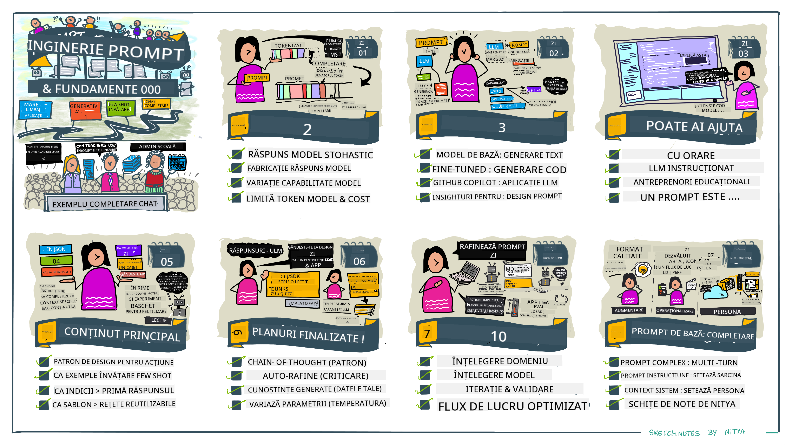
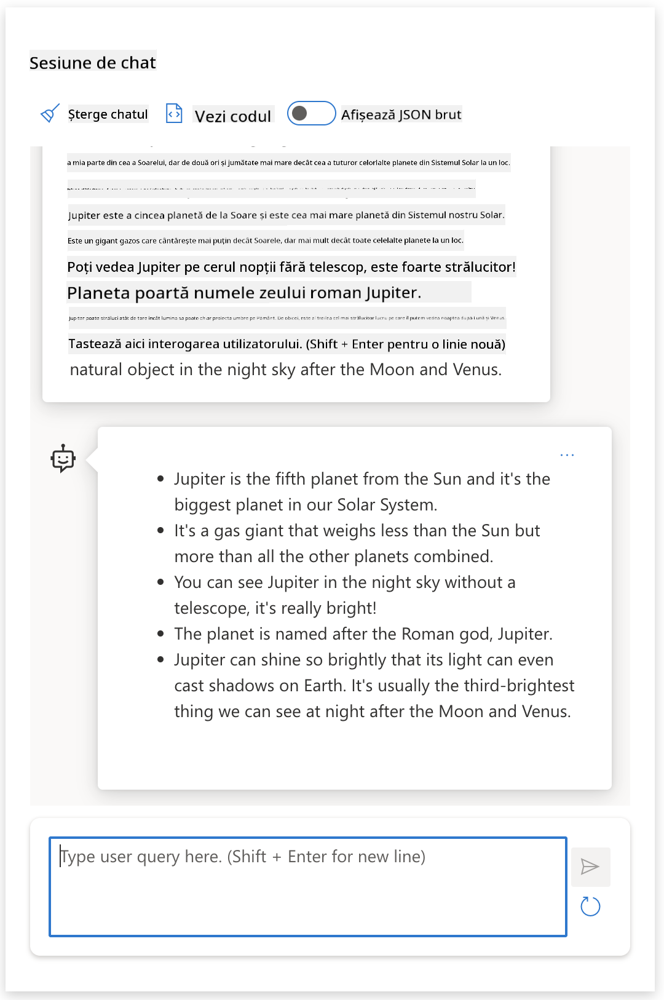

<!--
CO_OP_TRANSLATOR_METADATA:
{
  "original_hash": "0135e6c271f3ece8699050d4debbce88",
  "translation_date": "2025-10-17T22:11:05+00:00",
  "source_file": "04-prompt-engineering-fundamentals/README.md",
  "language_code": "ro"
}
-->
# Fundamentele Ingineriei Prompturilor

[](https://youtu.be/GElCu2kUlRs?si=qrXsBvXnCW12epb8)

## Introducere
Acest modul acoperă concepte și tehnici esențiale pentru crearea prompturilor eficiente în modelele de inteligență artificială generativă. Modul în care scrii un prompt pentru un LLM contează. Un prompt bine conceput poate obține un răspuns de calitate mai bună. Dar ce înseamnă exact termeni precum _prompt_ și _ingineria prompturilor_? Și cum pot îmbunătăți _inputul_ promptului pe care îl trimit către LLM? Acestea sunt întrebările la care vom încerca să răspundem în acest capitol și în următorul.

_Inteligența artificială generativă_ este capabilă să creeze conținut nou (de exemplu, text, imagini, audio, cod etc.) ca răspuns la cererile utilizatorilor. Acest lucru este realizat prin _Modele de Limbaj Extins_ precum seria GPT ("Generative Pre-trained Transformer") de la OpenAI, care sunt antrenate să utilizeze limbaj natural și cod.

Utilizatorii pot interacționa acum cu aceste modele folosind paradigme familiare, cum ar fi chat-ul, fără a avea nevoie de expertiză tehnică sau instruire. Modelele sunt _bazate pe prompturi_ - utilizatorii trimit un input text (prompt) și primesc un răspuns AI (completare). Apoi pot "conversa cu AI-ul" în mod iterativ, în conversații cu mai multe runde, rafinând promptul până când răspunsul corespunde așteptărilor lor.

"Prompturile" devin acum interfața principală de _programare_ pentru aplicațiile de inteligență artificială generativă, indicând modelelor ce să facă și influențând calitatea răspunsurilor returnate. "Ingineria Prompturilor" este un domeniu de studiu în plină expansiune, care se concentrează pe _designul și optimizarea_ prompturilor pentru a oferi răspunsuri consistente și de calitate la scară largă.

## Obiective de învățare

În această lecție, vom învăța ce este Ingineria Prompturilor, de ce este importantă și cum putem crea prompturi mai eficiente pentru un model și un obiectiv de aplicație dat. Vom înțelege conceptele de bază și cele mai bune practici pentru ingineria prompturilor - și vom învăța despre un mediu interactiv "sandbox" în Jupyter Notebooks, unde putem vedea aceste concepte aplicate la exemple reale.

Până la sfârșitul acestei lecții, vom fi capabili să:

1. Explicăm ce este ingineria prompturilor și de ce este importantă.
2. Descriem componentele unui prompt și modul în care sunt utilizate.
3. Învățăm cele mai bune practici și tehnici pentru ingineria prompturilor.
4. Aplicăm tehnicile învățate la exemple reale, utilizând un endpoint OpenAI.

## Termeni cheie

Ingineria Prompturilor: Practica de a proiecta și rafina inputurile pentru a ghida modelele AI să producă rezultate dorite.
Tokenizare: Procesul de conversie a textului în unități mai mici, numite tokeni, pe care un model le poate înțelege și procesa.
LLM-uri ajustate pentru instrucțiuni: Modele de Limbaj Extins (LLM-uri) care au fost ajustate cu instrucțiuni specifice pentru a îmbunătăți acuratețea și relevanța răspunsurilor.

## Sandbox de învățare

Ingineria prompturilor este în prezent mai mult o artă decât o știință. Cel mai bun mod de a ne îmbunătăți intuiția pentru aceasta este să _practicăm mai mult_ și să adoptăm o abordare de încercare și eroare care combină expertiza în domeniul aplicației cu tehnici recomandate și optimizări specifice modelului.

Notebook-ul Jupyter care însoțește această lecție oferă un mediu _sandbox_ unde poți încerca ceea ce înveți - pe parcurs sau ca parte a provocării de cod de la final. Pentru a executa exercițiile, vei avea nevoie de:

1. **O cheie API Azure OpenAI** - endpoint-ul serviciului pentru un LLM implementat.
2. **Un runtime Python** - în care Notebook-ul poate fi executat.
3. **Variabile de mediu locale** - _completează pașii [SETUP](./../00-course-setup/02-setup-local.md?WT.mc_id=academic-105485-koreyst) acum pentru a fi pregătit_.

Notebook-ul vine cu exerciții _de început_ - dar ești încurajat să adaugi propriile secțiuni _Markdown_ (descriere) și _Cod_ (cereri de prompturi) pentru a încerca mai multe exemple sau idei - și pentru a-ți construi intuiția pentru designul prompturilor.

## Ghid ilustrat

Vrei să obții o imagine de ansamblu a ceea ce acoperă această lecție înainte de a te aprofunda? Consultă acest ghid ilustrat, care îți oferă o idee despre principalele subiecte abordate și concluziile cheie pe care să le ai în vedere pentru fiecare. Harta lecției te duce de la înțelegerea conceptelor de bază și a provocărilor la abordarea acestora cu tehnici relevante de inginerie a prompturilor și cele mai bune practici. Reține că secțiunea "Tehnici avansate" din acest ghid se referă la conținutul acoperit în capitolul _următor_ al acestui curriculum.



## Startup-ul nostru

Acum, să vorbim despre cum _acest subiect_ se leagă de misiunea startup-ului nostru de a [aduce inovația AI în educație](https://educationblog.microsoft.com/2023/06/collaborating-to-bring-ai-innovation-to-education?WT.mc_id=academic-105485-koreyst). Vrem să construim aplicații alimentate de AI pentru _învățare personalizată_ - așa că să ne gândim cum ar putea "proiecta" prompturi diferiți utilizatori ai aplicației noastre:

- **Administratorii** ar putea cere AI-ului să _analizeze datele curriculare pentru a identifica lacunele în acoperire_. AI-ul poate rezuma rezultatele sau le poate vizualiza cu ajutorul codului.
- **Educatorii** ar putea cere AI-ului să _genereze un plan de lecție pentru un public țintă și un subiect_. AI-ul poate construi planul personalizat într-un format specificat.
- **Elevii** ar putea cere AI-ului să _îi mediteze la un subiect dificil_. AI-ul poate ghida acum elevii cu lecții, sugestii și exemple adaptate nivelului lor.

Acesta este doar vârful icebergului. Consultă [Prompts For Education](https://github.com/microsoft/prompts-for-edu/tree/main?WT.mc_id=academic-105485-koreyst) - o bibliotecă de prompturi open-source, curată de experți în educație - pentru a obține o perspectivă mai largă asupra posibilităților! _Încearcă să rulezi unele dintre aceste prompturi în sandbox sau folosind OpenAI Playground pentru a vedea ce se întâmplă!_

## Ce este Ingineria Prompturilor?

Am început această lecție definind **Ingineria Prompturilor** ca procesul de _proiectare și optimizare_ a inputurilor textuale (prompturi) pentru a oferi răspunsuri consistente și de calitate (completări) pentru un obiectiv de aplicație și model dat. Putem considera acest proces ca având două etape:

- _proiectarea_ promptului inițial pentru un model și un obiectiv dat
- _rafinarea_ promptului în mod iterativ pentru a îmbunătăți calitatea răspunsului

Acesta este în mod necesar un proces de încercare și eroare care necesită intuiția și efortul utilizatorului pentru a obține rezultate optime. Deci, de ce este important? Pentru a răspunde la această întrebare, trebuie mai întâi să înțelegem trei concepte:

- _Tokenizare_ = cum "vede" modelul promptul
- _LLM-uri de bază_ = cum "procesează" modelul de bază un prompt
- _LLM-uri ajustate pentru instrucțiuni_ = cum modelul poate acum să "vadă" sarcini

### Tokenizare

Un LLM vede prompturile ca o _secvență de tokeni_, unde diferite modele (sau versiuni ale unui model) pot tokeniza același prompt în moduri diferite. Deoarece LLM-urile sunt antrenate pe tokeni (și nu pe text brut), modul în care prompturile sunt tokenizate are un impact direct asupra calității răspunsului generat.

Pentru a înțelege cum funcționează tokenizarea, încearcă instrumente precum [OpenAI Tokenizer](https://platform.openai.com/tokenizer?WT.mc_id=academic-105485-koreyst) prezentat mai jos. Copiază promptul tău - și vezi cum este convertit în tokeni, acordând atenție modului în care sunt tratate caracterele spațiale și semnele de punctuație. Reține că acest exemplu arată un LLM mai vechi (GPT-3) - așa că încercarea acestuia cu un model mai nou poate produce un rezultat diferit.


### Concept: Modele de bază

Odată ce un prompt este tokenizat, funcția principală a ["LLM-ului de bază"](https://blog.gopenai.com/an-introduction-to-base-and-instruction-tuned-large-language-models-8de102c785a6?WT.mc_id=academic-105485-koreyst) (sau modelului de bază) este să prezică următorul token din acea secvență. Deoarece LLM-urile sunt antrenate pe seturi de date masive de text, ele au o bună înțelegere a relațiilor statistice dintre tokeni și pot face acea predicție cu o anumită încredere. Reține că ele nu înțeleg _semnificația_ cuvintelor din prompt sau token; ele doar văd un model pe care îl pot "completa" cu următoarea predicție. Ele pot continua să prezică secvența până când sunt oprite de intervenția utilizatorului sau de o condiție pre-stabilită.

Vrei să vezi cum funcționează completarea bazată pe prompturi? Introdu promptul de mai sus în [_Chat Playground_](https://oai.azure.com/playground?WT.mc_id=academic-105485-koreyst) din Azure OpenAI Studio cu setările implicite. Sistemul este configurat să trateze prompturile ca cereri de informații - așa că ar trebui să vezi o completare care satisface acest context.

Dar ce se întâmplă dacă utilizatorul dorește să vadă ceva specific care să îndeplinească anumite criterii sau obiective de sarcină? Aici intervin LLM-urile _ajustate pentru instrucțiuni_.


### Concept: LLM-uri ajustate pentru instrucțiuni

Un [LLM ajustat pentru instrucțiuni](https://blog.gopenai.com/an-introduction-to-base-and-instruction-tuned-large-language-models-8de102c785a6?WT.mc_id=academic-105485-koreyst) începe cu modelul de bază și îl ajustează cu exemple sau perechi de input/output (de exemplu, "mesaje" cu mai multe runde) care pot conține instrucțiuni clare - iar răspunsul AI încearcă să urmeze acea instrucțiune.

Acest lucru utilizează tehnici precum Învățarea prin Recompensă cu Feedback Uman (RLHF) care pot antrena modelul să _urmeze instrucțiuni_ și să _învețe din feedback_, astfel încât să producă răspunsuri mai potrivite pentru aplicații practice și mai relevante pentru obiectivele utilizatorului.

Hai să încercăm - revizitează promptul de mai sus, dar acum schimbă _mesajul sistemului_ pentru a oferi următoarea instrucțiune ca context:

> _Rezumați conținutul pe care îl primiți pentru un elev de clasa a doua. Păstrați rezultatul la un paragraf cu 3-5 puncte._

Vezi cum rezultatul este acum ajustat pentru a reflecta scopul și formatul dorit? Un educator poate folosi acum direct acest răspuns în prezentările sale pentru acea clasă.



## De ce avem nevoie de Ingineria Prompturilor?

Acum că știm cum sunt procesate prompturile de LLM-uri, să vorbim despre _de ce_ avem nevoie de ingineria prompturilor. Răspunsul constă în faptul că LLM-urile actuale prezintă o serie de provocări care fac ca _completările fiabile și consistente_ să fie mai greu de realizat fără a depune efort în construcția și optimizarea prompturilor. De exemplu:

1. **Răspunsurile modelului sunt stocastice.** _Același prompt_ va produce probabil răspunsuri diferite cu modele sau versiuni de model diferite. Și poate produce chiar rezultate diferite cu _același model_ în momente diferite. _Tehnicile de inginerie a prompturilor ne pot ajuta să minimizăm aceste variații prin furnizarea unor limite mai bune_.

1. **Modelele pot fabrica răspunsuri.** Modelele sunt pre-antrenate cu _seturi de date mari, dar finite_, ceea ce înseamnă că le lipsește cunoașterea conceptelor din afara acelui domeniu de antrenament. Ca rezultat, ele pot produce completări care sunt inexacte, imaginare sau direct contradictorii cu faptele cunoscute. _Tehnicile de inginerie a prompturilor ajută utilizatorii să identifice și să atenueze astfel de fabricări, de exemplu, cerând AI-ului citări sau raționamente_.

1. **Capabilitățile modelelor vor varia.** Modelele mai noi sau generațiile de modele vor avea capabilități mai bogate, dar vor aduce și particularități unice și compromisuri în cost și complexitate. _Ingineria prompturilor ne poate ajuta să dezvoltăm cele mai bune practici și fluxuri de lucru care să abstractizeze diferențele și să se adapteze cerințelor specifice modelului în moduri scalabile și fără probleme_.

Să vedem acest lucru în acțiune în OpenAI sau Azure OpenAI Playground:

- Folosește același prompt cu diferite implementări LLM (de exemplu, OpenAI, Azure OpenAI, Hugging Face) - ai observat variațiile?
- Folosește același prompt repetat cu _același_ LLM implementat (de exemplu, Azure OpenAI Playground) - cum au diferit aceste variații?

### Exemplu de fabricări

În acest curs, folosim termenul **"fabricare"** pentru a face referire la fenomenul în care LLM-urile generează uneori informații factual incorecte din cauza limitărilor în antrenamentul lor sau a altor constrângeri. Poate ai auzit acest lucru referit ca _"halucinații"_ în articole populare sau lucrări de cercetare. Cu toate acestea, recomandăm cu tărie utilizarea termenului _"fabricare"_ pentru a nu antropomorfiza comportamentul prin atribuirea unei trăsături umane unui rezultat generat de mașină. Acest lucru întărește, de asemenea, [liniile directoare pentru AI responsabilă](https://www.microsoft.com/ai/responsible-ai?WT.mc_id=academic-105485-koreyst) dintr-o perspectivă terminologică, eliminând termeni care ar putea fi considerați ofensatori sau neincluzivi în unele contexte.

Vrei să înțelegi cum funcționează fabricările? Gândește-te la un prompt care instruiește AI-ul să genereze conținut pentru un subiect inexistent (pentru a te asigura că nu se găsește în setul de date de antrenament). De exemplu - am încercat acest prompt:

> **Prompt:** generează un plan de lecție despre Războiul Marțian din 2076.
O căutare pe internet mi-a arătat că există relatări fictive (de exemplu, seriale TV sau cărți) despre războaie marțiene - dar niciuna în anul 2076. Logica ne spune, de asemenea, că anul 2076 este _în viitor_ și, prin urmare, nu poate fi asociat cu un eveniment real.

Deci, ce se întâmplă când rulăm acest prompt cu diferiți furnizori de LLM?

> **Răspuns 1**: OpenAI Playground (GPT-35)


> **Răspuns 2**: Azure OpenAI Playground (GPT-35)


> **Răspuns 3**: Hugging Face Chat Playground (LLama-2)


Așa cum era de așteptat, fiecare model (sau versiune de model) produce răspunsuri ușor diferite datorită comportamentului stochastic și variațiilor de capacitate ale modelului. De exemplu, un model se adresează unui public de clasa a VIII-a, în timp ce altul presupune un elev de liceu. Dar toate cele trei modele au generat răspunsuri care ar putea convinge un utilizator neinformat că evenimentul este real.

Tehnici de inginerie a prompturilor, cum ar fi _metaprompting_ și _configurarea temperaturii_, pot reduce fabricările modelului într-o anumită măsură. Noile _arhitecturi_ de inginerie a prompturilor încorporează, de asemenea, instrumente și tehnici noi în fluxul promptului, pentru a atenua sau reduce unele dintre aceste efecte.

## Studiu de caz: GitHub Copilot

Să încheiem această secțiune obținând o idee despre cum este utilizată ingineria prompturilor în soluții reale, analizând un studiu de caz: [GitHub Copilot](https://github.com/features/copilot?WT.mc_id=academic-105485-koreyst).

GitHub Copilot este "Programatorul tău AI de pereche" - transformă prompturile text în completări de cod și este integrat în mediul tău de dezvoltare (de exemplu, Visual Studio Code) pentru o experiență de utilizare fluidă. Așa cum este documentat în seria de bloguri de mai jos, prima versiune s-a bazat pe modelul OpenAI Codex - iar inginerii au realizat rapid necesitatea de a ajusta modelul și de a dezvolta tehnici mai bune de inginerie a prompturilor pentru a îmbunătăți calitatea codului. În iulie, aceștia [au lansat un model AI îmbunătățit care depășește Codex](https://github.blog/2023-07-28-smarter-more-efficient-coding-github-copilot-goes-beyond-codex-with-improved-ai-model/?WT.mc_id=academic-105485-koreyst) pentru sugestii și mai rapide.

Citește postările în ordine pentru a urmări parcursul lor de învățare.

- **Mai 2023** | [GitHub Copilot devine mai bun la înțelegerea codului tău](https://github.blog/2023-05-17-how-github-copilot-is-getting-better-at-understanding-your-code/?WT.mc_id=academic-105485-koreyst)
- **Mai 2023** | [În interiorul GitHub: Lucrând cu LLM-urile din spatele GitHub Copilot](https://github.blog/2023-05-17-inside-github-working-with-the-llms-behind-github-copilot/?WT.mc_id=academic-105485-koreyst).
- **Iun 2023** | [Cum să scrii prompturi mai bune pentru GitHub Copilot](https://github.blog/2023-06-20-how-to-write-better-prompts-for-github-copilot/?WT.mc_id=academic-105485-koreyst).
- **Iul 2023** | [.. GitHub Copilot depășește Codex cu un model AI îmbunătățit](https://github.blog/2023-07-28-smarter-more-efficient-coding-github-copilot-goes-beyond-codex-with-improved-ai-model/?WT.mc_id=academic-105485-koreyst)
- **Iul 2023** | [Ghidul unui dezvoltator pentru ingineria prompturilor și LLM-uri](https://github.blog/2023-07-17-prompt-engineering-guide-generative-ai-llms/?WT.mc_id=academic-105485-koreyst)
- **Sep 2023** | [Cum să construiești o aplicație LLM pentru întreprinderi: Lecții din GitHub Copilot](https://github.blog/2023-09-06-how-to-build-an-enterprise-llm-application-lessons-from-github-copilot/?WT.mc_id=academic-105485-koreyst)

De asemenea, poți răsfoi [blogul lor de inginerie](https://github.blog/category/engineering/?WT.mc_id=academic-105485-koreyst) pentru mai multe postări precum [aceasta](https://github.blog/2023-09-27-how-i-used-github-copilot-chat-to-build-a-reactjs-gallery-prototype/?WT.mc_id=academic-105485-koreyst), care arată cum aceste modele și tehnici sunt _aplicate_ pentru a dezvolta aplicații reale.

---

## Construcția prompturilor

Am văzut de ce ingineria prompturilor este importantă - acum să înțelegem cum sunt _construite_ prompturile, astfel încât să putem evalua diferite tehnici pentru un design mai eficient al acestora.

### Prompt de bază

Să începem cu promptul de bază: un input text trimis modelului fără alt context. Iată un exemplu - când trimitem primele cuvinte ale imnului național al SUA către [API-ul Completion de la OpenAI](https://platform.openai.com/docs/api-reference/completions?WT.mc_id=academic-105485-koreyst), acesta completează instantaneu răspunsul cu următoarele versuri, ilustrând comportamentul de predicție de bază.

| Prompt (Input)     | Completion (Output)                                                                                                                        |
| :----------------- | :----------------------------------------------------------------------------------------------------------------------------------------- |
| Oh say can you see | Se pare că începi versurile din "The Star-Spangled Banner", imnul național al Statelor Unite. Versurile complete sunt ...                  |

### Prompt complex

Acum să adăugăm context și instrucțiuni la acest prompt de bază. [API-ul Chat Completion](https://learn.microsoft.com/azure/ai-services/openai/how-to/chatgpt?WT.mc_id=academic-105485-koreyst) ne permite să construim un prompt complex ca o colecție de _mesaje_ cu:

- Perechi de input/output care reflectă inputul utilizatorului și răspunsul asistentului.
- Mesaj de sistem care setează contextul pentru comportamentul sau personalitatea asistentului.

Cererea este acum în forma de mai jos, unde _tokenizarea_ captează eficient informațiile relevante din context și conversație. Acum, schimbarea contextului sistemului poate avea un impact la fel de mare asupra calității completărilor, precum inputurile utilizatorului.

```python
response = openai.chat.completions.create(
    model="gpt-3.5-turbo",
    messages=[
        {"role": "system", "content": "You are a helpful assistant."},
        {"role": "user", "content": "Who won the world series in 2020?"},
        {"role": "assistant", "content": "The Los Angeles Dodgers won the World Series in 2020."},
        {"role": "user", "content": "Where was it played?"}
    ]
)
```

### Prompt de instrucțiuni

În exemplele de mai sus, promptul utilizatorului era o interogare text simplă care poate fi interpretată ca o cerere de informații. Cu prompturile de _instrucțiuni_, putem folosi acel text pentru a specifica o sarcină în detaliu, oferind o mai bună orientare AI-ului. Iată un exemplu:

| Prompt (Input)                                                                                                                                                                                                                         | Completion (Output)                                                                                                        | Tip de instrucțiune |
| :------------------------------------------------------------------------------------------------------------------------------------------------------------------------------------------------------------------------------------- | :------------------------------------------------------------------------------------------------------------------------- | :------------------ |
| Scrie o descriere a Războiului Civil                                                                                                                                                                                                   | _a returnat un paragraf simplu_                                                                                           | Simplu              |
| Scrie o descriere a Războiului Civil. Oferă date și evenimente cheie și descrie semnificația lor                                                                                                 | _a returnat un paragraf urmat de o listă de date cheie ale evenimentelor cu descrieri_                                    | Complex             |
| Scrie o descriere a Războiului Civil într-un paragraf. Oferă 3 puncte cheie cu date și semnificația lor. Oferă alte 3 puncte cheie cu figuri istorice importante și contribuțiile lor. Returnează rezultatul ca un fișier JSON.         | _returnează detalii mai extinse într-o casetă de text, formatate ca JSON pe care îl poți copia și valida după cum este necesar_ | Complex. Formatat.  |

## Conținut principal

În exemplele de mai sus, promptul era încă destul de deschis, permițând LLM-ului să decidă ce parte din setul său de date pre-antrenat era relevantă. Cu modelul de design _conținut principal_, textul de intrare este împărțit în două părți:

- o instrucțiune (acțiune)
- conținut relevant (care influențează acțiunea)

Iată un exemplu în care instrucțiunea este "rezumă acest lucru în 2 propoziții".

| Prompt (Input)                                                                                                                                                                                                                                                                                                                                                                                                                                                                                                                                                                                                                                                                                      | Completion (Output)                                                                                                                                                                                                                                                                             |
| :-------------------------------------------------------------------------------------------------------------------------------------------------------------------------------------------------------------------------------------------------------------------------------------------------------------------------------------------------------------------------------------------------------------------------------------------------------------------------------------------------------------------------------------------------------------------------------------------------------------------------------------------------------------------------------------------------- | :---------------------------------------------------------------------------------------------------------------------------------------------------------------------------------------------------------------------------------------------------------------------------------------------- |
| Jupiter este a cincea planetă de la Soare și cea mai mare din Sistemul Solar. Este un gigant gazos cu o masă de o mie de ori mai mică decât cea a Soarelui, dar de două ori și jumătate mai mare decât cea a tuturor celorlalte planete din Sistemul Solar la un loc. Jupiter este unul dintre cele mai strălucitoare obiecte vizibile cu ochiul liber pe cerul nopții și este cunoscut de civilizațiile antice încă dinainte de istoria înregistrată. Este numit după zeul roman Jupiter.[19] Când este privit de pe Pământ, Jupiter poate fi suficient de strălucitor încât lumina sa reflectată să arunce umbre vizibile,[20] și este, în medie, al treilea cel mai strălucitor obiect natural pe cerul nopții după Lună și Venus. <br/> **Rezumați acest lucru în 2 propoziții scurte** | Jupiter, a cincea planetă de la Soare, este cea mai mare din Sistemul Solar și este cunoscută pentru a fi unul dintre cele mai strălucitoare obiecte de pe cerul nopții. Numită după zeul roman Jupiter, este un gigant gazos a cărui masă este de două ori și jumătate mai mare decât cea a tuturor celorlalte planete la un loc. |

Segmentul de conținut principal poate fi utilizat în diverse moduri pentru a genera instrucțiuni mai eficiente:

- **Exemple** - în loc să îi spui modelului ce să facă printr-o instrucțiune explicită, oferă-i exemple despre ce să facă și lasă-l să deducă modelul.
- **Indicații** - urmează instrucțiunea cu o "indicație" care pregătește completarea, ghidând modelul către răspunsuri mai relevante.
- **Șabloane** - acestea sunt "rețete" repetabile pentru prompturi, cu spații rezervate (variabile) care pot fi personalizate cu date pentru utilizări specifice.

Să explorăm aceste aspecte în acțiune.

### Utilizarea exemplelor

Aceasta este o abordare în care folosești conținutul principal pentru a "hrăni modelul" cu câteva exemple de ieșire dorită pentru o anumită instrucțiune și îl lași să deducă modelul pentru ieșirea dorită. În funcție de numărul de exemple furnizate, putem avea prompturi zero-shot, one-shot, few-shot etc.

Promptul constă acum din trei componente:

- O descriere a sarcinii
- Câteva exemple de ieșire dorită
- Începutul unui nou exemplu (care devine o descriere implicită a sarcinii)

| Tip de învățare | Prompt (Input)                                                                                                                                        | Completion (Output)         |
| :-------------- | :---------------------------------------------------------------------------------------------------------------------------------------------------- | :-------------------------- |
| Zero-shot       | "Soarele strălucește". Tradu în spaniolă                                                                                                              | "El Sol está brillando".    |
| One-shot        | "Soarele strălucește" => ""El Sol está brillando". <br> "Este o zi rece și vântoasă" =>                                                               | "Es un día frío y ventoso". |
| Few-shot        | Jucătorul a alergat pe baze => Baseball <br/> Jucătorul a dat un as => Tenis <br/> Jucătorul a dat un șase => Cricket <br/> Jucătorul a făcut un slam-dunk => | Baschet                    |
|                 |                                                                                                                                                       |                             |

Observă cum a trebuit să oferim o instrucțiune explicită ("Tradu în spaniolă") în exemplul de zero-shot, dar aceasta este dedusă în exemplul de one-shot. Exemplul de few-shot arată cum adăugarea mai multor exemple permite modelelor să facă inferențe mai precise fără instrucțiuni suplimentare.

### Indicații pentru prompturi

O altă tehnică pentru utilizarea conținutului principal este să oferi _indicații_ în loc de exemple. În acest caz, îi dai modelului un impuls în direcția corectă prin _începerea_ cu un fragment care reflectă formatul dorit al răspunsului. Modelul apoi "preia indicația" pentru a continua în aceeași direcție.

| Număr de indicații | Prompt (Input)                                                                                                                                                                                                                                                                                                                                                                                                                                               | Completion (Output)                                                                                                                                                                                                                                                                                       |
| :----------------- | :----------------------------------------------------------------------------------------------------------------------------------------------------------------------------------------------------------------------------------------------------------------------------------------------------------------------------------------------------------------------------------------------------------------------------------------------------------- | :-------------------------------------------------------------------------------------------------------------------------------------------------------------------------------------------------------------------------------------------------------------------------------------------------------- |
| 0                  | Jupiter este a cincea planetă de la Soare și cea mai mare din Sistemul Solar. Este un gigant gazos cu o masă de o mie de ori mai mică decât cea a Soarelui, dar de două ori și jumătate mai mare decât cea a tuturor celorlalte planete din Sistemul Solar la un loc. Jupiter este unul dintre cele mai strălucitoare obiecte vizibile cu ochiul liber pe cerul nopții și este cunoscut de civilizațiile antice încă dinainte de istoria înregistrată. <br/>**Rezumați Acest Lucru**                                       | Jupiter este cea mai mare planetă din Sistemul Solar și a cincea de la Soare. Este un gigant gazos cu o masă de 1/1000 din cea a Soarelui, dar mai grea decât toate celelalte planete la un loc. Civilizațiile antice au cunoscut Jupiter de mult timp, fiind ușor vizibil pe cerul nopții. |
| 1              | Jupiter este a cincea planetă de la Soare și cea mai mare din Sistemul Solar. Este un gigant gazos cu o masă de o miime din cea a Soarelui, dar de două ori și jumătate mai mare decât masa tuturor celorlalte planete din Sistemul Solar combinate. Jupiter este unul dintre cele mai strălucitoare obiecte vizibile cu ochiul liber pe cerul nopții și este cunoscut de civilizațiile antice încă dinaintea istoriei scrise. <br/>**Rezumați aceasta** <br/> Ce am învățat este că Jupiter | este a cincea planetă de la Soare și cea mai mare din Sistemul Solar. Este un gigant gazos cu o masă de o miime din cea a Soarelui, dar de două ori și jumătate mai mare decât masa tuturor celorlalte planete combinate. Este ușor vizibil cu ochiul liber și este cunoscut încă din timpurile antice.                        |
| 2              | Jupiter este a cincea planetă de la Soare și cea mai mare din Sistemul Solar. Este un gigant gazos cu o masă de o miime din cea a Soarelui, dar de două ori și jumătate mai mare decât masa tuturor celorlalte planete din Sistemul Solar combinate. Jupiter este unul dintre cele mai strălucitoare obiecte vizibile cu ochiul liber pe cerul nopții și este cunoscut de civilizațiile antice încă dinaintea istoriei scrise. <br/>**Rezumați aceasta** <br/> Top 3 fapte pe care le-am învățat:         | 1. Jupiter este a cincea planetă de la Soare și cea mai mare din Sistemul Solar. <br/> 2. Este un gigant gazos cu o masă de o miime din cea a Soarelui...<br/> 3. Jupiter este vizibil cu ochiul liber încă din timpurile antice ...                                                                       |
|                |                                                                                                                                                                                                                                                                                                                                                                                                                                                              |                                                                                                                                                                                                                                                                                                           |

### Șabloane de prompturi

Un șablon de prompt este o _rețetă predefinită pentru un prompt_ care poate fi stocată și reutilizată după nevoie, pentru a asigura experiențe mai consistente utilizatorilor la scară largă. În forma sa cea mai simplă, este pur și simplu o colecție de exemple de prompturi, precum [acesta de la OpenAI](https://platform.openai.com/examples?WT.mc_id=academic-105485-koreyst), care oferă atât componentele interactive ale promptului (mesaje ale utilizatorului și ale sistemului), cât și formatul cererii bazate pe API - pentru a sprijini reutilizarea.

În forma sa mai complexă, precum [acest exemplu de la LangChain](https://python.langchain.com/docs/concepts/prompt_templates/?WT.mc_id=academic-105485-koreyst), conține _locuri rezervate_ care pot fi înlocuite cu date din diverse surse (inputul utilizatorului, contextul sistemului, surse externe de date etc.) pentru a genera un prompt dinamic. Acest lucru ne permite să creăm o bibliotecă de prompturi reutilizabile care pot fi utilizate pentru a asigura experiențe consistente utilizatorilor **programatic** la scară largă.

În cele din urmă, valoarea reală a șabloanelor constă în abilitatea de a crea și publica _biblioteci de prompturi_ pentru domenii de aplicație verticale - unde șablonul de prompt este acum _optimizat_ pentru a reflecta contextul specific aplicației sau exemple care fac răspunsurile mai relevante și mai precise pentru publicul țintă. Repozitoriul [Prompts For Edu](https://github.com/microsoft/prompts-for-edu?WT.mc_id=academic-105485-koreyst) este un exemplu excelent al acestei abordări, care curatoriază o bibliotecă de prompturi pentru domeniul educației, cu accent pe obiective cheie precum planificarea lecțiilor, proiectarea curriculumului, tutoriatul elevilor etc.

## Conținut de suport

Dacă ne gândim la construcția prompturilor ca având o instrucțiune (sarcină) și un obiectiv (conținut principal), atunci _conținutul secundar_ este ca un context suplimentar pe care îl oferim pentru a **influența răspunsul într-un anumit mod**. Acesta poate fi parametri de ajustare, instrucțiuni de formatare, taxonomii de subiecte etc., care pot ajuta modelul să _adapteze_ răspunsul pentru a se potrivi obiectivelor sau așteptărilor utilizatorului.

De exemplu: Având un catalog de cursuri cu metadate extinse (nume, descriere, nivel, etichete de metadate, instructor etc.) despre toate cursurile disponibile în curriculum:

- putem defini o instrucțiune pentru "rezumarea catalogului de cursuri pentru toamna 2023"
- putem folosi conținutul principal pentru a oferi câteva exemple de rezultat dorit
- putem folosi conținutul secundar pentru a identifica primele 5 "etichete" de interes.

Acum, modelul poate oferi un rezumat în formatul arătat de câteva exemple - dar dacă un rezultat are mai multe etichete, poate prioritiza cele 5 etichete identificate în conținutul secundar.

---

<!--
ȘABLON DE LECȚIE:
Această unitate ar trebui să acopere conceptul de bază #1.
Consolidați conceptul cu exemple și referințe.

CONCEPTUL #3:
Tehnici de inginerie a prompturilor.
Care sunt câteva tehnici de bază pentru ingineria prompturilor?
Ilustrați cu câteva exerciții.
-->

## Cele mai bune practici pentru crearea prompturilor

Acum că știm cum pot fi _construite_ prompturile, putem începe să ne gândim cum să le _proiectăm_ pentru a reflecta cele mai bune practici. Putem gândi acest lucru în două părți - având mentalitatea potrivită și aplicând tehnicile potrivite.

### Mentalitatea în ingineria prompturilor

Ingineria prompturilor este un proces de încercare și eroare, așa că țineți cont de trei factori generali:

1. **Înțelegerea domeniului contează.** Precizia și relevanța răspunsului sunt funcții ale _domeniului_ în care aplicația sau utilizatorul operează. Aplicați intuiția și expertiza în domeniu pentru a **personaliza tehnicile**. De exemplu, definiți _personalități specifice domeniului_ în prompturile sistemului sau folosiți _șabloane specifice domeniului_ în prompturile utilizatorului. Oferiți conținut secundar care reflectă contexte specifice domeniului sau folosiți _indicii și exemple specifice domeniului_ pentru a ghida modelul către modele de utilizare familiare.

2. **Înțelegerea modelului contează.** Știm că modelele sunt stocastice prin natura lor. Dar implementările modelelor pot varia și în funcție de setul de date de antrenament pe care îl folosesc (cunoștințe pre-antrenate), de capacitățile pe care le oferă (de exemplu, prin API sau SDK) și de tipul de conținut pentru care sunt optimizate (de exemplu, cod vs. imagini vs. text). Înțelegeți punctele forte și limitările modelului pe care îl utilizați și folosiți aceste cunoștințe pentru a _prioritiza sarcinile_ sau a construi _șabloane personalizate_ optimizate pentru capacitățile modelului.

3. **Iterația și validarea contează.** Modelele evoluează rapid, la fel și tehnicile de inginerie a prompturilor. Ca expert în domeniu, este posibil să aveți alte contexte sau criterii specifice aplicației _dumneavoastră_, care s-ar putea să nu se aplice comunității mai largi. Folosiți instrumente și tehnici de inginerie a prompturilor pentru a "porni" construcția prompturilor, apoi iterați și validați rezultatele folosind propria intuiție și expertiză în domeniu. Înregistrați-vă observațiile și creați o **bază de cunoștințe** (de exemplu, biblioteci de prompturi) care pot fi utilizate ca o nouă bază de referință de către alții, pentru iterații mai rapide în viitor.

## Cele mai bune practici

Acum să analizăm cele mai comune practici recomandate de [OpenAI](https://help.openai.com/en/articles/6654000-best-practices-for-prompt-engineering-with-openai-api?WT.mc_id=academic-105485-koreyst) și practicienii [Azure OpenAI](https://learn.microsoft.com/azure/ai-services/openai/concepts/prompt-engineering#best-practices?WT.mc_id=academic-105485-koreyst).

| Ce                                | De ce                                                                                                                                                                                                                                               |
| :-------------------------------- | :------------------------------------------------------------------------------------------------------------------------------------------------------------------------------------------------------------------------------------------------ |
| Evaluați cele mai recente modele. | Generațiile noi de modele sunt probabil să aibă caracteristici și calitate îmbunătățite - dar pot implica și costuri mai mari. Evaluați-le pentru impact, apoi luați decizii de migrare.                                                             |
| Separați instrucțiunile și contextul | Verificați dacă modelul/furnizorul dumneavoastră definește _delimitatori_ pentru a distinge mai clar instrucțiunile, conținutul principal și cel secundar. Acest lucru poate ajuta modelele să atribuie mai precis greutăți tokenurilor.              |
| Fiți specifici și clari           | Oferiți mai multe detalii despre contextul dorit, rezultat, lungime, format, stil etc. Acest lucru va îmbunătăți atât calitatea, cât și consistența răspunsurilor. Capturați rețetele în șabloane reutilizabile.                                      |
| Fiți descriptivi, folosiți exemple | Modelele pot răspunde mai bine la o abordare de tipul "arată și spune". Începeți cu o abordare `zero-shot` în care îi dați o instrucțiune (dar fără exemple), apoi încercați `few-shot` ca o rafinare, oferind câteva exemple de rezultat dorit. Folosiți analogii. |
| Folosiți indicii pentru a începe completările | Îndemnați modelul către un rezultat dorit oferindu-i câteva cuvinte sau fraze introductive pe care le poate folosi ca punct de plecare pentru răspuns.                                                                                               |
| Repetați                          | Uneori poate fi necesar să vă repetați în fața modelului. Oferiți instrucțiuni înainte și după conținutul principal, folosiți o instrucțiune și un indiciu etc. Iterați și validați pentru a vedea ce funcționează.                                     |
| Ordinea contează                  | Ordinea în care prezentați informațiile modelului poate influența rezultatul, chiar și în exemplele de învățare, datorită biasului de recență. Încercați opțiuni diferite pentru a vedea ce funcționează cel mai bine.                                 |
| Oferiți modelului o "ieșire"      | Oferiți modelului un răspuns de completare _fallback_ pe care îl poate furniza dacă nu poate finaliza sarcina din orice motiv. Acest lucru poate reduce șansele ca modelele să genereze răspunsuri false sau fabricate.                              |
|                                   |                                                                                                                                                                                                                                                   |

Ca în cazul oricărei bune practici, amintiți-vă că _rezultatele pot varia_ în funcție de model, sarcină și domeniu. Folosiți acestea ca punct de plecare și iterați pentru a găsi ce funcționează cel mai bine pentru dumneavoastră. Reevaluați constant procesul de inginerie a prompturilor pe măsură ce apar noi modele și instrumente, concentrându-vă pe scalabilitatea procesului și calitatea răspunsurilor.

<!--
ȘABLON DE LECȚIE:
Această unitate ar trebui să ofere o provocare de cod, dacă este aplicabil.

PROVOCARE:
Link către un Jupyter Notebook cu doar comentariile codului în instrucțiuni (secțiunile de cod sunt goale).

SOLUȚIE:
Link către o copie a acelui Notebook cu prompturile completate și rulate, arătând ce ar putea fi un exemplu.
-->

## Temă

Felicitări! Ați ajuns la finalul lecției! Este timpul să puneți în practică unele dintre acele concepte și tehnici cu exemple reale!

Pentru tema noastră, vom folosi un Jupyter Notebook cu exerciții pe care le puteți completa interactiv. De asemenea, puteți extinde Notebook-ul cu propriile celule Markdown și Cod pentru a explora idei și tehnici pe cont propriu.

### Pentru a începe, faceți fork la repo, apoi

- (Recomandat) Lansați GitHub Codespaces
- (Alternativ) Clonați repo-ul pe dispozitivul local și folosiți-l cu Docker Desktop
- (Alternativ) Deschideți Notebook-ul cu mediul de rulare preferat pentru Notebook-uri.

### Apoi, configurați variabilele de mediu

- Copiați fișierul `.env.copy` din rădăcina repo-ului în `.env` și completați valorile `AZURE_OPENAI_API_KEY`, `AZURE_OPENAI_ENDPOINT` și `AZURE_OPENAI_DEPLOYMENT`. Revenți la [secțiunea Learning Sandbox](../../../04-prompt-engineering-fundamentals/04-prompt-engineering-fundamentals) pentru a învăța cum.

### Apoi, deschideți Jupyter Notebook-ul

- Selectați kernelul de rulare. Dacă folosiți opțiunile 1 sau 2, selectați pur și simplu kernelul Python 3.10.x implicit oferit de containerul de dezvoltare.

Sunteți pregătit să rulați exercițiile. Rețineți că nu există _răspunsuri corecte sau greșite_ aici - doar explorarea opțiunilor prin încercare și eroare și construirea intuiției pentru ceea ce funcționează pentru un model și un domeniu de aplicație dat.

_Din acest motiv, nu există segmente de soluții de cod în această lecție. În schimb, Notebook-ul va avea celule Markdown intitulate "Soluția mea:" care arată un exemplu de rezultat pentru referință._

 <!--
ȘABLON DE LECȚIE:
Încheiați secțiunea cu un rezumat și resurse pentru învățare autodidactă.
-->

## Verificarea cunoștințelor

Care dintre următoarele este un prompt bun, urmând câteva bune practici rezonabile?

1. Arată-mi o imagine cu o mașină roșie
2. Arată-mi o imagine cu o mașină roșie marca Volvo și model XC90 parcată lângă o stâncă cu soarele apunând
3. Arată-mi o imagine cu o mașină roșie marca Volvo și model XC90

R: 2, este cel mai bun prompt deoarece oferă detalii despre "ce" și intră în specific (nu doar orice mașină, ci o marcă și un model specific) și descrie, de asemenea, contextul general. 3 este următorul cel mai bun, deoarece conține, de asemenea, multe detalii.

## 🚀 Provocare

Vedeți dacă puteți folosi tehnica "indiciului" cu promptul: Completează propoziția "Arată-mi o imagine cu o mașină roșie marca Volvo și ". Ce răspunde și cum ați îmbunătăți-o?

## Felicitări! Continuați să învățați

Doriți să aflați mai multe despre diferite concepte de inginerie a prompturilor? Accesați [pagina de învățare continuă](https://aka.ms/genai-collection?WT.mc_id=academic-105485-koreyst) pentru a găsi alte resurse excelente pe acest subiect.

Mergeți la Lecția 5, unde vom analiza [tehnici avansate de creare a prompturilor](../05-advanced-prompts/README.md?WT.mc_id=academic-105485-koreyst)!

---

**Declinare de responsabilitate**:  
Acest document a fost tradus folosind serviciul de traducere AI [Co-op Translator](https://github.com/Azure/co-op-translator). Deși ne străduim să asigurăm acuratețea, vă rugăm să fiți conștienți că traducerile automate pot conține erori sau inexactități. Documentul original în limba sa maternă ar trebui considerat sursa autoritară. Pentru informații critice, se recomandă traducerea profesională realizată de un specialist uman. Nu ne asumăm responsabilitatea pentru eventualele neînțelegeri sau interpretări greșite care pot apărea din utilizarea acestei traduceri.