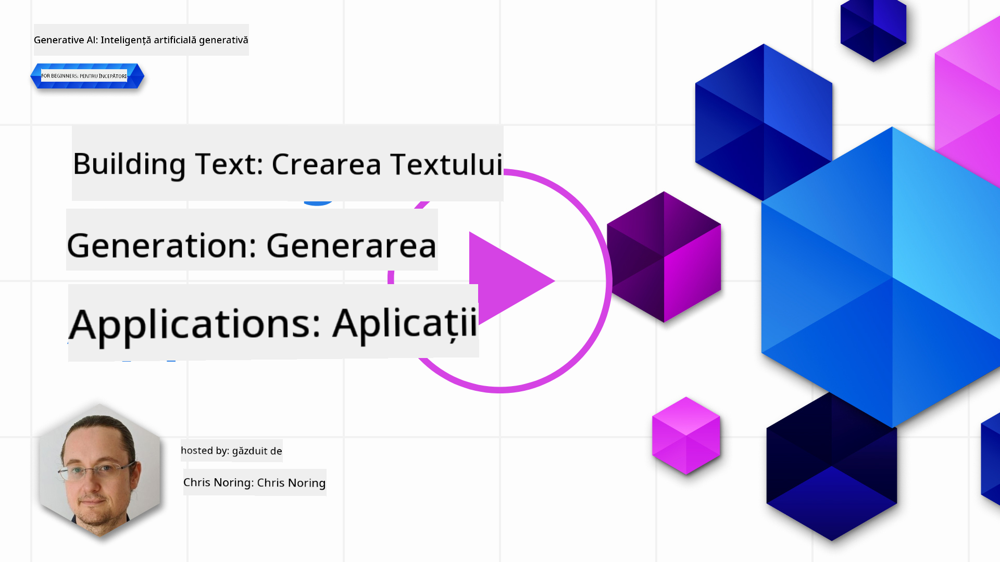

<!--
CO_OP_TRANSLATOR_METADATA:
{
  "original_hash": "ce8224073b86b728ed52b19bed7932fd",
  "translation_date": "2025-07-09T12:08:02+00:00",
  "source_file": "06-text-generation-apps/README.md",
  "language_code": "ro"
}
-->
# Construirea aplicațiilor de generare a textului

[](https://aka.ms/gen-ai-lesson6-gh?WT.mc_id=academic-105485-koreyst)

> _(Click pe imaginea de mai sus pentru a viziona videoclipul acestei lecții)_

Până acum, în acest curriculum, ai văzut că există concepte de bază precum prompturile și chiar o disciplină întreagă numită „prompt engineering”. Multe instrumente cu care poți interacționa, cum ar fi ChatGPT, Office 365, Microsoft Power Platform și altele, te susțin folosind prompturi pentru a realiza ceva.

Pentru a adăuga o astfel de experiență într-o aplicație, trebuie să înțelegi concepte precum prompturi, completări și să alegi o bibliotecă cu care să lucrezi. Exact asta vei învăța în acest capitol.

## Introducere

În acest capitol, vei:

- Înțelege biblioteca openai și conceptele sale de bază.
- Construi o aplicație de generare a textului folosind openai.
- Înțelege cum să folosești concepte precum prompt, temperature și tokens pentru a construi o aplicație de generare a textului.

## Obiective de învățare

La finalul acestei lecții, vei putea:

- Explica ce este o aplicație de generare a textului.
- Construi o aplicație de generare a textului folosind openai.
- Configura aplicația pentru a folosi mai mulți sau mai puțini tokens și, de asemenea, să modifici temperatura pentru un output variat.

## Ce este o aplicație de generare a textului?

De obicei, când construiești o aplicație, aceasta are un fel de interfață, cum ar fi următoarele:

- Bazată pe comenzi. Aplicațiile de consolă sunt aplicații tipice în care tastezi o comandă și aceasta execută o sarcină. De exemplu, `git` este o aplicație bazată pe comenzi.
- Interfață utilizator (UI). Unele aplicații au interfețe grafice (GUI) unde apeși butoane, introduci text, selectezi opțiuni și altele.

### Aplicațiile de consolă și UI sunt limitate

Compară cu o aplicație bazată pe comenzi în care tastezi o comandă:

- **Este limitată**. Nu poți introduce orice comandă, ci doar pe cele pe care aplicația le suportă.
- **Specifică limbajului**. Unele aplicații suportă mai multe limbi, dar în mod implicit aplicația este construită pentru un limbaj specific, chiar dacă poți adăuga suport pentru alte limbi.

### Beneficiile aplicațiilor de generare a textului

Cum este diferită o aplicație de generare a textului?

Într-o astfel de aplicație, ai mai multă flexibilitate, nu ești limitat la un set de comenzi sau la un limbaj de intrare specific. În schimb, poți folosi limbaj natural pentru a interacționa cu aplicația. Un alt beneficiu este că, pentru că interacționezi deja cu o sursă de date antrenată pe un vast corpus de informații, o aplicație tradițională ar putea fi limitată la ceea ce este în baza de date.

### Ce pot construi cu o aplicație de generare a textului?

Există multe lucruri pe care le poți construi. De exemplu:

- **Un chatbot**. Un chatbot care răspunde la întrebări despre subiecte, cum ar fi compania ta și produsele sale, ar putea fi o alegere bună.
- **Asistent**. LLM-urile sunt excelente la lucruri precum rezumarea textului, extragerea de informații din text, generarea de texte precum CV-uri și altele.
- **Asistent de cod**. În funcție de modelul de limbaj folosit, poți construi un asistent de cod care te ajută să scrii cod. De exemplu, poți folosi produse precum GitHub Copilot sau ChatGPT pentru a te ajuta să scrii cod.

## Cum pot începe?

Ei bine, trebuie să găsești o modalitate de a te integra cu un LLM, ceea ce de obicei implică următoarele două abordări:

- Folosește un API. Aici construiești cereri web cu promptul tău și primești text generat înapoi.
- Folosește o bibliotecă. Bibliotecile ajută la încapsularea apelurilor API și le fac mai ușor de folosit.

## Biblioteci/SDK-uri

Există câteva biblioteci bine cunoscute pentru lucrul cu LLM-uri, cum ar fi:

- **openai**, această bibliotecă face ușoară conectarea la modelul tău și trimiterea prompturilor.

Apoi există biblioteci care operează la un nivel mai înalt, cum ar fi:

- **Langchain**. Langchain este bine cunoscut și suportă Python.
- **Semantic Kernel**. Semantic Kernel este o bibliotecă Microsoft care suportă limbajele C#, Python și Java.

## Prima aplicație folosind openai

Să vedem cum putem construi prima noastră aplicație, ce biblioteci avem nevoie, cât este necesar și așa mai departe.

### Instalare openai

Există multe biblioteci pentru interacțiunea cu OpenAI sau Azure OpenAI. Este posibil să folosești numeroase limbaje de programare, cum ar fi C#, Python, JavaScript, Java și altele. Am ales să folosim biblioteca Python `openai`, așa că vom folosi `pip` pentru instalare.

```bash
pip install openai
```

### Crearea unui resource

Trebuie să urmezi pașii următori:

- Creează un cont pe Azure [https://azure.microsoft.com/free/](https://azure.microsoft.com/free/?WT.mc_id=academic-105485-koreyst).
- Obține acces la Azure OpenAI. Mergi la [https://learn.microsoft.com/azure/ai-services/openai/overview#how-do-i-get-access-to-azure-openai](https://learn.microsoft.com/azure/ai-services/openai/overview#how-do-i-get-access-to-azure-openai?WT.mc_id=academic-105485-koreyst) și solicită acces.

  > [!NOTE]
  > La momentul scrierii, trebuie să aplici pentru acces la Azure OpenAI.

- Instalează Python <https://www.python.org/>
- Creează un resource Azure OpenAI Service. Vezi acest ghid pentru cum să [creezi un resource](https://learn.microsoft.com/azure/ai-services/openai/how-to/create-resource?pivots=web-portal?WT.mc_id=academic-105485-koreyst).

### Găsirea cheii API și a endpoint-ului

Acum trebuie să îi spui bibliotecii `openai` ce cheie API să folosească. Pentru a găsi cheia API, mergi la secțiunea „Keys and Endpoint” a resource-ului tău Azure OpenAI și copiază valoarea „Key 1”.


Acum că ai această informație copiată, să instruim bibliotecile să o folosească.

> [!NOTE]
> Merită să separi cheia API de codul tău. Poți face asta folosind variabile de mediu.
>
> - Setează variabila de mediu `OPENAI_API_KEY` cu cheia ta API.
>   `export OPENAI_API_KEY='sk-...'`

### Configurare Azure

Dacă folosești Azure OpenAI, iată cum configurezi:

```python
openai.api_type = 'azure'
openai.api_key = os.environ["OPENAI_API_KEY"]
openai.api_version = '2023-05-15'
openai.api_base = os.getenv("API_BASE")
```

Mai sus setăm următoarele:

- `api_type` la `azure`. Aceasta spune bibliotecii să folosească Azure OpenAI și nu OpenAI.
- `api_key`, aceasta este cheia ta API găsită în Azure Portal.
- `api_version`, aceasta este versiunea API pe care vrei să o folosești. La momentul scrierii, cea mai recentă versiune este `2023-05-15`.
- `api_base`, acesta este endpoint-ul API. Îl poți găsi în Azure Portal lângă cheia ta API.

> [!NOTE] > `os.getenv` este o funcție care citește variabilele de mediu. O poți folosi pentru a citi variabile precum `OPENAI_API_KEY` și `API_BASE`. Setează aceste variabile în terminalul tău sau folosind o bibliotecă precum `dotenv`.

## Generarea textului

Modul de a genera text este să folosești clasa `Completion`. Iată un exemplu:

```python
prompt = "Complete the following: Once upon a time there was a"

completion = openai.Completion.create(model="davinci-002", prompt=prompt)
print(completion.choices[0].text)
```

În codul de mai sus, creăm un obiect de completare și îi transmitem modelul pe care vrem să-l folosim și promptul. Apoi afișăm textul generat.

### Completări pentru chat

Până acum ai văzut cum am folosit `Completion` pentru a genera text. Dar există o altă clasă numită `ChatCompletion` care este mai potrivită pentru chatbots. Iată un exemplu de utilizare:

```python
import openai

openai.api_key = "sk-..."

completion = openai.ChatCompletion.create(model="gpt-3.5-turbo", messages=[{"role": "user", "content": "Hello world"}])
print(completion.choices[0].message.content)
```

Mai multe despre această funcționalitate într-un capitol viitor.

## Exercițiu - prima ta aplicație de generare a textului

Acum că am învățat cum să configurăm și să folosim openai, este timpul să construiești prima ta aplicație de generare a textului. Pentru a construi aplicația, urmează acești pași:

1. Creează un mediu virtual și instalează openai:

   ```bash
   python -m venv venv
   source venv/bin/activate
   pip install openai
   ```

   > [!NOTE]
   > Dacă folosești Windows, tastează `venv\Scripts\activate` în loc de `source venv/bin/activate`.

   > [!NOTE]
   > Găsește cheia ta Azure OpenAI mergând la [https://portal.azure.com/](https://portal.azure.com/?WT.mc_id=academic-105485-koreyst), caută `Open AI`, selectează `Open AI resource`, apoi `Keys and Endpoint` și copiază valoarea `Key 1`.

1. Creează un fișier _app.py_ și adaugă următorul cod:

   ```python
   import openai

   openai.api_key = "<replace this value with your open ai key or Azure OpenAI key>"

   openai.api_type = 'azure'
   openai.api_version = '2023-05-15'
   openai.api_base = "<endpoint found in Azure Portal where your API key is>"
   deployment_name = "<deployment name>"

   # add your completion code
   prompt = "Complete the following: Once upon a time there was a"
   messages = [{"role": "user", "content": prompt}]

   # make completion
   completion = openai.chat.completions.create(model=deployment_name, messages=messages)

   # print response
   print(completion.choices[0].message.content)
   ```

   > [!NOTE]
   > Dacă folosești Azure OpenAI, trebuie să setezi `api_type` la `azure` și `api_key` la cheia ta Azure OpenAI.

   Ar trebui să vezi un output asemănător cu următorul:

   ```output
    very unhappy _____.

   Once upon a time there was a very unhappy mermaid.
   ```

## Diferite tipuri de prompturi, pentru lucruri diferite

Acum ai văzut cum să generezi text folosind un prompt. Ai chiar un program funcțional pe care îl poți modifica pentru a genera diferite tipuri de text.

Prompturile pot fi folosite pentru tot felul de sarcini. De exemplu:

- **Generarea unui tip de text**. De exemplu, poți genera o poezie, întrebări pentru un quiz etc.
- **Căutarea de informații**. Poți folosi prompturi pentru a căuta informații, cum ar fi exemplul „Ce înseamnă CORS în dezvoltarea web?”.
- **Generarea de cod**. Poți folosi prompturi pentru a genera cod, de exemplu pentru a dezvolta o expresie regulată folosită la validarea emailurilor sau chiar pentru a genera un program întreg, cum ar fi o aplicație web.

## Un caz de utilizare mai practic: generator de rețete

Imaginează-ți că ai ingrediente acasă și vrei să gătești ceva. Pentru asta, ai nevoie de o rețetă. O modalitate de a găsi rețete este să folosești un motor de căutare sau poți folosi un LLM pentru asta.

Ai putea scrie un prompt astfel:

> „Arată-mi 5 rețete pentru un fel de mâncare cu următoarele ingrediente: pui, cartofi și morcovi. Pentru fiecare rețetă, listează toate ingredientele folosite.”

Având promptul de mai sus, ai putea primi un răspuns similar cu:

```output
1. Roasted Chicken and Vegetables:
Ingredients:
- 4 chicken thighs
- 2 potatoes, cut into cubes
- 2 carrots, cut into cubes
- 2 tablespoons olive oil
- 2 cloves garlic, minced
- 1 teaspoon dried thyme
- 1 teaspoon dried oregano
- Salt and pepper, to taste

2. Chicken and Potato Stew:
Ingredients:
- 2 tablespoons olive oil
- 1 onion, diced
- 2 cloves garlic, minced
- 2 chicken breasts, cut into cubes
- 2 potatoes, cut into cubes
- 2 carrots, cut into cubes
- 1 teaspoon dried oregano
- 1 teaspoon dried thyme
- 1 cup chicken broth
- Salt and pepper, to taste

3. Chicken and Potato Bake:
Ingredients:
- 2 tablespoons olive oil
- 2 chicken breasts, cut into cubes
- 2 potatoes, cut into cubes
- 2 carrots, cut into cubes
- 1 onion, diced
- 2 cloves garlic, minced
- 1 teaspoon dried oregano
- 1 teaspoon dried thyme
- 1 cup chicken broth
- Salt and pepper, to taste

4. Chicken and Potato Soup:
Ingredients:
- 2 tablespoons olive oil
- 1 onion, diced
- 2 cloves garlic, minced
- 2 chicken breasts, cut into cubes
- 2 potatoes, cut into cubes
- 2 carrots, cut into cubes
- 1 teaspoon dried oregano
- 1 teaspoon dried thyme
- 4 cups chicken broth
- Salt and pepper, to taste

5. Chicken and Potato Hash:
Ingredients:
- 2 tablespoons olive oil
- 2 chicken breasts, cut into cubes
- 2 potatoes, cut into cubes
- 2 carrots, cut into cubes
- 1 onion, diced
- 2 cloves garlic, minced
- 1 teaspoon dried oregano
```

Acest rezultat este grozav, știu ce să gătesc. În acest moment, ce ar putea fi îmbunătățit util este:

- Filtrarea ingredientelor pe care nu le plac sau la care sunt alergic.
- Generarea unei liste de cumpărături, în cazul în care nu am toate ingredientele acasă.

Pentru cazurile de mai sus, să adăugăm un prompt suplimentar:

> „Te rog să elimini rețetele cu usturoi deoarece sunt alergic și să îl înlocuiești cu altceva. De asemenea, te rog să generezi o listă de cumpărături pentru rețete, ținând cont că am deja pui, cartofi și morcovi acasă.”

Acum ai un nou rezultat, și anume:

```output
1. Roasted Chicken and Vegetables:
Ingredients:
- 4 chicken thighs
- 2 potatoes, cut into cubes
- 2 carrots, cut into cubes
- 2 tablespoons olive oil
- 1 teaspoon dried thyme
- 1 teaspoon dried oregano
- Salt and pepper, to taste

2. Chicken and Potato Stew:
Ingredients:
- 2 tablespoons olive oil
- 1 onion, diced
- 2 chicken breasts, cut into cubes
- 2 potatoes, cut into cubes
- 2 carrots, cut into cubes
- 1 teaspoon dried oregano
- 1 teaspoon dried thyme
- 1 cup chicken broth
- Salt and pepper, to taste

3. Chicken and Potato Bake:
Ingredients:
- 2 tablespoons olive oil
- 2 chicken breasts, cut into cubes
- 2 potatoes, cut into cubes
- 2 carrots, cut into cubes
- 1 onion, diced
- 1 teaspoon dried oregano
- 1 teaspoon dried thyme
- 1 cup chicken broth
- Salt and pepper, to taste

4. Chicken and Potato Soup:
Ingredients:
- 2 tablespoons olive oil
- 1 onion, diced
- 2 chicken breasts, cut into cubes
- 2 potatoes, cut into cubes
- 2 carrots, cut into cubes
- 1 teaspoon dried oregano
- 1 teaspoon dried thyme
- 4 cups chicken broth
- Salt and pepper, to taste

5. Chicken and Potato Hash:
Ingredients:
- 2 tablespoons olive oil
- 2 chicken breasts, cut into cubes
- 2 potatoes, cut into cubes
- 2 carrots, cut into cubes
- 1 onion, diced
- 1 teaspoon dried oregano

Shopping List:
- Olive oil
- Onion
- Thyme
- Oregano
- Salt
- Pepper
```

Aceasta sunt cele cinci rețete, fără usturoi menționat și ai și o listă de cumpărături ținând cont de ce ai deja acasă.

## Exercițiu - construiește un generator de rețete

Acum că am jucat un scenariu, să scriem cod care să corespundă scenariului demonstrat. Pentru asta, urmează acești pași:

1. Folosește fișierul existent _app.py_ ca punct de plecare
1. Găsește variabila `prompt` și schimbă codul să fie următorul:

   ```python
   prompt = "Show me 5 recipes for a dish with the following ingredients: chicken, potatoes, and carrots. Per recipe, list all the ingredients used"
   ```

   Dacă acum rulezi codul, ar trebui să vezi un output similar cu:

   ```output
   -Chicken Stew with Potatoes and Carrots: 3 tablespoons oil, 1 onion, chopped, 2 cloves garlic, minced, 1 carrot, peeled and chopped, 1 potato, peeled and chopped, 1 bay leaf, 1 thyme sprig, 1/2 teaspoon salt, 1/4 teaspoon black pepper, 1 1/2 cups chicken broth, 1/2 cup dry white wine, 2 tablespoons chopped fresh parsley, 2 tablespoons unsalted butter, 1 1/2 pounds boneless, skinless chicken thighs, cut into 1-inch pieces
   -Oven-Roasted Chicken with Potatoes and Carrots: 3 tablespoons extra-virgin olive oil, 1 tablespoon Dijon mustard, 1 tablespoon chopped fresh rosemary, 1 tablespoon chopped fresh thyme, 4 cloves garlic, minced, 1 1/2 pounds small red potatoes, quartered, 1 1/2 pounds carrots, quartered lengthwise, 1/2 teaspoon salt, 1/4 teaspoon black pepper, 1 (4-pound) whole chicken
   -Chicken, Potato, and Carrot Casserole: cooking spray, 1 large onion, chopped, 2 cloves garlic, minced, 1 carrot, peeled and shredded, 1 potato, peeled and shredded, 1/2 teaspoon dried thyme leaves, 1/4 teaspoon salt, 1/4 teaspoon black pepper, 2 cups fat-free, low-sodium chicken broth, 1 cup frozen peas, 1/4 cup all-purpose flour, 1 cup 2% reduced-fat milk, 1/4 cup grated Parmesan cheese

   -One Pot Chicken and Potato Dinner: 2 tablespoons olive oil, 1 pound boneless, skinless chicken thighs, cut into 1-inch pieces, 1 large onion, chopped, 3 cloves garlic, minced, 1 carrot, peeled and chopped, 1 potato, peeled and chopped, 1 bay leaf, 1 thyme sprig, 1/2 teaspoon salt, 1/4 teaspoon black pepper, 2 cups chicken broth, 1/2 cup dry white wine

   -Chicken, Potato, and Carrot Curry: 1 tablespoon vegetable oil, 1 large onion, chopped, 2 cloves garlic, minced, 1 carrot, peeled and chopped, 1 potato, peeled and chopped, 1 teaspoon ground coriander, 1 teaspoon ground cumin, 1/2 teaspoon ground turmeric, 1/2 teaspoon ground ginger, 1/4 teaspoon cayenne pepper, 2 cups chicken broth, 1/2 cup dry white wine, 1 (15-ounce) can chickpeas, drained and rinsed, 1/2 cup raisins, 1/2 cup chopped fresh cilantro
   ```

   > NOTE, LLM-ul tău este nondeterminist, așa că poți obține rezultate diferite de fiecare dată când rulezi programul.

   Grozav, să vedem cum putem îmbunătăți lucrurile. Pentru a face asta, vrem să ne asigurăm că codul este flexibil, astfel încât ingredientele și numărul de rețete să poată fi modificate și schimbate.

1. Să schimbăm codul în felul următor:

   ```python
   no_recipes = input("No of recipes (for example, 5): ")

   ingredients = input("List of ingredients (for example, chicken, potatoes, and carrots): ")

   # interpolate the number of recipes into the prompt an ingredients
   prompt = f"Show me {no_recipes} recipes for a dish with the following ingredients: {ingredients}. Per recipe, list all the ingredients used"
   ```

   Un test de rulare a codului ar putea arăta așa:

   ```output
   No of recipes (for example, 5): 3
   List of ingredients (for example, chicken, potatoes, and carrots): milk,strawberries

   -Strawberry milk shake: milk, strawberries, sugar, vanilla extract, ice cubes
   -Strawberry shortcake: milk, flour, baking powder, sugar, salt, unsalted butter, strawberries, whipped cream
   -Strawberry milk: milk, strawberries, sugar, vanilla extract
   ```

### Îmbunătățire prin adăugarea filtrului și listei de cumpărături

Acum avem o aplicație funcțională capabilă să producă rețete și este flexibilă deoarece se bazează pe inputuri de la utilizator, atât în privința numărului de rețete, cât și a ingredientelor folosite.

Pentru a o îmbunătăți, vrem să adăugăm următoarele:

- **Filtrarea ingredientelor**. Vrem să putem filtra ingredientele pe care nu le placem sau la care suntem alergici. Pentru a face această modificare, putem edita promptul existent și să adăugăm o condiție de filtrare la final, astfel:

  ```python
  filter = input("Filter (for example, vegetarian, vegan, or gluten-free): ")

  prompt = f"Show me {no_recipes} recipes for a dish with the following ingredients: {ingredients}. Per recipe, list all the ingredients used, no {filter}"
  ```

  Mai sus, adăugăm `{filter}` la finalul promptului și capturăm și valoarea filtrului de la utilizator.

  Un exemplu de input la rularea programului poate arăta astfel:

  ```output
  No of recipes (for example, 5): 3
  List of ingredients (for example, chicken, potatoes, and carrots): onion,milk
  Filter (for example, vegetarian, vegan, or gluten-free): no milk

  1. French Onion Soup

  Ingredients:

  -1 large onion, sliced
  -3 cups beef broth
  -1 cup milk
  -6 slices french bread
  -1/4 cup shredded Parmesan cheese
  -1 tablespoon butter
  -1 teaspoon dried thyme
  -1/4 teaspoon salt
  -1/4 teaspoon black pepper

  Instructions:

  1. In a large pot, sauté onions in butter until golden brown.
  2. Add beef broth, milk, thyme, salt, and pepper. Bring to a boil.
  3. Reduce heat and simmer for 10 minutes.
  4. Place french bread slices on soup bowls.
  5. Ladle soup over bread.
  6. Sprinkle with Parmesan cheese.

  2. Onion and Potato Soup

  Ingredients:

  -1 large onion, chopped
  -2 cups potatoes, diced
  -3 cups vegetable broth
  -1 cup milk
  -1/4 teaspoon black pepper

  Instructions:

  1. In a large pot, sauté onions in butter until golden brown.
  2. Add potatoes, vegetable broth, milk, and pepper. Bring to a boil.
  3. Reduce heat and simmer for 10 minutes.
  4. Serve hot.

  3. Creamy Onion Soup

  Ingredients:

  -1 large onion, chopped
  -3 cups vegetable broth
  -1 cup milk
  -1/4 teaspoon black pepper
  -1/4 cup all-purpose flour
  -1/2 cup shredded Parmesan cheese

  Instructions:

  1. In a large pot, sauté onions in butter until golden brown.
  2. Add vegetable broth, milk, and pepper. Bring to a boil.
  3. Reduce heat and simmer for 10 minutes.
  4. In a small bowl, whisk together flour and Parmesan cheese until smooth.
  5. Add to soup and simmer for an additional 5 minutes, or until soup has thickened.
  ```

  După cum vezi, orice rețetă care conține lapte a fost filtrată. Dar, dacă ești intolerant la lactoză, poate vrei să filtrezi și rețetele cu brânză, deci este nevoie să fii clar.

- **Generarea unei liste de cumpărături**. Vrem să generăm o listă de cumpărături, ținând cont de ce avem deja acasă.

  Pentru această funcționalitate, am putea încerca să rezolvăm totul într-un singur prompt sau să împărțim în două prompturi. Să încercăm a doua variantă. Aici sugerăm să adăugăm un prompt suplimentar, dar pentru ca asta să funcționeze, trebuie să adăugăm rezultatul primului prompt ca context pentru al doilea prompt.

  Găsește partea din cod care afișează rezultatul primului prompt și adaugă următorul cod dedesubt:

  ```python
  old_prompt_result = completion.choices[0].message.content
  prompt = "Produce a shopping list for the generated recipes and please don't include ingredients that I already have."

  new_prompt = f"{old_prompt_result} {prompt}"
  messages = [{"role": "user", "content": new_prompt}]
  completion = openai.Completion.create(engine=deployment_name, messages=messages, max_tokens=1200)

  # print response
  print("Shopping list:")
  print(completion.choices[0].message.content)
  ```

  Observă următoarele:

  1. Construim un nou prompt adăugând rezultatul primului prompt la noul prompt:

     ```python
     new_prompt = f"{old_prompt_result} {prompt}"
     ```
  1. Facem o nouă cerere, dar ținând cont și de numărul de tokeni pe care i-am cerut în primul prompt, așa că de data aceasta spunem că `max_tokens` este 1200.

     ```python
     completion = openai.Completion.create(engine=deployment_name, prompt=new_prompt, max_tokens=1200)
     ```

     Punând acest cod în funcțiune, ajungem acum la următorul rezultat:

     ```output
     No of recipes (for example, 5): 2
     List of ingredients (for example, chicken, potatoes, and carrots): apple,flour
     Filter (for example, vegetarian, vegan, or gluten-free): sugar


     -Apple and flour pancakes: 1 cup flour, 1/2 tsp baking powder, 1/2 tsp baking soda, 1/4 tsp salt, 1 tbsp sugar, 1 egg, 1 cup buttermilk or sour milk, 1/4 cup melted butter, 1 Granny Smith apple, peeled and grated
     -Apple fritters: 1-1/2 cups flour, 1 tsp baking powder, 1/4 tsp salt, 1/4 tsp baking soda, 1/4 tsp nutmeg, 1/4 tsp cinnamon, 1/4 tsp allspice, 1/4 cup sugar, 1/4 cup vegetable shortening, 1/4 cup milk, 1 egg, 2 cups shredded, peeled apples
     Shopping list:
     -Flour, baking powder, baking soda, salt, sugar, egg, buttermilk, butter, apple, nutmeg, cinnamon, allspice
     ```

## Îmbunătățește-ți configurația

Ce avem până acum este un cod care funcționează, dar există câteva ajustări pe care ar trebui să le facem pentru a îmbunătăți lucrurile și mai mult. Câteva lucruri pe care ar trebui să le facem sunt:

- **Separă secretele de cod**, cum ar fi cheia API. Secretele nu au ce căuta în cod și ar trebui stocate într-un loc sigur. Pentru a separa secretele de cod, putem folosi variabile de mediu și biblioteci precum `python-dotenv` pentru a le încărca dintr-un fișier. Iată cum ar arăta asta în cod:

  1. Creează un fișier `.env` cu următorul conținut:

     ```bash
     OPENAI_API_KEY=sk-...
     ```

     
> Notă, pentru Azure, trebuie să setezi următoarele variabile de mediu:

     ```bash
     OPENAI_API_TYPE=azure
     OPENAI_API_VERSION=2023-05-15
     OPENAI_API_BASE=<replace>
     ```

     În cod, ai încărca variabilele de mediu astfel:

     ```python
     from dotenv import load_dotenv

     load_dotenv()

     openai.api_key = os.environ["OPENAI_API_KEY"]
     ```

- **Un cuvânt despre lungimea tokenilor**. Ar trebui să luăm în considerare câți tokeni avem nevoie pentru a genera textul dorit. Tokenii costă bani, așa că, pe cât posibil, ar trebui să fim economi cu numărul de tokeni folosiți. De exemplu, putem reformula promptul astfel încât să folosim mai puțini tokeni?

  Pentru a schimba numărul de tokeni folosiți, poți utiliza parametrul `max_tokens`. De exemplu, dacă vrei să folosești 100 de tokeni, ai face:

  ```python
  completion = client.chat.completions.create(model=deployment, messages=messages, max_tokens=100)
  ```

- **Experimentarea cu temperatura**. Temperatura este ceva ce nu am menționat până acum, dar este un context important pentru modul în care funcționează programul nostru. Cu cât valoarea temperaturii este mai mare, cu atât ieșirea va fi mai aleatorie. În schimb, cu cât temperatura este mai mică, cu atât ieșirea va fi mai predictibilă. Gândește-te dacă vrei variație în rezultatul tău sau nu.

  Pentru a modifica temperatura, poți folosi parametrul `temperature`. De exemplu, dacă vrei să folosești o temperatură de 0.5, ai face:

  ```python
  completion = client.chat.completions.create(model=deployment, messages=messages, temperature=0.5)
  ```

  > Notă, cu cât te apropii de 1.0, cu atât ieșirea este mai variată.

## Tema

Pentru această temă, poți alege ce să construiești.

Iată câteva sugestii:

- Ajustează aplicația generator de rețete pentru a o îmbunătăți și mai mult. Experimentează cu valorile temperaturii și cu prompturile pentru a vedea ce poți obține.
- Construiește un „partener de studiu”. Această aplicație ar trebui să poată răspunde la întrebări despre un subiect, de exemplu Python, poți avea prompturi de genul „Ce este un anumit subiect în Python?”, sau un prompt care să spună, arată-mi cod pentru un anumit subiect etc.
- Bot de istorie, fă istoria să prindă viață, dă instrucțiuni botului să joace rolul unui anumit personaj istoric și pune-i întrebări despre viața și vremurile lui.

## Soluție

### Partener de studiu

Mai jos este un prompt de început, vezi cum îl poți folosi și ajusta după preferințele tale.

```text
- "You're an expert on the Python language

    Suggest a beginner lesson for Python in the following format:

    Format:
    - concepts:
    - brief explanation of the lesson:
    - exercise in code with solutions"
```

### Bot de istorie

Iată câteva prompturi pe care le-ai putea folosi:

```text
- "You are Abe Lincoln, tell me about yourself in 3 sentences, and respond using grammar and words like Abe would have used"
- "You are Abe Lincoln, respond using grammar and words like Abe would have used:

   Tell me about your greatest accomplishments, in 300 words"
```

## Verificare cunoștințe

Ce face conceptul de temperatură?

1. Controlează cât de aleatorie este ieșirea.
1. Controlează cât de mare este răspunsul.
1. Controlează câți tokeni sunt folosiți.

## 🚀 Provocare

Lucrând la temă, încearcă să variezi temperatura, seteaz-o la 0, 0.5 și 1. Amintește-ți că 0 este cel mai puțin variat, iar 1 este cel mai variat. Ce valoare funcționează cel mai bine pentru aplicația ta?

## Bravo! Continuă să înveți

După ce ai terminat această lecție, aruncă o privire la colecția noastră [Generative AI Learning collection](https://aka.ms/genai-collection?WT.mc_id=academic-105485-koreyst) pentru a-ți continua dezvoltarea cunoștințelor despre Generative AI!

Mergi la Lecția 7 unde vom vedea cum să [construim aplicații de chat](../07-building-chat-applications/README.md?WT.mc_id=academic-105485-koreyst)!

**Declinare de responsabilitate**:  
Acest document a fost tradus folosind serviciul de traducere AI [Co-op Translator](https://github.com/Azure/co-op-translator). Deși ne străduim pentru acuratețe, vă rugăm să rețineți că traducerile automate pot conține erori sau inexactități. Documentul original în limba sa nativă trebuie considerat sursa autorizată. Pentru informații critice, se recomandă traducerea profesională realizată de un specialist uman. Nu ne asumăm răspunderea pentru eventualele neînțelegeri sau interpretări greșite rezultate din utilizarea acestei traduceri.