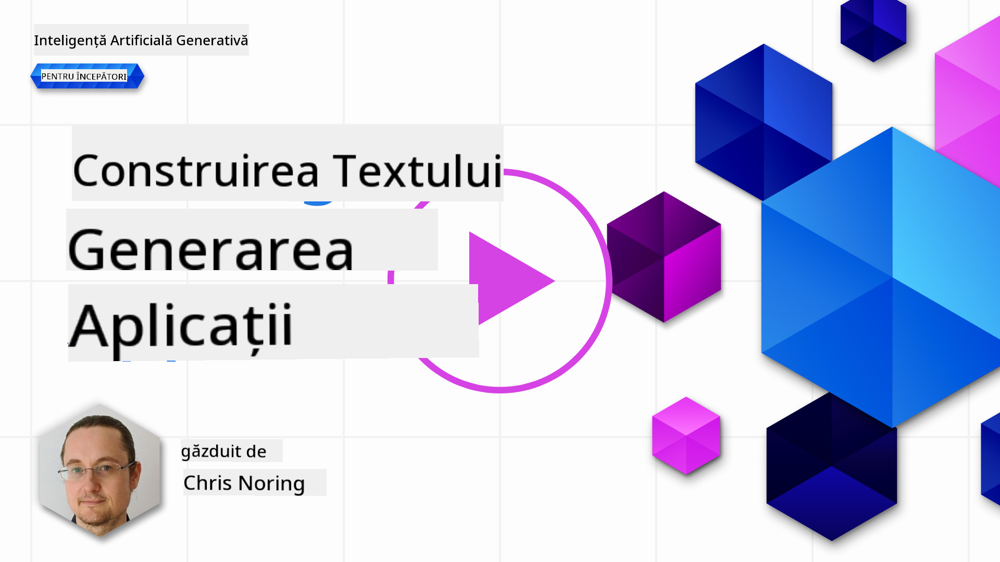

<!--
CO_OP_TRANSLATOR_METADATA:
{
  "original_hash": "5ec6c92b629564538ef397c550adb73e",
  "translation_date": "2025-05-19T17:20:12+00:00",
  "source_file": "06-text-generation-apps/README.md",
  "language_code": "ro"
}
-->
# Construirea aplicațiilor de generare de text

[](https://aka.ms/gen-ai-lesson6-gh?WT.mc_id=academic-105485-koreyst)

> _(Click pe imaginea de mai sus pentru a viziona videoclipul acestei lecții)_

Până acum, ai văzut prin acest curriculum că există concepte de bază precum solicitările și chiar o întreagă disciplină numită "ingineria solicitărilor". Multe instrumente cu care poți interacționa, cum ar fi ChatGPT, Office 365, Microsoft Power Platform și altele, te susțin să folosești solicitările pentru a realiza ceva.

Pentru a adăuga o astfel de experiență într-o aplicație, trebuie să înțelegi concepte precum solicitările, completările și să alegi o bibliotecă cu care să lucrezi. Exact asta vei învăța în acest capitol.

## Introducere

În acest capitol, vei:

- Învăța despre biblioteca openai și conceptele sale de bază.
- Construi o aplicație de generare de text folosind openai.
- Înțelege cum să folosești concepte precum solicitare, temperatură și token-uri pentru a construi o aplicație de generare de text.

## Obiective de învățare

La sfârșitul acestei lecții, vei putea:

- Explica ce este o aplicație de generare de text.
- Construi o aplicație de generare de text folosind openai.
- Configura aplicația ta pentru a folosi mai multe sau mai puține token-uri și, de asemenea, să schimbi temperatura pentru un rezultat variat.

## Ce este o aplicație de generare de text?

În mod normal, când construiești o aplicație, aceasta are un fel de interfață precum următoarele:

- Bazată pe comandă. Aplicațiile de consolă sunt aplicații tipice unde tastezi o comandă și aceasta execută o sarcină. De exemplu, `git` este o aplicație bazată pe comandă.
- Interfață de utilizator (UI). Unele aplicații au interfețe grafice de utilizator (GUI) unde dai click pe butoane, introduci text, selectezi opțiuni și altele.

### Aplicațiile de consolă și UI sunt limitate

Compară cu o aplicație bazată pe comandă unde tastezi o comandă:

- **Este limitată**. Nu poți să tastezi orice comandă, doar cele pe care aplicația le suportă.
- **Specifică limbajului**. Unele aplicații suportă multe limbi, dar în mod implicit aplicația este construită pentru o limbă specifică, chiar dacă poți adăuga suport pentru mai multe limbi.

### Beneficiile aplicațiilor de generare de text

Deci cum este o aplicație de generare de text diferită?

Într-o aplicație de generare de text, ai mai multă flexibilitate, nu ești limitat la un set de comenzi sau la o limbă specifică de intrare. În schimb, poți folosi limbajul natural pentru a interacționa cu aplicația. Un alt beneficiu este că, deoarece interacționezi deja cu o sursă de date care a fost antrenată pe un vast corpus de informații, pe când o aplicație tradițională ar putea fi limitată la ce este într-o bază de date.

### Ce pot construi cu o aplicație de generare de text?

Există multe lucruri pe care le poți construi. De exemplu:

- **Un chatbot**. Un chatbot care răspunde la întrebări despre subiecte, cum ar fi compania ta și produsele sale, ar putea fi o potrivire bună.
- **Ajutor**. LLM-urile sunt excelente la lucruri precum rezumarea textului, obținerea de informații din text, producerea de text precum CV-uri și altele.
- **Asistent de cod**. În funcție de modelul de limbaj pe care îl folosești, poți construi un asistent de cod care te ajută să scrii cod. De exemplu, poți folosi un produs precum GitHub Copilot, precum și ChatGPT pentru a te ajuta să scrii cod.

## Cum pot începe?

Ei bine, trebuie să găsești o modalitate de a te integra cu un LLM, care de obicei implică următoarele două abordări:

- Folosește un API. Aici construiești cereri web cu solicitarea ta și primești text generat înapoi.
- Folosește o bibliotecă. Bibliotecile ajută la încapsularea apelurilor API și le fac mai ușor de utilizat.

## Biblioteci/SDK-uri

Există câteva biblioteci bine cunoscute pentru lucrul cu LLM-uri, precum:

- **openai**, această bibliotecă face ușor conectarea la modelul tău și trimiterea de solicitări.

Apoi există biblioteci care operează la un nivel mai înalt, cum ar fi:

- **Langchain**. Langchain este bine cunoscut și suportă Python.
- **Semantic Kernel**. Semantic Kernel este o bibliotecă de la Microsoft care suportă limbajele C#, Python și Java.

## Prima aplicație folosind openai

Să vedem cum putem construi prima noastră aplicație, ce biblioteci avem nevoie, cât de mult este necesar și așa mai departe.

### Instalează openai

Există multe biblioteci acolo pentru interacțiunea cu OpenAI sau Azure OpenAI. Este posibil să folosești numeroase limbaje de programare, cum ar fi C#, Python, JavaScript, Java și altele. Am ales să folosim biblioteca `openai` Python, așa că vom folosi `pip` pentru a o instala.

```bash
pip install openai
```

### Creează o resursă

Trebuie să efectuezi următorii pași:

- Creează un cont pe Azure [https://azure.microsoft.com/free/](https://azure.microsoft.com/free/?WT.mc_id=academic-105485-koreyst).
- Obține acces la Azure OpenAI. Mergi la [https://learn.microsoft.com/azure/ai-services/openai/overview#how-do-i-get-access-to-azure-openai](https://learn.microsoft.com/azure/ai-services/openai/overview#how-do-i-get-access-to-azure-openai?WT.mc_id=academic-105485-koreyst) și solicită acces.

  > [!NOTE]
  > La momentul scrierii, trebuie să aplici pentru acces la Azure OpenAI.

- Instalează Python <https://www.python.org/>
- Creează o resursă de serviciu Azure OpenAI. Vezi acest ghid pentru cum să [creezi o resursă](https://learn.microsoft.com/azure/ai-services/openai/how-to/create-resource?pivots=web-portal?WT.mc_id=academic-105485-koreyst).

### Localizează cheia API și punctul final

În acest moment, trebuie să spui bibliotecii tale `openai` ce cheie API să folosească. Pentru a găsi cheia API, mergi la secțiunea "Keys and Endpoint" a resursei tale Azure OpenAI și copiază valoarea "Key 1".


Acum că ai aceste informații copiate, să instrucționăm bibliotecile să le folosească.

> [!NOTE]
> Merită să separi cheia API de codul tău. Poți face asta folosind variabile de mediu.
>
> - Setează variabila de mediu `OPENAI_API_KEY` to your API key.
>   `export OPENAI_API_KEY='sk-...'`

### Configurare Azure

Dacă folosești Azure OpenAI, iată cum configurezi:

```python
openai.api_type = 'azure'
openai.api_key = os.environ["OPENAI_API_KEY"]
openai.api_version = '2023-05-15'
openai.api_base = os.getenv("API_BASE")
```

Mai sus, setăm următoarele:

- `api_type` to `azure`. This tells the library to use Azure OpenAI and not OpenAI.
- `api_key`, this is your API key found in the Azure Portal.
- `api_version`, this is the version of the API you want to use. At the time of writing, the latest version is `2023-05-15`.
- `api_base`, this is the endpoint of the API. You can find it in the Azure Portal next to your API key.

> [!NOTE] > `os.getenv` is a function that reads environment variables. You can use it to read environment variables like `OPENAI_API_KEY` and `API_BASE`. Set these environment variables in your terminal or by using a library like `dotenv`.

## Generate text

The way to generate text is to use the `Completion` class. Iată un exemplu:

```python
prompt = "Complete the following: Once upon a time there was a"

completion = openai.Completion.create(model="davinci-002", prompt=prompt)
print(completion.choices[0].text)
```

În codul de mai sus, creăm un obiect de completare și transmitem modelul pe care dorim să-l folosim și solicitarea. Apoi, imprimăm textul generat.

### Completări de chat

Până acum, ai văzut cum am folosit `Completion` to generate text. But there's another class called `ChatCompletion`, care este mai potrivit pentru chatbots. Iată un exemplu de utilizare:

```python
import openai

openai.api_key = "sk-..."

completion = openai.ChatCompletion.create(model="gpt-3.5-turbo", messages=[{"role": "user", "content": "Hello world"}])
print(completion.choices[0].message.content)
```

Mai multe despre această funcționalitate într-un capitol viitor.

## Exercițiu - prima ta aplicație de generare de text

Acum că am învățat cum să configurăm și să configurăm openai, este timpul să construim prima ta aplicație de generare de text. Pentru a construi aplicația ta, urmează acești pași:

1. Creează un mediu virtual și instalează openai:

   ```bash
   python -m venv venv
   source venv/bin/activate
   pip install openai
   ```

   > [!NOTE]
   > Dacă folosești Windows tastează `venv\Scripts\activate` instead of `source venv/bin/activate`.

   > [!NOTE]
   > Locate your Azure OpenAI key by going to [https://portal.azure.com/](https://portal.azure.com/?WT.mc_id=academic-105485-koreyst) and search for `Open AI` and select the `Open AI resource` and then select `Keys and Endpoint` and copy the `Key 1` value.

1. Creează un fișier _app.py_ și dă-i următorul cod:

   ```python
   import openai

   openai.api_key = "<replace this value with your open ai key or Azure OpenAI key>"

   openai.api_type = 'azure'
   openai.api_version = '2023-05-15'
   openai.api_base = "<endpoint found in Azure Portal where your API key is>"
   deployment_name = "<deployment name>"

   # add your completion code
   prompt = "Complete the following: Once upon a time there was a"
   messages = [{"role": "user", "content": prompt}]

   # make completion
   completion = openai.chat.completions.create(model=deployment_name, messages=messages)

   # print response
   print(completion.choices[0].message.content)
   ```

   > [!NOTE]
   > Dacă folosești Azure OpenAI, trebuie să setezi `api_type` to `azure` and set the `api_key` la cheia ta Azure OpenAI.

   Ar trebui să vezi un rezultat ca următorul:

   ```output
    very unhappy _____.

   Once upon a time there was a very unhappy mermaid.
   ```

## Diferite tipuri de solicitări, pentru diferite lucruri

Acum ai văzut cum să generezi text folosind o solicitare. Ai chiar și un program funcțional pe care îl poți modifica și schimba pentru a genera diferite tipuri de text.

Solicitările pot fi folosite pentru tot felul de sarcini. De exemplu:

- **Generează un tip de text**. De exemplu, poți genera o poezie, întrebări pentru un test etc.
- **Caută informații**. Poți folosi solicitările pentru a căuta informații, cum ar fi exemplul următor 'Ce înseamnă CORS în dezvoltarea web?'.
- **Generează cod**. Poți folosi solicitările pentru a genera cod, de exemplu dezvoltând o expresie regulată folosită pentru a valida emailuri sau de ce nu să generezi un întreg program, cum ar fi o aplicație web?

## Un caz de utilizare mai practic: generator de rețete

Imaginează-ți că ai ingrediente acasă și vrei să gătești ceva. Pentru asta, ai nevoie de o rețetă. O modalitate de a găsi rețete este să folosești un motor de căutare sau ai putea folosi un LLM pentru a face acest lucru.

Ai putea scrie o solicitare astfel:

> "Arată-mi 5 rețete pentru un fel de mâncare cu următoarele ingrediente: pui, cartofi și morcovi. Pentru fiecare rețetă, listează toate ingredientele folosite"

Având în vedere solicitarea de mai sus, ai putea obține un răspuns similar cu:

```output
1. Roasted Chicken and Vegetables:
Ingredients:
- 4 chicken thighs
- 2 potatoes, cut into cubes
- 2 carrots, cut into cubes
- 2 tablespoons olive oil
- 2 cloves garlic, minced
- 1 teaspoon dried thyme
- 1 teaspoon dried oregano
- Salt and pepper, to taste

2. Chicken and Potato Stew:
Ingredients:
- 2 tablespoons olive oil
- 1 onion, diced
- 2 cloves garlic, minced
- 2 chicken breasts, cut into cubes
- 2 potatoes, cut into cubes
- 2 carrots, cut into cubes
- 1 teaspoon dried oregano
- 1 teaspoon dried thyme
- 1 cup chicken broth
- Salt and pepper, to taste

3. Chicken and Potato Bake:
Ingredients:
- 2 tablespoons olive oil
- 2 chicken breasts, cut into cubes
- 2 potatoes, cut into cubes
- 2 carrots, cut into cubes
- 1 onion, diced
- 2 cloves garlic, minced
- 1 teaspoon dried oregano
- 1 teaspoon dried thyme
- 1 cup chicken broth
- Salt and pepper, to taste

4. Chicken and Potato Soup:
Ingredients:
- 2 tablespoons olive oil
- 1 onion, diced
- 2 cloves garlic, minced
- 2 chicken breasts, cut into cubes
- 2 potatoes, cut into cubes
- 2 carrots, cut into cubes
- 1 teaspoon dried oregano
- 1 teaspoon dried thyme
- 4 cups chicken broth
- Salt and pepper, to taste

5. Chicken and Potato Hash:
Ingredients:
- 2 tablespoons olive oil
- 2 chicken breasts, cut into cubes
- 2 potatoes, cut into cubes
- 2 carrots, cut into cubes
- 1 onion, diced
- 2 cloves garlic, minced
- 1 teaspoon dried oregano
```

Acest rezultat este grozav, știu ce să gătesc. În acest moment, ce ar putea fi îmbunătățiri utile sunt:

- Filtrarea ingredientelor pe care nu le plac sau la care sunt alergic.
- Producerea unei liste de cumpărături, în caz că nu am toate ingredientele acasă.

Pentru cazurile de mai sus, să adăugăm o solicitare suplimentară:

> "Te rog să elimini rețetele cu usturoi, deoarece sunt alergic și să le înlocuiești cu altceva. De asemenea, te rog să produci o listă de cumpărături pentru rețete, considerând că deja am pui, cartofi și morcovi acasă."

Acum ai un nou rezultat, și anume:

```output
1. Roasted Chicken and Vegetables:
Ingredients:
- 4 chicken thighs
- 2 potatoes, cut into cubes
- 2 carrots, cut into cubes
- 2 tablespoons olive oil
- 1 teaspoon dried thyme
- 1 teaspoon dried oregano
- Salt and pepper, to taste

2. Chicken and Potato Stew:
Ingredients:
- 2 tablespoons olive oil
- 1 onion, diced
- 2 chicken breasts, cut into cubes
- 2 potatoes, cut into cubes
- 2 carrots, cut into cubes
- 1 teaspoon dried oregano
- 1 teaspoon dried thyme
- 1 cup chicken broth
- Salt and pepper, to taste

3. Chicken and Potato Bake:
Ingredients:
- 2 tablespoons olive oil
- 2 chicken breasts, cut into cubes
- 2 potatoes, cut into cubes
- 2 carrots, cut into cubes
- 1 onion, diced
- 1 teaspoon dried oregano
- 1 teaspoon dried thyme
- 1 cup chicken broth
- Salt and pepper, to taste

4. Chicken and Potato Soup:
Ingredients:
- 2 tablespoons olive oil
- 1 onion, diced
- 2 chicken breasts, cut into cubes
- 2 potatoes, cut into cubes
- 2 carrots, cut into cubes
- 1 teaspoon dried oregano
- 1 teaspoon dried thyme
- 4 cups chicken broth
- Salt and pepper, to taste

5. Chicken and Potato Hash:
Ingredients:
- 2 tablespoons olive oil
- 2 chicken breasts, cut into cubes
- 2 potatoes, cut into cubes
- 2 carrots, cut into cubes
- 1 onion, diced
- 1 teaspoon dried oregano

Shopping List:
- Olive oil
- Onion
- Thyme
- Oregano
- Salt
- Pepper
```

Acestea sunt cele cinci rețete ale tale, fără usturoi menționat și ai, de asemenea, o listă de cumpărături considerând ce ai deja acasă.

## Exercițiu - construiește un generator de rețete

Acum că am jucat un scenariu, să scriem cod pentru a se potrivi cu scenariul demonstrat. Pentru a face acest lucru, urmează acești pași:

1. Folosește fișierul existent _app.py_ ca punct de plecare
1. Localizează variabila `prompt` și schimbă codul său cu următorul:

   ```python
   prompt = "Show me 5 recipes for a dish with the following ingredients: chicken, potatoes, and carrots. Per recipe, list all the ingredients used"
   ```

   Dacă acum rulezi codul, ar trebui să vezi un rezultat similar cu:

   ```output
   -Chicken Stew with Potatoes and Carrots: 3 tablespoons oil, 1 onion, chopped, 2 cloves garlic, minced, 1 carrot, peeled and chopped, 1 potato, peeled and chopped, 1 bay leaf, 1 thyme sprig, 1/2 teaspoon salt, 1/4 teaspoon black pepper, 1 1/2 cups chicken broth, 1/2 cup dry white wine, 2 tablespoons chopped fresh parsley, 2 tablespoons unsalted butter, 1 1/2 pounds boneless, skinless chicken thighs, cut into 1-inch pieces
   -Oven-Roasted Chicken with Potatoes and Carrots: 3 tablespoons extra-virgin olive oil, 1 tablespoon Dijon mustard, 1 tablespoon chopped fresh rosemary, 1 tablespoon chopped fresh thyme, 4 cloves garlic, minced, 1 1/2 pounds small red potatoes, quartered, 1 1/2 pounds carrots, quartered lengthwise, 1/2 teaspoon salt, 1/4 teaspoon black pepper, 1 (4-pound) whole chicken
   -Chicken, Potato, and Carrot Casserole: cooking spray, 1 large onion, chopped, 2 cloves garlic, minced, 1 carrot, peeled and shredded, 1 potato, peeled and shredded, 1/2 teaspoon dried thyme leaves, 1/4 teaspoon salt, 1/4 teaspoon black pepper, 2 cups fat-free, low-sodium chicken broth, 1 cup frozen peas, 1/4 cup all-purpose flour, 1 cup 2% reduced-fat milk, 1/4 cup grated Parmesan cheese

   -One Pot Chicken and Potato Dinner: 2 tablespoons olive oil, 1 pound boneless, skinless chicken thighs, cut into 1-inch pieces, 1 large onion, chopped, 3 cloves garlic, minced, 1 carrot, peeled and chopped, 1 potato, peeled and chopped, 1 bay leaf, 1 thyme sprig, 1/2 teaspoon salt, 1/4 teaspoon black pepper, 2 cups chicken broth, 1/2 cup dry white wine

   -Chicken, Potato, and Carrot Curry: 1 tablespoon vegetable oil, 1 large onion, chopped, 2 cloves garlic, minced, 1 carrot, peeled and chopped, 1 potato, peeled and chopped, 1 teaspoon ground coriander, 1 teaspoon ground cumin, 1/2 teaspoon ground turmeric, 1/2 teaspoon ground ginger, 1/4 teaspoon cayenne pepper, 2 cups chicken broth, 1/2 cup dry white wine, 1 (15-ounce) can chickpeas, drained and rinsed, 1/2 cup raisins, 1/2 cup chopped fresh cilantro
   ```

   > NOTĂ, LLM-ul tău este nedeterministic, deci ai putea obține rezultate diferite de fiecare dată când rulezi programul.

   Grozav, să vedem cum putem îmbunătăți lucrurile. Pentru a îmbunătăți lucrurile, vrem să ne asigurăm că codul este flexibil, astfel încât ingredientele și numărul de rețete să poată fi îmbunătățite și schimbate.

1. Să schimbăm codul în felul următor:

   ```python
   no_recipes = input("No of recipes (for example, 5): ")

   ingredients = input("List of ingredients (for example, chicken, potatoes, and carrots): ")

   # interpolate the number of recipes into the prompt an ingredients
   prompt = f"Show me {no_recipes} recipes for a dish with the following ingredients: {ingredients}. Per recipe, list all the ingredients used"
   ```

   Luând codul pentru un test, ar putea arăta astfel:

   ```output
   No of recipes (for example, 5): 3
   List of ingredients (for example, chicken, potatoes, and carrots): milk,strawberries

   -Strawberry milk shake: milk, strawberries, sugar, vanilla extract, ice cubes
   -Strawberry shortcake: milk, flour, baking powder, sugar, salt, unsalted butter, strawberries, whipped cream
   -Strawberry milk: milk, strawberries, sugar, vanilla extract
   ```

### Îmbunătățire prin adăugarea filtrului și listei de cumpărături

Acum avem o aplicație funcțională capabilă să producă rețete și este flexibilă deoarece se bazează pe intrările de la utilizator, atât pe numărul de rețete, cât și pe ingredientele folosite.

Pentru a o îmbunătăți în continuare, vrem să adăugăm următoarele:

- **Filtrarea ingredientelor**. Vrem să putem filtra ingredientele pe care nu le plac sau la care suntem alergici. Pentru a realiza această schimbare, putem edita solicitarea noastră existentă și să adăugăm o condiție de filtrare la sfârșitul ei astfel:

  ```python
  filter = input("Filter (for example, vegetarian, vegan, or gluten-free): ")

  prompt = f"Show me {no_recipes} recipes for a dish with the following ingredients: {ingredients}. Per recipe, list all the ingredients used, no {filter}"
  ```

  Mai sus, adăugăm `{filter}` la sfârșitul solicitării și, de asemenea, capturăm valoarea filtrului de la utilizator.

  Un exemplu de intrare al rulării programului poate arăta astfel:

  ```output
  No of recipes (for example, 5): 3
  List of ingredients (for example, chicken, potatoes, and carrots): onion,milk
  Filter (for example, vegetarian, vegan, or gluten-free): no milk

  1. French Onion Soup

  Ingredients:

  -1 large onion, sliced
  -3 cups beef broth
  -1 cup milk
  -6 slices french bread
  -1/4 cup shredded Parmesan cheese
  -1 tablespoon butter
  -1 teaspoon dried thyme
  -1/4 teaspoon salt
  -1/4 teaspoon black pepper

  Instructions:

  1. In a large pot, sauté onions in butter until golden brown.
  2. Add beef broth, milk, thyme, salt, and pepper. Bring to a boil.
  3. Reduce heat and simmer for 10 minutes.
  4. Place french bread slices on soup bowls.
  5. Ladle soup over bread.
  6. Sprinkle with Parmesan cheese.

  2. Onion and Potato Soup

  Ingredients:

  -1 large onion, chopped
  -2 cups potatoes, diced
  -3 cups vegetable broth
  -1 cup milk
  -1/4 teaspoon black pepper

  Instructions:

  1. In a large pot, sauté onions in butter until golden brown.
  2. Add potatoes, vegetable broth, milk, and pepper. Bring to a boil.
  3. Reduce heat and simmer for 10 minutes.
  4. Serve hot.

  3. Creamy Onion Soup

  Ingredients:

  -1 large onion, chopped
  -3 cups vegetable broth
  -1 cup milk
  -1/4 teaspoon black pepper
  -1/4 cup all-purpose flour
  -1/2 cup shredded Parmesan cheese

  Instructions:

  1. In a large pot, sauté onions in butter until golden brown.
  2. Add vegetable broth, milk, and pepper. Bring to a boil.
  3. Reduce heat and simmer for 10 minutes.
  4. In a small bowl, whisk together flour and Parmesan cheese until smooth.
  5. Add to soup and simmer for an additional 5 minutes, or until soup has thickened.
  ```

  După cum poți vedea, orice rețete cu lapte au fost filtrate. Dar, dacă ești intolerant la lactoză, s-ar putea să vrei să filtrezi și rețetele cu brânză, așa că există nevoie să fii clar.

- **Producerea unei liste de cumpărături**. Vrem să producem o listă de cumpărături, considerând ce avem deja acasă.

  Pentru această funcționalitate, am putea încerca să rezolvăm totul într-o singură solicitare sau am putea să o împărțim în două solicitări. Să încercăm abordarea din urmă. Aici sugerăm adăugarea unei solicitări suplimentare, dar pentru ca aceasta să funcționeze, trebuie să adăugăm rezultatul solicitării anterioare ca context la solicitarea ulterioară.

  Localizează partea din cod care imprimă rezultatul din prima solicitare și adaugă următorul cod mai jos:

  ```python
  old_prompt_result = completion.choices[0].message.content
  prompt = "Produce a shopping list for the generated recipes and please don't include ingredients that I already have."

  new_prompt = f"{old_prompt_result} {prompt}"
  messages = [{"role": "user", "content": new_prompt}]
  completion = openai.Completion.create(engine=deployment_name, messages=messages, max_tokens=1200)

  # print response
  print("Shopping list:")
  print(completion.choices[0].message.content)
  ```

  Notează următoarele:

  1. Construim o nouă solicitare adăugând rezultatul din prima solicitare la noua solicitare:

     ```python
     new_prompt = f"{old_prompt_result} {prompt}"
     ```

  1. Facem o nouă cerere, dar și considerând numărul de token-uri pe care l-am cerut în prima solicitare, așa că de data aceasta spunem `max_tokens` este 1200.

     ```python
     completion = openai.Completion.create(engine=deployment_name, prompt=new_prompt, max_tokens=1200)
     ```

     Luând acest cod pentru o tură de test, ajungem acum la următorul rezultat:

     ```output
     No of recipes (for example, 5): 2
     List of ingredients (for example, chicken, potatoes, and carrots): apple,flour
     Filter (for example, vegetarian, vegan, or gluten-free): sugar


     -Apple and flour pancakes: 1 cup flour, 1/2 tsp baking powder, 1/2 tsp baking soda, 1/4 tsp salt, 1 tbsp sugar, 1 egg, 1 cup buttermilk or sour milk, 1/4 cup melted butter, 1 Granny Smith apple, peeled and grated
     -Apple fritters: 1-1/2 cups flour, 1 tsp baking powder, 1/4 tsp salt, 1/4 tsp baking soda, 1/4 tsp nutmeg, 1/4 tsp cinnamon, 1/4 tsp allspice, 1/4 cup sugar, 1/4 cup vegetable shortening, 1/4 cup milk, 1 egg, 2 cups shredded, peeled apples
     Shopping list:
     -Flour, baking powder, baking soda, salt, sugar, egg, buttermilk, butter, apple, nutmeg, cinnamon, allspice
     ```

## Îmbunătățește-ți configurația

Ce avem până acum este un cod care funcționează, dar există câteva ajustări pe care ar trebui să le facem pentru a îmbunătăți lucrurile și mai mult. Unele lucruri pe care ar trebui să le facem sunt:

- **Separarea secretelor de cod**, cum ar fi cheia API. Secretele nu aparțin codului și ar trebui să fie stocate într-un loc sigur. Pentru a separa secretele de cod, putem folosi variabile de mediu și biblioteci precum `python-dotenv` to load them from a file. Here's how that would look like in code:

  1. Create a `.env` file with the following content:

     ```bash
     OPENAI_API_KEY=sk-...
     ```

     > Notă, pentru Azure, trebuie să setezi următoarele variabile de mediu:

     ```bash
     OPENAI_API_TYPE=azure
     OPENAI_API_VERSION=2023-05-15
     OPENAI_API_BASE=<replace>
     ```

     În cod, ai încărca variabilele de mediu astfel:

     ```python
     from dotenv import load_dotenv

     load_dotenv()

     openai.api_key = os.environ["OPENAI_API_KEY"]
     ```

- **Un cuvânt despre lungimea token-ului**. Ar trebui să considerăm câte token-uri avem nevoie pentru a genera textul dorit. Token-urile costă bani, așa că, unde este posibil, ar trebui să încercăm să fim economici cu numărul de token-uri pe care le folosim. De exemplu, putem formula solicitarea astfel încât să folosim mai puține token-uri?

  Pentru a schimba token-urile folosite, poți folosi parametrul `max_tokens`. De exemplu, dacă vrei să folosești 100 de token-uri, ai face

**Declinarea responsabilității**:  
Acest document a fost tradus folosind serviciul de traducere AI [Co-op Translator](https://github.com/Azure/co-op-translator). Deși ne străduim să obținem acuratețe, vă rugăm să fiți conștienți că traducerile automate pot conține erori sau inexactități. Documentul original în limba sa maternă ar trebui considerat sursa autoritară. Pentru informații critice, se recomandă traducerea profesională umană. Nu suntem răspunzători pentru niciun fel de neînțelegeri sau interpretări greșite care rezultă din utilizarea acestei traduceri.