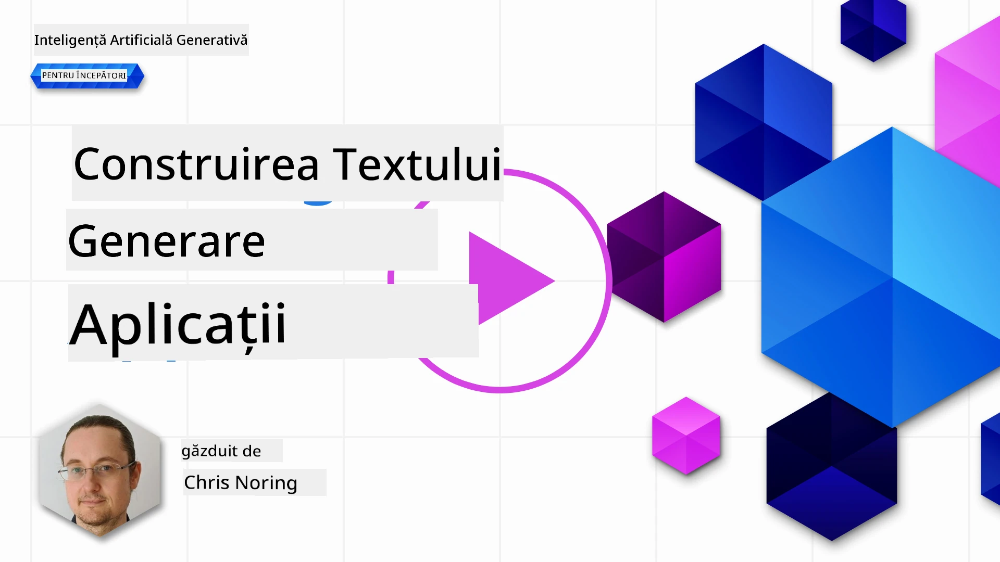

# Construirea aplicațiilor de generare a textului

[](https://youtu.be/0Y5Luf5sRQA?si=t_xVg0clnAI4oUFZ)

> _(Click pe imaginea de mai sus pentru a viziona videoclipul acestei lecții)_

Până acum, în cadrul acestui curriculum, ai văzut că există concepte de bază precum prompturile și chiar o disciplină întreagă numită "ingineria prompturilor". Multe instrumente cu care poți interacționa, cum ar fi ChatGPT, Office 365, Microsoft Power Platform și altele, te susțin folosind prompturi pentru a realiza ceva.

Pentru a adăuga o astfel de experiență într-o aplicație, trebuie să înțelegi concepte precum prompturi, completări și să alegi o bibliotecă cu care să lucrezi. Exact asta vei învăța în acest capitol.

## Introducere

În acest capitol, vei:

- Învăța despre biblioteca openai și conceptele sale de bază.
- Construi o aplicație de generare a textului folosind openai.
- Înțelege cum să folosești concepte precum prompt, temperature și tokens pentru a construi o aplicație de generare a textului.

## Obiectivele de învățare

La sfârșitul acestei lecții, vei fi capabil să:

- Explici ce este o aplicație de generare a textului.
- Construiești o aplicație de generare a textului folosind openai.
- Configurezi aplicația să utilizeze mai mulți sau mai puțini tokens și să schimbi temperatura, pentru un rezultat variat.

## Ce este o aplicație de generare a textului?

De obicei, când construiești o aplicație aceasta are un fel de interfață ca urmează:

- Bazată pe comenzi. Aplicațiile de consolă sunt aplicații tipice în care tastezi o comandă și aceasta execută o sarcină. De exemplu, `git` este o aplicație bazată pe comenzi.
- Interfață de utilizator (UI). Unele aplicații au interfețe grafice de utilizator (GUI) unde apeși butoane, introduci text, selectezi opțiuni și altele.

### Aplicațiile de consolă și UI sunt limitate

Compară cu o aplicație bazată pe comenzi unde tastezi o comandă:

- **Este limitată**. Nu poți introduce orice comandă, doar cele pe care aplicația le suportă.
- **Limbaj specific**. Unele aplicații suportă multe limbi, dar în mod implicit aplicația este construită pentru un anumit limbaj, chiar dacă poți adăuga suport pentru altele.

### Beneficiile aplicațiilor de generare a textului

Atunci, cum este diferită o aplicație de generare a textului?

Într-o aplicație de generare a textului, ai mai multă flexibilitate, nu ești limitat la un set de comenzi sau la un limbaj de intrare specific. În schimb, poți folosi limbajul natural pentru a interacționa cu aplicația. Un alt beneficiu este că interacționezi deja cu o sursă de date care a fost antrenată pe un vast corpus de informații, pe când o aplicație tradițională ar putea fi limitată la ce conține o bază de date.

### Ce pot construi cu o aplicație de generare a textului?

Poți construi multe lucruri. De exemplu:

- **Un chatbot**. Un chatbot care răspunde la întrebări despre subiecte, cum ar fi compania ta și produsele ei ar putea fi o potrivire bună.
- **Asistent**. LLM-urile sunt grozave la lucruri precum rezumarea textului, extragerea de informații din text, generarea de texte precum CV-uri și altele.
- **Asistent de cod**. În funcție de modelul de limbaj pe care îl folosești, poți construi un asistent de cod care să te ajute să scrii cod. De exemplu, poți folosi un produs precum GitHub Copilot precum și ChatGPT pentru a te ajuta să scrii cod.

## Cum pot începe?

Ei bine, trebuie să găsești o cale de a te integra cu un LLM, ceea ce de obicei presupune următoarele două abordări:

- Folosește un API. Aici construiești cereri web cu promptul tău și primești înapoi text generat.
- Folosește o bibliotecă. Bibliotecile ajută la încapsularea apelurilor API și le fac mai ușor de folosit.

## Biblioteci/SDK-uri

Există câteva biblioteci bine cunoscute pentru lucrul cu LLM-uri cum ar fi:

- **openai**, această bibliotecă face ușor să te conectezi la modelul tău și să trimiți prompturi.

Apoi există biblioteci care operează la un nivel mai înalt, cum ar fi:

- **Langchain**. Langchain este bine cunoscut și suportă Python.
- **Semantic Kernel**. Semantic Kernel este o bibliotecă de la Microsoft care suportă limbajele C#, Python și Java.

## Prima aplicație folosind openai

Să vedem cum putem construi prima noastră aplicație, ce biblioteci avem nevoie, cât este necesar și așa mai departe.

### Instalarea openai

Există multe biblioteci pentru interacțiunea cu OpenAI sau Azure OpenAI. Este posibil să folosești și numeroase limbaje de programare precum C#, Python, JavaScript, Java și altele. Am ales să folosim biblioteca Python `openai`, așa că vom folosi `pip` pentru a o instala.

```bash
pip install openai
```

### Crearea unui resource

Trebuie să realizezi următorii pași:

- Creează un cont pe Azure [https://azure.microsoft.com/free/](https://azure.microsoft.com/free/?WT.mc_id=academic-105485-koreyst).
- Obține acces la Azure OpenAI. Mergi la [https://learn.microsoft.com/azure/ai-foundry/openai/overview#how-do-i-get-access-to-azure-openai](https://learn.microsoft.com/azure/ai-foundry/openai/overview#how-do-i-get-access-to-azure-openai?WT.mc_id=academic-105485-koreyst) și solicită acces.

  > [!NOTE]
  > La momentul scrierii, trebuie să aplici pentru acces la Azure OpenAI.

- Instalează Python <https://www.python.org/>
- Ai creat un resource Azure OpenAI Service. Vezi acest ghid despre cum să [creezi un resource](https://learn.microsoft.com/azure/ai-foundry/openai/how-to/create-resource?pivots=web-portal?WT.mc_id=academic-105485-koreyst).

### Găsirea cheii API și a endpoint-ului

În acest moment, trebuie să spui bibliotecii `openai` ce cheie API să folosească. Pentru a găsi cheia API, mergi în secțiunea "Keys and Endpoint" a resursei tale Azure OpenAI și copiază valoarea "Key 1".


Acum că ai copiat această informație, să instruim bibliotecile să o folosească.

> [!NOTE]
> Merită să separi cheia API de codul tău. Poți face asta folosind variabile de mediu.
>
> - Setează variabila de mediu `OPENAI_API_KEY` cu cheia ta API.
>   `export OPENAI_API_KEY='sk-...'`

### Configurare Azure

Dacă folosești Azure OpenAI (acum parte din Microsoft Foundry), iată cum configurezi. Folosim clientul standard `OpenAI` indicat către endpoint-ul Azure OpenAI `/openai/v1/`, care funcționează cu Responses API și nu necesită `api_version`:

```python
import os
from openai import OpenAI

client = OpenAI(
    api_key=os.environ["AZURE_OPENAI_API_KEY"],
    base_url=f"{os.environ['AZURE_OPENAI_ENDPOINT'].rstrip('/')}/openai/v1/",
)
```

Mai sus setăm următoarele:

- `api_key`, aceasta este cheia ta API găsită în Azure Portal sau portalul Microsoft Foundry.
- `base_url`, acesta este endpoint-ul resursei tale Foundry cu `/openai/v1/` adăugat la final. Endpoint-ul stabil v1 funcționează atât pentru OpenAI cât și pentru Azure OpenAI fără managementul `api_version`.

> [!NOTE] > `os.environ` citește variabilele de mediu. Poți să îl folosești pentru a citi variabilele de mediu precum `AZURE_OPENAI_API_KEY` și `AZURE_OPENAI_ENDPOINT`. Setează aceste variabile în terminalul tău sau folosind o bibliotecă precum `dotenv`.

## Generare de text

Modul de a genera text este să folosești Responses API prin metoda `responses.create`. Iată un exemplu:

```python
prompt = "Complete the following: Once upon a time there was a"

response = client.responses.create(
    model="gpt-5-mini",  # acesta este numele implementării modelului tău
    input=prompt,
    store=False,
)
print(response.output_text)
```

În codul de mai sus, creăm un răspuns și trecem modelul pe care vrem să îl folosim și promptul. Apoi afișăm textul generat prin `response.output_text`.

### Conversații multi-turn

Responses API este bine potrivit atât pentru generarea de text single-turn cât și pentru chatboți multi-turn - furnizezi o listă de mesaje în `input` pentru a construi o conversație:

```python
from openai import OpenAI

client = OpenAI(api_key="sk-...")

response = client.responses.create(model="gpt-5-mini", input="Hello world", store=False)
print(response.output_text)
```

Mai multe despre această funcționalitate în capitole viitoare.

## Exercițiu - prima ta aplicație de generare text

Acum că am învățat cum să configurăm și să configurăm openai, este timpul să construim prima ta aplicație de generare a textului. Urmează acești pași pentru a-ți construi aplicația:

1. Creează un mediu virtual și instalează openai:

   ```bash
   python -m venv venv
   source venv/bin/activate
   pip install openai
   ```

   > [!NOTE]
   > Dacă folosești Windows tastează `venv\Scripts\activate` în loc de `source venv/bin/activate`.

   > [!NOTE]
   > Găsește cheia Azure OpenAI mergând la [https://portal.azure.com/](https://portal.azure.com/?WT.mc_id=academic-105485-koreyst), caută `Open AI`, selectează `Open AI resource` și apoi selectează `Keys and Endpoint` și copiază valoarea `Key 1`.

1. Creează un fișier _app.py_ și pune următorul cod:

   ```python
   import os
   from openai import OpenAI

   client = OpenAI(
       api_key="<replace this value with your Azure OpenAI key>",
       base_url="<endpoint found in Azure Portal>/openai/v1/",
   )
   deployment_name = "<deployment name>"

   # adaugă codul tău de completare
   prompt = "Complete the following: Once upon a time there was a"

   # fă o cerere folosind API-ul Răspunsuri
   response = client.responses.create(model=deployment_name, input=prompt, store=False)

   # afișează răspunsul
   print(response.output_text)
   ```

   > [!NOTE]
   > Dacă folosești OpenAI simplu (nu Azure), folosește `client = OpenAI(api_key="<înlocuiește această valoare cu cheia ta OpenAI>")` (fără `base_url`) și treci un nume de model precum `gpt-5-mini` în loc de un nume de deployment.

   Ar trebui să vezi un rezultat similar cu următorul:

   ```output
    very unhappy _____.

   Once upon a time there was a very unhappy mermaid.
   ```

## Tipuri diferite de prompturi, pentru lucruri diferite

Acum ai văzut cum să generezi text folosind un prompt. Ai chiar un program funcțional pe care îl poți modifica pentru a genera tipuri diferite de text.

Prompturile pot fi folosite pentru tot felul de sarcini. De exemplu:

- **Generarea unui tip de text**. De exemplu, poți genera un poem, întrebări pentru un quiz etc.
- **Căutarea informațiilor**. Poți folosi prompturi pentru a căuta informații, cum ar fi exemplul: 'Ce înseamnă CORS în dezvoltarea web?'.
- **Generarea de cod**. Poți folosi prompturi pentru a genera cod, de exemplu dezvoltând o expresie regulată folosită pentru validarea email-urilor sau, de ce nu, să generezi un program întreg, precum o aplicație web?

## Un caz de utilizare mai practic: un generator de rețete

Imaginează-ți că ai ingrediente acasă și vrei să gătești ceva. Pentru asta, ai nevoie de o rețetă. O modalitate de a găsi rețete este să folosești un motor de căutare sau ai putea folosi un LLM pentru asta.

Ai putea scrie un prompt astfel:

> "Arată-mi 5 rețete pentru un fel de mâncare cu următoarele ingrediente: pui, cartofi și morcovi. Pentru fiecare rețetă, listează toate ingredientele folosite"

Având promptul de mai sus, s-ar putea să primești un răspuns similar cu:

```output
1. Roasted Chicken and Vegetables:
Ingredients:
- 4 chicken thighs
- 2 potatoes, cut into cubes
- 2 carrots, cut into cubes
- 2 tablespoons olive oil
- 2 cloves garlic, minced
- 1 teaspoon dried thyme
- 1 teaspoon dried oregano
- Salt and pepper, to taste

2. Chicken and Potato Stew:
Ingredients:
- 2 tablespoons olive oil
- 1 onion, diced
- 2 cloves garlic, minced
- 2 chicken breasts, cut into cubes
- 2 potatoes, cut into cubes
- 2 carrots, cut into cubes
- 1 teaspoon dried oregano
- 1 teaspoon dried thyme
- 1 cup chicken broth
- Salt and pepper, to taste

3. Chicken and Potato Bake:
Ingredients:
- 2 tablespoons olive oil
- 2 chicken breasts, cut into cubes
- 2 potatoes, cut into cubes
- 2 carrots, cut into cubes
- 1 onion, diced
- 2 cloves garlic, minced
- 1 teaspoon dried oregano
- 1 teaspoon dried thyme
- 1 cup chicken broth
- Salt and pepper, to taste

4. Chicken and Potato Soup:
Ingredients:
- 2 tablespoons olive oil
- 1 onion, diced
- 2 cloves garlic, minced
- 2 chicken breasts, cut into cubes
- 2 potatoes, cut into cubes
- 2 carrots, cut into cubes
- 1 teaspoon dried oregano
- 1 teaspoon dried thyme
- 4 cups chicken broth
- Salt and pepper, to taste

5. Chicken and Potato Hash:
Ingredients:
- 2 tablespoons olive oil
- 2 chicken breasts, cut into cubes
- 2 potatoes, cut into cubes
- 2 carrots, cut into cubes
- 1 onion, diced
- 2 cloves garlic, minced
- 1 teaspoon dried oregano
```

Acest rezultat este grozav, știu ce să gătesc. În acest punct, ce ar putea fi îmbunătățiri utile sunt:

- Filtrarea ingredientelor pe care nu le plac sau la care sunt alergic.
- Generarea unei liste de cumpărături, în caz că nu am toate ingredientele acasă.

Pentru cazurile de mai sus, să adăugăm un prompt suplimentar:

> "Te rog elimină rețetele cu usturoi deoarece sunt alergic și înlocuiește-l cu altceva. De asemenea, te rog să generezi o listă de cumpărături pentru rețete, ținând cont că am deja acasă pui, cartofi și morcovi."

Acum ai un nou rezultat, anume:

```output
1. Roasted Chicken and Vegetables:
Ingredients:
- 4 chicken thighs
- 2 potatoes, cut into cubes
- 2 carrots, cut into cubes
- 2 tablespoons olive oil
- 1 teaspoon dried thyme
- 1 teaspoon dried oregano
- Salt and pepper, to taste

2. Chicken and Potato Stew:
Ingredients:
- 2 tablespoons olive oil
- 1 onion, diced
- 2 chicken breasts, cut into cubes
- 2 potatoes, cut into cubes
- 2 carrots, cut into cubes
- 1 teaspoon dried oregano
- 1 teaspoon dried thyme
- 1 cup chicken broth
- Salt and pepper, to taste

3. Chicken and Potato Bake:
Ingredients:
- 2 tablespoons olive oil
- 2 chicken breasts, cut into cubes
- 2 potatoes, cut into cubes
- 2 carrots, cut into cubes
- 1 onion, diced
- 1 teaspoon dried oregano
- 1 teaspoon dried thyme
- 1 cup chicken broth
- Salt and pepper, to taste

4. Chicken and Potato Soup:
Ingredients:
- 2 tablespoons olive oil
- 1 onion, diced
- 2 chicken breasts, cut into cubes
- 2 potatoes, cut into cubes
- 2 carrots, cut into cubes
- 1 teaspoon dried oregano
- 1 teaspoon dried thyme
- 4 cups chicken broth
- Salt and pepper, to taste

5. Chicken and Potato Hash:
Ingredients:
- 2 tablespoons olive oil
- 2 chicken breasts, cut into cubes
- 2 potatoes, cut into cubes
- 2 carrots, cut into cubes
- 1 onion, diced
- 1 teaspoon dried oregano

Shopping List:
- Olive oil
- Onion
- Thyme
- Oregano
- Salt
- Pepper
```

Aceasta sunt cele cinci rețete, fără usturoi menționat și ai, de asemenea, o listă de cumpărături ținând cont de ce ai deja acasă.

## Exercițiu - construiește un generator de rețete

Acum că am jucat un scenariu, să scriem cod care să corespundă scenariului demonstrat. Pentru asta, urmează acești pași:

1. Folosește fișierul _app.py_ existent ca punct de plecare
1. Găsește variabila `prompt` și schimbă codul ei cu următorul:

   ```python
   prompt = "Show me 5 recipes for a dish with the following ingredients: chicken, potatoes, and carrots. Per recipe, list all the ingredients used"
   ```

   Dacă acum rulezi codul, ar trebui să vezi un rezultat similar cu:

   ```output
   -Chicken Stew with Potatoes and Carrots: 3 tablespoons oil, 1 onion, chopped, 2 cloves garlic, minced, 1 carrot, peeled and chopped, 1 potato, peeled and chopped, 1 bay leaf, 1 thyme sprig, 1/2 teaspoon salt, 1/4 teaspoon black pepper, 1 1/2 cups chicken broth, 1/2 cup dry white wine, 2 tablespoons chopped fresh parsley, 2 tablespoons unsalted butter, 1 1/2 pounds boneless, skinless chicken thighs, cut into 1-inch pieces
   -Oven-Roasted Chicken with Potatoes and Carrots: 3 tablespoons extra-virgin olive oil, 1 tablespoon Dijon mustard, 1 tablespoon chopped fresh rosemary, 1 tablespoon chopped fresh thyme, 4 cloves garlic, minced, 1 1/2 pounds small red potatoes, quartered, 1 1/2 pounds carrots, quartered lengthwise, 1/2 teaspoon salt, 1/4 teaspoon black pepper, 1 (4-pound) whole chicken
   -Chicken, Potato, and Carrot Casserole: cooking spray, 1 large onion, chopped, 2 cloves garlic, minced, 1 carrot, peeled and shredded, 1 potato, peeled and shredded, 1/2 teaspoon dried thyme leaves, 1/4 teaspoon salt, 1/4 teaspoon black pepper, 2 cups fat-free, low-sodium chicken broth, 1 cup frozen peas, 1/4 cup all-purpose flour, 1 cup 2% reduced-fat milk, 1/4 cup grated Parmesan cheese

   -One Pot Chicken and Potato Dinner: 2 tablespoons olive oil, 1 pound boneless, skinless chicken thighs, cut into 1-inch pieces, 1 large onion, chopped, 3 cloves garlic, minced, 1 carrot, peeled and chopped, 1 potato, peeled and chopped, 1 bay leaf, 1 thyme sprig, 1/2 teaspoon salt, 1/4 teaspoon black pepper, 2 cups chicken broth, 1/2 cup dry white wine

   -Chicken, Potato, and Carrot Curry: 1 tablespoon vegetable oil, 1 large onion, chopped, 2 cloves garlic, minced, 1 carrot, peeled and chopped, 1 potato, peeled and chopped, 1 teaspoon ground coriander, 1 teaspoon ground cumin, 1/2 teaspoon ground turmeric, 1/2 teaspoon ground ginger, 1/4 teaspoon cayenne pepper, 2 cups chicken broth, 1/2 cup dry white wine, 1 (15-ounce) can chickpeas, drained and rinsed, 1/2 cup raisins, 1/2 cup chopped fresh cilantro
   ```

   > NOTĂ, LLM-ul tău este nedeterminist, deci poți obține rezultate diferite de fiecare dată când rulezi programul.

   Grozav, să vedem cum putem îmbunătăți lucrurile. Pentru a îmbunătăți, vrem să ne asigurăm că codul este flexibil, astfel încât ingredientele și numărul rețetelor să poată fi ajustate și schimbate.

1. Să schimbăm codul astfel:

   ```python
   no_recipes = input("No of recipes (for example, 5): ")

   ingredients = input("List of ingredients (for example, chicken, potatoes, and carrots): ")

   # interpolați numărul de rețete în prompt și ingrediente
   prompt = f"Show me {no_recipes} recipes for a dish with the following ingredients: {ingredients}. Per recipe, list all the ingredients used"
   ```

   Folosind codul pentru un test de rulare, ar putea arăta așa:

   ```output
   No of recipes (for example, 5): 3
   List of ingredients (for example, chicken, potatoes, and carrots): milk,strawberries

   -Strawberry milk shake: milk, strawberries, sugar, vanilla extract, ice cubes
   -Strawberry shortcake: milk, flour, baking powder, sugar, salt, unsalted butter, strawberries, whipped cream
   -Strawberry milk: milk, strawberries, sugar, vanilla extract
   ```

### Îmbunătățește adăugând filtrare și listă de cumpărături

Acum avem o aplicație funcțională capabilă să genereze rețete și este flexibilă deoarece se bazează pe inputuri de la utilizator, atât privind numărul de rețete cât și ingredientele folosite.

Pentru a o îmbunătăți mai mult, vrem să adăugăm următoarele:

- **Filtrarea ingredientelor**. Vrem să putem filtra ingredientele care nu ne plac sau la care suntem alergici. Pentru a realiza această modificare, putem edita promptul nostru existent și să adăugăm o condiție de filtrare la finalul său astfel:

  ```python
  filter = input("Filter (for example, vegetarian, vegan, or gluten-free): ")

  prompt = f"Show me {no_recipes} recipes for a dish with the following ingredients: {ingredients}. Per recipe, list all the ingredients used, no {filter}"
  ```

  Mai sus, adăugăm `{filter}` la finalul promptului și capturăm și valoarea filtrului de la utilizator.

  Un exemplu de input rulând programul poate arăta acum astfel:

  ```output
  No of recipes (for example, 5): 3
  List of ingredients (for example, chicken, potatoes, and carrots): onion,milk
  Filter (for example, vegetarian, vegan, or gluten-free): no milk

  1. French Onion Soup

  Ingredients:

  -1 large onion, sliced
  -3 cups beef broth
  -1 cup milk
  -6 slices french bread
  -1/4 cup shredded Parmesan cheese
  -1 tablespoon butter
  -1 teaspoon dried thyme
  -1/4 teaspoon salt
  -1/4 teaspoon black pepper

  Instructions:

  1. In a large pot, sauté onions in butter until golden brown.
  2. Add beef broth, milk, thyme, salt, and pepper. Bring to a boil.
  3. Reduce heat and simmer for 10 minutes.
  4. Place french bread slices on soup bowls.
  5. Ladle soup over bread.
  6. Sprinkle with Parmesan cheese.

  2. Onion and Potato Soup

  Ingredients:

  -1 large onion, chopped
  -2 cups potatoes, diced
  -3 cups vegetable broth
  -1 cup milk
  -1/4 teaspoon black pepper

  Instructions:

  1. In a large pot, sauté onions in butter until golden brown.
  2. Add potatoes, vegetable broth, milk, and pepper. Bring to a boil.
  3. Reduce heat and simmer for 10 minutes.
  4. Serve hot.

  3. Creamy Onion Soup

  Ingredients:

  -1 large onion, chopped
  -3 cups vegetable broth
  -1 cup milk
  -1/4 teaspoon black pepper
  -1/4 cup all-purpose flour
  -1/2 cup shredded Parmesan cheese

  Instructions:

  1. In a large pot, sauté onions in butter until golden brown.
  2. Add vegetable broth, milk, and pepper. Bring to a boil.
  3. Reduce heat and simmer for 10 minutes.
  4. In a small bowl, whisk together flour and Parmesan cheese until smooth.
  5. Add to soup and simmer for an additional 5 minutes, or until soup has thickened.
  ```

  După cum poți vedea, orice rețetă cu lapte a fost filtrată. Dar dacă ești intolerant la lactoză, poate dorești să filtrezi și rețetele cu brânză, așa că trebuie să fie clar.


- **Produ ună listă de cumpărături**. Dorim să producem o listă de cumpărături, ținând cont de ceea ce avem deja acasă.

  Pentru această funcționalitate, am putea încerca fie să rezolvăm totul într-o singură solicitare (prompt), fie să o împărțim în două solicitări. Să încercăm a doua abordare. Aici sugerăm adăugarea unei solicitări suplimentare, dar pentru ca asta să funcționeze, trebuie să adăugăm rezultatul primei solicitări ca context pentru a doua.

  Localizează partea din cod care afișează rezultatul primei solicitări și adaugă codul următor dedesubt:

  ```python
  old_prompt_result = response.output_text
  prompt = "Produce a shopping list for the generated recipes and please don't include ingredients that I already have."

  new_prompt = f"{old_prompt_result} {prompt}"
  response = client.responses.create(model=deployment_name, input=new_prompt, max_output_tokens=1200, store=False)

  # afișează răspunsul
  print("Shopping list:")
  print(response.output_text)
  ```

  Observă următoarele:

  1. Construim o solicitare nouă prin adăugarea rezultatului primei solicitări la noua solicitare:

     ```python
     new_prompt = f"{old_prompt_result} {prompt}"
     ```

  1. Facem o solicitare nouă, dar ținând cont și de numărul de tokeni ceruți în prima solicitare, așa că de data aceasta spunem că `max_output_tokens` este 1200.

     ```python
     response = client.responses.create(model=deployment_name, input=new_prompt, max_output_tokens=1200, store=False)
     ```

     Testând acest cod, ajungem acum la următorul rezultat:

     ```output
     No of recipes (for example, 5): 2
     List of ingredients (for example, chicken, potatoes, and carrots): apple,flour
     Filter (for example, vegetarian, vegan, or gluten-free): sugar


     -Apple and flour pancakes: 1 cup flour, 1/2 tsp baking powder, 1/2 tsp baking soda, 1/4 tsp salt, 1 tbsp sugar, 1 egg, 1 cup buttermilk or sour milk, 1/4 cup melted butter, 1 Granny Smith apple, peeled and grated
     -Apple fritters: 1-1/2 cups flour, 1 tsp baking powder, 1/4 tsp salt, 1/4 tsp baking soda, 1/4 tsp nutmeg, 1/4 tsp cinnamon, 1/4 tsp allspice, 1/4 cup sugar, 1/4 cup vegetable shortening, 1/4 cup milk, 1 egg, 2 cups shredded, peeled apples
     Shopping list:
     -Flour, baking powder, baking soda, salt, sugar, egg, buttermilk, butter, apple, nutmeg, cinnamon, allspice
     ```

## Îmbunătățește-ți configurația

Ceea ce avem până acum este un cod care funcționează, dar există unele ajustări pe care ar trebui să le facem pentru a îmbunătăți și mai mult lucrurile. Ceva ce ar trebui să facem este:

- **Separă secretele de cod**, cum ar fi cheia API. Secretele nu trebuie să fie în cod și ar trebui stocate într-un loc sigur. Pentru a separa secretele de cod, putem folosi variabile de mediu și biblioteci precum `python-dotenv` pentru a le încărca dintr-un fișier. Iată cum ar arăta asta în cod:

  1. Creează un fișier `.env` cu următorul conținut:

     ```bash
     OPENAI_API_KEY=sk-...
     ```

     > Atenție, pentru Azure OpenAI în Microsoft Foundry, trebuie să setezi următoarele variabile de mediu în schimb:

     ```bash
     AZURE_OPENAI_API_KEY=<replace>
     AZURE_OPENAI_ENDPOINT=<replace>
     AZURE_OPENAI_API_VERSION=2024-10-21
     ```

     În cod, ai încărca variabilele de mediu în felul următor:

     ```python
     import os
     from dotenv import load_dotenv
     from openai import OpenAI

     load_dotenv()

     client = OpenAI(api_key=os.environ["OPENAI_API_KEY"])
     ```

- **Un cuvânt despre lungimea tokenilor**. Ar trebui să luăm în considerare câți tokeni avem nevoie să generăm textul dorit. Tokenii costă bani, așa că, pe cât posibil, ar trebui să încercăm să fim economi cu numărul de tokeni folosiți. De exemplu, putem formula promptul astfel încât să folosim mai puțini tokeni?

  Pentru a modifica tokenii utilizați, poți folosi parametrul `max_output_tokens`. De exemplu, dacă vrei să folosești 100 de tokeni, ai face:

  ```python
  response = client.responses.create(model=deployment, input=prompt, max_output_tokens=100, store=False)
  ```

- **Experimentarea cu temperatura**. Temperatura este ceva ce nu am menționat până acum, dar este un context important pentru cum funcționează programul nostru. Cu cât valoarea temperaturii este mai mare, cu atât rezultatul este mai aleatoriu. În schimb, cu cât valoarea temperaturii este mai mică, cu atât rezultatul este mai predictibil. Gândește-te dacă dorești variație în output sau nu.

  Pentru a modifica temperatura, poți folosi parametrul `temperature`. De exemplu, dacă vrei să folosești o temperatură de 0.5, ai face:

  ```python
  response = client.responses.create(model=deployment, input=prompt, temperature=0.5, store=False)
  ```

  > Atenție, cu cât valoarea este mai aproape de 1.0, cu atât output-ul este mai variat.

- **Modelele de raționament nu folosesc `temperature`**. Aceasta este o schimbare importantă pentru 2026. Modelele actuale, ne-deprecated, din Microsoft Foundry sunt **modele de raționament** (familia GPT-5, seria o) - și **nu suportă `temperature` sau `top_p`** (nici `max_tokens`; folosește `max_output_tokens`). Dacă trimiți `temperature` către `gpt-5-mini`, vei primi o eroare "parameter not supported". Așadar, pentru a încerca exemplul de temperatură de mai sus, direcționează-l către un model care încă suportă controlurile sampling-ului - de exemplu un model open **Llama** cum ar fi `Llama-3.3-70B-Instruct` din [catalogul de modele Microsoft Foundry](https://ai.azure.com/catalog/models?WT.mc_id=academic-105485-koreyst), apelat prin endpoint-ul Foundry Models / Azure AI Inference (în același mod ca sample-urile `githubmodels-*`). Pentru modelele de raționament ca GPT-5, output-ul se controlează diferit:
  - **Ingineria prompturilor** - instrucțiuni clare, exemple și output structurat (vezi lecția [04 - Ingineria Prompturilor](../04-prompt-engineering-fundamentals/README.md?WT.mc_id=academic-105485-koreyst)) fac munca pe care odată o făceau setările sampling-ului.
  - **Controlul raționamentului** - parametri precum efortul de raționament/verbozitatea echilibrează adâncimea raționamentului cu latența și costul.

  Pe scurt: `temperature`/`top_p` sunt în continuare valabile pentru multe modele (Llama, Mistral, Phi și familia GPT-4.x - deși GPT-4.x este în proces de deprecere), dar direcția de dezvoltare este ingineria prompturilor + controlul raționamentului pe modelele de raționament precum GPT-5.

## Sarcină

Pentru această sarcină, poți alege ce să construiești.

Iată câteva sugestii:

- Ajustează aplicația generatorului de rețete pentru a o îmbunătăți și mai mult. Experimentează cu valori ale temperaturii și prompturile pentru a vedea ce poți obține.
- Construiește un "partener de studiu". Această aplicație ar trebui să poată răspunde la întrebări despre un subiect, de exemplu Python, ai putea avea prompturi de genul "Ce este un anumit subiect în Python?", sau un prompt care să spună, arată-mi cod pentru un anumit subiect etc.
- Bot de istorie, fă istoria să prindă viață, instruiește botul să interpreteze un anumit personaj istoric și pune-i întrebări despre viața și vremurile acestuia.

## Soluție

### Partener de studiu

Mai jos este un prompt de pornire, vezi cum îl poți folosi și ajusta după preferințe.

```text
- "You're an expert on the Python language

    Suggest a beginner lesson for Python in the following format:

    Format:
    - concepts:
    - brief explanation of the lesson:
    - exercise in code with solutions"
```

### Bot de istorie

Iată câteva prompturi pe care ai putea să le folosești:

```text
- "You are Abe Lincoln, tell me about yourself in 3 sentences, and respond using grammar and words like Abe would have used"
- "You are Abe Lincoln, respond using grammar and words like Abe would have used:

   Tell me about your greatest accomplishments, in 300 words"
```

## Verificare de cunoștințe

Ce face conceptul de temperatură?

1. Controlează cât de aleatoriu este output-ul.
1. Controlează cât de mare este răspunsul.
1. Controlează câți tokeni sunt folosiți.

## 🚀 Provocare

Când lucrezi la sarcină, încearcă să variezi temperatura, setând-o la 0, 0.5 și 1. Ține minte că 0 este cea mai puțin variată, iar 1 este cea mai variată. Ce valoare funcționează cel mai bine pentru aplicația ta?

## Bravo! Continuă să înveți

După ce ai terminat această lecție, consultă colecția noastră [Generative AI Learning collection](https://aka.ms/genai-collection?WT.mc_id=academic-105485-koreyst) pentru a-ți continua creșterea în cunoștințe despre AI generativ!

Mergi la Lecția 7 unde vom vedea cum să [construim aplicații chat](../07-building-chat-applications/README.md?WT.mc_id=academic-105485-koreyst)!

---

<!-- CO-OP TRANSLATOR DISCLAIMER START -->
**Declinare a responsabilității**:
Acest document a fost tradus folosind serviciul de traducere AI [Co-op Translator](https://github.com/Azure/co-op-translator). În timp ce ne străduim pentru acuratețe, vă rugăm să rețineți că traducerile automate pot conține erori sau inexactități. Documentul original în limba sa nativă trebuie considerat sursa autorizată. Pentru informații critice, se recomandă traducerea profesională realizată de un om. Nu ne asumăm responsabilitatea pentru eventualele neînțelegeri sau interpretări greșite care decurg din utilizarea acestei traduceri.
<!-- CO-OP TRANSLATOR DISCLAIMER END -->