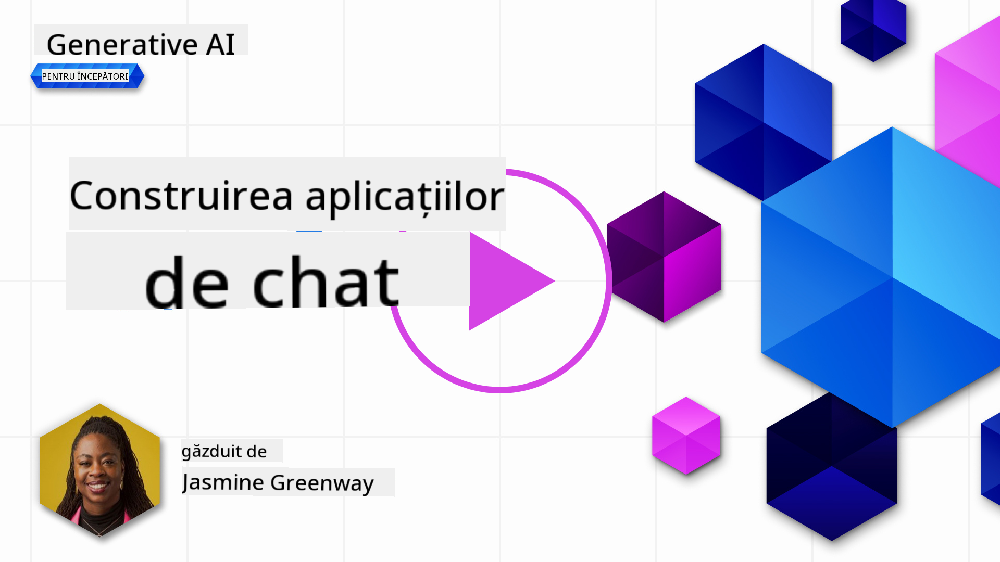
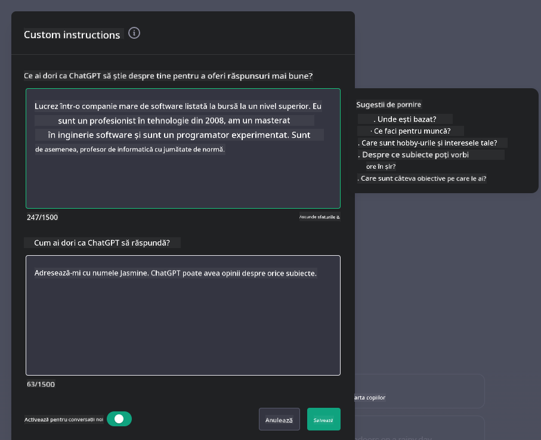

<!--
CO_OP_TRANSLATOR_METADATA:
{
  "original_hash": "ea4bbe640847aafbbba14dae4625e9af",
  "translation_date": "2025-05-19T18:09:49+00:00",
  "source_file": "07-building-chat-applications/README.md",
  "language_code": "ro"
}
-->
# Construirea aplicațiilor de chat bazate pe AI generativ

[](https://aka.ms/gen-ai-lessons7-gh?WT.mc_id=academic-105485-koreyst)

> _(Click pe imaginea de mai sus pentru a viziona videoclipul acestei lecții)_

Acum că am văzut cum putem construi aplicații de generare de text, să ne uităm la aplicațiile de chat.

Aplicațiile de chat au devenit parte integrantă a vieții noastre de zi cu zi, oferind mai mult decât doar un mijloc de conversație ocazională. Sunt părți esențiale ale serviciului clienți, suportului tehnic și chiar ale sistemelor de consultanță sofisticate. Este probabil ca ai primit ajutor de la o aplicație de chat nu cu mult timp în urmă. Pe măsură ce integrăm tehnologii mai avansate, cum ar fi AI generativ, în aceste platforme, complexitatea crește și la fel și provocările.

Unele întrebări la care trebuie să răspundem sunt:

- **Construirea aplicației**. Cum construim eficient și integrăm fără probleme aceste aplicații bazate pe AI pentru utilizări specifice?
- **Monitorizarea**. Odată implementate, cum putem monitoriza și asigura că aplicațiile funcționează la cel mai înalt nivel de calitate, atât în termeni de funcționalitate, cât și respectând [cele șase principii ale AI responsabil](https://www.microsoft.com/ai/responsible-ai?WT.mc_id=academic-105485-koreyst)?

Pe măsură ce avansăm într-o eră definită de automatizare și interacțiuni om-mașină fără întreruperi, înțelegerea modului în care AI generativ transformă sfera, profunzimea și adaptabilitatea aplicațiilor de chat devine esențială. Această lecție va investiga aspectele arhitecturii care susțin aceste sisteme complexe, va aprofunda metodologiile pentru ajustarea fină a acestora pentru sarcini specifice domeniului și va evalua metricile și considerațiile relevante pentru asigurarea implementării responsabile a AI.

## Introducere

Această lecție acoperă:

- Tehnici pentru construirea și integrarea eficientă a aplicațiilor de chat.
- Cum să aplici personalizarea și ajustarea fină a aplicațiilor.
- Strategii și considerații pentru monitorizarea eficientă a aplicațiilor de chat.

## Obiective de învățare

Până la sfârșitul acestei lecții, vei putea:

- Descrie considerațiile pentru construirea și integrarea aplicațiilor de chat în sistemele existente.
- Personaliza aplicațiile de chat pentru utilizări specifice.
- Identifica metricile cheie și considerațiile pentru monitorizarea eficientă și menținerea calității aplicațiilor de chat bazate pe AI.
- Asigura că aplicațiile de chat folosesc AI în mod responsabil.

## Integrarea AI generativ în aplicațiile de chat

Îmbunătățirea aplicațiilor de chat prin AI generativ nu se concentrează doar pe a le face mai inteligente; este vorba despre optimizarea arhitecturii, performanței și interfeței cu utilizatorul pentru a oferi o experiență de calitate. Acest lucru implică investigarea fundațiilor arhitecturale, integrațiilor API și considerațiilor de interfață cu utilizatorul. Această secțiune își propune să îți ofere o hartă completă pentru navigarea acestor peisaje complexe, fie că le integrezi în sistemele existente sau le construiești ca platforme independente.

Până la sfârșitul acestei secțiuni, vei fi echipat cu expertiza necesară pentru a construi și integra eficient aplicații de chat.

### Chatbot sau aplicație de chat?

Înainte de a ne aprofunda în construirea aplicațiilor de chat, să comparăm 'chatboturile' cu 'aplicațiile de chat bazate pe AI,' care servesc roluri și funcționalități distincte. Scopul principal al unui chatbot este de a automatiza sarcini conversaționale specifice, cum ar fi răspunsul la întrebări frecvente sau urmărirea unui pachet. Este de obicei guvernat de logică bazată pe reguli sau algoritmi AI complexi. În contrast, o aplicație de chat bazată pe AI este un mediu mult mai extins, conceput pentru a facilita diverse forme de comunicare digitală, cum ar fi chatul text, vocal și video între utilizatorii umani. Caracteristica sa definitorie este integrarea unui model AI generativ care simulează conversații nuanțate, asemănătoare celor umane, generând răspunsuri bazate pe o varietate largă de intrări și indicii contextuale. O aplicație de chat bazată pe AI generativ poate angaja discuții în domeniu deschis, se poate adapta la contexte conversaționale în evoluție și chiar produce dialoguri creative sau complexe.

Tabelul de mai jos prezintă diferențele și asemănările cheie pentru a ne ajuta să înțelegem rolurile lor unice în comunicarea digitală.

| Chatbot                               | Aplicație de chat bazată pe AI generativ |
| ------------------------------------- | ---------------------------------------- |
| Focusat pe sarcini și bazat pe reguli | Conștient de context                     |
| Adesea integrat în sisteme mai mari   | Poate găzdui unul sau mai multe chatboturi|
| Limitat la funcții programate         | Încorporează modele AI generative        |
| Interacțiuni specializate și structurate | Capabil de discuții în domeniu deschis  |

### Valorificarea funcționalităților pre-construite cu SDK-uri și API-uri

Când construiești o aplicație de chat, un prim pas excelent este să evaluezi ce există deja. Folosirea SDK-urilor și API-urilor pentru a construi aplicații de chat este o strategie avantajoasă din mai multe motive. Prin integrarea SDK-urilor și API-urilor bine documentate, îți poziționezi strategic aplicația pentru succes pe termen lung, abordând preocupările legate de scalabilitate și întreținere.

- **Accelerează procesul de dezvoltare și reduce cheltuielile**: Bazându-te pe funcționalități pre-construite în loc de procesul costisitor de a le construi singur îți permite să te concentrezi pe alte aspecte ale aplicației pe care le consideri mai importante, cum ar fi logica de afaceri.
- **Performanță mai bună**: Când construiești funcționalitatea de la zero, în cele din urmă te vei întreba "Cum se scalează? Este această aplicație capabilă să gestioneze o creștere bruscă a utilizatorilor?" SDK-urile și API-urile bine întreținute au adesea soluții integrate pentru aceste preocupări.
- **Întreținere mai ușoară**: Actualizările și îmbunătățirile sunt mai ușor de gestionat deoarece majoritatea API-urilor și SDK-urilor necesită doar o actualizare a unei biblioteci atunci când este lansată o versiune nouă.
- **Acces la tehnologie de vârf**: Valorificarea modelelor care au fost ajustate fin și antrenate pe seturi de date extinse oferă aplicației tale capacități de limbaj natural.

Accesarea funcționalității unui SDK sau API implică de obicei obținerea permisiunii de a utiliza serviciile furnizate, ceea ce se face adesea prin utilizarea unei chei unice sau a unui token de autentificare. Vom folosi Biblioteca Python OpenAI pentru a explora cum arată acest lucru. Poți să încerci și tu în [notebook-ul pentru OpenAI](../../../07-building-chat-applications/python/oai-assignment.ipynb) sau [notebook-ul pentru Azure OpenAI Services](../../../07-building-chat-applications/python/aoai-assignment.ipynb) pentru această lecție.

```python
import os
from openai import OpenAI

API_KEY = os.getenv("OPENAI_API_KEY","")

client = OpenAI(
    api_key=API_KEY
    )

chat_completion = client.chat.completions.create(model="gpt-3.5-turbo", messages=[{"role": "user", "content": "Suggest two titles for an instructional lesson on chat applications for generative AI."}])
```

Exemplul de mai sus folosește modelul GPT-3.5 Turbo pentru a completa promptul, dar observă că cheia API este setată înainte de a face acest lucru. Ai primi o eroare dacă nu ai seta cheia.

## Experiența Utilizatorului (UX)

Principiile generale UX se aplică aplicațiilor de chat, dar iată câteva considerații suplimentare care devin deosebit de importante datorită componentelor de învățare automată implicate.

- **Mecanism pentru abordarea ambiguității**: Modelele AI generative generează ocazional răspunsuri ambigue. O caracteristică care permite utilizatorilor să ceară clarificări poate fi utilă dacă întâmpină această problemă.
- **Retenția contextului**: Modelele AI generative avansate au capacitatea de a reține contextul într-o conversație, ceea ce poate fi un atu necesar pentru experiența utilizatorului. Oferirea utilizatorilor posibilitatea de a controla și gestiona contextul îmbunătățește experiența utilizatorului, dar introduce riscul de a reține informații sensibile ale utilizatorului. Considerațiile cu privire la cât timp sunt stocate aceste informații, cum ar fi introducerea unei politici de retenție, pot echilibra necesitatea contextului împotriva confidențialității.
- **Personalizare**: Cu capacitatea de a învăța și de a se adapta, modelele AI oferă o experiență individualizată pentru un utilizator. Personalizarea experienței utilizatorului prin funcții precum profilurile de utilizator nu doar că face utilizatorul să se simtă înțeles, dar îi ajută și în căutarea de răspunsuri specifice, creând o interacțiune mai eficientă și satisfăcătoare.

Un exemplu de personalizare este setarea "Instrucțiuni personalizate" în ChatGPT de la OpenAI. Îți permite să oferi informații despre tine care pot fi context important pentru prompturile tale. Iată un exemplu de instrucțiune personalizată.



Acest "profil" determină ChatGPT să creeze un plan de lecție despre listele înlănțuite. Observă că ChatGPT ia în considerare că utilizatorul poate dori un plan de lecție mai detaliat pe baza experienței sale.


### Cadrul de Mesaje de Sistem al Microsoft pentru Modele de Limbaj Mare

[Microsoft a oferit îndrumări](https://learn.microsoft.com/azure/ai-services/openai/concepts/system-message#define-the-models-output-format?WT.mc_id=academic-105485-koreyst) pentru scrierea mesajelor de sistem eficiente atunci când se generează răspunsuri din LLM-uri, împărțite în 4 domenii:

1. Definirea pentru cine este modelul, precum și capacitățile și limitările sale.
2. Definirea formatului de ieșire al modelului.
3. Oferirea de exemple specifice care demonstrează comportamentul dorit al modelului.
4. Oferirea de măsuri suplimentare de siguranță comportamentală.

### Accesibilitate

Indiferent dacă un utilizator are deficiențe vizuale, auditive, motorii sau cognitive, o aplicație de chat bine concepută ar trebui să fie utilizabilă de către toți. Lista următoare descompune caracteristici specifice destinate îmbunătățirii accesibilității pentru diverse deficiențe ale utilizatorului.

- **Caracteristici pentru deficiențe vizuale**: Tematici cu contrast ridicat și text redimensionabil, compatibilitate cu cititorul de ecran.
- **Caracteristici pentru deficiențe auditive**: Funcții de text-la-vorbire și vorbire-la-text, indicii vizuale pentru notificările audio.
- **Caracteristici pentru deficiențe motorii**: Suport pentru navigarea cu tastatura, comenzi vocale.
- **Caracteristici pentru deficiențe cognitive**: Opțiuni de limbaj simplificat.

## Personalizare și Ajustare Fină pentru Modele de Limbaj Specific Domeniului

Imaginează-ți o aplicație de chat care înțelege jargonul companiei tale și anticipează întrebările specifice pe care baza sa de utilizatori le are frecvent. Există câteva abordări care merită menționate:

- **Valorificarea modelelor DSL**. DSL înseamnă limbaj specific domeniului. Poți valorifica un așa numit model DSL antrenat pe un domeniu specific pentru a înțelege conceptele și scenariile sale.
- **Aplicarea ajustării fine**. Ajustarea fină este procesul de antrenare suplimentară a modelului tău cu date specifice.

## Personalizare: Folosirea unui DSL

Valorificarea modelelor de limbaj specific domeniului (DSL Models) poate îmbunătăți implicarea utilizatorilor prin oferirea de interacțiuni specializate, relevante contextual. Este un model care este antrenat sau ajustat fin pentru a înțelege și genera text legat de un anumit domeniu, industrie sau subiect. Opțiunile pentru utilizarea unui model DSL pot varia de la antrenarea unuia de la zero, la utilizarea celor pre-existente prin SDK-uri și API-uri. O altă opțiune este ajustarea fină, care implică luarea unui model pre-antrenat existent și adaptarea acestuia pentru un domeniu specific.

## Personalizare: Aplicarea ajustării fine

Ajustarea fină este adesea considerată atunci când un model pre-antrenat nu este suficient într-un domeniu specializat sau o sarcină specifică.

De exemplu, întrebările medicale sunt complexe și necesită mult context. Când un profesionist medical diagnostichează un pacient, se bazează pe o varietate de factori, cum ar fi stilul de viață sau condițiile preexistente, și poate chiar să se bazeze pe reviste medicale recente pentru a valida diagnosticul. În astfel de scenarii nuanțate, o aplicație de chat AI generală nu poate fi o sursă de încredere.

### Scenariu: o aplicație medicală

Consideră o aplicație de chat concepută pentru a asista practicienii medicali oferind referințe rapide la ghiduri de tratament, interacțiuni medicamentoase sau descoperiri recente de cercetare.

Un model general ar putea fi adecvat pentru a răspunde la întrebări medicale de bază sau pentru a oferi sfaturi generale, dar ar putea avea dificultăți cu următoarele:

- **Cazuri foarte specifice sau complexe**. De exemplu, un neurolog ar putea întreba aplicația, "Care sunt cele mai bune practici actuale pentru gestionarea epilepsiei rezistente la medicamente la pacienții pediatrici?"
- **Lipsa avansărilor recente**. Un model general ar putea avea dificultăți în a oferi un răspuns actualizat care să încorporeze cele mai recente avansări în neurologie și farmacologie.

În astfel de cazuri, ajustarea fină a modelului cu un set de date medical specializat poate îmbunătăți semnificativ capacitatea sa de a gestiona aceste întrebări medicale complexe mai precis și fiabil. Acest lucru necesită acces la un set de date mare și relevant care să reprezinte provocările și întrebările specifice domeniului care trebuie abordate.

## Considerații pentru o Experiență de Chat de Înaltă Calitate, Condusă de AI

Această secțiune prezintă criteriile pentru aplicațiile de chat "de înaltă calitate," care includ capturarea de metrici acționabile și aderarea la un cadru care valorifică responsabil tehnologia AI.

### Metrici Cheie

Pentru a menține performanța de înaltă calitate a unei aplicații, este esențial să urmărești metrici cheie și considerații. Aceste măsurători nu doar că asigură funcționalitatea aplicației, dar evaluează și calitatea modelului AI și experiența utilizatorului. Mai jos este o listă care acoperă metrici de bază, AI și experiență utilizator pentru a fi luate în considerare.

| Metrică                        | Definiție                                                                                                             | Considerații pentru Dezvoltatorul de Chat                                        |
| ------------------------------ | ---------------------------------------------------------------------------------------------------------------------- | -------------------------------------------------------------------------------- |
| **Timp de funcționare**        | Măsoară timpul în care aplicația este operațională și accesibilă utilizatorilor.                                      | Cum vei minimiza timpul de nefuncționare?                                        |
| **Timp de răspuns**            | Timpul necesar aplicației pentru a răspunde la o interogare a utilizatorului.                                          | Cum poți optimiza procesarea interogărilor pentru a îmbunătăți timpul de răspuns?|
| **Precizie**                   | Raportul dintre predicțiile pozitive adevărate și numărul total de predicții pozitive                                 | Cum vei valida precizia modelului tău?                                           |
| **Rechemare (Sensibilitate)**  | Raportul dintre predicțiile pozitive adevărate și numărul real de pozitive                                            | Cum vei măsura și îmbunătăți rechemarea?                                         |
| **Scor F1**                    | Media armonică a preciziei și rechemării, care echilibrează compromisurile dintre ambele.                              | Care este scorul F1 țintă? Cum vei echilibra precizia și rechemarea?             |
| **Perplexitate

**Declinare de responsabilitate**:  
Acest document a fost tradus folosind serviciul de traducere AI [Co-op Translator](https://github.com/Azure/co-op-translator). Deși ne străduim să asigurăm acuratețea, vă rugăm să fiți conștienți că traducerile automate pot conține erori sau inexactități. Documentul original în limba sa natală ar trebui considerat sursa autoritară. Pentru informații critice, se recomandă traducerea profesională umană. Nu suntem responsabili pentru neînțelegerile sau interpretările greșite care pot apărea din utilizarea acestei traduceri.