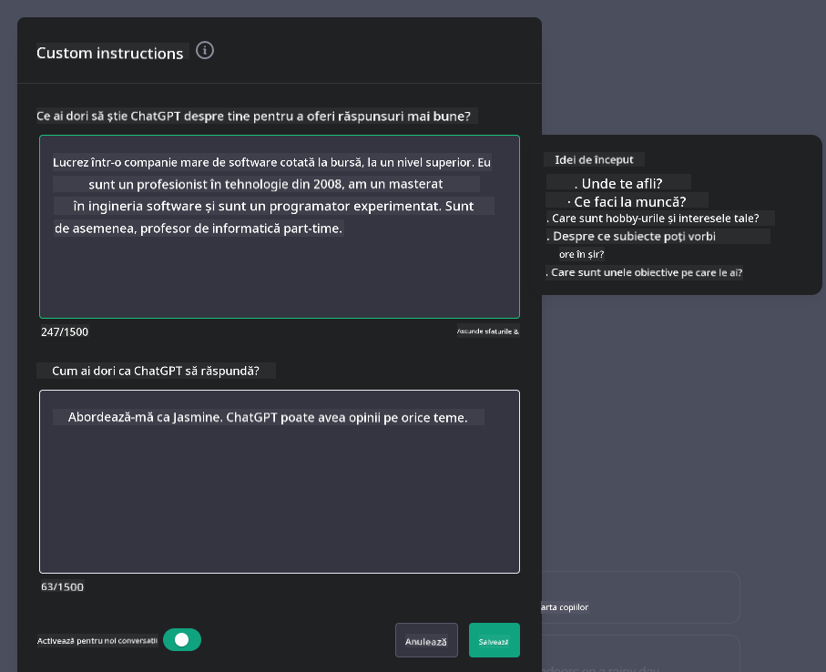
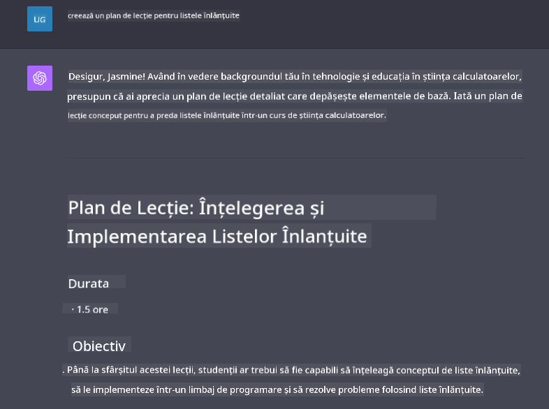

<!--
CO_OP_TRANSLATOR_METADATA:
{
  "original_hash": "ea4bbe640847aafbbba14dae4625e9af",
  "translation_date": "2025-07-09T12:39:45+00:00",
  "source_file": "07-building-chat-applications/README.md",
  "language_code": "ro"
}
-->
# Construirea aplicațiilor de chat alimentate de AI generativ

[](https://aka.ms/gen-ai-lessons7-gh?WT.mc_id=academic-105485-koreyst)

> _(Click pe imaginea de mai sus pentru a viziona videoclipul acestei lecții)_

Acum că am văzut cum putem construi aplicații de generare de text, să ne uităm la aplicațiile de chat.

Aplicațiile de chat au devenit parte integrantă a vieții noastre cotidiene, oferind mai mult decât un simplu mijloc de conversație casuală. Ele sunt componente esențiale în serviciul clienți, suportul tehnic și chiar în sisteme sofisticate de consiliere. Probabil că ai primit ajutor de la o aplicație de chat nu cu mult timp în urmă. Pe măsură ce integrăm tehnologii mai avansate, precum AI generativ, în aceste platforme, complexitatea crește, la fel și provocările.

Câteva întrebări la care trebuie să răspundem sunt:

- **Construirea aplicației**. Cum construim eficient și integrăm fără probleme aceste aplicații alimentate de AI pentru cazuri de utilizare specifice?
- **Monitorizarea**. Odată implementate, cum putem monitoriza și asigura că aplicațiile funcționează la cel mai înalt nivel de calitate, atât din punct de vedere al funcționalității, cât și al respectării [celor șase principii ale AI responsabile](https://www.microsoft.com/ai/responsible-ai?WT.mc_id=academic-105485-koreyst)?

Pe măsură ce pășim într-o eră definită de automatizare și interacțiuni fluide om-mașină, înțelegerea modului în care AI generativ transformă amploarea, profunzimea și adaptabilitatea aplicațiilor de chat devine esențială. Această lecție va investiga aspectele arhitecturale care susțin aceste sisteme complexe, va explora metodologiile de ajustare fină pentru sarcini specifice domeniului și va evalua metricile și considerațiile relevante pentru asigurarea unei implementări responsabile a AI.

## Introducere

Această lecție acoperă:

- Tehnici pentru construirea și integrarea eficientă a aplicațiilor de chat.
- Cum să aplici personalizarea și ajustarea fină a aplicațiilor.
- Strategii și considerații pentru monitorizarea eficientă a aplicațiilor de chat.

## Obiective de învățare

La finalul acestei lecții, vei putea:

- Descrie considerațiile pentru construirea și integrarea aplicațiilor de chat în sistemele existente.
- Personaliza aplicațiile de chat pentru cazuri de utilizare specifice.
- Identifica metricile cheie și considerațiile pentru monitorizarea și menținerea calității aplicațiilor de chat alimentate de AI.
- Asigura utilizarea responsabilă a AI în aplicațiile de chat.

## Integrarea AI generativ în aplicațiile de chat

Îmbunătățirea aplicațiilor de chat prin AI generativ nu se rezumă doar la a le face mai inteligente; este vorba despre optimizarea arhitecturii, performanței și interfeței utilizator pentru a oferi o experiență de calitate. Aceasta implică investigarea fundațiilor arhitecturale, integrarea API-urilor și considerațiile legate de interfața utilizatorului. Această secțiune își propune să-ți ofere o hartă completă pentru a naviga aceste peisaje complexe, fie că le conectezi la sisteme existente, fie că le construiești ca platforme independente.

La finalul acestei secțiuni, vei avea expertiza necesară pentru a construi și integra eficient aplicații de chat.

### Chatbot sau aplicație de chat?

Înainte să începem construirea aplicațiilor de chat, să comparăm „chatbot”-urile cu „aplicațiile de chat alimentate de AI”, care au roluri și funcționalități distincte. Scopul principal al unui chatbot este să automatizeze sarcini conversaționale specifice, cum ar fi răspunsul la întrebări frecvente sau urmărirea unui colet. De obicei, este guvernat de logică bazată pe reguli sau algoritmi AI complecși. În schimb, o aplicație de chat alimentată de AI este un mediu mult mai amplu, conceput pentru a facilita diverse forme de comunicare digitală, cum ar fi chat-uri text, vocale și video între utilizatori umani. Caracteristica sa definitorie este integrarea unui model AI generativ care simulează conversații nuanțate, asemănătoare celor umane, generând răspunsuri bazate pe o varietate largă de intrări și indicii contextuale. O aplicație de chat alimentată de AI generativ poate purta discuții deschise, se poate adapta la contexte conversaționale în evoluție și poate chiar produce dialoguri creative sau complexe.

Tabelul de mai jos evidențiază diferențele și asemănările cheie pentru a înțelege rolurile lor unice în comunicarea digitală.

| Chatbot                               | Aplicație de chat alimentată de AI generativ |
| ------------------------------------- | -------------------------------------------- |
| Orientat pe sarcini și bazat pe reguli | Conștient de context                         |
| Adesea integrat în sisteme mai mari    | Poate găzdui unul sau mai mulți chatbots     |
| Limitat la funcții programate          | Încorporează modele AI generative             |
| Interacțiuni specializate și structurate | Capabil de discuții deschise pe diverse domenii |

### Folosirea funcționalităților predefinite cu SDK-uri și API-uri

Când construiești o aplicație de chat, un prim pas excelent este să evaluezi ce există deja. Utilizarea SDK-urilor și API-urilor pentru a construi aplicații de chat este o strategie avantajoasă din mai multe motive. Prin integrarea SDK-urilor și API-urilor bine documentate, poziționezi strategic aplicația pentru succes pe termen lung, abordând problemele de scalabilitate și mentenanță.

- **Accelerează procesul de dezvoltare și reduce efortul**: Folosind funcționalități predefinite în loc să le construiești de la zero, te poți concentra pe alte aspecte ale aplicației care ți se par mai importante, cum ar fi logica de business.
- **Performanță mai bună**: Construind funcționalități de la zero, te vei întreba în cele din urmă „Cum se scalează? Este această aplicație capabilă să gestioneze un aflux brusc de utilizatori?” SDK-urile și API-urile bine întreținute au adesea soluții integrate pentru aceste probleme.
- **Mentenanță mai ușoară**: Actualizările și îmbunătățirile sunt mai ușor de gestionat, deoarece majoritatea API-urilor și SDK-urilor necesită doar actualizarea unei biblioteci când apare o versiune nouă.
- **Acces la tehnologie de ultimă oră**: Folosirea modelelor care au fost ajustate fin și antrenate pe seturi extinse de date oferă aplicației tale capabilități avansate de procesare a limbajului natural.

Accesarea funcționalității unui SDK sau API implică de obicei obținerea permisiunii de a folosi serviciile oferite, adesea prin utilizarea unei chei unice sau a unui token de autentificare. Vom folosi OpenAI Python Library pentru a explora cum arată acest proces. Poți încerca și tu în [notebook-ul pentru OpenAI](python/oai-assignment.ipynb) sau în [notebook-ul pentru Azure OpenAI Services](python/aoai-assignment.ipynb) pentru această lecție.

```python
import os
from openai import OpenAI

API_KEY = os.getenv("OPENAI_API_KEY","")

client = OpenAI(
    api_key=API_KEY
    )

chat_completion = client.chat.completions.create(model="gpt-3.5-turbo", messages=[{"role": "user", "content": "Suggest two titles for an instructional lesson on chat applications for generative AI."}])
```

Exemplul de mai sus folosește modelul GPT-3.5 Turbo pentru a completa promptul, dar observă că cheia API este setată înainte de aceasta. Vei primi o eroare dacă nu setezi cheia.

## Experiența utilizatorului (UX)

Principiile generale de UX se aplică și aplicațiilor de chat, dar iată câteva considerații suplimentare care devin deosebit de importante din cauza componentelor de machine learning implicate.

- **Mecanism pentru gestionarea ambiguității**: Modelele AI generative pot genera uneori răspunsuri ambigue. O funcție care permite utilizatorilor să ceară clarificări poate fi utilă în astfel de situații.
- **Păstrarea contextului**: Modelele avansate AI generative au capacitatea de a reține contextul în cadrul unei conversații, ceea ce poate fi un avantaj necesar pentru experiența utilizatorului. Oferirea utilizatorilor posibilitatea de a controla și gestiona contextul îmbunătățește experiența, dar introduce riscul păstrării informațiilor sensibile. Considerații privind durata stocării acestor informații, cum ar fi introducerea unei politici de retenție, pot echilibra nevoia de context cu protecția vieții private.
- **Personalizare**: Cu abilitatea de a învăța și adapta, modelele AI oferă o experiență individualizată utilizatorului. Personalizarea experienței prin funcții precum profilurile utilizatorilor nu doar că face utilizatorul să se simtă înțeles, dar îl ajută și să găsească răspunsuri specifice, creând o interacțiune mai eficientă și satisfăcătoare.

Un exemplu de personalizare este setarea „Custom instructions” din ChatGPT de la OpenAI. Aceasta îți permite să oferi informații despre tine care pot fi un context important pentru prompturile tale. Iată un exemplu de instrucțiune personalizată.



Acest „profil” îl determină pe ChatGPT să creeze un plan de lecție despre liste înlănțuite. Observă că ChatGPT ia în considerare faptul că utilizatorul dorește un plan de lecție mai detaliat, bazat pe experiența sa.



### Framework-ul Microsoft pentru mesaje de sistem în modelele de limbaj mari

[Microsoft a oferit îndrumări](https://learn.microsoft.com/azure/ai-services/openai/concepts/system-message#define-the-models-output-format?WT.mc_id=academic-105485-koreyst) pentru scrierea mesajelor de sistem eficiente când se generează răspunsuri din LLM-uri, împărțite în 4 domenii:

1. Definirea cui se adresează modelul, precum și a capacităților și limitărilor sale.
2. Definirea formatului de ieșire al modelului.
3. Furnizarea de exemple specifice care demonstrează comportamentul dorit al modelului.
4. Oferirea de reguli suplimentare de comportament.

### Accesibilitate

Indiferent dacă un utilizator are deficiențe vizuale, auditive, motorii sau cognitive, o aplicație de chat bine proiectată ar trebui să fie utilizabilă de toți. Lista de mai jos detaliază funcții specifice menite să îmbunătățească accesibilitatea pentru diverse tipuri de deficiențe.

- **Funcții pentru deficiențe vizuale**: teme cu contrast ridicat și text redimensionabil, compatibilitate cu cititoarele de ecran.
- **Funcții pentru deficiențe auditive**: funcții text-în-vorbire și vorbire-în-text, indicatoare vizuale pentru notificările audio.
- **Funcții pentru deficiențe motorii**: suport pentru navigare cu tastatura, comenzi vocale.
- **Funcții pentru deficiențe cognitive**: opțiuni de limbaj simplificat.

## Personalizare și ajustare fină pentru modelele de limbaj specifice domeniului

Imaginează-ți o aplicație de chat care înțelege jargonul companiei tale și anticipează întrebările specifice pe care utilizatorii le au frecvent. Există câteva abordări demne de menționat:

- **Folosirea modelelor DSL**. DSL înseamnă domain specific language (limbaj specific domeniului). Poți folosi un model DSL antrenat pe un domeniu specific pentru a înțelege conceptele și scenariile acestuia.
- **Aplicarea ajustării fine**. Ajustarea fină este procesul de antrenare suplimentară a modelului tău cu date specifice.

## Personalizare: Folosirea unui DSL

Folosirea modelelor de limbaj specifice domeniului (DSL Models) poate crește implicarea utilizatorilor prin oferirea unor interacțiuni specializate și relevante contextual. Este un model antrenat sau ajustat fin pentru a înțelege și genera text legat de un anumit domeniu, industrie sau subiect. Opțiunile pentru utilizarea unui model DSL pot varia de la antrenarea unuia de la zero, până la folosirea celor preexistente prin SDK-uri și API-uri. O altă opțiune este ajustarea fină, care implică luarea unui model pre-antrenat existent și adaptarea lui pentru un domeniu specific.

## Personalizare: Aplicarea ajustării fine

Ajustarea fină este adesea luată în considerare când un model pre-antrenat nu este suficient pentru un domeniu specializat sau o sarcină specifică.

De exemplu, întrebările medicale sunt complexe și necesită mult context. Când un profesionist medical pune un diagnostic, se bazează pe o varietate de factori, cum ar fi stilul de viață sau condițiile preexistente, și poate chiar consultă jurnale medicale recente pentru a valida diagnosticul. În astfel de scenarii nuanțate, o aplicație AI generală de chat nu poate fi o sursă de încredere.

### Scenariu: o aplicație medicală

Gândește-te la o aplicație de chat concepută să asiste profesioniștii medicali oferind referințe rapide la ghiduri de tratament, interacțiuni medicamentoase sau descoperiri recente din cercetare.

Un model generalist ar putea fi adecvat pentru a răspunde la întrebări medicale de bază sau pentru a oferi sfaturi generale, dar s-ar putea confrunta cu dificultăți în următoarele cazuri:

- **Cazuri foarte specifice sau complexe**. De exemplu, un neurolog ar putea întreba aplicația: „Care sunt cele mai bune practici actuale pentru gestionarea epilepsiei rezistente la medicamente la pacienții pediatrici?”
- **Lipsa celor mai recente progrese**. Un model generalist ar putea avea dificultăți să ofere un răspuns actualizat care să includă cele mai recente progrese în neurologie și farmacologie.

În astfel de situații, ajustarea fină a modelului cu un set de date medical specializat poate îmbunătăți semnificativ capacitatea acestuia de a gestiona aceste întrebări medicale complexe cu mai multă acuratețe și fiabilitate. Aceasta necesită acces la un set de date mare și relevant care să reprezinte provocările și întrebările specifice domeniului.

## Considerații pentru o experiență de chat AI de înaltă calitate

Această secțiune descrie criteriile pentru aplicațiile de chat „de înaltă calitate”, care includ capturarea metricilor acționabile și respectarea unui cadru care folosește responsabil tehnologia AI.

### Metrici cheie

Pentru a menține performanța de înaltă calitate a unei aplicații, este esențial să monitorizăm metrici și considerații cheie. Aceste măsurători nu doar asigură funcționalitatea aplicației, ci și evaluează calitatea modelului AI și experiența utilizatorului. Mai jos este o listă care acoperă metrici de bază, AI și experiența utilizatorului de luat în considerare.

| Metric                        | Definiție                                                                                                             | Considerații pentru dezvoltatorul de chat                                  |
| ----------------------------- | ---------------------------------------------------------------------------------------------------------------------- | ------------------------------------------------------------------------- |
| **Uptime**                    | Măsoară timpul în care aplicația este operațională și accesibilă utilizatorilor.                                        | Cum vei minimiza perioadele de nefuncționare?                             |
| **Timp de răspuns**           | Timpul necesar aplicației pentru a răspunde la o interogare a utilizatorului.                                           | Cum poți optimiza procesarea interogărilor pentru a îmbunătăți timpul de răspuns? |
| **Precizie**                  | Raportul dintre predicțiile adevărate pozitive și totalul predicțiilor pozitive.                                        | Cum vei valida precizia modelului tău?                                    |
| **Recall (Sensibilitate)**    | Raportul dintre predicțiile adevărate pozitive și numărul real de pozitive.                                             | Cum vei măsura și îmbunătăți recall-ul?                                  |
| **Scor F1**                   | Media armonică a preciziei și recall-ului, care echilibrează compromisurile dintre cele două.                            | Care este scorul F1 țintă? Cum vei echilibra precizia și recall-ul?       |
| **Perplexitate**              | Măsoară cât de bine se aliniază distribuția probabilității prezisă de model cu distribuția reală a datelor.             | Cum vei minimiza perplexitatea?                                           |
| **Metrici de satisfacție a utilizatorului** | Măsoară percepția utilizatorului asupra aplicației. Adesea capturate prin sondaje.                                  | Cât de des vei colecta feedback-ul utilizatorilor? Cum te vei adapta în funcție de acesta? |
| **Rata de
| **Detectarea Anomaliilor**   | Instrumente și tehnici pentru identificarea tiparelor neobișnuite care nu respectă comportamentul așteptat.               | Cum vei răspunde la anomalii?                                              |

### Implementarea practicilor de AI responsabil în aplicațiile de chat

Abordarea Microsoft privind AI responsabil a identificat șase principii care ar trebui să ghideze dezvoltarea și utilizarea AI. Mai jos sunt principiile, definiția lor și aspectele pe care un dezvoltator de chat ar trebui să le ia în considerare și de ce este important să le trateze cu seriozitate.

| Principii              | Definiția Microsoft                                  | Considerații pentru dezvoltatorul de chat                              | De ce este important                                                                |
| ---------------------- | --------------------------------------------------- | --------------------------------------------------------------------- | ---------------------------------------------------------------------------------- |
| Fairness               | Sistemele AI ar trebui să trateze toți oamenii corect. | Asigură-te că aplicația de chat nu discriminează pe baza datelor utilizatorului. | Pentru a construi încredere și incluziune în rândul utilizatorilor; evită consecințe legale. |
| Reliability and Safety | Sistemele AI ar trebui să funcționeze fiabil și în siguranță. | Implementează teste și mecanisme de siguranță pentru a minimiza erorile și riscurile. | Asigură satisfacția utilizatorilor și previne potențiale daune.                     |
| Privacy and Security   | Sistemele AI ar trebui să fie sigure și să respecte confidențialitatea. | Aplică criptare puternică și măsuri de protecție a datelor.           | Pentru a proteja datele sensibile ale utilizatorilor și a respecta legile privind confidențialitatea. |
| Inclusiveness          | Sistemele AI ar trebui să ofere putere tuturor și să implice oamenii. | Proiectează UI/UX accesibil și ușor de utilizat pentru audiențe diverse. | Asigură că un număr mai mare de persoane poate folosi eficient aplicația.          |
| Transparency           | Sistemele AI ar trebui să fie ușor de înțeles.      | Oferă documentație clară și explicații pentru răspunsurile AI.        | Utilizatorii au mai multă încredere într-un sistem dacă înțeleg cum sunt luate deciziile. |
| Accountability         | Oamenii ar trebui să fie responsabili pentru sistemele AI. | Stabilește un proces clar pentru auditarea și îmbunătățirea deciziilor AI. | Permite îmbunătățiri continue și măsuri corective în caz de erori.                 |

## Temă

Vezi [assignment](../../../07-building-chat-applications/python) care te va ghida printr-o serie de exerciții, de la rularea primelor tale prompturi de chat, până la clasificarea și rezumarea textului și altele. Observă că temele sunt disponibile în diferite limbaje de programare!

## Bravo! Continuă călătoria

După ce termini această lecție, consultă colecția noastră [Generative AI Learning collection](https://aka.ms/genai-collection?WT.mc_id=academic-105485-koreyst) pentru a-ți continua dezvoltarea cunoștințelor despre Generative AI!

Mergi la Lecția 8 pentru a vedea cum poți începe să [construiești aplicații de căutare](../08-building-search-applications/README.md?WT.mc_id=academic-105485-koreyst)!

**Declinare de responsabilitate**:  
Acest document a fost tradus folosind serviciul de traducere AI [Co-op Translator](https://github.com/Azure/co-op-translator). Deși ne străduim pentru acuratețe, vă rugăm să rețineți că traducerile automate pot conține erori sau inexactități. Documentul original în limba sa nativă trebuie considerat sursa autorizată. Pentru informații critice, se recomandă traducerea profesională realizată de un specialist uman. Nu ne asumăm răspunderea pentru eventualele neînțelegeri sau interpretări greșite rezultate din utilizarea acestei traduceri.