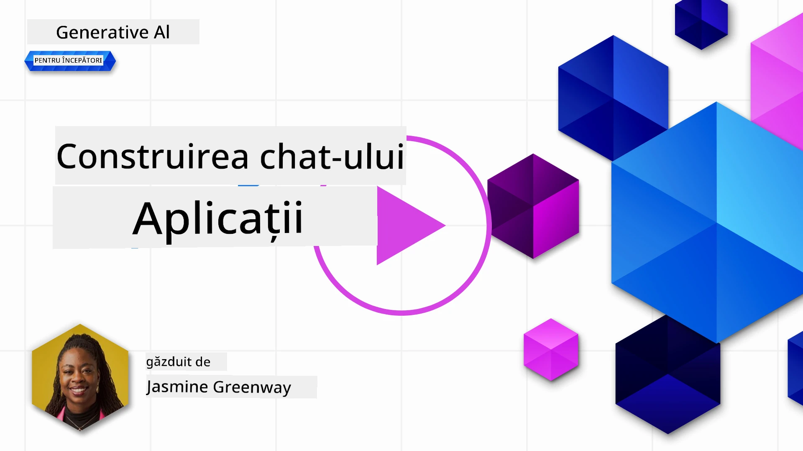
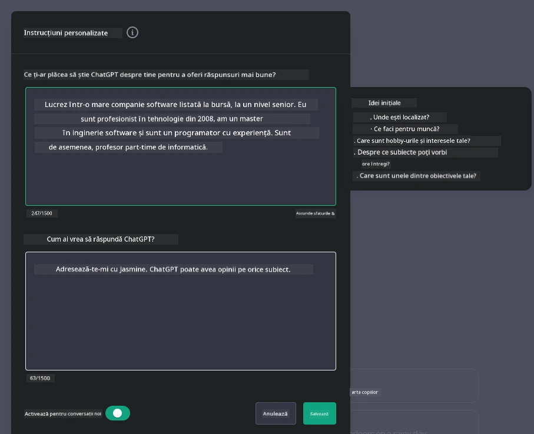
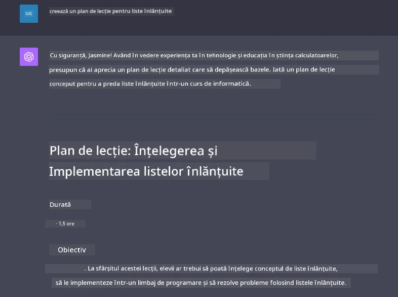

# Construirea Aplicațiilor de Chat Bazate pe Inteligență Artificială Generativă

[](https://youtu.be/R9V0ZY1BEQo?si=IHuU-fS9YWT8s4sA)

> _(Faceți clic pe imaginea de mai sus pentru a viziona videoclipul acestei lecții)_

Acum că am văzut cum putem construi aplicații de generare de text, să aruncăm o privire și asupra aplicațiilor de chat.

Aplicațiile de chat au devenit integrate în viața noastră de zi cu zi, oferind mai mult decât doar o modalitate de conversație casuală. Ele sunt părți integrale ale serviciului pentru clienți, suportului tehnic și chiar ale sistemelor sofisticate de consiliere. Probabil ați primit ajutor de la o aplicație de chat nu de mult timp. Pe măsură ce integrăm tehnologii mai avansate, precum inteligența artificială generativă, în aceste platforme, complexitatea crește la fel și provocările.

Câteva întrebări la care trebuie să răspundem sunt:

- **Construirea aplicației**. Cum putem construi eficient și integra fără probleme aceste aplicații alimentate de AI pentru cazuri de utilizare specifice?
- **Monitorizarea**. Odată implementate, cum putem monitoriza și asigura că aplicațiile funcționează la cel mai înalt nivel de calitate, atât din punct de vedere al funcționalității, cât și al respectării [celor șase principii ale AI responsabile](https://www.microsoft.com/ai/responsible-ai?WT.mc_id=academic-105485-koreyst)?

Pe măsură ce avansăm într-o epocă definită de automatizare și interacțiuni fluente om-mașină, înțelegerea modului în care inteligența artificială generativă transformă domeniul, adâncimea și adaptabilitatea aplicațiilor de chat devine esențială. Această lecție va investiga aspectele arhitecturale care susțin aceste sisteme complexe, va explora metodologiile de ajustare fină pentru sarcini specifice domeniului și va evalua metricile și considerațiile relevante pentru asigurarea unei implementări responsabile a AI.

## Introducere

Această lecție acoperă:

- Tehnici pentru construirea și integrarea eficientă a aplicațiilor de chat.
- Cum să aplici personalizare și ajustare fină aplicațiilor.
- Strategii și considerații pentru a monitoriza eficient aplicațiile de chat.

## Obiectivele de Învățare

La finalul acestei lecții, vei putea:

- Să descrii considerațiile pentru construirea și integrarea aplicațiilor de chat în sisteme existente.
- Să personalizezi aplicațiile de chat pentru cazuri de utilizare specifice.
- Să identifici metrici cheie și considerații pentru a monitoriza eficient și menține calitatea aplicațiilor de chat alimentate de AI.
- Să asiguri utilizarea responsabilă a AI în aplicațiile de chat.

## Integrarea Inteligenței Artificiale Generative în Aplicațiile de Chat

Îmbunătățirea aplicațiilor de chat prin inteligența artificială generativă nu se rezumă doar la a le face mai inteligente; este vorba despre optimizarea arhitecturii, performanței și interfeței utilizatorului pentru a oferi o experiență de calitate. Aceasta implică investigarea bazelor arhitecturale, integrarea API-urilor și considerații legate de interfața utilizatorului. Această secțiune își propune să vă ofere o foaie de parcurs cuprinzătoare pentru a naviga în aceste peisaje complexe, indiferent dacă le conectați la sisteme existente sau le construiți ca platforme independente.

La finalul acestei secțiuni, vei fi echipat cu expertiza necesară pentru a construi și integra eficient aplicații de chat.

### Chatbot sau aplicație de chat?

Înainte de a ne adânci în construirea aplicațiilor de chat, să comparăm „chatboții” cu „aplicațiile de chat alimentate de AI,” care au roluri și funcții distincte. Scopul principal al unui chatbot este să automatizeze sarcini specifice de conversație, cum ar fi răspunsul la întrebări frecvente sau urmărirea unui pachet. Este de obicei guvernat de logică bazată pe reguli sau algoritmi complexi de AI. În contrast, o aplicație de chat alimentată de AI este un mediu mult mai amplu creat pentru a facilita diferite forme de comunicare digitală, cum ar fi chat-uri text, vocale și video între utilizatori umani. Caracteristica sa definitorie este integrarea unui model AI generativ care simulează conversații nuanțate, asemănătoare celor umane, generând răspunsuri bazate pe o gamă diversă de intrări și indicii contextuale. O aplicație de chat alimentată de AI generativ poate angaja discuții pe domenii deschise, se poate adapta la contexte conversaționale în evoluție și poate chiar produce dialog creativ sau complex.

Tabelul de mai jos evidențiază diferențele și asemănările cheie pentru a ne ajuta să înțelegem rolurile lor unice în comunicarea digitală.

| Chatbot                               | Aplicație de chat bazată pe Inteligență Artificială Generativă |
| ------------------------------------- | -------------------------------------- |
| Orientat pe sarcini și bazat pe reguli | Conștient de context                   |
| Adesea integrat în sisteme mai mari     | Poate găzdui unul sau mai mulți chatboți |
| Limitat la funcții programate           | Încorporează modele AI generative      |
| Interacțiuni specializate și structurate | Capabil de discuții pe domenii deschise |

### Folosirea funcționalităților preconstruite cu SDK-uri și API-uri

Când construiești o aplicație de chat, un prim pas excelent este să evaluezi ce este deja disponibil. Utilizarea SDK-urilor și API-urilor pentru a construi aplicații de chat este o strategie avantajoasă din diverse motive. Prin integrarea SDK-urilor și API-urilor bine documentate, poziționezi strategic aplicația ta pentru succes pe termen lung, abordând preocupările legate de scalabilitate și întreținere.

- **Accelerează procesul de dezvoltare și reduce suprasarcina**: Bazarea pe funcționalități preconstruite în locul procesului costisitor de a le construi tu însuți îți permite să te concentrezi pe alte aspecte ale aplicației tale, pe care le poți considera mai importante, precum logica de afaceri.
- **Performanță mai bună**: Când construiești funcționalități de la zero, vei ajunge să te întrebi „Cum se scalează? Este această aplicație capabilă să gestioneze un aflux brusc de utilizatori?” SDK-urile și API-urile bine întreținute includ adesea soluții integrate pentru aceste preocupări.
- **Întreținere mai ușoară**: Actualizările și îmbunătățirile sunt mai ușor de gestionat deoarece majoritatea API-urilor și SDK-urilor necesită doar actualizarea unei biblioteci când se lansează o versiune nouă.
- **Acces la tehnologie de ultimă oră**: Folosirea modelelor care au fost ajustate fin și antrenate pe seturi de date extinse oferă aplicației tale capabilități de procesare a limbajului natural.

Accesarea funcționalității unui SDK sau API implică de obicei obținerea permisiunii de a utiliza serviciile oferite, ceea ce se face adesea prin utilizarea unei chei unice sau a unui token de autentificare. Vom folosi Biblioteca Python OpenAI pentru a explora cum arată acest lucru. Poți încerca și tu în propriul tău [notebook pentru OpenAI](./python/oai-assignment.ipynb?WT.mc_id=academic-105485-koreyst) sau în [notebook-ul pentru Azure OpenAI Services](./python/aoai-assignment.ipynb?WT.mc_id=academic-105485-koreys) pentru această lecție.

```python
import os
from openai import OpenAI

API_KEY = os.getenv("OPENAI_API_KEY","")

client = OpenAI(
    api_key=API_KEY
    )

response = client.responses.create(model="gpt-4o-mini", input="Suggest two titles for an instructional lesson on chat applications for generative AI.", store=False)
print(response.output_text)
```

Exemplul de mai sus folosește modelul GPT-4o mini cu API-ul Responses pentru a completa promptul, dar observă că cheia API este setată înainte de aceasta. Ai primi o eroare dacă nu setezi cheia.

## Experiența Utilizatorului (UX)

Principiile generale de UX se aplică aplicațiilor de chat, dar iată câteva considerații suplimentare care devin deosebit de importante datorită componentelor de învățare automată implicate.

- **Mecanism pentru gestionarea ambiguității**: Modelele AI generative generează uneori răspunsuri ambigue. O caracteristică care permite utilizatorilor să ceară clarificări poate fi folositoare dacă întâlnesc această problemă.
- **Păstrarea contextului**: Modelele avansate AI generative au abilitatea de a reține contextul într-o conversație, ceea ce poate fi un avantaj necesar pentru experiența utilizatorului. Oferirea utilizatorilor posibilitatea de a controla și gestiona contextul îmbunătățește experiența, dar introduce riscul păstrării informațiilor sensibile. Considerațiile legate de durata de stocare a acestor informații, cum ar fi introducerea unei politici de retenție, pot echilibra necesitatea contextului cu confidențialitatea.
- **Personalizare**: Prin capacitatea de a învăța și adapta, modelele AI oferă o experiență individualizată pentru utilizator. Personalizarea experienței utilizatorului prin caracteristici precum profilurile utilizatorului nu doar că îl face pe utilizator să se simtă înțeles, dar ajută și în găsirea mai eficientă și satisfăcătoare a răspunsurilor specifice.

Un astfel de exemplu de personalizare este setarea „Instrucțiuni personalizate” din ChatGPT de la OpenAI. Aceasta îți permite să oferi informații despre tine care pot fi context important pentru prompturile tale. Iată un exemplu de instrucțiune personalizată.



Acest „profil” îi solicită ChatGPT să creeze un plan de lecție despre liste înlănțuite. Observă că ChatGPT ia în considerare faptul că utilizatorul dorește un plan de lecție mai detaliat, bazat pe experiența sa.



### Cadrul Microsoft pentru Mesajele de Sistem în Modelele Mari de Limbaj

[Microsoft a oferit îndrumări](https://learn.microsoft.com/azure/ai-services/openai/concepts/system-message#define-the-models-output-format?WT.mc_id=academic-105485-koreyst) pentru scrierea unor mesaje de sistem eficiente când se generează răspunsuri din LLM-uri, împărțite în 4 zone:

1. Definirea cui se adresează modelul, precum și a capacităților și limitărilor sale.
2. Definirea formatului de ieșire al modelului.
3. Furnizarea de exemple specifice care demonstrează comportamentul intenționat al modelului.
4. Furnizarea unor garduri suplimentare comportamentale.

### Accesibilitate

Indiferent dacă un utilizator are deficiențe vizuale, auditive, motorii sau cognitive, o aplicație de chat bine proiectată ar trebui să fie utilizabilă de toți. Lista următoare detaliază caracteristici specifice care vizează îmbunătățirea accesibilității pentru diverse deficiențe ale utilizatorilor.

- **Caracteristici pentru deficiențe vizuale**: Tematici cu contrast ridicat și text redimensionabil, compatibilitate cu cititoarele de ecran.
- **Caracteristici pentru deficiențe auditive**: Funcții text-la-voce și voce-la-text, indicații vizuale pentru notificări audio.
- **Caracteristici pentru deficiențe motorii**: Suport pentru navigare prin tastatură, comenzi vocale.
- **Caracteristici pentru deficiențe cognitive**: Opțiuni de limbaj simplificat.

## Personalizare și Ajustare Fină pentru Modele de Limbaj Specifice Domeniului

Imaginează-ți o aplicație de chat care înțelege jargonul companiei tale și anticipează întrebările specifice pe care le are în mod obișnuit baza sa de utilizatori. Există câteva abordări demne de menționat:

- **Utilizarea modelelor DSL**. DSL înseamnă domain specific language (limbaj specific domeniului). Poți folosi un model DSL antrenat pe un domeniu specific pentru a înțelege conceptele și scenariile acestuia.
- **Aplicarea ajustării fine**. Ajustarea fină este procesul de antrenare suplimentară a modelului tău cu date specifice.

## Personalizare: Folosirea unui DSL

Utilizarea modelelor de limbaj specifice domeniului (modele DSL) poate spori implicarea utilizatorului prin oferirea unor interacțiuni specializate și relevante contextual. Este un model care este antrenat sau ajustat fin pentru a înțelege și genera text legat de un domeniu, industrie sau subiect specific. Opțiunile pentru utilizarea unui model DSL pot varia de la antrenarea unuia de la zero până la folosirea celor preexistente prin SDK-uri și API-uri. O altă opțiune este ajustarea fină, care implică preluarea unui model pre-antrenat existent și adaptarea lui pentru un domeniu specific.

## Personalizare: Aplicarea ajustării fine

Ajustarea fină este adesea luată în considerare atunci când un model pre-antrenat nu este suficient pentru un domeniu specializat sau o sarcină specifică.

De exemplu, întrebările medicale sunt complexe și necesită mult context. Când un medic diagnostică un pacient, se bazează pe o varietate de factori cum ar fi stilul de viață sau condițiile preexistente și se poate baza chiar pe jurnale medicale recente pentru a valida diagnosticul. În astfel de scenarii nuanțate, o aplicație AI generală de chat nu poate fi o sursă fiabilă.

### Scenariu: o aplicație medicală

Ia în considerare o aplicație de chat concepută să asiste practicienii medicali prin furnizarea rapidă de referințe la ghiduri de tratament, interacțiuni medicamentoase sau descoperiri recente din cercetare.

Un model general poate fi adecvat pentru a răspunde la întrebări medicale de bază sau pentru a oferi sfaturi generale, dar poate avea dificultăți în:

- **Cazuri foarte specifice sau complexe**. De exemplu, un neurolog poate întreba aplicația: „Care sunt cele mai bune practici curente pentru gestionarea epilepsiei rezistente la medicamente la pacienții pediatrici?”
- **Lipsa avansărilor recente**. Un model general poate avea dificultăți să ofere un răspuns actual care să includă cele mai recente progrese în neurologie și farmacologie.

În astfel de situații, ajustarea fină a modelului cu un set de date medical specializat poate îmbunătăți semnificativ capacitatea sa de a gestiona aceste întrebări medicale complexe mai precis și mai fiabil. Acest lucru necesită acces la un set de date mare și relevant care să reprezinte provocările și întrebările specifice domeniului care trebuie adresate.

## Considerații pentru o Experiență de Chat AI de Înaltă Calitate

Această secțiune conturează criteriile pentru aplicații de chat „de înaltă calitate”, care includ capturarea metricilor acționabile și respectarea unui cadru care utilizează responsabil tehnologia AI.

### Metrici Cheie

Pentru a menține performanța de înaltă calitate a unei aplicații, este esențial să urmărești metrici și considerații cheie. Aceste măsurători nu doar asigură funcționalitatea aplicației, ci și evaluează calitatea modelului AI și experiența utilizatorului. Mai jos este o listă care acoperă metrici de bază, AI și experiența utilizatorului de luat în considerare.

| Metrică                     | Definiție                                                                                                              | Considerații pentru Dezvoltatorul de Chat                              |
| ---------------------------- | -------------------------------------------------------------------------------------------------------------------- | --------------------------------------------------------------------- |
| **Timp de funcționare (Uptime)** | Măsoară timpul în care aplicația este operațională și accesibilă utilizatorilor.                                      | Cum vei reduce timpul de nefuncționare?                                |
| **Timp de răspuns**           | Timpul de care are nevoie aplicația să răspundă la o interogare a utilizatorului.                                     | Cum poți optimiza procesarea interogărilor pentru a îmbunătăți timpul de răspuns? |
| **Precizie**                  | Raportul dintre predicțiile corecte pozitive și numărul total de predicții pozitive.                                  | Cum vei valida precizia modelului tău?                                |
| **Recall (Sensibilitate)**    | Raportul dintre predicțiile corecte pozitive și numărul real al pozitivelor.                                          | Cum vei măsura și îmbunătăți recall-ul?                              |
| **Scor F1**                  | Media armonică între precizie și recall, care echilibrează compromisurile dintre ambele.                               | Care este scorul țintă F1? Cum vei echilibra precizia și recall-ul?   |
| **Perplexitate**              | Măsoară cât de bine se aliniază distribuția probabilistică prezisă de model cu distribuția reală a datelor.           | Cum vei minimiza perplexitatea?                                      |
| **Metrice de satisfacție a utilizatorului** | Măsoară percepția utilizatorului asupra aplicației. Adesea capturate prin sondaje.                                    | Cât de des vei colecta feedback de la utilizatori? Cum te vei adapta pe baza lui? |
| **Rată de eroare**            | Rata cu care modelul face greșeli în înțelegere sau în rezultat.                                                     | Ce strategii ai pentru a reduce ratele de eroare?                     |
| **Cycle de reantrenare**      | Frecvența cu care modelul este actualizat pentru a încorpora date și perspective noi.                                | Cât de des vei reantrena modelul? Ce declanșează un ciclu de reantrenare? |

| **Detectarea Anomaliilor**  | Instrumente și tehnici pentru identificarea tiparelor neobișnuite care nu corespund comportamentului așteptat.           | Cum vei răspunde la anomalii?                                             |

### Implementarea practicilor de AI responsabil în aplicațiile de chat

Abordarea Microsoft privind AI Responsabil a identificat șase principii care ar trebui să ghideze dezvoltarea și utilizarea AI. Mai jos sunt principiile, definiția lor și lucruri pe care un dezvoltator de chat ar trebui să le ia în considerare și de ce ar trebui să le ia în serios.

| Principii              | Definiția Microsoft                                   | Considerații pentru dezvoltatorul de chat                              | De ce este important                                                                     |
| ---------------------- | --------------------------------------------------- | --------------------------------------------------------------------- | ---------------------------------------------------------------------------------------- |
| Echitate               | Sistemele AI ar trebui să trateze toate persoanele cu echitate. | Asigură-te că aplicația de chat nu discriminează pe baza datelor utilizatorului. | Pentru a construi încredere și incluziune între utilizatori; evită consecințe legale.     |
| Fiabilitate și Siguranță | Sistemele AI ar trebui să funcționeze fiabil și în siguranță. | Implementarea testelor și mecanismelor de siguranță pentru a minimiza erorile și riscurile. | Asigură satisfacția utilizatorilor și previne potențiale prejudicii.                       |
| Confidențialitate și Securitate | Sistemele AI trebuie să fie sigure și să respecte confidențialitatea. | Implementarea unor măsuri puternice de criptare și protecție a datelor. | Pentru a proteja datele sensibile ale utilizatorilor și a respecta legile privind confidențialitatea. |
| Incluziune             | Sistemele AI ar trebui să ofere putere tuturor și să implice oamenii. | Proiectează UI/UX accesibil și ușor de utilizat pentru audiențe diverse. | Asigură că un număr mai mare de persoane pot folosi eficient aplicația.                   |
| Transparență           | Sistemele AI ar trebui să fie ușor de înțeles.       | Oferă documentație clară și raționamente pentru răspunsurile AI.       | Utilizatorii sunt mai predispuși să aibă încredere într-un sistem dacă pot înțelege cum se iau deciziile. |
| Responsabilitate       | Oamenii trebuie să fie responsabili pentru sistemele AI. | Stabilește un proces clar pentru auditarea și îmbunătățirea deciziilor AI. | Permite îmbunătățiri continue și măsuri corective în caz de erori.                        |

## Tema

Vezi [assignment](../../../07-building-chat-applications/python). Te va ghida printr-o serie de exerciții, de la rularea primelor tale solicitări de chat, la clasificarea și rezumarea textului și altele. Observă că temele sunt disponibile în diferite limbaje de programare!

## Lucru grozav! Continuă călătoria

După ce finalizezi această lecție, consultă colecția noastră [Generative AI Learning collection](https://aka.ms/genai-collection?WT.mc_id=academic-105485-koreyst) pentru a-ți continua îmbunătățirea cunoștințelor despre Generative AI!

Mergi la Lecția 8 pentru a vedea cum poți începe să [construiești aplicații de căutare](../08-building-search-applications/README.md?WT.mc_id=academic-105485-koreyst)!

---

<!-- CO-OP TRANSLATOR DISCLAIMER START -->
**Declinare a responsabilității**:
Acest document a fost tradus folosind serviciul de traducere AI [Co-op Translator](https://github.com/Azure/co-op-translator). În timp ce ne străduim pentru acuratețe, vă rugăm să rețineți că traducerile automate pot conține erori sau inexactități. Documentul original în limba sa nativă trebuie considerat sursa autorizată. Pentru informații critice, se recomandă traducerea profesională realizată de un om. Nu ne asumăm responsabilitatea pentru eventualele neînțelegeri sau interpretări greșite care decurg din utilizarea acestei traduceri.
<!-- CO-OP TRANSLATOR DISCLAIMER END -->