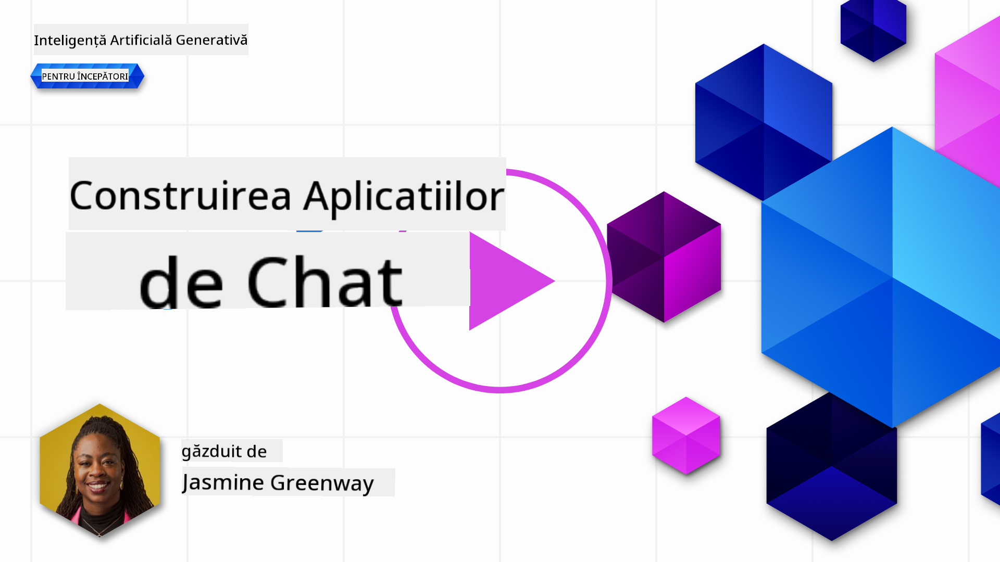
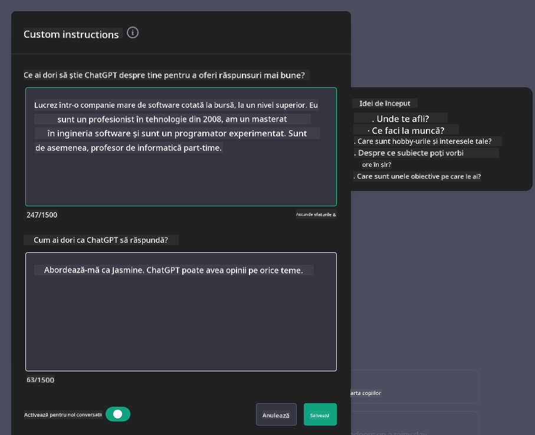
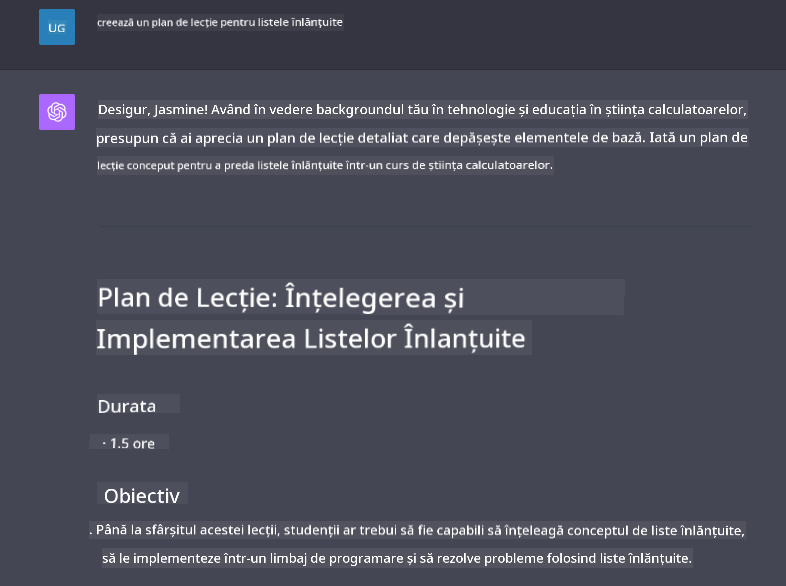

<!--
CO_OP_TRANSLATOR_METADATA:
{
  "original_hash": "ea4bbe640847aafbbba14dae4625e9af",
  "translation_date": "2025-06-25T15:56:49+00:00",
  "source_file": "07-building-chat-applications/README.md",
  "language_code": "ro"
}
-->
# Construirea aplicațiilor de chat alimentate de AI generativ

[](https://aka.ms/gen-ai-lessons7-gh?WT.mc_id=academic-105485-koreyst)

> _(Click pe imaginea de mai sus pentru a viziona videoclipul acestei lecții)_

Acum că am văzut cum putem construi aplicații de generare de text, să ne uităm la aplicațiile de chat.

Aplicațiile de chat au devenit parte integrantă a vieților noastre zilnice, oferind mai mult decât doar un mijloc de conversație casuală. Ele sunt părți integrale ale serviciului pentru clienți, suportului tehnic și chiar ale sistemelor de consiliere sofisticate. Este probabil ca ai primit ajutor de la o aplicație de chat nu cu mult timp în urmă. Pe măsură ce integrăm tehnologii mai avansate, precum AI generativ, în aceste platforme, complexitatea crește și la fel și provocările.

Unele întrebări la care trebuie să răspundem sunt:

- **Construirea aplicației**. Cum construim eficient și integrăm fără probleme aceste aplicații alimentate de AI pentru cazuri de utilizare specifice?
- **Monitorizare**. Odată ce sunt implementate, cum putem monitoriza și asigura că aplicațiile funcționează la cel mai înalt nivel de calitate, atât în ceea ce privește funcționalitatea, cât și aderarea la [cele șase principii ale AI responsabil](https://www.microsoft.com/ai/responsible-ai?WT.mc_id=academic-105485-koreyst)?

Pe măsură ce avansăm într-o eră definită de automatizare și interacțiuni om-mașină fără întreruperi, înțelegerea modului în care AI generativ transformă domeniul, profunzimea și adaptabilitatea aplicațiilor de chat devine esențială. Această lecție va investiga aspectele arhitecturale care susțin aceste sisteme complexe, va aprofunda metodologiile pentru ajustarea lor pentru sarcini specifice domeniului și va evalua metricile și considerațiile pertinente pentru asigurarea unei implementări responsabile a AI.

## Introducere

Această lecție acoperă:

- Tehnici pentru construirea și integrarea eficientă a aplicațiilor de chat.
- Cum să aplici personalizare și ajustare fină la aplicații.
- Strategii și considerații pentru monitorizarea eficientă a aplicațiilor de chat.

## Obiective de învățare

Până la sfârșitul acestei lecții, vei putea:

- Descrie considerațiile pentru construirea și integrarea aplicațiilor de chat în sistemele existente.
- Personaliza aplicațiile de chat pentru cazuri de utilizare specifice.
- Identifica metricile cheie și considerațiile pentru monitorizarea și menținerea calității aplicațiilor de chat alimentate de AI.
- Asigura că aplicațiile de chat folosesc AI responsabil.

## Integrarea AI generativ în aplicațiile de chat

Elevarea aplicațiilor de chat prin AI generativ nu se concentrează doar pe a le face mai inteligente; este vorba despre optimizarea arhitecturii, performanței și interfeței utilizatorului pentru a oferi o experiență de calitate. Aceasta implică investigarea fundamentelor arhitecturale, integrările API și considerațiile de interfață utilizator. Această secțiune își propune să ofere un ghid cuprinzător pentru navigarea acestor peisaje complexe, fie că le integrezi în sistemele existente, fie că le construiești ca platforme independente.

Până la sfârșitul acestei secțiuni, vei fi echipat cu expertiza necesară pentru a construi și a încorpora eficient aplicații de chat.

### Chatbot sau aplicație de chat?

Înainte de a ne aprofunda în construirea aplicațiilor de chat, să comparăm 'chatboturile' cu 'aplicațiile de chat alimentate de AI', care servesc roluri și funcționalități distincte. Scopul principal al unui chatbot este de a automatiza sarcini conversaționale specifice, cum ar fi răspunsul la întrebări frecvente sau urmărirea unui pachet. Este guvernat de obicei de logică bazată pe reguli sau algoritmi AI complexi. În contrast, o aplicație de chat alimentată de AI este un mediu mult mai extins, conceput pentru a facilita diverse forme de comunicare digitală, cum ar fi chat-uri text, vocale și video între utilizatori umani. Caracteristica sa definitorie este integrarea unui model AI generativ care simulează conversații nuanțate, asemănătoare cu cele umane, generând răspunsuri bazate pe o varietate largă de inputuri și indicii contextuale. O aplicație de chat alimentată de AI generativ poate să se angajeze în discuții deschise, să se adapteze la contexte conversaționale în evoluție și chiar să producă dialoguri creative sau complexe.

Tabelul de mai jos subliniază diferențele și asemănările cheie pentru a ne ajuta să înțelegem rolurile lor unice în comunicarea digitală.

| Chatbot                               | Aplicație de chat alimentată de AI generativ |
| ------------------------------------- | ------------------------------------------- |
| Focalizat pe sarcini și bazat pe reguli | Conștient de context                         |
| Adesea integrat în sisteme mai mari   | Poate găzdui unul sau mai mulți chatbots    |
| Limitat la funcții programate         | Încorporează modele AI generative            |
| Interacțiuni specializate și structurate | Capabil de discuții deschise                |

### Valorificarea funcționalităților pre-construite cu SDK-uri și API-uri

Când construiești o aplicație de chat, un prim pas excelent este să evaluezi ce există deja. Utilizarea SDK-urilor și API-urilor pentru construirea aplicațiilor de chat este o strategie avantajoasă din mai multe motive. Prin integrarea SDK-urilor și API-urilor bine documentate, îți poziționezi strategic aplicația pentru succes pe termen lung, abordând preocupările legate de scalabilitate și întreținere.

- **Accelerarea procesului de dezvoltare și reducerea cheltuielilor generale**: Bazându-te pe funcționalități pre-construite în locul procesului costisitor de a le construi singur îți permite să te concentrezi pe alte aspecte ale aplicației tale pe care le consideri mai importante, cum ar fi logica de afaceri.
- **Performanță mai bună**: Când construiești funcționalitatea de la zero, în cele din urmă te vei întreba "Cum se scalează? Este această aplicație capabilă să gestioneze un aflux brusc de utilizatori?" SDK-urile și API-urile bine întreținute au adesea soluții încorporate pentru aceste preocupări.
- **Întreținere mai ușoară**: Actualizările și îmbunătățirile sunt mai ușor de gestionat, deoarece majoritatea API-urilor și SDK-urilor necesită pur și simplu o actualizare la o bibliotecă atunci când se lansează o versiune mai nouă.
- **Acces la tehnologie de vârf**: Valorificarea modelelor care au fost ajustate și antrenate pe seturi de date extinse oferă aplicației tale capacități de limbaj natural.

Accesarea funcționalității unui SDK sau API implică de obicei obținerea permisiunii de a utiliza serviciile furnizate, ceea ce se face adesea prin utilizarea unei chei unice sau a unui token de autentificare. Vom folosi Biblioteca Python OpenAI pentru a explora cum arată acest lucru. Poți încerca și tu în următorul [notebook pentru OpenAI](../../../07-building-chat-applications/python/oai-assignment.ipynb) sau [notebook pentru Azure OpenAI Services](../../../07-building-chat-applications/python/aoai-assignment.ipynb) pentru această lecție.

```python
import os
from openai import OpenAI

API_KEY = os.getenv("OPENAI_API_KEY","")

client = OpenAI(
    api_key=API_KEY
    )

chat_completion = client.chat.completions.create(model="gpt-3.5-turbo", messages=[{"role": "user", "content": "Suggest two titles for an instructional lesson on chat applications for generative AI."}])
```

Exemplul de mai sus folosește modelul GPT-3.5 Turbo pentru a completa promptul, dar observă că cheia API este setată înainte de a face acest lucru. Ai primi o eroare dacă nu ai seta cheia.

## Experiența utilizatorului (UX)

Principiile generale de UX se aplică aplicațiilor de chat, dar aici sunt câteva considerații suplimentare care devin deosebit de importante datorită componentelor de învățare automată implicate.

- **Mecanism pentru abordarea ambiguității**: Modelele AI generative generează ocazional răspunsuri ambigue. O funcție care permite utilizatorilor să ceară clarificări poate fi utilă în cazul în care întâlnesc această problemă.
- **Retenția contextului**: Modelele AI generative avansate au capacitatea de a-și aminti contextul în cadrul unei conversații, ceea ce poate fi un atu necesar pentru experiența utilizatorului. Oferirea utilizatorilor posibilitatea de a controla și gestiona contextul îmbunătățește experiența utilizatorului, dar introduce riscul de a reține informații sensibile ale utilizatorilor. Considerațiile privind durata de stocare a acestor informații, cum ar fi introducerea unei politici de retenție, pot echilibra necesitatea contextului cu confidențialitatea.
- **Personalizare**: Cu capacitatea de a învăța și adapta, modelele AI oferă o experiență individualizată pentru un utilizator. Personalizarea experienței utilizatorului prin funcții precum profiluri de utilizator nu doar că face utilizatorul să se simtă înțeles, dar îl ajută și în căutarea de răspunsuri specifice, creând o interacțiune mai eficientă și satisfăcătoare.

Un astfel de exemplu de personalizare este setările "Instrucțiuni personalizate" în ChatGPT-ul OpenAI. Îți permite să furnizezi informații despre tine care pot fi context important pentru solicitările tale. Iată un exemplu de instrucțiune personalizată.



Acest "profil" solicită ChatGPT să creeze un plan de lecție despre listele legate. Observă că ChatGPT ia în considerare faptul că utilizatorul poate dori un plan de lecție mai detaliat bazat pe experiența sa.



### Cadrul de Mesaje de Sistem al Microsoft pentru Modele de Limbaj Mare

[Microsoft a oferit îndrumări](https://learn.microsoft.com/azure/ai-services/openai/concepts/system-message#define-the-models-output-format?WT.mc_id=academic-105485-koreyst) pentru scrierea mesajelor de sistem eficiente atunci când generează răspunsuri de la LLM-uri împărțite în 4 domenii:

1. Definirea pentru cine este modelul, precum și capacitățile și limitările sale.
2. Definirea formatului de ieșire al modelului.
3. Furnizarea de exemple specifice care demonstrează comportamentul dorit al modelului.
4. Furnizarea de balustrade suplimentare de comportament.

### Accesibilitate

Indiferent dacă un utilizator are deficiențe vizuale, auditive, motorii sau cognitive, o aplicație de chat bine concepută ar trebui să fie utilizabilă de toți. Lista următoare descompune caracteristicile specifice menite să îmbunătățească accesibilitatea pentru diverse deficiențe ale utilizatorilor.

- **Caracteristici pentru deficiențe vizuale**: Temele cu contrast ridicat și textul redimensionabil, compatibilitatea cu cititoarele de ecran.
- **Caracteristici pentru deficiențe auditive**: Funcții de text-în-vorbire și vorbire-în-text, indicii vizuale pentru notificări audio.
- **Caracteristici pentru deficiențe motorii**: Suport pentru navigarea prin tastatură, comenzi vocale.
- **Caracteristici pentru deficiențe cognitive**: Opțiuni de limbaj simplificat.

## Personalizare și Ajustare Fină pentru Modele de Limbaj Specific Domeniului

Imaginează-ți o aplicație de chat care înțelege jargonul companiei tale și anticipează întrebările specifice pe care baza sa de utilizatori le are în mod obișnuit. Există câteva abordări demne de menționat:

- **Valorificarea modelelor DSL**. DSL înseamnă limbaj specific domeniului. Poți valorifica un așa-numit model DSL antrenat pe un domeniu specific pentru a înțelege conceptele și scenariile acestuia.
- **Aplicarea ajustării fine**. Ajustarea fină este procesul de antrenare suplimentară a modelului tău cu date specifice.

## Personalizare: Utilizarea unui DSL

Valorificarea modelelor de limbaj specific domeniului (DSL Models) poate îmbunătăți implicarea utilizatorului și oferirea de interacțiuni specializate, relevante contextual. Este un model care este antrenat sau ajustat pentru a înțelege și genera text legat de un domeniu, industrie sau subiect specific. Opțiunile pentru utilizarea unui model DSL pot varia de la antrenarea unuia de la zero, la utilizarea celor preexistente prin SDK-uri și API-uri. O altă opțiune este ajustarea fină, care implică preluarea unui model pre-antrenat existent și adaptarea acestuia pentru un domeniu specific.

## Personalizare: Aplicarea ajustării fine

Ajustarea fină este adesea considerată atunci când un model pre-antrenat nu reușește într-un domeniu specializat sau într-o sarcină specifică.

De exemplu, întrebările medicale sunt complexe și necesită mult context. Când un profesionist medical diagnostichează un pacient, se bazează pe o varietate de factori, cum ar fi stilul de viață sau condițiile preexistente, și poate chiar să se bazeze pe reviste medicale recente pentru a valida diagnosticul său. În astfel de scenarii nuanțate, o aplicație AI de chat de uz general nu poate fi o sursă de încredere.

### Scenariu: o aplicație medicală

Consideră o aplicație de chat concepută pentru a asista practicienii medicali prin furnizarea de referințe rapide la ghiduri de tratament, interacțiuni medicamentoase sau descoperiri de cercetare recente.

Un model de uz general ar putea fi adecvat pentru a răspunde la întrebări medicale de bază sau pentru a oferi sfaturi generale, dar poate întâmpina dificultăți cu următoarele:

- **Cazuri foarte specifice sau complexe**. De exemplu, un neurolog ar putea întreba aplicația, "Care sunt cele mai bune practici actuale pentru gestionarea epilepsiei rezistente la medicamente la pacienții pediatrici?"
- **Lipsa progreselor recente**. Un model de uz general ar putea avea dificultăți în a oferi un răspuns actualizat care să încorporeze cele mai recente progrese în neurologie și farmacologie.

În astfel de cazuri, ajustarea fină a modelului cu un set de date medicale specializate poate îmbunătăți semnificativ capacitatea sa de a gestiona aceste întrebări medicale complexe mai precis și mai fiabil. Aceasta necesită acces la un set de date mare și relevant care reprezintă provocările și întrebările specifice domeniului care trebuie abordate.

## Considerații pentru o Experiență de Chat de Înaltă Calitate Alimentată de AI

Această secțiune subliniază criteriile pentru aplicații de chat "de înaltă calitate", care includ captarea de metrici acționabile și aderarea la un cadru care valorifică responsabil tehnologia AI.

### Metrici Cheie

Pentru a menține performanța de înaltă calitate a unei aplicații, este esențial să urmărești metrici și considerații cheie. Aceste măsurători nu doar asigură funcționalitatea aplicației, ci evaluează și calitatea modelului AI și experiența utilizatorului. Mai jos este o listă care acoperă metrici de bază, AI și experiența utilizatorului de luat în considerare.

| Metrică                         | Definiție                                                                                                             | Considerații pentru Dezvoltatorul de Chat                                  |
| ----------------------------- | ---------------------------------------------------------------------------------------------------------------------- | ------------------------------------------------------------------------- |
| **Uptime**                    | Măsoară timpul în care aplicația este operațională și accesibilă de utilizatori.                                       | Cum vei minimiza timpul de nefuncționare?                                 |
| **Timp de răspuns**           | Timpul necesar aplicației pentru a răspunde la o interogare a utilizatorului.                                           | Cum poți optimiza procesarea interogărilor pentru a îmbunătăți timpul de răspuns? |
| **Precizie**                  | Raportul predicțiilor pozitive adevărate la numărul total de predicții pozitive                                         | Cum vei valida precizia modelului tău?                                    |
| **Recall (Sensibilitate)**    | Raportul predicțiilor pozitive adevărate la numărul real de pozitive                                                   | Cum vei măsura și îmbunătăți recall-ul?                                    |
| **Scor F1**                   | Media armonică a preciziei și recall-ului, care echilibrează compromisul între ambele.                                  | Care este scorul F1 țintă? Cum vei echilibra precizia și recall-ul?       |
| **Perplexitate**              | Măsoară

**Declinarea responsabilității**:  
Acest document a fost tradus folosind serviciul de traducere AI [Co-op Translator](https://github.com/Azure/co-op-translator). Deși ne străduim să asigurăm acuratețea, vă rugăm să fiți conștienți că traducerile automate pot conține erori sau inexactități. Documentul original în limba sa nativă ar trebui considerat sursa autoritară. Pentru informații critice, se recomandă traducerea profesională umană. Nu ne asumăm responsabilitatea pentru neînțelegeri sau interpretări greșite care ar putea rezulta din utilizarea acestei traduceri.