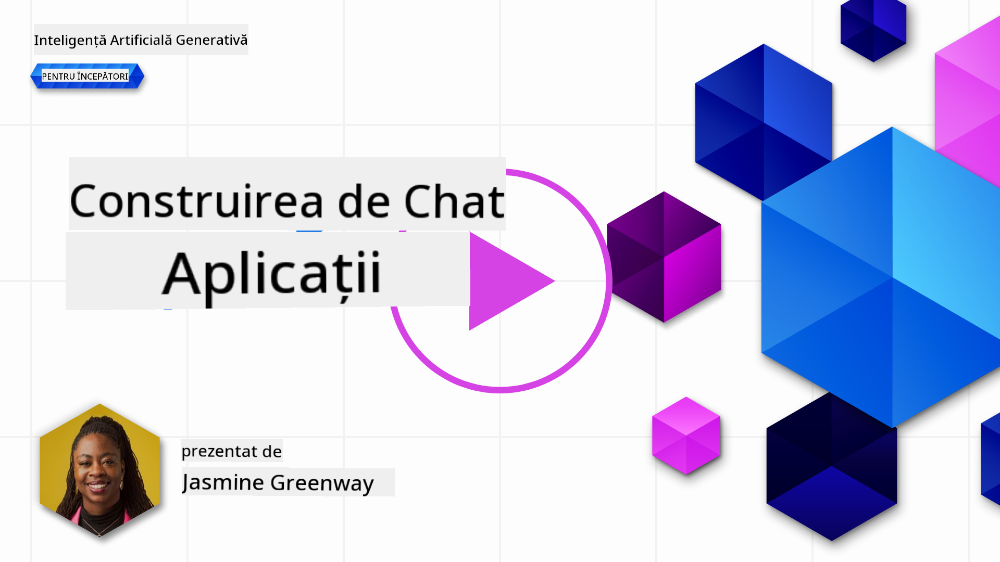
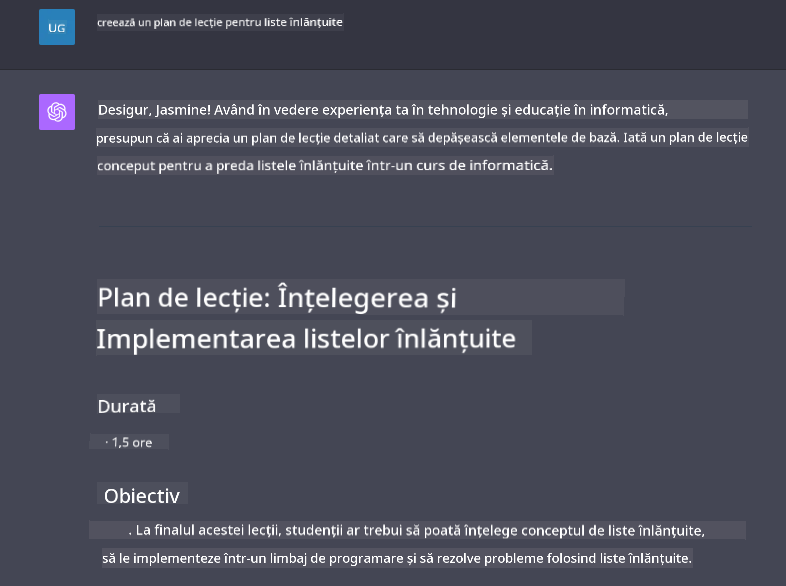

<!--
CO_OP_TRANSLATOR_METADATA:
{
  "original_hash": "a5308963a56cfbad2d73b0fa99fe84b3",
  "translation_date": "2025-10-17T22:10:02+00:00",
  "source_file": "07-building-chat-applications/README.md",
  "language_code": "ro"
}
-->
# Construirea aplicațiilor de chat bazate pe AI generativ

[](https://youtu.be/R9V0ZY1BEQo?si=IHuU-fS9YWT8s4sA)

> _(Faceți clic pe imaginea de mai sus pentru a viziona videoclipul lecției)_

Acum că am văzut cum putem construi aplicații de generare de text, să analizăm aplicațiile de chat.

Aplicațiile de chat au devenit parte integrantă a vieții noastre de zi cu zi, oferind mai mult decât un mijloc de conversație casuală. Ele sunt componente esențiale ale serviciului pentru clienți, suportului tehnic și chiar ale sistemelor sofisticate de consultanță. Probabil că ați primit ajutor de la o aplicație de chat nu cu mult timp în urmă. Pe măsură ce integrăm tehnologii mai avansate, cum ar fi AI generativ, în aceste platforme, complexitatea crește, la fel și provocările.

Câteva întrebări la care trebuie să răspundem sunt:

- **Construirea aplicației**. Cum construim eficient și integrăm fără probleme aceste aplicații bazate pe AI pentru cazuri de utilizare specifice?
- **Monitorizare**. Odată implementate, cum putem monitoriza și asigura că aplicațiile funcționează la cel mai înalt nivel de calitate, atât în ceea ce privește funcționalitatea, cât și respectarea [celor șase principii ale AI responsabil](https://www.microsoft.com/ai/responsible-ai?WT.mc_id=academic-105485-koreyst)?

Pe măsură ce avansăm într-o eră definită de automatizare și interacțiuni om-mașină fără întreruperi, înțelegerea modului în care AI generativ transformă domeniul, profunzimea și adaptabilitatea aplicațiilor de chat devine esențială. Această lecție va investiga aspectele arhitecturale care susțin aceste sisteme complexe, va analiza metodologiile de ajustare pentru sarcini specifice domeniului și va evalua metricile și considerațiile relevante pentru asigurarea implementării responsabile a AI.

## Introducere

Această lecție acoperă:

- Tehnici pentru construirea și integrarea eficientă a aplicațiilor de chat.
- Cum să aplicați personalizarea și ajustarea aplicațiilor.
- Strategii și considerații pentru monitorizarea eficientă a aplicațiilor de chat.

## Obiective de învățare

Până la sfârșitul acestei lecții, veți putea:

- Să descrieți considerațiile pentru construirea și integrarea aplicațiilor de chat în sistemele existente.
- Să personalizați aplicațiile de chat pentru cazuri de utilizare specifice.
- Să identificați metrici cheie și considerații pentru monitorizarea și menținerea calității aplicațiilor de chat bazate pe AI.
- Să asigurați că aplicațiile de chat utilizează AI în mod responsabil.

## Integrarea AI generativ în aplicațiile de chat

Îmbunătățirea aplicațiilor de chat prin AI generativ nu se concentrează doar pe a le face mai inteligente; este vorba despre optimizarea arhitecturii, performanței și interfeței utilizatorului pentru a oferi o experiență de utilizare de calitate. Acest lucru implică investigarea fundațiilor arhitecturale, integrările API și considerațiile privind interfața utilizatorului. Această secțiune își propune să vă ofere o foaie de parcurs cuprinzătoare pentru navigarea acestor peisaje complexe, fie că le integrați în sisteme existente, fie că le construiți ca platforme independente.

Până la sfârșitul acestei secțiuni, veți fi echipat cu expertiza necesară pentru a construi și a încorpora eficient aplicații de chat.

### Chatbot sau aplicație de chat?

Înainte de a ne aprofunda în construirea aplicațiilor de chat, să comparăm „chatboturile” cu „aplicațiile de chat bazate pe AI”, care au roluri și funcționalități distincte. Scopul principal al unui chatbot este de a automatiza sarcini conversaționale specifice, cum ar fi răspunsul la întrebări frecvente sau urmărirea unui pachet. Este de obicei guvernat de logica bazată pe reguli sau algoritmi AI complexi. În contrast, o aplicație de chat bazată pe AI este un mediu mult mai extins, conceput pentru a facilita diverse forme de comunicare digitală, cum ar fi chatul text, vocal și video între utilizatori umani. Caracteristica sa definitorie este integrarea unui model AI generativ care simulează conversații nuanțate, asemănătoare celor umane, generând răspunsuri bazate pe o varietate de intrări și indicii contextuale. O aplicație de chat bazată pe AI generativ poate angaja discuții deschise, se poate adapta la contexte conversaționale în evoluție și poate produce chiar dialoguri creative sau complexe.

Tabelul de mai jos evidențiază diferențele și asemănările cheie pentru a ne ajuta să înțelegem rolurile lor unice în comunicarea digitală.

| Chatbot                               | Aplicație de chat bazată pe AI generativ |
| ------------------------------------- | ---------------------------------------- |
| Focalizat pe sarcini și bazat pe reguli | Conștient de context                     |
| Adesea integrat în sisteme mai mari   | Poate găzdui unul sau mai mulți chatboți |
| Limitat la funcții programate         | Încorporează modele AI generative        |
| Interacțiuni specializate și structurate | Capabil de discuții deschise            |

### Utilizarea funcționalităților predefinite cu SDK-uri și API-uri

Când construiți o aplicație de chat, un prim pas excelent este să evaluați ce există deja. Utilizarea SDK-urilor și API-urilor pentru construirea aplicațiilor de chat este o strategie avantajoasă din mai multe motive. Prin integrarea SDK-urilor și API-urilor bine documentate, poziționați strategic aplicația dvs. pentru succes pe termen lung, abordând preocupările legate de scalabilitate și întreținere.

- **Accelerează procesul de dezvoltare și reduce costurile**: Bazându-vă pe funcționalități predefinite în loc să le construiți singur, vă permite să vă concentrați pe alte aspecte ale aplicației, cum ar fi logica de afaceri.
- **Performanță mai bună**: Când construiți funcționalități de la zero, vă veți întreba în cele din urmă „Cum se scalează? Este această aplicație capabilă să gestioneze un aflux brusc de utilizatori?” SDK-urile și API-urile bine întreținute au adesea soluții integrate pentru aceste preocupări.
- **Întreținere mai ușoară**: Actualizările și îmbunătățirile sunt mai ușor de gestionat, deoarece majoritatea API-urilor și SDK-urilor necesită doar o actualizare a unei biblioteci atunci când este lansată o versiune mai nouă.
- **Acces la tehnologie de vârf**: Utilizarea modelelor care au fost ajustate și antrenate pe seturi de date extinse oferă aplicației dvs. capacități naturale de procesare a limbajului.

Accesarea funcționalității unui SDK sau API implică de obicei obținerea permisiunii de a utiliza serviciile furnizate, ceea ce se face adesea prin utilizarea unei chei unice sau a unui token de autentificare. Vom folosi biblioteca Python OpenAI pentru a explora cum arată acest lucru. Puteți încerca și dvs. în următorul [notebook pentru OpenAI](./python/oai-assignment.ipynb?WT.mc_id=academic-105485-koreyst) sau [notebook pentru Azure OpenAI Services](./python/aoai-assignment.ipynb?WT.mc_id=academic-105485-koreys) pentru această lecție.

```python
import os
from openai import OpenAI

API_KEY = os.getenv("OPENAI_API_KEY","")

client = OpenAI(
    api_key=API_KEY
    )

chat_completion = client.chat.completions.create(model="gpt-3.5-turbo", messages=[{"role": "user", "content": "Suggest two titles for an instructional lesson on chat applications for generative AI."}])
```

Exemplul de mai sus folosește modelul GPT-3.5 Turbo pentru a completa promptul, dar observați că cheia API este setată înainte de a face acest lucru. Veți primi o eroare dacă nu setați cheia.

## Experiența utilizatorului (UX)

Principiile generale ale UX se aplică aplicațiilor de chat, dar iată câteva considerații suplimentare care devin deosebit de importante datorită componentelor de învățare automată implicate.

- **Mecanism pentru abordarea ambiguității**: Modelele AI generative generează ocazional răspunsuri ambigue. O funcție care permite utilizatorilor să ceară clarificări poate fi utilă în cazul în care se confruntă cu această problemă.
- **Păstrarea contextului**: Modelele AI generative avansate au capacitatea de a reține contextul într-o conversație, ceea ce poate fi un atu necesar pentru experiența utilizatorului. Oferirea utilizatorilor posibilitatea de a controla și gestiona contextul îmbunătățește experiența utilizatorului, dar introduce riscul de a păstra informații sensibile ale utilizatorului. Considerațiile privind durata de stocare a acestor informații, cum ar fi introducerea unei politici de păstrare, pot echilibra nevoia de context cu confidențialitatea.
- **Personalizare**: Cu capacitatea de a învăța și de a se adapta, modelele AI oferă o experiență individualizată pentru utilizator. Personalizarea experienței utilizatorului prin funcții precum profilurile utilizatorilor nu doar că face utilizatorul să se simtă înțeles, dar îl ajută și în căutarea de răspunsuri specifice, creând o interacțiune mai eficientă și satisfăcătoare.

Un astfel de exemplu de personalizare este setarea „Instrucțiuni personalizate” în ChatGPT de la OpenAI. Aceasta vă permite să furnizați informații despre dvs. care pot fi un context important pentru prompturile dvs. Iată un exemplu de instrucțiune personalizată.


Acest „profil” determină ChatGPT să creeze un plan de lecție despre listele înlănțuite. Observați că ChatGPT ia în considerare faptul că utilizatorul ar putea dori un plan de lecție mai detaliat, bazat pe experiența sa.



### Cadrul de mesaje de sistem al Microsoft pentru modelele de limbaj extins

[Microsoft a oferit îndrumări](https://learn.microsoft.com/azure/ai-services/openai/concepts/system-message#define-the-models-output-format?WT.mc_id=academic-105485-koreyst) pentru redactarea mesajelor de sistem eficiente atunci când se generează răspunsuri din modele de limbaj extins, împărțite în 4 domenii:

1. Definirea pentru cine este modelul, precum și a capacităților și limitărilor acestuia.
2. Definirea formatului de ieșire al modelului.
3. Furnizarea de exemple specifice care demonstrează comportamentul dorit al modelului.
4. Furnizarea de măsuri suplimentare de protecție comportamentală.

### Accesibilitate

Indiferent dacă un utilizator are deficiențe vizuale, auditive, motorii sau cognitive, o aplicație de chat bine concepută ar trebui să fie utilizabilă de toți. Lista de mai jos detaliază caracteristici specifice menite să îmbunătățească accesibilitatea pentru diverse deficiențe ale utilizatorilor.

- **Caracteristici pentru deficiențe vizuale**: Teme cu contrast ridicat și text redimensionabil, compatibilitate cu cititoarele de ecran.
- **Caracteristici pentru deficiențe auditive**: Funcții de text-to-speech și speech-to-text, indicii vizuale pentru notificările audio.
- **Caracteristici pentru deficiențe motorii**: Suport pentru navigare cu tastatura, comenzi vocale.
- **Caracteristici pentru deficiențe cognitive**: Opțiuni de limbaj simplificat.

## Personalizare și ajustare pentru modele de limbaj specifice domeniului

Imaginați-vă o aplicație de chat care înțelege jargonul companiei dvs. și anticipează întrebările specifice pe care utilizatorii săi le au frecvent. Există câteva abordări care merită menționate:

- **Utilizarea modelelor DSL**. DSL înseamnă limbaj specific domeniului. Puteți utiliza un așa-numit model DSL antrenat pe un domeniu specific pentru a înțelege conceptele și scenariile acestuia.
- **Aplicarea ajustării**. Ajustarea este procesul de antrenare suplimentară a modelului cu date specifice.

## Personalizare: Utilizarea unui DSL

Utilizarea modelelor de limbaj specific domeniului (DSL Models) poate îmbunătăți implicarea utilizatorilor prin furnizarea de interacțiuni specializate și relevante contextual. Este un model care este antrenat sau ajustat pentru a înțelege și genera text legat de un anumit domeniu, industrie sau subiect. Opțiunile pentru utilizarea unui model DSL pot varia de la antrenarea unuia de la zero, la utilizarea celor preexistente prin SDK-uri și API-uri. O altă opțiune este ajustarea, care implică adaptarea unui model pre-antrenat pentru un domeniu specific.

## Personalizare: Aplicarea ajustării

Ajustarea este adesea considerată atunci când un model pre-antrenat nu este suficient într-un domeniu specializat sau o sarcină specifică.

De exemplu, întrebările medicale sunt complexe și necesită mult context. Când un profesionist medical diagnostichează un pacient, se bazează pe o varietate de factori, cum ar fi stilul de viață sau condițiile preexistente, și poate chiar să se bazeze pe jurnale medicale recente pentru a valida diagnosticul. În astfel de scenarii nuanțate, o aplicație de chat AI generală nu poate fi o sursă de încredere.

### Scenariu: o aplicație medicală

Luați în considerare o aplicație de chat concepută pentru a ajuta practicienii medicali prin furnizarea de referințe rapide la ghiduri de tratament, interacțiuni medicamentoase sau descoperiri recente de cercetare.

Un model general ar putea fi adecvat pentru a răspunde la întrebări medicale de bază sau pentru a oferi sfaturi generale, dar ar putea avea dificultăți cu următoarele:

- **Cazuri foarte specifice sau complexe**. De exemplu, un neurolog ar putea întreba aplicația: „Care sunt cele mai bune practici actuale pentru gestionarea epilepsiei rezistente la medicamente la pacienții pediatrici?”
- **Lipsa avansurilor recente**. Un model general ar putea avea dificultăți în a oferi un răspuns actualizat care să încorporeze cele mai recente avansuri în neurologie și farmacologie.

În astfel de cazuri, ajustarea modelului cu un set de date medicale specializat poate îmbunătăți semnificativ capacitatea acestuia de a gestiona aceste întrebări medicale complexe mai precis și mai fiabil. Acest lucru necesită acces la un set de date mare și relevant care reprezintă provocările și întrebările specifice domeniului care trebuie abordate.

## Considerații pentru o experiență de chat bazată pe AI de înaltă calitate

Această secțiune conturează criteriile pentru aplicații de chat „de înaltă calitate”, care includ captarea metricilor acționabile și respectarea unui cadru care utilizează tehnologia AI în mod responsabil.

### Metrici cheie

Pentru a menține performanța de înaltă calitate a unei aplicații, este esențial să urmăriți metrici cheie și considerații. Aceste măsurători nu doar că asigură funcționalitatea aplicației, dar evaluează și calitatea modelului AI și experiența utilizatorului. Mai jos este o listă care acoperă metrici de bază, AI și experiența utilizatorului de luat în considerare.

| Metrică                        | Definiție                                                                                                             | Considerații pentru dezvoltatorul de chat                                 |
| ------------------------------ | ---------------------------------------------------------------------------------------------------------------------- | ------------------------------------------------------------------------- |
| **Timp de funcționare**        | Măsoară timpul în care aplicația este operațională și accesibilă utilizatorilor.                                       | Cum veți minimiza perioadele de nefuncționare?                            |
| **Timp de răspuns**            | Timpul necesar aplicației pentru a răspunde la o interogare a utilizatorului.                                          | Cum puteți optimiza procesarea interogărilor pentru a îmbunătăți timpul de răspuns? |
| **Precizie**                   | Raportul dintre predicțiile pozitive adevărate și numărul total de predicții pozitive.                                 | Cum veți valida precizia modelului dvs.?                                  |
| **Recall (Sensibilitate)**     | Raportul dintre predicțiile pozitive adevărate și numărul real de pozitive.                                            | Cum veți măsura și îmbunătăți recall-ul?                                  |
| **Scor F1**                    | Media armonică a preciziei și recall-ului, care echilibrează compromisurile dintre cele două.                          | Care este scorul F1 țintă? Cum veți echilibra precizia și recall-ul?      |
| **Perplexitate**               | Măsoară cât
| **Detectarea Anomaliilor**    | Instrumente și tehnici pentru identificarea tiparelor neobișnuite care nu se conformează comportamentului așteptat. | Cum vei răspunde la anomalii?                                             |

### Implementarea Practicilor Responsabile de AI în Aplicațiile de Chat

Abordarea Microsoft privind AI Responsabilă a identificat șase principii care ar trebui să ghideze dezvoltarea și utilizarea AI. Mai jos sunt principiile, definiția lor și lucruri pe care un dezvoltator de chat ar trebui să le ia în considerare și de ce ar trebui să le trateze cu seriozitate.

| Principii              | Definiția Microsoft                                   | Considerații pentru Dezvoltatorul de Chat                               | De ce Este Important                                                                     |
| ---------------------- | ----------------------------------------------------- | ---------------------------------------------------------------------- | ---------------------------------------------------------------------------------------- |
| Echitate               | Sistemele AI ar trebui să trateze toți oamenii în mod echitabil. | Asigură-te că aplicația de chat nu discriminează pe baza datelor utilizatorului. | Pentru a construi încredere și incluziune între utilizatori; evită consecințele legale.   |
| Fiabilitate și Siguranță | Sistemele AI ar trebui să funcționeze fiabil și în siguranță. | Implementarea testelor și a măsurilor de siguranță pentru a minimiza erorile și riscurile. | Asigură satisfacția utilizatorilor și previne potențialele daune.                        |
| Confidențialitate și Securitate | Sistemele AI ar trebui să fie sigure și să respecte confidențialitatea. | Implementarea unor măsuri puternice de criptare și protecție a datelor. | Pentru a proteja datele sensibile ale utilizatorilor și a respecta legile privind confidențialitatea. |
| Incluziune             | Sistemele AI ar trebui să împuternicească pe toată lumea și să implice oamenii. | Proiectarea unei interfețe UI/UX accesibile și ușor de utilizat pentru diverse audiențe. | Asigură că o gamă mai largă de persoane poate utiliza aplicația în mod eficient.         |
| Transparență           | Sistemele AI ar trebui să fie ușor de înțeles.        | Oferirea de documentație clară și explicații pentru răspunsurile AI.   | Utilizatorii sunt mai predispuși să aibă încredere într-un sistem dacă pot înțelege cum sunt luate deciziile. |
| Responsabilitate       | Oamenii ar trebui să fie responsabili pentru sistemele AI. | Stabilirea unui proces clar pentru auditarea și îmbunătățirea deciziilor AI. | Permite îmbunătățirea continuă și măsuri corective în cazul greșelilor.                  |

## Temă

Vezi [tema](../../../07-building-chat-applications/python). Te va ghida printr-o serie de exerciții, de la rularea primelor solicitări de chat, la clasificarea și rezumarea textului și multe altele. Observă că temele sunt disponibile în diferite limbaje de programare!

## Felicitări! Continuă Călătoria

După ce ai finalizat această lecție, consultă [colecția de învățare AI Generativă](https://aka.ms/genai-collection?WT.mc_id=academic-105485-koreyst) pentru a continua să îți dezvolți cunoștințele despre AI Generativă!

Accesează Lecția 8 pentru a vedea cum poți începe [să construiești aplicații de căutare](../08-building-search-applications/README.md?WT.mc_id=academic-105485-koreyst)!

---

**Declinare de responsabilitate**:  
Acest document a fost tradus folosind serviciul de traducere AI [Co-op Translator](https://github.com/Azure/co-op-translator). Deși ne străduim să asigurăm acuratețea, vă rugăm să fiți conștienți că traducerile automate pot conține erori sau inexactități. Documentul original în limba sa maternă ar trebui considerat sursa autoritară. Pentru informații critice, se recomandă traducerea profesională realizată de un specialist uman. Nu ne asumăm responsabilitatea pentru eventualele neînțelegeri sau interpretări greșite care pot apărea din utilizarea acestei traduceri.