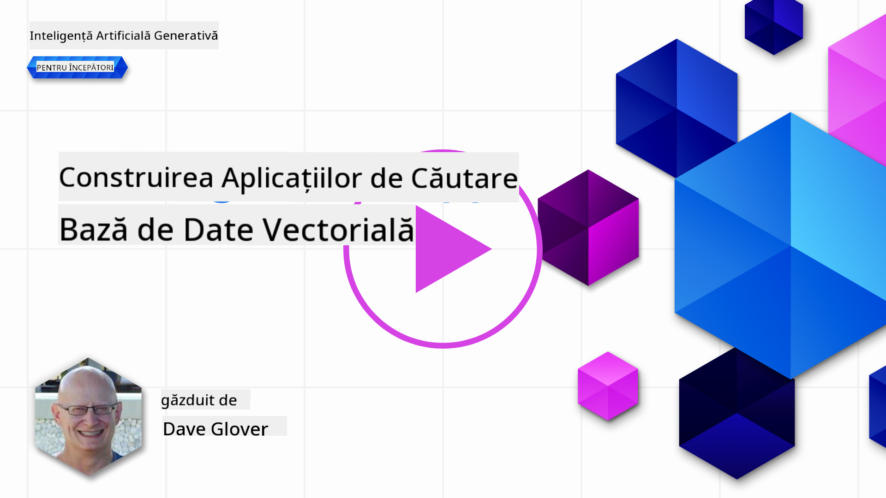
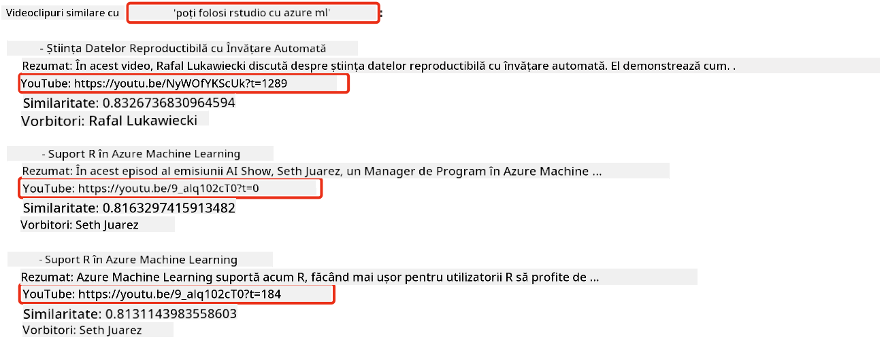

<!--
CO_OP_TRANSLATOR_METADATA:
{
  "original_hash": "d46aad0917a1a342d613e2c13d457da5",
  "translation_date": "2025-07-09T13:02:10+00:00",
  "source_file": "08-building-search-applications/README.md",
  "language_code": "ro"
}
-->
# Construirea unei aplicații de căutare

[](https://aka.ms/gen-ai-lesson8-gh?WT.mc_id=academic-105485-koreyst)

> > _Click pe imaginea de mai sus pentru a viziona videoclipul acestei lecții_

LLM-urile nu se rezumă doar la chatboți și generare de text. Este posibil să construiești și aplicații de căutare folosind Embeddings. Embeddings sunt reprezentări numerice ale datelor, cunoscute și ca vectori, și pot fi folosite pentru căutare semantică a datelor.

În această lecție, vei construi o aplicație de căutare pentru startup-ul nostru educațional. Startup-ul nostru este o organizație non-profit care oferă educație gratuită studenților din țările în curs de dezvoltare. Startup-ul nostru are un număr mare de videoclipuri YouTube pe care studenții le pot folosi pentru a învăța despre AI. Startup-ul dorește să construiască o aplicație de căutare care să permită studenților să caute un videoclip YouTube tastând o întrebare.

De exemplu, un student ar putea scrie „Ce sunt Jupyter Notebooks?” sau „Ce este Azure ML” iar aplicația de căutare va returna o listă de videoclipuri YouTube relevante pentru întrebare, iar mai mult, aplicația va returna un link către locul din videoclip unde se găsește răspunsul la întrebare.

## Introducere

În această lecție vom acoperi:

- Căutarea semantică vs căutarea pe cuvinte cheie.
- Ce sunt Text Embeddings.
- Crearea unui index de Text Embeddings.
- Căutarea într-un index de Text Embeddings.

## Obiective de învățare

După ce vei finaliza această lecție, vei putea:

- Să faci diferența între căutarea semantică și căutarea pe cuvinte cheie.
- Să explici ce sunt Text Embeddings.
- Să creezi o aplicație folosind Embeddings pentru a căuta date.

## De ce să construiești o aplicație de căutare?

Crearea unei aplicații de căutare te va ajuta să înțelegi cum să folosești Embeddings pentru a căuta date. De asemenea, vei învăța cum să construiești o aplicație de căutare care poate fi folosită de studenți pentru a găsi rapid informații.

Lecția include un Index de Embeddings pentru transcrierile YouTube ale canalului Microsoft [AI Show](https://www.youtube.com/playlist?list=PLlrxD0HtieHi0mwteKBOfEeOYf0LJU4O1). AI Show este un canal YouTube care te învață despre AI și machine learning. Indexul de Embeddings conține Embeddings pentru fiecare transcriere YouTube până în octombrie 2023. Vei folosi acest Index pentru a construi o aplicație de căutare pentru startup-ul nostru. Aplicația de căutare returnează un link către locul din videoclip unde se găsește răspunsul la întrebare. Aceasta este o metodă excelentă pentru studenți de a găsi rapid informațiile de care au nevoie.

Mai jos este un exemplu de interogare semantică pentru întrebarea „poți folosi rstudio cu azure ml?”. Verifică URL-ul YouTube, vei observa că URL-ul conține un timestamp care te duce exact la locul din videoclip unde se află răspunsul la întrebare.



## Ce este căutarea semantică?

Acum te-ai putea întreba, ce este căutarea semantică? Căutarea semantică este o tehnică de căutare care folosește semantica, sau sensul, cuvintelor dintr-o interogare pentru a returna rezultate relevante.

Iată un exemplu de căutare semantică. Să zicem că vrei să cumperi o mașină, ai putea căuta „mașina visurilor mele”, căutarea semantică înțelege că nu visezi la o mașină, ci cauți mașina ta „ideală”. Căutarea semantică înțelege intenția ta și returnează rezultate relevante. Alternativa este căutarea pe cuvinte cheie, care ar căuta literal „vise despre mașini” și adesea returnează rezultate irelevante.

## Ce sunt Text Embeddings?

[Text embeddings](https://en.wikipedia.org/wiki/Word_embedding?WT.mc_id=academic-105485-koreyst) sunt o tehnică de reprezentare a textului folosită în [procesarea limbajului natural](https://en.wikipedia.org/wiki/Natural_language_processing?WT.mc_id=academic-105485-koreyst). Text embeddings sunt reprezentări numerice semantice ale textului. Embeddings sunt folosite pentru a reprezenta datele într-un mod ușor de înțeles pentru o mașină. Există multe modele pentru construirea de text embeddings, în această lecție ne vom concentra pe generarea embeddings folosind modelul OpenAI Embedding.

Iată un exemplu, imaginează-ți că următorul text face parte dintr-o transcriere a unui episod de pe canalul AI Show de pe YouTube:

```text
Today we are going to learn about Azure Machine Learning.
```

Am trimite textul către API-ul OpenAI Embedding și acesta ar returna următorul embedding format din 1536 de numere, adică un vector. Fiecare număr din vector reprezintă un aspect diferit al textului. Pentru concizie, iată primele 10 numere din vector.

```python
[-0.006655829958617687, 0.0026128944009542465, 0.008792596869170666, -0.02446001023054123, -0.008540431968867779, 0.022071078419685364, -0.010703742504119873, 0.003311325330287218, -0.011632772162556648, -0.02187200076878071, ...]
```

## Cum este creat indexul de Embeddings?

Indexul de Embeddings pentru această lecție a fost creat cu o serie de scripturi Python. Vei găsi scripturile împreună cu instrucțiunile în [README](./scripts/README.md?WT.mc_id=academic-105485-koreyst) din folderul `scripts` pentru această lecție. Nu este necesar să rulezi aceste scripturi pentru a finaliza lecția, deoarece Indexul de Embeddings este furnizat.

Scripturile efectuează următoarele operațiuni:

1. Se descarcă transcrierea pentru fiecare videoclip YouTube din playlistul [AI Show](https://www.youtube.com/playlist?list=PLlrxD0HtieHi0mwteKBOfEeOYf0LJU4O1).
2. Folosind [OpenAI Functions](https://learn.microsoft.com/azure/ai-services/openai/how-to/function-calling?WT.mc_id=academic-105485-koreyst), se încearcă extragerea numelui vorbitorului din primele 3 minute ale transcrierii YouTube. Numele vorbitorului pentru fiecare videoclip este stocat în Indexul de Embeddings numit `embedding_index_3m.json`.
3. Textul transcrierii este apoi împărțit în segmente de text de **3 minute**. Segmentul include aproximativ 20 de cuvinte suprapuse din segmentul următor pentru a asigura că embedding-ul segmentului nu este întrerupt și pentru a oferi un context mai bun la căutare.
4. Fiecare segment de text este trimis apoi către API-ul OpenAI Chat pentru a rezuma textul în 60 de cuvinte. Rezumatul este de asemenea stocat în Indexul de Embeddings `embedding_index_3m.json`.
5. În final, textul segmentului este trimis către API-ul OpenAI Embedding. API-ul Embedding returnează un vector de 1536 de numere care reprezintă sensul semantic al segmentului. Segmentul împreună cu vectorul OpenAI Embedding este stocat în Indexul de Embeddings `embedding_index_3m.json`.

### Baze de date vectoriale

Pentru simplitatea lecției, Indexul de Embeddings este stocat într-un fișier JSON numit `embedding_index_3m.json` și încărcat într-un Pandas DataFrame. Totuși, în producție, Indexul de Embeddings ar fi stocat într-o bază de date vectorială precum [Azure Cognitive Search](https://learn.microsoft.com/training/modules/improve-search-results-vector-search?WT.mc_id=academic-105485-koreyst), [Redis](https://cookbook.openai.com/examples/vector_databases/redis/readme?WT.mc_id=academic-105485-koreyst), [Pinecone](https://cookbook.openai.com/examples/vector_databases/pinecone/readme?WT.mc_id=academic-105485-koreyst), [Weaviate](https://cookbook.openai.com/examples/vector_databases/weaviate/readme?WT.mc_id=academic-105485-koreyst), printre altele.

## Înțelegerea similarității cosinus

Am învățat despre text embeddings, următorul pas este să învățăm cum să folosim text embeddings pentru a căuta date și în special să găsim embeddings-urile cele mai similare cu o interogare dată folosind similaritatea cosinus.

### Ce este similaritatea cosinus?

Similaritatea cosinus este o măsură a asemănării dintre doi vectori, vei auzi adesea și termenul de `căutare cel mai apropiat vecin`. Pentru a efectua o căutare bazată pe similaritatea cosinus trebuie să _vectorizezi_ textul _interogării_ folosind API-ul OpenAI Embedding. Apoi calculezi _similaritatea cosinus_ între vectorul interogării și fiecare vector din Indexul de Embeddings. Amintește-ți, Indexul de Embeddings are un vector pentru fiecare segment de text din transcrierea YouTube. În final, sortezi rezultatele după similaritatea cosinus, iar segmentele de text cu cea mai mare similaritate cosinus sunt cele mai asemănătoare cu interogarea.

Din punct de vedere matematic, similaritatea cosinus măsoară cosinusul unghiului dintre doi vectori proiectați într-un spațiu multidimensional. Această măsurătoare este utilă deoarece dacă două documente sunt departe ca distanță euclidiană din cauza dimensiunii, ele pot avea totuși un unghi mai mic între ele și, prin urmare, o similaritate cosinus mai mare. Pentru mai multe informații despre ecuațiile similarității cosinus, vezi [Similaritatea cosinus](https://en.wikipedia.org/wiki/Cosine_similarity?WT.mc_id=academic-105485-koreyst).

## Construirea primei tale aplicații de căutare

În continuare, vom învăța cum să construim o aplicație de căutare folosind Embeddings. Aplicația de căutare va permite studenților să caute un videoclip tastând o întrebare. Aplicația va returna o listă de videoclipuri relevante pentru întrebare. De asemenea, aplicația va returna un link către locul din videoclip unde se găsește răspunsul la întrebare.

Această soluție a fost construită și testată pe Windows 11, macOS și Ubuntu 22.04 folosind Python 3.10 sau versiuni ulterioare. Poți descărca Python de pe [python.org](https://www.python.org/downloads/?WT.mc_id=academic-105485-koreyst).

## Tema - construirea unei aplicații de căutare pentru studenți

Am prezentat startup-ul nostru la începutul acestei lecții. Acum este timpul să le permiți studenților să construiască o aplicație de căutare pentru evaluările lor.

În această temă, vei crea serviciile Azure OpenAI care vor fi folosite pentru a construi aplicația de căutare. Vei crea următoarele servicii Azure OpenAI. Ai nevoie de un abonament Azure pentru a finaliza această temă.

### Pornește Azure Cloud Shell

1. Autentifică-te în [portalul Azure](https://portal.azure.com/?WT.mc_id=academic-105485-koreyst).
2. Selectează pictograma Cloud Shell din colțul din dreapta sus al portalului Azure.
3. Selectează **Bash** ca tip de mediu.

#### Creează un grup de resurse

> Pentru aceste instrucțiuni, folosim grupul de resurse numit „semantic-video-search” în East US.
> Poți schimba numele grupului de resurse, dar când schimbi locația resurselor,
> verifică [tabelul de disponibilitate al modelelor](https://aka.ms/oai/models?WT.mc_id=academic-105485-koreyst).

```shell
az group create --name semantic-video-search --location eastus
```

#### Creează o resursă Azure OpenAI Service

Din Azure Cloud Shell, rulează următoarea comandă pentru a crea o resursă Azure OpenAI Service.

```shell
az cognitiveservices account create --name semantic-video-openai --resource-group semantic-video-search \
    --location eastus --kind OpenAI --sku s0
```

#### Obține endpoint-ul și cheile pentru utilizare în această aplicație

Din Azure Cloud Shell, rulează următoarele comenzi pentru a obține endpoint-ul și cheile pentru resursa Azure OpenAI Service.

```shell
az cognitiveservices account show --name semantic-video-openai \
   --resource-group  semantic-video-search | jq -r .properties.endpoint
az cognitiveservices account keys list --name semantic-video-openai \
   --resource-group semantic-video-search | jq -r .key1
```

#### Desfășoară modelul OpenAI Embedding

Din Azure Cloud Shell, rulează următoarea comandă pentru a desfășura modelul OpenAI Embedding.

```shell
az cognitiveservices account deployment create \
    --name semantic-video-openai \
    --resource-group  semantic-video-search \
    --deployment-name text-embedding-ada-002 \
    --model-name text-embedding-ada-002 \
    --model-version "2"  \
    --model-format OpenAI \
    --sku-capacity 100 --sku-name "Standard"
```

## Soluția

Deschide [notebook-ul soluției](../../../08-building-search-applications/python/aoai-solution.ipynb) în GitHub Codespaces și urmează instrucțiunile din Jupyter Notebook.

Când rulezi notebook-ul, ți se va cere să introduci o interogare. Caseta de input va arăta astfel:


## Bravo! Continuă să înveți

După ce ai terminat această lecție, verifică colecția noastră de [Învățare AI Generativ](https://aka.ms/genai-collection?WT.mc_id=academic-105485-koreyst) pentru a-ți continua dezvoltarea cunoștințelor despre AI Generativ!

Mergi la Lecția 9 unde vom vedea cum să [construim aplicații de generare de imagini](../09-building-image-applications/README.md?WT.mc_id=academic-105485-koreyst)!

**Declinare de responsabilitate**:  
Acest document a fost tradus folosind serviciul de traducere AI [Co-op Translator](https://github.com/Azure/co-op-translator). Deși ne străduim pentru acuratețe, vă rugăm să rețineți că traducerile automate pot conține erori sau inexactități. Documentul original în limba sa nativă trebuie considerat sursa autorizată. Pentru informații critice, se recomandă traducerea profesională realizată de un specialist uman. Nu ne asumăm răspunderea pentru eventualele neînțelegeri sau interpretări greșite rezultate din utilizarea acestei traduceri.