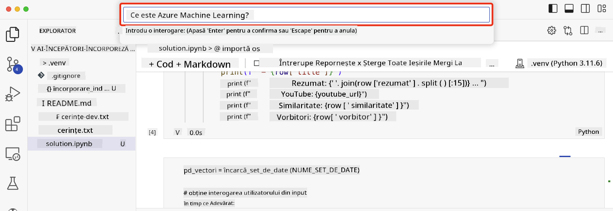

<!--
CO_OP_TRANSLATOR_METADATA:
{
  "original_hash": "d46aad0917a1a342d613e2c13d457da5",
  "translation_date": "2025-05-19T18:42:39+00:00",
  "source_file": "08-building-search-applications/README.md",
  "language_code": "ro"
}
-->
# Construirea unei aplicații de căutare

> > _Apasă pe imaginea de mai sus pentru a viziona videoclipul acestei lecții_

Există mai multe lucruri pe care le poți face cu LLM-urile decât chatboți și generare de text. Este posibil să construiești aplicații de căutare folosind Embeddings. Embeddings sunt reprezentări numerice ale datelor, cunoscute și ca vectori, și pot fi folosite pentru căutarea semantică a datelor.

În această lecție, vei construi o aplicație de căutare pentru startup-ul nostru educațional. Startup-ul nostru este o organizație non-profit care oferă educație gratuită studenților din țările în curs de dezvoltare. Startup-ul nostru are un număr mare de videoclipuri YouTube pe care studenții le pot folosi pentru a învăța despre AI. Startup-ul nostru dorește să construiască o aplicație de căutare care să permită studenților să caute un videoclip YouTube tastând o întrebare.

De exemplu, un student ar putea tasta 'Ce sunt Jupyter Notebooks?' sau 'Ce este Azure ML', iar aplicația de căutare va returna o listă de videoclipuri YouTube relevante pentru întrebare și, mai mult decât atât, aplicația de căutare va returna un link către locul din videoclip unde se află răspunsul la întrebare.

## Introducere

În această lecție, vom acoperi:

- Căutarea semantică vs căutarea pe bază de cuvinte cheie.
- Ce sunt Text Embeddings.
- Crearea unui Index de Text Embeddings.
- Căutarea într-un Index de Text Embeddings.

## Obiective de învățare

După finalizarea acestei lecții, vei putea:

- Face diferența între căutarea semantică și cea pe bază de cuvinte cheie.
- Explica ce sunt Text Embeddings.
- Crea o aplicație folosind Embeddings pentru a căuta date.

## De ce să construiești o aplicație de căutare?

Crearea unei aplicații de căutare te va ajuta să înțelegi cum să folosești Embeddings pentru a căuta date. De asemenea, vei învăța cum să construiești o aplicație de căutare care poate fi folosită de studenți pentru a găsi rapid informații.

Lecția include un Index de Embeddings al transcrierilor YouTube pentru canalul YouTube Microsoft [AI Show](https://www.youtube.com/playlist?list=PLlrxD0HtieHi0mwteKBOfEeOYf0LJU4O1). AI Show este un canal YouTube care te învață despre AI și machine learning. Indexul de Embeddings conține Embeddings pentru fiecare dintre transcrierile YouTube până în octombrie 2023. Vei folosi Indexul de Embeddings pentru a construi o aplicație de căutare pentru startup-ul nostru. Aplicația de căutare returnează un link către locul din videoclip unde se află răspunsul la întrebare. Aceasta este o modalitate excelentă pentru studenți de a găsi rapid informațiile de care au nevoie.

Următorul este un exemplu de interogare semantică pentru întrebarea 'poți folosi rstudio cu azure ml?'. Verifică url-ul YouTube, vei vedea că url-ul conține un timestamp care te duce la locul din videoclip unde se află răspunsul la întrebare.

## Ce este căutarea semantică?

Acum s-ar putea să te întrebi, ce este căutarea semantică? Căutarea semantică este o tehnică de căutare care folosește semantica, sau sensul, cuvintelor dintr-o interogare pentru a returna rezultate relevante.

Iată un exemplu de căutare semantică. Să spunem că dorești să cumperi o mașină, ai putea căuta 'mașina mea de vis', căutarea semantică înțelege că nu vorbești despre un vis despre o mașină, ci mai degrabă că dorești să cumperi mașina ta de vis. Căutarea semantică înțelege intenția ta și returnează rezultate relevante. Alternativa este o căutare pe bază de cuvinte cheie care ar căuta literal vise despre mașini și ar returna adesea rezultate irelevante.

## Ce sunt Text Embeddings?

[Text embeddings](https://en.wikipedia.org/wiki/Word_embedding?WT.mc_id=academic-105485-koreyst) sunt o tehnică de reprezentare a textului folosită în [procesarea limbajului natural](https://en.wikipedia.org/wiki/Natural_language_processing?WT.mc_id=academic-105485-koreyst). Text embeddings sunt reprezentări numerice semantice ale textului. Embeddings sunt folosite pentru a reprezenta datele într-un mod ușor de înțeles pentru o mașină. Există multe modele pentru construirea de text embeddings, în această lecție, ne vom concentra pe generarea de embeddings folosind Modelul de Embedding OpenAI.

Iată un exemplu, imaginează-ți că următorul text este într-o transcriere dintr-unul dintre episoadele de pe canalul YouTube AI Show:

```text
Today we are going to learn about Azure Machine Learning.
```

Am trimite textul la API-ul OpenAI Embedding și acesta ar returna următorul embedding format din 1536 de numere, cunoscut și sub numele de vector. Fiecare număr din vector reprezintă un aspect diferit al textului. Pentru concizie, iată primele 10 numere din vector.

```python
[-0.006655829958617687, 0.0026128944009542465, 0.008792596869170666, -0.02446001023054123, -0.008540431968867779, 0.022071078419685364, -0.010703742504119873, 0.003311325330287218, -0.011632772162556648, -0.02187200076878071, ...]
```

## Cum este creat indexul de Embeddings?

Indexul de Embeddings pentru această lecție a fost creat cu o serie de scripturi Python. Vei găsi scripturile împreună cu instrucțiunile în [README](./scripts/README.md?WT.mc_id=academic-105485-koreyst) în folderul 'scripts' pentru această lecție. Nu trebuie să rulezi aceste scripturi pentru a finaliza această lecție, deoarece Indexul de Embeddings este furnizat pentru tine.

Scripturile efectuează următoarele operațiuni:

1. Transcrierea pentru fiecare videoclip YouTube din playlistul [AI Show](https://www.youtube.com/playlist?list=PLlrxD0HtieHi0mwteKBOfEeOYf0LJU4O1) este descărcată.
2. Folosind [Funcțiile OpenAI](https://learn.microsoft.com/azure/ai-services/openai/how-to/function-calling?WT.mc_id=academic-105485-koreyst), se încearcă extragerea numelui vorbitorului din primele 3 minute ale transcrierii YouTube. Numele vorbitorului pentru fiecare videoclip este stocat în Indexul de Embeddings numit `embedding_index_3m.json`.
3. Textul transcrierii este apoi împărțit în **segmente de text de 3 minute**. Segmentul include aproximativ 20 de cuvinte care se suprapun cu segmentul următor pentru a asigura că Embedding-ul pentru segment nu este întrerupt și pentru a oferi un context mai bun de căutare.
4. Fiecare segment de text este apoi trimis la API-ul OpenAI Chat pentru a rezuma textul în 60 de cuvinte. Rezumatul este, de asemenea, stocat în Indexul de Embeddings `embedding_index_3m.json`.
5. În final, textul segmentului este trimis la API-ul OpenAI Embedding. API-ul Embedding returnează un vector de 1536 de numere care reprezintă semnificația semantică a segmentului. Segmentul împreună cu vectorul OpenAI Embedding este stocat într-un Index de Embeddings `embedding_index_3m.json`.

### Baze de date Vectoriale

Pentru simplitatea lecției, Indexul de Embeddings este stocat într-un fișier JSON numit `embedding_index_3m.json` și încărcat într-un Pandas DataFrame. Totuși, în producție, Indexul de Embeddings ar fi stocat într-o bază de date vectorială, cum ar fi [Azure Cognitive Search](https://learn.microsoft.com/training/modules/improve-search-results-vector-search?WT.mc_id=academic-105485-koreyst), [Redis](https://cookbook.openai.com/examples/vector_databases/redis/readme?WT.mc_id=academic-105485-koreyst), [Pinecone](https://cookbook.openai.com/examples/vector_databases/pinecone/readme?WT.mc_id=academic-105485-koreyst), [Weaviate](https://cookbook.openai.com/examples/vector_databases/weaviate/readme?WT.mc_id=academic-105485-koreyst), pentru a numi doar câteva.

## Înțelegerea similitudinii cosinusului

Am învățat despre text embeddings, următorul pas este să învățăm cum să folosim text embeddings pentru a căuta date și, în special, să găsim cele mai similare embeddings pentru o interogare dată folosind similitudinea cosinusului.

### Ce este similitudinea cosinusului?

Similitudinea cosinusului este o măsură a similitudinii între doi vectori, vei auzi de asemenea acest lucru menționat ca `nearest neighbor search`. Pentru a efectua o căutare a similitudinii cosinusului trebuie să _vectorizezi_ textul de _interogare_ folosind API-ul OpenAI Embedding. Apoi calculează _similitudinea cosinusului_ între vectorul de interogare și fiecare vector din Indexul de Embeddings. Amintește-ți, Indexul de Embeddings are un vector pentru fiecare segment de text al transcrierii YouTube. În final, sortează rezultatele după similitudinea cosinusului, iar segmentele de text cu cea mai mare similitudine cosinus sunt cele mai similare cu interogarea.

Dintr-o perspectivă matematică, similitudinea cosinusului măsoară cosinusul unghiului dintre doi vectori proiectați într-un spațiu multidimensional. Această măsurătoare este benefică, deoarece dacă două documente sunt departe unul de altul prin distanță euclidiană din cauza dimensiunii, ar putea totuși avea un unghi mai mic între ele și, prin urmare, o similitudine cosinus mai mare. Pentru mai multe informații despre ecuațiile similitudinii cosinusului, vezi [Similitudinea cosinusului](https://en.wikipedia.org/wiki/Cosine_similarity?WT.mc_id=academic-105485-koreyst).

## Construirea primei tale aplicații de căutare

În continuare, vom învăța cum să construim o aplicație de căutare folosind Embeddings. Aplicația de căutare va permite studenților să caute un videoclip tastând o întrebare. Aplicația de căutare va returna o listă de videoclipuri relevante pentru întrebare. Aplicația de căutare va returna, de asemenea, un link către locul din videoclip unde se află răspunsul la întrebare.

Această soluție a fost construită și testată pe Windows 11, macOS și Ubuntu 22.04 folosind Python 3.10 sau o versiune ulterioară. Poți descărca Python de la [python.org](https://www.python.org/downloads/?WT.mc_id=academic-105485-koreyst).

## Temă - construirea unei aplicații de căutare, pentru a permite studenților

Am introdus startup-ul nostru la începutul acestei lecții. Acum este momentul să permitem studenților să construiască o aplicație de căutare pentru evaluările lor.

În această temă, vei crea Serviciile Azure OpenAI care vor fi folosite pentru a construi aplicația de căutare. Vei crea următoarele Servicii Azure OpenAI. Vei avea nevoie de un abonament Azure pentru a finaliza această temă.

### Pornește Azure Cloud Shell

1. Conectează-te la [portalul Azure](https://portal.azure.com/?WT.mc_id=academic-105485-koreyst).
2. Selectează pictograma Cloud Shell din colțul din dreapta sus al portalului Azure.
3. Selectează **Bash** pentru tipul de mediu.

#### Crează un grup de resurse

> Pentru aceste instrucțiuni, folosim grupul de resurse numit "semantic-video-search" în East US.
> Poți schimba numele grupului de resurse, dar când schimbi locația pentru resurse,
> verifică [tabelul de disponibilitate a modelului](https://aka.ms/oai/models?WT.mc_id=academic-105485-koreyst).

```shell
az group create --name semantic-video-search --location eastus
```

#### Crează o resursă de Serviciu Azure OpenAI

Din Azure Cloud Shell, rulează următoarea comandă pentru a crea o resursă de Serviciu Azure OpenAI.

```shell
az cognitiveservices account create --name semantic-video-openai --resource-group semantic-video-search \
    --location eastus --kind OpenAI --sku s0
```

#### Obține endpoint-ul și cheile pentru utilizarea în această aplicație

Din Azure Cloud Shell, rulează următoarele comenzi pentru a obține endpoint-ul și cheile pentru resursa de Serviciu Azure OpenAI.

```shell
az cognitiveservices account show --name semantic-video-openai \
   --resource-group  semantic-video-search | jq -r .properties.endpoint
az cognitiveservices account keys list --name semantic-video-openai \
   --resource-group semantic-video-search | jq -r .key1
```

#### Desfășoară modelul de Embedding OpenAI

Din Azure Cloud Shell, rulează următoarea comandă pentru a desfășura modelul de Embedding OpenAI.

```shell
az cognitiveservices account deployment create \
    --name semantic-video-openai \
    --resource-group  semantic-video-search \
    --deployment-name text-embedding-ada-002 \
    --model-name text-embedding-ada-002 \
    --model-version "2"  \
    --model-format OpenAI \
    --sku-capacity 100 --sku-name "Standard"
```

## Soluție

Deschide [notebook-ul soluție](../../../08-building-search-applications/python/aoai-solution.ipynb) în GitHub Codespaces și urmează instrucțiunile din Jupyter Notebook.

Când rulezi notebook-ul, ți se va cere să introduci o interogare. Caseta de intrare va arăta astfel:



## Felicitări! Continuă învățarea

După ce ai finalizat această lecție, verifică [colecția noastră de învățare despre AI generativ](https://aka.ms/genai-collection?WT.mc_id=academic-105485-koreyst) pentru a continua să îți îmbunătățești cunoștințele despre AI generativ!

Treci la Lecția 9 unde vom analiza cum să [construim aplicații de generare a imaginilor](../09-building-image-applications/README.md?WT.mc_id=academic-105485-koreyst)!

**Declinarea responsabilității**:  
Acest document a fost tradus folosind serviciul de traducere AI [Co-op Translator](https://github.com/Azure/co-op-translator). Deși ne străduim să asigurăm acuratețea, vă rugăm să fiți conștienți de faptul că traducerile automate pot conține erori sau inexactități. Documentul original în limba sa maternă ar trebui considerat sursa autoritară. Pentru informații critice, se recomandă traducerea umană profesională. Nu ne asumăm răspunderea pentru neînțelegeri sau interpretări greșite care pot apărea din utilizarea acestei traduceri.